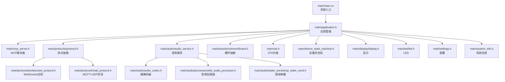
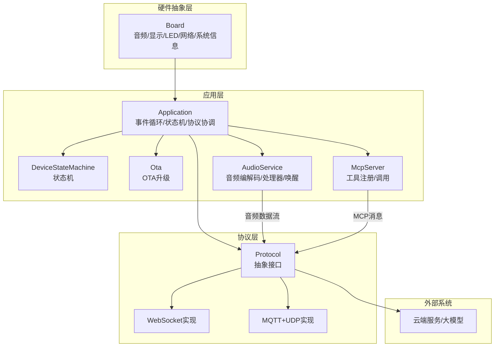
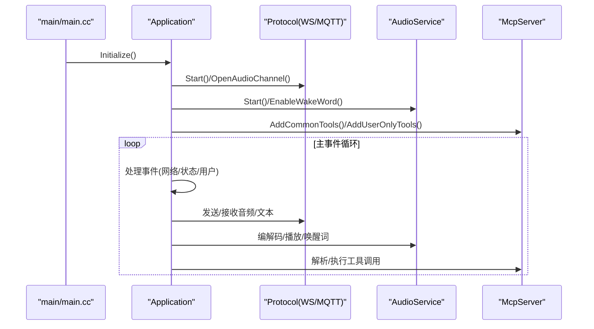
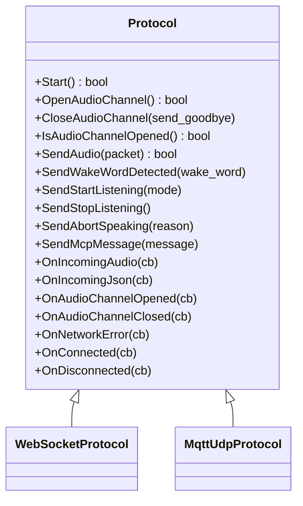
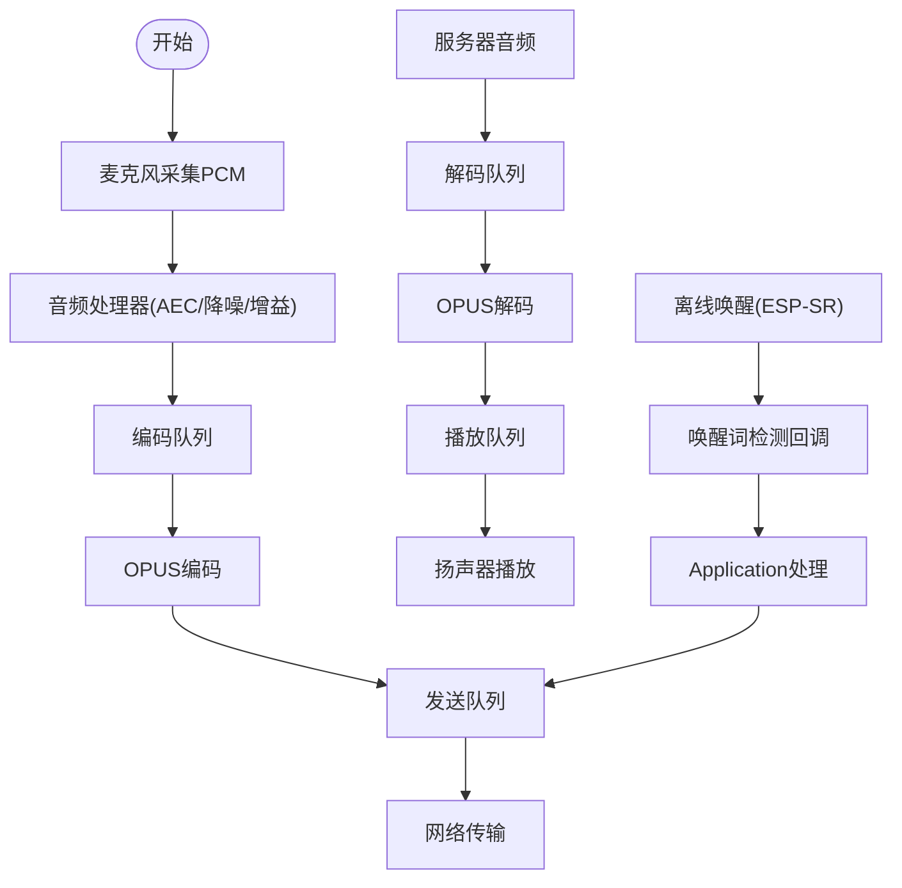
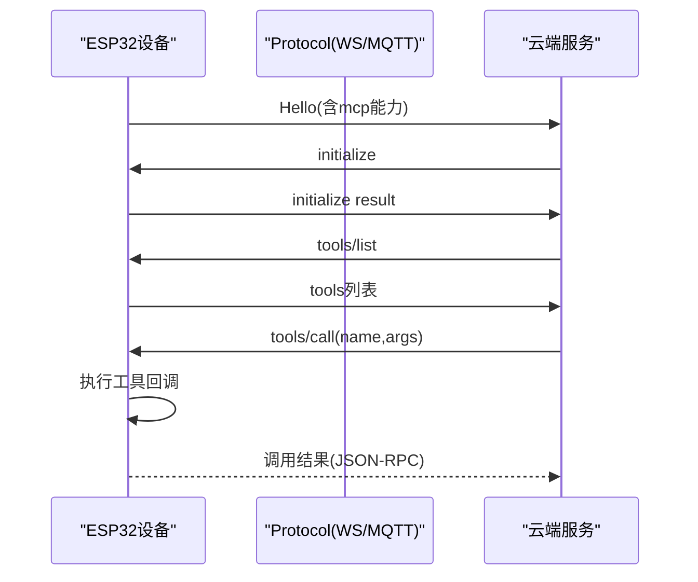
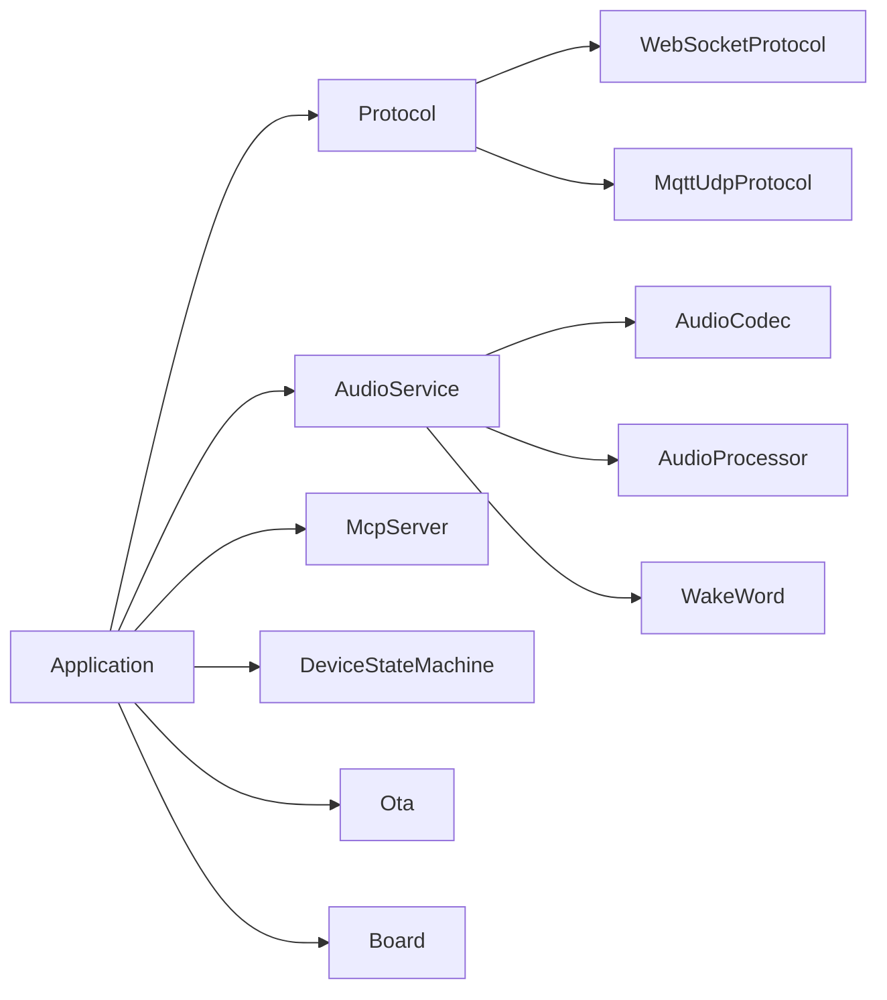
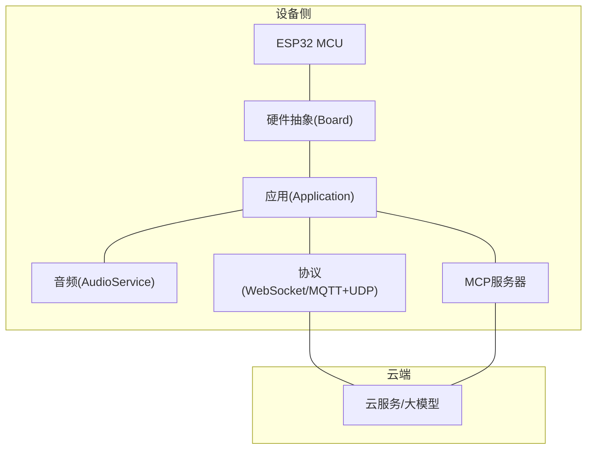

# 技术架构

<cite>
**本文引用的文件**   
- [README.md](file://README.md)
- [main.cc](file://main/main.cc)
- [application.h](file://main/application.h)
- [application.cc](file://main/application.cc)
- [mcp_server.h](file://main/mcp_server.h)
- [mcp_server.cc](file://main/mcp_server.cc)
- [protocol.h](file://main/protocols/protocol.h)
- [protocol.cc](file://main/protocols/protocol.cc)
- [websocket_protocol.h](file://main/protocols/websocket_protocol.h)
- [websocket_protocol.cc](file://main/protocols/websocket_protocol.cc)
- [mqtt_protocol.h](file://main/protocols/mqtt_protocol.h)
- [mqtt_protocol.cc](file://main/protocols/mqtt_protocol.cc)
- [audio_service.h](file://main/audio/audio_service.h)
- [audio_service.cc](file://main/audio/audio_service.cc)
- [audio_codec.h](file://main/audio/audio_codec.h)
- [audio_codec.cc](file://main/audio/audio_codec.cc)
- [afe_audio_processor.h](file://main/audio/processors/afe_audio_processor.h)
- [afe_audio_processor.cc](file://main/audio/processors/afe_audio_processor.cc)
- [esp_wake_word.h](file://main/audio/wake_words/esp_wake_word.h)
- [esp_wake_word.cc](file://main/audio/wake_words/esp_wake_word.cc)
- [board.h](file://main/boards/common/board.h)
- [ota.h](file://main/ota.h)
- [ota.cc](file://main/ota.cc)
- [device_state_machine.h](file://main/device_state_machine.h)
- [device_state_machine.cc](file://main/device_state_machine.cc)
- [display.h](file://main/display/display.h)
- [led.h](file://main/led/led.h)
- [settings.h](file://main/settings.h)
- [system_info.h](file://main/system_info.h)
- [mcp-protocol.md](file://docs/mcp-protocol.md)
- [websocket.md](file://docs/websocket.md)
- [mqtt-udp.md](file://docs/mqtt-udp.md)
</cite>

## 目录
1. [引言](#引言)
2. [项目结构](#项目结构)
3. [核心组件](#核心组件)
4. [架构总览](#架构总览)
5. [详细组件分析](#详细组件分析)
6. [依赖关系分析](#依赖关系分析)
7. [性能考量](#性能考量)
8. [故障排查指南](#故障排查指南)
9. [结论](#结论)
10. [附录](#附录)

## 引言
本技术架构文档面向XiaoZhi ESP32项目，聚焦于基于ESP32微控制器平台的整体架构设计，涵盖硬件抽象层、应用层、协议层的分层架构；深入解析MCP协议在系统中的核心作用与设备侧控制、云服务扩展能力；梳理音频处理流水线（离线唤醒、OPUS编解码、实时音频流处理）；说明多协议通信（WebSocket、MQTT+UDP）的设计与集成；并介绍多语言支持、OTA升级、设备状态管理等核心功能模块。文档同时提供系统边界图与组件交互关系图，帮助开发者快速理解整体技术栈与集成方式。

## 项目结构
XiaoZhi ESP32采用模块化分层组织，核心目录与职责如下：
- main：主程序入口与核心业务逻辑
  - main.cc：系统入口，初始化NVS与应用实例，进入主循环
  - application.*：应用生命周期、事件驱动、状态机、协议与音频服务协调
  - mcp_server.*：MCP协议服务器实现，工具注册与调用
  - protocols/*：协议抽象与具体实现（WebSocket、MQTT+UDP）
  - audio/*：音频子系统（编解码、处理器、唤醒词、服务）
  - boards/common/*：硬件抽象接口（板卡、网络、显示、LED、电池等）
  - ota.*：OTA升级与版本管理
  - device_state_machine.*：设备状态机
  - display/*、led/*、settings.*、system_info.*：显示、LED、配置与系统信息
- docs：协议与使用文档（MCP、WebSocket、MQTT+UDP）
- partitions：分区表（v1/v2）

图表来源
- [main.cc](file://main/main.cc#L15-L30)
- [application.h](file://main/application.h#L42-L172)
- [protocol.h](file://main/protocols/protocol.h#L44-L95)
- [audio_service.h](file://main/audio/audio_service.h#L105-L193)
- [board.h](file://main/boards/common/board.h#L49-L84)
- [ota.h](file://main/ota.h#L10-L56)
- [device_state_machine.h](file://main/device_state_machine.h#L17-L81)
- [display.h](file://main/display/display.h#L28-L61)
- [led.h](file://main/led/led.h#L4-L17)
- [settings.h](file://main/settings.h#L7-L26)
- [system_info.h](file://main/system_info.h#L9-L21)

章节来源
- [README.md](file://README.md#L1-L174)
- [main.cc](file://main/main.cc#L15-L30)

## 核心组件
- 应用层（Application）
  - 负责系统初始化、主事件循环、状态机驱动、协议与音频服务协调、OTA升级、用户交互与告警提示
  - 关键职责：事件调度、状态切换、协议资源重置、音频通道控制、唤醒词触发、音量/模式控制
- 协议层（Protocol抽象与实现）
  - 抽象定义统一的音频/文本通道、回调接口与超时检测
  - 实现：WebSocket与MQTT+UDP两种传输，支持会话管理、音频通道打开/关闭、MCP消息透传
- 音频层（AudioService）
  - 离线唤醒（ESP-SR）、OPUS编解码、音频处理器（AEC/降噪/增益）、实时播放队列与测试队列
  - 任务分离：输入/输出/处理器任务与OPUS编解码任务，保证低延迟与高吞吐
- 硬件抽象层（Board）
  - 统一接口：音频编解码器、显示、LED、相机、网络、电源管理、系统信息
  - 支持多款开发板与定制板卡
- MCP服务器（McpServer）
  - 提供工具注册、参数schema校验、调用回调与结果封装，支持用户可见/不可见工具
  - 与应用层协作，实现设备侧控制与云侧扩展
- 设备状态机（DeviceStateMachine）
  - 严格的状态转换规则与观察者回调，确保状态一致性与可观测性
- OTA升级（Ota）
  - 版本检查、激活、进度回调、升级流程与回滚保护
- 显示/LED/配置/系统信息
  - 屏幕UI抽象、LED状态指示、NVS配置读写、系统运行时统计

章节来源
- [application.h](file://main/application.h#L42-L172)
- [protocol.h](file://main/protocols/protocol.h#L44-L95)
- [audio_service.h](file://main/audio/audio_service.h#L105-L193)
- [board.h](file://main/boards/common/board.h#L49-L84)
- [mcp_server.h](file://main/mcp_server.h#L314-L342)
- [device_state_machine.h](file://main/device_state_machine.h#L17-L81)
- [ota.h](file://main/ota.h#L10-L56)
- [display.h](file://main/display/display.h#L28-L61)
- [led.h](file://main/led/led.h#L4-L17)
- [settings.h](file://main/settings.h#L7-L26)
- [system_info.h](file://main/system_info.h#L9-L21)

## 架构总览
XiaoZhi ESP32采用“硬件抽象层 + 应用层 + 协议层”的三层架构，配合音频流水线与MCP协议，实现设备侧控制与云端扩展的统一入口。

图表来源
- [application.h](file://main/application.h#L123-L172)
- [protocol.h](file://main/protocols/protocol.h#L44-L95)
- [audio_service.h](file://main/audio/audio_service.h#L105-L193)
- [board.h](file://main/boards/common/board.h#L49-L84)
- [ota.h](file://main/ota.h#L10-L56)
- [mcp_server.h](file://main/mcp_server.h#L314-L342)

## 详细组件分析

### 应用层（Application）与事件驱动
- 初始化与主循环
  - 初始化NVS、构建应用单例、异步网络连接、启动主事件循环
- 事件模型
  - 使用事件位与任务队列实现线程安全的事件调度，覆盖网络连接、唤醒词检测、VAD变化、状态变更、音视频通道控制等
- 状态机集成
  - 通过状态机驱动UI、LED、音频通道与协议资源的生命周期
- 协议与音频协调
  - 在网络连接后初始化协议资源，音频通道打开/关闭与监听模式切换由应用层统一调度
- OTA与MCP消息
  - 提供升级入口与MCP消息发送接口，支持从任意任务安全调用

图表来源
- [main.cc](file://main/main.cc#L15-L30)
- [application.h](file://main/application.h#L56-L121)
- [protocol.h](file://main/protocols/protocol.h#L66-L95)
- [audio_service.h](file://main/audio/audio_service.h#L110-L136)
- [mcp_server.h](file://main/mcp_server.h#L321-L326)

章节来源
- [application.h](file://main/application.h#L42-L172)
- [application.cc](file://main/application.cc#L1-L200)

### 协议层（Protocol抽象与实现）
- 抽象接口
  - 统一音频包结构、会话ID、回调接口（音频/文本/连接/断开/网络错误），并提供超时检测与错误上报
- 传输实现
  - WebSocket：长连接、双向消息、适合MCP与音频流
  - MQTT+UDP：轻量级消息传递，适合低带宽场景
- 音频通道
  - 打开/关闭音频通道、发送开始/停止监听、中止说话、发送唤醒词检测

图表来源
- [protocol.h](file://main/protocols/protocol.h#L44-L95)
- [websocket_protocol.h](file://main/protocols/websocket_protocol.h#L1-L200)
- [mqtt_protocol.h](file://main/protocols/mqtt_protocol.h#L1-L200)

章节来源
- [protocol.h](file://main/protocols/protocol.h#L44-L95)
- [protocol.cc](file://main/protocols/protocol.cc#L1-L200)
- [websocket_protocol.cc](file://main/protocols/websocket_protocol.cc#L1-L200)
- [mqtt_protocol.cc](file://main/protocols/mqtt_protocol.cc#L1-L200)

### 音频处理流水线（离线唤醒、OPUS编解码、实时音频流）
- 流水线概览
  - 录入路径：麦克风PCM → 处理器（AEC/降噪/增益）→ 编码队列 → OPUS编码 → 发送队列 → 网络
  - 播放路径：服务器音频 → 解码队列 → OPUS解码 → 播放队列 → 扬声器
- 关键组件
  - AudioService：任务分离、队列容量控制、采样率转换、唤醒词检测、音频功率计时
  - OPUS编解码：帧时长、VBR/DTX、自动比特率
  - 音频处理器：AEC模式（设备侧/服务侧/关闭）
  - 离线唤醒：ESP-SR模型与唤醒词检测
- 并发与同步
  - 输入/输出/处理器任务与OPUS编解码任务分离，避免阻塞
  - 条件变量与互斥锁保障队列安全

图表来源
- [audio_service.h](file://main/audio/audio_service.h#L28-L76)
- [audio_service.h](file://main/audio/audio_service.h#L105-L193)
- [afe_audio_processor.h](file://main/audio/processors/afe_audio_processor.h#L1-L200)
- [esp_wake_word.h](file://main/audio/wake_words/esp_wake_word.h#L1-L200)

章节来源
- [audio_service.h](file://main/audio/audio_service.h#L105-L193)
- [audio_service.cc](file://main/audio/audio_service.cc#L1-L200)
- [afe_audio_processor.cc](file://main/audio/processors/afe_audio_processor.cc#L1-L200)
- [esp_wake_word.cc](file://main/audio/wake_words/esp_wake_word.cc#L1-L200)

### MCP协议与设备侧控制
- 协议格式与交互
  - 基于JSON-RPC 2.0封装在底层协议（WebSocket/MQTT）中，支持initialize、tools/list、tools/call与通知
- 设备侧能力
  - 注册通用工具与用户可见工具，参数schema校验，回调执行与结果封装
- 与应用层集成
  - 应用层负责在连接建立后初始化MCP能力，处理工具调用并下发至硬件抽象层或系统功能

图表来源
- [mcp-protocol.md](file://docs/mcp-protocol.md#L37-L267)
- [mcp_server.h](file://main/mcp_server.h#L321-L342)
- [protocol.h](file://main/protocols/protocol.h#L75-L75)

章节来源
- [mcp-protocol.md](file://docs/mcp-protocol.md#L1-L270)
- [mcp_server.h](file://main/mcp_server.h#L314-L342)
- [mcp_server.cc](file://main/mcp_server.cc#L1-L200)

### 多协议通信（WebSocket与MQTT+UDP）
- WebSocket
  - 适合实时双向通信，MCP与音频流均通过WebSocket承载
- MQTT+UDP
  - 适合低带宽与低功耗场景，消息轻量化，适合设备状态上报与指令下发
- 协议选择与切换
  - 应用层通过Protocol抽象屏蔽差异，按配置与网络条件选择合适传输

章节来源
- [websocket.md](file://docs/websocket.md#L1-L200)
- [mqtt-udp.md](file://docs/mqtt-udp.md#L1-L200)
- [protocol.h](file://main/protocols/protocol.h#L44-L95)

### 多语言支持、OTA升级、设备状态管理
- 多语言支持
  - 通过assets/locales目录提供多语言资源，应用层按系统语言加载
- OTA升级
  - 版本检查、下载、激活与回滚保护，支持进度回调与错误处理
- 设备状态管理
  - DeviceStateMachine提供严格的状态转换规则与观察者回调，确保UI、LED、音频与协议资源的一致性

章节来源
- [ota.h](file://main/ota.h#L10-L56)
- [ota.cc](file://main/ota.cc#L1-L200)
- [device_state_machine.h](file://main/device_state_machine.h#L17-L81)
- [device_state_machine.cc](file://main/device_state_machine.cc#L1-L200)

## 依赖关系分析
- 组件耦合
  - Application高度聚合：与Protocol、AudioService、McpServer、DeviceStateMachine、Ota紧密耦合，协调各子系统
  - Protocol抽象降低传输层耦合，便于替换WebSocket/MQTT+UDP
  - AudioService与编解码器、处理器解耦，通过接口适配不同硬件
  - Board抽象屏蔽硬件差异，便于多板卡支持
- 外部依赖
  - OPUS编解码、ESP-SR唤醒、cJSON、LVGL（可选）等第三方库
- 循环依赖
  - 未发现直接循环依赖；MCP工具回调通过Application间接调用硬件抽象，避免循环

图表来源
- [application.h](file://main/application.h#L123-L172)
- [protocol.h](file://main/protocols/protocol.h#L44-L95)
- [audio_service.h](file://main/audio/audio_service.h#L105-L193)
- [board.h](file://main/boards/common/board.h#L49-L84)
- [ota.h](file://main/ota.h#L10-L56)
- [mcp_server.h](file://main/mcp_server.h#L314-L342)

章节来源
- [application.h](file://main/application.h#L123-L172)
- [protocol.h](file://main/protocols/protocol.h#L44-L95)
- [audio_service.h](file://main/audio/audio_service.h#L105-L193)
- [board.h](file://main/boards/common/board.h#L49-L84)
- [ota.h](file://main/ota.h#L10-L56)
- [mcp_server.h](file://main/mcp_server.h#L314-L342)

## 性能考量
- 音频流水线
  - 任务分离与队列容量限制（发送/解码/播放/测试队列）避免阻塞与内存峰值
  - OPUS帧时长与VBR/DTX配置平衡延迟与带宽
  - 采样率转换与音频功率计时减少无效处理
- 事件驱动
  - 事件位与任务队列降低上下文切换与锁竞争
- 协议层
  - WebSocket适合低延迟，MQTT+UDP适合低功耗与弱网
- 状态机
  - 严格的转换规则避免并发状态冲突

## 故障排查指南
- 网络连接问题
  - 检查网络事件回调与协议层连接/断开回调，确认传输层可用性
- 音频无声/卡顿
  - 检查音频队列是否满/空、OPUS编解码任务是否运行、采样率与帧时长配置
- 唤醒词无效
  - 确认唤醒词模型加载、处理器启用、音频输入预热
- OTA失败
  - 查看版本检查与激活流程日志，确认下载进度与校验
- MCP工具调用异常
  - 检查工具注册与参数schema、回调执行结果封装

章节来源
- [protocol.h](file://main/protocols/protocol.h#L60-L95)
- [audio_service.h](file://main/audio/audio_service.h#L163-L193)
- [ota.h](file://main/ota.h#L15-L56)
- [mcp_server.h](file://main/mcp_server.h#L321-L342)

## 结论
XiaoZhi ESP32通过清晰的分层架构与协议抽象，实现了从硬件抽象到应用控制再到云端扩展的完整链路。MCP协议作为设备侧控制与云侧能力的桥梁，结合WebSocket/MQTT+UDP多协议支持与稳健的音频流水线，满足多场景需求。配合OTA升级、设备状态管理与多语言资源，系统具备良好的可维护性与可扩展性。

## 附录
- 系统边界图（概念示意）
