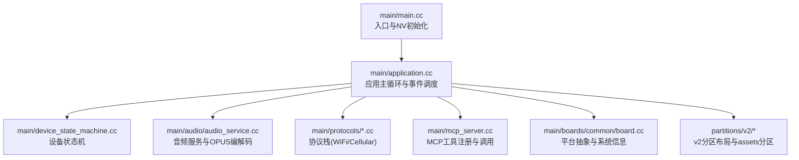
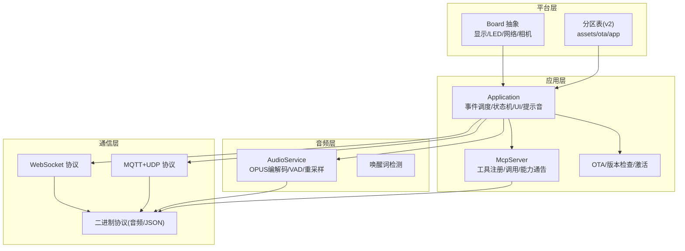
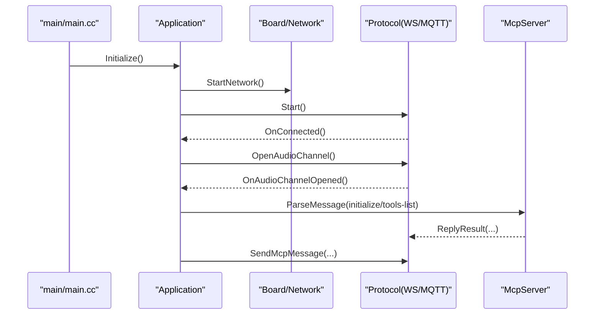
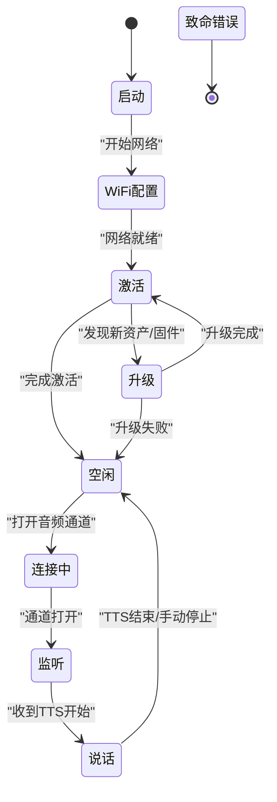
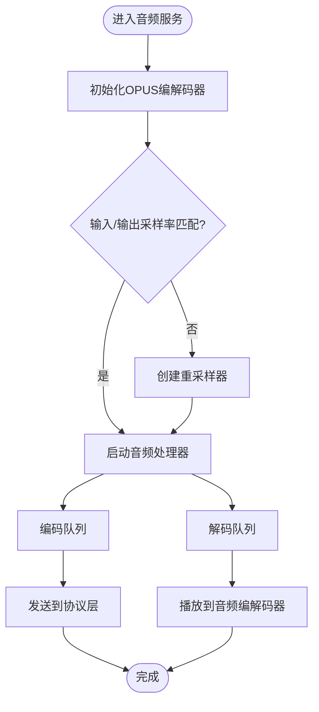
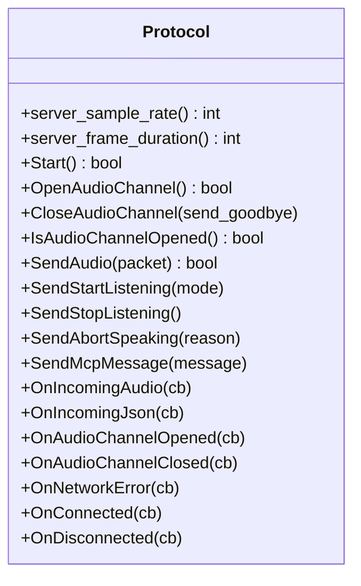
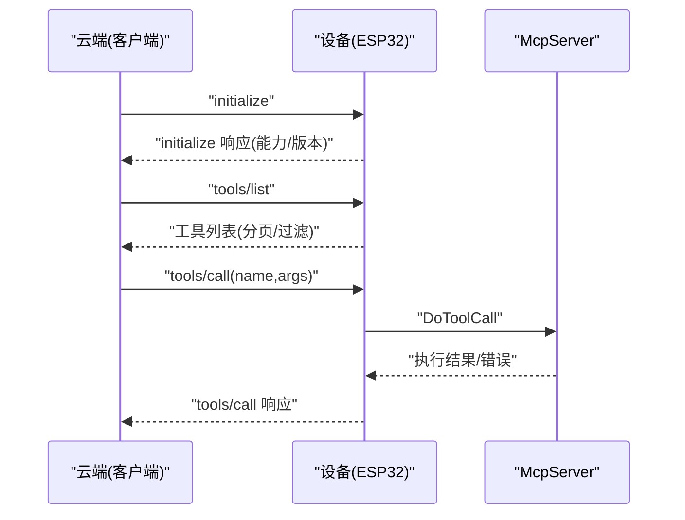
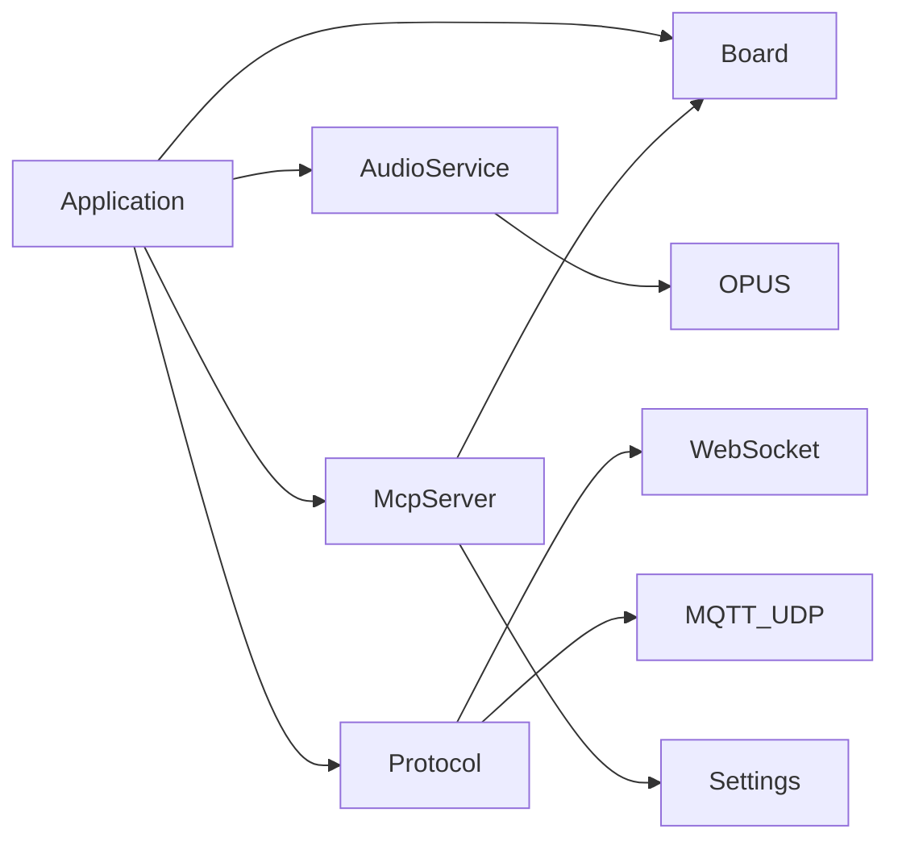

# 项目概述

<cite>
**本文引用的文件**
- [README.md](file://README.md)
- [main.cc](file://main/main.cc)
- [application.cc](file://main/application.cc)
- [mcp-protocol.md](file://docs/mcp-protocol.md)
- [mcp-usage.md](file://docs/mcp-usage.md)
- [mcp_server.cc](file://main/mcp_server.cc)
- [audio_service.cc](file://main/audio/audio_service.cc)
- [protocol.h](file://main/protocols/protocol.h)
- [device_state_machine.cc](file://main/device_state_machine.cc)
- [board.cc](file://main/boards/common/board.cc)
- [README.md](file://partitions/v2/README.md)
- [README.md](file://main/boards/aipi-lite/README.md)
- [README.md](file://main/boards/m5stack-core-s3/README.md)
- [sdkconfig.defaults](file://sdkconfig.defaults)
</cite>

## 目录
1. [引言](#引言)
2. [项目结构](#项目结构)
3. [核心组件](#核心组件)
4. [架构总览](#架构总览)
5. [详细组件分析](#详细组件分析)
6. [依赖关系分析](#依赖关系分析)
7. [性能考量](#性能考量)
8. [故障排查指南](#故障排查指南)
9. [结论](#结论)
10. [附录](#附录)

## 引言
XiaoZhi ESP32 AI聊天机器人是一个基于MCP协议的智能语音交互系统，面向ESP32微控制器平台，结合AI大模型能力，提供离线唤醒、OPUS音频编解码、多语言支持、设备侧MCP控制与云端扩展联动等能力。项目当前处于v2版本，强调动态资源管理与OTA升级体验，并兼容70+开源硬件平台，覆盖从入门DIY到专业开发板的广泛生态。

- 项目定位：以MCP协议为核心，实现设备侧工具发现与调用，打通云端大模型与本地硬件的协作。
- 目标用户：初学者可通过官方固件快速上手；开发者可基于MCP协议扩展设备能力，接入多协议通信与多芯片平台。
- 核心价值：降低AI硬件开发门槛，提供可演进的软硬协同方案，支持离线与在线混合工作模式。

章节来源
- [README.md](file://README.md#L1-L174)

## 项目结构
项目采用“功能域+平台适配”的组织方式：
- main：应用主循环、设备状态机、音频服务、协议栈、MCP服务器、显示与LED、OTA等核心模块
- main/boards：各开源硬件平台的适配层，含配置、驱动与工具注册
- main/protocols：WebSocket与MQTT协议实现
- main/audio：音频编解码、唤醒词检测、音频处理器与OPUS编解码
- partitions：v1/v2分区表，v2引入assets分区支持动态资源
- docs：MCP协议规范、使用说明、通信协议文档
- scripts：构建、打包、资源转换与发布工具

图表来源
- [main.cc](file://main/main.cc#L15-L30)
- [application.cc](file://main/application.cc#L61-L163)
- [device_state_machine.cc](file://main/device_state_machine.cc#L108-L131)
- [audio_service.cc](file://main/audio/audio_service.cc#L62-L123)
- [mcp_server.cc](file://main/mcp_server.cc#L33-L126)
- [board.cc](file://main/boards/common/board.cc#L15-L46)
- [README.md](file://partitions/v2/README.md#L1-L107)

章节来源
- [main.cc](file://main/main.cc#L15-L30)
- [application.cc](file://main/application.cc#L61-L163)
- [README.md](file://partitions/v2/README.md#L1-L107)

## 核心组件
- 应用主循环与事件调度：负责初始化硬件、网络、音频与协议，维护事件组与状态机，驱动UI与系统提示音。
- 设备状态机：严格的状态迁移保证系统行为可预期，涵盖启动、配置、激活、连接、监听、说话、升级、致命错误等状态。
- 音频服务：基于OPUS编解码，支持输入/输出重采样、VAD、唤醒词检测与编码队列管理。
- 协议栈：支持WebSocket与MQTT+UDP两种传输，承载音频流、JSON控制与MCP消息。
- MCP服务器：注册通用与用户专用工具，解析initialize/tools/list/tools/call，实现设备侧控制与信息查询。
- 平台适配：通过board抽象屏蔽硬件差异，提供显示、LED、音频编解码、网络、相机等接口。
- 分区与资源：v2引入assets分区，支持动态主题、唤醒词、语言包与音效的OTA更新。

章节来源
- [application.cc](file://main/application.cc#L61-L163)
- [device_state_machine.cc](file://main/device_state_machine.cc#L108-L131)
- [audio_service.cc](file://main/audio/audio_service.cc#L62-L123)
- [protocol.h](file://main/protocols/protocol.h#L44-L95)
- [mcp_server.cc](file://main/mcp_server.cc#L33-L126)
- [board.cc](file://main/boards/common/board.cc#L56-L68)
- [README.md](file://partitions/v2/README.md#L1-L107)

## 架构总览
系统以“应用主循环”为中心，向上对接协议栈与音频服务，向下对接平台抽象与硬件驱动。MCP协议贯穿设备侧工具与云端控制，形成“设备能力发现—工具调用—状态反馈”的闭环。

图表来源
- [application.cc](file://main/application.cc#L61-L163)
- [mcp_server.cc](file://main/mcp_server.cc#L33-L126)
- [audio_service.cc](file://main/audio/audio_service.cc#L62-L123)
- [protocol.h](file://main/protocols/protocol.h#L17-L31)
- [board.cc](file://main/boards/common/board.cc#L56-L68)
- [README.md](file://partitions/v2/README.md#L1-L107)

## 详细组件分析

### 应用主循环与事件调度
- 初始化阶段：加载显示、初始化音频服务、注册网络事件回调、启动网络、启动时钟定时器。
- 事件驱动：通过事件组接收网络、音频、唤醒词、状态变更等事件，驱动状态机切换与UI更新。
- 协议初始化：根据OTA配置选择WebSocket或MQTT协议，注册回调处理音频通道、JSON消息与系统指令。
- 激活流程：检查资产版本、检查固件版本、执行激活、播放成功提示音。

图表来源
- [main.cc](file://main/main.cc#L26-L29)
- [application.cc](file://main/application.cc#L61-L163)
- [application.cc](file://main/application.cc#L473-L610)
- [mcp_server.cc](file://main/mcp_server.cc#L387-L436)

章节来源
- [main.cc](file://main/main.cc#L26-L29)
- [application.cc](file://main/application.cc#L61-L163)
- [application.cc](file://main/application.cc#L473-L610)

### 设备状态机
- 状态定义：未知、启动、WiFi配置、空闲、连接中、监听、说话、升级、激活、音频测试、致命错误等。
- 转移规则：限定合法状态迁移，避免竞态与异常状态。
- 回调通知：状态变更时通知UI与日志。

图表来源
- [device_state_machine.cc](file://main/device_state_machine.cc#L108-L131)

章节来源
- [device_state_machine.cc](file://main/device_state_machine.cc#L108-L131)

### 音频服务与OPUS编解码
- OPUS编解码：音频输入/输出分别配置解码器与编码器，帧时长与采样率可配置。
- 重采样：当硬件采样率与目标不一致时，使用速率转换器进行适配。
- VAD与唤醒词：音频处理器输出VAD状态变化与唤醒词检测事件，驱动UI与状态机。
- 队列与任务：输入/输出/编码/解码分离任务，通过队列解耦，提高实时性。

图表来源
- [audio_service.cc](file://main/audio/audio_service.cc#L62-L123)
- [audio_service.cc](file://main/audio/audio_service.cc#L125-L167)

章节来源
- [audio_service.cc](file://main/audio/audio_service.cc#L62-L123)
- [audio_service.cc](file://main/audio/audio_service.cc#L125-L167)

### 协议栈与二进制协议
- 传输协议：WebSocket与MQTT+UDP，承载音频流与JSON控制消息。
- 二进制协议：定义音频与JSON两类消息类型，携带时间戳与负载长度，支持会话标识。
- 事件回调：音频通道开启/关闭、网络错误、JSON消息到达、MCP消息发送等。

图表来源
- [protocol.h](file://main/protocols/protocol.h#L44-L95)

章节来源
- [protocol.h](file://main/protocols/protocol.h#L44-L95)

### MCP协议与设备控制
- 协议格式：基于JSON-RPC 2.0封装在基础协议消息体内，支持initialize、tools/list、tools/call等方法。
- 能力通告：设备启动后向云端通告支持MCP能力，随后由云端初始化会话并拉取工具清单。
- 工具注册：设备端注册通用工具（如音量、屏幕亮度、拍照）与用户专用工具（如重启、升级、截图上传）。
- 调用流程：云端调用tools/call，设备在主线程执行工具回调并返回结果或错误。

图表来源
- [mcp-protocol.md](file://docs/mcp-protocol.md#L219-L267)
- [mcp_server.cc](file://main/mcp_server.cc#L387-L436)
- [mcp_server.cc](file://main/mcp_server.cc#L511-L563)

章节来源
- [mcp-protocol.md](file://docs/mcp-protocol.md#L1-L270)
- [mcp-usage.md](file://docs/mcp-usage.md#L1-L115)
- [mcp_server.cc](file://main/mcp_server.cc#L33-L126)
- [mcp_server.cc](file://main/mcp_server.cc#L387-L436)
- [mcp_server.cc](file://main/mcp_server.cc#L511-L563)

### 平台适配与硬件生态
- 板级抽象：Board类提供显示、LED、音频编解码、网络、相机等接口，默认实现为空实现，具体板卡覆盖。
- 系统信息：生成设备系统信息JSON，包含芯片型号、分区表、MAC地址、UUID等。
- 硬件生态：支持70+开源硬件平台，覆盖ESP32-S3、ESP32-C3、ESP32-P4等芯片平台，提供一键编译与烧录说明。

章节来源
- [board.cc](file://main/boards/common/board.cc#L56-L68)
- [board.cc](file://main/boards/common/board.cc#L70-L178)
- [README.md](file://README.md#L51-L103)
- [README.md](file://main/boards/aipi-lite/README.md#L1-L41)
- [README.md](file://main/boards/m5stack-core-s3/README.md#L1-L23)

### 分区表与v2版本
- v2改进：新增assets分区存储唤醒词、主题、语言包与音效，优化应用分区大小，支持动态内容OTA更新。
- 分区布局：针对8MB/16MB/32MB闪存提供不同配置，ESP32-C3受限于mmap页面数量采用较小assets分区。
- 迁移注意：v1与v2分区表不兼容，需手动刷写新分区表；升级后设备自动下载所需资产。

章节来源
- [README.md](file://partitions/v2/README.md#L1-L107)

## 依赖关系分析
- 组件耦合：Application依赖Board、AudioService、Protocol、McpServer；McpServer依赖Board与Settings；Board为平台抽象，向上提供统一接口。
- 外部依赖：ESP-IDF、LVGL（可选）、OPUS编解码、cJSON、ESP-SR（唤醒词）、3D Speaker（说话人识别）等。
- 协议依赖：WebSocket与MQTT+UDP协议栈，二进制协议承载音频与JSON消息。

图表来源
- [application.cc](file://main/application.cc#L61-L163)
- [mcp_server.cc](file://main/mcp_server.cc#L33-L126)
- [audio_service.cc](file://main/audio/audio_service.cc#L62-L123)
- [protocol.h](file://main/protocols/protocol.h#L44-L95)

章节来源
- [application.cc](file://main/application.cc#L61-L163)
- [mcp_server.cc](file://main/mcp_server.cc#L33-L126)
- [audio_service.cc](file://main/audio/audio_service.cc#L62-L123)
- [protocol.h](file://main/protocols/protocol.h#L44-L95)

## 性能考量
- 实时性：音频输入/输出/编码/解码分离任务，减少阻塞；VAD与唤醒词事件驱动UI与状态机，降低延迟。
- 资源占用：LVGL可选、禁用部分控件以节省Flash；OPUS编解码参数可调，兼顾质量与带宽。
- 电源管理：网络连接时提升性能档位，断连或空闲时降功耗；电池与温度信息可选上报。
- 分区优化：v2将模型迁移到assets分区，应用分区更小，动态内容独立更新，减少OTA体积。

章节来源
- [sdkconfig.defaults](file://sdkconfig.defaults#L1-L79)
- [README.md](file://partitions/v2/README.md#L77-L84)

## 故障排查指南
- 网络问题：关注网络事件回调中的扫描、连接、断开与蜂鸣器告警；Modem检测与错误码提示。
- 协议异常：协议层提供网络错误回调与超时判断，检查会话ID与音频通道状态。
- 音频异常：确认采样率匹配与重采样器创建；检查编码/解码队列是否积压。
- MCP调用失败：核对工具名称与参数类型；查看工具回调异常与错误响应。
- 激活与升级：关注激活码提示与版本检查重试策略；升级失败回退至激活状态。

章节来源
- [application.cc](file://main/application.cc#L102-L156)
- [application.cc](file://main/application.cc#L286-L297)
- [application.cc](file://main/application.cc#L398-L471)
- [mcp_server.cc](file://main/mcp_server.cc#L511-L563)

## 结论
XiaoZhi ESP32项目以MCP协议为核心，构建了从硬件平台适配、音频编解码、多协议通信到设备侧工具控制的完整链路。v2版本通过assets分区与优化的分区布局，显著提升了动态内容管理与OTA灵活性。项目既适合初学者快速上手，也为有经验的开发者提供了可扩展的架构与丰富的实践场景。

## 附录

### 版本与兼容性说明
- v2与v1不兼容：分区表与布局差异导致无法OTA直接升级；需手动刷写v2分区表并重新激活。
- 稳定版本：v1稳定版为1.9.2，可通过分支切换使用；v1维护期至2026年2月。
- 升级路径：v1设备可手动刷写v2固件；首次启动后自动下载所需资产。

章节来源
- [README.md](file://README.md#L15-L22)
- [README.md](file://partitions/v2/README.md#L94-L107)

### 主要功能特性
- 通信：Wi-Fi/ML307 Cat.1 4G、WebSocket/MQTT+UDP
- 音频：OPUS编解码、离线唤醒、VAD、重采样
- 交互：流式ASR+LLM+TTS、多语言、设备侧MCP控制
- 硬件：70+开源硬件平台、多芯片平台支持
- 资源：动态主题、唤醒词、语言包与音效OTA更新

章节来源
- [README.md](file://README.md#L23-L37)
- [README.md](file://README.md#L51-L103)

### 使用场景示例
- 家庭助理：通过MCP控制LED、屏幕主题与音量，配合云端大模型实现问答与任务执行。
- 教育机器人：拍照识物、表情与语音反馈，支持多语言与自定义主题。
- 工业巡检：低功耗模式下保持网络连接，周期性拍照与状态上报。

章节来源
- [mcp-usage.md](file://docs/mcp-usage.md#L1-L115)
- [mcp-protocol.md](file://docs/mcp-protocol.md#L1-L270)