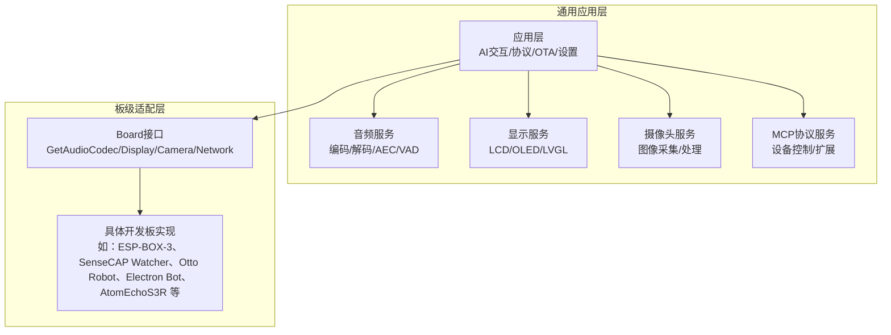
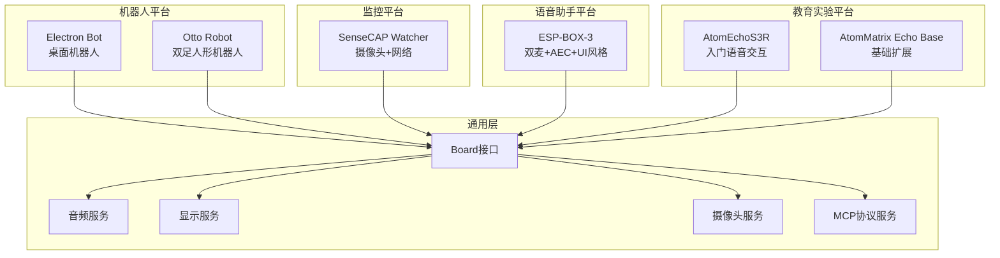
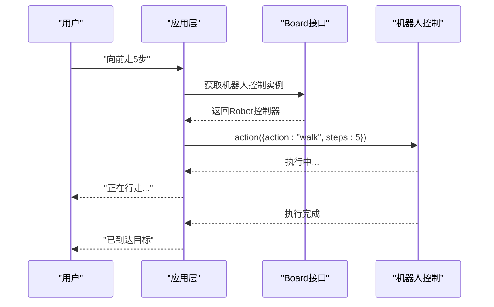
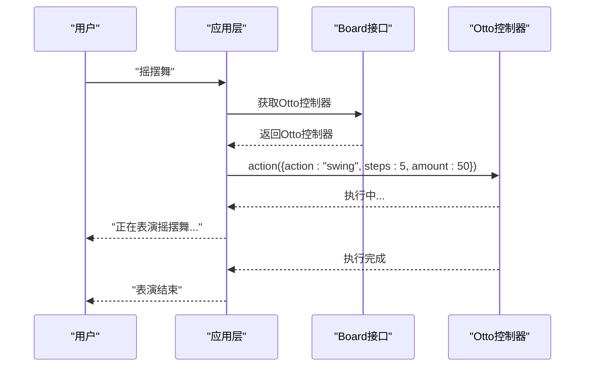
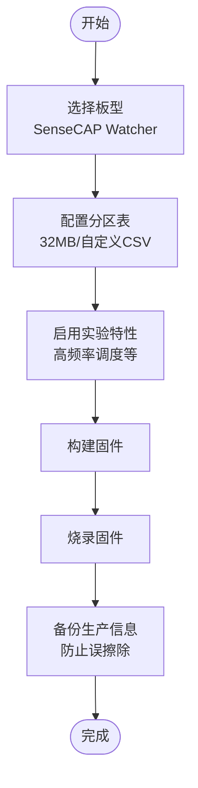
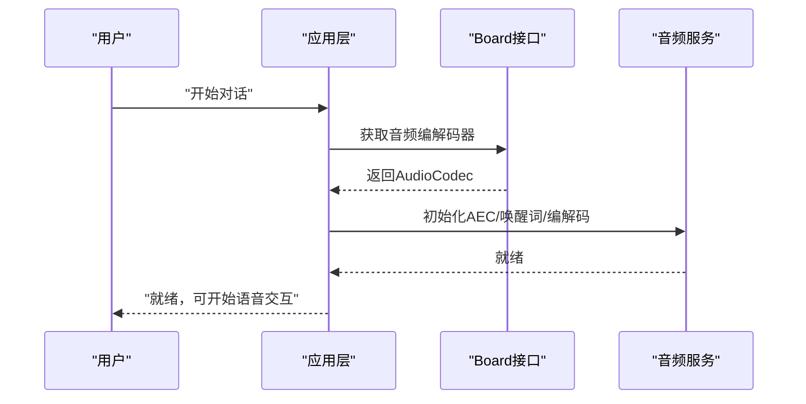
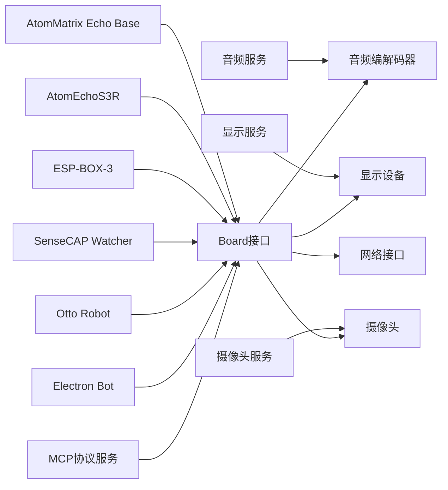

# 专用应用平台

<cite>
**本文引用的文件**
- [README.md](file://README.md)
- [main/audio/README.md](file://main/audio/README.md)
- [main/boards/common/board.h](file://main/boards/common/board.h)
- [main/boards/esp-box-3/README.md](file://main/boards/esp-box-3/README.md)
- [main/boards/esp-box-3/config.json](file://main/boards/esp-box-3/config.json)
- [main/boards/sensecap-watcher/README.md](file://main/boards/sensecap-watcher/README.md)
- [main/boards/sensecap-watcher/config.json](file://main/boards/sensecap-watcher/config.json)
- [main/boards/otto-robot/README.md](file://main/boards/otto-robot/README.md)
- [main/boards/otto-robot/config.json](file://main/boards/otto-robot/config.json)
- [main/boards/electron-bot/README.md](file://main/boards/electron-bot/README.md)
- [main/boards/electron-bot/config.json](file://main/boards/electron-bot/config.json)
- [main/boards/aipi-lite/README.md](file://main/boards/aipi-lite/README.md)
- [main/boards/atom-echos3r/README.md](file://main/boards/atom-echos3r/README.md)
- [main/boards/atommatrix-echo-base/README.md](file://main/boards/atommatrix-echo-base/README.md)
- [main/boards/lilygo-t-circle-s3/config.json](file://main/boards/lilygo-t-circle-s3/config.json)
- [main/boards/magiclick-2p4/config.json](file://main/boards/magiclick-2p4/config.json)
</cite>

## 目录
1. [简介](#简介)
2. [项目结构](#项目结构)
3. [核心组件](#核心组件)
4. [架构总览](#架构总览)
5. [详细组件分析](#详细组件分析)
6. [依赖关系分析](#依赖关系分析)
7. [性能考量](#性能考量)
8. [故障排查指南](#故障排查指南)
9. [结论](#结论)
10. [附录](#附录)

## 简介
本文件面向XiaoZhi ESP32项目的专用应用场景硬件平台分类，聚焦以下领域：
- 机器人平台：以电子宠物/桌面机器人与双足人形机器人为代表，强调运动控制、姿态校准与动作队列管理。
- 安防监控平台：以SenseCAP Watcher为代表，强调摄像头集成、设备侧AEC与网络配置流程。
- 语音助手平台：以ESP-BOX-3为代表，强调双麦阵列、设备侧AEC、唤醒词与多UI风格。
- 教育实验平台：以AtomEchoS3R、AtomMatrix Echo Base等为代表，强调入门级语音交互与开发调试。

文档将从功能特性、扩展能力、应用场景、二次开发与扩展接口、学习曲线与适用人群等方面进行系统化说明，并提供应用案例与开发指南。

## 项目结构
XiaoZhi ESP32采用“通用应用层 + 板级适配层”的分层架构。通用应用层负责AI交互、协议栈、显示与音频服务；板级适配层通过统一接口抽象不同硬件平台，实现“一次开发、多板适配”。

图表来源
- [main/boards/common/board.h](file://main/boards/common/board.h#L49-L85)
- [README.md](file://README.md#L39-L65)

章节来源
- [README.md](file://README.md#L39-L65)
- [main/boards/common/board.h](file://main/boards/common/board.h#L49-L85)

## 核心组件
- Board接口与多板适配
  - 通过统一接口暴露音频编解码、显示、摄像头、网络、电源管理等能力，便于在不同硬件上复用同一套应用逻辑。
- 音频服务
  - 包含唤醒词检测、AEC、噪声抑制、VAD、OPUS编解码与多任务流水线，支持设备侧AEC与低功耗策略。
- 显示与交互
  - 提供多种UI风格（表情动画、默认消息、微信风格），支持表情与状态图标显示。
- 摄像头与监控
  - 针对监控场景提供OV系列摄像头配置与图像采集能力。
- MCP协议与设备控制
  - 支持设备端MCP工具与云端MCP扩展，实现跨终端控制与能力扩展。

章节来源
- [main/boards/common/board.h](file://main/boards/common/board.h#L49-L85)
- [main/audio/README.md](file://main/audio/README.md#L1-L88)

## 架构总览
下图展示了典型专用平台在系统中的定位与数据流：

图表来源
- [README.md](file://README.md#L51-L103)
- [main/boards/common/board.h](file://main/boards/common/board.h#L49-L85)

## 详细组件分析

### 机器人平台

#### Electron Bot（桌面机器人）
- 功能特点
  - 6自由度（手腕roll/pitch、颈部、腰部），支持关节角度回传与动作队列。
  - 通过统一动作工具执行多种动作，支持速度、步数、幅度等参数调节。
- 扩展能力
  - 支持动作队列与后台任务执行，动作完成后自动复位或保持状态（如坐下/展示）。
  - 可通过MCP工具调用停止、状态查询、舵机校准、IP获取等系统工具。
- 应用场景
  - 桌面级AI助手、演示机器人、教学与创意DIY。
- 开发指南
  - 使用统一动作工具与参数体系，结合语音指令与MCP工具实现交互。
- 二次开发与扩展
  - 可新增动作序列、扩展手部动作（需配置手部舵机）、增加自定义表情与状态反馈。

图表来源
- [main/boards/electron-bot/README.md](file://main/boards/electron-bot/README.md#L16-L38)
- [main/boards/common/board.h](file://main/boards/common/board.h#L49-L85)

章节来源
- [main/boards/electron-bot/README.md](file://main/boards/electron-bot/README.md#L1-L76)
- [main/boards/electron-bot/config.json](file://main/boards/electron-bot/config.json#L1-L9)

#### Otto Robot（双足人形机器人）
- 功能特点
  - 四肢舵机控制，支持行走、转向、跳跃、摇摆、太空步、旋风腿、广播体操等丰富动作。
  - 提供动作参数建议与动作队列机制，支持手部动作（需手部舵机）。
- 扩展能力
  - 支持舵机校准、状态查询、IP获取、电池状态、舵机序列自编程。
- 应用场景
  - 教育机器人、舞台表演、互动教学。
- 开发指南
  - 使用统一动作工具与参数体系，结合语音指令与MCP工具实现控制。
- 二次开发与扩展
  - 可扩展动作库、增加自定义动作序列、接入更多传感器与外设。

图表来源
- [main/boards/otto-robot/README.md](file://main/boards/otto-robot/README.md#L66-L98)
- [main/boards/otto-robot/README.md](file://main/boards/otto-robot/README.md#L138-L184)

章节来源
- [main/boards/otto-robot/README.md](file://main/boards/otto-robot/README.md#L1-L208)
- [main/boards/otto-robot/config.json](file://main/boards/otto-robot/config.json#L1-L17)

### 安防监控平台

#### SenseCAP Watcher（摄像头监控）
- 功能特点
  - 集成摄像头与网络模块，支持设备侧AEC与多分区表配置。
  - 提供一键编译与手动配置流程，强调生产信息备份与分区安全。
- 扩展能力
  - 支持自定义分区表、实验性特性开关、高频率调度配置。
- 应用场景
  - 边缘AI监控、环境监测、工业巡检。
- 开发指南
  - 通过menuconfig选择板型与分区表，使用release脚本或手动编译烧录。
- 二次开发与扩展
  - 可扩展摄像头分辨率与帧率、接入更多传感器、定制网络与存储策略。

图表来源
- [main/boards/sensecap-watcher/README.md](file://main/boards/sensecap-watcher/README.md#L1-L52)
- [main/boards/sensecap-watcher/config.json](file://main/boards/sensecap-watcher/config.json#L1-L16)

章节来源
- [main/boards/sensecap-watcher/README.md](file://main/boards/sensecap-watcher/README.md#L1-L52)
- [main/boards/sensecap-watcher/config.json](file://main/boards/sensecap-watcher/config.json#L1-L16)

### 语音助手平台

#### ESP-BOX-3（智能语音助手）
- 功能特点
  - 双麦阵列+ES8311音频编解码，支持设备侧AEC，Boot按键支持单击/双击功能。
  - 支持多种UI风格（表情动画、默认消息、微信风格），可通过menuconfig选择。
- 扩展能力
  - 可在运行时通过双击Boot按键切换AEC；支持自定义资源文件以启用表情动画风格。
- 应用场景
  - 智能音箱、语音交互入口、家庭助理。
- 开发指南
  - 选择ESP32S3目标，配置UI风格与AEC，构建并烧录；支持恢复出厂设置。
- 二次开发与扩展
  - 可扩展唤醒词模型、自定义表情包与UI主题、接入更多音频处理算法。

图表来源
- [main/boards/esp-box-3/README.md](file://main/boards/esp-box-3/README.md#L11-L19)
- [main/boards/esp-box-3/README.md](file://main/boards/esp-box-3/README.md#L45-L74)
- [main/audio/README.md](file://main/audio/README.md#L1-L88)

章节来源
- [main/boards/esp-box-3/README.md](file://main/boards/esp-box-3/README.md#L1-L133)
- [main/boards/esp-box-3/config.json](file://main/boards/esp-box-3/config.json#L1-L11)
- [main/audio/README.md](file://main/audio/README.md#L1-L88)

### 教育实验平台

#### AtomEchoS3R（入门语音交互）
- 功能特点
  - 基于ESP32-S3的轻量开发板，集成ES8311音频解码器、MEMS麦克风与功率放大器，强调语音唤醒与日志查看。
- 扩展能力
  - 支持PSRAM配置、分区表定制、Octal Mode PSRAM等高级选项。
- 应用场景
  - 语音交互入门、教学实验、原型验证。
- 开发指南
  - 选择ESP32S3目标，配置分区表与PSRAM，构建并烧录；必要时使用monitor查看日志。
- 二次开发与扩展
  - 可扩展音频处理链路、接入更多传感器、实现简单AI推理。

章节来源
- [main/boards/atom-echos3r/README.md](file://main/boards/atom-echos3r/README.md#L1-L46)

#### AtomMatrix Echo Base（基础扩展）
- 功能特点
  - 作为扩展底座，配合主控板实现基础显示与网络能力。
- 应用场景
  - 教学演示、基础开发验证。
- 开发指南
  - 选择板型并构建，适合初学者理解板级接口与应用层交互。

章节来源
- [main/boards/atommatrix-echo-base/README.md](file://main/boards/atommatrix-echo-base/README.md#L1-L25)

#### 其他教育相关平台
- AIPI-Lite：提供一键编译与手动配置流程，强调生产信息备份。
- Lilygo T-Circle-S3、Magiclick 2.4：提供目标芯片与构建配置，适合入门与原型开发。

章节来源
- [main/boards/aipi-lite/README.md](file://main/boards/aipi-lite/README.md#L1-L41)
- [main/boards/lilygo-t-circle-s3/config.json](file://main/boards/lilygo-t-circle-s3/config.json#L1-L9)
- [main/boards/magiclick-2p4/config.json](file://main/boards/magiclick-2p4/config.json#L1-L9)

## 依赖关系分析

图表来源
- [main/boards/common/board.h](file://main/boards/common/board.h#L49-L85)

章节来源
- [main/boards/common/board.h](file://main/boards/common/board.h#L49-L85)

## 性能考量
- 音频处理
  - 设备侧AEC与唤醒词独立运行，降低云端依赖，提升实时性与隐私性。
  - OPUS编解码与多任务流水线保证低延迟与高压缩比。
- 电源管理
  - 音频通道在闲置一段时间后自动休眠，减少功耗。
- 分区与内存
  - 不同平台采用不同分区表与PSRAM配置，需根据功能需求选择合适目标与分区大小。

章节来源
- [main/audio/README.md](file://main/audio/README.md#L86-L88)
- [main/boards/esp-box-3/README.md](file://main/boards/esp-box-3/README.md#L75-L84)
- [main/boards/atom-echos3r/README.md](file://main/boards/atom-echos3r/README.md#L21-L28)

## 故障排查指南
- ESP-BOX-3
  - 若表情动画风格无法显示，检查自定义资源文件URL与网络连通性。
  - 双击Boot按键可切换AEC，若无效，确认硬件与配置是否匹配。
  - 恢复出厂设置：长按Boot按键3秒以上。
- SenseCAP Watcher
  - 刷写前务必备份生产信息分区，避免误擦除导致无法连接服务器。
  - 注意分区表与闪存模式配置，确保与目标固件兼容。
- 通用问题
  - 日志查看：使用monitor查看串口日志，定位启动与运行异常。
  - 网络事件回调：通过统一回调接口监听WiFi扫描、连接、断开等事件。

章节来源
- [main/boards/esp-box-3/README.md](file://main/boards/esp-box-3/README.md#L123-L133)
- [main/boards/sensecap-watcher/README.md](file://main/boards/sensecap-watcher/README.md#L44-L52)
- [main/boards/common/board.h](file://main/boards/common/board.h#L18-L33)

## 结论
XiaoZhi ESP32通过统一的Board接口与通用应用层，为机器人、监控、语音助手与教育实验等专用场景提供了清晰的开发框架。各平台在硬件特性、扩展能力与应用场景上各有侧重，开发者可根据目标应用选择合适平台，并利用MCP协议与音频/显示/摄像头服务实现快速落地与二次开发。

## 附录

### 专用平台学习曲线与适用人群
- 机器人平台
  - 学习曲线：中等。需掌握动作参数、队列与MCP工具调用。
  - 适用人群：机器人爱好者、高校学生、创客团队。
- 监控平台
  - 学习曲线：中等偏上。需关注分区表、生产信息备份与网络配置。
  - 适用人群：边缘AI开发者、工业应用团队。
- 语音助手平台
  - 学习曲线：入门友好。强调AEC与UI风格配置，适合快速上手。
  - 适用人群：产品团队、家庭用户、教学演示。
- 教育实验平台
  - 学习曲线：入门级。强调日志与基础配置，适合教学与原型验证。
  - 适用人群：教师、学生、初学者。

### 专用平台的应用案例与开发指南要点
- 机器人平台
  - 案例：桌面机器人演示、双足机器人舞蹈表演。
  - 指南：统一动作工具参数、动作队列与系统工具调用。
- 监控平台
  - 案例：环境监测、工业巡检。
  - 指南：分区表选择、生产信息备份、摄像头配置。
- 语音助手平台
  - 案例：智能音箱、语音交互入口。
  - 指南：AEC开关、UI风格选择、唤醒词配置。
- 教育实验平台
  - 案例：语音交互入门、教学演示。
  - 指南：PSRAM与分区表配置、monitor日志查看。

章节来源
- [main/boards/electron-bot/README.md](file://main/boards/electron-bot/README.md#L1-L76)
- [main/boards/otto-robot/README.md](file://main/boards/otto-robot/README.md#L1-L208)
- [main/boards/sensecap-watcher/README.md](file://main/boards/sensecap-watcher/README.md#L1-L52)
- [main/boards/esp-box-3/README.md](file://main/boards/esp-box-3/README.md#L1-L133)
- [main/boards/atom-echos3r/README.md](file://main/boards/atom-echos3r/README.md#L1-L46)
- [main/boards/atommatrix-echo-base/README.md](file://main/boards/atommatrix-echo-base/README.md#L1-L25)