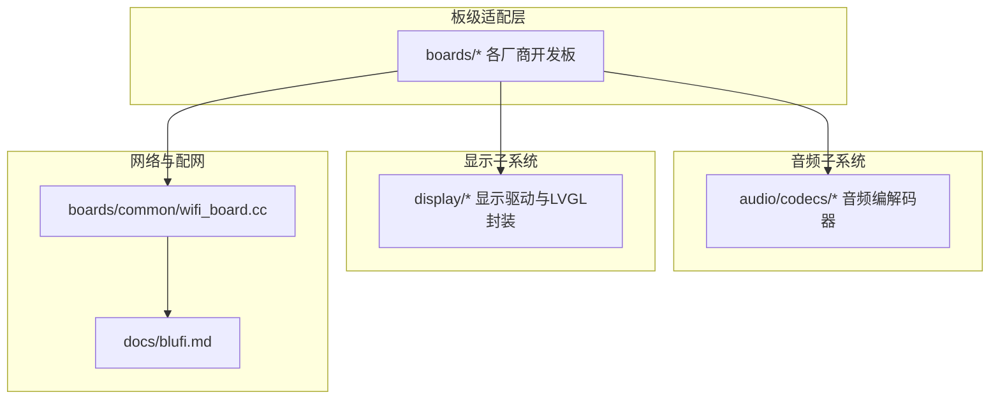
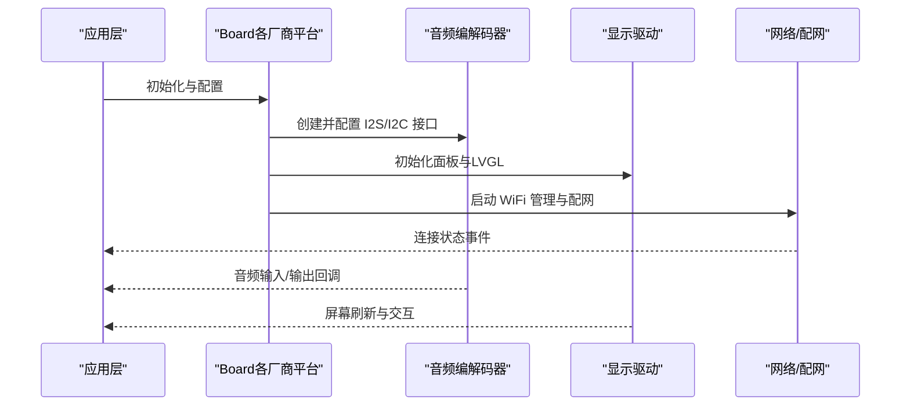
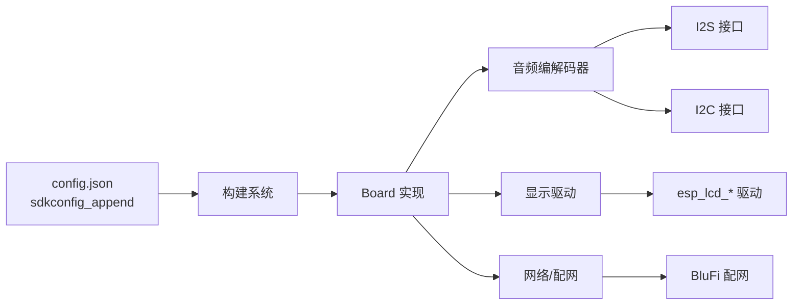

# 主要厂商平台

<cite>
**本文引用的文件**
- [main/boards/m5stack-core-s3/README.md](file://main/boards/m5stack-core-s3/README.md)
- [main/boards/m5stack-core-s3/config.json](file://main/boards/m5stack-core-s3/config.json)
- [main/boards/m5stack-cardputer-adv/README.md](file://main/boards/m5stack-cardputer-adv/README.md)
- [main/boards/lilygo-t-circle-s3/config.json](file://main/boards/lilygo-t-circle-s3/config.json)
- [main/boards/lilygo-t-display-s3-pro-mvsrlora/config.json](file://main/boards/lilygo-t-display-s3-pro-mvsrlora/config.json)
- [main/boards/waveshare/esp32-s3-audio-board/README.md](file://main/boards/waveshare/esp32-s3-audio-board/README.md)
- [main/boards/waveshare/esp32-s3-touch-amoled-1.8/config.json](file://main/boards/waveshare/esp32-s3-touch-amoled-1.8/config.json)
- [main/boards/df-k10/config.json](file://main/boards/df-k10/config.json)
- [main/boards/df-s3-ai-cam/config.json](file://main/boards/df-s3-ai-cam/config.json)
- [main/boards/df-s3-ai-cam/README.md](file://main/boards/df-s3-ai-cam/README.md)
- [main/boards/esp-box-3/config.json](file://main/boards/esp-box-3/config.json)
- [main/audio/codecs/es8311_audio_codec.cc](file://main/audio/codecs/es8311_audio_codec.cc)
- [main/audio/codecs/es8374_audio_codec.cc](file://main/audio/codecs/es8374_audio_codec.cc)
- [main/audio/codecs/es8388_audio_codec.cc](file://main/audio/codecs/es8388_audio_codec.cc)
- [main/audio/codecs/es8389_audio_codec.cc](file://main/audio/codecs/es8389_audio_codec.cc)
- [main/display/lcd_display.cc](file://main/display/lcd_display.cc)
- [main/boards/bread-compact-wifi-s3cam/compact_wifi_board_s3cam.cc](file://main/boards/bread-compact-wifi-s3cam/compact_wifi_board_s3cam.cc)
- [main/boards/waveshare/esp32-s3-audio-board/esp32-s3-audio_board.cc](file://main/boards/waveshare/esp32-s3-audio-board/esp32-s3-audio_board.cc)
- [main/boards/common/wifi_board.cc](file://main/boards/common/wifi_board.cc)
- [docs/blufi.md](file://docs/blufi.md)
- [main/boards/aipi-lite/README.md](file://main/boards/aipi-lite/README.md)
- [main/boards/otto-robot/otto_robot.cc](file://main/boards/otto-robot/otto_robot.cc)
</cite>

## 目录
1. [简介](#简介)
2. [项目结构](#项目结构)
3. [核心组件](#核心组件)
4. [架构总览](#架构总览)
5. [详细组件分析](#详细组件分析)
6. [依赖关系分析](#依赖关系分析)
7. [性能考量](#性能考量)
8. [故障排查指南](#故障排查指南)
9. [结论](#结论)
10. [附录](#附录)

## 简介
本文件聚焦于 XiaoZhi ESP32 项目中的主要硬件厂商平台，系统梳理 M5Stack、Waveshare（微雪）、LILYGO（小天才）、DFRobot（DF系列）以及乐鑫（ESP32系列芯片生态）相关开发板的产品线与技术差异。内容涵盖各平台的硬件配置、外设集成、音频处理、显示能力、网络连接实现，并提供厂商平台功能对比表与典型应用场景，帮助用户快速理解各平台优势与限制。

## 项目结构
XiaoZhi 通过“板级适配层”将不同厂商的开发板抽象为统一的 Board 接口，配合音频编解码器、显示驱动与网络模块，形成可移植的固件框架。关键目录与职责如下：
- main/boards：各厂商开发板的配置与实现，含 config.json、README、具体 board 实现与电源管理等
- main/audio：音频编解码器抽象与实现，支持多种 Codec（如 ES8311/ES8374/ES8388/ES8389）
- main/display：LCD/OLED 显示驱动与 LVGL 封装
- main/boards/common：通用网络、配网、按键、背光等公共组件
- docs：配网与协议说明文档

图表来源
- [main/boards/m5stack-core-s3/config.json](file://main/boards/m5stack-core-s3/config.json#L1-L14)
- [main/audio/codecs/es8311_audio_codec.cc](file://main/audio/codecs/es8311_audio_codec.cc#L1-L77)
- [main/display/lcd_display.cc](file://main/display/lcd_display.cc#L1-L200)
- [main/boards/common/wifi_board.cc](file://main/boards/common/wifi_board.cc#L1-L200)
- [docs/blufi.md](file://docs/blufi.md#L1-L38)

章节来源
- [main/boards/m5stack-core-s3/config.json](file://main/boards/m5stack-core-s3/config.json#L1-L14)
- [main/boards/waveshare/esp32-s3-touch-amoled-1.8/config.json](file://main/boards/waveshare/esp32-s3-touch-amoled-1.8/config.json#L1-L12)
- [main/boards/df-k10/config.json](file://main/boards/df-k10/config.json#L1-L15)
- [main/boards/df-s3-ai-cam/config.json](file://main/boards/df-s3-ai-cam/config.json#L1-L19)
- [main/boards/esp-box-3/config.json](file://main/boards/esp-box-3/config.json#L1-L11)

## 核心组件
- 板级配置与构建参数
  - 各厂商开发板通过 config.json 指定 target（如 esp32s3）与 sdkconfig_append，用于启用特定外设、相机、SPIRAM 模式等
- 音频编解码器
  - ES8311/ES8374/ES8388/ES8389 等 Codec 支持 I2S 数据接口与 I2C 控制接口，具备输入输出双工能力与增益配置
- 显示子系统
  - 通过 esp_lcd_* 驱动 SPI/LCD/AMOLED 面板，结合 LVGL 进行图形渲染与主题管理
- 网络与配网
  - 统一的 WifiBoard 提供扫描、连接、超时与配网模式入口；支持 BluFi（BLE Wi‑Fi Provisioning）与热点配网

章节来源
- [main/audio/codecs/es8311_audio_codec.cc](file://main/audio/codecs/es8311_audio_codec.cc#L1-L77)
- [main/audio/codecs/es8374_audio_codec.cc](file://main/audio/codecs/es8374_audio_codec.cc#L1-L41)
- [main/audio/codecs/es8388_audio_codec.cc](file://main/audio/codecs/es8388_audio_codec.cc#L1-L40)
- [main/audio/codecs/es8389_audio_codec.cc](file://main/audio/codecs/es8389_audio_codec.cc#L1-L40)
- [main/display/lcd_display.cc](file://main/display/lcd_display.cc#L1-L200)
- [main/boards/common/wifi_board.cc](file://main/boards/common/wifi_board.cc#L1-L200)
- [docs/blufi.md](file://docs/blufi.md#L1-L38)

## 架构总览
下图展示 XiaoZhi 在不同厂商平台上的典型数据流：应用层调用 Board 接口，Board 选择对应音频编解码器、显示驱动与网络栈，最终完成语音助手、显示与联网功能。

图表来源
- [main/boards/common/wifi_board.cc](file://main/boards/common/wifi_board.cc#L52-L198)
- [main/audio/codecs/es8311_audio_codec.cc](file://main/audio/codecs/es8311_audio_codec.cc#L70-L77)
- [main/display/lcd_display.cc](file://main/display/lcd_display.cc#L113-L172)

## 详细组件分析

### M5Stack 平台
- M5Stack Core S3
  - 特点：ESP32-S3 主控，支持相机 GC0308（DVP/YUV422/320x240@20FPS），具备 SPIRAM 配置项
  - 音频：通过板级配置启用相机与 SPIRAM，音频路径由 Board 与 Codec 协同实现
  - 显示：可通过通用 LCD/OLED 驱动接入 ST7789 等屏幕
  - 网络：统一的 WifiBoard 提供配网与连接管理
- M5Stack Cardputer Adv
  - 特点：卡片式电脑，集成 ST7789V2 1.14" 显示屏、ES8311 音频编解码、NS4150B 功放、MEMS 麦克风、BMI270 IMU、键盘与 1750mAh 电池
  - 音频：ES8311 配置明确，I2S/BCLK、LRCK、DOUT/DIN 引脚定义清晰
  - 显示：ST7789V2 驱动，引脚映射在 README 中列出
  - 网络：支持 BluFi 配网，便于首次设置

章节来源
- [main/boards/m5stack-core-s3/README.md](file://main/boards/m5stack-core-s3/README.md#L1-L23)
- [main/boards/m5stack-core-s3/config.json](file://main/boards/m5stack-core-s3/config.json#L1-L14)
- [main/boards/m5stack-cardputer-adv/README.md](file://main/boards/m5stack-cardputer-adv/README.md#L1-L49)
- [docs/blufi.md](file://docs/blufi.md#L1-L38)

### Waveshare（微雪）平台
- ESP32-S3-AUDIO-Board
  - 特点：官方产品，支持 LCD/触摸屏与音频扩展，README 提供产品链接
  - 显示：通过 SPI 初始化面板 IO，使用 JD9853 驱动，支持色序与偏移设置
  - 网络：可配合通用 WifiBoard 与 BluFi 使用
- ESP32-S3-Touch-AMOLED 系列（如 1.8 英寸）
  - 特点：AMOLED 触摸屏方案，config.json 中包含特定构建选项（如微信消息风格）
  - 显示：AMOLED 面板，支持触摸与高对比度显示
  - 音频：未见专用 Codec 配置，通常沿用通用音频链路

章节来源
- [main/boards/waveshare/esp32-s3-audio-board/README.md](file://main/boards/waveshare/esp32-s3-audio-board/README.md#L1-L3)
- [main/boards/waveshare/esp32-s3-audio-board/esp32-s3-audio_board.cc](file://main/boards/waveshare/esp32-s3-audio-board/esp32-s3-audio_board.cc#L114-L140)
- [main/boards/waveshare/esp32-s3-touch-amoled-1.8/config.json](file://main/boards/waveshare/esp32-s3-touch-amoled-1.8/config.json#L1-L12)

### LILYGO（小天才）平台
- T-Circle S3
  - 特点：目标平台为 esp32s3，config.json 为空白构建项，适合按需启用外设
- T-Display S3 Pro MVS RLoRa
  - 特点：目标平台为 esp32s3，config.json 为空白构建项，适用于多场景扩展

章节来源
- [main/boards/lilygo-t-circle-s3/config.json](file://main/boards/lilygo-t-circle-s3/config.json#L1-L9)
- [main/boards/lilygo-t-display-s3-pro-mvsrlora/config.json](file://main/boards/lilygo-t-display-s3-pro-mvsrlora/config.json#L1-L9)

### DFRobot（DF 系列）平台
- DF-K10
  - 特点：启用 OCT 模式 SPIRAM、GC2145 相机（RGB565/800x600@20FPS）、端序交换等
  - 音频：未见专用 Codec 配置，沿用通用音频链路
- DF-S3-AI-CAM
  - 特点：启用 OCT 模式 SPIRAM，支持 OV2640/OV3660 相机配置，Wi‑Fi 发射功率限制配置
  - 音频：未见专用 Codec 配置，沿用通用音频链路
  - 应用：面向 AI 摄像头场景，具备较高分辨率与帧率配置

章节来源
- [main/boards/df-k10/config.json](file://main/boards/df-k10/config.json#L1-L15)
- [main/boards/df-s3-ai-cam/config.json](file://main/boards/df-s3-ai-cam/config.json#L1-L19)
- [main/boards/df-s3-ai-cam/README.md](file://main/boards/df-s3-ai-cam/README.md#L68-L76)

### 乐鑫（ESP32 生态）平台
- ESP32-S3 系列开发板（如 ESP-BOX-3）
  - 特点：启用 AEC（回声消除）相关配置，适合需要高质量语音通话/对讲的应用
- 通用特性
  - 各平台通过 config.json 统一指定 target 与 sdkconfig_append，实现外设与性能参数的差异化配置

章节来源
- [main/boards/esp-box-3/config.json](file://main/boards/esp-box-3/config.json#L1-L11)

### 典型应用场景与使用案例
- 语音助手与显示交互
  - M5Stack Cardputer Adv：内置 ES8311 与 ST7789V2，适合语音助手与轻量 UI 场景
- AI 摄像头
  - DF-S3-AI-CAM：OV2640/OV3660 高分辨率配置，适合物体识别与边缘 AI 应用
- 便携式音频设备
  - 各平台均可通过通用音频编解码器接入，实现录音、播放与回声消除
- 机器人/运动控制
  - 例如 Otto 机器人平台在摄像头检测与运动控制方面有示例实现，可借鉴其 I2C 摄像头探测逻辑

章节来源
- [main/boards/m5stack-cardputer-adv/README.md](file://main/boards/m5stack-cardputer-adv/README.md#L1-L49)
- [main/boards/df-s3-ai-cam/README.md](file://main/boards/df-s3-ai-cam/README.md#L68-L76)
- [main/boards/otto-robot/otto_robot.cc](file://main/boards/otto-robot/otto_robot.cc#L84-L145)

## 依赖关系分析
- 板级配置对构建的影响
  - config.json 中的 sdkconfig_append 决定是否启用相机、SPIRAM 模式、Wi‑Fi 发射功率等
- 音频编解码器与 I2S/I2C
  - 各 Codec 通过 I2S 数据接口与 I2C 控制接口协同工作，Board 层负责引脚映射与初始化
- 显示驱动与 LVGL
  - 通过 esp_lcd_* 初始化面板 IO 与驱动，LVGL 负责图形渲染与主题管理
- 网络与配网
  - WifiBoard 统一管理扫描、连接、超时与配网模式；BluFi 文档说明了 BLE Wi‑Fi Provisioning 的使用流程

图表来源
- [main/boards/df-k10/config.json](file://main/boards/df-k10/config.json#L6-L12)
- [main/audio/codecs/es8311_audio_codec.cc](file://main/audio/codecs/es8311_audio_codec.cc#L23-L38)
- [main/display/lcd_display.cc](file://main/display/lcd_display.cc#L137-L161)
- [main/boards/common/wifi_board.cc](file://main/boards/common/wifi_board.cc#L52-L198)
- [docs/blufi.md](file://docs/blufi.md#L15-L35)

章节来源
- [main/boards/df-k10/config.json](file://main/boards/df-k10/config.json#L1-L15)
- [main/audio/codecs/es8311_audio_codec.cc](file://main/audio/codecs/es8311_audio_codec.cc#L1-L77)
- [main/display/lcd_display.cc](file://main/display/lcd_display.cc#L1-L200)
- [main/boards/common/wifi_board.cc](file://main/boards/common/wifi_board.cc#L1-L200)
- [docs/blufi.md](file://docs/blufi.md#L1-L38)

## 性能考量
- SPIRAM 与相机
  - DF-K10 与 DF-S3-AI-CAM 启用 OCT 模式 SPIRAM，有助于提升图像处理与缓存性能
- 分辨率与帧率
  - DF-S3-AI-CAM 支持 OV2640/OV3660 的高分辨率与高帧率配置，适合实时视频处理
- Wi‑Fi 发射功率
  - DF-S3-AI-CAM 配置较低发射功率，有利于降低功耗与干扰
- 显示与 LVGL
  - LVGL 图像缓存大小根据 PSRAM 容量动态调整，提升图片加载性能

章节来源
- [main/boards/df-k10/config.json](file://main/boards/df-k10/config.json#L7-L11)
- [main/boards/df-s3-ai-cam/config.json](file://main/boards/df-s3-ai-cam/config.json#L7-L15)
- [main/display/lcd_display.cc](file://main/display/lcd_display.cc#L116-L126)

## 故障排查指南
- 首次配网失败
  - 确认仅启用一种配网方式（BluFi 或热点），避免冲突
  - 清理 NVS 存储中的旧 SSID，避免旧配置干扰
- BluFi 连接异常
  - 检查设备名称与协议版本差异（不同 IDF 版本蓝牙名称可能不同）
- Wi‑Fi 连接超时
  - 查看 WifiBoard 的超时机制与配网模式切换逻辑
- 显示初始化问题
  - 确认面板驱动初始化顺序与引脚映射，检查色序与偏移设置
- 音频无声或失真
  - 核对 I2S 引脚映射与采样率配置，确认 Codec 初始化与 PA 引脚设置

章节来源
- [docs/blufi.md](file://docs/blufi.md#L31-L37)
- [main/boards/common/wifi_board.cc](file://main/boards/common/wifi_board.cc#L152-L198)
- [main/boards/waveshare/esp32-s3-audio-board/esp32-s3-audio_board.cc](file://main/boards/waveshare/esp32-s3-audio-board/esp32-s3-audio_board.cc#L114-L140)
- [main/audio/codecs/es8311_audio_codec.cc](file://main/audio/codecs/es8311_audio_codec.cc#L70-L77)

## 结论
XiaoZhi 通过标准化的板级适配层与通用音频、显示、网络子系统，实现了对 M5Stack、Waveshare、LILYGO、DFRobot 与乐鑫生态的广泛兼容。不同厂商平台在相机、显示与网络配置上各有侧重，用户可根据应用场景选择合适平台，并利用 config.json 与 README 快速完成定制化部署。

## 附录

### 厂商平台功能对比表
- M5Stack
  - 音频：ES8311（Cardputer Adv）
  - 显示：ST7789V2（Cardputer Adv），通用 LCD/OLED 驱动
  - 网络：BluFi 配网支持
  - 典型场景：语音助手、轻量 UI、IMU 交互
- Waveshare
  - 音频：通用音频链路
  - 显示：LCD/AMOLED（含触摸），面板驱动明确
  - 网络：通用网络栈
  - 典型场景：多媒体显示、触控交互
- LILYGO
  - 音频：通用音频链路
  - 显示：通用 LCD/OLED 驱动
  - 网络：通用网络栈
  - 典型场景：多形态扩展、LoRa/无线通信
- DFRobot
  - 音频：通用音频链路
  - 显示：通用 LCD/OLED 驱动
  - 网络：通用网络栈
  - 典型场景：AI 摄像头、高分辨率视频
- 乐鑫（ESP32 生态）
  - 音频：通用音频链路
  - 显示：通用 LCD/OLED 驱动
  - 网络：通用网络栈
  - 典型场景：AEC 优化、低功耗语音应用

章节来源
- [main/boards/m5stack-cardputer-adv/README.md](file://main/boards/m5stack-cardputer-adv/README.md#L1-L49)
- [main/boards/waveshare/esp32-s3-audio-board/esp32-s3-audio_board.cc](file://main/boards/waveshare/esp32-s3-audio-board/esp32-s3-audio_board.cc#L114-L140)
- [main/boards/df-s3-ai-cam/config.json](file://main/boards/df-s3-ai-cam/config.json#L1-L19)
- [main/boards/esp-box-3/config.json](file://main/boards/esp-box-3/config.json#L1-L11)

### 购买渠道、价格范围与社区支持
- M5Stack
  - 官方文档与产品页面：README 中提供官方文档链接
- Waveshare
  - 官方商店与产品页面：README 中提供产品链接
- LILYGO
  - 官方商城与社区论坛：README 中提供官方文档链接
- DFRobot
  - 官方商城与社区：README 中提供官方文档链接
- 乐鑫（ESP32）
  - 官方网站与开发者社区：README 中提供官方文档链接

章节来源
- [main/boards/m5stack-cardputer-adv/README.md](file://main/boards/m5stack-cardputer-adv/README.md#L46-L48)
- [main/boards/waveshare/esp32-s3-audio-board/README.md](file://main/boards/waveshare/esp32-s3-audio-board/README.md#L1-L3)
- [main/boards/aipi-lite/README.md](file://main/boards/aipi-lite/README.md#L1-L41)