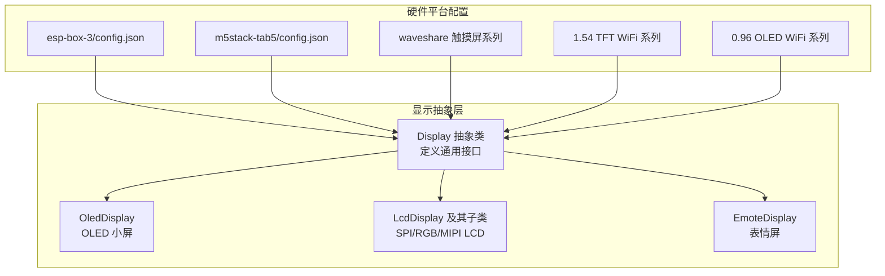
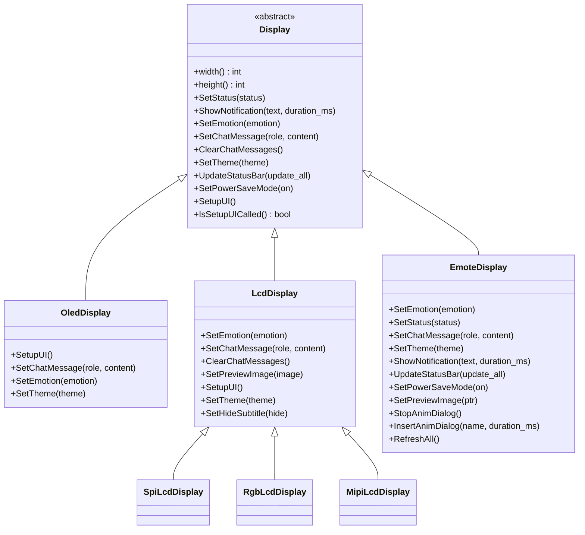
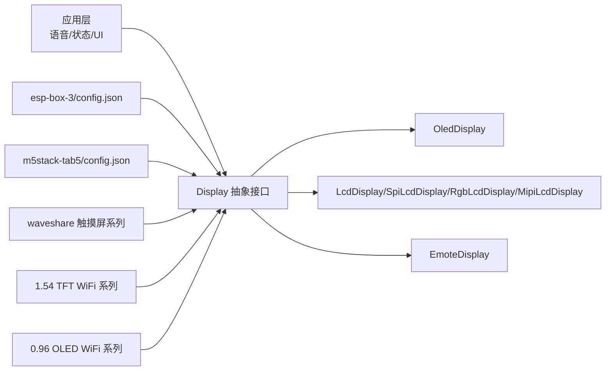

# 显示能力平台

<cite>
**本文引用的文件**
- [main/display/display.h](file://main/display/display.h)
- [main/display/oled_display.h](file://main/display/oled_display.h)
- [main/display/lcd_display.h](file://main/display/lcd_display.h)
- [main/display/emote_display.h](file://main/display/emote_display.h)
- [main/boards/esp-box-3/config.json](file://main/boards/esp-box-3/config.json)
- [main/boards/m5stack-tab5/config.json](file://main/boards/m5stack-tab5/config.json)
- [main/boards/waveshare/esp32-s3-touch-amoled-1.8/config.json](file://main/boards/waveshare/esp32-s3-touch-amoled-1.8/config.json)
- [main/boards/waveshare/esp32-s3-touch-lcd-3.5/config.json](file://main/boards/waveshare/esp32-s3-touch-lcd-3.5/config.json)
- [main/boards/xingzhi-cube-1.54tft-wifi/config.json](file://main/boards/xingzhi-cube-1.54tft-wifi/config.json)
- [main/boards/xingzhi-cube-0.96oled-wifi/config.json](file://main/boards/xingzhi-cube-0.96oled-wifi/config.json)
- [main/boards/sp-esp32-s3-1.54-muma/config.json](file://main/boards/sp-esp32-s3-1.54-muma/config.json)
- [main/boards/zhengchen-1.54tft-wifi/config.json](file://main/boards/zhengchen-1.54tft-wifi/config.json)
- [main/boards/genjutech-s3-1.54tft/config.json](file://main/boards/genjutech-s3-1.54tft/config.json)
- [main/boards/esp32s3-korvo2-v3/config.json](file://main/boards/esp32s3-korvo2-v3/config.json)
</cite>

## 目录
1. [简介](#简介)
2. [项目结构](#项目结构)
3. [核心组件](#核心组件)
4. [架构总览](#架构总览)
5. [详细组件分析](#详细组件分析)
6. [依赖关系分析](#依赖关系分析)
7. [性能与功耗考量](#性能与功耗考量)
8. [故障排查指南](#故障排查指南)
9. [结论](#结论)
10. [附录：显示平台对比与选型建议](#附录显示平台对比与选型建议)

## 简介
本文件面向 XiaoZhi ESP32 项目中的显示能力硬件平台，系统性梳理具备不同显示能力的开发板类型，包括 OLED 屏幕、LCD 屏幕（含触摸）、电子墨水屏（EPD）等，并聚焦于大屏显示平台（如 ESP-BOX-3、M5Stack Tab5）的多媒体应用能力。文档从分辨率、色彩、触控、功耗、成本与适用场景等维度进行对比，帮助开发者在语音交互、状态指示与用户界面等场景中做出合理选型。

## 项目结构
围绕显示能力的关键代码位于 main/display 目录，抽象出统一的 Display 接口，具体实现覆盖 OLED、LCD（SPI/RGB/MIPI）、表情屏（EmoteDisplay）等；同时，各硬件平台通过 boards 下的配置文件声明目标芯片、构建选项与可选外设（如摄像头、触摸、消息样式等）。

图示来源
- [main/display/display.h](file://main/display/display.h#L28-L61)
- [main/display/oled_display.h](file://main/display/oled_display.h#L10-L39)
- [main/display/lcd_display.h](file://main/display/lcd_display.h#L17-L83)
- [main/display/emote_display.h](file://main/display/emote_display.h#L12-L42)
- [main/boards/esp-box-3/config.json](file://main/boards/esp-box-3/config.json#L1-L11)
- [main/boards/m5stack-tab5/config.json](file://main/boards/m5stack-tab5/config.json#L1-L19)
- [main/boards/waveshare/esp32-s3-touch-amoled-1.8/config.json](file://main/boards/waveshare/esp32-s3-touch-amoled-1.8/config.json#L1-L12)
- [main/boards/waveshare/esp32-s3-touch-lcd-3.5/config.json](file://main/boards/waveshare/esp32-s3-touch-lcd-3.5/config.json#L1-L20)
- [main/boards/xingzhi-cube-1.54tft-wifi/config.json](file://main/boards/xingzhi-cube-1.54tft-wifi/config.json#L1-L9)
- [main/boards/xingzhi-cube-0.96oled-wifi/config.json](file://main/boards/xingzhi-cube-0.96oled-wifi/config.json#L1-L9)

章节来源
- [main/display/display.h](file://main/display/display.h#L1-L88)
- [main/display/oled_display.h](file://main/display/oled_display.h#L1-L42)
- [main/display/lcd_display.h](file://main/display/lcd_display.h#L1-L86)
- [main/display/emote_display.h](file://main/display/emote_display.h#L1-L43)

## 核心组件
- Display 抽象类：定义统一的显示接口，包括状态设置、通知展示、聊天消息、主题切换、电源省电模式、UI 初始化等；并提供轻量锁机制以保证线程安全。
- OledDisplay：面向 OLED 小屏（常见 128x64/128x32），封装 LVGL UI 组件布局与绘制。
- LcdDisplay 及其子类：面向 LCD 大屏，支持 SPI/RGB/MIPI 接口，具备预览图、表情、聊天消息、字幕隐藏等功能；支持 GIF 播放与主题切换。
- EmoteDisplay：面向表情屏，提供表情播放、状态更新、通知、预览图插入与停止等能力。

章节来源
- [main/display/display.h](file://main/display/display.h#L28-L61)
- [main/display/oled_display.h](file://main/display/oled_display.h#L10-L39)
- [main/display/lcd_display.h](file://main/display/lcd_display.h#L17-L83)
- [main/display/emote_display.h](file://main/display/emote_display.h#L12-L42)

## 架构总览
显示子系统采用“抽象接口 + 具体实现 + 平台配置”的分层设计。上层业务通过 Display 抽象调用，底层根据具体硬件实现（OLED/LCD/表情屏）完成渲染；平台配置文件决定目标芯片、外设启用与构建宏，从而影响显示风格与功能（例如微信消息样式、摄像头支持等）。

图示来源
- [main/display/display.h](file://main/display/display.h#L28-L61)
- [main/display/oled_display.h](file://main/display/oled_display.h#L10-L39)
- [main/display/lcd_display.h](file://main/display/lcd_display.h#L17-L83)
- [main/display/emote_display.h](file://main/display/emote_display.h#L12-L42)

## 详细组件分析

### OLED 小屏显示（OledDisplay）
- 适用场景：低功耗、小尺寸、简单状态指示与基础文本/表情展示。
- 特点：基于 LVGL 的 UI 布局，支持顶部栏、状态栏、内容区、侧边栏、表情与聊天消息；针对 128x64/128x32 等分辨率进行适配。
- 功耗：OLED 自发光、黑场灭灯，适合待机与低亮环境；结合 Display 的电源省电模式可进一步降低功耗。

章节来源
- [main/display/oled_display.h](file://main/display/oled_display.h#L10-L39)

### LCD 大屏显示（LcdDisplay 及子类）
- 适用场景：需要较大可视面积、更丰富 UI 与多媒体内容（图片、GIF、字幕）的设备。
- 类型与差异：
  - LcdDisplay：通用 LCD 实现，支持预览图缓存、GIF 控制器、字幕隐藏、主题切换等。
  - SpiLcdDisplay：SPI 接口 LCD。
  - RgbLcdDisplay：RGB 接口 LCD。
  - MipiLcdDisplay：MIPI 接口 LCD。
- 能力：表情展示、聊天消息、通知、状态栏更新、预览图与 GIF 播放、主题切换、隐藏字幕等。
- 大屏平台参考：
  - ESP-BOX-3：多构建宏启用，适合多媒体与语音交互场景。
  - M5Stack Tab5：启用摄像头与 SDIO 配置，适合平板式交互与视频应用。
  - Waveshare 触摸 LCD/AMOLED 系列：支持微信消息样式与多种摄像头配置，适合触控交互与多媒体演示。

章节来源
- [main/display/lcd_display.h](file://main/display/lcd_display.h#L17-L83)
- [main/boards/esp-box-3/config.json](file://main/boards/esp-box-3/config.json#L1-L11)
- [main/boards/m5stack-tab5/config.json](file://main/boards/m5stack-tab5/config.json#L1-L19)
- [main/boards/waveshare/esp32-s3-touch-amoled-1.8/config.json](file://main/boards/waveshare/esp32-s3-touch-amoled-1.8/config.json#L1-L12)
- [main/boards/waveshare/esp32-s3-touch-lcd-3.5/config.json](file://main/boards/waveshare/esp32-s3-touch-lcd-3.5/config.json#L1-L20)

### 表情屏显示（EmoteDisplay）
- 适用场景：强调动态表情与情感表达的设备，如机器人、陪伴设备。
- 能力：表情播放控制（插入/停止）、状态更新、通知、预览图、全量刷新、主题切换与电源省电模式。
- 优势：独立于 LVGL 的表情渲染路径，便于在资源受限场景下实现流畅的表情动画。

章节来源
- [main/display/emote_display.h](file://main/display/emote_display.h#L12-L42)

### 触控与输入
- 触控能力通常由平台配置与面板驱动共同决定。例如某些平台启用了微信消息样式与摄像头配置，表明其具备触控与多媒体综合能力。
- 在实际使用中，触控校准与事件处理需配合面板驱动与 GUI 框架完成。

章节来源
- [main/boards/waveshare/esp32-s3-touch-amoled-1.8/config.json](file://main/boards/waveshare/esp32-s3-touch-amoled-1.8/config.json#L1-L12)
- [main/boards/waveshare/esp32-s3-touch-lcd-3.5/config.json](file://main/boards/waveshare/esp32-s3-touch-lcd-3.5/config.json#L1-L20)

### 电子墨水屏（EPD）
- 仓库中存在电子墨水屏相关目录与配置项，但未见直接的 EPD 显示类实现文件。若需使用 EPD，请依据平台配置启用相应驱动，并在应用层按需扩展显示实现或采用现有 LVGL EPD 支持方案。

章节来源
- [main/boards/waveshare/esp32-s3-epaper-1.54/config.json](file://main/boards/waveshare/esp32-s3-epaper-1.54/config.json#L1-L9)

## 依赖关系分析
- 显示抽象层与具体实现解耦：Display 抽象屏蔽了不同面板的差异，具体实现仅关注面板驱动与 UI 组件。
- 平台配置对功能的影响：通过 config.json 中的 sdkconfig_append 宏，启用微信消息样式、摄像头、SDIO 等，直接影响显示风格与多媒体能力。
- 外设耦合：部分平台同时启用摄像头与触控，形成“显示+视觉输入”的完整体验。

图示来源
- [main/display/display.h](file://main/display/display.h#L28-L61)
- [main/display/oled_display.h](file://main/display/oled_display.h#L10-L39)
- [main/display/lcd_display.h](file://main/display/lcd_display.h#L17-L83)
- [main/display/emote_display.h](file://main/display/emote_display.h#L12-L42)
- [main/boards/esp-box-3/config.json](file://main/boards/esp-box-3/config.json#L1-L11)
- [main/boards/m5stack-tab5/config.json](file://main/boards/m5stack-tab5/config.json#L1-L19)
- [main/boards/waveshare/esp32-s3-touch-amoled-1.8/config.json](file://main/boards/waveshare/esp32-s3-touch-amoled-1.8/config.json#L1-L12)
- [main/boards/xingzhi-cube-1.54tft-wifi/config.json](file://main/boards/xingzhi-cube-1.54tft-wifi/config.json#L1-L9)
- [main/boards/xingzhi-cube-0.96oled-wifi/config.json](file://main/boards/xingzhi-cube-0.96oled-wifi/config.json#L1-L9)

## 性能与功耗考量
- 分辨率与刷新：高分辨率与频繁刷新会增加带宽与功耗。OLED 小屏在静态内容时更省电；LCD 大屏适合动态内容，但需注意背光与刷新策略。
- 背光与亮度：LCD 类显示可通过背光控制与亮度调节降低功耗；OLED 可通过像素级熄灭进一步节能。
- 多媒体负载：GIF 播放、预览图缓存与摄像头采集会显著提升 CPU/内存占用，需结合平台性能与存储容量评估。
- 电源管理：通过 Display 的电源省电模式与平台配置中的宏，可在空闲或低优先级任务中降低功耗。

## 故障排查指南
- UI 无法初始化：检查 Display::SetupUI 是否被正确调用，以及具体实现的 UI 初始化流程是否完成。
- 锁定失败：DisplayLockGuard 获取锁超时日志提示，需检查是否存在长时间占用或死锁。
- 分辨率不匹配：确认面板驱动与 UI 布局适配的分辨率一致，避免裁剪或拉伸异常。
- 触控无响应：核对平台配置中是否启用相应触控驱动与中断引脚，确保 GUI 事件循环正常运行。
- 多媒体卡顿：减少刷新频率、关闭不必要的预览图缓存与 GIF 播放，或优化图像格式与尺寸。

章节来源
- [main/display/display.h](file://main/display/display.h#L64-L77)

## 结论
XiaoZhi ESP32 的显示子系统以 Display 抽象为核心，向下兼容 OLED、LCD（SPI/RGB/MIPI）、表情屏等多种硬件形态，并通过平台配置灵活启用多媒体与触控能力。对于语音交互、状态指示与用户界面，应根据分辨率、色彩、触控与功耗需求选择合适平台；大屏平台（如 ESP-BOX-3、M5Stack Tab5）更适合多媒体与触控交互场景。

## 附录：显示平台对比与选型建议
- OLED 小屏（如 0.96” OLED WiFi 系列）
  - 优点：低功耗、成本低、适合简单状态指示与基础 UI。
  - 适用：便携设备、待机指示、低复杂度交互。
- 1.54” TFT WiFi 系列（如 Xingzhi Cube、Zhengchen、GenjuTech 等）
  - 优点：中等分辨率、成本适中、可承载基础图文与字幕。
  - 适用：入门级多媒体、教学与轻量机器人。
- 触摸 LCD/AMOLED（如 Waveshare S3 触摸系列）
  - 优点：高分辨率、色彩丰富、触控体验佳；可启用微信消息样式与摄像头。
  - 适用：触控交互、演示与中高端多媒体应用。
- 大屏平板（如 M5Stack Tab5）
  - 优点：高分辨率、强算力（ESP32P4）、摄像头与 SDIO 配置完善。
  - 适用：平板式交互、视频通话、教育与工业控制。
- 大屏盒子（如 ESP-BOX-3）
  - 优点：多媒体能力完备、构建宏启用 AEC 等音频增强。
  - 适用：智能音箱、语音助手、家庭娱乐中心。
- 电子墨水屏（EPD）
  - 优点：阳光下可读、极低功耗。
  - 适用：户外标签、电子书阅读器、低频更新场景。

成本与选型建议
- 成本排序（从低到高）：OLED 小屏 < 1.54 TFT WiFi 系列 < 触摸 LCD/AMOLED < 大屏平板 < 大屏盒子。
- 选型要点：
  - 若侧重低功耗与简单 UI：优先 OLED 小屏。
  - 若需要中等分辨率与一定多媒体能力：选择 1.54 TFT WiFi 系列。
  - 若强调触控与高画质：选择触摸 LCD/AMOLED。
  - 若需要强算力与摄像头：选择 M5Stack Tab5 或 ESP-BOX-3。
  - 若强调长续航与可读性：考虑 EPD（需按需扩展实现）。

章节来源
- [main/boards/xingzhi-cube-0.96oled-wifi/config.json](file://main/boards/xingzhi-cube-0.96oled-wifi/config.json#L1-L9)
- [main/boards/xingzhi-cube-1.54tft-wifi/config.json](file://main/boards/xingzhi-cube-1.54tft-wifi/config.json#L1-L9)
- [main/boards/zhengchen-1.54tft-wifi/config.json](file://main/boards/zhengchen-1.54tft-wifi/config.json#L1-L9)
- [main/boards/genjutech-s3-1.54tft/config.json](file://main/boards/genjutech-s3-1.54tft/config.json#L1-L9)
- [main/boards/waveshare/esp32-s3-touch-amoled-1.8/config.json](file://main/boards/waveshare/esp32-s3-touch-amoled-1.8/config.json#L1-L12)
- [main/boards/waveshare/esp32-s3-touch-lcd-3.5/config.json](file://main/boards/waveshare/esp32-s3-touch-lcd-3.5/config.json#L1-L20)
- [main/boards/m5stack-tab5/config.json](file://main/boards/m5stack-tab5/config.json#L1-L19)
- [main/boards/esp-box-3/config.json](file://main/boards/esp-box-3/config.json#L1-L11)
- [main/boards/esp32s3-korvo2-v3/config.json](file://main/boards/esp32s3-korvo2-v3/config.json#L1-L10)