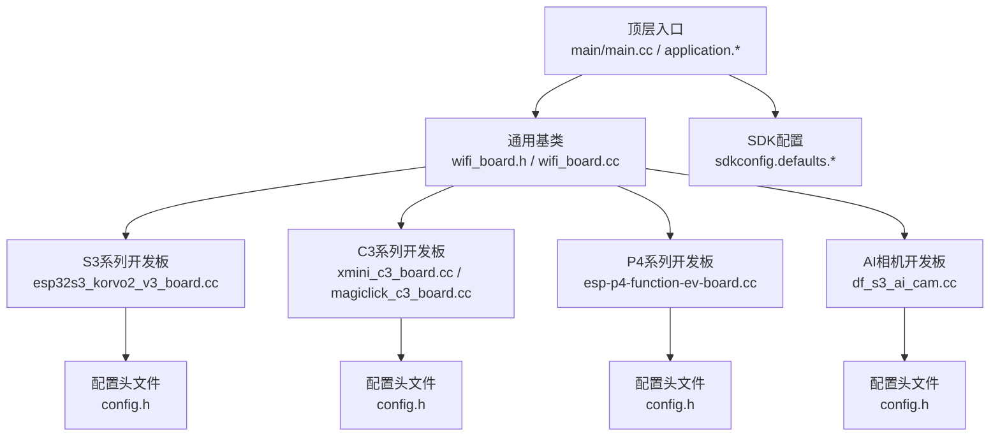
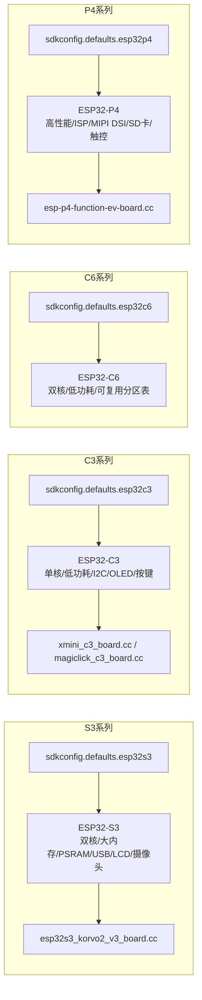
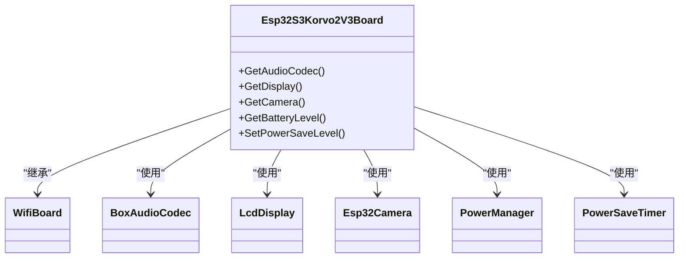
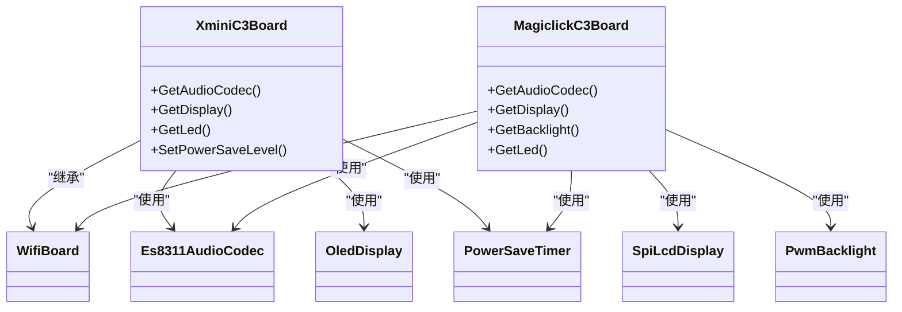
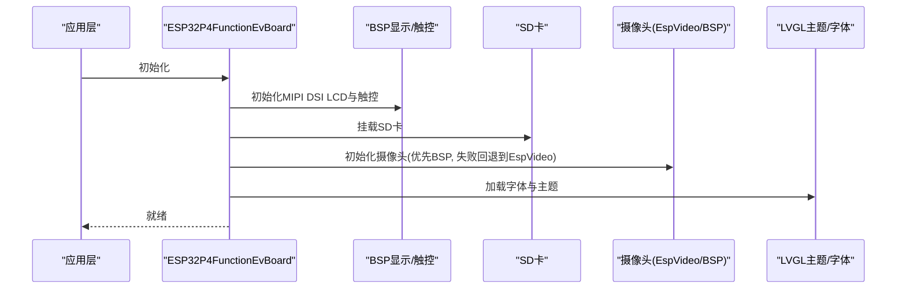
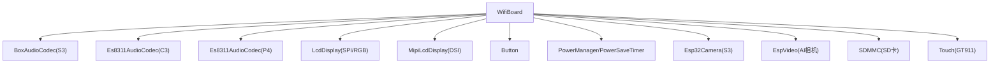

# 芯片架构平台

<cite>
**本文引用的文件**
- [README.md](file://README.md)
- [sdkconfig.defaults.esp32s3](file://sdkconfig.defaults.esp32s3)
- [sdkconfig.defaults.esp32c3](file://sdkconfig.defaults.esp32c3)
- [sdkconfig.defaults.esp32c6](file://sdkconfig.defaults.esp32c6)
- [sdkconfig.defaults.esp32p4](file://sdkconfig.defaults.esp32p4)
- [main/boards/esp32s3-korvo2-v3/config.h](file://main/boards/esp32s3-korvo2-v3/config.h)
- [main/boards/esp32s3-korvo2-v3/esp32s3_korvo2_v3_board.cc](file://main/boards/esp32s3-korvo2-v3/esp32s3_korvo2_v3_board.cc)
- [main/boards/xmini-c3/config.h](file://main/boards/xmini-c3/config.h)
- [main/boards/xmini-c3/xmini_c3_board.cc](file://main/boards/xmini-c3/xmini_c3_board.cc)
- [main/boards/magiclick-c3/config.h](file://main/boards/magiclick-c3/config.h)
- [main/boards/magiclick-c3/magiclick_c3_board.cc](file://main/boards/magiclick-c3/magiclick_c3_board.cc)
- [main/boards/df-s3-ai-cam/config.h](file://main/boards/df-s3-ai-cam/config.h)
- [main/boards/df-s3-ai-cam/df_s3_ai_cam.cc](file://main/boards/df-s3-ai-cam/df_s3_ai_cam.cc)
- [main/boards/esp-p4-function-ev-board/config.h](file://main/boards/esp-p4-function-ev-board/config.h)
- [main/boards/esp-p4-function-ev-board/esp-p4-function-ev-board.cc](file://main/boards/esp-p4-function-ev-board/esp-p4-function-ev-board.cc)
</cite>

## 目录
1. [引言](#引言)
2. [项目结构](#项目结构)
3. [核心组件](#核心组件)
4. [架构总览](#架构总览)
5. [详细组件分析](#详细组件分析)
6. [依赖关系分析](#依赖关系分析)
7. [性能考量](#性能考量)
8. [故障排查指南](#故障排查指南)
9. [结论](#结论)
10. [附录](#附录)

## 引言
本文件面向XiaoZhi ESP32项目的硬件平台分类与选型，聚焦于不同ESP32芯片架构（ESP32-S3、ESP32-C3、ESP32-C6、ESP32-P4）在开发板上的实现与差异。文档从系统架构、组件关系、数据流与处理逻辑入手，结合实际开发板代码与SDK配置，总结各架构在性能、功耗、功能特性方面的差异，并给出典型应用场景、性能对比与成本分析建议，帮助用户按需选择合适的芯片架构。

## 项目结构
XiaoZhi项目采用“多开发板适配 + 统一应用框架”的组织方式：顶层通过CMake与SDK配置选择目标芯片；各开发板在main/boards目录下提供独立的config.h与实现文件，统一继承自通用的WiFi基类，完成音频、显示、按键、电源管理、相机等子系统的集成。

图示来源
- [main/boards/esp32s3-korvo2-v3/esp32s3_korvo2_v3_board.cc](file://main/boards/esp32s3-korvo2-v3/esp32s3_korvo2_v3_board.cc#L53-L452)
- [main/boards/xmini-c3/xmini_c3_board.cc](file://main/boards/xmini-c3/xmini_c3_board.cc#L21-L180)
- [main/boards/magiclick-c3/magiclick_c3_board.cc](file://main/boards/magiclick-c3/magiclick_c3_board.cc#L49-L190)
- [main/boards/esp-p4-function-ev-board/esp-p4-function-ev-board.cc](file://main/boards/esp-p4-function-ev-board/esp-p4-function-ev-board.cc#L41-L231)
- [main/boards/df-s3-ai-cam/df_s3_ai_cam.cc](file://main/boards/df-s3-ai-cam/df_s3_ai_cam.cc#L18-L112)

章节来源
- [README.md](file://README.md#L34-L36)

## 核心组件
- 应用层：统一的应用状态机与交互流程，负责唤醒词、语音链路、显示与设备控制。
- 通信层：WiFi基类封装网络接入与配置模式切换。
- 媒体子系统：音频编解码器、音频处理器、唤醒词检测、音视频采集与显示。
- 设备子系统：按键、背光、电源管理、SD卡、触摸等外设。
- 开发板适配层：每个开发板实现各自的GPIO、I2C、SPI、MIPI DSI等硬件接口与资源初始化。

章节来源
- [main/boards/esp32s3-korvo2-v3/esp32s3_korvo2_v3_board.cc](file://main/boards/esp32s3-korvo2-v3/esp32s3_korvo2_v3_board.cc#L53-L452)
- [main/boards/xmini-c3/xmini_c3_board.cc](file://main/boards/xmini-c3/xmini_c3_board.cc#L21-L180)
- [main/boards/magiclick-c3/magiclick_c3_board.cc](file://main/boards/magiclick-c3/magiclick_c3_board.cc#L49-L190)
- [main/boards/esp-p4-function-ev-board/esp-p4-function-ev-board.cc](file://main/boards/esp-p4-function-ev-board/esp-p4-function-ev-board.cc#L41-L231)
- [main/boards/df-s3-ai-cam/df_s3_ai_cam.cc](file://main/boards/df-s3-ai-cam/df_s3_ai_cam.cc#L18-L112)

## 架构总览
不同芯片架构在SDK配置层面体现为不同的默认参数与优化策略，开发板实现则围绕各自SoC的能力进行外设集成与资源调度。

图示来源
- [sdkconfig.defaults.esp32s3](file://sdkconfig.defaults.esp32s3#L1-L32)
- [sdkconfig.defaults.esp32c3](file://sdkconfig.defaults.esp32c3#L1-L15)
- [sdkconfig.defaults.esp32c6](file://sdkconfig.defaults.esp32c6#L1-L6)
- [sdkconfig.defaults.esp32p4](file://sdkconfig.defaults.esp32p4#L1-L32)

## 详细组件分析

### ESP32-S3 系列：高性能多媒体平台
- 片上资源与配置要点
  - 默认主频较高，启用SPIRAM并配置PSRAM访问参数，提升图形与AI场景性能。
  - 启用LVGL快照等图形优化选项，适合高分辨率LCD与复杂UI。
- 典型开发板实现
  - esp32s3_korvo2_v3_board.cc：集成I2C音频编解码、SPI LCD、ADC按键、电源管理、摄像头等，支持多种显示面板初始化序列与背光控制。
- 功能特性
  - 支持高分辨率LCD、摄像头、I2C扩展IO、电源节能定时器等。
  - 提供多种显示面板初始化路径（如ILI9341/ST7789），满足不同屏幕形态。
- 典型应用场景
  - 多媒体交互终端、AI相机、机器人控制盒、长续航多媒体设备。
- 性能与功耗
  - 高性能但功耗相对较高，适合有PSRAM与图形需求的场景；可通过电源定时器降低待机电流。

图示来源
- [main/boards/esp32s3-korvo2-v3/esp32s3_korvo2_v3_board.cc](file://main/boards/esp32s3-korvo2-v3/esp32s3_korvo2_v3_board.cc#L53-L452)

章节来源
- [sdkconfig.defaults.esp32s3](file://sdkconfig.defaults.esp32s3#L1-L32)
- [main/boards/esp32s3-korvo2-v3/config.h](file://main/boards/esp32s3-korvo2-v3/config.h#L1-L81)
- [main/boards/esp32s3-korvo2-v3/esp32s3_korvo2_v3_board.cc](file://main/boards/esp32s3-korvo2-v3/esp32s3_korvo2_v3_board.cc#L53-L452)

### ESP32-C3 系列：低功耗与简洁生态
- 片上资源与配置要点
  - 默认分区表针对C3优化，启用较低空闲任务栈与禁用IPv6，减少内存占用。
  - 适用于OLED/小尺寸LCD、按键、I2C音频编解码等轻量级外设组合。
- 典型开发板实现
  - xmini_c3_board.cc：OLED显示、I2C音频编解码、按键、电源定时器、EFUSE配置调整。
  - magiclick_c3_board.cc：SPI LCD（NV3023）、I2C音频编解码、背光PWM、电源定时器。
- 功能特性
  - 低功耗、低成本、易于DIY；适合语音交互、简单显示与按键控制。
- 典型应用场景
  - 语音助手、便携设备、低功耗机器人、入门级AI终端。
- 性能与功耗
  - 单核、无PSRAM，图形与AI负载受限；通过电源定时器与睡眠模式显著降低功耗。

图示来源
- [main/boards/xmini-c3/xmini_c3_board.cc](file://main/boards/xmini-c3/xmini_c3_board.cc#L21-L180)
- [main/boards/magiclick-c3/magiclick_c3_board.cc](file://main/boards/magiclick-c3/magiclick_c3_board.cc#L49-L190)

章节来源
- [sdkconfig.defaults.esp32c3](file://sdkconfig.defaults.esp32c3#L1-L15)
- [main/boards/xmini-c3/config.h](file://main/boards/xmini-c3/config.h#L1-L29)
- [main/boards/xmini-c3/xmini_c3_board.cc](file://main/boards/xmini-c3/xmini_c3_board.cc#L21-L180)
- [main/boards/magiclick-c3/config.h](file://main/boards/magiclick-c3/config.h#L1-L48)
- [main/boards/magiclick-c3/magiclick_c3_board.cc](file://main/boards/magiclick-c3/magiclick_c3_board.cc#L49-L190)

### ESP32-C6 系列：低功耗双核与兼容性
- 片上资源与配置要点
  - 与C3类似的分区表命名，Flash大小与模式配置一致，适合在C3生态上迁移。
- 典型应用场景
  - 与C3相近的低功耗、低成本场景，具备双核潜力与更强的外设兼容性。
- 性能与功耗
  - 在保持低功耗的同时，提供双核性能与更丰富的外设接口。

章节来源
- [sdkconfig.defaults.esp32c6](file://sdkconfig.defaults.esp32c6#L1-L6)

### ESP32-P4 系列：AI加速与高性能多媒体
- 片上资源与配置要点
  - 显著提升主任务栈、启用实验特性与优化编译参数，开启ISP流水线控制器，支持MIPI DSI与触控、SD卡等。
- 典型开发板实现
  - esp-p4-function-ev-board.cc：集成BSP显示（MIPI DSI）、触控、SD卡挂载、摄像头（BSP或直接EspVideo）、字体加载与主题管理。
- 功能特性
  - 高分辨率MIPI DSI屏、触控、SD卡、摄像头、LVGL主题与字体支持，适合AI推理与多媒体应用。
- 典型应用场景
  - AI推理终端、高分辨率触控平板、多媒体展示、边缘计算盒子。
- 性能与功耗
  - 高性能主频与ISP支持，适合AI与视频处理；功耗相对较高，需配合电源管理策略。

图示来源
- [main/boards/esp-p4-function-ev-board/esp-p4-function-ev-board.cc](file://main/boards/esp-p4-function-ev-board/esp-p4-function-ev-board.cc#L41-L231)

章节来源
- [sdkconfig.defaults.esp32p4](file://sdkconfig.defaults.esp32p4#L1-L32)
- [main/boards/esp-p4-function-ev-board/config.h](file://main/boards/esp-p4-function-ev-board/config.h#L1-L11)
- [main/boards/esp-p4-function-ev-board/esp-p4-function-ev-board.cc](file://main/boards/esp-p4-function-ev-board/esp-p4-function-ev-board.cc#L41-L231)

### AI相机开发板（S3）：音频简化与视频优先
- 特点
  - 使用NoAudioCodec简化音频路径，专注于摄像头与AI推理。
  - 针对DFRobot摄像头接口进行DVP与SCCB配置，支持OV系列镜头。
- 典型应用场景
  - AI视觉识别、边缘AI盒子、工业检测、安防监控。

章节来源
- [main/boards/df-s3-ai-cam/config.h](file://main/boards/df-s3-ai-cam/config.h#L1-L64)
- [main/boards/df-s3-ai-cam/df_s3_ai_cam.cc](file://main/boards/df-s3-ai-cam/df_s3_ai_cam.cc#L18-L112)

## 依赖关系分析
- 组件耦合
  - 各开发板均依赖WifiBoard提供的网络与基础框架，音频、显示、按键、电源等子系统通过各自的驱动与配置头文件注入。
  - S3与P4在图形与多媒体方面依赖LVGL与显示驱动库；C3侧重简洁与低功耗。
- 外设依赖
  - I2C用于音频编解码器与触摸；SPI用于LCD；MIPI DSI用于P4高分辨率屏；SDMMC用于SD卡；摄像头通过DVP或BSP接口接入。
- 分区与SDK配置
  - 不同架构通过各自的sdkconfig.defaults设置默认参数；C6/C3共享分区表命名，便于生态复用。

图示来源
- [main/boards/esp32s3-korvo2-v3/esp32s3_korvo2_v3_board.cc](file://main/boards/esp32s3-korvo2-v3/esp32s3_korvo2_v3_board.cc#L53-L452)
- [main/boards/esp-p4-function-ev-board/esp-p4-function-ev-board.cc](file://main/boards/esp-p4-function-ev-board/esp-p4-function-ev-board.cc#L41-L231)
- [main/boards/xmini-c3/xmini_c3_board.cc](file://main/boards/xmini-c3/xmini_c3_board.cc#L21-L180)
- [main/boards/df-s3-ai-cam/df_s3_ai_cam.cc](file://main/boards/df-s3-ai-cam/df_s3_ai_cam.cc#L18-L112)

## 性能考量
- CPU频率与任务栈
  - S3与P4默认较高CPU频率与更大的主任务栈，适合实时音频与图形；C3/C6偏向低功耗与稳定运行。
- 内存与缓存
  - S3启用PSRAM与缓存优化，适合高分辨率显示与AI模型；C3无PSRAM，需谨慎选择算法与模型大小。
- 图形与显示
  - S3支持多种LCD初始化序列；P4采用MIPI DSI高分辨率屏，LVGL主题与字体加载由资产系统支撑。
- 摄像头与AI
  - S3与AI相机板支持摄像头与视频处理；P4启用ISP流水线控制器，更适合AI推理与视频处理。
- 无线与网络
  - 统一的WiFi配置参数，S3/P4在缓冲区与加密选项上略有差异，影响吞吐与安全性权衡。

章节来源
- [sdkconfig.defaults.esp32s3](file://sdkconfig.defaults.esp32s3#L1-L32)
- [sdkconfig.defaults.esp32c3](file://sdkconfig.defaults.esp32c3#L1-L15)
- [sdkconfig.defaults.esp32c6](file://sdkconfig.defaults.esp32c6#L1-L6)
- [sdkconfig.defaults.esp32p4](file://sdkconfig.defaults.esp32p4#L1-L32)

## 故障排查指南
- I2C探测失败（C3）
  - 若I2C探测返回错误，会持续报错并阻塞启动，检查音频编解码器地址与引脚配置是否正确。
- 显示初始化异常
  - S3：确认LCD初始化命令序列与面板类型匹配；检查SPI与CS/DC引脚配置。
  - P4：确认MIPI DSI时钟源与速率配置，确保BSP显示初始化成功。
- 摄像头无法启动
  - S3 AI相机：检查DVP引脚映射、XCLK频率与SCCB配置；必要时回退到EspVideo直接初始化。
- 电源管理与睡眠
  - 通过PowerSaveTimer进入/退出睡眠模式，注意显示与背光的电源保存状态切换。
- EFUSE与引脚复用
  - C3侧部分板型会写入EFUSE字段以复用VDD SPI引脚为普通GPIO，避免固件不匹配导致初始化失败。

章节来源
- [main/boards/xmini-c3/xmini_c3_board.cc](file://main/boards/xmini-c3/xmini_c3_board.cc#L58-L65)
- [main/boards/esp32s3-korvo2-v3/esp32s3_korvo2_v3_board.cc](file://main/boards/esp32s3-korvo2-v3/esp32s3_korvo2_v3_board.cc#L280-L353)
- [main/boards/esp-p4-function-ev-board/esp-p4-function-ev-board.cc](file://main/boards/esp-p4-function-ev-board/esp-p4-function-ev-board.cc#L62-L76)
- [main/boards/df-s3-ai-cam/df_s3_ai_cam.cc](file://main/boards/df-s3-ai-cam/df_s3_ai_cam.cc#L34-L84)

## 结论
- 选型建议
  - 需要高性能图形与多媒体：优先ESP32-S3或ESP32-P4。
  - 追求极致低功耗与简洁生态：选择ESP32-C3或ESP32-C6。
  - AI视觉与视频处理：S3 AI相机或P4功能验证板。
- 成本与生态
  - C3/C6生态丰富、成本较低；S3/P4在显示与AI方面能力更强但成本更高。
- 差异化表现
  - 音频处理：三者均可通过I2C音频编解码器实现；P4在音频I2S配置上由BSP统一管理。
  - AI推理：P4具备ISP与更高主频，适合边缘AI；S3与P4均可加载LVGL主题与字体。
  - 网络通信：统一WiFi配置，S3/P4在缓冲与加密参数上有细微差异。

## 附录
- 典型应用场景对照
  - S3：多媒体交互、机器人控制盒、长续航设备。
  - C3：语音助手、便携设备、入门级AI终端。
  - P4：高分辨率触控平板、AI推理终端、多媒体展示。
  - AI相机（S3）：边缘AI盒子、工业检测、安防监控。