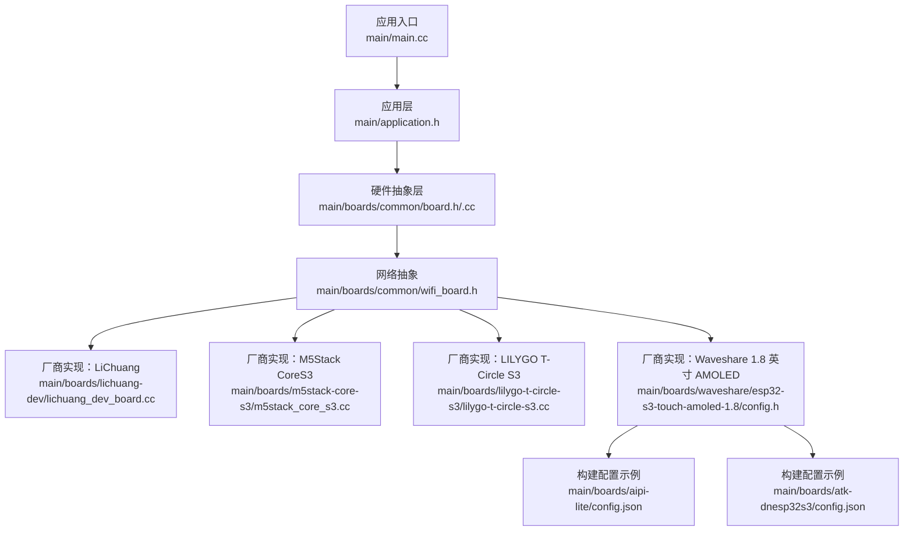
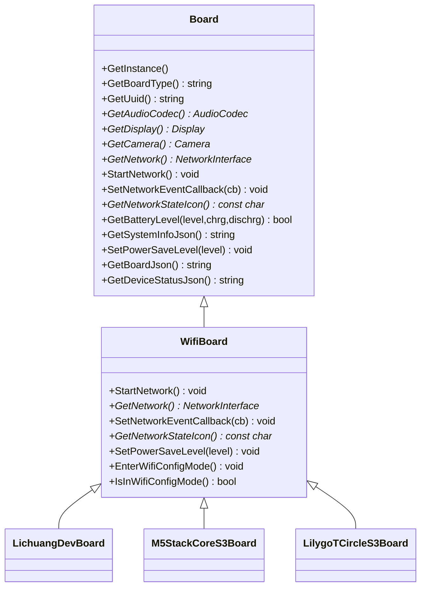
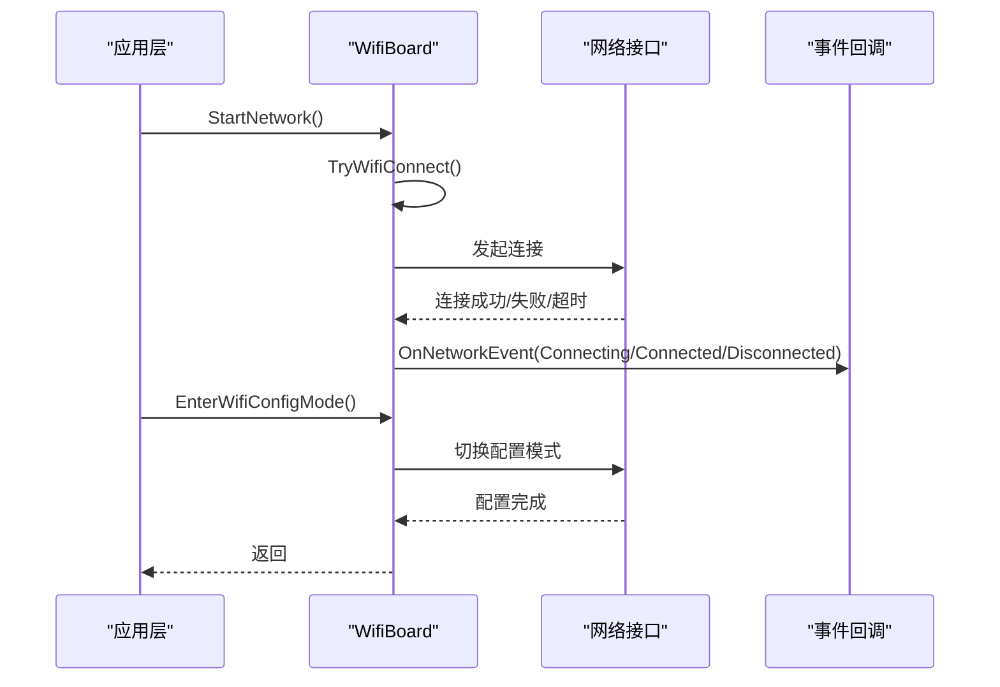
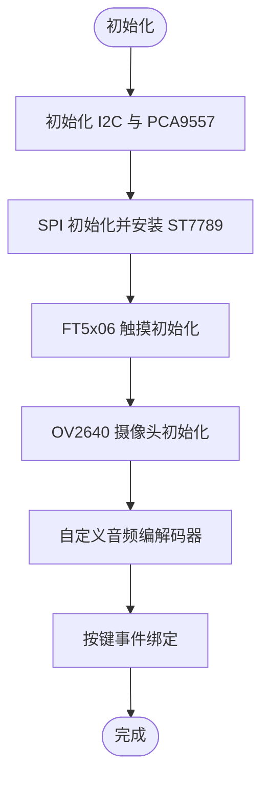
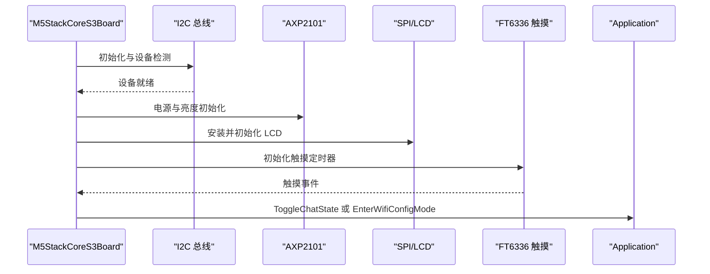
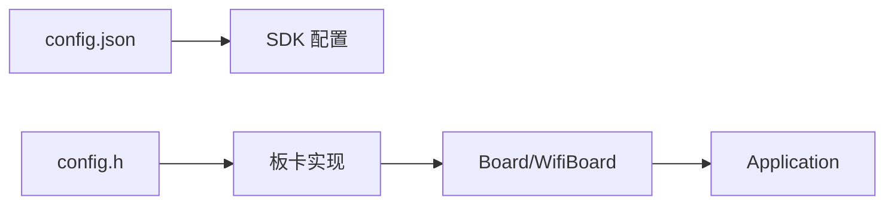

# 硬件平台

<cite>
**本文引用的文件**   
- [main.cc](file://main/main.cc)
- [application.h](file://main/application.h)
- [board.h](file://main/boards/common/board.h)
- [board.cc](file://main/boards/common/board.cc)
- [wifi_board.h](file://main/boards/common/wifi_board.h)
- [lichuang_dev_board.cc](file://main/boards/lichuang-dev/lichuang_dev_board.cc)
- [m5stack_core_s3.cc](file://main/boards/m5stack-core-s3/m5stack_core_s3.cc)
- [lilygo-t-circle-s3.cc](file://main/boards/lilygo-t-circle-s3/lilygo-t-circle-s3.cc)
- [config.h（Waveshare 1.8 英寸 AMOLED）](file://main/boards/waveshare/esp32-s3-touch-amoled-1.8/config.h)
- [config.json（AiPi Lite）](file://main/boards/aipi-lite/config.json)
- [config.json（ATK DNESP32S3）](file://main/boards/atk-dnesp32s3/config.json)
- [README.md](file://README.md)
</cite>

## 目录
1. [简介](#简介)
2. [项目结构](#项目结构)
3. [核心组件](#核心组件)
4. [架构总览](#架构总览)
5. [详细组件分析](#详细组件分析)
6. [依赖关系分析](#依赖关系分析)
7. [性能考虑](#性能考虑)
8. [故障排除指南](#故障排除指南)
9. [结论](#结论)
10. [附录](#附录)

## 简介
本文件面向硬件开发者与用户，系统化梳理 XiaoZhi ESP32 项目的硬件平台体系。项目支持 70+ 开源硬件平台，覆盖 LiChuang、M5Stack、Waveshare、LILYGO、魔 Tick、Seeed Studio、WMnologo 等主流厂商与生态。通过统一的硬件抽象层（HAL），Board 基类定义了设备通用能力与接口规范；各厂商具体开发板以 WifiBoard 为基础，按需扩展音频编解码、显示驱动、触摸、摄像头、电源管理等子系统，并通过配置文件与引脚定义完成差异化适配。

## 项目结构
XiaoZhi ESP32 的硬件平台相关代码主要集中在 main/boards 目录下，采用“按厂商/型号分目录”的组织方式，每个板卡包含独立的配置头文件、JSON 构建配置以及实现文件。公共 HAL 层位于 main/boards/common，提供 Board、WifiBoard 等基础抽象。

图表来源
- [main.cc](file://main/main.cc#L15-L30)
- [application.h](file://main/application.h#L42-L64)
- [board.h](file://main/boards/common/board.h#L49-L85)
- [wifi_board.h](file://main/boards/common/wifi_board.h#L9-L67)
- [lichuang_dev_board.cc](file://main/boards/lichuang-dev/lichuang_dev_board.cc#L67-L285)
- [m5stack_core_s3.cc](file://main/boards/m5stack-core-s3/m5stack_core_s3.cc#L119-L396)
- [lilygo-t-circle-s3.cc](file://main/boards/lilygo-t-circle-s3/lilygo-t-circle-s3.cc#L52-L258)
- [config.h（Waveshare 1.8 英寸 AMOLED）](file://main/boards/waveshare/esp32-s3-touch-amoled-1.8/config.h#L1-L42)
- [config.json（AiPi Lite）](file://main/boards/aipi-lite/config.json#L1-L12)
- [config.json（ATK DNESP32S3）](file://main/boards/atk-dnesp32s3/config.json#L1-L13)

章节来源
- [main.cc](file://main/main.cc#L15-L30)
- [application.h](file://main/application.h#L42-L64)
- [board.h](file://main/boards/common/board.h#L49-L85)
- [wifi_board.h](file://main/boards/common/wifi_board.h#L9-L67)

## 核心组件
- Board 基类：定义统一的硬件抽象接口，包括获取板型名称、UUID、音频编解码器、显示、摄像头、网络接口、电源策略、系统信息导出等。提供静态单例工厂 create_board() 与 DECLARE_BOARD 宏，确保每种板卡只实例化一次。
- WifiBoard 抽象：在 Board 基础上封装 WiFi 连接流程、配置模式、网络事件回调、状态图标等，为 Wi-Fi/蜂窝网络板卡提供一致的网络接入体验。
- 应用入口与主循环：main.cc 初始化 NVS 并启动 Application；Application 负责事件调度、状态机、协议通道、OTA 升级、音视频服务等。

章节来源
- [board.h](file://main/boards/common/board.h#L49-L85)
- [board.cc](file://main/boards/common/board.cc#L15-L46)
- [wifi_board.h](file://main/boards/common/wifi_board.h#L9-L67)
- [main.cc](file://main/main.cc#L15-L30)
- [application.h](file://main/application.h#L42-L64)

## 架构总览
XiaoZhi ESP32 的硬件平台采用“抽象接口 + 具体实现 + 配置驱动”的分层设计。Board 基类定义能力边界，WifiBoard 扩展网络接入，各厂商板卡通过组合式装配实现差异化硬件特性。配置文件与头文件集中管理引脚、外设参数与构建选项，保证可移植性与可维护性。

图表来源
- [board.h](file://main/boards/common/board.h#L49-L85)
- [wifi_board.h](file://main/boards/common/wifi_board.h#L9-L67)
- [lichuang_dev_board.cc](file://main/boards/lichuang-dev/lichuang_dev_board.cc#L67-L285)
- [m5stack_core_s3.cc](file://main/boards/m5stack-core-s3/m5stack_core_s3.cc#L119-L396)
- [lilygo-t-circle-s3.cc](file://main/boards/lilygo-t-circle-s3/lilygo-t-circle-s3.cc#L52-L258)

## 详细组件分析

### HAL 架构与 Board 基类
- 设计理念：以纯虚接口约束硬件能力，屏蔽厂商差异；通过工厂与单例机制确保全局唯一硬件实例；将网络、显示、音频、电源等子系统作为可选组件，按需返回空实现或具体实现。
- 接口规范：
  - 获取设备信息：GetBoardType、GetUuid、GetSystemInfoJson、GetBoardJson、GetDeviceStatusJson
  - 外设访问：GetAudioCodec、GetDisplay、GetCamera、GetNetwork
  - 网络生命周期：StartNetwork、SetNetworkEventCallback、GetNetworkStateIcon、EnterWifiConfigMode
  - 能耗策略：SetPowerSaveLevel（低功耗/均衡/性能）
- 默认行为：未实现的外设返回空指针或占位对象，避免调用方判空复杂度上升。

章节来源
- [board.h](file://main/boards/common/board.h#L49-L85)
- [board.cc](file://main/boards/common/board.cc#L56-L68)
- [board.cc](file://main/boards/common/board.cc#L110-L178)

### WifiBoard 抽象与网络事件流
- 职责：封装 WiFi 连接、超时处理、配置模式切换、网络事件回调转发。
- 关键流程：TryWifiConnect 启动连接尝试；OnWifiConnectTimeout 在超时后重试或进入配置模式；EnterWifiConfigMode 提供用户交互入口；OnNetworkEvent 统一上报扫描、连接中、已连接、断开等事件。

图表来源
- [wifi_board.h](file://main/boards/common/wifi_board.h#L22-L67)

章节来源
- [wifi_board.h](file://main/boards/common/wifi_board.h#L9-L67)

### 主控入口与应用循环
- main.cc：初始化 NVS、创建 Application 单例并运行主循环，Never Return 的事件驱动模型由 Application 内部事件组与定时器驱动。
- Application：负责设备状态机、协议通道、OTA、音视频服务、错误处理与任务调度；对外暴露线程安全的状态切换与事件投递接口。

章节来源
- [main.cc](file://main/main.cc#L15-L30)
- [application.h](file://main/application.h#L42-L64)

### 主流硬件平台实现要点

#### LiChuang ESP32-S3 开发板
- 特点：集成 ST7789 LCD、FT5x06 触摸、OV2640 摄像头、PCA9557 扩展IO、自定义音频编解码（ES8311/ES7210）。
- 实现要点：
  - I2C 初始化与 PCA9557 配置，用于控制背光、扩展开关与音频使能。
  - SPI 驱动 ST7789，配合 LVGL 显示表情消息样式或标准 SPI LCD。
  - 按键双击切换 AEC 模式，长按进入 Wi-Fi 配置模式。
  - 自定义音频编解码器在输出使能时通过 PCA9557 控制外部电源。

图表来源
- [lichuang_dev_board.cc](file://main/boards/lichuang-dev/lichuang_dev_board.cc#L76-L264)

章节来源
- [lichuang_dev_board.cc](file://main/boards/lichuang-dev/lichuang_dev_board.cc#L67-L285)

#### M5Stack CoreS3
- 特点：集成 ILI9341/LCD、FT6336 触摸、AW88298 音响、AW9523 扩展IO、AXP2101 PMIC 电源管理。
- 实现要点：
  - I2C 扫描与设备检测，PMIC 初始化与亮度调节。
  - SPI 驱动 ILI9341，AW9523 复位面板与音响。
  - 定时器轮询触摸点，短触切换聊天状态，长按进入 Wi-Fi 配置。
  - 电池状态与功耗策略联动，根据放电状态启用自动休眠。

图表来源
- [m5stack_core_s3.cc](file://main/boards/m5stack-core-s3/m5stack_core_s3.cc#L146-L344)

章节来源
- [m5stack_core_s3.cc](file://main/boards/m5stack-core-s3/m5stack_core_s3.cc#L119-L396)

#### LILYGO T-Circle S3
- 特点：GC9D01N 圆形屏、CST816x 触摸、内置音频编解码、PWM 背光。
- 实现要点：
  - I2C 初始化与 CST816x 触摸轮询，短触触发聊天状态切换。
  - SPI 驱动 GC9D01N，背光通过 PWM 控制。
  - 功耗定时器在非低功耗模式下唤醒显示与背光。

章节来源
- [lilygo-t-circle-s3.cc](file://main/boards/lilygo-t-circle-s3/lilygo-t-circle-s3.cc#L52-L258)

### 配置文件与引脚定义
- 引脚与外设参数：通过 config.h 定义 I2S、I2C、SPI、GPIO、显示分辨率与镜像/旋转等参数，确保不同板卡共享同一 HAL 接口。
- 构建配置：config.json 中指定目标芯片、分区表与 SDK 配置追加项，例如启用 OV2640、设置闪存大小与分区表等。

章节来源
- [config.h（Waveshare 1.8 英寸 AMOLED）](file://main/boards/waveshare/esp32-s3-touch-amoled-1.8/config.h#L6-L41)
- [config.json（AiPi Lite）](file://main/boards/aipi-lite/config.json#L1-L12)
- [config.json（ATK DNESP32S3）](file://main/boards/atk-dnesp32s3/config.json#L1-L13)

### 新硬件平台适配指南
- 目录与命名：在 main/boards 下新建以厂商/型号命名的目录，包含 config.h、config.json 与实现文件。
- 引脚与外设：在 config.h 中定义 I2S、I2C、SPI、GPIO、显示参数、摄像头与音频编解码器地址。
- 构建配置：在 config.json 中设置 target、分区表与 SDKconfig 追加项。
- 继承与实现：
  - 若为 Wi-Fi 板卡，继承 WifiBoard，实现 StartNetwork、GetNetwork、GetAudioCodec、GetDisplay、GetCamera、GetBacklight 等。
  - 若为无网络板卡，直接继承 Board 并按需实现接口。
- 工厂注册：在实现文件末尾使用 DECLARE_BOARD(YourBoardClass) 宏完成工厂注册。
- 默认行为：未实现的接口返回空指针或默认占位对象，避免破坏调用链。

章节来源
- [board.h](file://main/boards/common/board.h#L87-L90)
- [wifi_board.h](file://main/boards/common/wifi_board.h#L43-L67)
- [config.h（Waveshare 1.8 英寸 AMOLED）](file://main/boards/waveshare/esp32-s3-touch-amoled-1.8/config.h#L1-L42)
- [config.json（AiPi Lite）](file://main/boards/aipi-lite/config.json#L1-L12)
- [config.json（ATK DNESP32S3）](file://main/boards/atk-dnesp32s3/config.json#L1-L13)

### 硬件特定组件集成
- 音频编解码：通过 AudioCodec 接口抽象，不同板卡实现各自编解码器（如 ES8311、ES7210、AW88298 等），并在 GetAudioCodec 返回具体实例。
- 显示驱动：通过 Display 接口抽象，结合 SPI/I2C 驱动不同面板（ST7789、ILI9341、GC9D01N、AMOLED 等），并支持 LVGL 与表情显示样式。
- 电源管理：PMIC（如 AXP2101）提供电池状态与亮度控制；PowerSaveTimer 在低功耗模式下降低能耗并自动恢复。
- 摄像头：通过 Camera 接口抽象，支持 OV2640 等常见摄像头模块，部分板卡使用 ESP-VIDEO 或 ESP32-Camera 驱动。

章节来源
- [board.h](file://main/boards/common/board.h#L72-L76)
- [lichuang_dev_board.cc](file://main/boards/lichuang-dev/lichuang_dev_board.cc#L266-L284)
- [m5stack_core_s3.cc](file://main/boards/m5stack-core-s3/m5stack_core_s3.cc#L347-L393)
- [lilygo-t-circle-s3.cc](file://main/boards/lilygo-t-circle-s3/lilygo-t-circle-s3.cc#L223-L251)

## 依赖关系分析
- 板卡实现对 HAL 的依赖：所有厂商板卡均依赖 Board/WifiBoard 抽象，减少对底层驱动的耦合。
- 配置文件对构建系统的依赖：config.json 通过 sdkconfig_append 影响 SDK 配置，config.h 决定外设引脚与参数。
- 应用层对板卡的依赖：Application 仅通过 Board 接口访问硬件，不关心具体厂商实现。

图表来源
- [config.json（AiPi Lite）](file://main/boards/aipi-lite/config.json#L1-L12)
- [config.json（ATK DNESP32S3）](file://main/boards/atk-dnesp32s3/config.json#L1-L13)
- [config.h（Waveshare 1.8 英寸 AMOLED）](file://main/boards/waveshare/esp32-s3-touch-amoled-1.8/config.h#L1-L42)
- [board.h](file://main/boards/common/board.h#L49-L85)
- [application.h](file://main/application.h#L42-L64)

章节来源
- [board.h](file://main/boards/common/board.h#L49-L85)
- [wifi_board.h](file://main/boards/common/wifi_board.h#L9-L67)
- [config.json（AiPi Lite）](file://main/boards/aipi-lite/config.json#L1-L12)
- [config.json（ATK DNESP32S3）](file://main/boards/atk-dnesp32s3/config.json#L1-L13)
- [config.h（Waveshare 1.8 英寸 AMOLED）](file://main/boards/waveshare/esp32-s3-touch-amoled-1.8/config.h#L1-L42)

## 性能考虑
- 功耗策略：通过 PowerSaveLevel 与 PowerSaveTimer 在低功耗模式下降低显示与背光亮度，必要时主动唤醒恢复。
- 显示优化：合理设置 SPI 时钟频率与传输大小，避免阻塞事件循环；在触摸轮询中使用定时器任务，降低主线程压力。
- 音频路径：I2S 参数与采样率需与编解码器匹配，避免过高的采样率导致 CPU 占用过高。
- 分区与内存：根据板卡 Flash 与 PSRAM 情况选择合适的分区表，确保最小空闲堆内存满足应用需求。

## 故障排除指南
- Wi-Fi 连接失败：
  - 检查 EnterWifiConfigMode 是否被正确触发，确认网络凭据是否有效。
  - 查看 OnNetworkEvent 回调中的事件序列（Scanning/Connecting/Connected/Disconnected）定位问题阶段。
- 显示异常：
  - 确认 SPI/I2C 引脚与面板驱动配置一致；检查面板复位、镜像与旋转参数。
  - 对于圆形屏或 AMOLED，核对 RGB 顺序与像素格式。
- 音频无声或杂音：
  - 校验 I2S 引脚与 MCLK 配置；确认编解码器地址与供电。
  - 检查音频编解码器 EnableOutput 逻辑与 PMIC/IO 扩展控制。
- 电池与电源：
  - AXP2101 等 PMIC 需先初始化再读取电量；关注充电/放电状态变化对功耗策略的影响。
- 按键与触摸：
  - 触摸轮询周期与阈值需平衡灵敏度与功耗；短触/长触逻辑应避免误触发。

章节来源
- [wifi_board.h](file://main/boards/common/wifi_board.h#L22-L67)
- [m5stack_core_s3.cc](file://main/boards/m5stack-core-s3/m5stack_core_s3.cc#L195-L243)
- [lichuang_dev_board.cc](file://main/boards/lichuang-dev/lichuang_dev_board.cc#L107-L126)

## 结论
XiaoZhi ESP32 的硬件平台通过清晰的 HAL 抽象与可插拔的板卡实现，实现了对 70+ 开源硬件的统一支持。Board/WifiBoard 基类提供了稳定的接口契约，厂商板卡在保持一致性的同时，能够灵活集成自身特色外设。借助配置文件与构建配置，开发者可以快速完成新硬件平台的适配与验证。

## 附录
- 支持硬件平台列表（部分）：LiChuang、M5Stack、AtomS3R、Magic Button 2.4、Waveshare AMOLED/LCD、LILYGO T-Circle、XiaGe Mini C3、Movecall CuiCan、WMnologo Xingzhi、SenseCAP Watcher、ESP-HI 等。
- 选择建议：
  - 预算友好且功能齐全：Waveshare/魔 Tick/LILYGO 系列
  - 机器人/教育场景：M5Stack CoreS3、ESP32-S3-BOX3
  - DIY 与学习：Breadboard 方案与 AiPi Lite
  - 低功耗与续航：带 PMIC 的板卡（如 M5Stack CoreS3、LILYGO T-Circle）

章节来源
- [README.md](file://README.md#L51-L103)