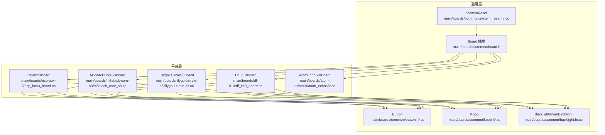
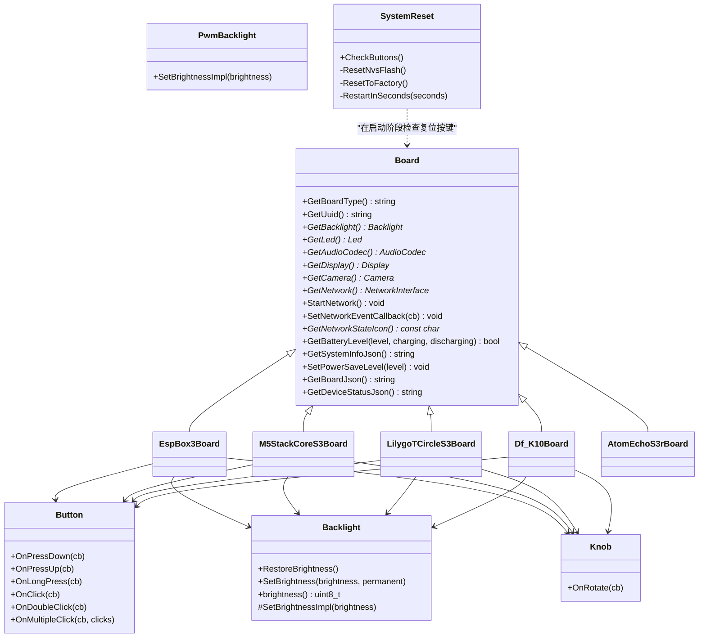
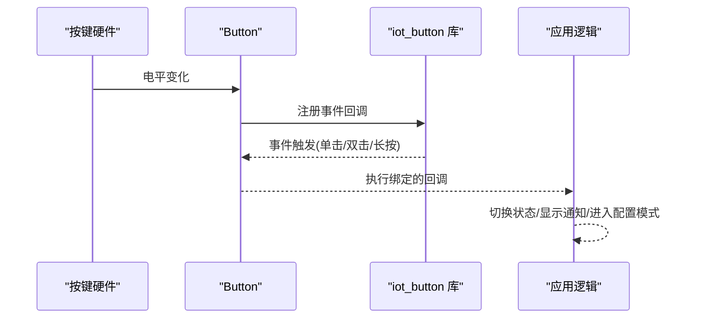
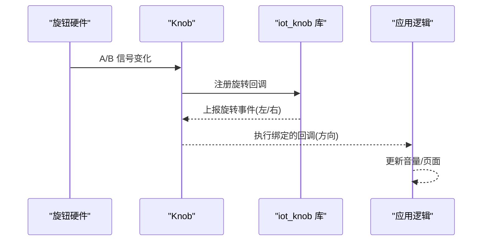
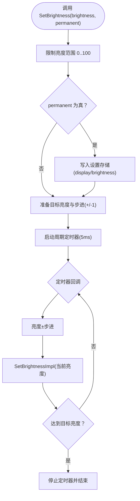
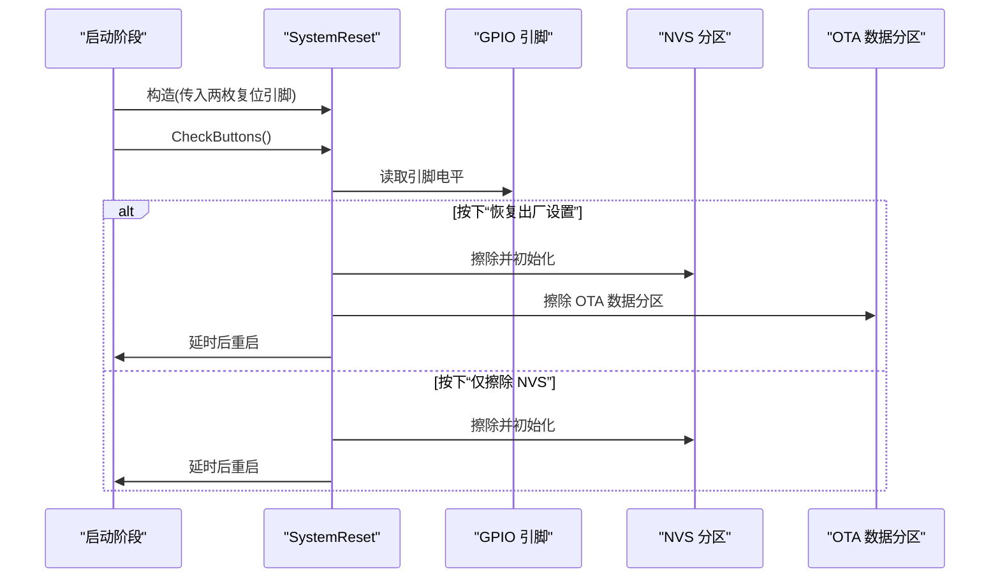
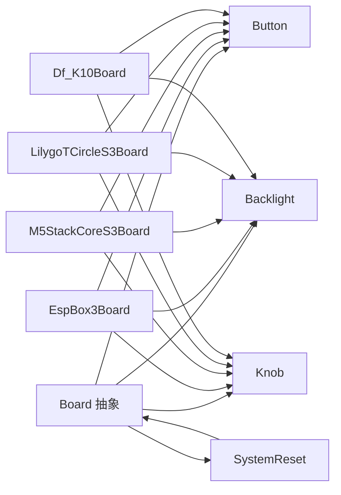

# 外围设备组件

<cite>
**本文引用的文件**
- [main/boards/common/board.h](file://main/boards/common/board.h)
- [main/boards/common/board.cc](file://main/boards/common/board.cc)
- [main/boards/common/button.h](file://main/boards/common/button.h)
- [main/boards/common/button.cc](file://main/boards/common/button.cc)
- [main/boards/common/knob.h](file://main/boards/common/knob.h)
- [main/boards/common/knob.cc](file://main/boards/common/knob.cc)
- [main/boards/common/backlight.h](file://main/boards/common/backlight.h)
- [main/boards/common/backlight.cc](file://main/boards/common/backlight.cc)
- [main/boards/common/system_reset.h](file://main/boards/common/system_reset.h)
- [main/boards/common/system_reset.cc](file://main/boards/common/system_reset.cc)
- [main/boards/esp-box-3/esp_box3_board.cc](file://main/boards/esp-box-3/esp_box3_board.cc)
- [main/boards/m5stack-core-s3/m5stack_core_s3.cc](file://main/boards/m5stack-core-s3/m5stack_core_s3.cc)
- [main/boards/lilygo-t-circle-s3/lilygo-t-circle-s3.cc](file://main/boards/lilygo-t-circle-s3/lilygo-t-circle-s3.cc)
- [main/boards/df-k10/df_k10_board.cc](file://main/boards/df-k10/df_k10_board.cc)
- [main/boards/atom-echos3r/atom_echos3r.cc](file://main/boards/atom-echos3r/atom_echos3r.cc)
</cite>

## 目录
1. [简介](#简介)
2. [项目结构](#项目结构)
3. [核心组件](#核心组件)
4. [架构总览](#架构总览)
5. [详细组件分析](#详细组件分析)
6. [依赖关系分析](#依赖关系分析)
7. [性能考虑](#性能考虑)
8. [故障排查指南](#故障排查指南)
9. [结论](#结论)
10. [附录](#附录)

## 简介
本文件聚焦于 XiaoZhi ESP32 项目的外围设备组件实现，系统性梳理按键、旋钮、背光控制、系统复位、显示与音频等常用外设在不同硬件平台（如 ESP32-S3、ESP32-C3 等）上的配置与使用方式。文档从初始化流程、中断/回调机制、状态检测、事件分发到系统控制与无线通信的集成路径进行深入解析，并提供调试方法、可靠性保障与性能优化建议，帮助硬件开发者完成外设选型与系统集成。

## 项目结构
围绕“通用外设抽象 + 平台适配”的设计思路，项目采用以下组织方式：
- 通用层：位于 main/boards/common，提供统一接口与通用实现（如 Board 抽象、Button、Knob、Backlight、SystemReset 等）
- 平台层：位于 main/boards/<platform>，针对具体硬件平台实现 Board 子类，完成 I2C/SPI/LCD/Audio/Camera 等外设的具体初始化与集成
- 示例平台：ESP32-S3 平台多款开发板（如 EspBox3、M5StackCoreS3、LilygoTCircleS3、DF-K10、AtomEchoS3R）均通过继承通用 Board 抽象完成外设集成

图表来源
- [main/boards/common/board.h](file://main/boards/common/board.h#L49-L93)
- [main/boards/esp-box-3/esp_box3_board.cc](file://main/boards/esp-box-3/esp_box3_board.cc#L39-L176)
- [main/boards/m5stack-core-s3/m5stack_core_s3.cc](file://main/boards/m5stack-core-s3/m5stack_core_s3.cc#L119-L397)
- [main/boards/lilygo-t-circle-s3/lilygo-t-circle-s3.cc](file://main/boards/lilygo-t-circle-s3/lilygo-t-circle-s3.cc#L52-L259)
- [main/boards/df-k10/df_k10_board.cc](file://main/boards/df-k10/df_k10_board.cc#L23-L300)
- [main/boards/atom-echos3r/atom_echos3r.cc](file://main/boards/atom-echos3r/atom_echos3r.cc#L14-L92)

章节来源
- [main/boards/common/board.h](file://main/boards/common/board.h#L1-L93)
- [main/boards/common/board.cc](file://main/boards/common/board.cc#L1-L179)

## 核心组件
本节概述通用外设抽象与平台适配的关键点：
- Board 抽象：定义统一的外设获取接口（如 GetBacklight、GetAudioCodec、GetDisplay、GetCamera、GetNetwork、SetPowerSaveLevel 等），并提供静态单例工厂 create_board()/GetInstance()
- Button：封装 GPIO/ADC 按键，支持点击、双击、多次点击、长按、按下/抬起回调；支持电源节省模式
- Knob：封装旋转编码器，提供旋转方向回调
- Backlight：抽象背光控制，PWM 实现（PwmBacklight），支持渐变过渡与持久化亮度
- SystemReset：基于 GPIO 检测实现 NVS 清除与整机恢复出厂设置

章节来源
- [main/boards/common/board.h](file://main/boards/common/board.h#L49-L93)
- [main/boards/common/button.h](file://main/boards/common/button.h#L11-L50)
- [main/boards/common/knob.h](file://main/boards/common/knob.h#L9-L25)
- [main/boards/common/backlight.h](file://main/boards/common/backlight.h#L10-L37)
- [main/boards/common/system_reset.h](file://main/boards/common/system_reset.h#L6-L22)

## 架构总览
下图展示通用外设与平台实现之间的关系及典型调用链：

图表来源
- [main/boards/common/board.h](file://main/boards/common/board.h#L49-L93)
- [main/boards/esp-box-3/esp_box3_board.cc](file://main/boards/esp-box-3/esp_box3_board.cc#L39-L176)
- [main/boards/m5stack-core-s3/m5stack_core_s3.cc](file://main/boards/m5stack-core-s3/m5stack_core_s3.cc#L119-L397)
- [main/boards/lilygo-t-circle-s3/lilygo-t-circle-s3.cc](file://main/boards/lilygo-t-circle-s3/lilygo-t-circle-s3.cc#L52-L259)
- [main/boards/df-k10/df_k10_board.cc](file://main/boards/df-k10/df_k10_board.cc#L23-L300)
- [main/boards/atom-echos3r/atom_echos3r.cc](file://main/boards/atom-echos3r/atom_echos3r.cc#L14-L92)
- [main/boards/common/button.h](file://main/boards/common/button.h#L11-L50)
- [main/boards/common/knob.h](file://main/boards/common/knob.h#L9-L25)
- [main/boards/common/backlight.h](file://main/boards/common/backlight.h#L10-L37)
- [main/boards/common/system_reset.h](file://main/boards/common/system_reset.h#L6-L22)

## 详细组件分析

### 按键组件 Button
- 初始化流程
  - GPIO 按键：通过 iot_button 库创建 GPIO 设备，配置长按/短按时间、使能电源节省模式、上拉/下拉等
  - ADC 按键：在支持 ADC 的 SoC 上，通过 iot_button 新建 ADC 设备，配置按键参数
- 中断/回调机制
  - 支持注册多种事件回调：按下、抬起、单击、双击、多次点击、长按开始
  - 回调通过 iot_button_register_cb 绑定，内部使用 ESP-IDF 日志记录事件
- 状态检测与电源节省
  - PowerSaveButton 提供专用构造，启用电源节省模式，降低待机电流
- 典型平台集成
  - EspBox3/M5StackCoreS3/LilygoTCircleS3/DF-K10 均通过成员变量持有 Button 对象，并在构造函数中注册回调，用于切换聊天状态、进入 Wi-Fi 配置模式、音量调节等

图表来源
- [main/boards/common/button.cc](file://main/boards/common/button.cc#L44-L125)
- [main/boards/esp-box-3/esp_box3_board.cc](file://main/boards/esp-box-3/esp_box3_board.cc#L73-L91)
- [main/boards/m5stack-core-s3/m5stack_core_s3.cc](file://main/boards/m5stack-core-s3/m5stack_core_s3.cc#L195-L223)
- [main/boards/lilygo-t-circle-s3/lilygo-t-circle-s3.cc](file://main/boards/lilygo-t-circle-s3/lilygo-t-circle-s3.cc#L199-L209)
- [main/boards/df-k10/df_k10_board.cc](file://main/boards/df-k10/df_k10_board.cc#L109-L173)

章节来源
- [main/boards/common/button.h](file://main/boards/common/button.h#L11-L50)
- [main/boards/common/button.cc](file://main/boards/common/button.cc#L1-L125)
- [main/boards/esp-box-3/esp_box3_board.cc](file://main/boards/esp-box-3/esp_box3_board.cc#L73-L91)
- [main/boards/m5stack-core-s3/m5stack_core_s3.cc](file://main/boards/m5stack-core-s3/m5stack_core_s3.cc#L195-L223)
- [main/boards/lilygo-t-circle-s3/lilygo-t-circle-s3.cc](file://main/boards/lilygo-t-circle-s3/lilygo-t-circle-s3.cc#L199-L209)
- [main/boards/df-k10/df_k10_board.cc](file://main/boards/df-k10/df_k10_board.cc#L109-L173)

### 旋钮组件 Knob
- 初始化流程
  - 通过 iot_knob_create 创建编码器实例，配置 A/B 引脚与默认方向
  - 注册左右旋转回调（KNOB_LEFT/KNOB_RIGHT），回调中根据事件方向传递布尔值
- 状态检测与事件分发
  - 事件由库内部检测并上报，用户仅需注册回调即可响应旋转方向
- 典型平台集成
  - M5StackCoreS3/LilygoTCircleS3 等平台通过成员变量持有 Knob 对象并在构造函数中注册回调，用于音量调节或界面导航

图表来源
- [main/boards/common/knob.cc](file://main/boards/common/knob.cc#L5-L52)
- [main/boards/m5stack-core-s3/m5stack_core_s3.cc](file://main/boards/m5stack-core-s3/m5stack_core_s3.cc#L119-L397)
- [main/boards/lilygo-t-circle-s3/lilygo-t-circle-s3.cc](file://main/boards/lilygo-t-circle-s3/lilygo-t-circle-s3.cc#L52-L259)

章节来源
- [main/boards/common/knob.h](file://main/boards/common/knob.h#L9-L25)
- [main/boards/common/knob.cc](file://main/boards/common/knob.cc#L1-L52)

### 背光控制 Backlight/PwmBacklight
- 初始化流程
  - 创建周期性过渡定时器（默认 5ms），在定时器回调中逐步更新当前亮度
  - PwmBacklight 使用 LEDC 配置 PWM 定时器与通道，支持输出反转与高频 PWM（避免电感啸叫）
- 亮度控制与持久化
  - RestoreBrightness 从设置中读取亮度并校正异常值，SetBrightness 支持一次性设置与持久化保存
  - 过渡期间自动停止定时器，避免资源浪费
- 平台适配
  - EspBox3Board/LilygoTCircleS3 使用 PwmBacklight；M5StackCoreS3 通过 PMIC 控制背光，自定义 Backlight 子类直接写 PMIC 寄存器

图表来源
- [main/boards/common/backlight.cc](file://main/boards/common/backlight.cc#L46-L82)
- [main/boards/common/backlight.cc](file://main/boards/common/backlight.cc#L84-L122)
- [main/boards/esp-box-3/esp_box3_board.cc](file://main/boards/esp-box-3/esp_box3_board.cc#L169-L172)
- [main/boards/m5stack-core-s3/m5stack_core_s3.cc](file://main/boards/m5stack-core-s3/m5stack_core_s3.cc#L42-L53)
- [main/boards/lilygo-t-circle-s3/lilygo-t-circle-s3.cc](file://main/boards/lilygo-t-circle-s3/lilygo-t-circle-s3.cc#L248-L251)

章节来源
- [main/boards/common/backlight.h](file://main/boards/common/backlight.h#L10-L37)
- [main/boards/common/backlight.cc](file://main/boards/common/backlight.cc#L1-L122)
- [main/boards/esp-box-3/esp_box3_board.cc](file://main/boards/esp-box-3/esp_box3_board.cc#L169-L172)
- [main/boards/m5stack-core-s3/m5stack_core_s3.cc](file://main/boards/m5stack-core-s3/m5stack_core_s3.cc#L42-L53)
- [main/boards/lilygo-t-circle-s3/lilygo-t-circle-s3.cc](file://main/boards/lilygo-t-circle-s3/lilygo-t-circle-s3.cc#L248-L251)

### 系统复位 SystemReset
- 初始化流程
  - 配置两个复位引脚为输入、上拉，用于检测“恢复出厂设置”和“仅擦除 NVS”
- 复位策略
  - 同时按下两键：擦除 NVS 并清除 OTA 数据分区，延时后重启
  - 单独按下某键：仅擦除 NVS 并重启
- 典型平台集成
  - 作为通用组件，可在 Board 生命周期早期调用 CheckButtons 进行检测

图表来源
- [main/boards/common/system_reset.cc](file://main/boards/common/system_reset.cc#L14-L73)
- [main/boards/common/system_reset.h](file://main/boards/common/system_reset.h#L6-L22)

章节来源
- [main/boards/common/system_reset.h](file://main/boards/common/system_reset.h#L6-L22)
- [main/boards/common/system_reset.cc](file://main/boards/common/system_reset.cc#L1-L73)

### 平台集成示例

#### EspBox3Board（ESP32-S3 + ILI9341 + 双音频编解码）
- I2C 初始化与扫描：初始化 I2C 总线并探测设备地址
- SPI 初始化与 LCD 驱动：SPI3 主机配置，面板 IO 与驱动初始化，设置镜像/翻转/颜色反转
- 按键集成：注册单击/双击回调，单击切换聊天状态，双击切换 AEC 模式
- 背光控制：使用 PwmBacklight，启动时恢复亮度
- 音频编解码：返回 BoxAudioCodec 实例

章节来源
- [main/boards/esp-box-3/esp_box3_board.cc](file://main/boards/esp-box-3/esp_box3_board.cc#L1-L176)

#### M5StackCoreS3Board（PMIC + 触摸 + 显示 + 相机）
- PMIC 初始化：配置 AXP2101，提供背光控制能力
- 触摸：FT6336 触摸控制器轮询，20ms 定时器检测短触并触发应用行为
- SPI/LCD：ILI9341 驱动，背光通过 PMIC 控制
- 电源节省：PowerSaveTimer 在低电量/休眠场景自动降低亮度并进入省电模式
- 音频/相机：返回 CoreS3AudioCodec，初始化 EspVideo 相机

章节来源
- [main/boards/m5stack-core-s3/m5stack_core_s3.cc](file://main/boards/m5stack-core-s3/m5stack_core_s3.cc#L1-L397)

#### LilygoTCircleS3Board（GC9D01N + CST816x 触摸）
- I2C/SPI 初始化：CST816x 触摸控制器，GC9D01N LCD 面板
- 触摸轮询：任务循环读取触摸点，短触切换聊天状态
- 背光：PwmBacklight 控制
- 按键：注册单击回调，唤醒电源计时器并切换状态

章节来源
- [main/boards/lilygo-t-circle-s3/lilygo-t-circle-s3.cc](file://main/boards/lilygo-t-circle-s3/lilygo-t-circle-s3.cc#L1-L259)

#### DF-K10Board（TCA9555 IO 扩展 + 按键 + 显示 + 相机）
- I2C/TCA9555：初始化 IO 扩展，配置输入/输出引脚，按键通过扩展引脚读取
- 按键回调：短按切换聊天状态，长按调节音量并显示通知
- SPI/LCD：ILI9341 面板
- 相机：EspVideo 初始化
- LED：环形 LED 条控制

章节来源
- [main/boards/df-k10/df_k10_board.cc](file://main/boards/df-k10/df_k10_board.cc#L1-L300)

#### AtomEchoS3rBoard（ES8311 音频 + Wi-Fi）
- I2C 初始化与扫描
- 按键：单击进入 Wi-Fi 配置模式，双击切换聊天状态
- 音频：ES8311 音频编解码器

章节来源
- [main/boards/atom-echos3r/atom_echos3r.cc](file://main/boards/atom-echos3r/atom_echos3r.cc#L1-L92)

## 依赖关系分析
- 组件耦合
  - Board 抽象与平台实现之间为强依赖关系，平台类通过组合方式持有 Button/Knob/Backlight 等对象
  - 外设库（iot_button、iot_knob、LEDC、I2C/SPI 驱动）由平台层直接调用
- 外部依赖
  - ESP-IDF 驱动栈（GPIO/I2C/SPI/LEDC/Timer/Partition/NVS/OTA）
  - 第三方库（iot_button、iot_knob、esp_lcd_*、esp_video 等）
- 循环依赖
  - 未发现循环依赖；平台类仅向上依赖 Board 抽象，不反向依赖

图表来源
- [main/boards/common/board.h](file://main/boards/common/board.h#L49-L93)
- [main/boards/esp-box-3/esp_box3_board.cc](file://main/boards/esp-box-3/esp_box3_board.cc#L39-L176)
- [main/boards/m5stack-core-s3/m5stack_core_s3.cc](file://main/boards/m5stack-core-s3/m5stack_core_s3.cc#L119-L397)
- [main/boards/lilygo-t-circle-s3/lilygo-t-circle-s3.cc](file://main/boards/lilygo-t-circle-s3/lilygo-t-circle-s3.cc#L52-L259)
- [main/boards/df-k10/df_k10_board.cc](file://main/boards/df-k10/df_k10_board.cc#L23-L300)
- [main/boards/common/button.h](file://main/boards/common/button.h#L11-L50)
- [main/boards/common/knob.h](file://main/boards/common/knob.h#L9-L25)
- [main/boards/common/backlight.h](file://main/boards/common/backlight.h#L10-L37)
- [main/boards/common/system_reset.h](file://main/boards/common/system_reset.h#L6-L22)

章节来源
- [main/boards/common/board.h](file://main/boards/common/board.h#L1-L93)

## 性能考虑
- 电源节省
  - 使用 PowerSaveTimer 在空闲/低电量场景降低背光亮度、关闭显示部分功能，减少功耗
  - 按键启用电源节省模式（PowerSaveButton），避免持续唤醒
- PWM 背光
  - 选择较高 PWM 频率（>20kHz）以避免电感啸叫；LEDC 10bit 分辨率保证细腻调光
- I/O 扫描与轮询
  - 触摸轮询采用固定周期（如 20ms），避免阻塞；必要时可改为中断+DMA 或硬件 FIFO
- 定时器与回调
  - 背光过渡定时器按需启动/停止，避免常驻任务占用 CPU
- I2C/SPI 速率
  - 根据面板/传感器需求合理设置速率，平衡吞吐与稳定性

## 故障排查指南
- 按键无响应
  - 检查 GPIO 配置（上拉/下拉）、按钮极性、是否启用电源节省模式
  - 确认 iot_button 注册的事件类型与回调是否正确
- 旋钮方向相反
  - 检查编码器接线与 iot_knob 的方向配置，确认回调方向布尔值
- 背光不亮或闪烁
  - 检查 PWM 频率与占空比映射，确认 LEDC 通道与引脚配置
  - 若使用 PMIC 控制，核对寄存器写入顺序与数值范围
- 复位无效
  - 确认复位引脚上拉电阻、电平逻辑与 SystemReset 的检测条件一致
- 触摸误触/不灵敏
  - 校准触摸阈值，检查 I2C 地址与设备 ID，确认轮询周期与缓冲区大小
- 显示异常
  - 核对 SPI 时序、CS/DC/RST 引脚、面板初始化命令序列与颜色空间配置

章节来源
- [main/boards/common/button.cc](file://main/boards/common/button.cc#L18-L42)
- [main/boards/common/knob.cc](file://main/boards/common/knob.cc#L5-L32)
- [main/boards/common/backlight.cc](file://main/boards/common/backlight.cc#L84-L122)
- [main/boards/common/system_reset.cc](file://main/boards/common/system_reset.cc#L26-L37)
- [main/boards/m5stack-core-s3/m5stack_core_s3.cc](file://main/boards/m5stack-core-s3/m5stack_core_s3.cc#L195-L243)
- [main/boards/lilygo-t-circle-s3/lilygo-t-circle-s3.cc](file://main/boards/lilygo-t-circle-s3/lilygo-t-circle-s3.cc#L111-L132)

## 结论
XiaoZhi ESP32 的外围设备组件通过“通用抽象 + 平台适配”的架构实现了跨硬件平台的一致性与可扩展性。按键、旋钮、背光、系统复位等外设在多个 ESP32-S3/ESP32-C3 开发板上得到良好集成，配合电源节省、定时器过渡与 I2C/SPI 驱动，满足从用户交互到系统控制的多样化需求。建议在新平台集成时遵循现有抽象接口，优先采用事件回调与定时器机制，确保可维护性与性能。

## 附录
- 最佳实践
  - 外设初始化顺序：先 I2C/SPI，再面板/传感器，最后按键/旋钮
  - 使用统一的事件回调注册接口，避免在平台代码中分散处理
  - 将用户可见的状态变更（如音量、亮度）通过通知或界面反馈
  - 在低功耗场景启用电源节省计时器与背光渐变
- 可靠性保障
  - 外设初始化失败时记录日志并降级到默认行为
  - 对 NVS/分区擦除操作增加错误处理与重试
  - 触摸轮询与按键回调中避免长时间阻塞，必要时拆分为任务或中断