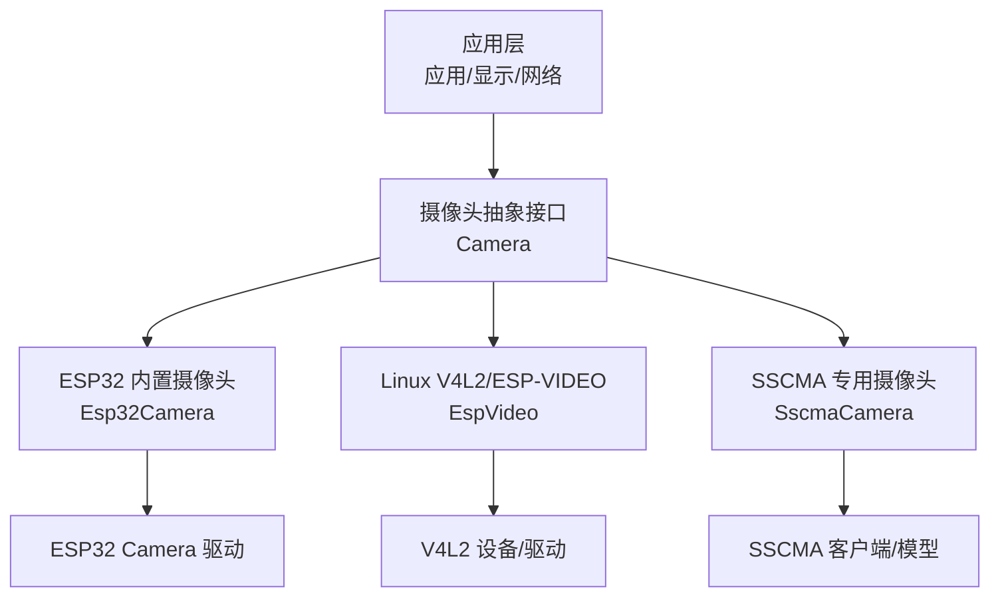
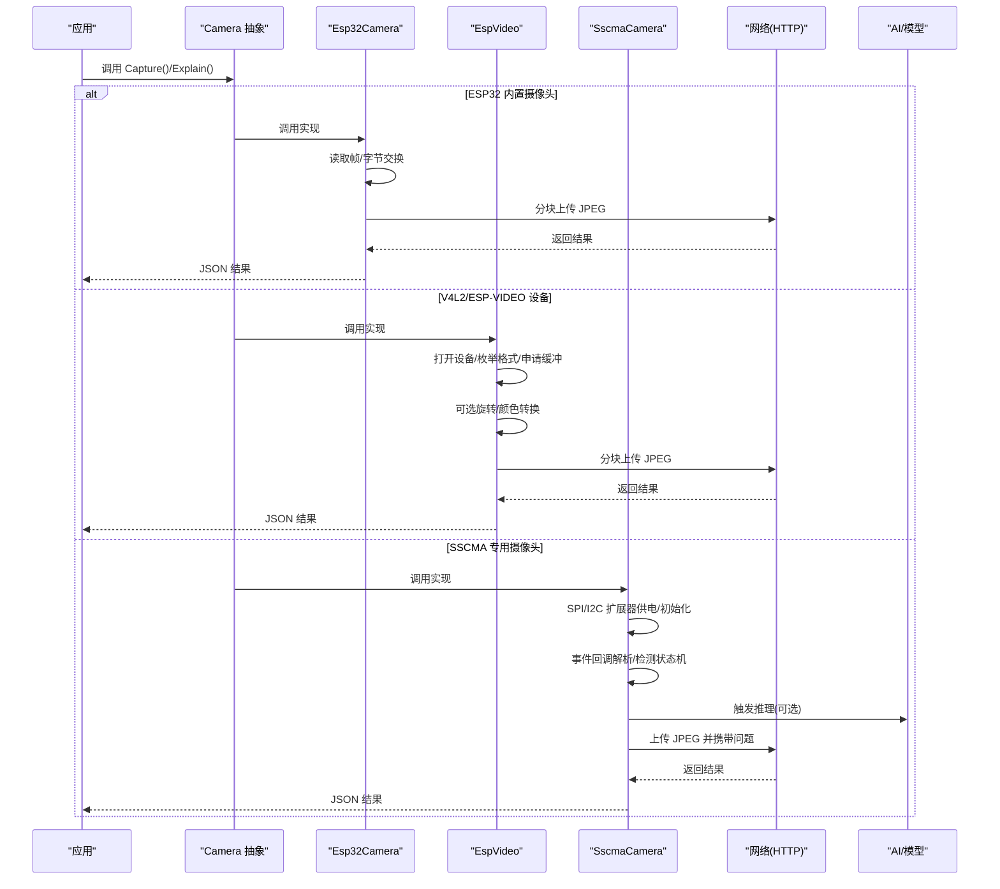
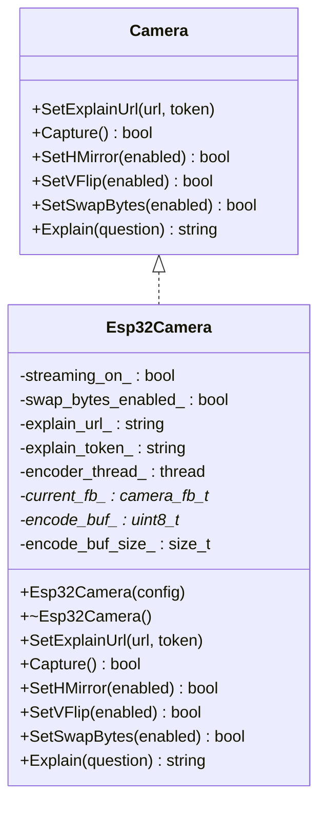
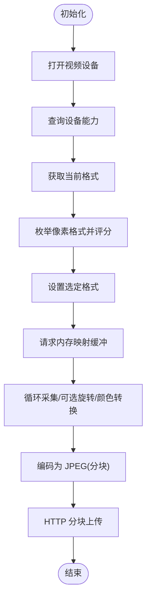
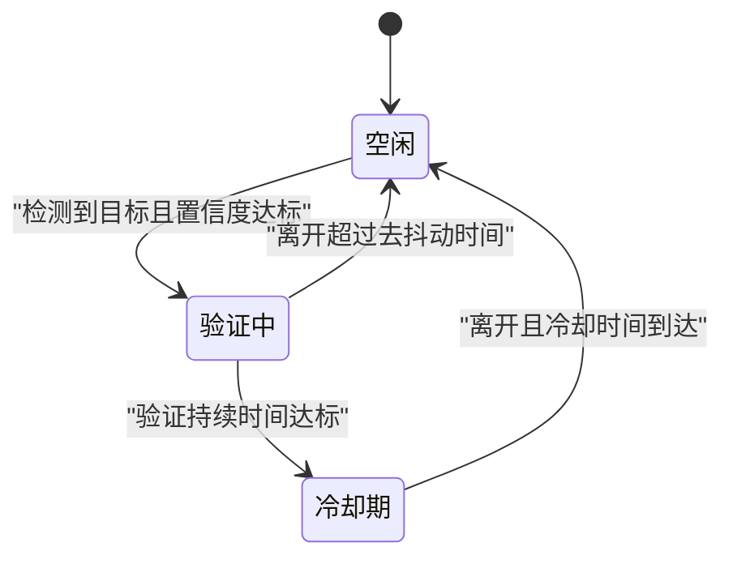
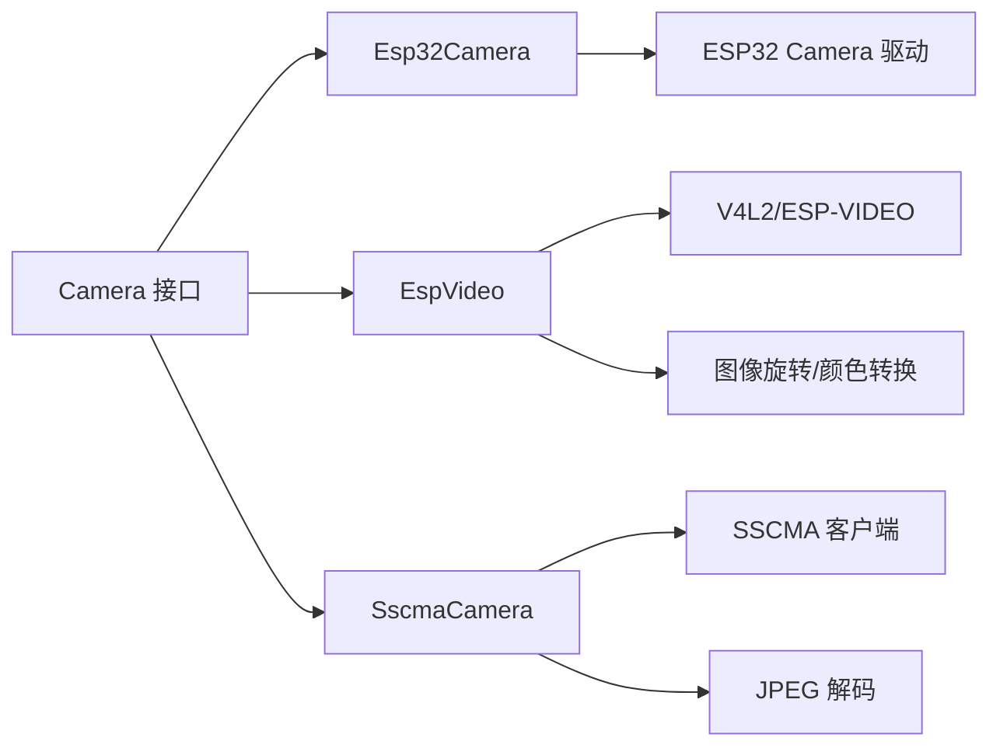

# 摄像头集成

<cite>
**本文引用的文件**
- [main/boards/common/camera.h](file://main/boards/common/camera.h)
- [main/boards/common/esp32_camera.h](file://main/boards/common/esp32_camera.h)
- [main/boards/common/esp32_camera.cc](file://main/boards/common/esp32_camera.cc)
- [main/boards/common/esp_video.h](file://main/boards/common/esp_video.h)
- [main/boards/common/esp_video.cc](file://main/boards/common/esp_video.cc)
- [main/boards/sensecap-watcher/sscma_camera.h](file://main/boards/sensecap-watcher/sscma_camera.h)
- [main/boards/sensecap-watcher/sscma_camera.cc](file://main/boards/sensecap-watcher/sscma_camera.cc)
- [main/boards/zhengchen-cam/config.h](file://main/boards/zhengchen-cam/config.h)
- [main/boards/zhengchen-cam/zhengchen_cam_board.cc](file://main/boards/zhengchen-cam/zhengchen_cam_board.cc)
- [main/boards/zhengchen-cam-ml307/zhengchen_cam_board_ml307.cc](file://main/boards/zhengchen-cam-ml307/zhengchen_cam_board_ml307.cc)
- [main/boards/m5stack-core-s3/m5stack_core_s3.cc](file://main/boards/m5stack-core-s3/m5stack_core_s3.cc)
- [main/boards/waveshare/esp32-s3-touch-lcd-3.5/esp32-s3-touch-lcd-3.5.cc](file://main/boards/waveshare/esp32-s3-touch-lcd-3.5/esp32-s3-touch-lcd-3.5.cc)
- [main/boards/waveshare/esp32-s3-touch-lcd-3.5b/waveshare-s3-touch-lcd-3.5b.cc](file://main/boards/waveshare/esp32-s3-touch-lcd-3.5b/waveshare-s3-touch-lcd-3.5b.cc)
- [main/boards/esp-p4-function-ev-board/esp-p4-function-ev-board.cc](file://main/boards/esp-p4-function-ev-board/esp-p4-function-ev-board.cc)
- [main/boards/sensecap-watcher/sensecap_watcher.cc](file://main/boards/sensecap-watcher/sensecap_watcher.cc)
- [main/boards/atk-dnesp32s3-box0/atk_dnesp32s3_box0.cc](file://main/boards/atk-dnesp32s3-box0/atk_dnesp32s3_box0.cc)
- [main/boards/otto-robot/otto_robot.cc](file://main/boards/otto-robot/otto_robot.cc)
</cite>

## 目录
1. [简介](#简介)
2. [项目结构](#项目结构)
3. [核心组件](#核心组件)
4. [架构总览](#架构总览)
5. [详细组件分析](#详细组件分析)
6. [依赖关系分析](#依赖关系分析)
7. [性能考量](#性能考量)
8. [故障排查指南](#故障排查指南)
9. [结论](#结论)
10. [附录](#附录)

## 简介
本文件面向硬件开发者与系统集成工程师，系统化阐述 XiaoZhi ESP32 项目中的摄像头集成方案。内容覆盖三大摄像头路径：ESP32 内置摄像头（OV2640/OV3660 等）、Linux V4L2/ESP-VIDEO DVP/CSI/USB UVC 等通用摄像头、以及基于 SSCMA 的专用 AI 摄像头。文档重点说明初始化流程、像素格式与分辨率配置、帧率控制、图像预处理与 AI 推理集成、调试与优化方法，以及供电管理、热插拔检测与错误恢复等系统级能力。

## 项目结构
围绕摄像头的代码主要分布在以下位置：
- 通用接口与抽象层：main/boards/common/camera.h
- ESP32 内置摄像头封装：main/boards/common/esp32_camera.*
- Linux V4L2/ESP-VIDEO 设备封装：main/boards/common/esp_video.*
- SSCMA 专用摄像头封装：main/boards/sensecap-watcher/sscma_camera.*

此外，多块开发板对摄像头进行了具体集成，例如 ZhengChen、M5Stack、Waveshare、ESP-P4 等，分别展示了 DVP、I2C、XCLK、PCLK、VSYNC/HREF 等引脚配置与初始化流程。

**图表来源**
- [main/boards/common/camera.h](file://main/boards/common/camera.h#L6-L14)
- [main/boards/common/esp32_camera.h](file://main/boards/common/esp32_camera.h#L22-L44)
- [main/boards/common/esp_video.h](file://main/boards/common/esp_video.h#L21-L53)
- [main/boards/sensecap-watcher/sscma_camera.h](file://main/boards/sensecap-watcher/sscma_camera.h#L27-L73)

**章节来源**
- [main/boards/common/camera.h](file://main/boards/common/camera.h#L1-L17)
- [main/boards/common/esp32_camera.h](file://main/boards/common/esp32_camera.h#L1-L45)
- [main/boards/common/esp_video.h](file://main/boards/common/esp_video.h#L1-L54)
- [main/boards/sensecap-watcher/sscma_camera.h](file://main/boards/sensecap-watcher/sscma_camera.h#L1-L76)

## 核心组件
- 摄像头抽象接口 Camera：统一 Capture、SetHMirror/SetVFlip、SetSwapBytes、Explain 等能力，便于替换不同摄像头实现。
- Esp32Camera：基于 ESP32 内置摄像头驱动，负责初始化、抓拍、JPEG 编码、网络上传与解释。
- EspVideo：基于 Linux V4L2/ESP-VIDEO 抽象，适配 DVP/CSI/USB UVC 等设备，自动枚举像素格式、申请内存映射缓冲、可选旋转与字节序调整。
- SscmaCamera：面向 SSCMA AI 摄像头，负责 SPI/I2C 扩展器供电、SSCMA 客户端初始化、事件回调解析、检测状态机与推理触发。

**章节来源**
- [main/boards/common/camera.h](file://main/boards/common/camera.h#L6-L14)
- [main/boards/common/esp32_camera.h](file://main/boards/common/esp32_camera.h#L22-L44)
- [main/boards/common/esp_video.h](file://main/boards/common/esp_video.h#L21-L53)
- [main/boards/sensecap-watcher/sscma_camera.h](file://main/boards/sensecap-watcher/sscma_camera.h#L27-L73)

## 架构总览
下图展示摄像头在不同硬件平台上的集成路径与数据流：

**图表来源**
- [main/boards/common/esp32_camera.cc](file://main/boards/common/esp32_camera.cc#L59-L130)
- [main/boards/common/esp32_camera.cc](file://main/boards/common/esp32_camera.cc#L155-L323)
- [main/boards/common/esp_video.cc](file://main/boards/common/esp_video.cc#L99-L160)
- [main/boards/common/esp_video.cc](file://main/boards/common/esp_video.cc#L167-L276)
- [main/boards/sensecap-watcher/sscma_camera.cc](file://main/boards/sensecap-watcher/sscma_camera.cc#L40-L70)
- [main/boards/sensecap-watcher/sscma_camera.cc](file://main/boards/sensecap-watcher/sscma_camera.cc#L678-L743)

## 详细组件分析

### Esp32Camera 组件分析
- 初始化：通过 ESP32 内置摄像头驱动进行初始化，并根据传感器型号设置镜像等属性。
- 抓拍与预览：优先获取最新帧，针对 RGB565 帧可做字节交换以适配网络编码器；同时为 LVGL 预览分配独立缓冲。
- JPEG 编码与上传：启动独立编码线程，按分块回调收集 JPEG 数据，构造 multipart/form-data，分块发送至远端服务。
- 控制接口：支持水平/垂直翻转、RGB565 字节序交换。

**图表来源**
- [main/boards/common/camera.h](file://main/boards/common/camera.h#L6-L14)
- [main/boards/common/esp32_camera.h](file://main/boards/common/esp32_camera.h#L22-L44)

**章节来源**
- [main/boards/common/esp32_camera.h](file://main/boards/common/esp32_camera.h#L1-L45)
- [main/boards/common/esp32_camera.cc](file://main/boards/common/esp32_camera.cc#L20-L52)
- [main/boards/common/esp32_camera.cc](file://main/boards/common/esp32_camera.cc#L59-L130)
- [main/boards/common/esp32_camera.cc](file://main/boards/common/esp32_camera.cc#L155-L323)

### EspVideo 组件分析
- 设备选择与打开：根据编译配置选择 CSI/DVP/JPEG/SPI/USB UVC 设备，打开对应 /dev/videoX。
- 能力查询与格式枚举：查询设备能力、当前格式，枚举支持的像素格式并按优先级选择最佳格式。
- 缓冲管理：请求内存映射缓冲，轮询入队出队，必要时进行旋转与颜色空间转换。
- 编码与上传：与 Esp32Camera 类似，采用分块编码与上传策略。

**图表来源**
- [main/boards/common/esp_video.cc](file://main/boards/common/esp_video.cc#L99-L160)
- [main/boards/common/esp_video.cc](file://main/boards/common/esp_video.cc#L167-L276)
- [main/boards/common/esp_video.cc](file://main/boards/common/esp_video.cc#L277-L320)
- [main/boards/common/esp_video.cc](file://main/boards/common/esp_video.cc#L483-L515)

**章节来源**
- [main/boards/common/esp_video.h](file://main/boards/common/esp_video.h#L21-L53)
- [main/boards/common/esp_video.cc](file://main/boards/common/esp_video.cc#L99-L160)
- [main/boards/common/esp_video.cc](file://main/boards/common/esp_video.cc#L167-L276)
- [main/boards/common/esp_video.cc](file://main/boards/common/esp_video.cc#L277-L320)
- [main/boards/common/esp_video.cc](file://main/boards/common/esp_video.cc#L483-L515)

### SscmaCamera 组件分析
- 电源与 I/O 扩展：通过 I2C 扩展器控制 AI 芯片供电、复位与 SPI 同步信号。
- 客户端初始化：配置事件队列、任务栈、优先级与 SPI 参数，建立与 SSCMA AI 芯片通信。
- 检测状态机：空闲/验证中/冷却期三态机，结合目标类别、置信度阈值、持续时间与去抖动时间，决定是否触发推理或会话。
- 推理解析与上传：解析检测框/分类/关键点结果，按需触发推理，随后上传 JPEG 并附带问题描述。

**图表来源**
- [main/boards/sensecap-watcher/sscma_camera.cc](file://main/boards/sensecap-watcher/sscma_camera.cc#L157-L198)

**章节来源**
- [main/boards/sensecap-watcher/sscma_camera.h](file://main/boards/sensecap-watcher/sscma_camera.h#L27-L73)
- [main/boards/sensecap-watcher/sscma_camera.cc](file://main/boards/sensecap-watcher/sscma_camera.cc#L40-L70)
- [main/boards/sensecap-watcher/sscma_camera.cc](file://main/boards/sensecap-watcher/sscma_camera.cc#L101-L198)
- [main/boards/sensecap-watcher/sscma_camera.cc](file://main/boards/sensecap-watcher/sscma_camera.cc#L678-L743)

### 硬件平台集成要点

#### ESP32 内置摄像头（ZhengChen 系列）
- 引脚配置：XCLK、D0-D7、PCLK、VSYNC、HREF、PWDN、RESET 等通过配置头文件定义。
- 初始化：通过相机配置结构体设置像素格式、帧尺寸、JPEG 质量、帧缓冲数量与位置、抓取模式等。
- 示例路径：zhengchen_cam_board.cc、zhengchen_cam_board_ml307.cc。

**章节来源**
- [main/boards/zhengchen-cam/config.h](file://main/boards/zhengchen-cam/config.h#L47-L68)
- [main/boards/zhengchen-cam/zhengchen_cam_board.cc](file://main/boards/zhengchen-cam/zhengchen_cam_board.cc#L243-L276)
- [main/boards/zhengchen-cam-ml307/zhengchen_cam_board_ml307.cc](file://main/boards/zhengchen-cam-ml307/zhengchen_cam_board_ml307.cc#L249-L282)

#### DVP/CSI/USB UVC（Waveshare、ESP-P4、M5Stack）
- Waveshare S3 系列：配置 DVP 引脚、复用现有 I2C 作为 SCCB、设置 XCLK 频率。
- ESP-P4：直接复用已有 I2C 作为 SCCB，配置 DVP 引脚与 XCLK。
- M5Stack CoreS3：配置 DVP 引脚与面板初始化。

**章节来源**
- [main/boards/waveshare/esp32-s3-touch-lcd-3.5/esp32-s3-touch-lcd-3.5.cc](file://main/boards/waveshare/esp32-s3-touch-lcd-3.5/esp32-s3-touch-lcd-3.5.cc#L175-L205)
- [main/boards/waveshare/esp32-s3-touch-lcd-3.5b/waveshare-s3-touch-lcd-3.5b.cc](file://main/boards/waveshare/esp32-s3-touch-lcd-3.5b/waveshare-s3-touch-lcd-3.5b.cc#L178-L205)
- [main/boards/esp-p4-function-ev-board/esp-p4-function-ev-board.cc](file://main/boards/esp-p4-function-ev-board/esp-p4-function-ev-board.cc#L124-L159)
- [main/boards/m5stack-core-s3/m5stack_core_s3.cc](file://main/boards/m5stack-core-s3/m5stack_core_s3.cc#L292-L307)

#### 摄像头类型识别（Otto Robot）
- 通过 I2C 读取传感器 PID，区分 OV2640/OV3660 等型号，用于后续特性配置。

**章节来源**
- [main/boards/otto-robot/otto_robot.cc](file://main/boards/otto-robot/otto_robot.cc#L143-L159)

## 依赖关系分析
- 抽象接口 Camera 与具体实现解耦，便于在不同硬件平台上切换。
- Esp32Camera 依赖 ESP32 内置摄像头驱动与 JPEG 编码工具。
- EspVideo 依赖 Linux V4L2 接口、内存映射与可选的图像旋转/颜色转换库。
- SscmaCamera 依赖 SSCMA 客户端库、SPI/I2C 扩展器与 JPEG 解码器。

**图表来源**
- [main/boards/common/camera.h](file://main/boards/common/camera.h#L6-L14)
- [main/boards/common/esp32_camera.h](file://main/boards/common/esp32_camera.h#L12-L14)
- [main/boards/common/esp_video.h](file://main/boards/common/esp_video.h#L12-L14)
- [main/boards/sensecap-watcher/sscma_camera.h](file://main/boards/sensecap-watcher/sscma_camera.h#L11-L16)

**章节来源**
- [main/boards/common/esp32_camera.h](file://main/boards/common/esp32_camera.h#L12-L14)
- [main/boards/common/esp_video.h](file://main/boards/common/esp_video.h#L12-L14)
- [main/boards/sensecap-watcher/sscma_camera.h](file://main/boards/sensecap-watcher/sscma_camera.h#L11-L16)

## 性能考量
- 帧丢弃策略：在实时性要求高的场景，重复获取帧以丢弃旧帧，确保“最新帧”参与处理。
- 缓冲与内存：RGB565 帧在编码前可做字节交换，避免网络侧额外处理；编码缓冲与预览缓冲分离，降低内存碎片。
- 编码与上传：采用分块回调与分块传输，减少峰值内存占用，提升稳定性。
- 设备路径选择：V4L2 路径可利用硬件 JPEG 或更丰富的像素格式；ESP32 路径适合简单场景与快速集成。
- 旋转与颜色转换：在支持 PPA 的目标上使用硬件旋转，在其他目标上使用软件旋转，注意内存对齐与性能权衡。

[本节为通用性能建议，无需特定文件引用]

## 故障排查指南
- 设备打开失败：检查设备节点是否存在、权限与占用情况；查看可用设备日志。
- 格式不支持：确认枚举到的像素格式是否在支持列表内，必要时调整分辨率或格式。
- 缓冲申请失败：检查 PSRAM/堆容量，适当降低分辨率或帧数。
- 编码异常：确认输入格式与编码器匹配，检查分块回调是否正确处理终止标记。
- 上传失败：检查网络连接、超时设置与服务端状态码；确认边界与 Content-Type 正确。
- 供电与复位：SSCMA 路径需确保 I2C 扩展器供电与复位信号正确；热插拔场景需检测 CS/INT 引脚变化。
- 热插拔检测：可通过扩展器中断引脚或 GPIO 检测卡槽状态，结合看门狗与重试逻辑恢复。

**章节来源**
- [main/boards/common/esp_video.cc](file://main/boards/common/esp_video.cc#L144-L152)
- [main/boards/common/esp_video.cc](file://main/boards/common/esp_video.cc#L251-L257)
- [main/boards/common/esp_video.cc](file://main/boards/common/esp_video.cc#L282-L288)
- [main/boards/common/esp32_camera.cc](file://main/boards/common/esp32_camera.cc#L228-L234)
- [main/boards/common/esp32_camera.cc](file://main/boards/common/esp32_camera.cc#L247-L260)
- [main/boards/sensecap-watcher/sscma_camera.cc](file://main/boards/sensecap-watcher/sscma_camera.cc#L20-L38)
- [main/boards/sensecap-watcher/sensecap_watcher.cc](file://main/boards/sensecap-watcher/sensecap_watcher.cc#L571-L583)

## 结论
XiaoZhi 项目提供了统一的摄像头抽象接口与三种实现路径：ESP32 内置摄像头、Linux V4L2/ESP-VIDEO 设备、以及 SSCMA 专用摄像头。通过清晰的初始化流程、灵活的像素格式与分辨率配置、完善的图像预处理与上传机制，以及系统级的供电与错误恢复能力，能够满足从原型验证到产品落地的多样化需求。建议在实际选型时综合考虑硬件成本、图像质量、AI 推理需求与系统资源，选择最适合的摄像头路径。

[本节为总结性内容，无需特定文件引用]

## 附录

### 摄像头模块选型与最佳实践
- 选型建议
  - 快速原型与低功耗：优先 ESP32 内置摄像头（OV2640/OV3660），配置较低分辨率与 RGB565，便于快速验证。
  - 高画质与灵活性：选用 DVP/CSI/USB UVC 设备，借助 V4L2 枚举与格式选择，获得更丰富的像素格式与硬件加速。
  - AI 场景：选用 SSCMA 专用摄像头，结合 I2C 扩展器供电与 SPI 同步，简化 AI 推理集成。
- 最佳实践
  - 明确分辨率与帧率目标，避免超配导致内存不足。
  - 在 RGB565 场景启用字节交换以适配网络编码器，减少额外处理。
  - 使用分块编码与分块上传，降低峰值内存与网络阻塞风险。
  - 在热插拔场景增加供电检测与复位逻辑，提升鲁棒性。
  - 为不同硬件平台准备独立的引脚配置与初始化流程，确保可移植性。

[本节为通用建议，无需特定文件引用]