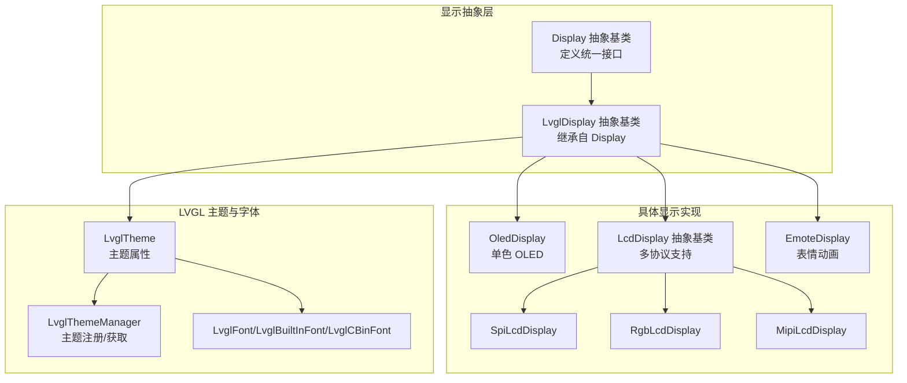
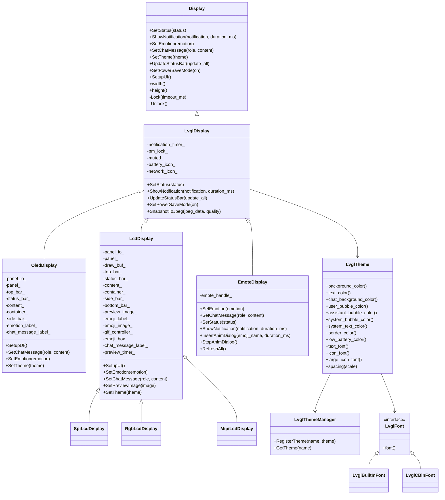
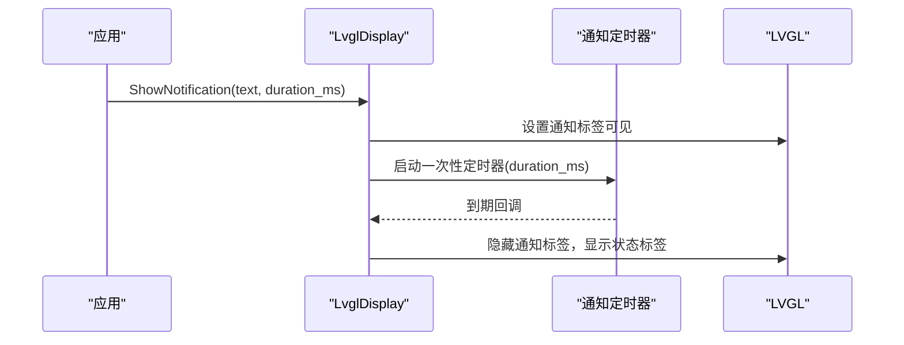
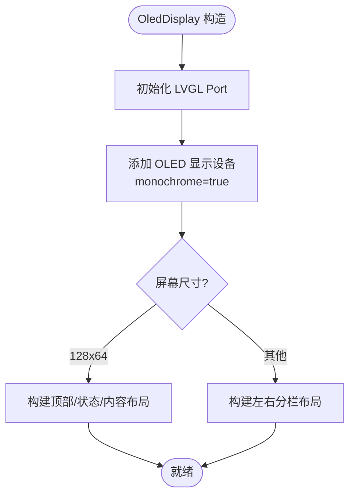
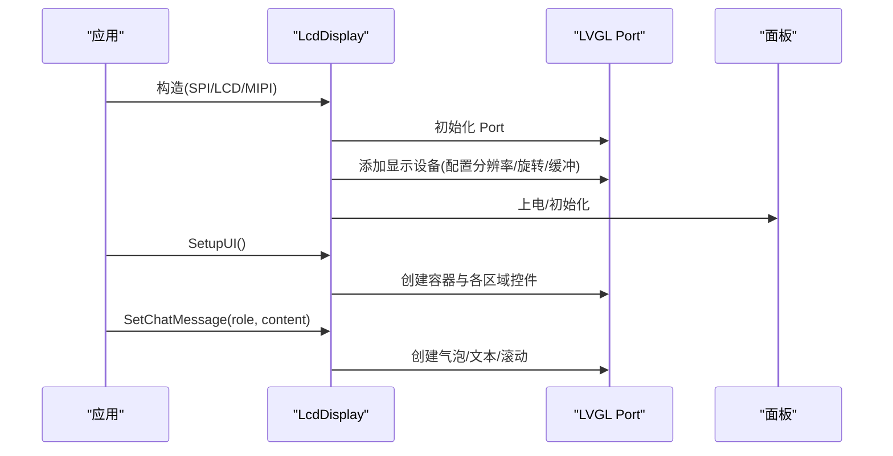
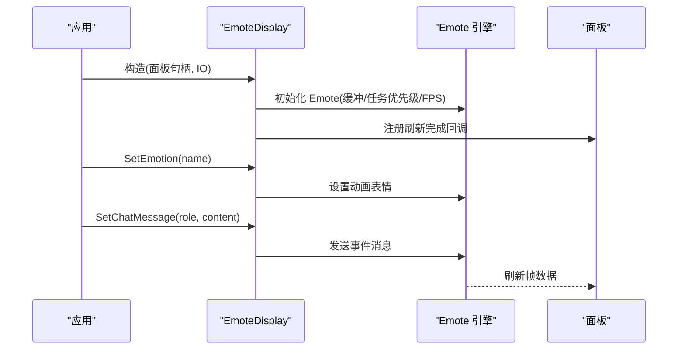
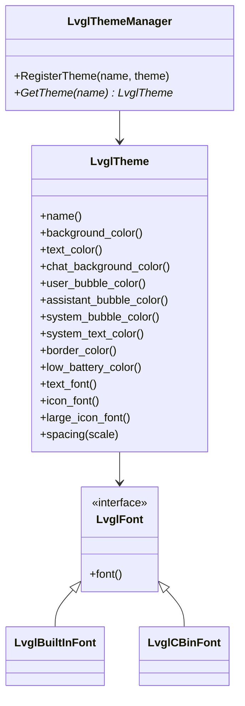
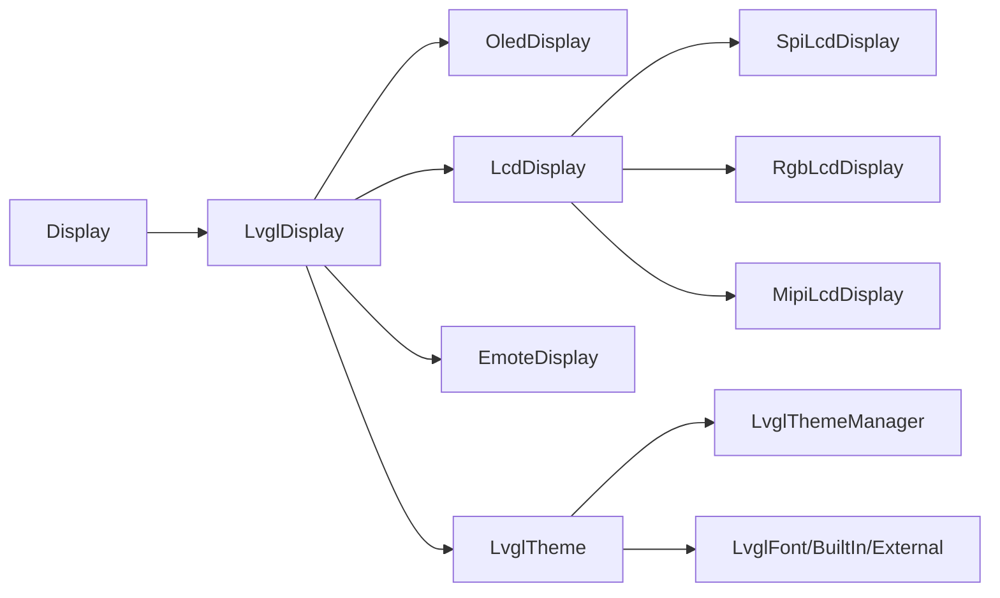

# 显示驱动实现

<cite>
**本文档引用的文件**
- [display.h](file://main/display/display.h)
- [display.cc](file://main/display/display.cc)
- [lvgl_display.cc](file://main/display/lvgl_display/lvgl_display.cc)
- [lvgl_theme.h](file://main/display/lvgl_display/lvgl_theme.h)
- [lvgl_theme.cc](file://main/display/lvgl_display/lvgl_theme.cc)
- [lvgl_font.h](file://main/display/lvgl_display/lvgl_font.h)
- [lcd_display.h](file://main/display/lcd_display.h)
- [lcd_display.cc](file://main/display/lcd_display.cc)
- [oled_display.h](file://main/display/oled_display.h)
- [oled_display.cc](file://main/display/oled_display.cc)
- [emote_display.h](file://main/display/emote_display.h)
- [emote_display.cc](file://main/display/emote_display.cc)
</cite>

## 目录
1. [简介](#简介)
2. [项目结构](#项目结构)
3. [核心组件](#核心组件)
4. [架构总览](#架构总览)
5. [详细组件分析](#详细组件分析)
6. [依赖关系分析](#依赖关系分析)
7. [性能考虑](#性能考虑)
8. [故障排查指南](#故障排查指南)
9. [结论](#结论)
10. [附录](#附录)

## 简介
本文件针对 XiaoZhi ESP32 项目的显示驱动实现进行系统化文档化，覆盖以下方面：
- 显示技术与驱动类型：OLED 显示、LCD 显示（SPI/LCD/MIPI）、LVGL 图形界面、表情动画显示（Emote）
- 初始化流程、分辨率设置、色彩模式配置、刷新策略与功耗管理
- 不同显示技术在显示效果、功耗、成本方面的差异
- 调试方法与性能优化技巧
- 高级功能：内容渲染、动画效果、用户界面布局
- 面向硬件开发者的显示模块选型与系统集成最佳实践

## 项目结构
显示相关代码主要位于 main/display 目录，采用“抽象基类 + 多态子类”的设计，结合 LVGL 进行图形渲染，并通过 ESP-IDF 的 LCD Panel 接口驱动硬件。

**图表来源**
- [display.h](file://main/display/display.h#L28-L61)
- [lvgl_display.cc](file://main/display/lvgl_display/lvgl_display.cc#L18-L41)
- [oled_display.h](file://main/display/oled_display.h#L10-L39)
- [lcd_display.h](file://main/display/lcd_display.h#L17-L83)
- [lvgl_theme.h](file://main/display/lvgl_display/lvgl_theme.h#L14-L94)

**章节来源**
- [display.h](file://main/display/display.h#L1-L88)
- [lvgl_display.cc](file://main/display/lvgl_display/lvgl_display.cc#L1-L271)

## 核心组件
- Display 抽象基类：定义统一的显示接口（状态、通知、表情、聊天消息、主题、电源模式、UI 初始化等），并提供 DisplayLockGuard 互斥保护。
- LvglDisplay 抽象基类：在 Display 基础上扩展 LVGL 渲染能力，包含通知定时器、PM 锁、状态栏更新、截图到 JPEG 等通用逻辑。
- OLED/LCD/Emote 具体实现：分别对接不同硬件面板，完成初始化、UI 构建、消息渲染与动画。
- 主题系统：LvglTheme + LvglThemeManager 提供颜色、字体、图标、间距等主题属性管理；LvglFont 支持内置与外部字体。

关键接口与职责：
- 初始化：构造函数中完成面板句柄、分辨率、旋转/镜像/交换等参数配置，随后初始化 LVGL Port 并添加显示设备。
- 分辨率与色彩：根据面板能力设置 hres/vres、monochrome、color_format、旋转参数等。
- 刷新策略：SPI/LCD 使用 DMA 缓冲与可选双缓冲；RGB/MIPI 使用 LVGL Port 的 RGB/DSI 接口，支持避免撕裂等特性。
- 动画与滚动：聊天消息与状态文本采用 LVGL 滚动/换行/自动滚动；表情动画通过 Emote 引擎驱动。
- 电源管理：通过 PM 锁在刷新期间提升 APB 频率，减少抖动；支持省电模式切换。

**章节来源**
- [display.h](file://main/display/display.h#L28-L61)
- [lvgl_display.cc](file://main/display/lvgl_display/lvgl_display.cc#L18-L41)
- [lvgl_theme.h](file://main/display/lvgl_display/lvgl_theme.h#L14-L94)
- [lvgl_font.h](file://main/display/lvgl_display/lvgl_font.h#L6-L31)

## 架构总览
显示子系统以 Display 为抽象根，通过 LVGL Port 将 UI 渲染到不同类型的面板上。OLED/LCD 实现负责具体的面板初始化与 UI 布局，主题系统提供一致的视觉风格，表情显示模块提供动画能力。

**图表来源**
- [display.h](file://main/display/display.h#L28-L87)
- [lvgl_display.cc](file://main/display/lvgl_display/lvgl_display.cc#L18-L70)
- [oled_display.h](file://main/display/oled_display.h#L10-L39)
- [lcd_display.h](file://main/display/lcd_display.h#L17-L83)
- [emote_display.h](file://main/display/emote_display.h#L12-L40)
- [lvgl_theme.h](file://main/display/lvgl_display/lvgl_theme.h#L14-L94)
- [lvgl_font.h](file://main/display/lvgl_display/lvgl_font.h#L6-L31)

## 详细组件分析

### 抽象层：Display 与 LvglDisplay
- Display 定义统一接口，提供锁机制与 UI 初始化标记，便于派生类按需实现。
- LvglDisplay 扩展通用 LVGL 能力：通知定时器用于自动隐藏提示；PM 锁在刷新时提升频率；状态栏更新网络/电量/静音状态；截图到 JPEG 支持（可选）。

**图表来源**
- [lvgl_display.cc](file://main/display/lvgl_display/lvgl_display.cc#L94-L111)
- [lvgl_display.cc](file://main/display/lvgl_display/lvgl_display.cc#L18-L41)

**章节来源**
- [display.h](file://main/display/display.h#L28-L61)
- [lvgl_display.cc](file://main/display/lvgl_display/lvgl_display.cc#L18-L215)

### OLED 显示：OledDisplay
- 单色 OLED 面板，monochrome=true，旋转参数由构造函数传入镜像/交换标志。
- UI 分两类布局：128x64 与 128x32，分别适配不同尺寸的 OLED 屏幕。
- 支持表情图标与滚动文本，低电量弹窗提示。

**图表来源**
- [oled_display.cc](file://main/display/oled_display.cc#L20-L81)
- [oled_display.cc](file://main/display/oled_display.cc#L83-L385)

**章节来源**
- [oled_display.h](file://main/display/oled_display.h#L10-L39)
- [oled_display.cc](file://main/display/oled_display.cc#L1-L409)

### LCD 显示：LcdDisplay 及变体
- 支持 SPI/LCD/MIPI 多种接口，通过不同的 LVGL Port 接口添加显示设备。
- 关键参数：
  - 分辨率：hres/vres
  - 色彩格式：RGB565（LCD）或 monochrome（OLED）
  - 旋转：swap_xy/mirror_x/mirror_y
  - 缓冲：DMA、PSRAM、双缓冲、直接模式等
- UI 包含顶部/状态/内容/侧边/底部等区域，支持聊天气泡、预览图、表情、系统消息折叠等。

**图表来源**
- [lcd_display.cc](file://main/display/lcd_display.cc#L92-L172)
- [lcd_display.cc](file://main/display/lcd_display.cc#L175-L233)
- [lcd_display.cc](file://main/display/lcd_display.cc#L235-L284)

**章节来源**
- [lcd_display.h](file://main/display/lcd_display.h#L17-L83)
- [lcd_display.cc](file://main/display/lcd_display.cc#L1-L1260)

### 表情动画显示：EmoteDisplay
- 通过 Emote 引擎驱动表情动画，支持插入对话框、停止动画、全量刷新。
- 与面板 IO 注册刷新完成回调，确保帧同步。
- 支持根据状态发送事件消息（监听/待机/说话/错误）。

**图表来源**
- [emote_display.cc](file://main/display/emote_display.cc#L74-L127)
- [emote_display.cc](file://main/display/emote_display.cc#L137-L200)

**章节来源**
- [emote_display.h](file://main/display/emote_display.h#L12-L40)
- [emote_display.cc](file://main/display/emote_display.cc#L1-L250)

### 主题系统：LvglTheme 与 LvglThemeManager
- 主题属性：背景/文本/聊天背景/气泡颜色、边框、低电量颜色、字体、图标、间距等。
- 主题管理：注册/获取主题，支持从设置加载默认主题名称。
- 字体支持：内置字体与外部字体（.cbin）。

**图表来源**
- [lvgl_theme.h](file://main/display/lvgl_display/lvgl_theme.h#L14-L94)
- [lvgl_theme.cc](file://main/display/lvgl_display/lvgl_theme.cc#L3-L30)
- [lvgl_font.h](file://main/display/lvgl_display/lvgl_font.h#L6-L31)

**章节来源**
- [lvgl_theme.h](file://main/display/lvgl_display/lvgl_theme.h#L1-L95)
- [lvgl_theme.cc](file://main/display/lvgl_display/lvgl_theme.cc#L1-L31)
- [lvgl_font.h](file://main/display/lvgl_display/lvgl_font.h#L1-L32)

## 依赖关系分析
- 组件耦合：
  - Display 为抽象根，LvglDisplay/LcdDisplay/OledDisplay/EmoteDisplay 通过虚函数实现差异化。
  - 主题系统与 UI 控件解耦，通过 Theme 指针注入。
- 外部依赖：
  - ESP-IDF：esp_lcd_panel_*、esp_lvgl_port_*、esp_timer、esp_pm
  - LVGL：对象树、动画、绘图缓冲、快照
- 潜在风险：
  - UI 构建顺序：必须在面板初始化后调用 SetupUI，避免空指针。
  - 锁竞争：所有 UI 更新需通过 DisplayLockGuard 或 LvglDisplay 的锁机制。

**图表来源**
- [display.h](file://main/display/display.h#L28-L87)
- [lvgl_display.cc](file://main/display/lvgl_display/lvgl_display.cc#L18-L70)
- [oled_display.h](file://main/display/oled_display.h#L10-L39)
- [lcd_display.h](file://main/display/lcd_display.h#L17-L83)
- [emote_display.h](file://main/display/emote_display.h#L12-L40)
- [lvgl_theme.h](file://main/display/lvgl_display/lvgl_theme.h#L14-L94)
- [lvgl_font.h](file://main/display/lvgl_display/lvgl_font.h#L6-L31)

**章节来源**
- [display.h](file://main/display/display.h#L1-L88)
- [lvgl_display.cc](file://main/display/lvgl_display/lvgl_display.cc#L1-L271)

## 性能考虑
- 刷新策略
  - SPI/LCD：启用 DMA 缓冲，合理设置 buffer_size；根据内存情况选择是否使用 PSRAM；可开启双缓冲降低撕裂（RGB/LCD）。
  - MIPI：启用软件旋转与避免撕裂选项，适合高分辨率与高刷新场景。
- 功耗管理
  - 使用 PM 锁在刷新期间提升 APB 频率，减少画面抖动；在非刷新时段释放锁。
  - 省电模式下降低刷新频率或关闭非必要动画。
- 内存与缓存
  - 在具备 PSRAM 的设备上启用 LVGL 图像缓存，提升图片加载性能。
  - 图片缩放与 JPEG 转换在需要时进行，避免频繁大内存分配。
- UI 渲染
  - 聊天消息上限控制，及时删除最旧条目；系统消息合并显示，减少 UI 负载。
  - 文本换行与宽度约束，避免过宽导致重排开销。

[本节为通用性能建议，不直接分析特定文件]

## 故障排查指南
- UI 未显示或闪烁
  - 确认 SetupUI 已在面板初始化后调用；检查 display_ 是否成功添加。
  - 检查 PM 锁是否在刷新期间被正确获取/释放。
- 文字/图标不显示
  - 确认字体已正确设置；检查主题字体与图标字体是否可用。
- 通知未自动消失
  - 检查通知定时器是否创建与启动；确认回调中标签可见性切换逻辑。
- 低电量弹窗不出现
  - 检查电池状态读取与图标更新逻辑；确认弹窗可见性切换条件。
- OLED 128x32 布局异常
  - 确认屏幕尺寸判断分支；检查左右分栏与滚动动画配置。
- Emote 动画不播放
  - 检查 Emote 句柄初始化与面板 IO 回调注册；确认事件消息发送路径。

**章节来源**
- [lvgl_display.cc](file://main/display/lvgl_display/lvgl_display.cc#L72-L215)
- [oled_display.cc](file://main/display/oled_display.cc#L168-L385)
- [lcd_display.cc](file://main/display/lcd_display.cc#L353-L351)
- [emote_display.cc](file://main/display/emote_display.cc#L74-L127)

## 结论
XiaoZhi ESP32 的显示驱动以 Display/LvglDisplay 抽象为核心，结合 LVGL 实现跨多种面板（OLED、SPI/LCD、MIPI）的一致 UI 体验。通过主题系统与动画引擎，系统实现了良好的可扩展性与可维护性。在实际部署中，应重点关注面板初始化顺序、刷新策略与功耗平衡，以及 UI 渲染的性能优化。

[本节为总结性内容，不直接分析特定文件]

## 附录

### 关键参数与配置要点
- 分辨率与旋转
  - hres/vres：面板物理分辨率
  - swap_xy/mirror_x/mirror_y：旋转与镜像
- 色彩与缓冲
  - monochrome：OLED 必须为 true
  - color_format：RGB565（LCD）
  - buff_dma/buff_spiram/double_buffer/full_refresh/direct_mode/sw_rotate：根据面板与性能需求选择
- 主题与字体
  - 背景/文本/气泡颜色、图标字体、间距
  - 内置字体与外部字体（.cbin）

**章节来源**
- [lcd_display.cc](file://main/display/lcd_display.cc#L137-L161)
- [lcd_display.cc](file://main/display/lcd_display.cc#L197-L224)
- [oled_display.cc](file://main/display/oled_display.cc#L49-L71)
- [lvgl_theme.h](file://main/display/lvgl_display/lvgl_theme.h#L20-L50)