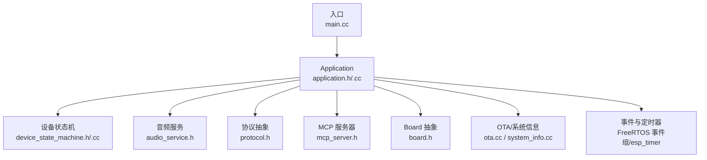
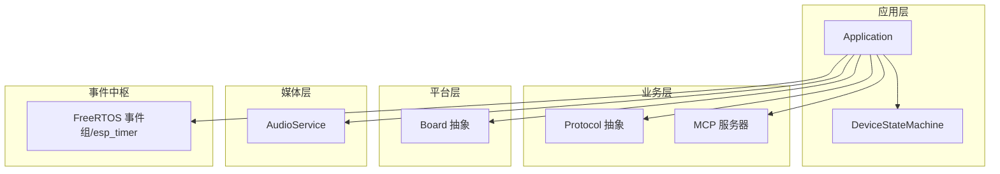
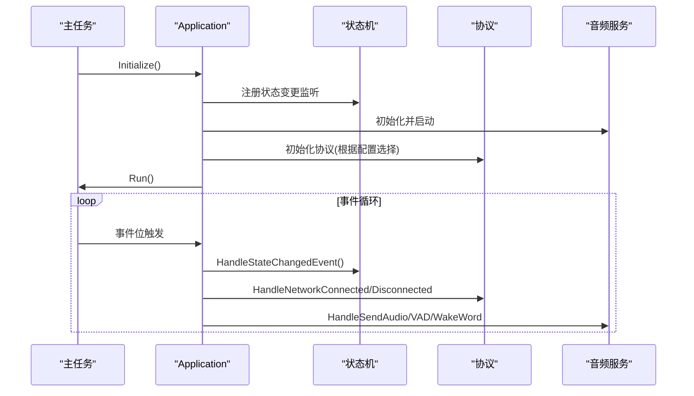
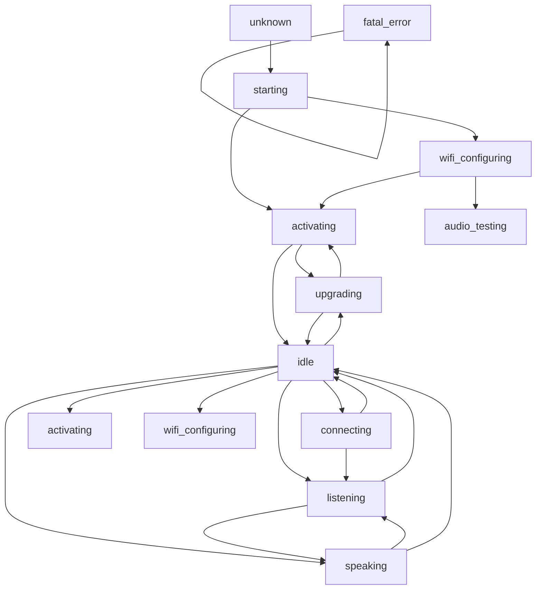
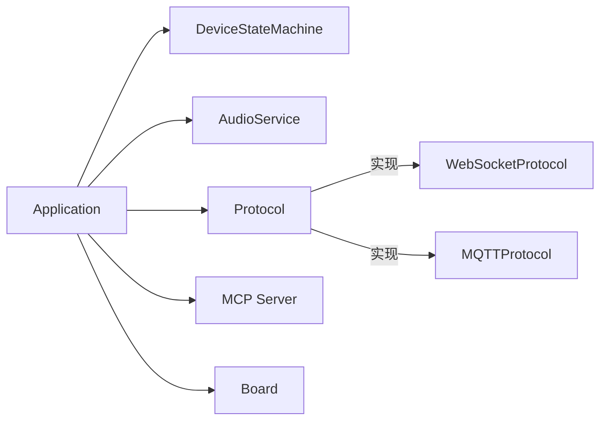

# 核心架构

<cite>
**本文引用的文件**
- [main/application.h](file://main/application.h)
- [main/application.cc](file://main/application.cc)
- [main/device_state.h](file://main/device_state.h)
- [main/device_state_machine.h](file://main/device_state_machine.h)
- [main/device_state_machine.cc](file://main/device_state_machine.cc)
- [main/main.cc](file://main/main.cc)
- [main/audio/audio_service.h](file://main/audio/audio_service.h)
- [main/protocols/protocol.h](file://main/protocols/protocol.h)
- [main/boards/common/board.h](file://main/boards/common/board.h)
- [main/mcp_server.h](file://main/mcp_server.h)
- [docs/websocket.md](file://docs/websocket.md)
- [docs/mcp-protocol.md](file://docs/mcp-protocol.md)
- [main/CMakeLists.txt](file://main/CMakeLists.txt)
</cite>

## 目录
1. [引言](#引言)
2. [项目结构](#项目结构)
3. [核心组件](#核心组件)
4. [架构总览](#架构总览)
5. [详细组件分析](#详细组件分析)
6. [依赖关系分析](#依赖关系分析)
7. [性能考量](#性能考量)
8. [故障排查指南](#故障排查指南)
9. [结论](#结论)
10. [附录](#附录)

## 引言
本文件面向架构师与高级开发者，系统化梳理 XiaoZhi ESP32 项目的高层设计与核心架构。重点涵盖：
- 分层架构与事件驱动模型
- 模块化设计与组件协作
- Application 主应用类的协调职责与生命周期
- 设备状态机的设计与状态转换规则
- 组件交互模式（观察者、工厂等）
- 系统边界与集成模式（AI 服务器、本地设备控制）
- 系统上下文图与组件分解图
- 技术决策、权衡与约束
- 基础设施要求、可扩展性与部署拓扑

## 项目结构
项目采用模块化分层组织，核心位于 main 目录，按功能域划分为音频、显示、协议、设备抽象等子模块，并通过 CMake 构建系统动态选择硬件板型与特性。

图表来源
- [main/main.cc](file://main/main.cc#L15-L31)
- [main/application.h](file://main/application.h#L42-L172)
- [main/application.cc](file://main/application.cc#L61-L163)
- [main/device_state_machine.h](file://main/device_state_machine.h#L17-L81)
- [main/audio/audio_service.h](file://main/audio/audio_service.h#L105-L195)
- [main/protocols/protocol.h](file://main/protocols/protocol.h#L44-L95)
- [main/mcp_server.h](file://main/mcp_server.h#L314-L342)
- [main/boards/common/board.h](file://main/boards/common/board.h#L49-L85)

章节来源
- [main/CMakeLists.txt](file://main/CMakeLists.txt#L1-L80)
- [main/main.cc](file://main/main.cc#L15-L31)

## 核心组件
- Application 主应用类：负责系统初始化、事件循环、状态机协调、协议与音频服务的生命周期管理，提供线程安全的事件调度与跨任务回调机制。
- 设备状态机：严格的状态转换规则与观察者回调，确保状态变更的确定性与可观测性。
- 音频服务：统一的音频采集、处理、编码、解码与播放流水线，支持唤醒词检测、语音处理与测试模式。
- 协议抽象：统一的协议接口，支持 WebSocket/MQTT 等传输，屏蔽上层业务消息类型差异。
- Board 抽象：硬件平台抽象，提供网络、显示、LED、电池、相机等能力接口。
- MCP 服务器：设备侧 MCP 协议实现，支持工具注册、参数校验与 JSON-RPC 调用。

章节来源
- [main/application.h](file://main/application.h#L42-L172)
- [main/application.cc](file://main/application.cc#L23-L56)
- [main/device_state_machine.h](file://main/device_state_machine.h#L17-L81)
- [main/device_state_machine.cc](file://main/device_state_machine.cc#L24-L131)
- [main/audio/audio_service.h](file://main/audio/audio_service.h#L105-L195)
- [main/protocols/protocol.h](file://main/protocols/protocol.h#L44-L95)
- [main/boards/common/board.h](file://main/boards/common/board.h#L49-L85)
- [main/mcp_server.h](file://main/mcp_server.h#L314-L342)

## 架构总览
系统采用事件驱动与分层架构：
- 应用层：Application 统一调度与事件处理，协调状态机、协议与音频服务。
- 业务层：协议抽象与 MCP 服务器，承载与 AI 服务器的交互与本地设备控制。
- 平台层：Board 抽象与各硬件板型实现，提供统一的外设接口。
- 媒体层：音频服务负责完整的音频编解码与播放链路。
- 事件中枢：FreeRTOS 事件组与定时器，提供跨任务事件与周期性刷新。

图表来源
- [main/application.h](file://main/application.h#L42-L172)
- [main/device_state_machine.h](file://main/device_state_machine.h#L17-L81)
- [main/audio/audio_service.h](file://main/audio/audio_service.h#L105-L195)
- [main/protocols/protocol.h](file://main/protocols/protocol.h#L44-L95)
- [main/mcp_server.h](file://main/mcp_server.h#L314-L342)
- [main/boards/common/board.h](file://main/boards/common/board.h#L49-L85)

## 详细组件分析

### Application 主应用类
- 职责与定位
  - 初始化显示、音频、网络回调与 MCP 工具集。
  - 维护事件循环，处理网络、状态变更、音频队列、定时器等事件。
  - 协调状态机与协议，驱动设备从启动到激活再到空闲/连接/监听/说话等状态。
  - 提供线程安全的调度接口，跨任务安全地派发回调。
- 生命周期
  - Initialize：初始化 Board、显示、音频、状态机监听、MCP 工具、网络回调与定时器。
  - Run：主事件循环，等待并分发事件，驱动状态机与协议行为。
  - 激活流程：异步任务执行 OTA 检查、资产下载与协议初始化，完成后通知主循环进入空闲态。
- 事件模型
  - 使用 FreeRTOS 事件组聚合多源事件（网络、音频、定时器、状态变更等），避免阻塞等待。
  - 通过 Schedule 将回调延迟到主任务上下文执行，保证 UI 与状态一致性。
- 关键交互
  - 与状态机：状态变更通过事件通知，状态机提供严格转换规则。
  - 与协议：根据网络状态与用户操作打开/关闭音频通道，处理 JSON 消息与音频帧。
  - 与音频服务：注册回调、调度发送队列、处理 VAD/唤醒词事件、控制 LED 状态。

图表来源
- [main/application.cc](file://main/application.cc#L165-L259)
- [main/application.cc](file://main/application.cc#L261-L338)
- [main/application.cc](file://main/application.cc#L339-L471)
- [main/application.cc](file://main/application.cc#L473-L610)

章节来源
- [main/application.h](file://main/application.h#L42-L172)
- [main/application.cc](file://main/application.cc#L61-L163)
- [main/application.cc](file://main/application.cc#L165-L259)

### 设备状态机
- 设计要点
  - 使用原子变量保存当前状态，提供严格的转换规则，防止非法跳变。
  - 观察者模式：允许组件订阅状态变更回调，在 TransitionTo 调用上下文中触发。
  - 状态枚举覆盖启动、配置、激活、升级、空闲、连接、监听、说话、致命错误等。
- 转换规则
  - 仅允许合法路径，未知/致命错误状态不可逆。
  - 通过 IsValidTransition 显式约束，日志记录非法转换。
- 与 Application 的协作
  - Application 在事件循环中响应状态变更事件，驱动 UI、音频与协议行为。

图表来源
- [main/device_state_machine.cc](file://main/device_state_machine.cc#L34-L102)
- [main/device_state.h](file://main/device_state.h#L4-L16)

章节来源
- [main/device_state_machine.h](file://main/device_state_machine.h#L17-L81)
- [main/device_state_machine.cc](file://main/device_state_machine.cc#L24-L131)
- [main/device_state.h](file://main/device_state.h#L4-L16)

### 协议抽象与传输
- 协议接口
  - 统一的 Start/Open/Close、发送音频/文本、回调注册等接口。
  - JSON 消息类型：tts、stt、llm、mcp、system、custom 等。
- 传输实现
  - WebSocket/MQTT 协议适配，握手、心跳、错误处理与断线恢复。
  - 二进制协议版本（v2/v3）支持时间戳与元数据，便于服务器端 AEC。
- 与 Application 的协作
  - Application 在网络事件与状态变更时，打开/关闭音频通道，处理 JSON 与音频帧。

章节来源
- [main/protocols/protocol.h](file://main/protocols/protocol.h#L44-L95)
- [docs/websocket.md](file://docs/websocket.md#L1-L496)

### 音频服务
- 流水线
  - 录音采集 → 处理器/唤醒词 → 编码队列 → 发送队列 → 服务器
  - 服务器音频 → 解码队列 → 播放队列 → 播放
- 关键特性
  - Opus 编解码、帧时长配置、重采样、音频测试模式、电源管理定时器。
  - 事件驱动的任务模型，支持唤醒词检测、VAD 变化与音频测试队列满回调。
- 与 Application 的协作
  - Application 注册回调，驱动 UI 与 LED；在 SEND_AUDIO 事件中出队发送。

章节来源
- [main/audio/audio_service.h](file://main/audio/audio_service.h#L105-L195)
- [main/application.cc](file://main/application.cc#L220-L226)

### Board 抽象与硬件集成
- 能力接口
  - 音频编解码器、显示、LED、背光、相机、网络接口、电源策略等。
  - 统一的网络事件回调，向上层提供扫描、连接、断开、模组错误等事件。
- 与 Application 的协作
  - Application 通过 Board 获取外设实例，设置网络回调，更新 UI 与电源策略。

章节来源
- [main/boards/common/board.h](file://main/boards/common/board.h#L49-L85)
- [main/application.cc](file://main/application.cc#L101-L156)

### MCP 服务器
- 能力
  - 工具注册（含参数 Schema、默认值、取值范围）、JSON-RPC 调用、结果封装。
  - 支持用户可见/不可见工具标注，设备主动通知与客户端初始化。
- 与 Application 的协作
  - Application 在收到 mcp 类型 JSON 时，交由 MCP 服务器解析与执行；同时提供发送 MCP 消息接口。

章节来源
- [main/mcp_server.h](file://main/mcp_server.h#L314-L342)
- [docs/mcp-protocol.md](file://docs/mcp-protocol.md#L1-L270)

## 依赖关系分析
- 组件耦合
  - Application 对状态机、协议、音频服务、Board、MCP 服务器具有强依赖，但通过接口解耦。
  - 协议抽象屏蔽传输差异，MCP 服务器屏蔽工具调用细节。
- 外部依赖
  - FreeRTOS 事件组与定时器、cJSON、音频编解码库、硬件驱动。
- 构建与板型选择
  - CMake 动态选择板型源文件与特性开关，支持多厂商与多屏幕尺寸。

图表来源
- [main/application.h](file://main/application.h#L129-L137)
- [main/protocols/protocol.h](file://main/protocols/protocol.h#L44-L95)
- [main/CMakeLists.txt](file://main/CMakeLists.txt#L29-L31)

章节来源
- [main/CMakeLists.txt](file://main/CMakeLists.txt#L1-L80)

## 性能考量
- 事件驱动与非阻塞
  - 使用事件组聚合事件，避免轮询；音频队列容量与帧时长配置平衡实时性与内存占用。
- 音频路径优化
  - Opus 编码参数、重采样与 DTX/VBR 配置降低带宽与 CPU；音频测试模式限制时长避免资源占用。
- 电源管理
  - 网络/音频通道开启时提升性能档位，空闲时降低功耗；音频空闲定时器回收资源。
- 状态机约束
  - 严格转换规则减少异常分支，降低调试与资源竞争成本。

## 故障排查指南
- 网络连接问题
  - Application 在网络事件中设置事件位并更新 UI；若长时间未收到服务器 hello，触发网络错误回调。
- 协议错误
  - 协议层设置错误回调，Application 记录最后错误消息并弹窗提示。
- 音频异常
  - 检查音频队列是否积压、编码/解码参数是否匹配、采样率与帧时长配置。
- 状态异常
  - 查看状态机日志与非法转换记录，确认是否存在并发修改状态的问题。

章节来源
- [main/application.cc](file://main/application.cc#L187-L190)
- [main/application.cc](file://main/application.cc#L286-L297)
- [main/device_state_machine.cc](file://main/device_state_machine.cc#L116-L121)

## 结论
XiaoZhi ESP32 项目以 Application 为中心，通过事件驱动与分层架构实现了稳定、可扩展的语音交互系统。状态机确保状态变更的确定性，协议抽象屏蔽传输差异，MCP 服务器提供强大的本地设备控制能力。整体设计兼顾实时性、可维护性与可移植性，适合在多硬件平台上快速迭代与扩展。

## 附录
- 系统边界与集成
  - 与 AI 服务器：通过 WebSocket/MQTT 传输 JSON 与音频，支持 TTS/STT/Llm/MCP 等消息类型。
  - 本地设备控制：通过 MCP 工具注册与调用，实现对 LED、扬声器、GPIO 等的统一控制。
- 部署拓扑
  - 设备侧：ESP32 系列芯片 + 板级硬件 + 屏幕/音频 + 网络（Wi-Fi/蜂窝）。
  - 服务侧：AI 服务器（支持 WebSocket/MQTT），可选 MCP 服务端。

章节来源
- [docs/websocket.md](file://docs/websocket.md#L1-L496)
- [docs/mcp-protocol.md](file://docs/mcp-protocol.md#L1-L270)