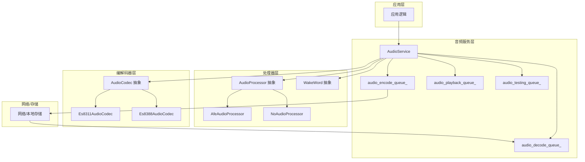
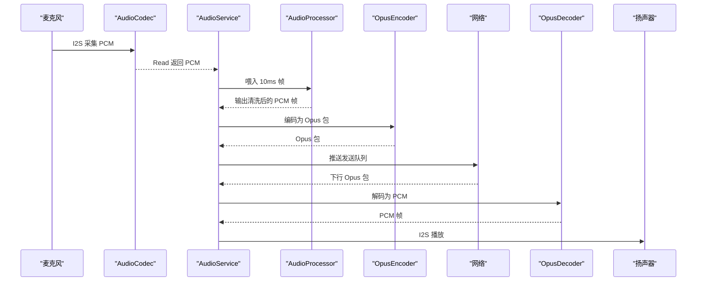
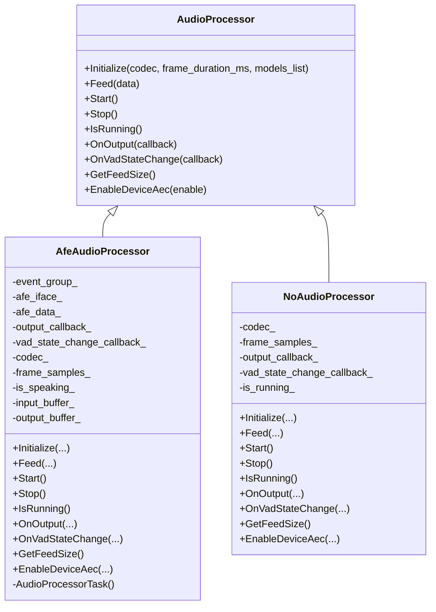
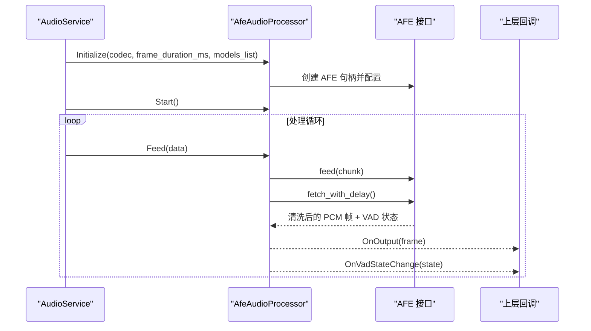
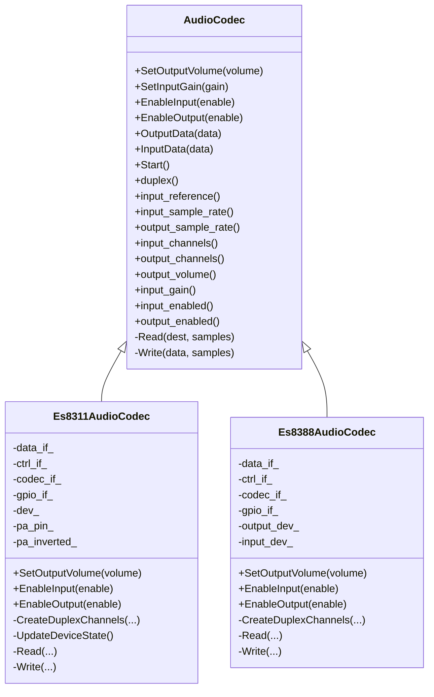
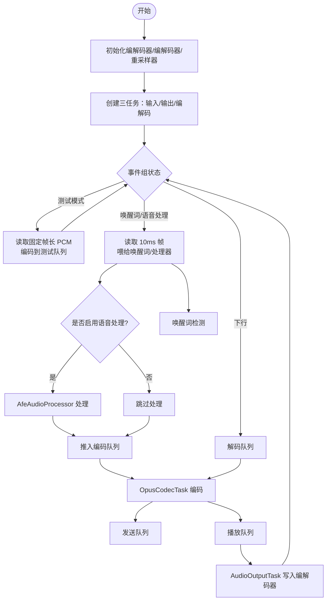
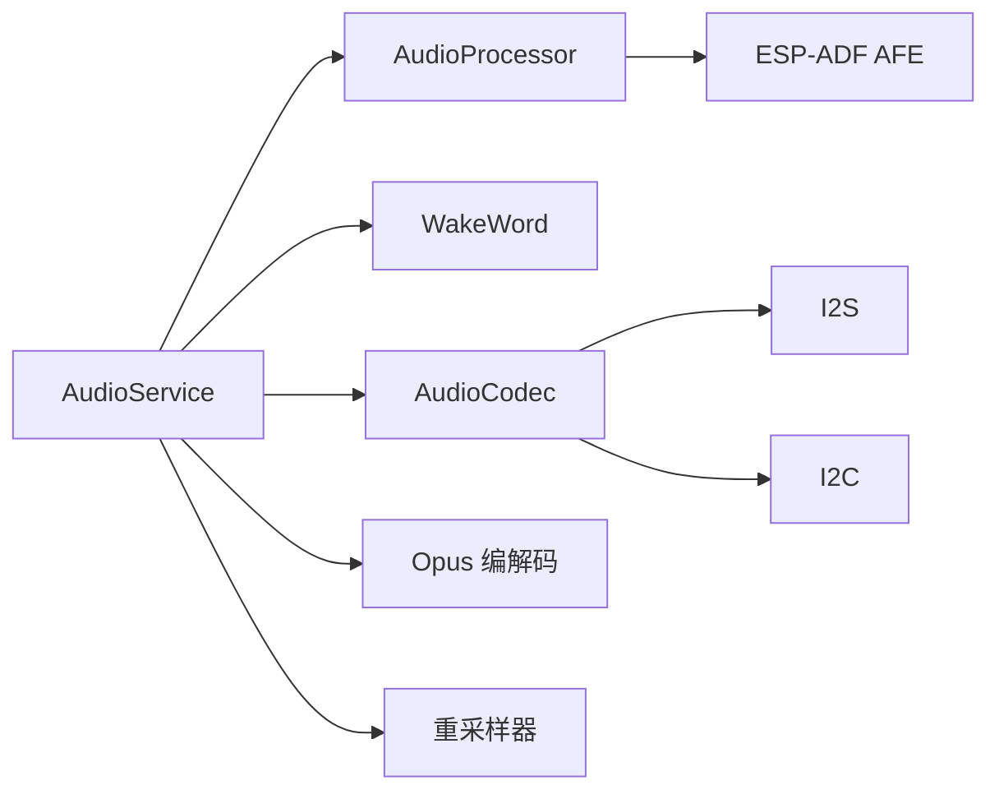

# 音频处理器

<cite>
**本文引用的文件**
- [main/audio/audio_processor.h](file://main/audio/audio_processor.h)
- [main/audio/processors/afe_audio_processor.h](file://main/audio/processors/afe_audio_processor.h)
- [main/audio/processors/afe_audio_processor.cc](file://main/audio/processors/afe_audio_processor.cc)
- [main/audio/processors/audio_debugger.h](file://main/audio/processors/audio_debugger.h)
- [main/audio/processors/audio_debugger.cc](file://main/audio/processors/audio_debugger.cc)
- [main/audio/processors/no_audio_processor.h](file://main/audio/processors/no_audio_processor.h)
- [main/audio/processors/no_audio_processor.cc](file://main/audio/processors/no_audio_processor.cc)
- [main/audio/audio_codec.h](file://main/audio/audio_codec.h)
- [main/audio/codecs/es8311_audio_codec.h](file://main/audio/codecs/es8311_audio_codec.h)
- [main/audio/codecs/es8311_audio_codec.cc](file://main/audio/codecs/es8311_audio_codec.cc)
- [main/audio/codecs/es8388_audio_codec.h](file://main/audio/codecs/es8388_audio_codec.h)
- [main/audio/wake_word.h](file://main/audio/wake_word.h)
- [main/audio/audio_service.h](file://main/audio/audio_service.h)
- [main/audio/audio_service.cc](file://main/audio/audio_service.cc)
- [main/audio/README.md](file://main/audio/README.md)
</cite>

## 目录
1. [简介](#简介)
2. [项目结构](#项目结构)
3. [核心组件](#核心组件)
4. [架构总览](#架构总览)
5. [详细组件分析](#详细组件分析)
6. [依赖关系分析](#依赖关系分析)
7. [性能考量](#性能考量)
8. [故障排查指南](#故障排查指南)
9. [结论](#结论)
10. [附录](#附录)

## 简介
本文件面向音频算法开发者与系统集成工程师，系统化阐述 XiaoZhi ESP32 项目的音频处理器设计与实现，覆盖以下主题：
- AudioProcessor 抽象基类与音频处理流水线
- AFE 音频处理器、无处理处理器、音频调试器的实现与用法
- 预处理与后处理（噪声抑制、回声消除、自动增益控制、VAD、重采样、编码/解码）
- 音频编解码器协作机制与处理器链配置
- 性能监控与调试工具使用
- 延迟优化与资源消耗控制最佳实践

## 项目结构
音频子系统由“服务层”“编解码器层”“处理器层”“唤醒词层”“调试层”构成，采用多任务并发模型，确保实时性与低延迟。

图表来源
- [main/audio/audio_service.h](file://main/audio/audio_service.h#L105-L194)
- [main/audio/audio_service.cc](file://main/audio/audio_service.cc#L62-L123)
- [main/audio/audio_processor.h](file://main/audio/audio_processor.h#L11-L24)
- [main/audio/processors/afe_audio_processor.h](file://main/audio/processors/afe_audio_processor.h#L17-L46)
- [main/audio/processors/no_audio_processor.h](file://main/audio/processors/no_audio_processor.h#L11-L32)
- [main/audio/wake_word.h](file://main/audio/wake_word.h#L11-L24)
- [main/audio/audio_codec.h](file://main/audio/audio_codec.h#L17-L59)
- [main/audio/codecs/es8311_audio_codec.h](file://main/audio/codecs/es8311_audio_codec.h#L13-L42)
- [main/audio/codecs/es8388_audio_codec.h](file://main/audio/codecs/es8388_audio_codec.h#L12-L41)

章节来源
- [main/audio/README.md](file://main/audio/README.md#L1-L88)
- [main/audio/audio_service.h](file://main/audio/audio_service.h#L105-L194)
- [main/audio/audio_service.cc](file://main/audio/audio_service.cc#L62-L123)

## 核心组件
- 抽象接口
  - AudioProcessor：定义初始化、喂入、启动/停止、运行状态、输出回调、VAD 回调、喂入粒度、设备 AEC 开关等统一接口。
  - WakeWord：定义唤醒词检测的初始化、喂入、回调、启动/停止、帧长、编码与获取等接口。
  - AudioCodec：定义输入/输出使能、音量/增益设置、I2S 读写等硬件抽象。
- 具体实现
  - AfeAudioProcessor：基于 ESP-ADF AFE 的语音前处理（VAD、噪声抑制、回声消除），并以任务驱动方式输出清洗后的 PCM 帧。
  - NoAudioProcessor：最小化路径，直接将单声道或左声道数据透传给上层。
  - Es8311AudioCodec / Es8388AudioCodec：I2S 双工通道封装，配合 esp_codec_dev 实现 ADC/DAC 控制与 PA 放大器管理。
  - AudioDebugger：可选的 UDP 调试工具，将原始音频数据发送到指定地址进行可视化分析。
- 服务编排
  - AudioService：三任务模型（输入/输出/编解码），多队列缓冲，支持唤醒词检测、语音处理、音频测试、设备 AEC 切换、功耗管理。

章节来源
- [main/audio/audio_processor.h](file://main/audio/audio_processor.h#L11-L24)
- [main/audio/wake_word.h](file://main/audio/wake_word.h#L11-L24)
- [main/audio/audio_codec.h](file://main/audio/audio_codec.h#L17-L59)
- [main/audio/processors/afe_audio_processor.h](file://main/audio/processors/afe_audio_processor.h#L17-L46)
- [main/audio/processors/no_audio_processor.h](file://main/audio/processors/no_audio_processor.h#L11-L32)
- [main/audio/codecs/es8311_audio_codec.h](file://main/audio/codecs/es8311_audio_codec.h#L13-L42)
- [main/audio/codecs/es8388_audio_codec.h](file://main/audio/codecs/es8388_audio_codec.h#L12-L41)
- [main/audio/processors/audio_debugger.h](file://main/audio/processors/audio_debugger.h#L10-L22)
- [main/audio/audio_service.h](file://main/audio/audio_service.h#L105-L194)

## 架构总览
音频处理流水线分为“上行（麦克风）”和“下行（扬声器）”，服务层通过事件组与条件变量协调多任务，保证实时性与背压控制。

图表来源
- [main/audio/audio_service.cc](file://main/audio/audio_service.cc#L230-L288)
- [main/audio/audio_service.cc](file://main/audio/audio_service.cc#L290-L325)
- [main/audio/audio_service.cc](file://main/audio/audio_service.cc#L327-L446)
- [main/audio/README.md](file://main/audio/README.md#L26-L84)

章节来源
- [main/audio/README.md](file://main/audio/README.md#L1-L88)
- [main/audio/audio_service.cc](file://main/audio/audio_service.cc#L125-L167)

## 详细组件分析

### AudioProcessor 抽象与派生类
- 设计要点
  - 统一接口屏蔽不同处理器差异，便于切换 AFE 或禁用处理。
  - 通过回调暴露 VAD 状态变化与处理后 PCM 数据，便于上层联动（如唤醒词检测）。
- 关键行为
  - Initialize：绑定编解码器、设定帧时长、加载模型列表。
  - Feed：接收音频帧，按处理器内部 chunk 规则喂入。
  - Start/Stop/IsRunning：生命周期与运行态控制。
  - OnOutput/OnVadStateChange：输出回调与 VAD 状态回调。
  - GetFeedSize：返回处理器期望的喂入样本数。
  - EnableDeviceAec：在支持设备 AEC 的平台上启用/禁用。

图表来源
- [main/audio/audio_processor.h](file://main/audio/audio_processor.h#L11-L24)
- [main/audio/processors/afe_audio_processor.h](file://main/audio/processors/afe_audio_processor.h#L17-L46)
- [main/audio/processors/no_audio_processor.h](file://main/audio/processors/no_audio_processor.h#L11-L32)

章节来源
- [main/audio/audio_processor.h](file://main/audio/audio_processor.h#L11-L24)
- [main/audio/processors/afe_audio_processor.cc](file://main/audio/processors/afe_audio_processor.cc#L13-L75)
- [main/audio/processors/no_audio_processor.cc](file://main/audio/processors/no_audio_processor.cc#L6-L26)

### AfeAudioProcessor：ESP-ADF AFE 集成
- 功能特性
  - 使用 ESP-ADF AFE 创建处理器句柄，配置 AEC/VAD/NS 模式，选择高性价比参数。
  - 以独立任务驱动 fetch_with_delay 获取清洗后的 PCM 帧，并按帧时长拼接输出。
  - 提供 VAD 状态回调，用于上层语音活动检测联动。
  - 支持切换设备 AEC（取决于编译配置）。
- 处理流程
  - 初始化：根据编解码器通道数与参考输入生成输入格式字符串；解析模型列表中的 NS/VAD 模型名；创建 AFE 句柄并启动处理任务。
  - 喂入：将输入帧累积至满足 AFE 的 feed chunksize 后喂入。
  - 输出：从 AFE fetch 到的数据按 frame_samples_ 拆分并回调上层。
  - VAD：检测静音/语音状态变化并触发回调。
  - 设备 AEC：在支持的平台上启用/禁用设备 AEC 并切换 VAD。

图表来源
- [main/audio/processors/afe_audio_processor.cc](file://main/audio/processors/afe_audio_processor.cc#L13-L75)
- [main/audio/processors/afe_audio_processor.cc](file://main/audio/processors/afe_audio_processor.cc#L91-L107)
- [main/audio/processors/afe_audio_processor.cc](file://main/audio/processors/afe_audio_processor.cc#L135-L187)

章节来源
- [main/audio/processors/afe_audio_processor.h](file://main/audio/processors/afe_audio_processor.h#L17-L46)
- [main/audio/processors/afe_audio_processor.cc](file://main/audio/processors/afe_audio_processor.cc#L13-L75)
- [main/audio/processors/afe_audio_processor.cc](file://main/audio/processors/afe_audio_processor.cc#L91-L107)
- [main/audio/processors/afe_audio_processor.cc](file://main/audio/processors/afe_audio_processor.cc#L135-L187)
- [main/audio/processors/afe_audio_processor.cc](file://main/audio/processors/afe_audio_processor.cc#L189-L201)

### NoAudioProcessor：最小化处理路径
- 适用场景
  - 不需要 AFE 预处理的简单设备，或开发调试阶段快速验证链路。
- 行为特征
  - 将双声道输入的左声道抽取为单声道透传。
  - 以固定帧时长作为喂入粒度，便于与编码器对齐。
  - 不支持设备 AEC。

章节来源
- [main/audio/processors/no_audio_processor.h](file://main/audio/processors/no_audio_processor.h#L11-L32)
- [main/audio/processors/no_audio_processor.cc](file://main/audio/processors/no_audio_processor.cc#L6-L26)
- [main/audio/processors/no_audio_processor.cc](file://main/audio/processors/no_audio_processor.cc#L48-L59)

### 音频调试器 AudioDebugger
- 功能描述
  - 在启用 CONFIG_USE_AUDIO_DEBUGGER 时，将原始 PCM 数据通过 UDP 发送到配置的服务器地址。
  - 便于在 PC 端进行波形/频谱分析与问题定位。
- 使用建议
  - 仅在开发调试阶段开启，避免影响生产环境带宽与功耗。

章节来源
- [main/audio/processors/audio_debugger.h](file://main/audio/processors/audio_debugger.h#L10-L22)
- [main/audio/processors/audio_debugger.cc](file://main/audio/processors/audio_debugger.cc#L16-L66)

### 编解码器 AudioCodec 与具体实现
- AudioCodec 抽象
  - 定义输入/输出使能、音量/增益、I2S 读写等通用接口。
  - 通过子类实现不同硬件平台的 ADC/DAC 控制。
- Es8311AudioCodec
  - 双工 I2S 通道，支持 PA 放大器控制与 MCLK 配置。
  - 通过 esp_codec_dev 打开/关闭设备，设置输入增益与输出音量。
- Es8388AudioCodec
  - 类似封装，支持输入参考通道以实现回声消除。

图表来源
- [main/audio/audio_codec.h](file://main/audio/audio_codec.h#L17-L59)
- [main/audio/codecs/es8311_audio_codec.h](file://main/audio/codecs/es8311_audio_codec.h#L13-L42)
- [main/audio/codecs/es8388_audio_codec.h](file://main/audio/codecs/es8388_audio_codec.h#L12-L41)

章节来源
- [main/audio/audio_codec.h](file://main/audio/audio_codec.h#L17-L59)
- [main/audio/codecs/es8311_audio_codec.cc](file://main/audio/codecs/es8311_audio_codec.cc#L7-L59)
- [main/audio/codecs/es8311_audio_codec.cc](file://main/audio/codecs/es8311_audio_codec.cc#L100-L156)
- [main/audio/codecs/es8311_audio_codec.cc](file://main/audio/codecs/es8311_audio_codec.cc#L158-L199)
- [main/audio/codecs/es8388_audio_codec.h](file://main/audio/codecs/es8388_audio_codec.h#L12-L41)

### 音频服务 AudioService：流水线编排与调度
- 任务模型
  - AudioInputTask：从编解码器读取 PCM，喂给唤醒词与/或音频处理器。
  - AudioOutputTask：从播放队列取出 PCM，写入编解码器播放。
  - OpusCodecTask：并发执行编码与解码，受队列长度限制。
- 队列与背压
  - 发送/解码/播放/测试队列均设置最大长度，防止内存暴涨。
  - 条件变量与互斥锁协调任务间同步。
- 功能开关
  - 唤醒词检测、语音处理、音频测试、设备 AEC 切换、模型列表注入。
- 功耗管理
  - 定时器检测输入/输出空闲时间，超时后自动关闭编解码器输入/输出通道。

图表来源
- [main/audio/audio_service.cc](file://main/audio/audio_service.cc#L125-L167)
- [main/audio/audio_service.cc](file://main/audio/audio_service.cc#L230-L288)
- [main/audio/audio_service.cc](file://main/audio/audio_service.cc#L290-L325)
- [main/audio/audio_service.cc](file://main/audio/audio_service.cc#L327-L446)

章节来源
- [main/audio/audio_service.h](file://main/audio/audio_service.h#L105-L194)
- [main/audio/audio_service.cc](file://main/audio/audio_service.cc#L62-L123)
- [main/audio/audio_service.cc](file://main/audio/audio_service.cc#L169-L182)
- [main/audio/audio_service.cc](file://main/audio/audio_service.cc#L230-L288)
- [main/audio/audio_service.cc](file://main/audio/audio_service.cc#L290-L325)
- [main/audio/audio_service.cc](file://main/audio/audio_service.cc#L327-L446)
- [main/audio/audio_service.cc](file://main/audio/audio_service.cc#L682-L695)

## 依赖关系分析
- 组件耦合
  - AudioService 对 AudioProcessor/WakeWord/AudioDebugger/编解码器存在依赖，但通过抽象接口降低耦合。
  - AfeAudioProcessor 依赖 ESP-ADF AFE 接口，NoAudioProcessor 无外部库依赖。
- 外部依赖
  - ESP-ADF：AFE、Opus 编解码、重采样器、模型管理。
  - ESP-IDF：FreeRTOS、I2S、I2C、定时器、日志。
- 潜在风险
  - 设备 AEC 仅在特定平台可用，需通过编译宏控制。
  - 队列长度与任务优先级需结合目标平台性能调优。

图表来源
- [main/audio/audio_service.cc](file://main/audio/audio_service.cc#L25-L36)
- [main/audio/processors/afe_audio_processor.cc](file://main/audio/processors/afe_audio_processor.cc#L67-L68)
- [main/audio/audio_codec.h](file://main/audio/audio_codec.h#L4-L10)

章节来源
- [main/audio/audio_service.cc](file://main/audio/audio_service.cc#L25-L36)
- [main/audio/processors/afe_audio_processor.cc](file://main/audio/processors/afe_audio_processor.cc#L67-L68)

## 性能考量
- 延迟优化
  - 采用 10ms 帧长（160 样本）喂入处理器，与 60ms Opus 帧长匹配，减少跨层拷贝。
  - 三任务并发：输入/输出/编解码分离，避免阻塞。
  - 队列长度上限与条件变量唤醒策略，避免阻塞与抖动。
- 资源控制
  - 功耗管理：空闲超时自动关闭编解码器输入/输出通道。
  - 内存：预分配输出缓冲区，减少频繁分配；按帧拆分输出，避免大块内存驻留。
  - AFE 参数：选择高性价比模式，平衡质量与性能。
- 最佳实践
  - 在编译期根据目标平台启用/禁用设备 AEC。
  - 严格控制队列长度，结合网络拥塞控制策略。
  - 使用重采样器在编解码器采样率与处理采样率不一致时进行适配。

章节来源
- [main/audio/audio_service.cc](file://main/audio/audio_service.cc#L48-L59)
- [main/audio/audio_service.cc](file://main/audio/audio_service.cc#L682-L695)
- [main/audio/processors/afe_audio_processor.cc](file://main/audio/processors/afe_audio_processor.cc#L17-L18)
- [main/audio/processors/afe_audio_processor.cc](file://main/audio/processors/afe_audio_processor.cc#L56-L65)

## 故障排查指南
- 常见问题与定位
  - 无法获取音频：检查编解码器是否已 Start，输入/输出通道是否 Enable，I2S 引脚配置是否正确。
  - 无声或破音：检查输出音量、PA 放大器使能、I2S 时钟与位宽配置。
  - 唤醒词无效：确认模型列表中包含唤醒词模型，且 WakeWord 初始化成功。
  - 设备 AEC 不生效：确认编译宏启用且目标平台支持设备 AEC。
  - 调试数据未到达：确认 CONFIG_USE_AUDIO_DEBUGGER 已启用，UDP 地址格式正确。
- 日志与统计
  - 服务层与处理器层均使用 ESP_LOG 输出关键信息，便于定位。
  - 可通过调试统计字段观察输入/解码/编码/播放计数，辅助分析瓶颈。

章节来源
- [main/audio/processors/audio_debugger.cc](file://main/audio/processors/audio_debugger.cc#L16-L66)
- [main/audio/processors/afe_audio_processor.cc](file://main/audio/processors/afe_audio_processor.cc#L135-L187)
- [main/audio/audio_service.cc](file://main/audio/audio_service.cc#L68-L84)
- [main/audio/audio_service.cc](file://main/audio/audio_service.cc#L682-L695)

## 结论
XiaoZhi ESP32 的音频子系统以 AudioService 为核心，通过抽象接口与多任务并发模型实现了高实时性的端到端音频链路。AFE 音频处理器提供了完善的预处理能力，编解码器与重采样器保障了跨平台兼容性，而调试工具与功耗管理进一步提升了工程可用性。遵循本文提供的配置与优化建议，可在不同硬件平台上获得稳定、低延迟的音频体验。

## 附录
- 关键配置项（示例）
  - CONFIG_USE_AUDIO_PROCESSOR：启用/禁用 AFE 处理器
  - CONFIG_USE_DEVICE_AEC：启用设备 AEC（需平台支持）
  - CONFIG_USE_AUDIO_DEBUGGER：启用音频调试器
  - CONFIG_AUDIO_DEBUG_UDP_SERVER：UDP 调试服务器地址（IP:PORT）

章节来源
- [main/audio/processors/audio_debugger.cc](file://main/audio/processors/audio_debugger.cc#L17-L42)
- [main/audio/processors/afe_audio_processor.cc](file://main/audio/processors/afe_audio_processor.cc#L59-L65)