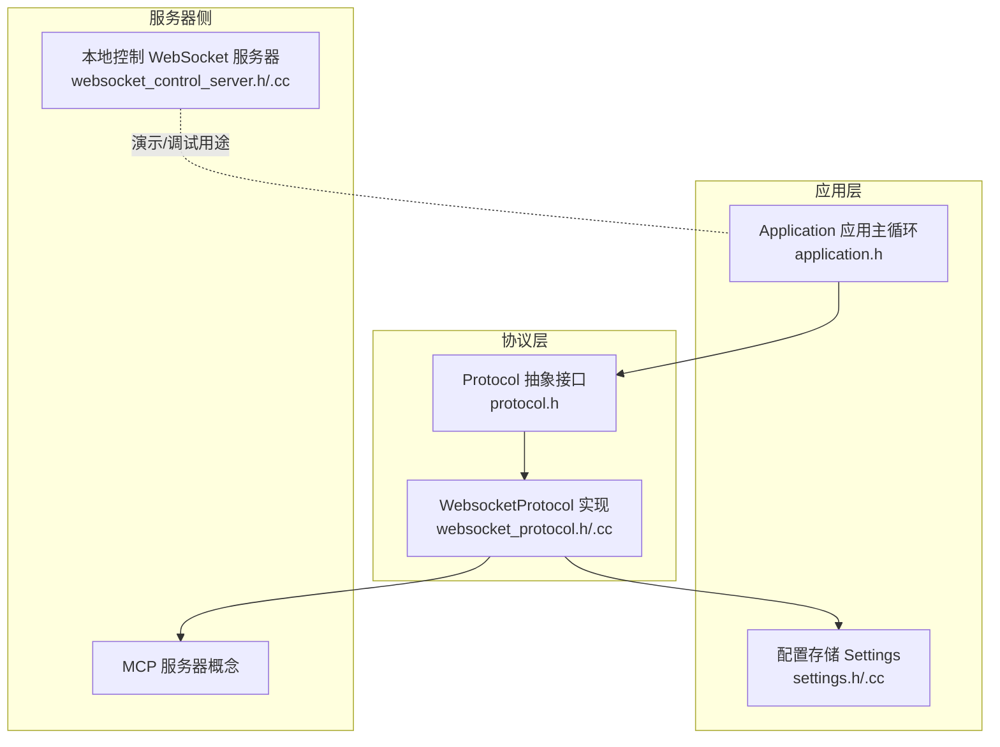
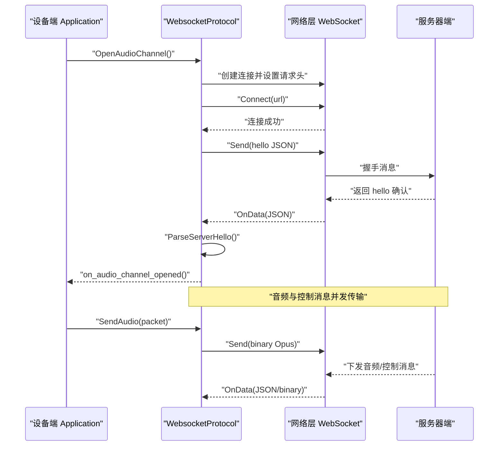
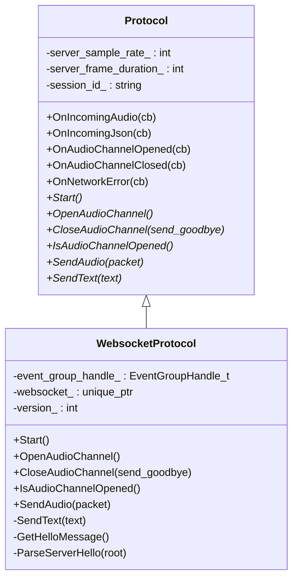
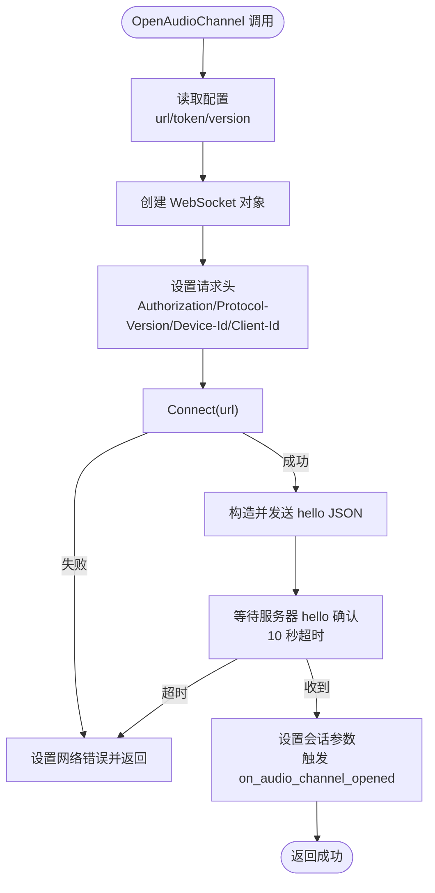
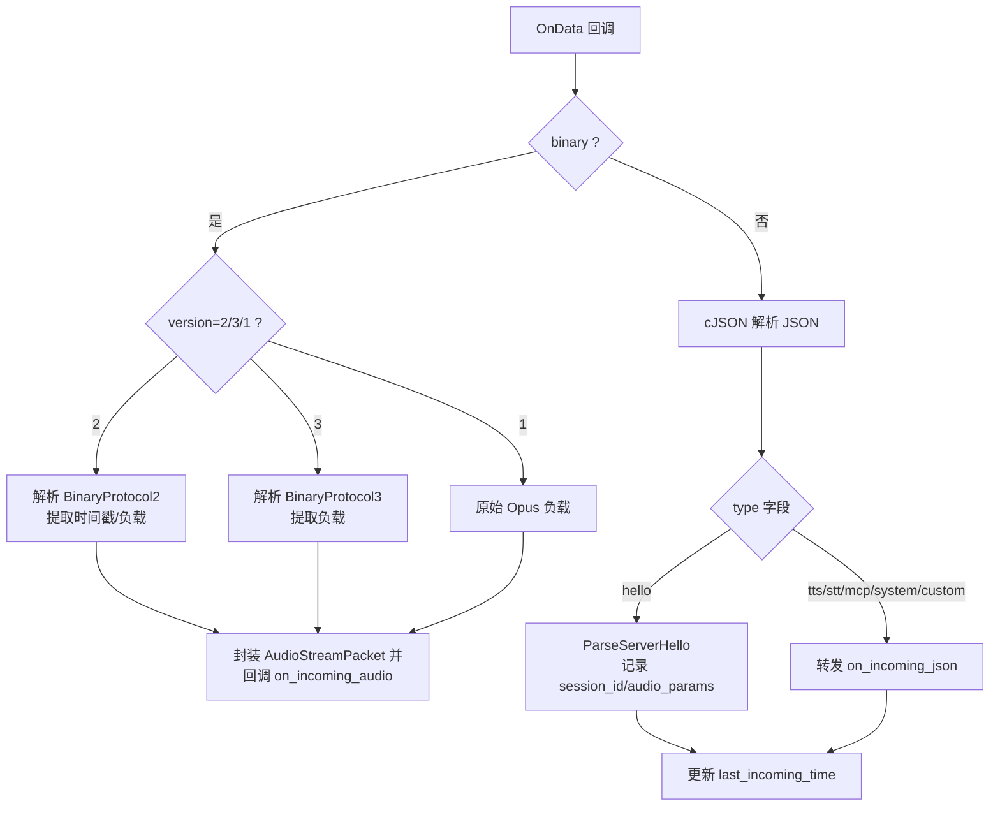
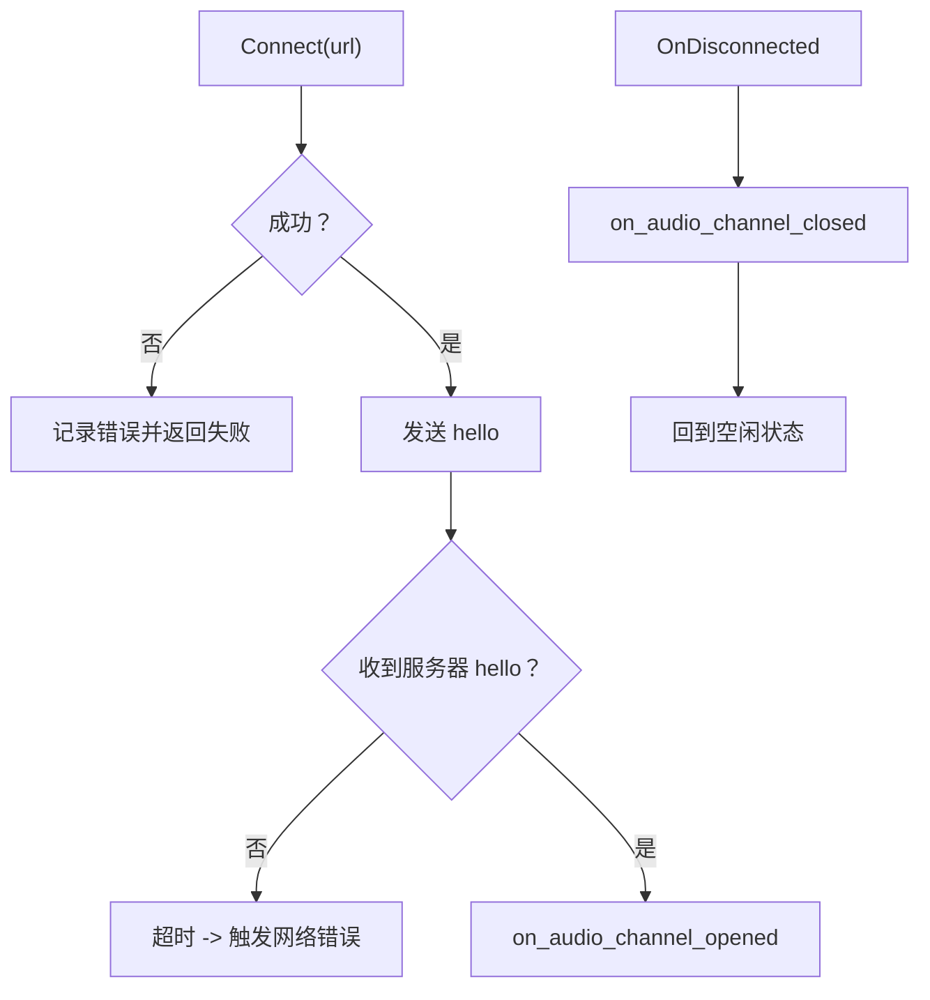
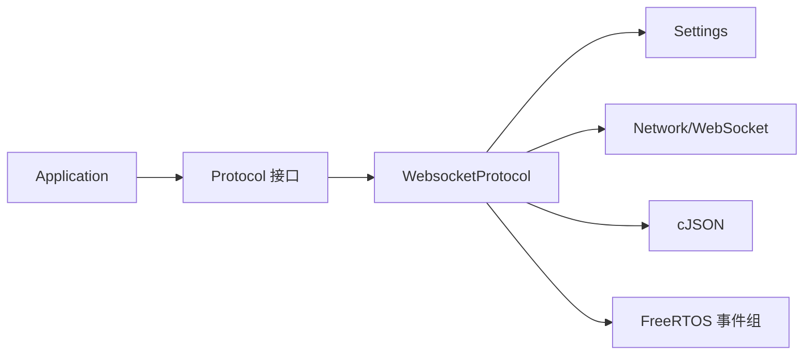

# WebSocket协议

<cite>
**本文引用的文件**
- [websocket_protocol.h](file://main/protocols/websocket_protocol.h)
- [websocket_protocol.cc](file://main/protocols/websocket_protocol.cc)
- [protocol.h](file://main/protocols/protocol.h)
- [websocket.md](file://docs/websocket.md)
- [settings.h](file://main/settings.h)
- [settings.cc](file://main/settings.cc)
- [application.h](file://main/application.h)
- [websocket_control_server.h](file://main/boards/otto-robot/websocket_control_server.h)
- [websocket_control_server.cc](file://main/boards/otto-robot/websocket_control_server.cc)
</cite>

## 目录
1. [简介](#简介)
2. [项目结构](#项目结构)
3. [核心组件](#核心组件)
4. [架构总览](#架构总览)
5. [详细组件分析](#详细组件分析)
6. [依赖关系分析](#依赖关系分析)
7. [性能考量](#性能考量)
8. [故障排查指南](#故障排查指南)
9. [结论](#结论)
10. [附录](#附录)

## 简介
本文件面向网络开发者与系统集成人员，系统化梳理 XiaoZhi ESP32 项目中基于 WebSocket 的语音与控制消息传输方案。文档覆盖连接建立、握手与认证、消息格式与数据帧结构、音频与 JSON 消息的传输方式、错误处理与重连策略、与 MCP 服务器的集成、调试与监控方法，以及最佳实践与性能优化建议。

## 项目结构
WebSocket 协议实现位于 main/protocols 子目录，配合通用协议接口、配置存储、应用层状态机与可选的本地控制 WebSocket 服务器（用于演示与调试）共同构成完整的通信链路。

**图表来源**
- [protocol.h](file://main/protocols/protocol.h#L44-L95)
- [websocket_protocol.h](file://main/protocols/websocket_protocol.h#L13-L32)
- [websocket_protocol.cc](file://main/protocols/websocket_protocol.cc#L83-L201)
- [application.h](file://main/application.h#L123-L172)
- [settings.h](file://main/settings.h#L7-L26)
- [websocket_control_server.h](file://main/boards/otto-robot/websocket_control_server.h#L9-L30)

**章节来源**
- [websocket_protocol.h](file://main/protocols/websocket_protocol.h#L1-L35)
- [websocket_protocol.cc](file://main/protocols/websocket_protocol.cc#L1-L255)
- [protocol.h](file://main/protocols/protocol.h#L1-L99)
- [application.h](file://main/application.h#L1-L190)
- [settings.h](file://main/settings.h#L1-L29)
- [settings.cc](file://main/settings.cc#L1-L109)
- [websocket_control_server.h](file://main/boards/otto-robot/websocket_control_server.h#L1-L33)
- [websocket_control_server.cc](file://main/boards/otto-robot/websocket_control_server.cc#L1-L129)

## 核心组件
- 协议抽象接口 Protocol：定义统一的音频通道打开/关闭、文本与二进制消息发送、回调注册等接口，以及服务器采样率、帧时长、会话 ID 等状态字段。
- WebsocketProtocol：具体实现，负责 WebSocket 连接、握手、认证头设置、二进制协议版本适配、音频帧与 JSON 消息收发、事件回调与错误处理。
- 配置存储 Settings：提供命名空间化的键值读写，用于保存 WebSocket URL、Token、协议版本等参数。
- 应用层 Application：驱动状态机与事件循环，按需调用协议层打开/关闭音频通道，并处理回调。
- 本地控制 WebSocket 服务器：用于演示与调试，展示如何在 ESP 端启动一个简单的 WebSocket 服务端。

**章节来源**
- [protocol.h](file://main/protocols/protocol.h#L44-L95)
- [websocket_protocol.h](file://main/protocols/websocket_protocol.h#L13-L32)
- [websocket_protocol.cc](file://main/protocols/websocket_protocol.cc#L83-L201)
- [settings.h](file://main/settings.h#L7-L26)
- [settings.cc](file://main/settings.cc#L21-L68)
- [application.h](file://main/application.h#L123-L172)
- [websocket_control_server.h](file://main/boards/otto-robot/websocket_control_server.h#L9-L30)
- [websocket_control_server.cc](file://main/boards/otto-robot/websocket_control_server.cc#L87-L108)

## 架构总览
WebSocket 协议在 XiaoZhi ESP32 中承担“全双工语音与控制消息”的承载角色。设备端在需要语音会话时打开音频通道，建立 WebSocket 连接并发送“hello”握手消息；服务器端返回“hello”确认后，设备端进入可收发状态。音频以 Opus 编码的二进制帧传输，控制消息以 JSON 文本帧传输，二者通过同一连接并发。

**图表来源**
- [websocket_protocol.cc](file://main/protocols/websocket_protocol.cc#L83-L201)
- [protocol.h](file://main/protocols/protocol.h#L58-L76)

**章节来源**
- [websocket_protocol.cc](file://main/protocols/websocket_protocol.cc#L83-L201)
- [websocket.md](file://docs/websocket.md#L7-L80)

## 详细组件分析

### WebsocketProtocol 类设计
WebsocketProtocol 继承自 Protocol，封装了 WebSocket 连接生命周期、握手、认证、二进制协议版本适配、音频与 JSON 消息处理、事件回调与错误处理。

**图表来源**
- [protocol.h](file://main/protocols/protocol.h#L44-L95)
- [websocket_protocol.h](file://main/protocols/websocket_protocol.h#L13-L32)

**章节来源**
- [websocket_protocol.h](file://main/protocols/websocket_protocol.h#L13-L32)
- [websocket_protocol.cc](file://main/protocols/websocket_protocol.cc#L15-L21)

### 连接建立与握手流程
- 配置读取：从命名空间“websocket”读取 url、token、version。
- 请求头设置：Authorization（Bearer）、Protocol-Version、Device-Id、Client-Id。
- 连接与握手：Connect 成功后发送“hello”，等待服务器“hello”确认，超时则判定失败。
- 会话参数：服务器可下发 session_id 与 audio_params（采样率、帧时长），设备据此调整内部状态。

**图表来源**
- [websocket_protocol.cc](file://main/protocols/websocket_protocol.cc#L83-L201)
- [settings.cc](file://main/settings.cc#L21-L68)

**章节来源**
- [websocket_protocol.cc](file://main/protocols/websocket_protocol.cc#L83-L201)
- [settings.cc](file://main/settings.cc#L21-L68)
- [websocket.md](file://docs/websocket.md#L16-L62)

### 认证与安全
- Authorization 头：若 token 不含空格，自动补全为“Bearer <token>”，便于服务器进行 Bearer Token 校验。
- 设备标识：Device-Id 使用 MAC 地址，Client-Id 使用设备 UUID，便于服务器侧关联与审计。
- SSL/TLS：WebSocket 连接通过底层网络库支持 TLS，具体证书与加密套件由网络栈与服务器协商决定。

**章节来源**
- [websocket_protocol.cc](file://main/protocols/websocket_protocol.cc#L101-L110)
- [websocket.md](file://docs/websocket.md#L82-L92)

### 消息格式与数据帧结构
- 文本帧（JSON）：用于“hello”握手、TTS/STT 状态、MCP 控制、系统命令等。
- 二进制帧（Opus）：用于双向音频流传输，支持三种协议版本：
  - 版本1：直接发送 Opus 数据。
  - 版本2：带版本、类型、保留、时间戳、负载长度的头部，适合服务器端 AEC。
  - 版本3：简化头部，包含类型、保留、负载长度。
- 服务器下行音频：设备端解码后播放；若采样率不一致，按需重采样。

**图表来源**
- [websocket_protocol.cc](file://main/protocols/websocket_protocol.cc#L112-L166)
- [protocol.h](file://main/protocols/protocol.h#L17-L31)

**章节来源**
- [websocket_protocol.cc](file://main/protocols/websocket_protocol.cc#L28-L58)
- [websocket_protocol.cc](file://main/protocols/websocket_protocol.cc#L112-L166)
- [protocol.h](file://main/protocols/protocol.h#L17-L31)
- [websocket.md](file://docs/websocket.md#L95-L126)

### 与 MCP 服务器的集成
- 推荐使用 type: "mcp" 的 JSON 消息承载 MCP 协议（JSON-RPC 2.0），用于设备能力发现、工具调用与状态同步。
- 服务器可通过 "mcp" 下发 tools/call 等指令，设备解析后执行相应动作并返回结果。
- 该方案在 WebSocket、MQTT 等多协议之上均可复用，具备良好扩展性与标准化能力。

**章节来源**
- [websocket.md](file://docs/websocket.md#L196-L216)
- [websocket.md](file://docs/websocket.md#L243-L261)
- [websocket.md](file://docs/websocket.md#L399-L402)

### 错误处理与重连策略
- 连接失败：Connect 返回失败或握手超时，触发网络错误回调，设备提示“无法连接到服务”。
- 断线处理：OnDisconnected 触发，回调 on_audio_channel_closed，设备回到空闲状态。
- 重连建议：应用层可在断线后延时重试，或在状态机中自动尝试重新打开音频通道。

**图表来源**
- [websocket_protocol.cc](file://main/protocols/websocket_protocol.cc#L175-L194)
- [websocket_protocol.cc](file://main/protocols/websocket_protocol.cc#L168-L173)

**章节来源**
- [websocket_protocol.cc](file://main/protocols/websocket_protocol.cc#L168-L194)
- [websocket.md](file://docs/websocket.md#L369-L380)

### 本地控制 WebSocket 服务器（演示用途）
otto-robot 板级示例提供了一个简单的本地 WebSocket 服务器，用于演示如何在 ESP 端启动 WebSocket 服务端、接收文本帧、处理消息与客户端管理。该组件与设备端的 WebsocketProtocol 无直接耦合，仅用于本地调试与演示。

**章节来源**
- [websocket_control_server.h](file://main/boards/otto-robot/websocket_control_server.h#L9-L30)
- [websocket_control_server.cc](file://main/boards/otto-robot/websocket_control_server.cc#L23-L108)

## 依赖关系分析
- WebsocketProtocol 依赖 Protocol 抽象接口，确保上层应用与具体协议实现解耦。
- 依赖 Settings 进行配置读取，避免硬编码。
- 依赖 Board/Network 抽象创建 WebSocket 对象，屏蔽底层差异。
- 依赖 cJSON 进行 JSON 解析与序列化。
- 依赖 FreeRTOS 事件组进行握手等待与状态同步。

**图表来源**
- [application.h](file://main/application.h#L123-L129)
- [protocol.h](file://main/protocols/protocol.h#L44-L95)
- [websocket_protocol.h](file://main/protocols/websocket_protocol.h#L5-L9)
- [settings.h](file://main/settings.h#L7-L26)

**章节来源**
- [application.h](file://main/application.h#L123-L129)
- [protocol.h](file://main/protocols/protocol.h#L44-L95)
- [websocket_protocol.h](file://main/protocols/websocket_protocol.h#L5-L9)
- [settings.h](file://main/settings.h#L7-L26)

## 性能考量
- 采样率与帧时长：默认 16kHz 单声道，帧时长由 OPUS_FRAME_DURATION_MS 控制；服务器下行音频可能使用更高采样率，设备端需按需重采样。
- 协议版本选择：版本2携带时间戳，利于服务器端 AEC；版本3头部更简洁；版本1最简单直接。根据服务器能力与网络条件选择。
- 二进制帧序列化：注意网络字节序转换与内存拷贝，避免频繁分配；可考虑复用缓冲区。
- 事件驱动：利用回调与事件组减少阻塞等待，提高实时性。
- 日志与监控：合理使用 ESP_LOG 输出关键路径日志，便于定位性能瓶颈。

[本节为通用指导，无需特定文件引用]

## 故障排查指南
- 无法连接服务器
  - 检查 url 与网络连通性；查看 Connect 返回码与错误日志。
  - 确认 Authorization 头格式（Bearer）与 Token 有效性。
- 握手超时
  - 检查服务器是否正确返回“hello”且 transport 字段匹配；确认事件等待超时阈值。
- JSON 消息缺失 type 字段
  - 设备端会记录错误日志并忽略该消息；请检查服务器消息格式。
- 音频播放异常
  - 确认服务器下行音频采样率与帧时长；检查设备端解码与重采样逻辑。
- 断线与重连
  - 观察 OnDisconnected 回调触发时机；在应用层实现合理的重试与状态恢复。

**章节来源**
- [websocket_protocol.cc](file://main/protocols/websocket_protocol.cc#L168-L194)
- [websocket_protocol.cc](file://main/protocols/websocket_protocol.cc#L160-L163)
- [websocket.md](file://docs/websocket.md#L369-L406)

## 结论
XiaoZhi ESP32 的 WebSocket 协议实现以 Protocol 抽象为核心，结合 Settings 配置与事件驱动模型，提供了稳定可靠的全双工语音与控制消息传输能力。通过灵活的二进制协议版本与标准化的 JSON 消息格式，系统既满足低延迟语音交互，又便于与 MCP 等上层协议集成。配合完善的错误处理与调试手段，开发者可以快速定位问题并优化性能。

[本节为总结性内容，无需特定文件引用]

## 附录

### WebSocket 连接配置参数
- URL：WebSocket 服务器地址，从配置命名空间“websocket”读取。
- Token：访问令牌，自动补全为“Bearer <token>”。
- 协议版本：1/2/3，决定二进制帧头部结构。
- 请求头：Authorization、Protocol-Version、Device-Id、Client-Id。

**章节来源**
- [settings.cc](file://main/settings.cc#L21-L68)
- [websocket_protocol.cc](file://main/protocols/websocket_protocol.cc#L84-L110)
- [websocket.md](file://docs/websocket.md#L82-L92)

### 常见 JSON 消息类型
- hello：设备端发起的握手消息；服务器端返回确认并可下发 session_id 与 audio_params。
- listen：开始/停止/检测录音监听。
- abort：中止当前说话或语音通道。
- wake_word_detected：唤醒词检测上报。
- tts/stt/mcp/system/custom：分别用于文本转语音、语音转文本、MCP 控制、系统命令与自定义消息。

**章节来源**
- [websocket.md](file://docs/websocket.md#L128-L288)