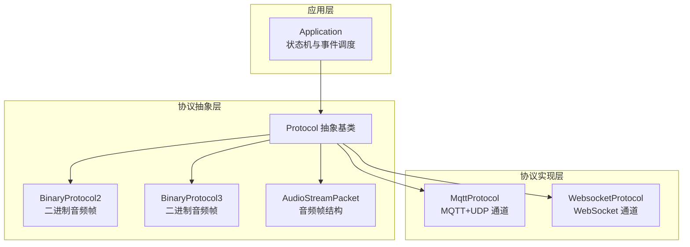
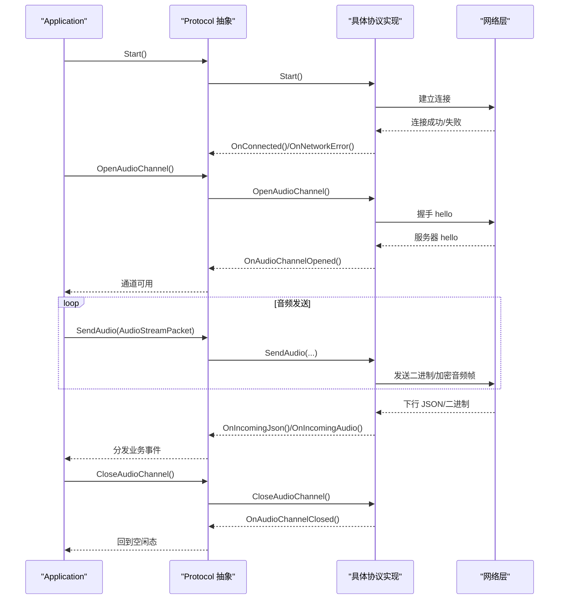
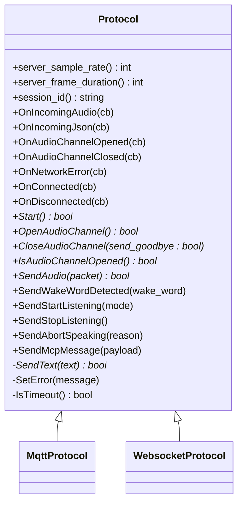
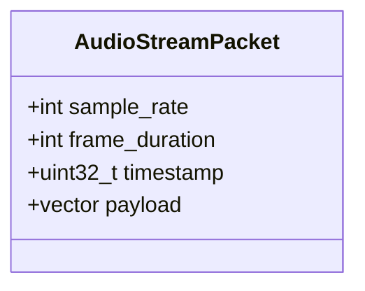
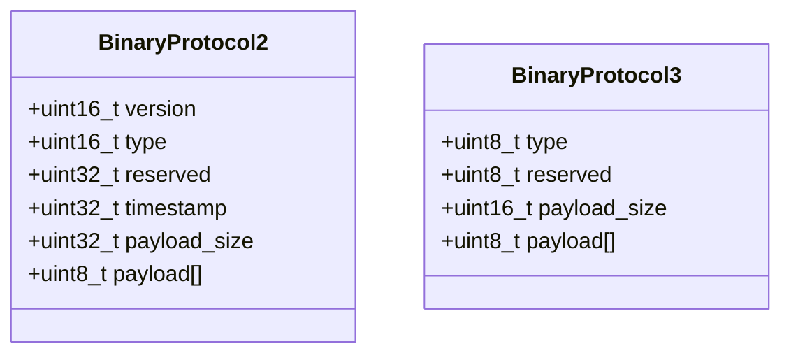
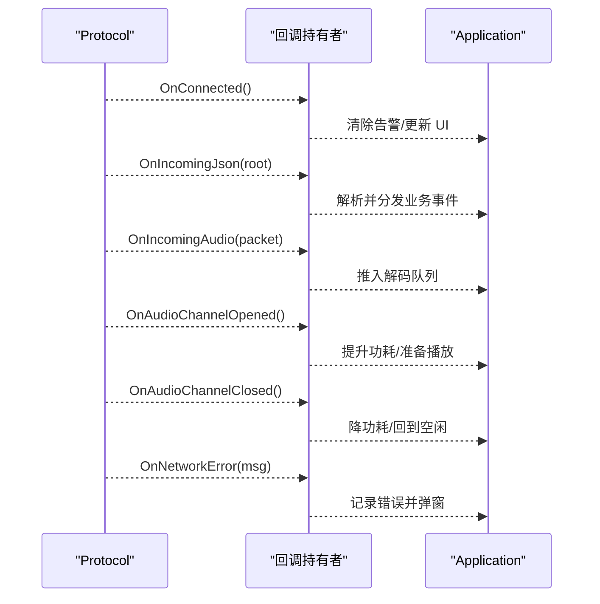
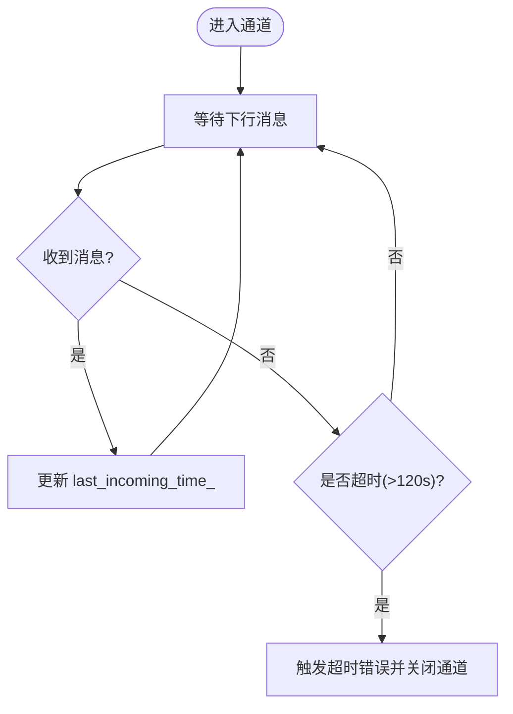
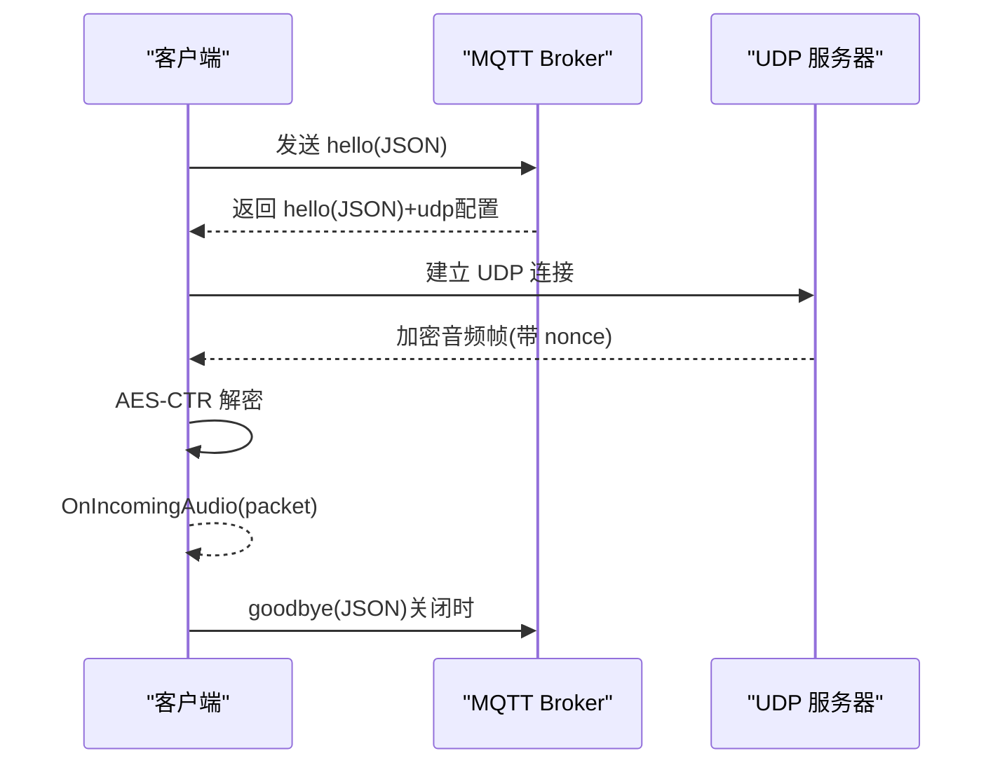
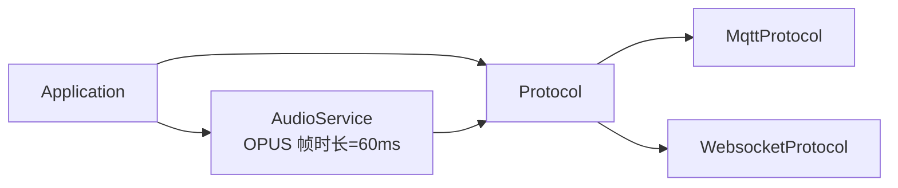

# 协议抽象层

<cite>
**本文引用的文件**
- [protocol.h](file://main/protocols/protocol.h)
- [protocol.cc](file://main/protocols/protocol.cc)
- [mqtt_protocol.h](file://main/protocols/mqtt_protocol.h)
- [mqtt_protocol.cc](file://main/protocols/mqtt_protocol.cc)
- [websocket_protocol.h](file://main/protocols/websocket_protocol.h)
- [websocket_protocol.cc](file://main/protocols/websocket_protocol.cc)
- [application.h](file://main/application.h)
- [application.cc](file://main/application.cc)
- [audio_service.h](file://main/audio/audio_service.h)
- [settings.h](file://main/settings.h)
- [websocket.md](file://docs/websocket.md)
- [mcp-protocol.md](file://docs/mcp-protocol.md)
</cite>

## 目录
1. [简介](#简介)
2. [项目结构](#项目结构)
3. [核心组件](#核心组件)
4. [架构总览](#架构总览)
5. [详细组件分析](#详细组件分析)
6. [依赖关系分析](#依赖关系分析)
7. [性能考量](#性能考量)
8. [故障排查指南](#故障排查指南)
9. [结论](#结论)
10. [附录](#附录)

## 简介
本文件针对 XiaoZhi ESP32 项目的协议抽象层进行系统化技术文档编写，重点覆盖：
- Protocol 基类的设计理念与架构模式，如何通过抽象接口统一管理不同通信协议
- 音频数据包结构 AudioStreamPacket 的设计与字段语义
- 二进制协议格式 BinaryProtocol2 与 BinaryProtocol3 的字段定义与用途
- 监听模式 ListeningMode 的类型与应用场景
- 协议回调函数系统（音频通道打开/关闭、网络错误、连接状态、JSON/音频下行等）
- 会话管理与超时检测机制
- 扩展指南：如何新增协议支持

本文件同时提供多种可视化图表，帮助系统架构师与协议开发者快速把握整体设计与关键流程。

## 项目结构
协议抽象层位于 main/protocols 目录，采用“抽象基类 + 多实现”的分层设计：
- 抽象层：protocol.h/.cc 定义通用接口与通用行为（回调注册、通用 JSON 指令发送、超时检测等）
- 实现层：mqtt_protocol.* 与 websocket_protocol.* 分别实现 MQTT 与 WebSocket 两类协议
- 应用层：application.* 使用协议抽象层，屏蔽底层差异，统一调度音频通道与事件

**图表来源**
- [protocol.h](file://main/protocols/protocol.h#L44-L95)
- [mqtt_protocol.h](file://main/protocols/mqtt_protocol.h#L26-L62)
- [websocket_protocol.h](file://main/protocols/websocket_protocol.h#L13-L32)

**章节来源**
- [protocol.h](file://main/protocols/protocol.h#L1-L99)
- [application.h](file://main/application.h#L42-L190)

## 核心组件
- Protocol 抽象基类
  - 统一的音频通道生命周期管理：Start、OpenAudioChannel、CloseAudioChannel、IsAudioChannelOpened
  - 通用 JSON 指令发送：SendWakeWordDetected、SendStartListening、SendStopListening、SendAbortSpeaking、SendMcpMessage
  - 回调注册：OnIncomingAudio、OnIncomingJson、OnAudioChannelOpened、OnAudioChannelClosed、OnNetworkError、OnConnected、OnDisconnected
  - 会话与超时：session_id、server_sample_rate/server_frame_duration、last_incoming_time_、IsTimeout
- AudioStreamPacket
  - 采样率、帧时长、时间戳、负载数据
- BinaryProtocol2 / BinaryProtocol3
  - 二进制音频帧格式，用于 WebSocket 通道的二进制封装
- MqttProtocol
  - 基于 MQTT 的控制通道 + UDP 的音频通道，支持 AES-CTR 加密
- WebsocketProtocol
  - 基于 WebSocket 的全双工通道，支持二进制协议版本切换

**章节来源**
- [protocol.h](file://main/protocols/protocol.h#L10-L95)
- [protocol.cc](file://main/protocols/protocol.cc#L7-L91)
- [mqtt_protocol.h](file://main/protocols/mqtt_protocol.h#L26-L62)
- [websocket_protocol.h](file://main/protocols/websocket_protocol.h#L13-L32)

## 架构总览
协议抽象层通过 Application 层统一调度，实现“协议无关”的音频与消息交互。核心流程：
- 应用层根据 OTA 配置选择协议实现（MQTT 或 WebSocket）
- 打开音频通道前先握手“hello”，协商会话与音频参数
- 上传音频帧（Opus）与下行 JSON 指令（TTS/STT/MCP 等）
- 通道关闭与网络断连时触发回调，驱动状态机进入空闲态

**图表来源**
- [application.cc](file://main/application.cc#L473-L610)
- [protocol.cc](file://main/protocols/protocol.cc#L7-L91)
- [websocket_protocol.cc](file://main/protocols/websocket_protocol.cc#L183-L201)
- [mqtt_protocol.cc](file://main/protocols/mqtt_protocol.cc#L227-L295)

## 详细组件分析

### Protocol 抽象基类
- 设计要点
  - 将“音频通道生命周期”“回调系统”“通用指令发送”“超时检测”等共性逻辑下沉至抽象基类，减少重复实现
  - 通过纯虚函数约束子类实现，保证接口一致性
- 关键字段与方法
  - 会话与参数：server_sample_rate/server_frame_duration/session_id
  - 回调注册：OnIncomingAudio/OnIncomingJson/OnAudioChannelOpened/OnAudioChannelClosed/OnNetworkError/OnConnected/OnDisconnected
  - 通用指令：SendWakeWordDetected/SendStartListening/SendStopListening/SendAbortSpeaking/SendMcpMessage
  - 超时检测：IsTimeout（默认 120 秒）

**图表来源**
- [protocol.h](file://main/protocols/protocol.h#L44-L95)
- [mqtt_protocol.h](file://main/protocols/mqtt_protocol.h#L26-L62)
- [websocket_protocol.h](file://main/protocols/websocket_protocol.h#L13-L32)

**章节来源**
- [protocol.h](file://main/protocols/protocol.h#L44-L95)
- [protocol.cc](file://main/protocols/protocol.cc#L7-L91)

### AudioStreamPacket 音频数据包结构
- 字段语义
  - sample_rate：服务器期望的采样率（由服务器 hello 下发）
  - frame_duration：帧时长（毫秒），影响编码帧大小与时延
  - timestamp：时间戳（毫秒），用于对齐与回声消除（AEC）
  - payload：Opus 编码的音频负载
- 适用范围
  - 作为 SendAudio 的输入与 OnIncomingAudio 的输出载体
  - WebSocket 二进制协议版本 2/3 中的时间戳字段来源

**图表来源**
- [protocol.h](file://main/protocols/protocol.h#L10-L15)

**章节来源**
- [protocol.h](file://main/protocols/protocol.h#L10-L15)

### BinaryProtocol2 与 BinaryProtocol3
- BinaryProtocol2
  - version/type/reserved/timestamp/payload_size/payload
  - 用于 WebSocket 通道的二进制音频帧封装，携带时间戳
- BinaryProtocol3
  - type/reserved/payload_size/payload
  - 简化版二进制帧，时间戳由服务器侧处理
- 字节序与校验
  - 字段在序列化/反序列化时需注意字节序转换（如 ntohs/htonl）

**图表来源**
- [protocol.h](file://main/protocols/protocol.h#L17-L31)
- [websocket_protocol.cc](file://main/protocols/websocket_protocol.cc#L33-L57)

**章节来源**
- [protocol.h](file://main/protocols/protocol.h#L17-L31)
- [websocket_protocol.cc](file://main/protocols/websocket_protocol.cc#L33-L57)

### 监听模式 ListeningMode
- 类型与语义
  - AutoStop：自动停止（默认）
  - ManualStop：手动停止
  - Realtime：实时模式（需要服务器 AEC 支持）
- 应用场景
  - AutoStop：按键触发的短时对话
  - ManualStop：按键长按或 UI 控制的连续对话
  - Realtime：需要低延迟回音消除的通话场景

**章节来源**
- [protocol.h](file://main/protocols/protocol.h#L38-L42)
- [application.cc](file://main/application.cc#L728-L774)

### 协议回调函数系统
- 回调注册
  - OnIncomingAudio：下行音频帧到达
  - OnIncomingJson：下行 JSON 指令（TTS/STT/MCP/system/alert/custom 等）
  - OnAudioChannelOpened/Closed：音频通道打开/关闭
  - OnNetworkError：网络错误
  - OnConnected/OnDisconnected：连接状态变化
- 应用层使用示例
  - 初始化协议后注册回调，分发 TTS/STT/LLM/MCP/system 等消息
  - 通道打开后调整功耗策略，通道关闭后回到空闲态

**图表来源**
- [application.cc](file://main/application.cc#L498-L607)
- [protocol.cc](file://main/protocols/protocol.cc#L7-L33)

**章节来源**
- [protocol.cc](file://main/protocols/protocol.cc#L7-L33)
- [application.cc](file://main/application.cc#L498-L607)

### 会话管理与超时检测
- 会话标识
  - session_id：由服务器 hello 下发，贯穿整个会话
- 服务器参数同步
  - 从 hello 中读取 server_sample_rate/server_frame_duration，用于音频帧构造与播放对齐
- 超时检测
  - last_incoming_time_ 记录最近一次下行消息时间
  - IsTimeout 默认 120 秒，通道打开后若超时则触发错误并关闭通道
- MQTT 特殊处理
  - 通道打开后通过 UDP 接收加密音频帧，解密后派发 OnIncomingAudio
  - 服务器 goodbye 消息触发通道关闭（避免 ping-pong）

**图表来源**
- [protocol.cc](file://main/protocols/protocol.cc#L81-L91)
- [mqtt_protocol.cc](file://main/protocols/mqtt_protocol.cc#L286-L287)

**章节来源**
- [protocol.cc](file://main/protocols/protocol.cc#L81-L91)
- [mqtt_protocol.cc](file://main/protocols/mqtt_protocol.cc#L286-L287)

### MqttProtocol 实现细节
- 控制通道：MQTT
  - hello 消息包含 features（如 aec/mcp）、transport（udp）、audio_params（opus、采样率、通道数、帧时长）
  - 服务器返回 hello，携带 session_id、audio_params（服务器采样率/帧时长）
- 音频通道：UDP + AES-CTR
  - 本地/远端序列号维护，确保有序接收
  - AES-CTR 加密，nonce 结构包含 payload_len、timestamp、sequence
- 重连与保活
  - 断线后定时器触发重连，避免频繁重试
  - MQTT keepalive 由配置决定

**图表来源**
- [mqtt_protocol.cc](file://main/protocols/mqtt_protocol.cc#L227-L295)
- [mqtt_protocol.cc](file://main/protocols/mqtt_protocol.cc#L322-L366)
- [mqtt_protocol.cc](file://main/protocols/mqtt_protocol.cc#L243-L287)

**章节来源**
- [mqtt_protocol.h](file://main/protocols/mqtt_protocol.h#L26-L62)
- [mqtt_protocol.cc](file://main/protocols/mqtt_protocol.cc#L227-L390)

### WebsocketProtocol 实现细节
- 握手与版本
  - 连接时设置 Authorization/Protocol-Version/Device-Id/Client-Id 头
  - hello 消息包含 features、transport（websocket）、audio_params
  - 支持二进制协议版本 2/3，自动识别并解析
- 二进制帧解析
  - 版本 2：携带时间戳，用于服务器 AEC
  - 版本 3：简化帧，时间戳由服务器侧处理
- 断线处理
  - 触发 OnAudioChannelClosed，回到空闲态

**章节来源**
- [websocket_protocol.h](file://main/protocols/websocket_protocol.h#L13-L32)
- [websocket_protocol.cc](file://main/protocols/websocket_protocol.cc#L183-L201)
- [websocket_protocol.cc](file://main/protocols/websocket_protocol.cc#L112-L166)

### 应用层集成与事件驱动
- 协议选择
  - 根据 OTA 配置优先选择 MQTT 或 WebSocket，默认回退到 MQTT
- 事件驱动
  - 通过事件组 MAIN_EVENT_* 驱动状态机与 UI 更新
  - 发送音频帧时，从音频服务队列取出 AudioStreamPacket 并调用 SendAudio
- 业务消息分发
  - TTS/STT/LLM/MCP/system/alert/custom 等 JSON 指令在回调中解析并分发

**章节来源**
- [application.cc](file://main/application.cc#L473-L610)
- [application.cc](file://main/application.cc#L220-L226)

## 依赖关系分析
- 抽象与实现
  - MqttProtocol/WebsocketProtocol 均继承自 Protocol，复用回调与通用指令
- 应用层耦合
  - Application 持有 Protocol 指针，通过回调与事件驱动完成业务编排
- 音频服务
  - AudioStreamPacket 与 OPUS 帧时长（60ms）强相关，影响队列容量与功耗策略

**图表来源**
- [application.h](file://main/application.h#L129-L130)
- [audio_service.h](file://main/audio/audio_service.h#L38-L67)

**章节来源**
- [application.h](file://main/application.h#L129-L130)
- [audio_service.h](file://main/audio/audio_service.h#L38-L67)

## 性能考量
- 队列与时延
  - OPUS 帧时长为 60ms，队列上限与音频测试最大时长限制共同决定端到端时延
- 功耗策略
  - 通道打开时提升功耗，通道关闭时降低功耗，避免不必要的 CPU/IO 开销
- 超时与重连
  - 120 秒超时保护，MQTT 断线后定时器重连，避免忙轮询

**章节来源**
- [audio_service.h](file://main/audio/audio_service.h#L43-L48)
- [application.cc](file://main/application.cc#L504-L519)
- [mqtt_protocol.cc](file://main/protocols/mqtt_protocol.cc#L16-L34)

## 故障排查指南
- 无法打开音频通道
  - 检查 hello 握手是否成功，确认 session_id 与 audio_params 是否正确
  - 查看 OnNetworkError 回调中的错误消息
- 超时断开
  - 检查 last_incoming_time_ 是否持续更新，确认下行消息路径
- WebSocket 二进制帧异常
  - 确认协议版本（2/3），检查字节序转换与 payload_size
- MQTT 音频解密失败
  - 核对 AES 密钥与 nonce 格式，确认序列号递增与去重

**章节来源**
- [protocol.cc](file://main/protocols/protocol.cc#L81-L91)
- [websocket_protocol.cc](file://main/protocols/websocket_protocol.cc#L112-L166)
- [mqtt_protocol.cc](file://main/protocols/mqtt_protocol.cc#L277-L281)

## 结论
协议抽象层通过清晰的接口与统一的回调系统，有效屏蔽了 MQTT 与 WebSocket 的差异，实现了“协议无关”的音频与消息交互。配合 Application 的事件驱动与状态机，系统在易用性、可维护性与可扩展性方面均具备良好表现。对于新增协议，建议遵循现有抽象接口，最小化改动即可接入。

## 附录

### 扩展指南：新增协议支持
- 步骤
  - 新建类继承自 Protocol，实现 Start/OpenAudioChannel/CloseAudioChannel/SendAudio/SendText 等纯虚函数
  - 在 Application::InitializeProtocol 中根据 OTA 配置选择新协议实例
  - 注册回调（OnIncomingAudio/OnIncomingJson/OnAudioChannelOpened/OnAudioChannelClosed/OnNetworkError/OnConnected/OnDisconnected）
  - 在 WebSocket 文档与 MCP 文档中补充新协议的握手与消息格式说明
- 注意事项
  - 保持 session_id 与 server_sample_rate/server_frame_duration 的一致性
  - 明确二进制协议版本（如有）与字节序处理
  - 实现 IsTimeout 与超时后的资源清理

**章节来源**
- [protocol.h](file://main/protocols/protocol.h#L66-L95)
- [application.cc](file://main/application.cc#L473-L487)
- [websocket.md](file://docs/websocket.md#L1-L78)
- [mcp-protocol.md](file://docs/mcp-protocol.md#L1-L270)