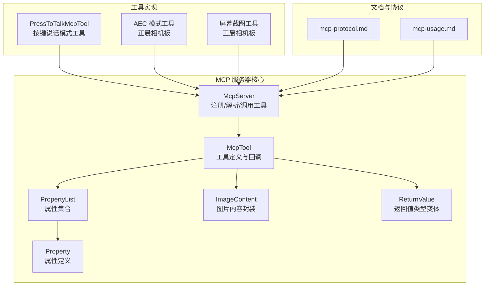
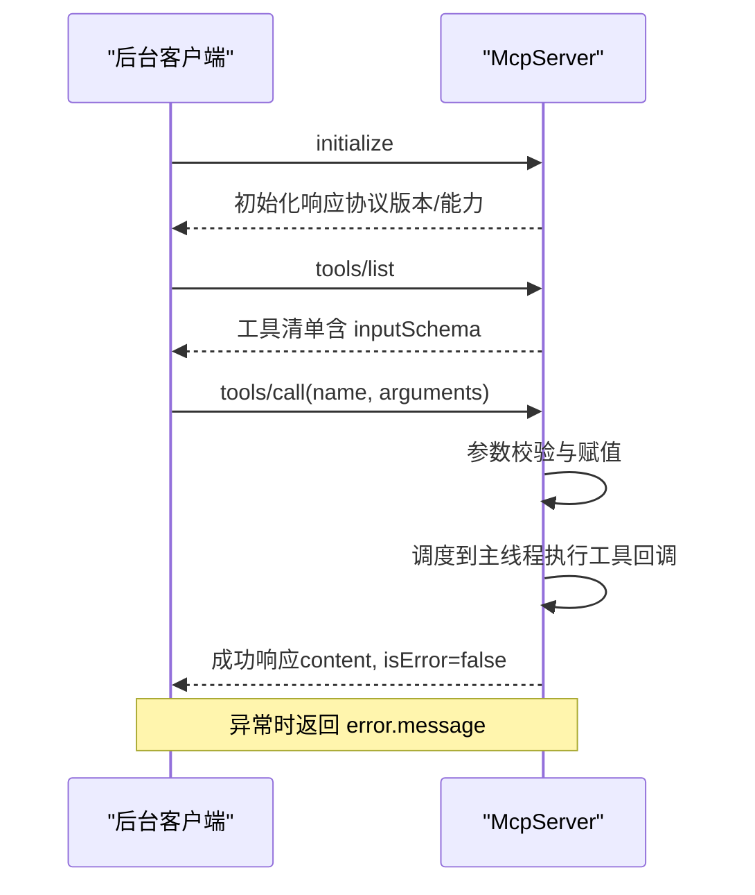
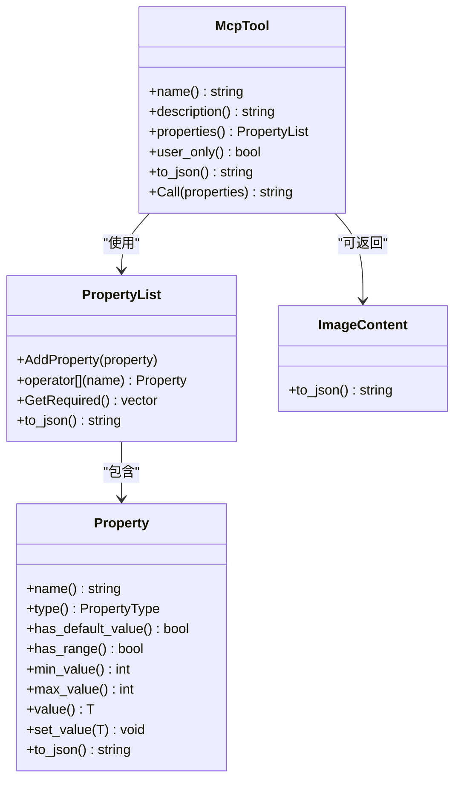
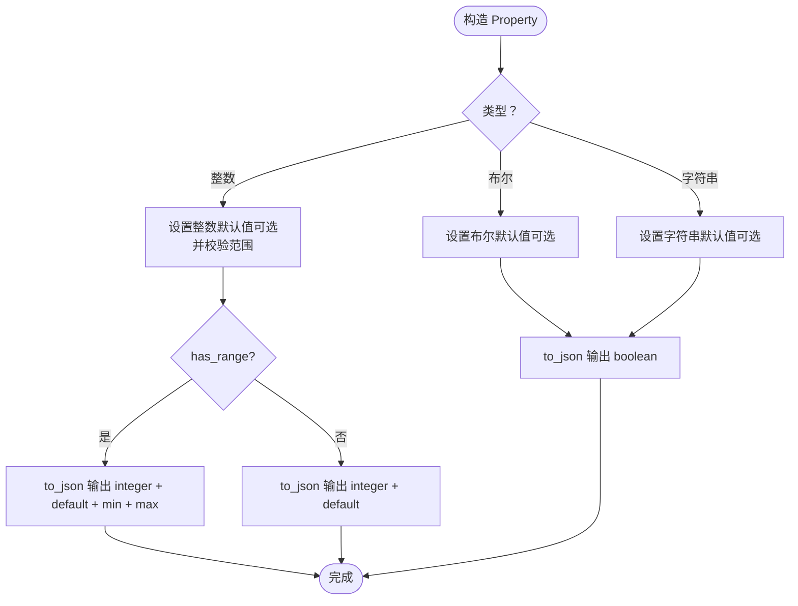
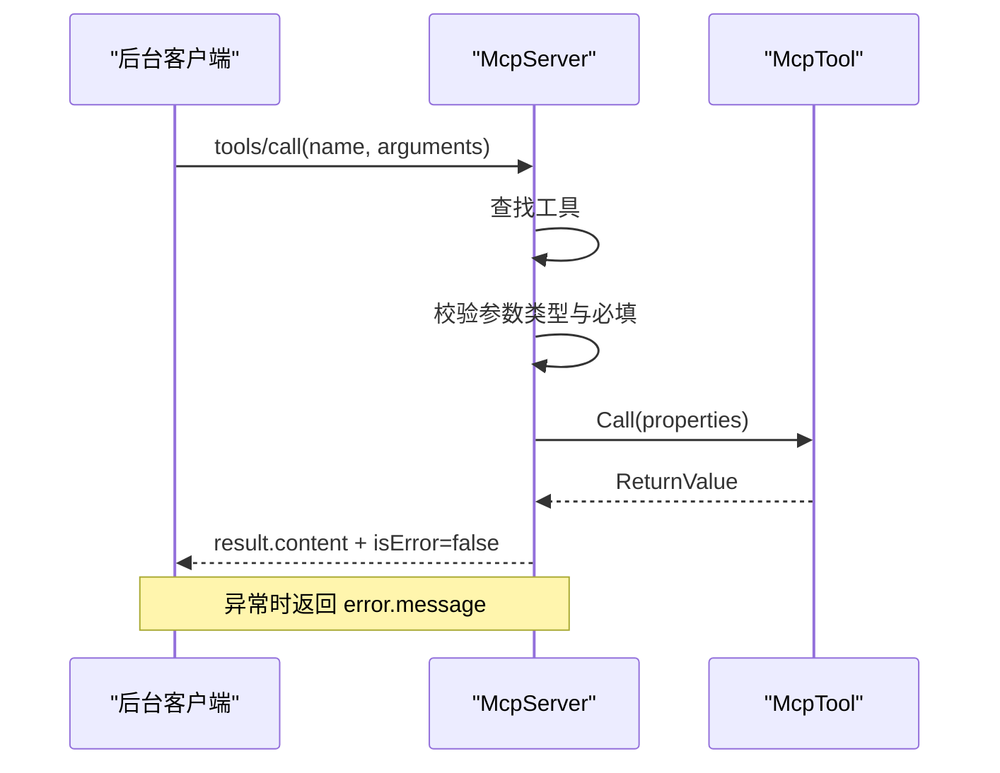
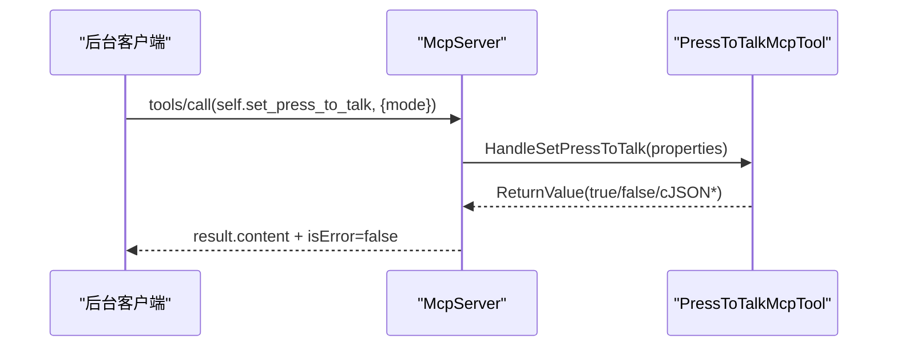
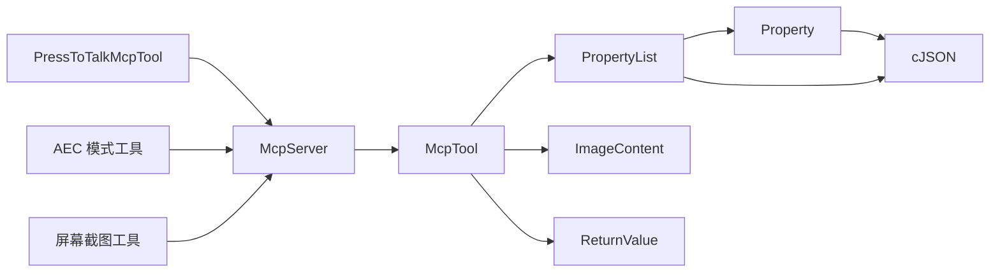

# 工具系统

<cite>
**本文引用的文件**
- [mcp_server.h](file://main/mcp_server.h)
- [mcp_server.cc](file://main/mcp_server.cc)
- [press_to_talk_mcp_tool.h](file://main/boards/common/press_to_talk_mcp_tool.h)
- [press_to_talk_mcp_tool.cc](file://main/boards/common/press_to_talk_mcp_tool.cc)
- [mcp-protocol.md](file://docs/mcp-protocol.md)
- [mcp-usage.md](file://docs/mcp-usage.md)
- [mcp_controller.cc（正晨相机版）](file://main/boards/zhengchen-cam/mcp_controller.cc)
- [mcp_controller.cc（正晨相机ML307版）](file://main/boards/zhengchen-cam-ml307/mcp_controller.cc)
- [camera.h](file://main/boards/common/camera.h)
- [esp32_camera.h](file://main/boards/common/esp32_camera.h)
- [backlight.h](file://main/boards/common/backlight.h)
- [backlight.cc](file://main/boards/common/backlight.cc)
</cite>

## 目录
1. [简介](#简介)
2. [项目结构](#项目结构)
3. [核心组件](#核心组件)
4. [架构总览](#架构总览)
5. [详细组件分析](#详细组件分析)
6. [依赖关系分析](#依赖关系分析)
7. [性能考量](#性能考量)
8. [故障排查指南](#故障排查指南)
9. [结论](#结论)
10. [附录](#附录)

## 简介
本文件面向设备控制开发者，系统性梳理 XiaoZhi ESP32 项目中的 MCP（Model Context Protocol）工具系统。重点覆盖以下主题：
- McpTool 类的设计与实现：工具定义、描述信息、参数列表、回调与返回值类型系统
- Property 与 PropertyList 类：属性类型系统（布尔、整数、字符串）、默认值与取值范围机制
- 工具回调函数与错误处理：ReturnValue 类型变体、异常抛出与 JSON-RPC 错误响应
- 工具注册与调用流程：AddTool、DoToolCall 等关键 API 的使用方法
- 实际开发示例与最佳实践：结合 Press-to-Talk、AEC 模式切换、屏幕截图等真实案例

## 项目结构
MCP 工具系统由以下关键部分组成：
- 服务器端核心：McpServer、McpTool、Property、PropertyList、ImageContent、ReturnValue 类型系统
- 工具注册入口：AddCommonTools、AddUserOnlyTools、AddTool、AddUserOnlyTool
- 工具调用流程：ParseMessage、GetToolsList、DoToolCall
- 具体工具实现：Press-to-Talk 工具、AEC 模式工具、屏幕截图工具等
- 协议与用法文档：mcp-protocol.md、mcp-usage.md

**图表来源**
- [mcp_server.h](file://main/mcp_server.h#L16-L345)
- [mcp_server.cc](file://main/mcp_server.cc#L1-L564)
- [press_to_talk_mcp_tool.h](file://main/boards/common/press_to_talk_mcp_tool.h#L1-L29)
- [press_to_talk_mcp_tool.cc](file://main/boards/common/press_to_talk_mcp_tool.cc#L1-L57)
- [mcp-protocol.md](file://docs/mcp-protocol.md#L1-L270)
- [mcp-usage.md](file://docs/mcp-usage.md#L1-L115)

**章节来源**
- [mcp_server.h](file://main/mcp_server.h#L1-L345)
- [mcp_server.cc](file://main/mcp_server.cc#L1-L564)
- [mcp-protocol.md](file://docs/mcp-protocol.md#L1-L270)
- [mcp-usage.md](file://docs/mcp-usage.md#L1-L115)

## 核心组件
本节聚焦于工具系统的核心类与类型系统，帮助开发者快速掌握设计要点。

- McpTool
  - 职责：封装单个工具的元信息（名称、描述、输入 Schema）与回调函数
  - 关键点：支持 user_only 标记；to_json 输出工具清单；Call 执行回调并统一封装返回
- Property 与 PropertyList
  - Property：支持布尔、整数、字符串三类属性；可配置默认值与取值范围；提供 to_json 输出 Schema
  - PropertyList：聚合多个 Property；提供 GetRequired 计算必填项；to_json 输出完整 Schema
- ReturnValue 类型系统
  - 使用 std::variant<bool,int,string,cJSON*,ImageContent*> 统一返回值类型
  - McpTool::Call 将不同返回值转换为 JSON-RPC result.content 数组
- ImageContent
  - 封装图片 MIME 类型与 Base64 编码数据，to_json 输出标准化图片对象
- McpServer
  - 提供 AddTool/AddUserOnlyTool 注册工具；ParseMessage 解析 JSON-RPC；GetToolsList 分页输出工具清单；DoToolCall 执行工具并处理异常

**章节来源**
- [mcp_server.h](file://main/mcp_server.h#L52-L342)
- [mcp_server.cc](file://main/mcp_server.cc#L303-L564)

## 架构总览
MCP 工具系统的运行时交互遵循 JSON-RPC 2.0，设备端作为服务器，后台客户端发起 initialize、tools/list、tools/call 请求。服务器负责：
- 初始化会话并返回协议版本与能力
- 列举工具清单（含 inputSchema）
- 执行工具调用，将结果封装为 JSON-RPC result

**图表来源**
- [mcp-protocol.md](file://docs/mcp-protocol.md#L61-L196)
- [mcp_server.cc](file://main/mcp_server.cc#L353-L436)

**章节来源**
- [mcp-protocol.md](file://docs/mcp-protocol.md#L1-L270)
- [mcp_server.cc](file://main/mcp_server.cc#L324-L436)

## 详细组件分析

### McpTool 类与工具回调
- 工具定义
  - 名称、描述、输入 Schema（PropertyList）、回调函数（ReturnValue）
  - user_only 标记用于隐藏给 AI 的工具
- 回调返回值类型
  - bool/int/string/cJSON*/ImageContent* 统一为 ReturnValue
  - Call 方法将返回值序列化为 JSON-RPC result.content
- 错误处理
  - 回调抛出异常会被捕获并转换为 JSON-RPC error.message
  - McpTool::Call 负责资源释放（如 cJSON*）

**图表来源**
- [mcp_server.h](file://main/mcp_server.h#L52-L312)

**章节来源**
- [mcp_server.h](file://main/mcp_server.h#L208-L312)

### Property 与 PropertyList：属性类型系统与默认值机制
- 属性类型
  - 布尔、整数、字符串
  - 整数支持最小值/最大值范围约束
- 默认值与必填
  - 无默认值的属性视为必填
  - GetRequired 返回必填属性名列表
- Schema 输出
  - to_json 输出符合 JSON-RPC inputSchema 的结构
  - boolean/string 输出 default 字段；integer 输出 default、minimum、maximum

**图表来源**
- [mcp_server.h](file://main/mcp_server.h#L58-L206)

**章节来源**
- [mcp_server.h](file://main/mcp_server.h#L58-L206)

### 工具注册与调用流程
- 注册 API
  - AddTool(name, description, properties, callback)
  - AddUserOnlyTool(...)：标记 user_only
  - AddCommonTools：注册通用工具（设备状态、音量、屏幕亮度、相机拍照、主题切换等）
  - AddUserOnlyTools：注册用户专用工具（系统信息、重启、固件升级、屏幕截图、预览等）
- 调用流程
  - tools/call：解析参数，校验必填与类型，调度到主线程执行回调
  - 返回值统一封装为 JSON-RPC result.content
  - 异常转换为 error.message

**图表来源**
- [mcp_server.cc](file://main/mcp_server.cc#L511-L563)

**章节来源**
- [mcp_server.cc](file://main/mcp_server.cc#L314-L322)
- [mcp_server.cc](file://main/mcp_server.cc#L511-L563)

### 实际工具开发示例

#### 示例一：按键说话模式工具（Press-to-Talk）
- 功能：在“长按说话”与“单击说话”之间切换
- 参数：mode（字符串，取值 press_to_talk 或 click_to_talk）
- 回调：根据 mode 设置状态并持久化到设置
- 注册：在 PressToTalkMcpTool::Initialize 中通过 McpServer::AddTool 注册

**图表来源**
- [press_to_talk_mcp_tool.cc](file://main/boards/common/press_to_talk_mcp_tool.cc#L10-L29)
- [press_to_talk_mcp_tool.h](file://main/boards/common/press_to_talk_mcp_tool.h#L1-L29)

**章节来源**
- [press_to_talk_mcp_tool.cc](file://main/boards/common/press_to_talk_mcp_tool.cc#L1-L57)
- [press_to_talk_mcp_tool.h](file://main/boards/common/press_to_talk_mcp_tool.h#L1-L29)

#### 示例二：AEC 对话打断模式工具（正晨相机板）
- 功能：切换 AEC 模式（关闭/设备侧开启）
- 参数：mode（字符串）
- 回调：根据 mode 设置 Application 的 AEC 模式，并返回 JSON 文本
- 注册：在 MCPController 构造函数中通过 McpServer::AddTool 注册

**章节来源**
- [mcp_controller.cc（正晨相机版）](file://main/boards/zhengchen-cam/mcp_controller.cc#L23-L83)
- [mcp_controller.cc（正晨相机ML307版）](file://main/boards/zhengchen-cam-ml307/mcp_controller.cc#L23-L83)

#### 示例三：屏幕截图与预览工具（正晨相机板）
- 屏幕截图：将当前屏幕快照编码为 JPEG 并上传至指定 URL
- 预览图片：从 URL 下载图片并在屏幕上预览
- 参数：截图包含 url、quality；预览包含 url
- 回调：下载/上传、编码、显示等操作

**章节来源**
- [mcp_server.cc](file://main/mcp_server.cc#L189-L283)

#### 示例四：通用工具（设备状态、音量、屏幕亮度、相机拍照、主题切换）
- 设备状态：返回实时设备状态 JSON
- 音量设置：设置音频编解码器输出音量（0-100）
- 屏幕亮度：设置背光亮度（0-100）
- 相机拍照：拍摄照片并解释问题
- 主题切换：切换 LVGL 主题（light/dark）

**章节来源**
- [mcp_server.cc](file://main/mcp_server.cc#L33-L126)
- [backlight.h](file://main/boards/common/backlight.h#L1-L36)
- [backlight.cc](file://main/boards/common/backlight.cc#L46-L82)
- [camera.h](file://main/boards/common/camera.h#L1-L16)
- [esp32_camera.h](file://main/boards/common/esp32_camera.h#L22-L44)

### 最佳实践
- 工具命名规范：使用“模块.功能”的层级命名，确保唯一性
- 描述与 Schema：在 description 中清晰说明用途与参数；inputSchema 体现必填与默认值
- 参数校验：在回调中对参数进行业务校验，必要时抛出异常
- 返回值一致性：优先返回 bool/int/string；复杂结构返回 cJSON*；图片返回 ImageContent*
- 用户专用工具：仅在需要时标记 user_only，避免污染 AI 可见工具集
- 性能与线程：耗时操作（如拍照、网络请求）需注意调度与内存管理

**章节来源**
- [mcp-usage.md](file://docs/mcp-usage.md#L18-L59)
- [mcp_server.cc](file://main/mcp_server.cc#L554-L562)

## 依赖关系分析
- McpServer 依赖 McpTool、Property、PropertyList、ImageContent、ReturnValue
- McpTool 依赖 PropertyList 与回调函数
- Property/PropertyList 依赖 cJSON 生成 Schema
- 具体工具实现依赖 Board/Application/Display/Camera 等子系统

**图表来源**
- [mcp_server.h](file://main/mcp_server.h#L14-L342)
- [mcp_server.cc](file://main/mcp_server.cc#L1-L564)

**章节来源**
- [mcp_server.h](file://main/mcp_server.h#L1-L345)
- [mcp_server.cc](file://main/mcp_server.cc#L1-L564)

## 性能考量
- 工具列表分页：GetToolsList 通过 nextCursor 与最大负载限制保障传输稳定性
- 参数解析与校验：DoToolCall 在主线程执行回调前完成参数类型与必填校验
- 资源管理：McpServer 析构时释放工具指针；McpTool::Call 对 cJSON* 进行释放
- 拍照与网络：相机拍照与屏幕截图涉及内存分配与网络 IO，需注意超时与错误处理

**章节来源**
- [mcp_server.cc](file://main/mcp_server.cc#L455-L509)
- [mcp_server.cc](file://main/mcp_server.cc#L511-L563)

## 故障排查指南
- 工具未找到
  - 现象：tools/call 返回 Unknown tool
  - 排查：确认工具名称拼写与注册顺序；检查 user_only 标记
- 参数缺失或类型错误
  - 现象：Missing valid argument 或 JSON 解析错误
  - 排查：核对 inputSchema 必填项；确保参数类型与范围正确
- 工具回调异常
  - 现象：tools/call 返回 error.message
  - 排查：检查回调内部异常抛出与日志；确认外部依赖（网络、硬件）可用
- 屏幕截图失败
  - 现象：snapshot 截图失败或上传状态码非 200
  - 排查：检查 URL 可达性、边界字符串、JPEG 编码与内存分配

**章节来源**
- [mcp_server.cc](file://main/mcp_server.cc#L517-L551)
- [mcp_server.cc](file://main/mcp_server.cc#L547-L561)

## 结论
XiaoZhi ESP32 的 MCP 工具系统以 McpTool 为核心，结合 Property/PropertyList 的 Schema 生成与 ReturnValue 的统一返回机制，提供了简洁而强大的设备控制能力。通过 AddCommonTools/AddUserOnlyTools/AddTool 等 API，开发者可以快速扩展工具集；配合 Press-to-Talk、AEC 模式切换、屏幕截图等真实示例，可高效构建面向设备控制的 MCP 应用。

## 附录
- 协议与交互参考：mcp-protocol.md
- 工具注册与调用示例：mcp-usage.md
- 相关硬件接口：camera.h、esp32_camera.h、backlight.h、backlight.cc

**章节来源**
- [mcp-protocol.md](file://docs/mcp-protocol.md#L1-L270)
- [mcp-usage.md](file://docs/mcp-usage.md#L1-L115)
- [camera.h](file://main/boards/common/camera.h#L1-L16)
- [esp32_camera.h](file://main/boards/common/esp32_camera.h#L22-L44)
- [backlight.h](file://main/boards/common/backlight.h#L1-L36)
- [backlight.cc](file://main/boards/common/backlight.cc#L46-L82)