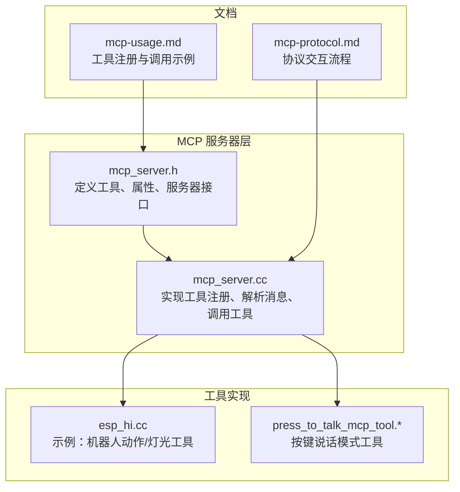
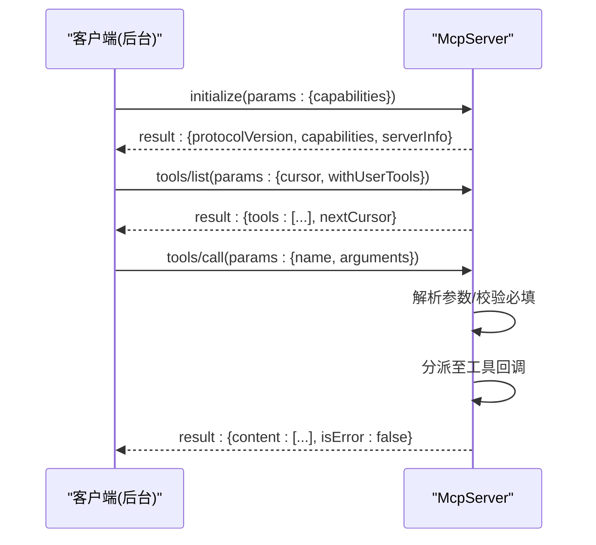
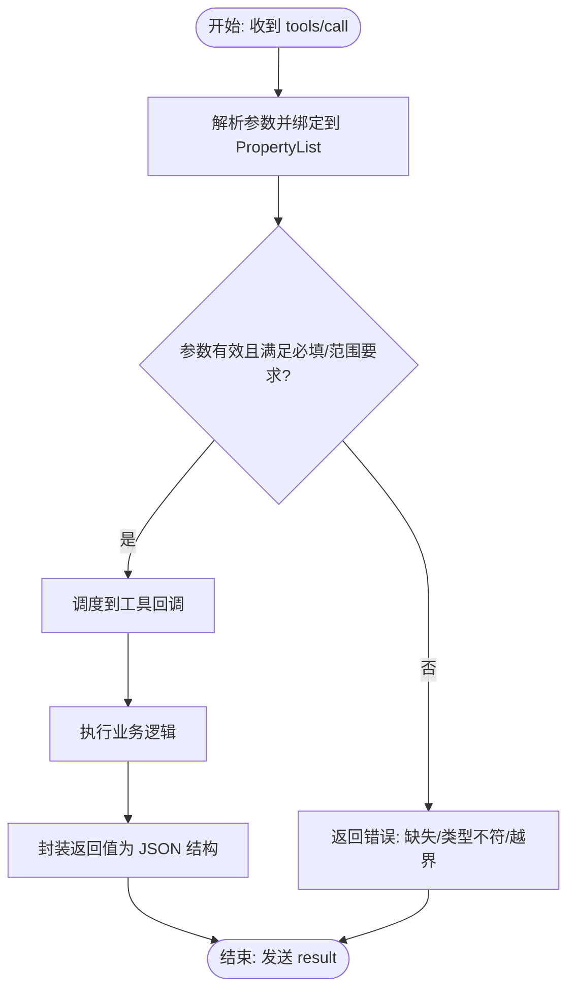
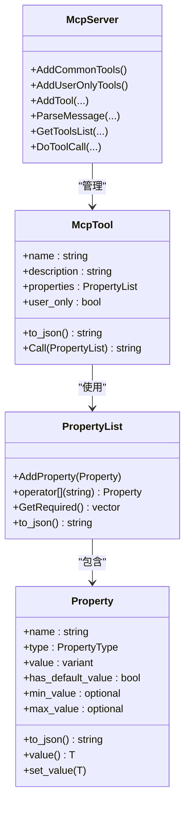
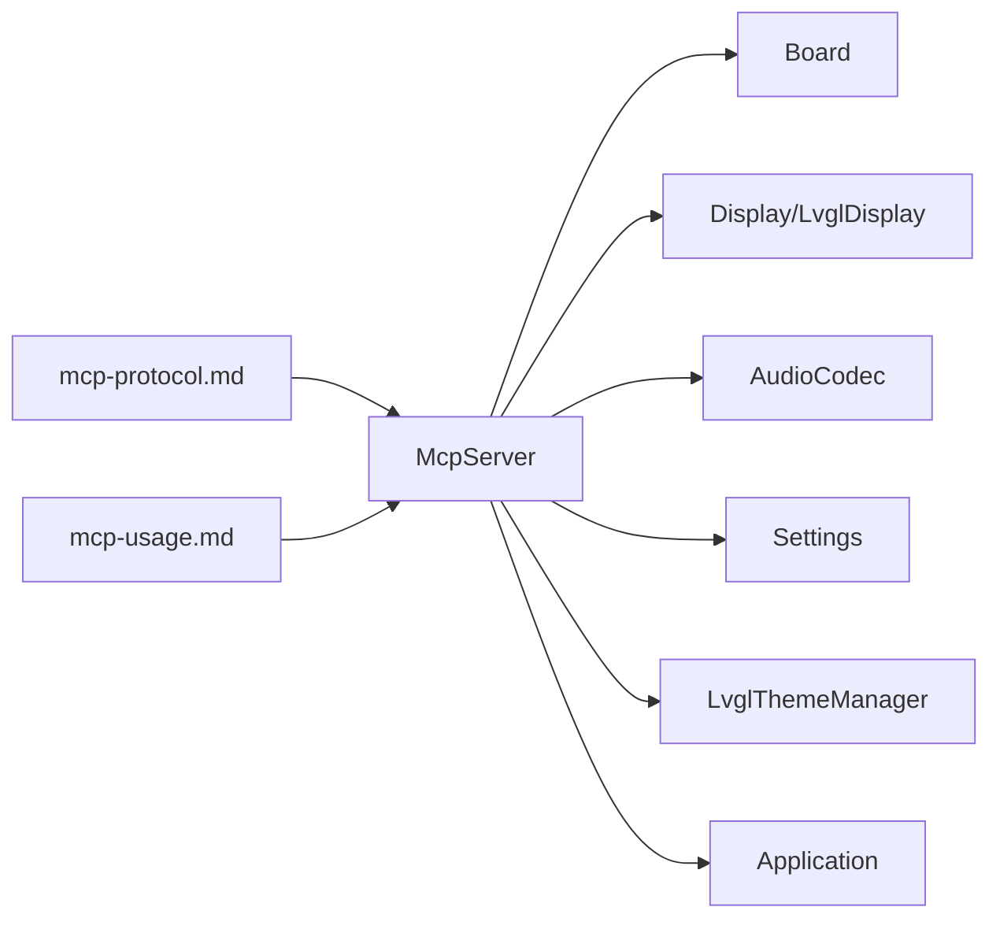

# 通用工具集

<cite>
**本文引用的文件**
- [mcp_server.h](file://main/mcp_server.h)
- [mcp_server.cc](file://main/mcp_server.cc)
- [mcp-protocol.md](file://docs/mcp-protocol.md)
- [mcp-usage.md](file://docs/mcp-usage.md)
- [esp_hi.cc](file://main/boards/esp-hi/esp_hi.cc)
- [press_to_talk_mcp_tool.h](file://main/boards/common/press_to_talk_mcp_tool.h)
- [press_to_talk_mcp_tool.cc](file://main/boards/common/press_to_talk_mcp_tool.cc)
</cite>

## 目录
1. [简介](#简介)
2. [项目结构](#项目结构)
3. [核心组件](#核心组件)
4. [架构总览](#架构总览)
5. [详细组件分析](#详细组件分析)
6. [依赖关系分析](#依赖关系分析)
7. [性能考量](#性能考量)
8. [故障排查指南](#故障排查指南)
9. [结论](#结论)
10. [附录](#附录)

## 简介
本文件为 XiaoZhi ESP32 项目的 MCP 通用工具集文档，聚焦于 MCP 服务器内置的标准工具集合与扩展机制。内容涵盖：
- 工具分类：公共工具与用户专用工具的差异与适用场景
- 工具注册流程、参数处理机制、返回值格式与调用序列
- 系统信息查询、设备状态监控、音频控制、显示管理等常用功能
- 最佳实践与性能优化建议
- 工具扩展与自定义开发指导

## 项目结构
与 MCP 工具集直接相关的代码位于 main 目录下的 mcp_server.* 与 boards 子目录中，文档位于 docs 目录。

**图表来源**
- [mcp_server.h](file://main/mcp_server.h#L208-L342)
- [mcp_server.cc](file://main/mcp_server.cc#L33-L126)
- [esp_hi.cc](file://main/boards/esp-hi/esp_hi.cc#L302-L390)
- [press_to_talk_mcp_tool.h](file://main/boards/common/press_to_talk_mcp_tool.h#L8-L27)
- [mcp-protocol.md](file://docs/mcp-protocol.md#L1-L270)
- [mcp-usage.md](file://docs/mcp-usage.md#L18-L59)

**章节来源**
- [mcp_server.h](file://main/mcp_server.h#L1-L345)
- [mcp_server.cc](file://main/mcp_server.cc#L1-L564)
- [mcp-protocol.md](file://docs/mcp-protocol.md#L1-L270)
- [mcp-usage.md](file://docs/mcp-usage.md#L1-L115)

## 核心组件
- 工具抽象与参数模型
  - Property：参数定义，支持布尔、整数、字符串三类，可声明默认值与整数范围
  - PropertyList：参数集合，提供必填项提取与 JSON 序列化
  - McpTool：工具封装，包含名称、描述、参数、回调与“仅用户可见”标记
  - McpServer：MCP 服务器，负责工具注册、消息解析、工具调用与结果返回
- 工具分类
  - 公共工具：对 AI 可见，适合通用控制与状态查询
  - 用户专用工具：仅用户可见（AI 不可见），用于系统运维与高级操作

关键职责与接口路径：
- 工具注册与分类：[mcp_server.cc](file://main/mcp_server.cc#L314-L322)
- 工具列表与分页：[mcp_server.cc](file://main/mcp_server.cc#L455-L509)
- 工具调用与参数校验：[mcp_server.cc](file://main/mcp_server.cc#L511-L563)
- 参数模型与 JSON 输出：[mcp_server.h](file://main/mcp_server.h#L58-L206)

**章节来源**
- [mcp_server.h](file://main/mcp_server.h#L50-L206)
- [mcp_server.cc](file://main/mcp_server.cc#L314-L322)
- [mcp_server.cc](file://main/mcp_server.cc#L455-L509)
- [mcp_server.cc](file://main/mcp_server.cc#L511-L563)

## 架构总览
MCP 服务器通过 JSON-RPC 2.0 负载承载工具发现与调用，消息经由底层传输协议（WebSocket/MQTT）传递。服务器在初始化阶段返回协议版本与设备信息；随后客户端通过 tools/list 获取工具清单，再通过 tools/call 调用具体工具。

**图表来源**
- [mcp-protocol.md](file://docs/mcp-protocol.md#L61-L195)
- [mcp_server.cc](file://main/mcp_server.cc#L387-L436)
- [mcp_server.cc](file://main/mcp_server.cc#L455-L509)
- [mcp_server.cc](file://main/mcp_server.cc#L511-L563)

## 详细组件分析

### 工具注册与分类
- 公共工具注册入口：AddCommonTools
  - 将常用工具置于列表前端以提升提示缓存命中率
  - 仅注册对 AI 可见的通用功能
- 用户专用工具注册入口：AddUserOnlyTools
  - 注册系统运维与高级操作工具（如重启、升级固件、屏幕截图等）
  - 通过 set_user_only(true) 标记，tools/list 可按 withUserTools 控制是否返回
- 自定义工具注册
  - 各板卡在 InitializeTools 中调用 AddTool/AddUserOnlyTool 注册特定功能
  - 示例：ESP-Hi 机器人动作与灯光控制、按键说话模式切换

注册与调用流程要点：
- 去重保护：避免重复注册同名工具
- 日志记录：注册与调用过程均有日志输出
- 异步调度：工具回调在应用主线程调度执行，保证线程安全

**章节来源**
- [mcp_server.cc](file://main/mcp_server.cc#L33-L126)
- [mcp_server.cc](file://main/mcp_server.cc#L128-L301)
- [mcp_server.cc](file://main/mcp_server.cc#L303-L322)
- [esp_hi.cc](file://main/boards/esp-hi/esp_hi.cc#L302-L390)
- [press_to_talk_mcp_tool.cc](file://main/boards/common/press_to_talk_mcp_tool.cc#L10-L29)

### 参数处理机制与返回值格式
- 参数类型与范围
  - 支持布尔、整数、字符串三类
  - 整数参数可声明最小/最大值与默认值
  - 缺少必填参数或类型不匹配时，服务器返回错误
- 参数绑定与校验
  - 服务器根据工具定义的 PropertyList 绑定 JSON 参数
  - 对整数参数进行范围校验，越界抛出异常
- 返回值格式
  - 统一包装为 JSON 结构：content 数组 + isError 标记
  - 支持文本、图像等多种内容类型
  - 回调返回值可为 bool/int/string/cJSON*/ImageContent*

**图表来源**
- [mcp_server.cc](file://main/mcp_server.cc#L511-L563)
- [mcp_server.h](file://main/mcp_server.h#L104-L121)
- [mcp_server.h](file://main/mcp_server.h#L272-L311)

**章节来源**
- [mcp_server.h](file://main/mcp_server.h#L58-L156)
- [mcp_server.cc](file://main/mcp_server.cc#L511-L563)

### 工具分类体系与应用场景
- 公共工具（AI 可见）
  - 用途：设备状态查询、音频/显示控制、相机拍照解释等
  - 代表：self.get_device_status、self.audio_speaker.set_volume、self.screen.set_brightness、self.screen.set_theme、self.camera.take_photo
- 用户专用工具（仅用户可见）
  - 用途：系统信息查询、重启、固件升级、屏幕截图与预览、资源下载地址配置等
  - 代表：self.get_system_info、self.reboot、self.upgrade_firmware、self.screen.get_info、self.screen.snapshot、self.screen.preview_image、self.assets.set_download_url

工具可见性通过工具的 user_only 标记与 tools/list 的 withUserTools 参数共同控制。

**章节来源**
- [mcp_server.cc](file://main/mcp_server.cc#L45-L121)
- [mcp_server.cc](file://main/mcp_server.cc#L128-L301)

### 典型工具实现与使用示例
- 系统信息查询
  - 工具：self.get_system_info（用户专用）
  - 功能：返回系统信息 JSON
  - 路径：[mcp_server.cc](file://main/mcp_server.cc#L130-L136)
- 设备状态监控
  - 工具：self.get_device_status（公共）
  - 功能：返回音频、屏幕、电池、网络等实时状态
  - 路径：[mcp_server.cc](file://main/mcp_server.cc#L45-L53)
- 音频控制
  - 工具：self.audio_speaker.set_volume（公共）
  - 参数：volume（0~100）
  - 路径：[mcp_server.cc](file://main/mcp_server.cc#L55-L64)
- 显示管理
  - 工具：self.screen.set_brightness（公共，若背光可用）
  - 工具：self.screen.set_theme（公共，LVGL 场景）
  - 工具：self.screen.get_info（用户专用，LVGL 场景）
  - 工具：self.screen.snapshot（用户专用，LVGL 场景）
  - 工具：self.screen.preview_image（用户专用，LVGL 场景）
  - 路径：[mcp_server.cc](file://main/mcp_server.cc#L66-L121), [mcp_server.cc](file://main/mcp_server.cc#L171-L284)
- 相机拍照与解释
  - 工具：self.camera.take_photo（公共，若设备具备相机）
  - 参数：question（字符串）
  - 路径：[mcp_server.cc](file://main/mcp_server.cc#L100-L121)
- 按键说话模式切换
  - 工具：self.set_press_to_talk（公共）
  - 参数：mode（字符串，取值 press_to_talk 或 click_to_talk）
  - 实现：PressToTalkMcpTool
  - 路径：[press_to_talk_mcp_tool.cc](file://main/boards/common/press_to_talk_mcp_tool.cc#L10-L29)

**章节来源**
- [mcp_server.cc](file://main/mcp_server.cc#L45-L121)
- [mcp_server.cc](file://main/mcp_server.cc#L128-L284)
- [press_to_talk_mcp_tool.h](file://main/boards/common/press_to_talk_mcp_tool.h#L8-L27)
- [press_to_talk_mcp_tool.cc](file://main/boards/common/press_to_talk_mcp_tool.cc#L10-L57)

### 类与关系图

**图表来源**
- [mcp_server.h](file://main/mcp_server.h#L58-L206)
- [mcp_server.h](file://main/mcp_server.h#L208-L342)

## 依赖关系分析
- McpServer 依赖 Board、Display、AudioCodec、Settings、LvglThemeManager 等子系统以实现具体工具
- 工具回调通过 Application::Schedule 将执行调度到主线程，确保与硬件驱动的线程安全
- 文档与协议定义明确了消息格式与交互顺序，指导客户端正确调用

**图表来源**
- [mcp_server.cc](file://main/mcp_server.cc#L13-L19)
- [mcp-protocol.md](file://docs/mcp-protocol.md#L1-L270)
- [mcp-usage.md](file://docs/mcp-usage.md#L1-L115)

**章节来源**
- [mcp_server.cc](file://main/mcp_server.cc#L13-L19)
- [mcp-protocol.md](file://docs/mcp-protocol.md#L1-L270)
- [mcp-usage.md](file://docs/mcp-usage.md#L1-L115)

## 性能考量
- 工具列表分页与负载上限
  - tools/list 使用 nextCursor 分页，单次响应最大字节数限制为 8000，避免超大负载
  - 路径：[mcp_server.cc](file://main/mcp_server.cc#L455-L509)
- 提升响应速度
  - 将常用工具置于工具列表前端，利用提示缓存提升 AI 响应效率
  - 路径：[mcp_server.cc](file://main/mcp_server.cc#L33-L36)
- 异步执行与优先级
  - 工具回调通过 Application::Schedule 调度到主线程，避免阻塞消息处理
  - 路径：[mcp_server.cc](file://main/mcp_server.cc#L554-L562)
- 相机拍照优先级
  - 拍照流程降低任务优先级，减少对其他任务的影响
  - 路径：[mcp_server.cc](file://main/mcp_server.cc#L112-L114)

**章节来源**
- [mcp_server.cc](file://main/mcp_server.cc#L33-L36)
- [mcp_server.cc](file://main/mcp_server.cc#L455-L509)
- [mcp_server.cc](file://main/mcp_server.cc#L554-L562)
- [mcp_server.cc](file://main/mcp_server.cc#L112-L114)

## 故障排查指南
- 常见错误与定位
  - 未知工具：tools/call 返回 Unknown tool 错误
    - 检查工具名称是否拼写正确，或是否属于用户专用工具但未开启 withUserTools
    - 路径：[mcp_server.cc](file://main/mcp_server.cc#L517-L521)
  - 缺失参数或类型不匹配：返回 Missing valid argument 错误
    - 检查 tools/list 中 inputSchema 的 required 与类型定义
    - 路径：[mcp_server.cc](file://main/mcp_server.cc#L541-L546)
  - 参数越界：抛出范围异常
    - 检查 Property 的最小/最大值定义
    - 路径：[mcp_server.h](file://main/mcp_server.h#L112-L119)
  - 工具执行异常：工具回调抛出异常，服务器返回错误
    - 查看日志输出，定位回调内部问题
    - 路径：[mcp_server.cc](file://main/mcp_server.cc#L557-L561)
- 日志与调试
  - 服务器在注册、调用、错误时均输出日志，便于定位问题
  - 路径：[mcp_server.cc](file://main/mcp_server.cc#L310-L311), [mcp_server.cc](file://main/mcp_server.cc#L547-L551)

**章节来源**
- [mcp_server.cc](file://main/mcp_server.cc#L517-L521)
- [mcp_server.cc](file://main/mcp_server.cc#L541-L546)
- [mcp_server.h](file://main/mcp_server.h#L112-L119)
- [mcp_server.cc](file://main/mcp_server.cc#L557-L561)
- [mcp_server.cc](file://main/mcp_server.cc#L310-L311)

## 结论
XiaoZhi ESP32 的 MCP 通用工具集通过清晰的工具分类、严谨的参数模型与统一的返回格式，为设备控制提供了标准化、可扩展的基础设施。公共工具服务于 AI 与用户日常操作，用户专用工具覆盖系统运维与高级功能。结合分页与提示缓存策略，系统在易用性与性能之间取得良好平衡。开发者可基于现有工具快速扩展新功能，并遵循参数与返回值规范，确保工具的一致性与可靠性。

## 附录

### 工具使用最佳实践
- 命名规范
  - 使用“模块.功能”的层次化命名，便于 AI 理解与检索
  - 路径：[mcp-usage.md](file://docs/mcp-usage.md#L20-L29)
- 参数设计
  - 必填参数尽量精简，提供合理的默认值与范围约束
  - 路径：[mcp_server.h](file://main/mcp_server.h#L79-L95)
- 返回值一致性
  - 统一使用文本或结构化 JSON，避免二义性
  - 路径：[mcp_server.h](file://main/mcp_server.h#L272-L311)
- 权限与可见性
  - 将仅面向用户的工具标记为 user_only，并在 tools/list 中按需返回
  - 路径：[mcp_server.cc](file://main/mcp_server.cc#L474-L477)

### 工具扩展与自定义开发指导
- 扩展步骤
  - 在对应板卡的 InitializeTools 中调用 AddTool/AddUserOnlyTool 注册工具
  - 定义清晰的输入参数与描述，必要时提供示例调用
  - 路径：[esp_hi.cc](file://main/boards/esp-hi/esp_hi.cc#L302-L390), [press_to_talk_mcp_tool.cc](file://main/boards/common/press_to_talk_mcp_tool.cc#L10-L29)
- 参考实现
  - 按键说话模式工具：展示参数校验、状态持久化与回调封装
  - 路径：[press_to_talk_mcp_tool.h](file://main/boards/common/press_to_talk_mcp_tool.h#L8-L27), [press_to_talk_mcp_tool.cc](file://main/boards/common/press_to_talk_mcp_tool.cc#L35-L57)
- 协议与调用
  - 严格遵循 MCP 协议与 JSON-RPC 2.0，确保客户端兼容性
  - 路径：[mcp-protocol.md](file://docs/mcp-protocol.md#L1-L270), [mcp-usage.md](file://docs/mcp-usage.md#L1-L115)