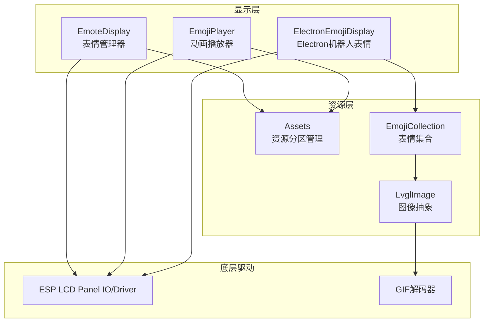
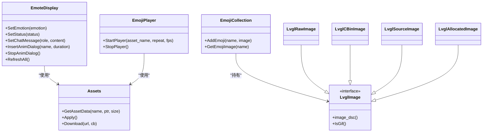
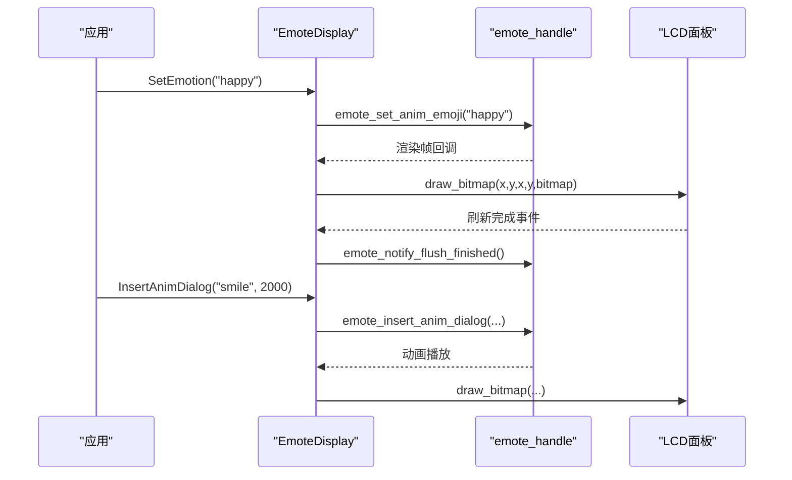
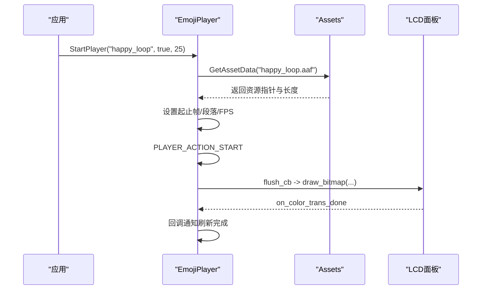
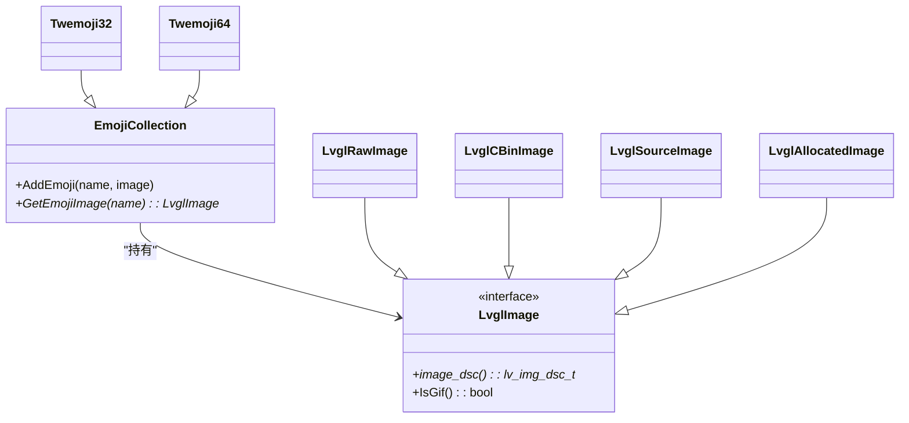
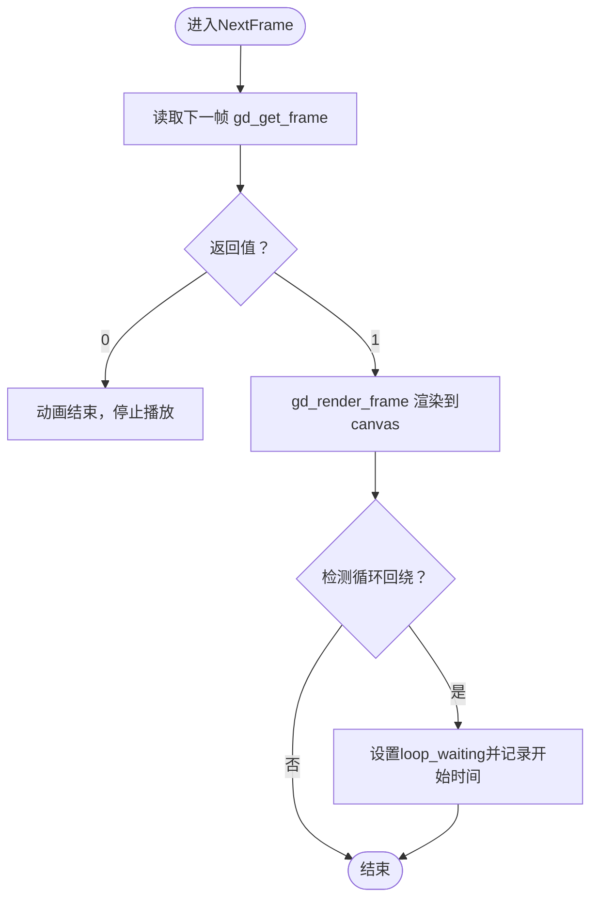
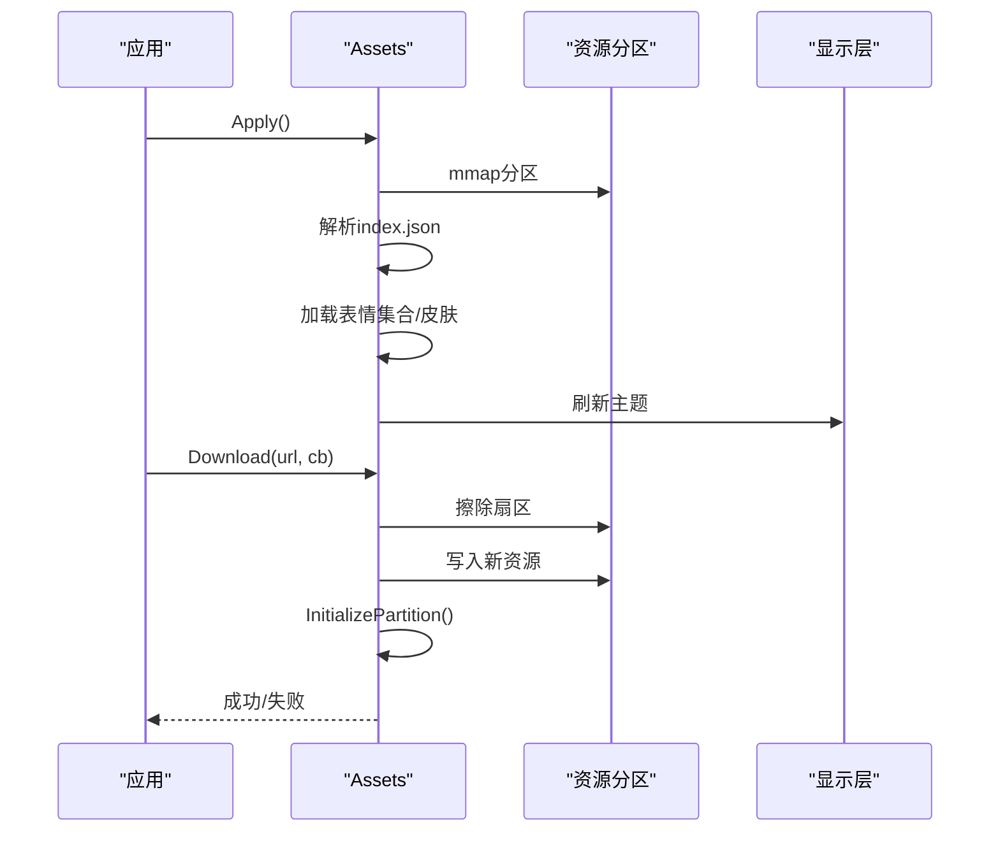
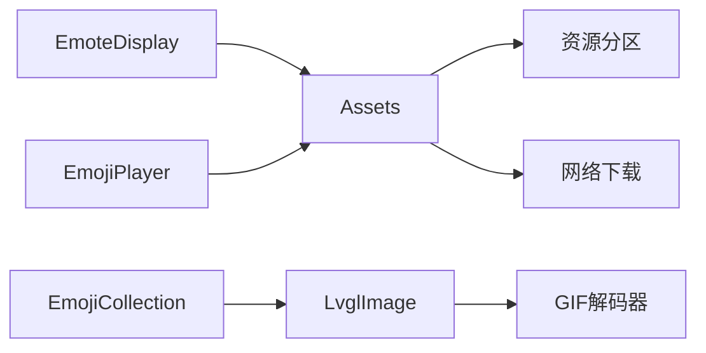

# Emoji表情系统

<cite>
**本文档引用的文件**
- [emoji_display.cc](file://main/boards/esp-hi/emoji_display.cc)
- [emoji_display.h](file://main/boards/esp-hi/emoji_display.h)
- [emote_display.cc](file://main/display/emote_display.cc)
- [emote_display.h](file://main/display/emote_display.h)
- [emoji_collection.h](file://main/display/lvgl_display/emoji_collection.h)
- [emoji_collection.cc](file://main/display/lvgl_display/emoji_collection.cc)
- [lvgl_image.h](file://main/display/lvgl_display/lvgl_image.h)
- [assets.h](file://main/assets.h)
- [assets.cc](file://main/assets.cc)
- [lvgl_gif.h](file://main/display/lvgl_display/gif/lvgl_gif.h)
- [gifdec.c](file://main/display/lvgl_display/gif/gifdec.c)
- [lvgl_gif.cc](file://main/display/lvgl_display/gif/lvgl_gif.cc)
- [electron_emoji_display.h](file://main/boards/electron-bot/electron_emoji_display.h)
- [electron_emoji_display.cc](file://main/boards/electron-bot/electron_emoji_display.cc)
- [build_default_assets.py](file://scripts/build_default_assets.py)
</cite>

## 目录
1. [简介](#简介)
2. [项目结构](#项目结构)
3. [核心组件](#核心组件)
4. [架构总览](#架构总览)
5. [详细组件分析](#详细组件分析)
6. [依赖关系分析](#依赖关系分析)
7. [性能考量](#性能考量)
8. [故障排除指南](#故障排除指南)
9. [结论](#结论)
10. [附录](#附录)

## 简介
本文件面向XiaoZhi ESP32项目的Emoji表情系统，系统性阐述表情集合的设计架构、存储管理机制、数据结构组织、渲染算法、本地化支持、资源管理策略、扩展接口以及个性化配置。文档同时提供架构图、流程图与类图，帮助读者快速理解并扩展表情系统。

## 项目结构
表情系统在项目中主要分布在以下模块：
- 显示层：负责将表情渲染到LCD面板，包含两类实现路径
  - 基于动画播放器的AAS动画表情（esp-hi）
  - 基于emote引擎的表情管理（通用）
- 资源层：统一管理表情资源（静态图片、GIF、AAS动画）与主题皮肤
- 图像抽象层：封装LVGL图像对象，支持多种来源（源数据、cbin、原始二进制）

**图表来源**
- [emote_display.cc](file://main/display/emote_display.cc#L74-L127)
- [emoji_display.cc](file://main/boards/esp-hi/emoji_display.cc#L44-L65)
- [assets.cc](file://main/assets.cc#L359-L424)
- [emoji_collection.cc](file://main/display/lvgl_display/emoji_collection.cc#L9-L28)

**章节来源**
- [emote_display.cc](file://main/display/emote_display.cc#L1-L250)
- [emoji_display.cc](file://main/boards/esp-hi/emoji_display.cc#L1-L178)
- [assets.cc](file://main/assets.cc#L1-L561)

## 核心组件
- EmoteDisplay：基于emote引擎的表情管理器，支持事件消息、状态切换与对话框插入。
- EmojiPlayer：基于动画播放器的AAS动画播放器，负责启动/停止指定动画片段。
- EmojiCollection/LvglImage：表情集合与图像抽象层，支持静态图片、GIF与源数据。
- Assets：资源分区管理器，支持下载、校验、映射与按名称检索资源。
- GIF解码器：提供GIF帧级解码、循环控制与定时更新。

**章节来源**
- [emote_display.h](file://main/display/emote_display.h#L12-L40)
- [emoji_display.h](file://main/boards/esp-hi/emoji_display.h#L18-L31)
- [emoji_collection.h](file://main/display/lvgl_display/emoji_collection.h#L14-L34)
- [lvgl_image.h](file://main/display/lvgl_display/lvgl_image.h#L7-L53)
- [assets.h](file://main/assets.h#L23-L87)
- [lvgl_gif.h](file://main/display/lvgl_display/gif/lvgl_gif.h#L63-L117)

## 架构总览
表情系统采用“显示层-资源层-图像抽象层”的分层设计：
- 显示层根据设备类型选择不同实现：esp-hi使用AAS动画，其他设备使用emote引擎。
- 资源层统一管理SPIFFS/分区中的表情资源，提供按名称检索与内存映射能力。
- 图像抽象层屏蔽底层差异，统一对外提供LVGL图像描述符。

**图表来源**
- [emote_display.h](file://main/display/emote_display.h#L12-L40)
- [emoji_display.h](file://main/boards/esp-hi/emoji_display.h#L18-L31)
- [emoji_collection.h](file://main/display/lvgl_display/emoji_collection.h#L14-L34)
- [lvgl_image.h](file://main/display/lvgl_display/lvgl_image.h#L7-L53)
- [assets.h](file://main/assets.h#L23-L87)

## 详细组件分析

### EmoteDisplay（表情管理器）
- 功能职责
  - 接收情绪、状态、聊天消息事件，调用emote引擎进行渲染或对话框插入。
  - 注册LCD面板刷新回调，确保帧缓冲正确提交。
- 关键流程
  - 初始化时创建emote句柄并注册面板事件回调。
  - SetEmotion/SetStatus根据字符串映射触发对应事件。
  - InsertAnimDialog/StopAnimDialog用于插入与停止动画对话框。
- 性能与可靠性
  - 使用双缓冲与任务栈配置保证流畅渲染。
  - 错误日志记录便于定位问题。

**图表来源**
- [emote_display.cc](file://main/display/emote_display.cc#L74-L127)
- [emote_display.cc](file://main/display/emote_display.cc#L137-L176)
- [emote_display.cc](file://main/display/emote_display.cc#L233-L240)

**章节来源**
- [emote_display.cc](file://main/display/emote_display.cc#L118-L176)
- [emote_display.cc](file://main/display/emote_display.cc#L224-L248)

### EmojiPlayer（动画播放器）
- 功能职责
  - 将AAS动画资源映射到播放器，设置起止帧、FPS与循环标志，启动/停止播放。
  - 处理面板IO刷新事件，将解码后的颜色数据绘制到LCD。
- 关键流程
  - 构造时初始化播放器与面板回调。
  - StartPlayer根据资源名映射到具体文件，设置段落与帧率后启动。
  - OnFlush回调直接调用面板绘制接口。

**图表来源**
- [emoji_display.cc](file://main/boards/esp-hi/emoji_display.cc#L44-L65)
- [emoji_display.cc](file://main/boards/esp-hi/emoji_display.cc#L76-L98)
- [emoji_display.cc](file://main/boards/esp-hi/emoji_display.cc#L31-L42)

**章节来源**
- [emoji_display.cc](file://main/boards/esp-hi/emoji_display.cc#L44-L98)

### EmojiCollection 与 LvglImage（表情集合与图像抽象）
- EmojiCollection
  - 提供表情名称到图像对象的映射，支持添加与查询。
  - Twemoji32/Twemoji64分别预置一组标准表情集。
- LvglImage及其派生类
  - 封装LVGL图像描述符，支持源数据、cbin、原始二进制与分配内存等多种来源。
  - 支持IsGif判断，配合GIF解码器实现动态表情。

**图表来源**
- [emoji_collection.h](file://main/display/lvgl_display/emoji_collection.h#L14-L34)
- [emoji_collection.cc](file://main/display/lvgl_display/emoji_collection.cc#L53-L75)
- [emoji_collection.cc](file://main/display/lvgl_display/emoji_collection.cc#L101-L123)
- [lvgl_image.h](file://main/display/lvgl_display/lvgl_image.h#L7-L53)

**章节来源**
- [emoji_collection.cc](file://main/display/lvgl_display/emoji_collection.cc#L9-L28)
- [emoji_collection.cc](file://main/display/lvgl_display/emoji_collection.cc#L53-L123)
- [lvgl_image.h](file://main/display/lvgl_display/lvgl_image.h#L15-L53)

### GIF解码器（LvglGif/Gifdec）
- 功能职责
  - 解析GIF帧、处理处置方法（背景恢复、前一帧恢复）、循环计数与等待延迟。
  - 提供帧更新回调与定时器驱动，支持循环播放与帧间延时。
- 关键流程
  - NextFrame中读取下一帧，检测文件位置回绕以识别循环开始。
  - gd_render_frame将当前帧渲染到缓冲，触发帧回调。

**图表来源**
- [lvgl_gif.cc](file://main/display/lvgl_display/gif/lvgl_gif.cc#L198-L232)
- [gifdec.c](file://main/display/lvgl_display/gif/gifdec.c#L726-L750)

**章节来源**
- [lvgl_gif.h](file://main/display/lvgl_display/gif/lvgl_gif.h#L63-L117)
- [gifdec.c](file://main/display/lvgl_display/gif/gifdec.c#L688-L770)
- [lvgl_gif.cc](file://main/display/lvgl_display/gif/lvgl_gif.cc#L198-L232)

### 资源管理（Assets）
- 功能职责
  - 发现并挂载资源分区，提供资源数据检索接口。
  - 支持下载新版本资源到分区并重新初始化。
  - 根据index.json配置加载字体、表情集合、皮肤等。
- 关键流程
  - InitializePartition：查找分区并建立内存映射，校验校验和。
  - Apply：解析index.json，加载表情集合与皮肤，设置主题。
  - Download：擦除+写入+重新初始化，支持进度回调。

**图表来源**
- [assets.cc](file://main/assets.cc#L53-L69)
- [assets.cc](file://main/assets.cc#L130-L185)
- [assets.cc](file://main/assets.cc#L214-L356)
- [assets.cc](file://main/assets.cc#L426-L560)

**章节来源**
- [assets.h](file://main/assets.h#L23-L87)
- [assets.cc](file://main/assets.cc#L30-L119)
- [assets.cc](file://main/assets.cc#L214-L356)
- [assets.cc](file://main/assets.cc#L426-L560)

### 本地化与表情包（Electron机器人）
- Electron机器人通过ElectronEmojiDisplay集成表情，使用默认表情集合配置。
- UI状态显示支持图标字体切换，例如麦克风、说话、连接等状态图标。
- 表情初始化由Assets系统从分区加载并注入到主题管理器。

**章节来源**
- [electron_emoji_display.h](file://main/boards/electron-bot/electron_emoji_display.h#L1-L23)
- [electron_emoji_display.cc](file://main/boards/electron-bot/electron_emoji_display.cc#L1-L99)

## 依赖关系分析
- 显示层依赖资源层：EmoteDisplay与EmojiPlayer均通过Assets检索资源。
- 图像抽象层被表情集合与显示层共同依赖：LvglImage统一图像接口。
- GIF解码器被LvglImage（RawImage/CBinImage）间接使用，实现动态表情。
- 资源层依赖底层分区与网络下载能力，提供统一的资源访问接口。

**图表来源**
- [emote_display.cc](file://main/display/emote_display.cc#L1-L31)
- [emoji_display.cc](file://main/boards/esp-hi/emoji_display.cc#L1-L14)
- [assets.cc](file://main/assets.cc#L1-L11)
- [lvgl_image.h](file://main/display/lvgl_display/lvgl_image.h#L1-L53)

**章节来源**
- [emote_display.cc](file://main/display/emote_display.cc#L1-L31)
- [emoji_display.cc](file://main/boards/esp-hi/emoji_display.cc#L1-L14)
- [assets.cc](file://main/assets.cc#L1-L11)

## 性能考量
- 资源加载
  - 分区内存映射与校验和验证，避免重复解析开销。
  - 支持增量下载与重新初始化，降低OTA失败风险。
- 渲染性能
  - EmoteDisplay使用双缓冲与任务栈配置，保证帧率稳定。
  - EmojiPlayer通过面板IO事件回调减少阻塞，提高并发效率。
- 内存优化
  - GIF解码器按需渲染帧，避免全量缓存。
  - LvglImage支持多种来源，按需分配与释放，减少内存碎片。
- 缓存机制
  - 资源名称到偏移的索引表，O(1)快速定位资源。
  - 主题与皮肤缓存于主题管理器，避免重复加载。

[本节为通用性能建议，不直接分析具体文件]

## 故障排除指南
- 资源分区未找到或校验失败
  - 现象：初始化失败、资源无法加载。
  - 排查：确认分区标签与大小，检查校验和与索引文件完整性。
- 动画播放异常
  - 现象：无画面或卡顿。
  - 排查：检查资源文件是否存在、面板IO回调是否注册、帧率设置是否合理。
- GIF播放问题
  - 现象：循环不生效或闪烁。
  - 排查：确认处置方法处理逻辑、循环计数与等待延迟配置。
- UI状态图标显示异常
  - 现象：状态图标未显示或错位。
  - 排查：检查图标字体加载与样式设置，确认状态字符串匹配。

**章节来源**
- [assets.cc](file://main/assets.cc#L130-L185)
- [emoji_display.cc](file://main/boards/esp-hi/emoji_display.cc#L31-L42)
- [gifdec.c](file://main/display/lvgl_display/gif/gifdec.c#L688-L770)
- [electron_emoji_display.cc](file://main/boards/electron-bot/electron_emoji_display.cc#L59-L99)

## 结论
XiaoZhi ESP32的Emoji表情系统通过清晰的分层设计实现了静态与动态表情的统一管理与高效渲染。资源层提供灵活的分区管理与下载能力，显示层适配不同硬件平台，图像抽象层屏蔽底层差异。系统具备良好的可扩展性与国际化基础，可通过资源配置与主题管理实现多语言与地区特色表情包的无缝集成。

## 附录

### 数据结构与复杂度
- 资源索引表：哈希表存储，查找O(1)，构建O(n)。
- 表情集合：有序映射，查找O(log n)，插入O(log n)。
- GIF解码：逐帧解码，时间复杂度O(f)，f为帧数；空间复杂度O(w*h)每帧。

**章节来源**
- [assets.cc](file://main/assets.cc#L176-L184)
- [emoji_collection.cc](file://main/display/lvgl_display/emoji_collection.cc#L9-L21)
- [gifdec.c](file://main/display/lvgl_display/gif/gifdec.c#L726-L750)

### 扩展接口与自定义表情包
- 自定义表情包
  - 在index.json中通过emoji_collection数组添加新表情项，支持PNG/GIF等格式。
  - 通过Assets::Apply自动注入到主题管理器。
- 动态表情添加
  - 通过LvglRawImage/LvglCBinImage包装资源数据，添加到EmojiCollection。
- 个性化设置
  - 通过皮肤配置（light/dark）与主题管理器实现颜色、背景与字体的个性化。

**章节来源**
- [assets.cc](file://main/assets.cc#L262-L287)
- [lvgl_image.h](file://main/display/lvgl_display/lvgl_image.h#L15-L53)
- [emoji_collection.h](file://main/display/lvgl_display/emoji_collection.h#L14-L34)

### 表情系统配置选项
- index.json关键字段
  - version：资源版本号，用于兼容性检查。
  - text_font：文本字体文件。
  - emoji_collection：自定义表情列表（name、file、eaf）。
  - skin.light/dark：主题皮肤配置（text_color、background_color、background_image）。
  - hide_subtitle：隐藏字幕配置。
- 资源下载与应用
  - Download接口支持进度回调，Apply接口重新加载资源与主题。

**章节来源**
- [assets.cc](file://main/assets.cc#L222-L356)
- [assets.cc](file://main/assets.cc#L426-L560)