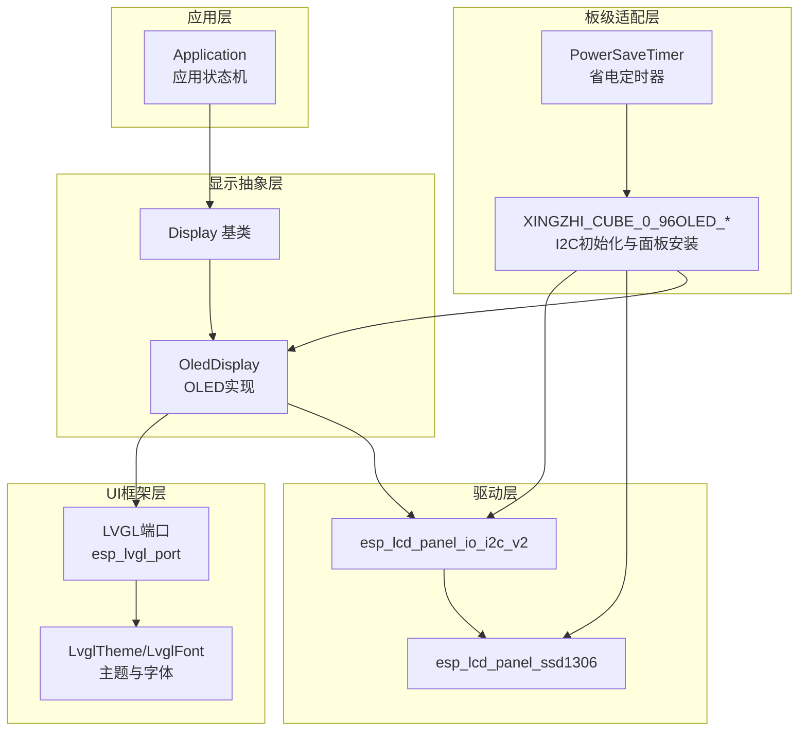
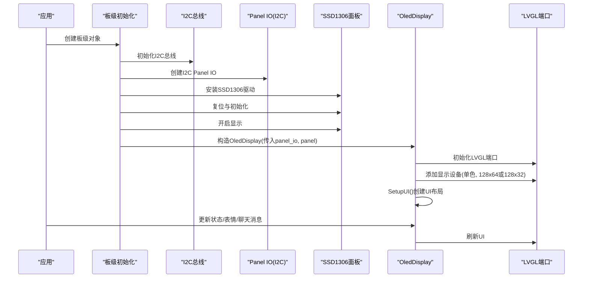
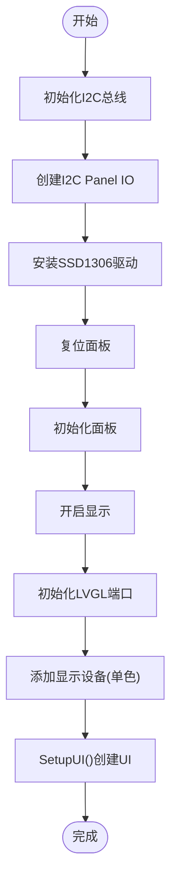
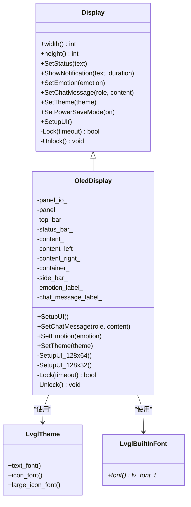
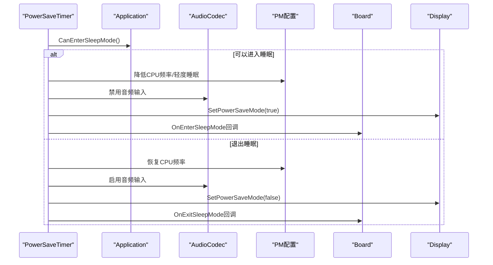
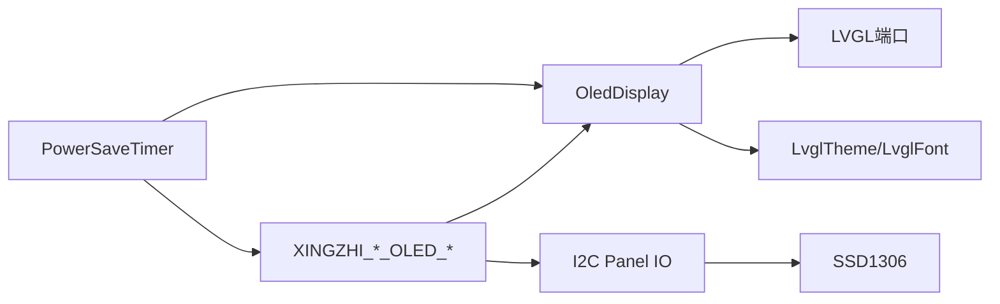

# OLED显示系统

<cite>
**本文档引用的文件**
- [oled_display.h](file://main/display/oled_display.h)
- [oled_display.cc](file://main/display/oled_display.cc)
- [display.h](file://main/display/display.h)
- [lvgl_display/lvgl_font.h](file://main/display/lvgl_display/lvgl_font.h)
- [lvgl_display/lvgl_theme.h](file://main/display/lvgl_display/lvgl_theme.h)
- [lvgl_display/lvgl_display.cc](file://main/display/lcd_display.cc)
- [xingzhi-cube-0.96oled-wifi.cc](file://main/boards/xingzhi-cube-0.96oled-wifi/xingzhi-cube-0.96oled-wifi.cc)
- [xingzhi-cube-0.96oled-ml307.cc](file://main/boards/xingzhi-cube-0.96oled-ml307/xingzhi-cube-0.96oled-ml307.cc)
- [power_save_timer.h](file://main/boards/common/power_save_timer.h)
- [power_save_timer.cc](file://main/boards/common/power_save_timer.cc)
- [config.h](file://main/boards/xingzhi-cube-0.96oled-wifi/config.h)
</cite>

## 目录
1. [简介](#简介)
2. [项目结构](#项目结构)
3. [核心组件](#核心组件)
4. [架构总览](#架构总览)
5. [详细组件分析](#详细组件分析)
6. [依赖关系分析](#依赖关系分析)
7. [性能考虑](#性能考虑)
8. [故障排除指南](#故障排除指南)
9. [结论](#结论)
10. [附录](#附录)

## 简介
本文件面向XiaoZhi ESP32项目中的OLED显示系统，系统基于ESP32的ESP_LCD与LVGL显示栈，采用I2C接口驱动SSD1306类OLED面板，提供文本、图标、表情等UI元素的渲染能力，并集成电源管理与省电模式控制。本文档从硬件接口规范、初始化流程、渲染机制、功耗优化、配置参数到故障排除与扩展实现进行完整说明。

## 项目结构
OLED显示系统主要由以下层次构成：
- 驱动层：通过ESP_LCD Panel IO与Panel驱动（SSD1306）完成底层硬件交互
- 显示抽象层：Display基类与OledDisplay实现，统一UI更新与主题管理
- UI框架层：LVGL端口与主题/字体管理，支持多分辨率布局
- 板级适配层：各开发板通过I2C初始化面板并创建OledDisplay实例
- 电源管理：PowerSaveTimer在空闲时进入省电模式，控制显示与背光

图表来源
- [oled_display.cc](file://main/display/oled_display.cc#L20-L81)
- [xingzhi-cube-0.96oled-wifi.cc](file://main/boards/xingzhi-cube-0.96oled-wifi/xingzhi-cube-0.96oled-wifi.cc#L85-L130)
- [power_save_timer.cc](file://main/boards/common/power_save_timer.cc#L62-L104)

章节来源
- [oled_display.h](file://main/display/oled_display.h#L10-L39)
- [oled_display.cc](file://main/display/oled_display.cc#L20-L81)
- [display.h](file://main/display/display.h#L28-L61)

## 核心组件
- OledDisplay：继承自Display，封装LVGL端口初始化、UI布局（128x64/128x32）、文本/图标/表情渲染、主题切换与锁机制
- Display基类：提供统一的显示接口（状态、通知、聊天消息、表情、主题、省电模式），以及UI锁保护
- LVGL主题与字体：内置字体与FontAwesome图标字体，支持深色主题
- 板级OLED初始化：通过I2C配置Panel IO与SSD1306面板，创建OledDisplay实例
- 电源管理：PowerSaveTimer周期检查，触发省电模式下的显示与背光控制

章节来源
- [oled_display.h](file://main/display/oled_display.h#L10-L39)
- [oled_display.cc](file://main/display/oled_display.cc#L20-L81)
- [display.h](file://main/display/display.h#L28-L61)
- [lvgl_display/lvgl_font.h](file://main/display/lvgl_display/lvgl_font.h#L6-L31)
- [lvgl_display/lvgl_theme.h](file://main/display/lvgl_display/lvgl_theme.h#L79-L94)

## 架构总览
OLED显示系统采用分层架构：
- 硬件接口：I2C Panel IO + SSD1306面板
- 显示引擎：ESP_LCD Panel + LVGL Port
- UI层：OledDisplay负责布局与内容更新
- 应用层：通过Display接口更新UI与状态
- 省电控制：PowerSaveTimer在空闲时降低CPU频率并关闭显示

图表来源
- [xingzhi-cube-0.96oled-wifi.cc](file://main/boards/xingzhi-cube-0.96oled-wifi/xingzhi-cube-0.96oled-wifi.cc#L85-L130)
- [oled_display.cc](file://main/display/oled_display.cc#L39-L81)

## 详细组件分析

### OLED显示驱动与初始化流程
- I2C配置：板级代码使用i2c_new_master_bus创建I2C总线，随后通过esp_lcd_new_panel_io_i2c_v2创建Panel IO，设置设备地址、DC位偏移、时钟频率等
- 面板安装：使用esp_lcd_new_panel_ssd1306安装SSD1306驱动，配置高度与像素深度
- 复位与初始化：调用esp_lcd_panel_reset与esp_lcd_panel_init，然后开启显示
- LVGL端口初始化：设置任务优先级、栈大小、亲和性等；配置monochrome=true、旋转镜像参数；添加显示设备
- UI布局：根据分辨率选择128x64或128x32布局，创建容器、顶部状态栏、侧边栏、表情标签与滚动文本等

图表来源
- [xingzhi-cube-0.96oled-wifi.cc](file://main/boards/xingzhi-cube-0.96oled-wifi/xingzhi-cube-0.96oled-wifi.cc#L69-L130)
- [oled_display.cc](file://main/display/oled_display.cc#L39-L96)

章节来源
- [xingzhi-cube-0.96oled-wifi.cc](file://main/boards/xingzhi-cube-0.96oled-wifi/xingzhi-cube-0.96oled-wifi.cc#L69-L130)
- [xingzhi-cube-0.96oled-ml307.cc](file://main/boards/xingzhi-cube-0.96oled-ml307/xingzhi-cube-0.96oled-ml307.cc#L68-L129)
- [oled_display.cc](file://main/display/oled_display.cc#L20-L81)

### UI布局与内容渲染机制
- 主题与字体：注册深色主题，设置文本与图标字体；屏幕级字体应用在SetupUI中
- 128x64布局：顶部状态栏（网络/静音/电量图标）、中心状态文本、左右分区（表情+滚动文本）
- 128x32布局：左侧表情、右侧垂直状态栏（状态文本/通知/静音/网络/电量）与滚动文本
- 文本渲染：聊天消息支持换行替换为空格，支持长文本循环滚动；通知与状态文本居中或左对齐
- 表情渲染：通过FontAwesome图标集获取UTF-8编码，若未识别则回退到默认表情
- 锁机制：所有UI更新通过DisplayLockGuard加锁，避免LVGL并发访问问题

图表来源
- [display.h](file://main/display/display.h#L28-L61)
- [oled_display.h](file://main/display/oled_display.h#L10-L39)
- [lvgl_display/lvgl_font.h](file://main/display/lvgl_display/lvgl_font.h#L6-L31)
- [lvgl_display/lvgl_theme.h](file://main/display/lvgl_display/lvgl_theme.h#L79-L94)

章节来源
- [oled_display.cc](file://main/display/oled_display.cc#L168-L298)
- [oled_display.cc](file://main/display/oled_display.cc#L300-L385)
- [display.h](file://main/display/display.h#L64-L77)

### 功耗优化策略
- 省电定时器：PowerSaveTimer周期检查，当满足条件进入睡眠模式后降低CPU频率、暂停唤醒词检测与音频输入
- 显示与背光：在进入睡眠模式时调用SetPowerSaveMode(true)，退出时恢复；部分板级在关机前关闭显示并进入深睡眠
- 电池状态联动：根据充电/放电状态动态启用/禁用省电定时器

图表来源
- [power_save_timer.cc](file://main/boards/common/power_save_timer.cc#L62-L104)
- [power_save_timer.cc](file://main/boards/common/power_save_timer.cc#L106-L132)
- [xingzhi-cube-0.96oled-wifi.cc](file://main/boards/xingzhi-cube-0.96oled-wifi/xingzhi-cube-0.96oled-wifi.cc#L52-L66)

章节来源
- [power_save_timer.h](file://main/boards/common/power_save_timer.h#L8-L34)
- [power_save_timer.cc](file://main/boards/common/power_save_timer.cc#L30-L48)
- [power_save_timer.cc](file://main/boards/common/power_save_timer.cc#L62-L104)
- [xingzhi-cube-0.96oled-wifi.cc](file://main/boards/xingzhi-cube-0.96oled-wifi/xingzhi-cube-0.96oled-wifi.cc#L46-L67)

### 配置参数说明
- 分辨率与镜像：DISPLAY_WIDTH/HEIGHT与DISPLAY_MIRROR_X/Y用于LVGL旋转与镜像设置
- I2C引脚与时钟：DISPLAY_SDA_PIN/DISPLAY_SCL_PIN与I2C时钟频率
- 面板配置：SSD1306高度、像素深度、Panel IO设备地址、DC位偏移等
- LVGL配置：monochrome=true、旋转镜像、DMA缓冲、双缓冲关闭等

章节来源
- [config.h](file://main/boards/xingzhi-cube-0.96oled-wifi/config.h#L20-L25)
- [xingzhi-cube-0.96oled-wifi.cc](file://main/boards/xingzhi-cube-0.96oled-wifi/xingzhi-cube-0.96oled-wifi.cc#L87-L100)
- [oled_display.cc](file://main/display/oled_display.cc#L49-L71)

## 依赖关系分析
- OledDisplay依赖LVGL端口与主题/字体系统，通过Display基类接口对外提供统一能力
- 板级适配通过I2C初始化Panel IO与SSD1306面板，再构造OledDisplay实例
- PowerSaveTimer与Display接口耦合，通过回调控制显示与背光

图表来源
- [oled_display.cc](file://main/display/oled_display.cc#L39-L81)
- [xingzhi-cube-0.96oled-wifi.cc](file://main/boards/xingzhi-cube-0.96oled-wifi/xingzhi-cube-0.96oled-wifi.cc#L85-L130)
- [power_save_timer.cc](file://main/boards/common/power_save_timer.cc#L62-L104)

章节来源
- [oled_display.h](file://main/display/oled_display.h#L4-L7)
- [lvgl_display/lvgl_theme.h](file://main/display/lvgl_display/lvgl_theme.h#L79-L94)

## 性能考虑
- 单色显示：monochrome=true减少内存占用，适合OLED面板
- DMA缓冲：buff_dma=1提升传输效率
- 任务栈与优先级：合理设置LVGL端口任务栈与优先级，避免阻塞
- 双缓冲关闭：OledDisplay关闭双缓冲，简化内存管理
- 字体与图标：使用内置字体与FontAwesome，避免额外资源加载

章节来源
- [oled_display.cc](file://main/display/oled_display.cc#L49-L71)
- [lvgl_display/lvgl_font.h](file://main/display/lvgl_display/lvgl_font.h#L6-L31)

## 故障排除指南
- 显示无输出
  - 检查I2C引脚配置与上拉电阻设置
  - 确认Panel IO设备地址与DC位偏移正确
  - 验证面板复位与初始化流程是否成功
- 文本不显示或乱码
  - 确认字体已注册并应用到屏幕
  - 检查文本编码与换行处理逻辑
- UI卡顿或闪烁
  - 调整LVGL端口任务栈大小与优先级
  - 关闭不必要的动画或降低滚动速度
- 省电模式异常
  - 检查PowerSaveTimer回调是否正确调用SetPowerSaveMode
  - 确认音频输入与唤醒词检测在睡眠前后正确启停

章节来源
- [xingzhi-cube-0.96oled-wifi.cc](file://main/boards/xingzhi-cube-0.96oled-wifi/xingzhi-cube-0.96oled-wifi.cc#L85-L130)
- [power_save_timer.cc](file://main/boards/common/power_save_timer.cc#L62-L104)
- [display.h](file://main/display/display.h#L64-L77)

## 结论
XiaoZhi ESP32的OLED显示系统通过I2C驱动SSD1306面板，结合LVGL端口与主题/字体体系，实现了简洁高效的UI渲染。系统在保证功能完整性的同时，提供了完善的省电机制与可扩展的接口设计，适用于低功耗场景下的信息展示需求。

## 附录

### 扩展接口与自定义实现示例
- 自定义主题：通过LvglThemeManager注册新主题，设置文本/图标/大图标字体
- 自定义布局：在SetupUI中新增控件与布局，注意使用DisplayLockGuard保护UI更新
- 新面板支持：在板级初始化中替换Panel IO与Panel驱动，调整分辨率与旋转参数
- 省电策略：通过PowerSaveTimer回调扩展更多外设控制（如关闭背光、降低采样率）

章节来源
- [lvgl_display/lvgl_theme.h](file://main/display/lvgl_display/lvgl_theme.h#L79-L94)
- [lvgl_display/lvgl_font.h](file://main/display/lvgl_display/lvgl_font.h#L6-L31)
- [oled_display.cc](file://main/display/oled_display.cc#L83-L96)
- [power_save_timer.cc](file://main/boards/common/power_save_timer.cc#L50-L60)