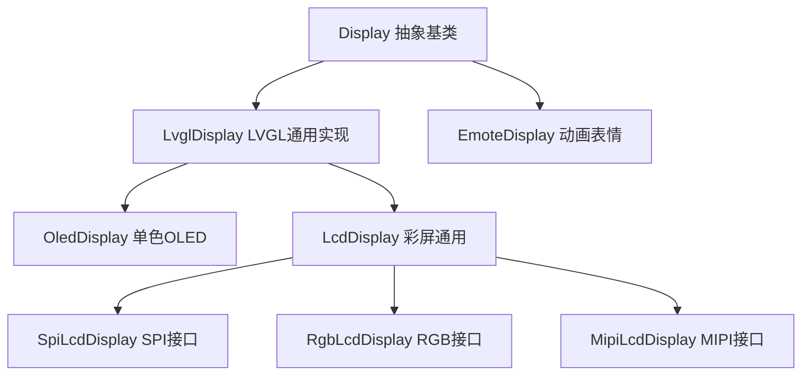
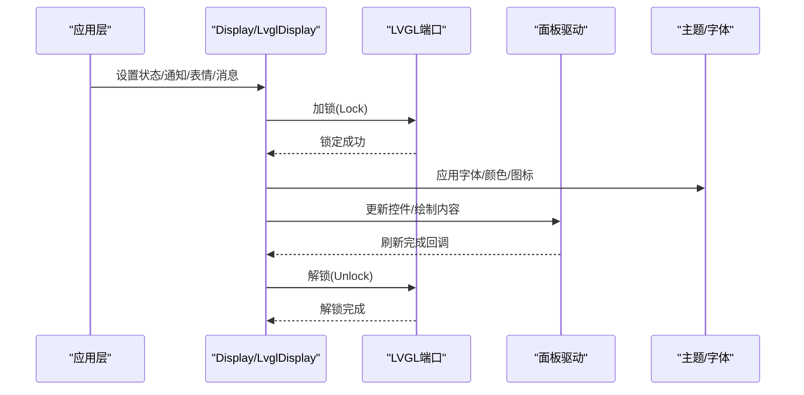
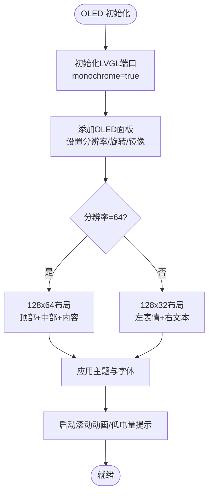
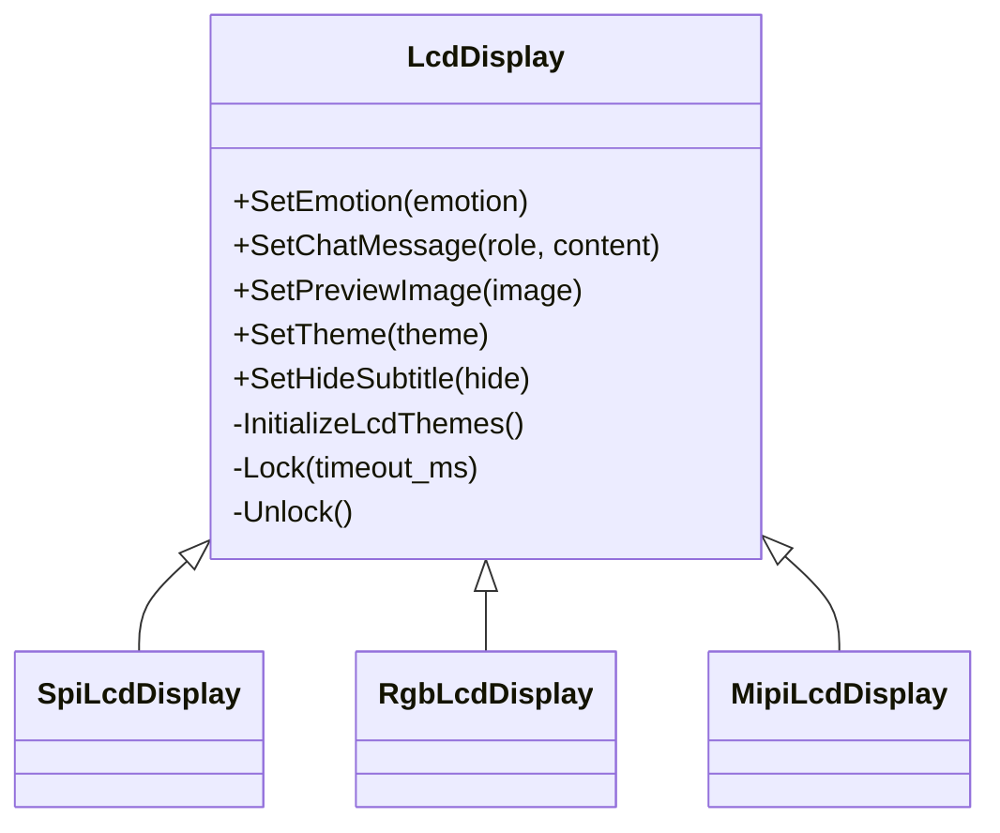
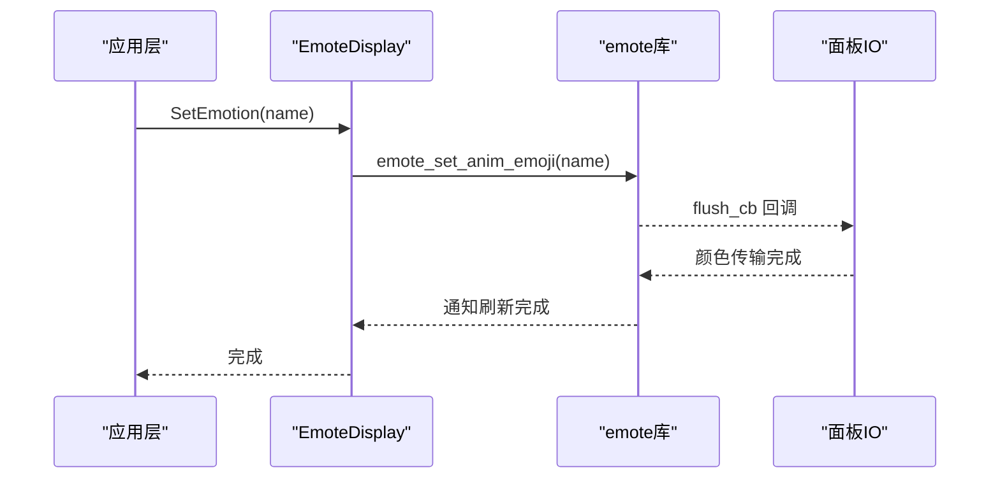
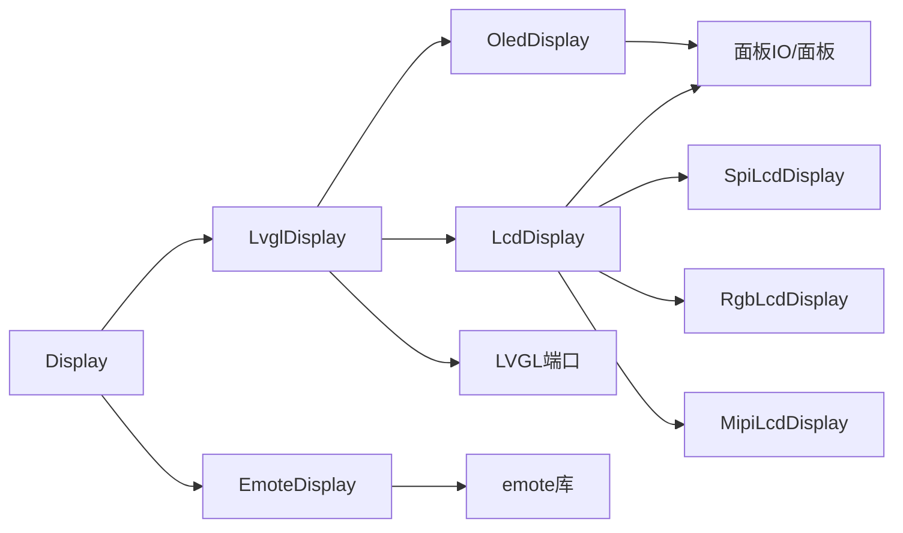

# 显示与用户界面

<cite>
**本文引用的文件**
- [main/display/display.h](file://main/display/display.h)
- [main/display/display.cc](file://main/display/display.cc)
- [main/display/lvgl_display/lvgl_display.h](file://main/display/lvgl_display/lvgl_display.h)
- [main/display/oled_display.h](file://main/display/oled_display.h)
- [main/display/oled_display.cc](file://main/display/oled_display.cc)
- [main/display/lcd_display.h](file://main/display/lcd_display.h)
- [main/display/lcd_display.cc](file://main/display/lcd_display.cc)
- [main/display/emote_display.h](file://main/display/emote_display.h)
- [main/display/emote_display.cc](file://main/display/emote_display.cc)
</cite>

## 目录
1. [简介](#简介)
2. [项目结构](#项目结构)
3. [核心组件](#核心组件)
4. [架构总览](#架构总览)
5. [详细组件分析](#详细组件分析)
6. [依赖关系分析](#依赖关系分析)
7. [性能考虑](#性能考虑)
8. [故障排除指南](#故障排除指南)
9. [结论](#结论)
10. [附录](#附录)

## 简介
本文件面向UI开发者与用户体验设计师，系统性梳理 XiaoZhi ESP32 项目的显示与用户界面体系，涵盖以下重点：
- 显示驱动架构：LVGL 图形库集成、OLED 显示、LCD 显示（SPI/RGB/MIPI）及 Emoji 动画显示系统
- Emoji 显示系统：在有限硬件资源下通过 GIF 动图与图标字体实现丰富表情展示
- 字体系统：多语言字体支持、内置字体与图标字体加载、渲染优化
- 布局与交互：菜单系统、状态栏、通知、聊天消息气泡、滚动与动画效果
- 显示配置：分辨率、色彩模式、旋转镜像、亮度与主题切换
- 性能优化：内存管理、图像缓存、双缓冲与刷新策略
- 故障排除与调试：常见问题定位与日志输出建议

## 项目结构
显示子系统位于 main/display 目录，采用“抽象基类 + 多种具体实现”的分层设计：
- 抽象层：Display（统一接口）、LvglDisplay（LVGL通用实现）
- 设备层：OledDisplay（单色OLED）、LcdDisplay 及其派生（SpiLcdDisplay、RgbLcdDisplay、MipiLcdDisplay）
- 表情层：EmoteDisplay（基于 emote 库的动画表情）

图表来源
- [main/display/display.h](file://main/display/display.h#L28-L61)
- [main/display/lvgl_display/lvgl_display.h](file://main/display/lvgl_display/lvgl_display.h#L15-L50)
- [main/display/oled_display.h](file://main/display/oled_display.h#L10-L39)
- [main/display/lcd_display.h](file://main/display/lcd_display.h#L17-L83)
- [main/display/emote_display.h](file://main/display/emote_display.h#L12-L40)

章节来源
- [main/display/display.h](file://main/display/display.h#L1-L88)
- [main/display/display.cc](file://main/display/display.cc#L1-L61)
- [main/display/lvgl_display/lvgl_display.h](file://main/display/lvgl_display/lvgl_display.h#L1-L54)
- [main/display/oled_display.h](file://main/display/oled_display.h#L1-L42)
- [main/display/lcd_display.h](file://main/display/lcd_display.h#L1-L86)
- [main/display/emote_display.h](file://main/display/emote_display.h#L1-L43)

## 核心组件
- Display 抽象基类：定义统一接口（状态、通知、表情、聊天、主题、省电模式等），并提供锁机制与默认空实现，便于无显示设备场景使用 NoDisplay。
- LvglDisplay：继承自 Display，封装 LVGL 初始化、端口配置、状态栏控件、PM 锁与快照导出等通用能力。
- OledDisplay：基于 LVGL 的单色OLED适配，支持 128x64/128x32 两种布局，使用图标字体渲染表情与状态。
- LcdDisplay 及派生：支持 SPI、RGB、MIPI 接口的彩色LCD，提供聊天消息气泡、预览图、GIF 动图、主题切换与滚动文本等。
- EmoteDisplay：基于 emote 库的动画表情显示，支持事件消息、对话框插入与全量刷新。

章节来源
- [main/display/display.h](file://main/display/display.h#L28-L61)
- [main/display/display.cc](file://main/display/display.cc#L17-L61)
- [main/display/lvgl_display/lvgl_display.h](file://main/display/lvgl_display/lvgl_display.h#L15-L50)
- [main/display/oled_display.h](file://main/display/oled_display.h#L10-L39)
- [main/display/lcd_display.h](file://main/display/lcd_display.h#L17-L59)
- [main/display/emote_display.h](file://main/display/emote_display.h#L12-L40)

## 架构总览
显示系统以 Display 为入口，LvglDisplay 统一接入 LVGL 端口，针对不同面板类型（OLED/LCD/Emote）进行差异化实现；OLED/LCD 使用图标字体与图片资源，EmoteDisplay 使用 emote 库与面板 IO 回调完成像素级绘制。

图表来源
- [main/display/display.h](file://main/display/display.h#L58-L60)
- [main/display/lvgl_display/lvgl_display.h](file://main/display/lvgl_display/lvgl_display.h#L28-L49)
- [main/display/oled_display.cc](file://main/display/oled_display.cc#L138-L144)
- [main/display/lcd_display.cc](file://main/display/lcd_display.cc#L345-L351)

## 详细组件分析

### Display 抽象层
- 职责：统一对外接口，屏蔽具体面板差异；提供 DisplayLockGuard 保证 LVGL 操作线程安全；记录分辨率与 SetupUI 调用状态。
- 关键点：默认实现仅打印日志，实际由子类覆盖；NoDisplay 提供空实现用于无显示场景。

章节来源
- [main/display/display.h](file://main/display/display.h#L28-L61)
- [main/display/display.cc](file://main/display/display.cc#L23-L60)

### LvglDisplay 抽象层
- 职责：封装 LVGL 初始化、端口配置、状态栏控件（网络/静音/电池/通知/状态）、PM 锁、截图导出等。
- 关键点：继承 Display 并暴露 Lock/Unlock 虚函数，确保 UI 更新时持有 LVGL 锁；提供 SnapshotToJpeg 便于调试抓图。

章节来源
- [main/display/lvgl_display/lvgl_display.h](file://main/display/lvgl_display/lvgl_display.h#L15-L50)

### OLED 显示（OledDisplay）
- 面板特性：单色OLED，支持 128x64 与 128x32 两种布局；使用 LVGL 端口初始化，monochrome=true。
- 布局与控件：
  - 顶部状态栏：网络、静音、电量图标
  - 中部状态标签：居中滚动文本
  - 内容区：左侧表情图标（图标字体），右侧聊天文本（滚动）
- 主题与字体：注册“dark”主题，绑定内置文本/图标/大号图标字体；根据屏幕高度选择布局。
- 动画：聊天文本支持循环滚动动画；低电量弹窗可隐藏/显示。

图表来源
- [main/display/oled_display.cc](file://main/display/oled_display.cc#L40-L81)
- [main/display/oled_display.cc](file://main/display/oled_display.cc#L168-L298)
- [main/display/oled_display.cc](file://main/display/oled_display.cc#L300-L385)

章节来源
- [main/display/oled_display.h](file://main/display/oled_display.h#L10-L39)
- [main/display/oled_display.cc](file://main/display/oled_display.cc#L20-L81)
- [main/display/oled_display.cc](file://main/display/oled_display.cc#L83-L144)
- [main/display/oled_display.cc](file://main/display/oled_display.cc#L168-L385)

### LCD 显示（LcdDisplay 及派生）
- 面板特性：支持 SPI、RGB、MIPI 接口；默认 monochrome=false；提供多种旋转/镜像/偏移配置。
- 布局与控件：
  - 顶部状态栏：网络/静音/电量图标
  - 中部状态标签：居中滚动文本
  - 底部消息条：单行横向滚动文本
  - 中心区域：AI 徽标或预览图/GIF 动图
- 主题与字体：注册“light/dark”主题，支持背景图/颜色/字体/边框/低电量颜色；根据字体行高动态调整图标大小。
- 聊天消息：按角色（user/assistant/system）生成气泡，支持最大消息数限制与自动滚动；支持预览图插入与定时回收。
- GIF 动图：当表情为 GIF 时，创建 LvglGif 控制器，帧回调更新图像源；停止/重置时释放资源。
- 隐藏字幕：支持通过 SetHideSubtitle 控制底部消息条可见性。

图表来源
- [main/display/lcd_display.h](file://main/display/lcd_display.h#L17-L83)
- [main/display/lcd_display.cc](file://main/display/lcd_display.cc#L25-L63)
- [main/display/lcd_display.cc](file://main/display/lcd_display.cc#L92-L172)
- [main/display/lcd_display.cc](file://main/display/lcd_display.cc#L175-L233)
- [main/display/lcd_display.cc](file://main/display/lcd_display.cc#L235-L284)

章节来源
- [main/display/lcd_display.h](file://main/display/lcd_display.h#L17-L83)
- [main/display/lcd_display.cc](file://main/display/lcd_display.cc#L65-L90)
- [main/display/lcd_display.cc](file://main/display/lcd_display.cc#L92-L172)
- [main/display/lcd_display.cc](file://main/display/lcd_display.cc#L175-L233)
- [main/display/lcd_display.cc](file://main/display/lcd_display.cc#L235-L284)
- [main/display/lcd_display.cc](file://main/display/lcd_display.cc#L353-L498)
- [main/display/lcd_display.cc](file://main/display/lcd_display.cc#L803-L969)
- [main/display/lcd_display.cc](file://main/display/lcd_display.cc#L1007-L1103)
- [main/display/lcd_display.cc](file://main/display/lcd_display.cc#L1105-L1245)
- [main/display/lcd_display.cc](file://main/display/lcd_display.cc#L1247-L1259)

### Emoji 动画显示（EmoteDisplay）
- 集成方式：通过 emote 库初始化，注册面板 IO 事件回调；使用 flush 回调将像素数据写入面板。
- 表情控制：
  - SetEmotion：设置动画表情（如“listen/speak/idle/set”等）
  - SetChatMessage：系统消息与说话消息区分处理
  - InsertAnimDialog/StopAnimDialog：插入/停止对话框动画
  - RefreshAll：触发全量刷新
- 限制：不支持预览图；在无 emote 句柄时不做任何操作。

图表来源
- [main/display/emote_display.cc](file://main/display/emote_display.cc#L51-L68)
- [main/display/emote_display.cc](file://main/display/emote_display.cc#L74-L112)
- [main/display/emote_display.cc](file://main/display/emote_display.cc#L137-L143)
- [main/display/emote_display.cc](file://main/display/emote_display.cc#L145-L160)
- [main/display/emote_display.cc](file://main/display/emote_display.cc#L178-L184)

章节来源
- [main/display/emote_display.h](file://main/display/emote_display.h#L12-L40)
- [main/display/emote_display.cc](file://main/display/emote_display.cc#L74-L112)
- [main/display/emote_display.cc](file://main/display/emote_display.cc#L137-L184)
- [main/display/emote_display.cc](file://main/display/emote_display.cc#L224-L248)

## 依赖关系分析
- 组件耦合：
  - Display 与 LvglDisplay 为继承关系；OledDisplay/LcdDisplay/EmoteDisplay 分别独立实现。
  - LvglDisplay 依赖 LVGL 端口与面板驱动；OledDisplay/LcdDisplay 还依赖图标字体与主题管理。
  - EmoteDisplay 依赖 emote 库与面板 IO 回调。
- 外部依赖：
  - LVGL 端口（esp_lvgl_port）、面板驱动（esp_lcd_panel_*）、PSRAM 缓存（esp_psram）。
- 潜在风险：
  - UI 更新需持有 LVGL 锁，避免并发访问导致崩溃。
  - 预览图/GIF 需正确释放资源，防止内存泄漏。

图表来源
- [main/display/display.h](file://main/display/display.h#L28-L61)
- [main/display/lvgl_display/lvgl_display.h](file://main/display/lvgl_display/lvgl_display.h#L15-L50)
- [main/display/oled_display.h](file://main/display/oled_display.h#L10-L39)
- [main/display/lcd_display.h](file://main/display/lcd_display.h#L17-L83)
- [main/display/emote_display.h](file://main/display/emote_display.h#L12-L40)

章节来源
- [main/display/display.h](file://main/display/display.h#L28-L61)
- [main/display/lvgl_display/lvgl_display.h](file://main/display/lvgl_display/lvgl_display.h#L15-L50)
- [main/display/oled_display.h](file://main/display/oled_display.h#L10-L39)
- [main/display/lcd_display.h](file://main/display/lcd_display.h#L17-L83)
- [main/display/emote_display.h](file://main/display/emote_display.h#L12-L40)

## 性能考虑
- 内存与缓存
  - LVGL 图像缓存：在 PSRAM ≥2MB 时启用缓存，提升 PNG/GIF 加载性能（SPI/LCD 构造时检测）。
  - 双缓冲与 DMA：OLED/LCD 在配置中开启 buff_dma/sw_rotate/full_refresh 等标志，减少 CPU 占用。
- 刷新与动画
  - 滚动文本使用 LVGL 动画，合理设置延迟与持续时间，避免卡顿。
  - GIF 动图按帧回调更新，及时 Stop/Reset 避免资源泄漏。
- 资源管理
  - 预览图定时器：设置一次性定时器，超时后自动回收资源。
  - 主题切换：批量更新控件样式，避免逐项修改带来的多次刷新。
- 电源与省电
  - 提供 SetPowerSaveMode 接口，可在子类中结合面板驱动实现背光/休眠策略。

章节来源
- [main/display/lcd_display.cc](file://main/display/lcd_display.cc#L116-L126)
- [main/display/lcd_display.cc](file://main/display/lcd_display.cc#L79-L89)
- [main/display/lcd_display.cc](file://main/display/lcd_display.cc#L286-L343)
- [main/display/lcd_display.cc](file://main/display/lcd_display.cc#L1062-L1087)
- [main/display/display.cc](file://main/display/display.cc#L58-L60)

## 故障排除指南
- UI 不更新或闪烁
  - 确认已调用 SetupUI 且未重复调用；检查 DisplayLockGuard 是否正确包裹 UI 更新代码。
  - 检查 LVGL 端口初始化是否成功，display_ 是否非空。
- 文本不显示或错位
  - 确认字体已正确设置；在 OLED/LCD 中检查图标字体与文本字体是否匹配。
  - 对于滚动文本，确认 long_mode 与宽度约束设置合理。
- 表情不显示或不播放
  - EmoteDisplay：检查 emote_handle_ 是否初始化成功；确认表情名称有效。
  - LCD GIF：检查 LvglGif 是否加载成功；确认帧回调是否被调用。
- 预览图不消失
  - 检查一次性定时器是否启动；确认 SetPreviewImage(nullptr) 被调用。
- 低电量提示未出现
  - 检查低电量弹窗对象是否创建；确认状态栏更新逻辑是否触发显示。

章节来源
- [main/display/oled_display.cc](file://main/display/oled_display.cc#L138-L144)
- [main/display/lcd_display.cc](file://main/display/lcd_display.cc#L345-L351)
- [main/display/emote_display.cc](file://main/display/emote_display.cc#L118-L135)
- [main/display/lcd_display.cc](file://main/display/lcd_display.cc#L1062-L1087)
- [main/display/lcd_display.cc](file://main/display/lcd_display.cc#L971-L1005)

## 结论
XiaoZhi ESP32 的显示系统以 Display 为抽象入口，通过 LvglDisplay 统一接入 LVGL，分别针对 OLED 与 LCD 实现了高可用的 UI 层，并通过 EmoteDisplay 支持丰富的动画表情。系统在资源受限环境下，通过图标字体、GIF 动图与合理的内存/刷新策略，实现了良好的用户体验。建议在新设备接入时遵循现有抽象与锁机制，确保线程安全与性能稳定。

## 附录

### 显示配置指南
- 分辨率与旋转
  - OLED：通过高度判断 128x64/128x32 布局；旋转/镜像由 LVGL 旋转配置控制。
  - LCD：通过构造参数传入 offset/mirror/swap_xy，面板驱动据此设置。
- 色彩模式
  - OLED：monochrome=true；LCD：monochrome=false，支持 RGB565。
- 主题与字体
  - 注册 light/dark 主题；根据字体行高动态调整图标字号。
- 预览图与 GIF
  - LCD 支持预览图插入与定时回收；GIF 动图按帧更新，注意 Stop/Reset。
- 省电模式
  - 通过 SetPowerSaveMode 接口在子类中实现背光/休眠控制。

章节来源
- [main/display/oled_display.cc](file://main/display/oled_display.cc#L49-L71)
- [main/display/lcd_display.cc](file://main/display/lcd_display.cc#L137-L161)
- [main/display/lcd_display.cc](file://main/display/lcd_display.cc#L197-L224)
- [main/display/lcd_display.cc](file://main/display/lcd_display.cc#L248-L275)
- [main/display/lcd_display.cc](file://main/display/lcd_display.cc#L1105-L1126)