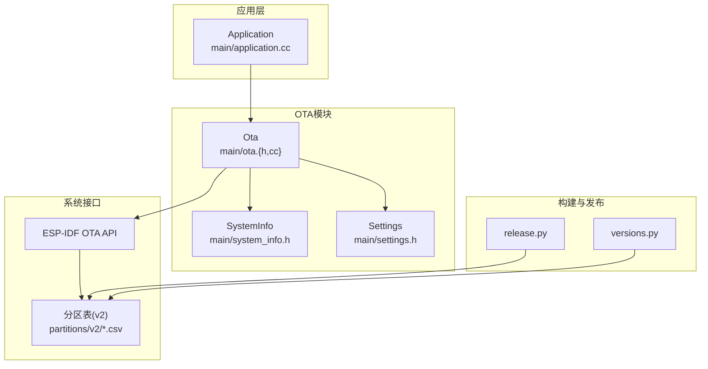
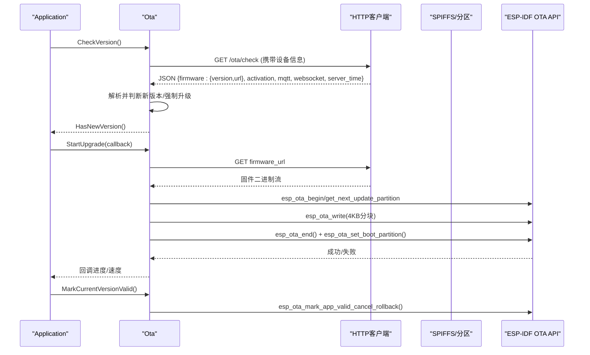
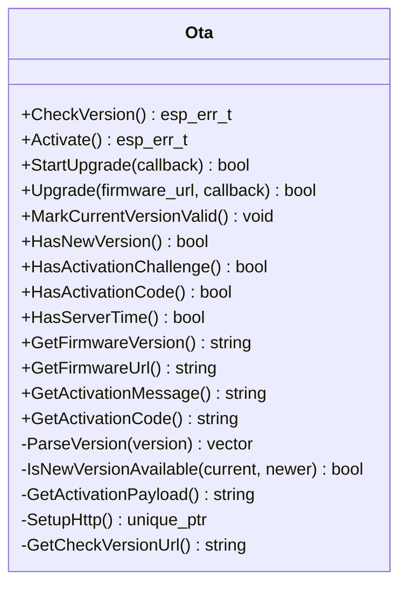
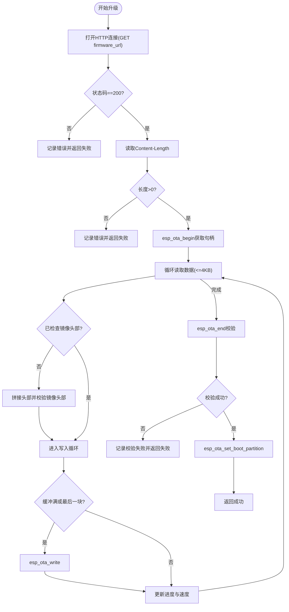
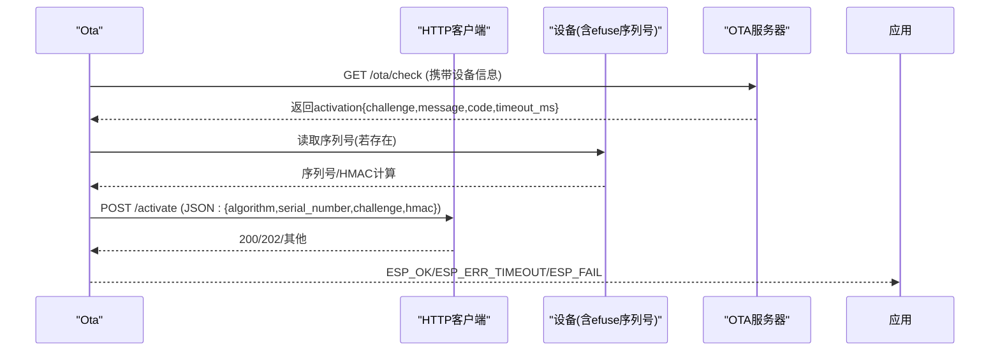
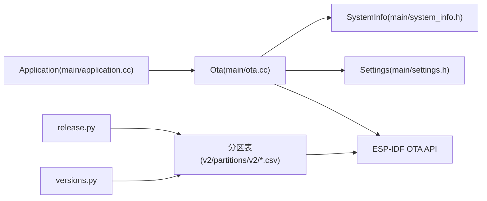

# OTA固件升级

<cite>
**本文档引用的文件**
- [main/ota.h](file://main/ota.h)
- [main/ota.cc](file://main/ota.cc)
- [main/application.cc](file://main/application.cc)
- [main/system_info.h](file://main/system_info.h)
- [main/settings.h](file://main/settings.h)
- [partitions/v2/README.md](file://partitions/v2/README.md)
- [partitions/v2/16m.csv](file://partitions/v2/16m.csv)
- [partitions/v2/8m.csv](file://partitions/v2/8m.csv)
- [scripts/release.py](file://scripts/release.py)
- [scripts/versions.py](file://scripts/versions.py)
- [README.md](file://README.md)
</cite>

## 目录
1. [简介](#简介)
2. [项目结构](#项目结构)
3. [核心组件](#核心组件)
4. [架构总览](#架构总览)
5. [详细组件分析](#详细组件分析)
6. [依赖关系分析](#依赖关系分析)
7. [性能考虑](#性能考虑)
8. [故障排除指南](#故障排除指南)
9. [结论](#结论)
10. [附录](#附录)

## 简介
本文件面向固件开发者与运维人员，系统化阐述 XiaoZhi ESP32 项目的 OTA 固件升级架构与实现细节。内容涵盖固件分区管理、升级包生成、安全验证、升级流程（检查更新、下载固件、安装升级、回滚恢复）、激活码系统、错误处理与异常恢复、配置指南、调试与监控方法，以及故障排除与最佳实践。

## 项目结构
XiaoZhi ESP32 将 OTA 功能封装在独立模块中，结合系统信息、设置管理与应用主循环协同工作。关键目录与文件如下：
- 主模块：main/ota.{h,cc} 实现版本检查、激活、升级与回滚标记
- 应用入口：main/application.cc 协调升级流程与协议初始化
- 系统信息：main/system_info.h 提供设备标识与用户代理
- 分区表：partitions/v2/*.csv 定义 v2 版本分区布局，含 assets 分区
- 构建脚本：scripts/release.py 与 scripts/versions.py 支持固件打包与版本解析

**图表来源**
- [main/application.cc](file://main/application.cc#L423-L497)
- [main/ota.cc](file://main/ota.cc#L267-L387)
- [partitions/v2/16m.csv](file://partitions/v2/16m.csv#L1-L9)
- [partitions/v2/8m.csv](file://partitions/v2/8m.csv#L1-L9)
- [scripts/release.py](file://scripts/release.py#L183-L261)
- [scripts/versions.py](file://scripts/versions.py#L81-L115)

**章节来源**
- [README.md](file://README.md#L15-L22)
- [partitions/v2/README.md](file://partitions/v2/README.md#L1-L107)

## 核心组件
- Ota 类：负责版本检查、激活、升级、进度回调、回滚标记与版本比较
- Application：在应用主循环中触发版本检查与升级流程，处理激活码展示与超时重试
- SystemInfo：提供设备 MAC 地址、用户代理、芯片型号等信息，用于 HTTP 请求头
- Settings：基于 NVS 的键值存储，用于持久化配置（如 MQTT/WebSocket 参数）
- 分区表 v2：引入 assets 分区，优化应用分区大小，支持动态内容更新

**章节来源**
- [main/ota.h](file://main/ota.h#L10-L56)
- [main/ota.cc](file://main/ota.cc#L28-L41)
- [main/application.cc](file://main/application.cc#L423-L497)
- [main/system_info.h](file://main/system_info.h#L9-L21)
- [main/settings.h](file://main/settings.h#L7-L26)
- [partitions/v2/README.md](file://partitions/v2/README.md#L1-L107)

## 架构总览
OTA 升级采用“检查版本 → 下载固件 → 写入分区 → 校验与设置引导分区 → 标记有效版本”的标准流程；同时支持激活码系统与服务端时间同步，增强安全性与合规性。

**图表来源**
- [main/application.cc](file://main/application.cc#L435-L447)
- [main/ota.cc](file://main/ota.cc#L77-L245)
- [main/ota.cc](file://main/ota.cc#L267-L387)
- [main/ota.cc](file://main/ota.cc#L247-L265)

## 详细组件分析

### Ota 类设计与职责
- 版本检查：构造系统信息 JSON，向 OTA 服务器发起请求，解析 firmware、activation、mqtt、websocket、server_time 字段，决定是否升级与是否强制升级
- 激活系统：当存在激活挑战时，按设备序列号与 HMAC 计算签名，提交激活请求；支持超时与重试
- 升级流程：选择下一个可用更新分区，分块下载固件并写入，完成后校验并设置引导分区
- 回滚标记：若当前运行镜像处于待验证状态，则标记为有效版本，取消回滚
- 版本比较：将点分版本号解析为整型数组，逐段比较以确定新旧版本关系

**图表来源**
- [main/ota.h](file://main/ota.h#L10-L56)
- [main/ota.cc](file://main/ota.cc#L28-L41)
- [main/ota.cc](file://main/ota.cc#L394-L419)
- [main/ota.cc](file://main/ota.cc#L421-L456)
- [main/ota.cc](file://main/ota.cc#L55-L72)

**章节来源**
- [main/ota.h](file://main/ota.h#L10-L56)
- [main/ota.cc](file://main/ota.cc#L77-L245)
- [main/ota.cc](file://main/ota.cc#L247-L265)
- [main/ota.cc](file://main/ota.cc#L267-L387)
- [main/ota.cc](file://main/ota.cc#L394-L419)
- [main/ota.cc](file://main/ota.cc#L421-L456)

### 升级流程实现细节
- 分区选择与写入：通过 ESP-IDF 获取下一个更新分区，使用顺序写入模式，4KB 分块写入，边写边校验镜像头部
- 校验与引导：结束写入后进行镜像校验，失败则中止；成功后设置引导分区，重启后生效
- 进度与速度：每秒计算一次速率与累计进度，回调上层显示
- 异常处理：网络错误、HTTP 状态码非 200、内容长度为 0、内存分配失败、写入失败、校验失败均返回失败并记录日志

**图表来源**
- [main/ota.cc](file://main/ota.cc#L267-L387)

**章节来源**
- [main/ota.cc](file://main/ota.cc#L267-L387)

### 激活码系统与安全验证
- 激活挑战：服务端下发 challenge 与可选 message、code、timeout_ms；设备端根据序列号与 HMAC-SHA256 计算签名
- 序列号来源：从 efuse 用户数据区读取 32 字节序列号（若存在），否则使用简化激活流程
- 激活请求：向 /activate 发送 JSON，包含算法、序列号、挑战与签名；支持 202（等待）与 200（成功）两种响应
- 超时与重试：应用层在激活失败时进行指数退避重试，避免频繁请求

**图表来源**
- [main/ota.cc](file://main/ota.cc#L458-L492)
- [main/ota.cc](file://main/ota.cc#L421-L456)
- [main/ota.cc](file://main/ota.cc#L28-L41)
- [main/application.cc](file://main/application.cc#L449-L470)

**章节来源**
- [main/ota.cc](file://main/ota.cc#L458-L492)
- [main/ota.cc](file://main/ota.cc#L421-L456)
- [main/ota.cc](file://main/ota.cc#L28-L41)
- [main/application.cc](file://main/application.cc#L449-L470)

### 回滚恢复机制
- 待验证状态：若当前运行镜像处于待验证状态，升级成功后调用标记为有效版本，取消回滚
- 失败回滚：升级过程中任何一步失败（网络、写入、校验）均会中止并保留原镜像，下次启动仍可正常运行

**章节来源**
- [main/ota.cc](file://main/ota.cc#L247-L265)

### 固件分区管理（v2）
- 新增 assets 分区：用于存放唤醒词模型、主题文件、动态内容等，支持 OTA 更新
- 应用分区优化：减少应用分区大小，增大 assets 分区，适配不同闪存容量（8M/16M/32M）
- 迁移注意事项：v1 与 v2 分区不兼容，需手动刷写 v2 并重新下载资产

**章节来源**
- [partitions/v2/README.md](file://partitions/v2/README.md#L1-L107)
- [partitions/v2/16m.csv](file://partitions/v2/16m.csv#L1-L9)
- [partitions/v2/8m.csv](file://partitions/v2/8m.csv#L1-L9)
- [README.md](file://README.md#L17-L21)

### 升级包生成与版本管理
- 构建与打包：release.py 读取 CMakeLists 中的 BOARD_TYPE 映射，合并二进制并打包为 ZIP
- 版本提取：versions.py 从 merged-binary.bin 中解析应用分区信息与芯片信息
- 版本来源：CMakeLists 中的 PROJECT_VER 作为版本号

**章节来源**
- [scripts/release.py](file://scripts/release.py#L183-L261)
- [scripts/versions.py](file://scripts/versions.py#L81-L115)

## 依赖关系分析
- Ota 依赖 Board/Network 提供 HTTP 客户端，依赖 SystemInfo 提供设备标识，依赖 Settings 存储 MQTT/WebSocket 配置
- 升级流程依赖 ESP-IDF OTA API 与分区表定义
- 应用层在主循环中协调版本检查、升级与协议初始化

**图表来源**
- [main/ota.cc](file://main/ota.cc#L55-L72)
- [main/application.cc](file://main/application.cc#L473-L497)
- [partitions/v2/16m.csv](file://partitions/v2/16m.csv#L1-L9)
- [scripts/release.py](file://scripts/release.py#L183-L261)
- [scripts/versions.py](file://scripts/versions.py#L81-L115)

**章节来源**
- [main/ota.cc](file://main/ota.cc#L55-L72)
- [main/application.cc](file://main/application.cc#L473-L497)

## 性能考虑
- 分块写入：4KB 分块降低内存占用，提升稳定性
- 速率统计：每秒计算一次速率，兼顾实时性与开销
- 分区布局：v2 将应用分区缩小以增大 assets 分区，平衡运行时资源与动态内容需求
- 网络重试：激活阶段采用指数退避，避免频繁重试导致网络拥塞

[本节为通用指导，无需特定文件分析]

## 故障排除指南
常见问题与处理策略：
- 网络连接失败
  - 现象：HTTP 打开失败或状态码非 200
  - 处理：检查 OTA 服务器地址、网络连通性、DNS 解析；确认请求头包含正确的设备标识
  - 参考路径：[main/ota.cc](file://main/ota.cc#L282-L290)
- 内容长度为 0
  - 现象：无法获取固件长度
  - 处理：检查服务器响应头 Content-Length；确认固件 URL 正确
  - 参考路径：[main/ota.cc](file://main/ota.cc#L292-L296)
- 内存分配失败
  - 现象：无法分配 4KB 缓冲
  - 处理：检查可用堆内存；优化任务优先级与内存碎片
  - 参考路径：[main/ota.cc](file://main/ota.cc#L299-L303)
- 写入失败
  - 现象：esp_ota_write 返回错误
  - 处理：检查分区剩余空间、写入权限；确认网络稳定
  - 参考路径：[main/ota.cc](file://main/ota.cc#L351-L357)
- 校验失败
  - 现象：esp_ota_end 返回校验失败
  - 处理：重新下载固件；检查固件完整性与签名；确认服务器未篡改
  - 参考路径：[main/ota.cc](file://main/ota.cc#L369-L377)
- 激活超时
  - 现象：激活返回 202
  - 处理：应用层进行指数退避重试；检查服务器处理延迟
  - 参考路径：[main/ota.cc](file://main/ota.cc#L481-L484), [main/application.cc](file://main/application.cc#L456-L469)
- 分区不兼容
  - 现象：v1 与 v2 分区不兼容
  - 处理：手动刷写 v2 分区表；重新下载资产
  - 参考路径：[README.md](file://README.md#L17-L21), [partitions/v2/README.md](file://partitions/v2/README.md#L94-L107)

**章节来源**
- [main/ota.cc](file://main/ota.cc#L282-L387)
- [main/application.cc](file://main/application.cc#L456-L469)
- [README.md](file://README.md#L17-L21)
- [partitions/v2/README.md](file://partitions/v2/README.md#L94-L107)

## 结论
XiaoZhi ESP32 的 OTA 升级体系以清晰的模块划分与稳健的错误处理为核心，结合 v2 分区布局与激活码系统，在保证安全性的同时提升了动态内容的灵活性。通过标准化的升级流程与完善的回滚机制，能够有效降低升级风险，保障设备稳定运行。

[本节为总结性内容，无需特定文件分析]

## 附录

### 配置指南
- 升级服务器设置
  - OTA 服务器地址：通过设置项读取，若未设置则使用编译期默认值
  - 参考路径：[main/ota.cc](file://main/ota.cc#L46-L53)
- 版本管理
  - 版本号来源于工程版本配置，升级包由 release.py 打包
  - 参考路径：[scripts/release.py](file://scripts/release.py#L32-L38), [scripts/release.py](file://scripts/release.py#L183-L261)
- 回滚策略
  - 升级成功后自动标记当前版本为有效；失败则保持原版本不变
  - 参考路径：[main/ota.cc](file://main/ota.cc#L247-L265)
- 激活码与安全
  - 若设备具备序列号，使用 HMAC-SHA256 进行签名；否则使用简化流程
  - 参考路径：[main/ota.cc](file://main/ota.cc#L421-L456), [main/ota.cc](file://main/ota.cc#L28-L41)
- MQTT/WebSocket 配置
  - 服务端下发的配置将写入 Settings，应用启动时根据配置选择协议
  - 参考路径：[main/ota.cc](file://main/ota.cc#L146-L186), [main/application.cc](file://main/application.cc#L480-L487)

### 调试与监控
- 日志输出：OTA 模块广泛使用 ESP_LOGI/ESP_LOGE 记录进度、速率与错误
- 进度回调：升级过程中通过回调函数上报进度百分比与速度
- 系统信息：通过 SystemInfo 获取设备标识与用户代理，便于服务端定位问题
- 参考路径：
  - [main/ota.cc](file://main/ota.cc#L320-L328)
  - [main/system_info.h](file://main/system_info.h#L9-L21)

### 最佳实践
- 在生产环境启用激活码系统，防止未授权升级
- 升级前检查网络稳定性与存储空间，避免中途失败
- 使用 v2 分区布局，充分利用 assets 分区承载动态内容
- 对固件包进行完整性校验，确保来源可信
- 在应用层实现合理的重试与超时策略，提升用户体验

[本节为通用指导，无需特定文件分析]