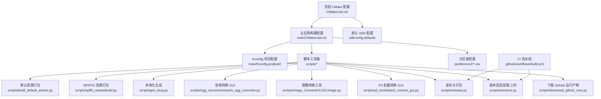
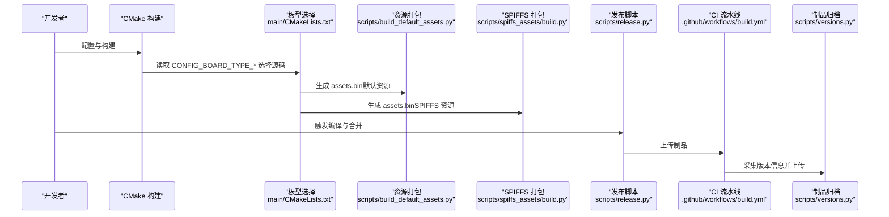
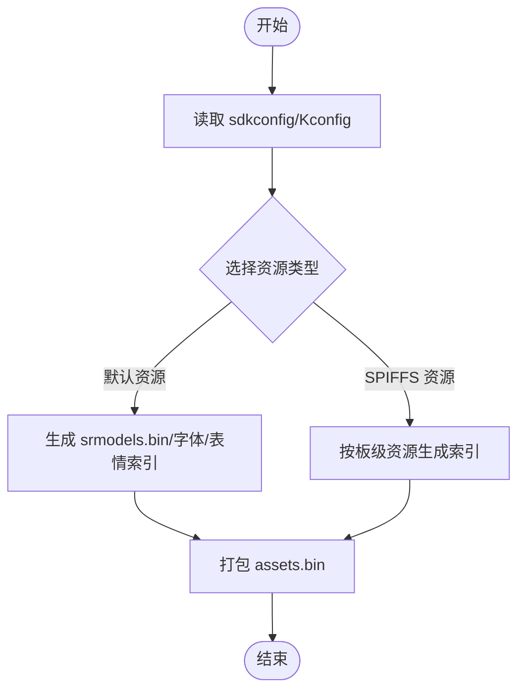
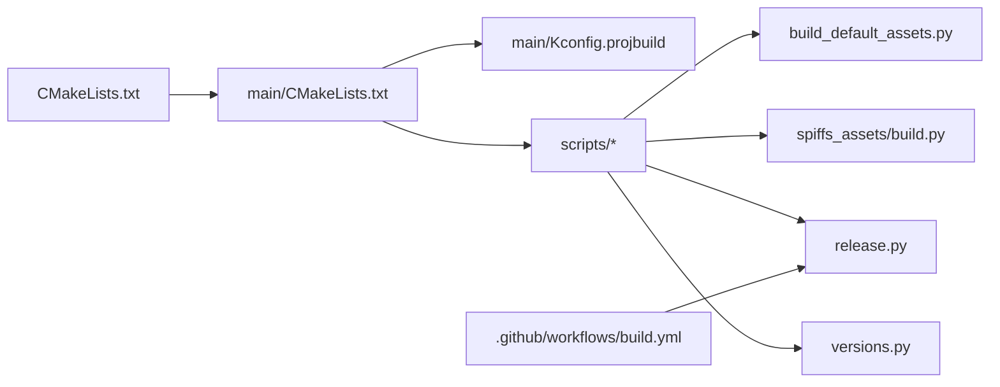

# 开发工具

<cite>
**本文引用的文件**
- [CMakeLists.txt](file://CMakeLists.txt)
- [main/CMakeLists.txt](file://main/CMakeLists.txt)
- [main/Kconfig.projbuild](file://main/Kconfig.projbuild)
- [sdkconfig.defaults](file://sdkconfig.defaults)
- [scripts/build_default_assets.py](file://scripts/build_default_assets.py)
- [scripts/spiffs_assets/build.py](file://scripts/spiffs_assets/build.py)
- [scripts/gen_lang.py](file://scripts/gen_lang.py)
- [scripts/ogg_converter/xiaozhi_ogg_converter.py](file://scripts/ogg_converter/xiaozhi_ogg_converter.py)
- [scripts/Image_Converter/LVGLImage.py](file://scripts/Image_Converter/LVGLImage.py)
- [scripts/p3_tools/batch_convert_gui.py](file://scripts/p3_tools/batch_convert_gui.py)
- [scripts/release.py](file://scripts/release.py)
- [scripts/versions.py](file://scripts/versions.py)
- [scripts/download_github_runs.py](file://scripts/download_github_runs.py)
- [.github/workflows/build.yml](file://.github/workflows/build.yml)
- [partitions/v2/README.md](file://partitions/v2/README.md)
- [docs/code_style.md](file://docs/code_style.md)
- [main/application.h](file://main/application.h)
</cite>

## 目录
1. [简介](#简介)
2. [项目结构](#项目结构)
3. [核心组件](#核心组件)
4. [架构总览](#架构总览)
5. [组件详解](#组件详解)
6. [依赖关系分析](#依赖关系分析)
7. [性能与优化](#性能与优化)
8. [故障排查指南](#故障排查指南)
9. [结论](#结论)
10. [附录](#附录)

## 简介
本文件为 XiaoZhi ESP32 项目的“开发工具”文档，聚焦于构建系统、分区表与固件打包、开发脚本工具链、开发环境配置、代码风格与规范、调试与测试工具、持续集成与自动化部署，以及开发流程最佳实践。目标是帮助开发者快速理解并高效使用项目提供的工具链，完成从源码到固件的全流程开发。

## 项目结构
项目采用 ESP-IDF 构建体系，顶层通过 CMake 驱动，主应用位于 main 目录，脚本工具集中在 scripts 目录，分区表位于 partitions 目录，CI 配置于 .github/workflows。

图表来源
- [CMakeLists.txt](file://CMakeLists.txt#L1-L14)
- [main/CMakeLists.txt](file://main/CMakeLists.txt#L1-L1098)
- [main/Kconfig.projbuild](file://main/Kconfig.projbuild#L1-L865)
- [sdkconfig.defaults](file://sdkconfig.defaults#L1-L79)
- [scripts/release.py](file://scripts/release.py#L1-L324)
- [.github/workflows/build.yml](file://.github/workflows/build.yml#L1-L112)

章节来源
- [CMakeLists.txt](file://CMakeLists.txt#L1-L14)
- [main/CMakeLists.txt](file://main/CMakeLists.txt#L1-L1098)
- [main/Kconfig.projbuild](file://main/Kconfig.projbuild#L1-L865)
- [sdkconfig.defaults](file://sdkconfig.defaults#L1-L79)
- [.github/workflows/build.yml](file://.github/workflows/build.yml#L1-L112)

## 核心组件
- 构建系统与最小化构建
  - 顶层 CMake 通过 ESP-IDF 的 project.cmake 引入标准构建流程，并开启 MINIMAL_BUILD 以裁剪不必要的组件，加速构建。
- 主应用构建与板型选择
  - main/CMakeLists.txt 动态根据 CONFIG_BOARD_TYPE_* 选择对应开发板源文件与资源，实现多板适配。
- 默认资源与 SPIFFS 资源打包
  - scripts/build_default_assets.py 与 scripts/spiffs_assets/build.py 负责将字体、表情包、唤醒词模型等资源打包为 assets.bin，并生成索引与配置文件。
- 本地化与音频/图像工具
  - scripts/gen_lang.py 生成语言头文件；GUI 工具用于 OGG/P3 批量转换与图像处理。
- 发布与 CI 集成
  - scripts/release.py 统一编译、合并二进制并打包；.github/workflows/build.yml 实现按变更矩阵构建与制品上传；scripts/versions.py 与 scripts/download_github_runs.py 支持版本信息采集与制品归档。

章节来源
- [CMakeLists.txt](file://CMakeLists.txt#L1-L14)
- [main/CMakeLists.txt](file://main/CMakeLists.txt#L67-L695)
- [scripts/build_default_assets.py](file://scripts/build_default_assets.py#L1-L935)
- [scripts/spiffs_assets/build.py](file://scripts/spiffs_assets/build.py#L1-L400)
- [scripts/gen_lang.py](file://scripts/gen_lang.py#L1-L187)
- [scripts/ogg_converter/xiaozhi_ogg_converter.py](file://scripts/ogg_converter/xiaozhi_ogg_converter.py#L1-L231)
- [scripts/Image_Converter/LVGLImage.py](file://scripts/Image_Converter/LVGLImage.py#L1-L1427)
- [scripts/p3_tools/batch_convert_gui.py](file://scripts/p3_tools/batch_convert_gui.py#L1-L221)
- [scripts/release.py](file://scripts/release.py#L1-L324)
- [.github/workflows/build.yml](file://.github/workflows/build.yml#L1-L112)
- [scripts/versions.py](file://scripts/versions.py#L1-L250)
- [scripts/download_github_runs.py](file://scripts/download_github_runs.py#L1-L265)

## 架构总览
下图展示从源码到固件产物的关键流程：CMake → 板型选择与资源打包 → 合并二进制 → CI 构建与制品分发。

图表来源
- [main/CMakeLists.txt](file://main/CMakeLists.txt#L86-L695)
- [scripts/build_default_assets.py](file://scripts/build_default_assets.py#L750-L800)
- [scripts/spiffs_assets/build.py](file://scripts/spiffs_assets/build.py#L340-L397)
- [scripts/release.py](file://scripts/release.py#L183-L261)
- [.github/workflows/build.yml](file://.github/workflows/build.yml#L85-L112)
- [scripts/versions.py](file://scripts/versions.py#L223-L246)

## 组件详解

### 构建系统与最小化构建
- 顶层 CMake
  - 引入 ESP-IDF 的 project.cmake 并设置 MINIMAL_BUILD，减少构建时间与产物体积。
- 主应用 CMake
  - 通过 CONFIG_BOARD_TYPE_* 动态拼接源文件与包含目录，支持多开发板共存。
  - 根据目标芯片与功能开关选择音频处理器、唤醒词实现等组件。
- 默认 SDK 配置
  - 默认使用分区表 v2，启用 LVGL 与运行统计等特性，降低内存占用。

章节来源
- [CMakeLists.txt](file://CMakeLists.txt#L1-L14)
- [main/CMakeLists.txt](file://main/CMakeLists.txt#L67-L695)
- [sdkconfig.defaults](file://sdkconfig.defaults#L1-L79)

### 分区表与固件打包
- 分区表 v2
  - 新增 assets 分区，替代旧 model 分区，支持网络动态加载内容，优化不同容量 Flash 的布局。
- 资源打包流程
  - 默认资源：scripts/build_default_assets.py 读取 sdkconfig 与 Kconfig，按需生成 srmodels.bin、字体与表情包索引，最终打包为 assets.bin。
  - SPIFFS 资源：scripts/spiffs_assets/build.py 支持按板级资源目录生成索引与 assets.bin，并兼容 EAF 动画与布局配置。

图表来源
- [scripts/build_default_assets.py](file://scripts/build_default_assets.py#L456-L621)
- [scripts/spiffs_assets/build.py](file://scripts/spiffs_assets/build.py#L279-L337)

章节来源
- [partitions/v2/README.md](file://partitions/v2/README.md#L1-L107)
- [scripts/build_default_assets.py](file://scripts/build_default_assets.py#L1-L935)
- [scripts/spiffs_assets/build.py](file://scripts/spiffs_assets/build.py#L1-L400)

### 开发脚本工具

#### 本地化工具（gen_lang.py）
- 功能：基于 en-US 作为回退，合并用户语言字符串与音效，生成语言头文件。
- 用法：传入语言代码与输出路径，自动生成头文件并写入。

章节来源
- [scripts/gen_lang.py](file://scripts/gen_lang.py#L1-L187)

#### 音频转换工具（OGG/P3）
- OGG 转换 GUI：支持批量 OGG 与音频互转，响度归一与 LUFS 设定。
- P3 批量转换 GUI：支持音频与 P3 互转，批量处理与日志输出。

章节来源
- [scripts/ogg_converter/xiaozhi_ogg_converter.py](file://scripts/ogg_converter/xiaozhi_ogg_converter.py#L1-L231)
- [scripts/p3_tools/batch_convert_gui.py](file://scripts/p3_tools/batch_convert_gui.py#L1-L221)

#### 图像转换工具（LVGLImage.py）
- 功能：支持多种颜色格式与压缩方式，生成 LVGL 二进制图像与 C 数组头文件。
- 依赖：pypng、lz4。

章节来源
- [scripts/Image_Converter/LVGLImage.py](file://scripts/Image_Converter/LVGLImage.py#L1-L1427)

#### 发布与打包（release.py）
- 功能：解析编译命令中的 BOARD_TYPE，设置目标芯片，追加 sdkconfig，调用 idf.py 构建、合并二进制并打包为 zip。
- 支持：列出变体、按变更矩阵选择构建、自动应用 auto-select 规则。

章节来源
- [scripts/release.py](file://scripts/release.py#L1-L324)

#### 版本信息与制品归档（versions.py）
- 功能：解析合并后的二进制，提取芯片、Flash、应用描述等信息，生成 info.json 并上传 OSS，最后上报服务器。
- 用法：在 releases 目录下自动处理 zip 文件。

章节来源
- [scripts/versions.py](file://scripts/versions.py#L1-L250)

#### 下载 GitHub 运行产物（download_github_runs.py）
- 功能：根据运行 URL 下载制品，按规则重命名并保存至 releases 目录。

章节来源
- [scripts/download_github_runs.py](file://scripts/download_github_runs.py#L1-L265)

### 调试与测试工具
- 应用事件与状态机
  - application.h 定义主事件位、状态机与对外接口，便于事件驱动的调试与测试。
- 音频调试
  - Kconfig 中可启用音频调试器并通过 UDP 接收音频数据，便于离线分析。

章节来源
- [main/application.h](file://main/application.h#L1-L190)
- [main/Kconfig.projbuild](file://main/Kconfig.projbuild#L724-L758)

### 持续集成与自动化部署
- CI 流程
  - build.yml：按变更矩阵选择变体，容器内使用 espressif/idf:v5.5.2 构建，上传合并后的二进制。
- 版本发布
  - versions.py：自动采集版本信息并上传 OSS，再上报服务器，形成闭环。

章节来源
- [.github/workflows/build.yml](file://.github/workflows/build.yml#L1-L112)
- [scripts/versions.py](file://scripts/versions.py#L168-L246)

## 依赖关系分析
- 构建层
  - 顶层 CMake 依赖 ESP-IDF；main/CMakeLists.txt 依赖 CONFIG_BOARD_TYPE_* 与 Kconfig。
- 资源层
  - 资源打包脚本依赖 sdkconfig 与 Kconfig 中的语言、字体、表情包、唤醒词配置。
- 工具层
  - 发布脚本依赖 CI 环境变量与 SDK 配置；版本脚本依赖 OSS 与服务器配置。

图表来源
- [CMakeLists.txt](file://CMakeLists.txt#L1-L14)
- [main/CMakeLists.txt](file://main/CMakeLists.txt#L1-L1098)
- [main/Kconfig.projbuild](file://main/Kconfig.projbuild#L1-L865)
- [scripts/release.py](file://scripts/release.py#L1-L324)
- [.github/workflows/build.yml](file://.github/workflows/build.yml#L1-L112)
- [scripts/versions.py](file://scripts/versions.py#L1-L250)

章节来源
- [main/CMakeLists.txt](file://main/CMakeLists.txt#L67-L695)
- [main/Kconfig.projbuild](file://main/Kconfig.projbuild#L1-L865)
- [scripts/release.py](file://scripts/release.py#L104-L104)

## 性能与优化
- 构建性能
  - MINIMAL_BUILD 仅包含必要组件，显著缩短构建时间。
  - 按板型动态拼接源文件，避免无关代码进入编译。
- 资源打包
  - 默认资源与 SPIFFS 资源分离，支持 OTA 更新，减少应用分区压力。
  - LVGL 图像工具支持压缩与预乘，降低内存与带宽消耗。
- 运行时
  - LVGL 关闭冗余部件、启用压缩字体，减少 Flash 与 RAM 占用。
  - 运行统计与任务栈大小配置，便于性能分析与调优。

章节来源
- [CMakeLists.txt](file://CMakeLists.txt#L10-L10)
- [sdkconfig.defaults](file://sdkconfig.defaults#L43-L79)
- [scripts/Image_Converter/LVGLImage.py](file://scripts/Image_Converter/LVGLImage.py#L454-L489)

## 故障排查指南
- 构建失败
  - 检查 ESP-IDF 版本与环境变量；确认 MINIMAL_BUILD 与目标芯片设置。
- 资源打包异常
  - 确认 sdkconfig 与 Kconfig 中的语言、字体、表情包、唤醒词配置项齐全；检查脚本输出日志。
- 发布与 CI 失败
  - 核对 CI 环境镜像版本；检查 GITHUB_TOKEN 与 OSS 凭据；验证 release.py 的 auto-select 规则。
- 版本信息上报失败
  - 检查 VERSIONS_SERVER_URL 与 TOKEN；查看服务器返回错误信息。

章节来源
- [scripts/release.py](file://scripts/release.py#L131-L167)
- [scripts/versions.py](file://scripts/versions.py#L186-L221)

## 结论
本项目通过标准化的构建系统、灵活的资源打包与完善的脚本工具链，实现了多板型、多语言、多资源形态的高效开发与发布。结合 CI 流水线与版本归档机制，形成从开发到发布的完整闭环。遵循本文档的配置与使用指南，可显著提升开发效率与质量一致性。

## 附录

### 开发环境配置要点
- ESP-IDF 版本：使用 espressif/idf:v5.5.2 容器镜像，确保工具链一致。
- 编译器与优化：默认启用尺寸优化与异常支持；可根据需求调整。
- 依赖库：LVGL、ESP-SR、硬件相关外设驱动由 ESP-IDF 管理。
- 代码风格：使用 clang-format，遵循 Google 风格并做少量定制。

章节来源
- [.github/workflows/build.yml](file://.github/workflows/build.yml#L94-L96)
- [sdkconfig.defaults](file://sdkconfig.defaults#L1-L79)
- [docs/code_style.md](file://docs/code_style.md#L1-L91)

### 开发流程最佳实践
- 优先使用 scripts/release.py 进行统一构建与打包，避免手工拼接。
- 本地化与资源更新通过 scripts/gen_lang.py 与资源打包脚本自动化生成。
- CI 中按变更矩阵选择变体，减少无效构建。
- 版本发布后通过 scripts/versions.py 自动采集并上报，便于追踪。

章节来源
- [scripts/release.py](file://scripts/release.py#L183-L261)
- [scripts/versions.py](file://scripts/versions.py#L223-L246)
- [.github/workflows/build.yml](file://.github/workflows/build.yml#L35-L83)