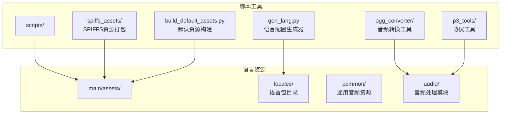
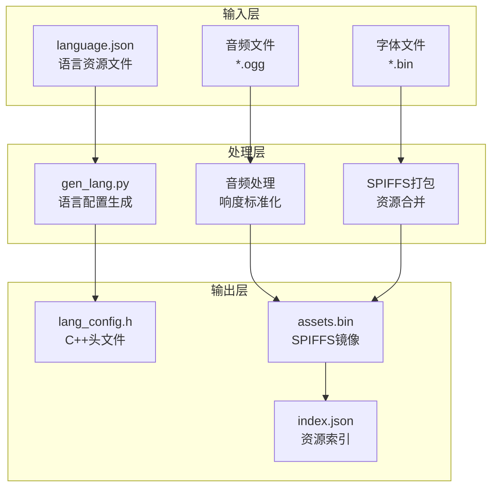
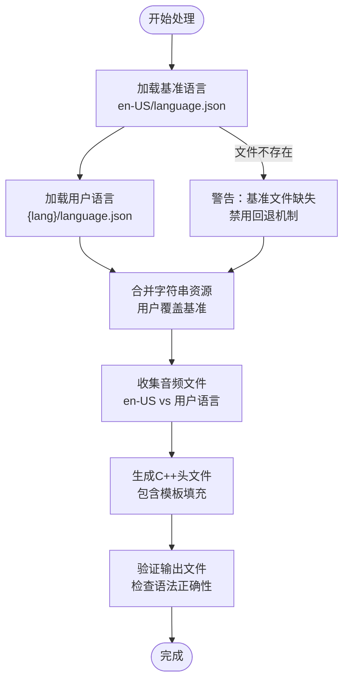
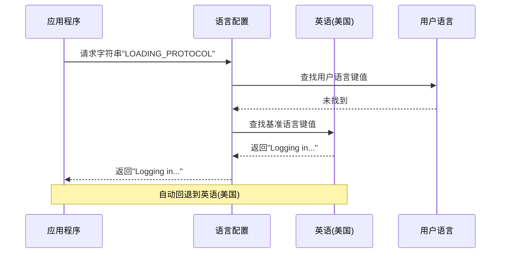
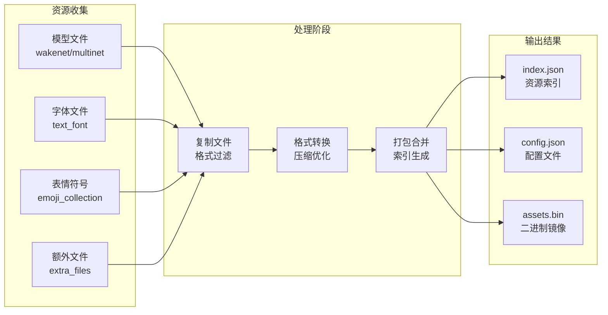
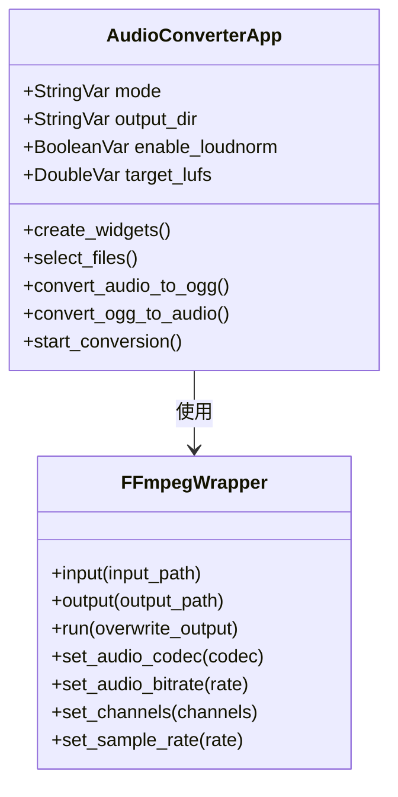
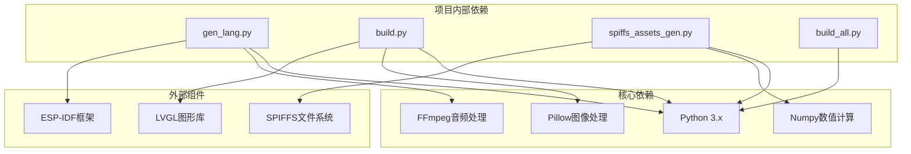

# 本地化生成工具

<cite>
**本文档引用的文件**
- [scripts/gen_lang.py](file://scripts/gen_lang.py)
- [scripts/spiffs_assets/build.py](file://scripts/spiffs_assets/build.py)
- [scripts/spiffs_assets/spiffs_assets_gen.py](file://scripts/spiffs_assets/spiffs_assets_gen.py)
- [scripts/ogg_converter/xiaozhi_ogg_converter.py](file://scripts/ogg_converter/xiaozhi_ogg_converter.py)
- [scripts/p3_tools/convert_audio_to_p3.py](file://scripts/p3_tools/convert_audio_to_p3.py)
- [scripts/build_default_assets.py](file://scripts/build_default_assets.py)
- [scripts/spiffs_assets/build_all.py](file://scripts/spiffs_assets/build_all.py)
- [main/assets/locales/en-US/language.json](file://main/assets/locales/en-US/language.json)
- [main/assets/locales/zh-CN/language.json](file://main/assets/locales/zh-CN/language.json)
- [main/assets/locales/ar-SA/language.json](file://main/assets/locales/ar-SA/language.json)
- [main/assets/locales/ja-JP/language.json](file://main/assets/locales/ja-JP/language.json)
- [main/assets/locales/ko-KR/language.json](file://main/assets/locales/ko-KR/language.json)
- [main/assets/locales/ru-RU/language.json](file://main/assets/locales/ru-RU/language.json)
</cite>

## 目录
1. [简介](#简介)
2. [项目结构](#项目结构)
3. [核心组件](#核心组件)
4. [架构概览](#架构概览)
5. [详细组件分析](#详细组件分析)
6. [依赖关系分析](#依赖关系分析)
7. [性能考虑](#性能考虑)
8. [故障排除指南](#故障排除指南)
9. [结论](#结论)
10. [附录](#附录)

## 简介

XiaoZhi ESP32项目的本地化生成工具是一个完整的多语言资源管理系统，专门用于支持ESP32设备的国际化需求。该工具集成了语言资源配置生成、音频资源批量处理、SPIFFS分区打包等功能，为多语言音频应用提供了端到端的解决方案。

本工具支持超过30种语言，包括阿拉伯语、保加利亚语、加泰罗尼亚语、捷克语、丹麦语、德语、希腊语、西班牙语、波斯语、芬兰语、菲律宾语、法语、希伯来语、印地语、克罗地亚语、匈牙利语、印尼语、意大利语、日语、韩语、马来语、挪威语、荷兰语、波兰语、葡萄牙语、罗马尼亚语、俄语、斯洛伐克语、斯洛文尼亚语、塞尔维亚语、瑞典语、泰语、土耳其语、乌克兰语、越南语、简体中文和繁体中文。

## 项目结构

项目采用模块化的脚本架构，主要包含以下核心目录：

**图表来源**
- [scripts/gen_lang.py](file://scripts/gen_lang.py#L1-L187)
- [scripts/spiffs_assets/build.py](file://scripts/spiffs_assets/build.py#L1-L400)

**章节来源**
- [scripts/gen_lang.py](file://scripts/gen_lang.py#L1-L187)
- [scripts/spiffs_assets/build.py](file://scripts/spiffs_assets/build.py#L1-L400)

## 核心组件

### 语言配置生成器 (gen_lang.py)

语言配置生成器是本地化系统的核心组件，负责将JSON格式的语言资源转换为C++头文件。其主要功能包括：

- **多语言合并机制**：以英语(美国)作为基准语言，其他语言仅需提供差异部分
- **自动回退机制**：当目标语言缺少特定键值时，自动回退到英语(美国)版本
- **音频资源管理**：自动生成音频文件的外部声明和字符串视图
- **代码模板化**：使用预定义模板生成标准化的C++代码结构

### SPIFFS资源打包器 (spiffs_assets)

SPIFFS资源打包器负责将各种类型的资源文件打包成适合ESP32存储的格式：

- **多格式支持**：PNG、GIF、JPG、音频文件、字体文件等
- **智能压缩**：根据文件类型进行适当的压缩和优化
- **索引生成**：自动生成资源索引文件，便于运行时查找
- **分区管理**：支持多种SPIFFS分区配置

### 音频转换工具

项目提供了多种音频处理工具，满足不同场景的需求：

- **批量OGG转换器**：GUI界面的音频格式转换工具
- **OPUS编码器**：针对协议v3的音频编码工具
- **响度标准化**：确保音频质量的一致性

**章节来源**
- [scripts/gen_lang.py](file://scripts/gen_lang.py#L32-L175)
- [scripts/spiffs_assets/build.py](file://scripts/spiffs_assets/build.py#L25-L382)
- [scripts/ogg_converter/xiaozhi_ogg_converter.py](file://scripts/ogg_converter/xiaozhi_ogg_converter.py#L1-L231)

## 架构概览

本地化工具的整体架构采用分层设计，从底层的音频处理到上层的应用集成：

**图表来源**
- [scripts/gen_lang.py](file://scripts/gen_lang.py#L53-L175)
- [scripts/spiffs_assets/spiffs_assets_gen.py](file://scripts/spiffs_assets/spiffs_assets_gen.py#L391-L491)

## 详细组件分析

### 语言配置生成器深度分析

#### 数据流处理

语言配置生成器采用双阶段的数据处理策略：

**图表来源**
- [scripts/gen_lang.py](file://scripts/gen_lang.py#L32-L175)

#### 代码生成机制

生成器使用模板化的方式创建标准化的C++代码：

| 生成内容 | 模板字段 | 功能描述 |
|---------|---------|----------|
| 语言代码常量 | `{lang_code}` | 定义语言标识符 |
| 字符串资源 | `{strings}` | 生成字符串常量声明 |
| 音频资源 | `{sounds}` | 生成音频文件外部声明 |

#### 回退机制实现

系统实现了智能的回退策略，确保在任何情况下都能提供有效的语言资源：

**图表来源**
- [scripts/gen_lang.py](file://scripts/gen_lang.py#L82-L106)

**章节来源**
- [scripts/gen_lang.py](file://scripts/gen_lang.py#L32-L175)

### SPIFFS资源打包器分析

#### 资源处理流程

SPIFFS打包器采用流水线式的资源处理架构：

**图表来源**
- [scripts/spiffs_assets/build.py](file://scripts/spiffs_assets/build.py#L340-L396)
- [scripts/spiffs_assets/spiffs_assets_gen.py](file://scripts/spiffs_assets/spiffs_assets_gen.py#L534-L589)

#### 配置管理

打包器支持灵活的配置管理，通过JSON配置文件控制各种参数：

| 配置项 | 类型 | 默认值 | 描述 |
|--------|------|--------|------|
| include_path | 字符串 | build/include | 头文件输出路径 |
| assets_path | 字符串 | build/assets | 资源文件路径 |
| image_file | 字符串 | build/output/assets.bin | 输出文件路径 |
| lvgl_ver | 浮点数 | 9.3.0 | LVGL版本号 |
| assets_size | 十六进制 | 0x400000 | 分区大小 |
| support_format | 数组 | .png, .gif, .jpg, .bin, .json | 支持的文件格式 |

**章节来源**
- [scripts/spiffs_assets/build.py](file://scripts/spiffs_assets/build.py#L308-L351)
- [scripts/spiffs_assets/spiffs_assets_gen.py](file://scripts/spiffs_assets/spiffs_assets_gen.py#L534-L589)

### 音频处理工具链

#### 批量转换工具

音频批量转换工具提供了直观的GUI界面，支持多种音频格式的转换：

**图表来源**
- [scripts/ogg_converter/xiaozhi_ogg_converter.py](file://scripts/ogg_converter/xiaozhi_ogg_converter.py#L8-L231)

#### OPUS编码器

针对协议v3的专用编码器提供了高质量的音频压缩：

| 参数 | 默认值 | 描述 |
|------|--------|------|
| 采样率 | 16000 Hz | 语音识别标准采样率 |
| 通道数 | 1 | 单声道语音数据 |
| 编码器 | libopus | 专为音频优化的编解码器 |
| 帧长度 | 60 ms | 实时处理的理想帧大小 |
| 码率 | 16 kbps | 语音质量与文件大小平衡 |

**章节来源**
- [scripts/ogg_converter/xiaozhi_ogg_converter.py](file://scripts/ogg_converter/xiaozhi_ogg_converter.py#L189-L225)
- [scripts/p3_tools/convert_audio_to_p3.py](file://scripts/p3_tools/convert_audio_to_p3.py#L11-L62)

## 依赖关系分析

本地化工具的依赖关系呈现清晰的层次结构：

**图表来源**
- [scripts/gen_lang.py](file://scripts/gen_lang.py#L1-L10)
- [scripts/spiffs_assets/spiffs_assets_gen.py](file://scripts/spiffs_assets/spiffs_assets_gen.py#L1-L25)

### 外部依赖管理

项目对外部依赖的管理采用了模块化的方式：

| 依赖组件 | 版本要求 | 用途 | 安装方式 |
|----------|----------|------|----------|
| Python | >= 3.6 | 主要运行环境 | 系统包管理器 |
| FFmpeg | 最新稳定版 | 音频格式转换 | 包管理器或预编译包 |
| Pillow | 最新版本 | 图像处理 | pip安装 |
| Numpy | 最新版本 | 数值计算 | pip安装 |
| ESP-IDF | 最新版本 | ESP32开发框架 | ESP-IDF工具链 |

**章节来源**
- [scripts/spiffs_assets/spiffs_assets_gen.py](file://scripts/spiffs_assets/spiffs_assets_gen.py#L1-L25)

## 性能考虑

### 内存优化策略

本地化工具在内存使用方面采用了多项优化措施：

1. **流式处理**：大文件采用流式读取，避免一次性加载到内存
2. **增量打包**：资源文件按需处理，减少内存峰值
3. **缓存机制**：重复使用的中间结果进行缓存

### 并行处理能力

工具支持多线程并行处理，提高大型项目的构建效率：

- **音频转换并行**：多个音频文件可以同时转换
- **资源打包并行**：不同类型资源可以并行处理
- **文件系统操作**：复制和移动操作采用异步方式

### 存储空间优化

针对ESP32的存储限制，工具提供了多种优化策略：

- **智能压缩**：根据文件类型选择最优压缩算法
- **格式转换**：将高分辨率资源转换为适合嵌入式设备的格式
- **冗余检测**：自动检测和去除重复资源

## 故障排除指南

### 常见问题及解决方案

#### 语言资源生成失败

**问题症状**：生成的C++头文件包含编译错误

**可能原因**：
1. JSON文件格式不正确
2. 缺少必需的键值对
3. 字符编码问题

**解决步骤**：
1. 验证language.json文件的JSON格式
2. 检查必需字段是否完整
3. 确认文件使用UTF-8编码

#### 音频文件处理异常

**问题症状**：音频转换失败或质量不佳

**可能原因**：
1. FFmpeg安装不正确
2. 输入音频格式不受支持
3. 系统音频驱动问题

**解决步骤**：
1. 验证FFmpeg安装路径
2. 检查输入文件格式兼容性
3. 更新系统音频驱动

#### SPIFFS打包错误

**问题症状**：生成的assets.bin文件过大或无法烧录

**可能原因**：
1. 资源文件超出分区限制
2. 配置参数设置不当
3. 文件权限问题

**解决步骤**：
1. 检查资源文件总大小
2. 调整分区配置参数
3. 验证文件权限设置

**章节来源**
- [scripts/gen_lang.py](file://scripts/gen_lang.py#L176-L187)
- [scripts/spiffs_assets/build.py](file://scripts/spiffs_assets/build.py#L340-L396)

## 结论

XiaoZhi ESP32项目的本地化生成工具提供了一个完整、高效、易用的多语言资源管理解决方案。通过模块化的设计和智能化的处理机制，该工具能够满足复杂国际化的开发需求。

### 主要优势

1. **全面的语言支持**：支持30+种语言，覆盖全球主要市场
2. **自动化程度高**：从资源收集到最终打包的全流程自动化
3. **质量保证**：内置的验证和检查机制确保资源质量
4. **性能优化**：针对嵌入式设备的存储和内存限制进行了专门优化
5. **易于扩展**：模块化设计便于添加新的语言和功能

### 发展建议

1. **持续集成**：建立自动化测试和部署流程
2. **文档完善**：补充更详细的API文档和使用示例
3. **性能监控**：添加构建时间和资源使用情况的监控
4. **社区贡献**：鼓励社区参与语言包的维护和改进

## 附录

### 支持的语言列表

项目当前支持的语言及其ISO代码：

| 语言名称 | ISO代码 | 语言代码 |
|----------|---------|----------|
| 英语(美国) | en-US | English (United States) |
| 中文(简体) | zh-CN | Chinese (Simplified) |
| 中文(繁体) | zh-TW | Chinese (Traditional) |
| 日语 | ja-JP | Japanese |
| 韩语 | ko-KR | Korean |
| 阿拉伯语 | ar-SA | Arabic (Saudi Arabia) |
| 保加利亚语 | bg-BG | Bulgarian |
| 加泰罗尼亚语 | ca-ES | Catalan |
| 捷克语 | cs-CZ | Czech |
| 丹麦语 | da-DK | Danish |
| 德语 | de-DE | German |
| 希腊语 | el-GR | Greek |
| 西班牙语 | es-ES | Spanish |
| 波斯语 | fa-IR | Persian |
| 芬兰语 | fi-FI | Finnish |
| 菲律宾语 | fil-PH | Filipino |
| 法语 | fr-FR | French |
| 希伯来语 | he-IL | Hebrew |
| 印地语 | hi-IN | Hindi |
| 克罗地亚语 | hr-HR | Croatian |
| 匈牙利语 | hu-HU | Hungarian |
| 印尼语 | id-ID | Indonesian |
| 意大利语 | it-IT | Italian |
| 马来语 | ms-MY | Malay |
| 挪威语 | nb-NO | Norwegian Bokmål |
| 荷兰语 | nl-NL | Dutch |
| 波兰语 | pl-PL | Polish |
| 葡萄牙语 | pt-PT | Portuguese |
| 罗马尼亚语 | ro-RO | Romanian |
| 俄语 | ru-RU | Russian |
| 斯洛伐克语 | sk-SK | Slovak |
| 斯洛文尼亚语 | sl-SI | Slovenian |
| 塞尔维亚语 | sr-RS | Serbian |
| 瑞典语 | sv-SE | Swedish |
| 泰语 | th-TH | Thai |
| 土耳其语 | tr-TR | Turkish |
| 乌克兰语 | uk-UA | Ukrainian |
| 越南语 | vi-VN | Vietnamese |

### 新增语言支持步骤

1. **创建语言目录**：在`main/assets/locales/`下创建新语言代码的目录
2. **准备基础文件**：复制`en-US/language.json`作为基础模板
3. **翻译字符串资源**：逐项翻译所有字符串键值
4. **准备音频资源**：为新语言创建必要的音频文件
5. **测试验证**：使用生成工具验证新语言的正确性
6. **集成测试**：在实际设备上测试新语言的功能

### 最佳实践

1. **保持一致性**：确保所有语言的字符串键值完全一致
2. **质量控制**：建立严格的翻译质量审核流程
3. **性能优化**：定期清理未使用的资源文件
4. **版本管理**：使用版本控制系统跟踪语言资源的变更
5. **用户反馈**：建立用户反馈渠道收集语言使用体验