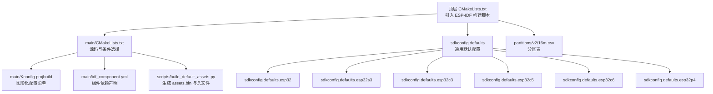
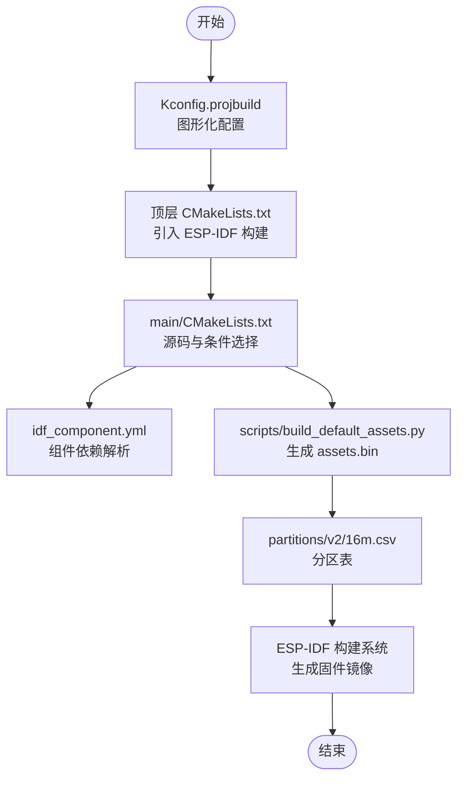
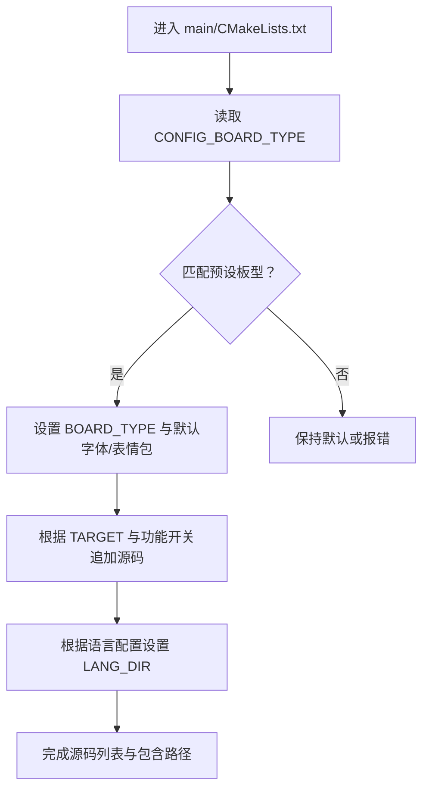
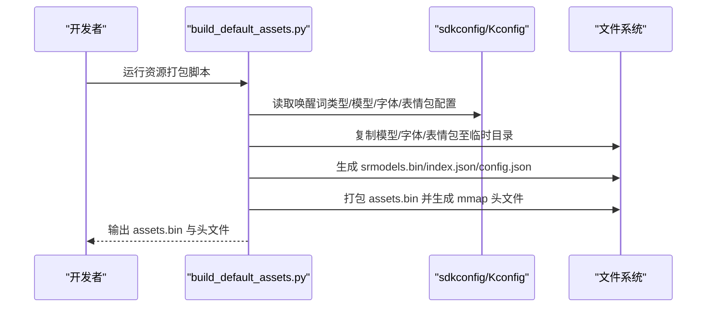
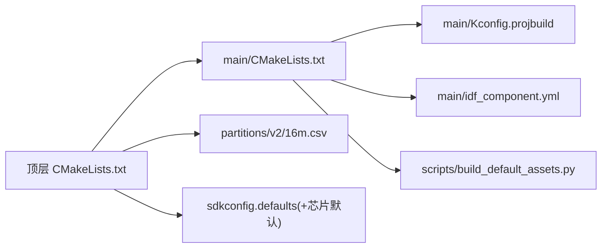

# 构建系统

<cite>
**本文引用的文件**
- [CMakeLists.txt](file://CMakeLists.txt)
- [main/CMakeLists.txt](file://main/CMakeLists.txt)
- [main/Kconfig.projbuild](file://main/Kconfig.projbuild)
- [main/idf_component.yml](file://main/idf_component.yml)
- [sdkconfig.defaults](file://sdkconfig.defaults)
- [sdkconfig.defaults.esp32](file://sdkconfig.defaults.esp32)
- [sdkconfig.defaults.esp32s3](file://sdkconfig.defaults.esp32s3)
- [sdkconfig.defaults.esp32c3](file://sdkconfig.defaults.esp32c3)
- [sdkconfig.defaults.esp32c5](file://sdkconfig.defaults.esp32c5)
- [sdkconfig.defaults.esp32c6](file://sdkconfig.defaults.esp32c6)
- [sdkconfig.defaults.esp32p4](file://sdkconfig.defaults.esp32p4)
- [partitions/v2/16m.csv](file://partitions/v2/16m.csv)
- [scripts/build_default_assets.py](file://scripts/build_default_assets.py)
- [README.md](file://README.md)
</cite>

## 目录
1. [简介](#简介)
2. [项目结构](#项目结构)
3. [核心组件](#核心组件)
4. [架构总览](#架构总览)
5. [详细组件分析](#详细组件分析)
6. [依赖关系分析](#依赖关系分析)
7. [性能考虑](#性能考虑)
8. [故障排除指南](#故障排除指南)
9. [结论](#结论)
10. [附录](#附录)

## 简介
本文件为 XiaoZhi ESP32 项目的构建系统使用与实现指南，覆盖从顶层 CMake 配置到主应用模块、从 ESP-IDF 配置文件到分区表与资源打包的完整流程。文档面向开发者，提供分层架构说明、构建参数设置方法、多芯片平台配置示例、最佳实践与故障排除建议。

## 项目结构
XiaoZhi 采用 ESP-IDF 的标准工程组织方式，顶层通过 CMakeLists.txt 引入 ESP-IDF 的构建框架，并在 main 子目录中集中管理源码、组件与配置。关键文件与职责如下：
- 顶层 CMakeLists.txt：设置最低 CMake 版本、引入 ESP-IDF 构建脚本、启用最小化构建、设置版本号与项目名称。
- main/CMakeLists.txt：声明源文件与头文件路径，按配置动态选择板级源码、音频处理与唤醒词实现、语言资源等。
- main/Kconfig.projbuild：提供图形化配置菜单，涵盖语言、显示风格、唤醒词类型、网络配置、相机与显示类型等。
- main/idf_component.yml：声明对 ESP-IDF 组件库与第三方组件的依赖及目标平台规则。
- sdkconfig.defaults 及各芯片默认配置：统一的编译器优化、内存分配、分区表、LVGL 与网络相关配置；各芯片默认文件覆盖特定差异。
- 分区表：定义 NVS、OTA 数据、PHY 初始化、OTA 分区与 SPIFFS 资源分区布局。
- scripts/build_default_assets.py：根据配置生成 assets.bin 并输出索引与映射头文件，供运行时内存映射加载。

图表来源
- [CMakeLists.txt](file://CMakeLists.txt#L1-L14)
- [main/CMakeLists.txt](file://main/CMakeLists.txt#L1-L80)
- [main/Kconfig.projbuild](file://main/Kconfig.projbuild#L1-L120)
- [main/idf_component.yml](file://main/idf_component.yml#L1-L127)
- [sdkconfig.defaults](file://sdkconfig.defaults#L1-L79)
- [sdkconfig.defaults.esp32s3](file://sdkconfig.defaults.esp32s3#L1-L32)
- [partitions/v2/16m.csv](file://partitions/v2/16m.csv#L1-L9)
- [scripts/build_default_assets.py](file://scripts/build_default_assets.py#L1-L120)

章节来源
- [CMakeLists.txt](file://CMakeLists.txt#L1-L14)
- [main/CMakeLists.txt](file://main/CMakeLists.txt#L1-L80)
- [main/Kconfig.projbuild](file://main/Kconfig.projbuild#L1-L120)
- [main/idf_component.yml](file://main/idf_component.yml#L1-L127)
- [sdkconfig.defaults](file://sdkconfig.defaults#L1-L79)
- [sdkconfig.defaults.esp32s3](file://sdkconfig.defaults.esp32s3#L1-L32)
- [partitions/v2/16m.csv](file://partitions/v2/16m.csv#L1-L9)
- [scripts/build_default_assets.py](file://scripts/build_default_assets.py#L1-L120)

## 核心组件
- 顶层构建入口
  - 设置 CMake 最低版本与编译警告抑制。
  - 引入 ESP-IDF 的 project.cmake，启用 MINIMAL_BUILD 以减少构建体积。
  - 定义项目版本与名称。
- 主应用构建
  - 源文件清单与包含路径集中管理。
  - 基于 CONFIG_* 条件动态追加板级源码与功能模块（如音频处理器、唤醒词、语言资源）。
  - 通过 Kconfig 选择显示风格、唤醒词类型、Wi-Fi 配置方式等。
- 组件依赖
  - 使用 idf_component.yml 声明对 LCD、触摸、音频、SR、LVGL 等组件的依赖，并按目标芯片进行规则筛选。
- ESP-IDF 配置
  - 通用默认配置位于 sdkconfig.defaults，覆盖编译器优化、任务看门狗、分区表、LVGL、网络与 TLS 等。
  - 各芯片默认文件覆盖 Flash 大小、SPIRAM、CPU 频率、Wi-Fi 缓冲与特性开关等差异。
- 分区表
  - 采用自定义分区表，包含 NVS、OTA 数据、PHY 初始化、两个 OTA 分区与 SPIFFS 资源分区。
- 资源打包
  - build_default_assets.py 依据 sdkconfig 与 Kconfig 生成 assets.bin、index.json 与 mmap 头文件，支持唤醒词模型、字体与表情包等。

章节来源
- [CMakeLists.txt](file://CMakeLists.txt#L1-L14)
- [main/CMakeLists.txt](file://main/CMakeLists.txt#L1-L120)
- [main/idf_component.yml](file://main/idf_component.yml#L1-L127)
- [sdkconfig.defaults](file://sdkconfig.defaults#L1-L79)
- [sdkconfig.defaults.esp32s3](file://sdkconfig.defaults.esp32s3#L1-L32)
- [partitions/v2/16m.csv](file://partitions/v2/16m.csv#L1-L9)
- [scripts/build_default_assets.py](file://scripts/build_default_assets.py#L1-L120)

## 架构总览
下图展示从配置到目标生成的分层流程：Kconfig 决策 → CMake 条件选择 → 组件依赖 → 资源打包 → 分区表 → 固件镜像。

图表来源
- [main/Kconfig.projbuild](file://main/Kconfig.projbuild#L1-L120)
- [CMakeLists.txt](file://CMakeLists.txt#L1-L14)
- [main/CMakeLists.txt](file://main/CMakeLists.txt#L1-L120)
- [main/idf_component.yml](file://main/idf_component.yml#L1-L127)
- [scripts/build_default_assets.py](file://scripts/build_default_assets.py#L1-L120)
- [partitions/v2/16m.csv](file://partitions/v2/16m.csv#L1-L9)

章节来源
- [main/Kconfig.projbuild](file://main/Kconfig.projbuild#L1-L120)
- [CMakeLists.txt](file://CMakeLists.txt#L1-L14)
- [main/CMakeLists.txt](file://main/CMakeLists.txt#L1-L120)
- [main/idf_component.yml](file://main/idf_component.yml#L1-L127)
- [scripts/build_default_assets.py](file://scripts/build_default_assets.py#L1-L120)
- [partitions/v2/16m.csv](file://partitions/v2/16m.csv#L1-L9)

## 详细组件分析

### 顶层 CMake 配置
- 关键点
  - 引入 ESP-IDF 构建脚本，确保使用正确的工具链与组件系统。
  - 启用 MINIMAL_BUILD，仅包含主应用与必要依赖，缩短构建时间。
  - 设置项目版本号与项目名，便于发布与识别。
- 参数说明
  - 最低 CMake 版本：保证兼容性。
  - 编译选项：抑制特定字段初始化警告，避免无关噪音。
  - MINIMAL_BUILD：裁剪组件集合，降低内存占用与编译时间。

章节来源
- [CMakeLists.txt](file://CMakeLists.txt#L1-L14)

### 主应用 CMake 与条件选择
- 关键点
  - 源文件与包含路径集中维护，便于扩展与清理。
  - 基于 CONFIG_BOARD_TYPE 动态选择板级源码与显示风格、字体与表情包集合。
  - 根据 CONFIG_IDF_TARGET 与 CONFIG_USE_AUDIO_PROCESSOR 等条件选择音频处理器与唤醒词实现。
  - 根据 CONFIG_LANGUAGE_* 选择语言目录。
- 流程图（条件选择）

图表来源
- [main/CMakeLists.txt](file://main/CMakeLists.txt#L80-L800)

章节来源
- [main/CMakeLists.txt](file://main/CMakeLists.txt#L1-L800)

### ESP-IDF 配置文件管理
- 通用默认配置（sdkconfig.defaults）
  - 编译器优化策略、异常与 RTTI、启动器优化与回滚、HTTPD 请求限制、任务看门狗、统计与格式化函数、主任务栈大小、mbedTLS 动态缓冲与 SSL 重协商、LVGL 选项与字体压缩、禁用部分 LVGL 控件以节省空间、关闭示例与演示。
- 芯片差异化默认配置
  - ESP32：Flash 大小、分区表、任务看门狗超时。
  - ESP32-S3：Flash 模式、CPU 频率、SPIRAM 使能与速度、内存分配策略、Wi-Fi 缓冲窗口、LWIP 接收队列、快照支持。
  - ESP32-C3：分区表 CSV 名称、WPA3 与 ESPNOW、IPv6 关闭。
  - ESP32-C5：CPU 频率、唤醒词、AEC 支持。
  - ESP32-C6：Flash 模式、唤醒词。
  - ESP32-P4：目标标识、SPIRAM 速度与 XIP、主任务栈、RTOS 频率、实验特性、视频与 USB 主机、LVGL 快照。
- 影响范围
  - 编译器优化级别与目标 CPU 频率影响性能与功耗。
  - SPIRAM 与内存分配策略影响音频与图形处理能力。
  - LVGL 与控件裁剪决定显示资源占用。
  - 分区表决定 OTA 与资源存储布局。

章节来源
- [sdkconfig.defaults](file://sdkconfig.defaults#L1-L79)
- [sdkconfig.defaults.esp32](file://sdkconfig.defaults.esp32#L1-L7)
- [sdkconfig.defaults.esp32s3](file://sdkconfig.defaults.esp32s3#L1-L32)
- [sdkconfig.defaults.esp32c3](file://sdkconfig.defaults.esp32c3#L1-L15)
- [sdkconfig.defaults.esp32c5](file://sdkconfig.defaults.esp32c5#L1-L15)
- [sdkconfig.defaults.esp32c6](file://sdkconfig.defaults.esp32c6#L1-L6)
- [sdkconfig.defaults.esp32p4](file://sdkconfig.defaults.esp32p4#L1-L32)

### 分区表与资源分区
- 分区表（v2/16m.csv）
  - NVS、OTA 数据、PHY 初始化、两个 OTA 分区、SPIFFS 资源分区。
- 影响
  - 资源分区大小决定可打包的 assets.bin 与表情包、字体等资源总量。
  - OTA 分区布局影响升级策略与回滚机制。

章节来源
- [partitions/v2/16m.csv](file://partitions/v2/16m.csv#L1-L9)

### 资源打包与内存映射
- 工作流
  - 读取 sdkconfig 与 Kconfig，确定唤醒词模型、文本字体、表情包集合与额外文件。
  - 生成 srmodels.bin、index.json、config.json 与 assets.bin。
  - 输出 mmap 头文件，供运行时直接访问资源。
- 关键点
  - 支持多语言唤醒词模型自动识别。
  - 字体与表情包路径解析，支持 GIF 与 PNG。
  - 生成校验与文件映射表，保障加载稳定性。

图表来源
- [scripts/build_default_assets.py](file://scripts/build_default_assets.py#L1-L200)
- [main/Kconfig.projbuild](file://main/Kconfig.projbuild#L1-L120)

章节来源
- [scripts/build_default_assets.py](file://scripts/build_default_assets.py#L1-L200)
- [main/Kconfig.projbuild](file://main/Kconfig.projbuild#L1-L120)

### 组件依赖与目标平台规则
- 依赖声明
  - 显示面板驱动（如 ILI9341、ST7789、GC9A01 等）按目标芯片启用。
  - 音频与 SR 组件（esp_audio、esp-sr）按目标芯片启用。
  - LVGL 与端口（esp_lvgl_port）、触摸控制器、LED、ADC 电池估计等。
- 规则筛选
  - 通过 rules: - if: target in [...] 实现按芯片裁剪，避免不支持平台的依赖。

章节来源
- [main/idf_component.yml](file://main/idf_component.yml#L1-L127)

## 依赖关系分析
- 构建耦合
  - 顶层 CMake 与主应用 CMake 强耦合于 ESP-IDF 构建框架。
  - 主应用 CMake 依赖 Kconfig 与 sdkconfig 的条件分支。
  - 资源打包脚本依赖 sdkconfig 与 Kconfig 的最终配置。
- 组件内聚
  - 板级源码按 BOARD_TYPE 内聚，减少交叉依赖。
  - 音频与唤醒词实现按 TARGET 与功能开关内聚。
- 外部依赖
  - ESP-IDF 组件生态与第三方组件（如 LVGL、音频、SR、显示面板）。
  - 分区表与资源分区约束。

图表来源
- [CMakeLists.txt](file://CMakeLists.txt#L1-L14)
- [main/CMakeLists.txt](file://main/CMakeLists.txt#L1-L120)
- [main/Kconfig.projbuild](file://main/Kconfig.projbuild#L1-L120)
- [main/idf_component.yml](file://main/idf_component.yml#L1-L127)
- [partitions/v2/16m.csv](file://partitions/v2/16m.csv#L1-L9)
- [sdkconfig.defaults](file://sdkconfig.defaults#L1-L79)

章节来源
- [CMakeLists.txt](file://CMakeLists.txt#L1-L14)
- [main/CMakeLists.txt](file://main/CMakeLists.txt#L1-L120)
- [main/Kconfig.projbuild](file://main/Kconfig.projbuild#L1-L120)
- [main/idf_component.yml](file://main/idf_component.yml#L1-L127)
- [partitions/v2/16m.csv](file://partitions/v2/16m.csv#L1-L9)
- [sdkconfig.defaults](file://sdkconfig.defaults#L1-L79)

## 性能考虑
- 编译器优化
  - 通用默认配置中包含“按大小优化”与“按性能优化”的开关，可在不同场景切换。
  - ESP32-P4 默认开启更激进的编译优化，适合高性能场景。
- CPU 频率
  - ESP32-S3/C5/P4 默认 240MHz，提升计算性能；ESP32 默认更高看门狗超时，适配不同平台。
- 内存与缓存
  - ESP32-S3/P4 启用 SPIRAM 并配置内存分配策略，显著提升音频与图形处理能力。
  - LVGL 控件裁剪与字体压缩减少 Flash 占用。
- 网络与 TLS
  - mbedTLS 动态缓冲与 SSL 重协商配置平衡内存与安全。
- 分区与资源
  - 合理规划资源分区大小，避免 assets.bin 过大导致映射失败或运行时加载缓慢。

章节来源
- [sdkconfig.defaults](file://sdkconfig.defaults#L1-L79)
- [sdkconfig.defaults.esp32s3](file://sdkconfig.defaults.esp32s3#L1-L32)
- [sdkconfig.defaults.esp32p4](file://sdkconfig.defaults.esp32p4#L1-L32)

## 故障排除指南
- 构建失败（CMake/ESP-IDF）
  - 确认 ESP-IDF 版本满足要求（>=5.5.2），并正确设置 IDF_PATH。
  - 检查 MINIMAL_BUILD 是否导致缺失组件。
- 资源加载异常
  - 确认 assets.bin 生成成功且与 index.json、mmap 头文件一致。
  - 检查资源分区大小是否足够容纳当前配置的资源。
- 分区表不匹配
  - v2 与 v1 分区表不兼容，需手动刷写而非 OTA 升级。
- 板型选择错误
  - 确认 Kconfig 中 BOARD_TYPE 与实际硬件一致，避免显示/音频驱动不匹配。
- 语音唤醒词模型缺失
  - 检查 sdkconfig 中唤醒词类型与模型配置，确保模型目录存在。
- 语言与字体问题
  - 确认语言配置与字体/表情包路径解析正确，特别是“basic”到“common/qwen”的转换逻辑。

章节来源
- [README.md](file://README.md#L17-L22)
- [scripts/build_default_assets.py](file://scripts/build_default_assets.py#L680-L750)
- [main/Kconfig.projbuild](file://main/Kconfig.projbuild#L1-L120)

## 结论
XiaoZhi 的构建系统以 ESP-IDF 为核心，通过 Kconfig 与 CMake 的条件选择实现多硬件平台与多功能组合的灵活构建。配合 sdkconfig 默认文件与芯片差异化配置，以及资源打包脚本，能够在保证功能完整性的同时控制体积与性能。遵循本文的最佳实践与故障排除建议，可高效完成从开发环境到固件发布的全流程。

## 附录

### 不同硬件平台的构建配置示例
- ESP32-S3（典型显示与音频）
  - 在 Kconfig 中选择 BOARD_TYPE 为 ESP32-S3 相关型号，启用 SPIRAM 与 LVGL 快照。
  - 使用 sdkconfig.defaults.esp32s3 的默认配置，确保 Flash 模式与 CPU 频率。
- ESP32-C3（低成本与 4G）
  - 选择 ESP32-C3 对应板型，启用 ML307/NT26 等 4G 模块支持。
  - 使用 sdkconfig.defaults.esp32c3，默认关闭 IPv6 与 WPA3 SAE。
- ESP32-P4（高性能与视频）
  - 选择 ESP32-P4 对应板型，启用视频与 USB 主机支持。
  - 使用 sdkconfig.defaults.esp32p4 的默认配置，开启实验特性与更高主任务栈。

章节来源
- [main/Kconfig.projbuild](file://main/Kconfig.projbuild#L120-L497)
- [sdkconfig.defaults.esp32s3](file://sdkconfig.defaults.esp32s3#L1-L32)
- [sdkconfig.defaults.esp32c3](file://sdkconfig.defaults.esp32c3#L1-L15)
- [sdkconfig.defaults.esp32p4](file://sdkconfig.defaults.esp32p4#L1-L32)

### 构建参数设置方法
- 编译选项
  - 顶层 CMake 中添加编译选项抑制特定警告。
  - 通过 sdkconfig.defaults 切换“按大小优化”或“按性能优化”。
- 链接器配置
  - 由 ESP-IDF 自动管理，可通过分区表调整 OTA 与资源分区大小。
- 优化级别
  - 通用默认配置提供优化策略开关；芯片默认文件可覆盖 CPU 频率与内存策略。

章节来源
- [CMakeLists.txt](file://CMakeLists.txt#L1-L14)
- [sdkconfig.defaults](file://sdkconfig.defaults#L1-L79)
- [sdkconfig.defaults.esp32s3](file://sdkconfig.defaults.esp32s3#L1-L32)
- [sdkconfig.defaults.esp32p4](file://sdkconfig.defaults.esp32p4#L1-L32)