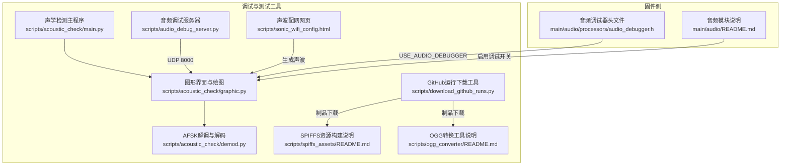
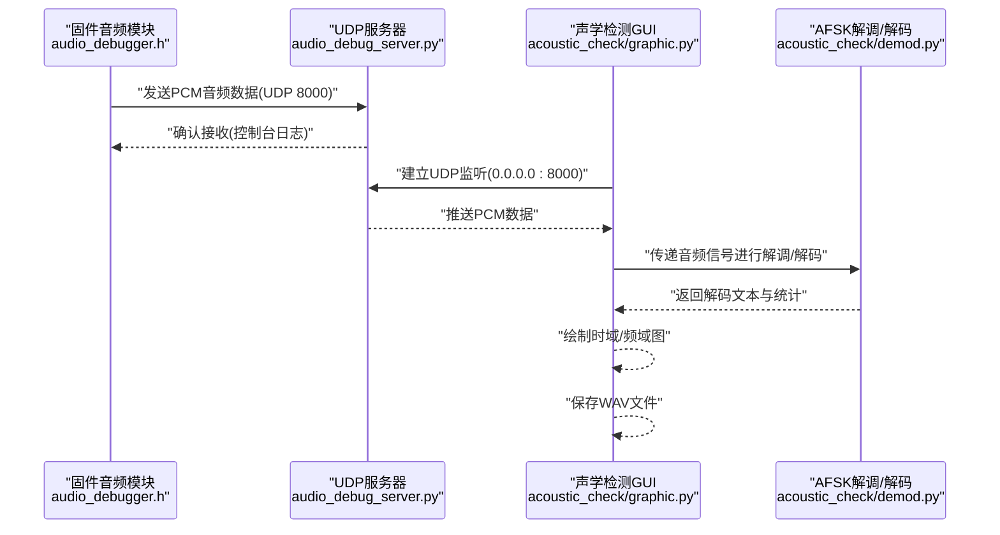
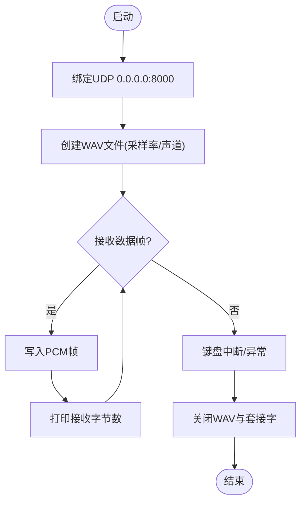
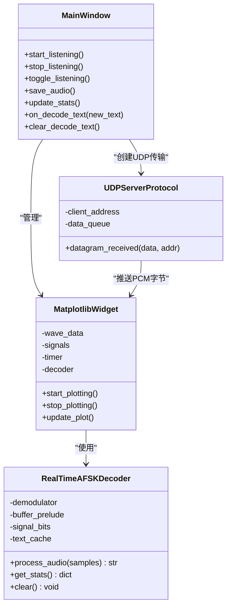
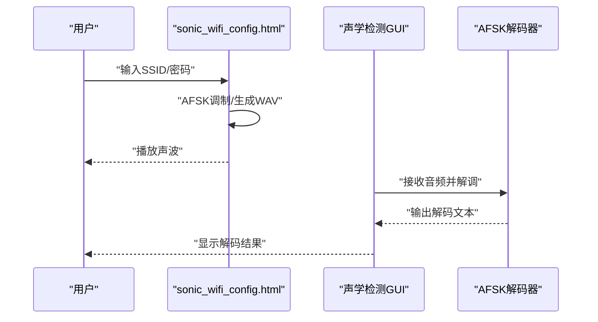
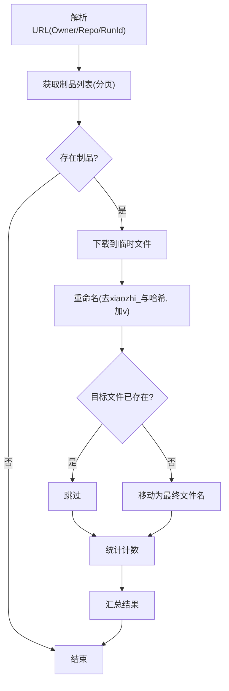
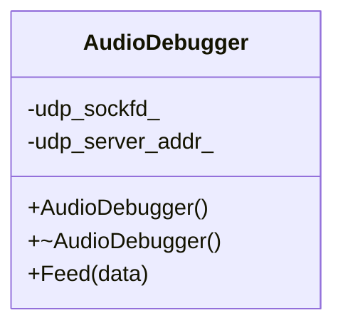
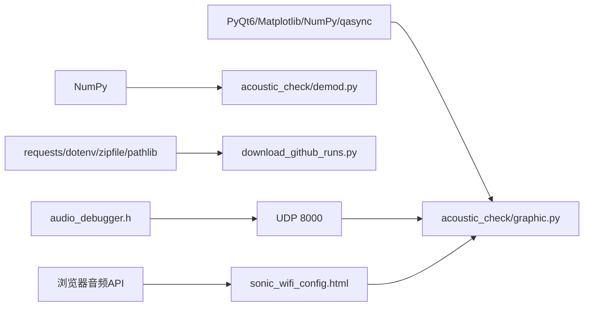

# 调试与测试工具

<cite>
**本文引用的文件**
- [scripts/audio_debug_server.py](file://scripts/audio_debug_server.py)
- [scripts/acoustic_check/main.py](file://scripts/acoustic_check/main.py)
- [scripts/acoustic_check/graphic.py](file://scripts/acoustic_check/graphic.py)
- [scripts/acoustic_check/demod.py](file://scripts/acoustic_check/demod.py)
- [scripts/sonic_wifi_config.html](file://scripts/sonic_wifi_config.html)
- [scripts/download_github_runs.py](file://scripts/download_github_runs.py)
- [scripts/ogg_converter/README.md](file://scripts/ogg_converter/README.md)
- [scripts/spiffs_assets/README.md](file://scripts/spiffs_assets/README.md)
- [main/audio/processors/audio_debugger.h](file://main/audio/processors/audio_debugger.h)
- [main/audio/README.md](file://main/audio/README.md)
</cite>

## 目录
1. [简介](#简介)
2. [项目结构](#项目结构)
3. [核心组件](#核心组件)
4. [架构总览](#架构总览)
5. [详细组件分析](#详细组件分析)
6. [依赖关系分析](#依赖关系分析)
7. [性能考虑](#性能考虑)
8. [故障排查指南](#故障排查指南)
9. [结论](#结论)
10. [附录](#附录)

## 简介
本文件面向开发者，系统性介绍 XiaoZhi ESP32 项目的调试与测试工具链，覆盖以下主题：
- 音频调试服务器：UDP 接收、WAV 保存、实时监控与问题诊断
- 声学检测工具：时域/频域可视化、AFSK 实时解码、音频质量分析与频谱分析
- GitHub 运行下载工具：CI/CD 结果获取、制品下载与命名规范化
- WiFi 配置工具：声波配网网页工具的使用与原理
- 测试流程与自动化：资源打包、音频格式转换、自动化测试建议
- 常见问题诊断与优化技巧

## 项目结构
围绕调试与测试的相关脚本与组件主要位于 scripts/ 与 main/audio/ 目录：
- 音频调试服务器：scripts/audio_debug_server.py
- 声学检测 GUI：scripts/acoustic_check/（main.py、graphic.py、demod.py）
- 声波配网网页：scripts/sonic_wifi_config.html
- CI/CD 下载工具：scripts/download_github_runs.py
- 资源与音频工具：scripts/spiffs_assets/README.md、scripts/ogg_converter/README.md
- 固件侧调试接口：main/audio/processors/audio_debugger.h、main/audio/README.md

**图表来源**
- [scripts/audio_debug_server.py](file://scripts/audio_debug_server.py#L1-L55)
- [scripts/acoustic_check/main.py](file://scripts/acoustic_check/main.py#L1-L19)
- [scripts/acoustic_check/graphic.py](file://scripts/acoustic_check/graphic.py#L1-L444)
- [scripts/acoustic_check/demod.py](file://scripts/acoustic_check/demod.py#L1-L281)
- [scripts/sonic_wifi_config.html](file://scripts/sonic_wifi_config.html#L1-L209)
- [scripts/download_github_runs.py](file://scripts/download_github_runs.py#L1-L265)
- [main/audio/processors/audio_debugger.h](file://main/audio/processors/audio_debugger.h#L1-L22)
- [main/audio/README.md](file://main/audio/README.md)

**章节来源**
- [scripts/audio_debug_server.py](file://scripts/audio_debug_server.py#L1-L55)
- [scripts/acoustic_check/main.py](file://scripts/acoustic_check/main.py#L1-L19)
- [scripts/acoustic_check/graphic.py](file://scripts/acoustic_check/graphic.py#L1-L444)
- [scripts/acoustic_check/demod.py](file://scripts/acoustic_check/demod.py#L1-L281)
- [scripts/sonic_wifi_config.html](file://scripts/sonic_wifi_config.html#L1-L209)
- [scripts/download_github_runs.py](file://scripts/download_github_runs.py#L1-L265)
- [scripts/spiffs_assets/README.md](file://scripts/spiffs_assets/README.md#L1-L111)
- [scripts/ogg_converter/README.md](file://scripts/ogg_converter/README.md#L1-L37)
- [main/audio/processors/audio_debugger.h](file://main/audio/processors/audio_debugger.h#L1-L22)
- [main/audio/README.md](file://main/audio/README.md)

## 核心组件
- 音频调试服务器：基于 UDP 接收 PCM 数据，写入 WAV 文件，支持采样率与声道参数配置，便于离线分析与问题定位。
- 声学检测工具：基于 Qt/PyQt6 + Matplotlib 的 GUI，实时绘制时域/频域图，内置 AFSK 解调与解码，支持保存音频与查看解码统计。
- 声波配网网页：浏览器端生成并播放声波（AFSK），用于 WiFi 配网；可循环播放，便于测试与演示。
- GitHub 运行下载工具：解析 GitHub Actions 运行 URL，拉取制品并按约定重命名，支持分页与去重。
- 固件侧音频调试器：提供 Feed 接口向 UDP 服务器发送音频数据，配合 USE_AUDIO_DEBUGGER 开关启用。

**章节来源**
- [scripts/audio_debug_server.py](file://scripts/audio_debug_server.py#L11-L55)
- [scripts/acoustic_check/graphic.py](file://scripts/acoustic_check/graphic.py#L46-L183)
- [scripts/sonic_wifi_config.html](file://scripts/sonic_wifi_config.html#L92-L206)
- [scripts/download_github_runs.py](file://scripts/download_github_runs.py#L160-L260)
- [main/audio/processors/audio_debugger.h](file://main/audio/processors/audio_debugger.h#L10-L20)

## 架构总览
整体调试与测试链路由“固件采集 → UDP 发送 → 本地工具接收/可视化/解码/保存”构成，辅以 CI/CD 制品下载与资源构建工具。

**图表来源**
- [main/audio/processors/audio_debugger.h](file://main/audio/processors/audio_debugger.h#L10-L20)
- [scripts/audio_debug_server.py](file://scripts/audio_debug_server.py#L11-L43)
- [scripts/acoustic_check/graphic.py](file://scripts/acoustic_check/graphic.py#L327-L423)
- [scripts/acoustic_check/demod.py](file://scripts/acoustic_check/demod.py#L126-L224)

## 详细组件分析

### 音频调试服务器
- 功能要点
  - 创建 UDP 套接字并绑定到 0.0.0.0:8000
  - 接收二进制 PCM 数据帧，写入 WAV 文件
  - 支持采样率与声道参数命令行传入
  - 循环接收直至键盘中断，最后关闭文件与套接字
- 使用场景
  - 与固件侧 audio_debugger 配合，验证音频链路完整性
  - 保存音频进行离线分析（噪声、失真、丢包等）

**图表来源**
- [scripts/audio_debug_server.py](file://scripts/audio_debug_server.py#L11-L43)

**章节来源**
- [scripts/audio_debug_server.py](file://scripts/audio_debug_server.py#L11-L55)

### 声学检测工具（GUI + AFSK解码）
- 组件关系
  - main.py：入口，启动异步事件循环与主窗口
  - graphic.py：GUI 与绘图逻辑，包含 MatplotlibWidget、MainWindow、UDPServerProtocol
  - demod.py：实时 AFSK 解调与解码，基于 Goertzel 算法
- 关键能力
  - 时域/频域实时绘制
  - AFSK 实时解码（起始帧触发、阈值判决、统计信息）
  - 保存最近窗口的音频为 WAV
  - 支持监听地址与端口配置、循环播放与停止
- 使用步骤
  - 在固件中启用 USE_AUDIO_DEBUGGER，并确保 AUDIO_DEBUG_UDP_SERVER 指向本机
  - 运行 acoustic_check/main.py 或 graphic.py，点击“开始监听”
  - 在声学检测界面观察波形与频谱，查看解码文本与统计
  - 如需离线分析，点击“保存音频”

**图表来源**
- [scripts/acoustic_check/graphic.py](file://scripts/acoustic_check/graphic.py#L185-L423)
- [scripts/acoustic_check/demod.py](file://scripts/acoustic_check/demod.py#L126-L281)

**章节来源**
- [scripts/acoustic_check/main.py](file://scripts/acoustic_check/main.py#L1-L19)
- [scripts/acoustic_check/graphic.py](file://scripts/acoustic_check/graphic.py#L1-L444)
- [scripts/acoustic_check/demod.py](file://scripts/acoustic_check/demod.py#L1-L281)

### 声波配网网页工具
- 功能概述
  - 输入 SSID 与密码，生成并播放 AFSK 声波（WAV）
  - 支持自动循环播放，便于测试与演示
  - 基于浏览器端 JavaScript 实现调制、PCM 转换与 WAV 生成
- 使用建议
  - 在声学检测 GUI 中开启监听，播放声波后观察解码结果
  - 若解码不稳定，检查采样率、比特率与阈值设置

**图表来源**
- [scripts/sonic_wifi_config.html](file://scripts/sonic_wifi_config.html#L172-L199)
- [scripts/acoustic_check/graphic.py](file://scripts/acoustic_check/graphic.py#L327-L423)
- [scripts/acoustic_check/demod.py](file://scripts/acoustic_check/demod.py#L126-L224)

**章节来源**
- [scripts/sonic_wifi_config.html](file://scripts/sonic_wifi_config.html#L1-L209)

### GitHub 运行下载工具
- 功能概述
  - 解析 GitHub Actions 运行 URL，提取 owner、repo、run_id
  - 分页获取制品列表，下载并按规则重命名（去除前缀与哈希、添加版本前缀）
  - 支持 .env 中配置 GITHUB_TOKEN
- 使用建议
  - 准备 .env 文件，设置 GITHUB_TOKEN
  - 传入版本号与运行 URL，指定输出目录
  - 下载完成后核对制品命名与去重情况

**图表来源**
- [scripts/download_github_runs.py](file://scripts/download_github_runs.py#L21-L260)

**章节来源**
- [scripts/download_github_runs.py](file://scripts/download_github_runs.py#L1-L265)

### 固件侧音频调试器
- 能力概述
  - 提供 Feed 接口，将音频数据写入 UDP 套接字
  - 默认使用 UDP 地址结构体，便于与本地调试服务器对接
- 使用建议
  - 在固件中启用 USE_AUDIO_DEBUGGER
  - 配置 AUDIO_DEBUG_UDP_SERVER 为本机 IP
  - 确认采样率与声道与本地工具一致

**图表来源**
- [main/audio/processors/audio_debugger.h](file://main/audio/processors/audio_debugger.h#L10-L20)

**章节来源**
- [main/audio/processors/audio_debugger.h](file://main/audio/processors/audio_debugger.h#L1-L22)
- [main/audio/README.md](file://main/audio/README.md)

## 依赖关系分析
- 工具链依赖
  - 声学检测 GUI 依赖 PyQt6、Matplotlib、NumPy、qasync
  - AFSK 解调依赖 NumPy
  - GitHub 下载工具依赖 requests、dotenv、zipfile、pathlib
  - 声波配网网页为纯前端，依赖浏览器音频 API
- 固件与工具交互
  - 固件通过 UDP 将 PCM 数据发送至本地工具
  - 本地工具负责可视化、解码与保存

**图表来源**
- [scripts/acoustic_check/graphic.py](file://scripts/acoustic_check/graphic.py#L15-L17)
- [scripts/acoustic_check/demod.py](file://scripts/acoustic_check/demod.py#L5-L6)
- [scripts/download_github_runs.py](file://scripts/download_github_runs.py#L17-L18)
- [scripts/sonic_wifi_config.html](file://scripts/sonic_wifi_config.html#L92-L206)
- [main/audio/processors/audio_debugger.h](file://main/audio/processors/audio_debugger.h#L17-L19)

**章节来源**
- [scripts/acoustic_check/graphic.py](file://scripts/acoustic_check/graphic.py#L15-L17)
- [scripts/acoustic_check/demod.py](file://scripts/acoustic_check/demod.py#L5-L6)
- [scripts/download_github_runs.py](file://scripts/download_github_runs.py#L17-L18)
- [scripts/sonic_wifi_config.html](file://scripts/sonic_wifi_config.html#L92-L206)
- [main/audio/processors/audio_debugger.h](file://main/audio/processors/audio_debugger.h#L17-L19)

## 性能考虑
- 采样率与带宽
  - 采样率越高，CPU 与内存占用越大；建议与固件保持一致
- 绘图刷新频率
  - 图表定时器间隔影响 CPU 占用；可根据设备性能调整
- FFT 计算
  - 频域计算复杂度与窗口长度相关；可限制显示频率范围以降低开销
- UDP 接收与解码
  - 解码阈值与比特率需匹配；过低的阈值可能导致误判，过高的阈值可能丢失信号
- I/O 与磁盘
  - WAV 写入为顺序写，注意磁盘空间与写入速度

[本节为通用指导，无需特定文件引用]

## 故障排查指南
- 无法接收音频
  - 检查固件是否启用 USE_AUDIO_DEBUGGER，UDP 地址是否正确
  - 确认本地防火墙未阻断 UDP 8000
- 解码不稳定或乱码
  - 调整解码阈值与比特率，确保采样率与比特率整除关系满足
  - 观察频谱图，确认 Mark/Space 频率是否清晰
- GUI 无响应或崩溃
  - 确认 PyQt6、Matplotlib、NumPy 版本兼容
  - 降低绘图刷新频率或减少显示窗口长度
- GitHub 下载失败
  - 检查 .env 中 GITHUB_TOKEN 是否配置
  - 确认运行 URL 正确且制品存在
- 声波配网失败
  - 确认浏览器允许音频播放权限
  - 检查设备麦克风/扬声器是否正常，避免背景噪声干扰

**章节来源**
- [scripts/acoustic_check/graphic.py](file://scripts/acoustic_check/graphic.py#L327-L423)
- [scripts/download_github_runs.py](file://scripts/download_github_runs.py#L181-L189)
- [scripts/sonic_wifi_config.html](file://scripts/sonic_wifi_config.html#L172-L199)

## 结论
本指南提供了 XiaoZhi ESP32 项目从固件到本地工具的完整调试与测试方案：通过音频调试服务器与声学检测 GUI 实现音频链路监控与 AFSK 解码，借助 GitHub 运行下载工具完成 CI/CD 制品获取，结合声波配网网页与资源构建工具形成闭环。建议在开发与回归测试中固定采样率与解码参数，配合可视化与统计信息快速定位问题。

[本节为总结性内容，无需特定文件引用]

## 附录

### 配置选项与使用技巧
- 音频调试服务器
  - 采样率与声道：通过命令行参数传入，需与固件一致
- 声学检测 GUI
  - 监听地址与端口：默认 0.0.0.0:8000，可自定义
  - 解码阈值与比特率：根据实际声波质量调整
  - 保存音频：选择合适的时间窗口长度，避免过大文件
- 声波配网网页
  - 自动循环播放：勾选后可连续播放，便于测试
- GitHub 下载工具
  - 输出目录：默认 ../releases，可自定义
  - 去重策略：若目标文件已存在则跳过

**章节来源**
- [scripts/audio_debug_server.py](file://scripts/audio_debug_server.py#L47-L54)
- [scripts/acoustic_check/graphic.py](file://scripts/acoustic_check/graphic.py#L206-L238)
- [scripts/sonic_wifi_config.html](file://scripts/sonic_wifi_config.html#L83-L88)
- [scripts/download_github_runs.py](file://scripts/download_github_runs.py#L162-L177)

### 测试流程与自动化建议
- 资源构建
  - 使用 SPIFFS 资源构建脚本生成 assets.bin，确保模型、字体、表情包齐全
- 音频格式转换
  - 使用 OGG 转换工具统一音效格式，保证播放一致性
- 自动化测试
  - 将 GitHub 运行下载工具集成到 CI/CD，自动获取制品并进行回归测试
  - 在本地使用声学检测 GUI 对比不同固件版本的音频质量与解码稳定性

**章节来源**
- [scripts/spiffs_assets/README.md](file://scripts/spiffs_assets/README.md#L1-L111)
- [scripts/ogg_converter/README.md](file://scripts/ogg_converter/README.md#L1-L37)
- [scripts/download_github_runs.py](file://scripts/download_github_runs.py#L160-L260)