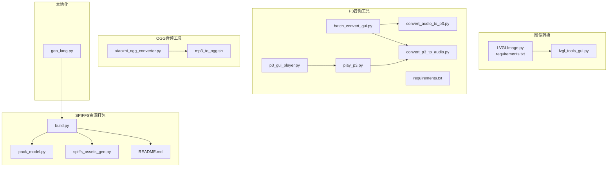
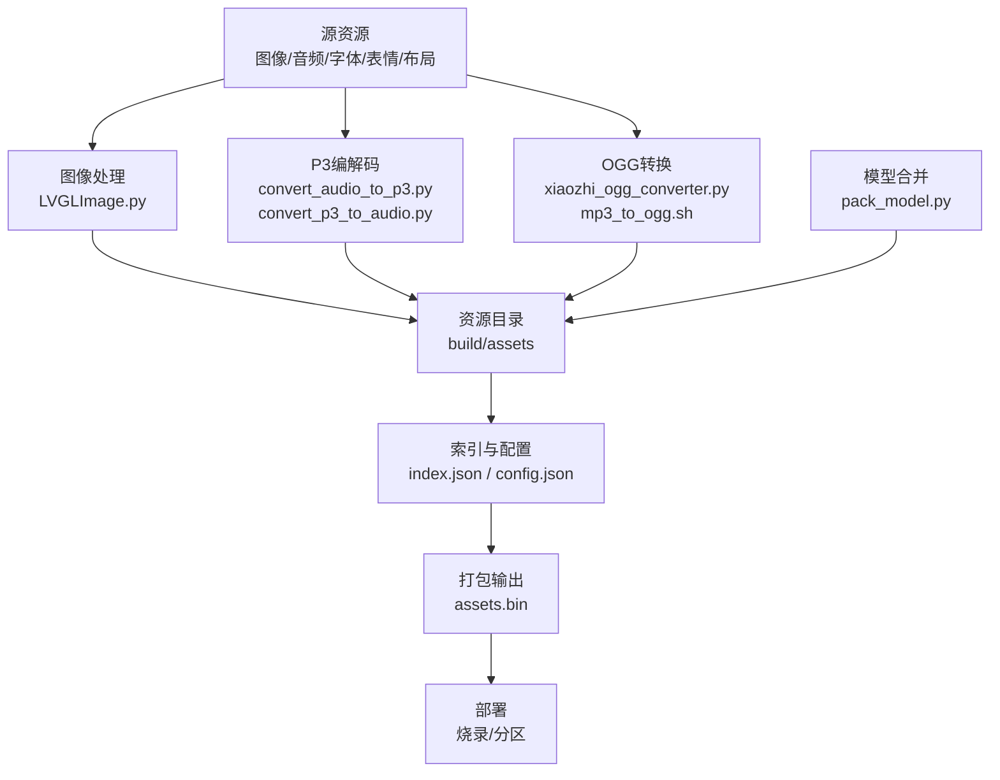
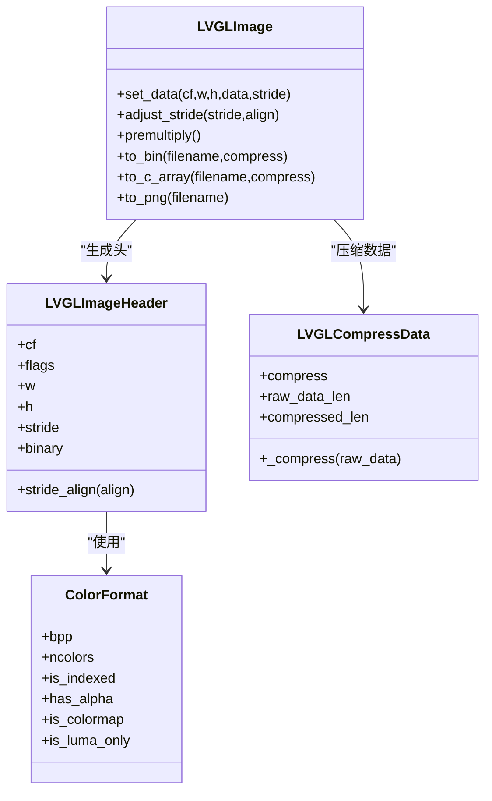
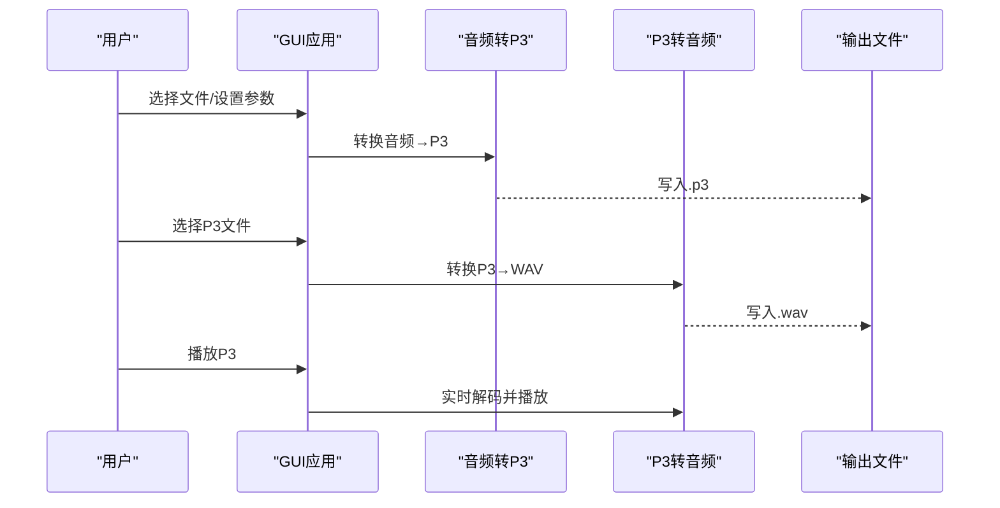
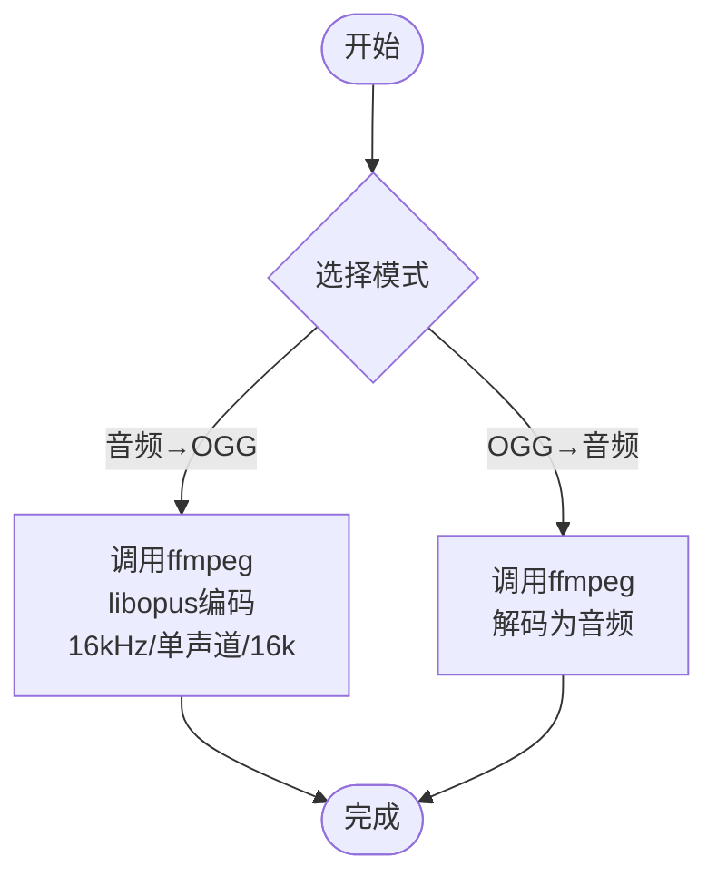
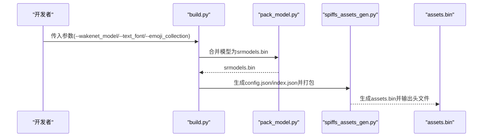
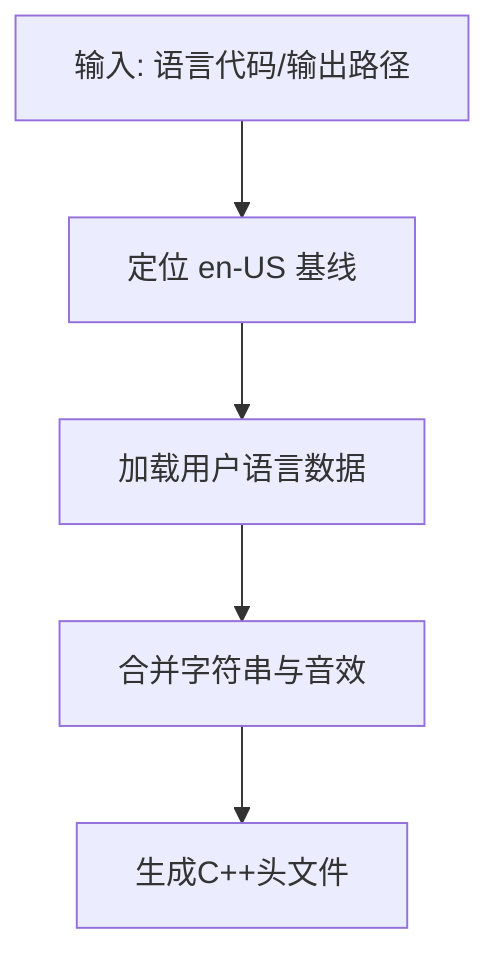
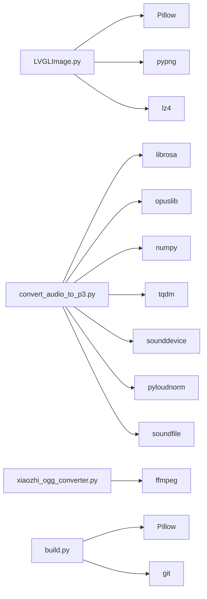

# 资源转换工具

<cite>
**本文档引用的文件**
- [scripts/Image_Converter/README.md](file://scripts/Image_Converter/README.md)
- [scripts/Image_Converter/LVGLImage.py](file://scripts/Image_Converter/LVGLImage.py)
- [scripts/Image_Converter/requirements.txt](file://scripts/Image_Converter/requirements.txt)
- [scripts/p3_tools/batch_convert_gui.py](file://scripts/p3_tools/batch_convert_gui.py)
- [scripts/p3_tools/convert_audio_to_p3.py](file://scripts/p3_tools/convert_audio_to_p3.py)
- [scripts/p3_tools/convert_p3_to_audio.py](file://scripts/p3_tools/convert_p3_to_audio.py)
- [scripts/p3_tools/play_p3.py](file://scripts/p3_tools/play_p3.py)
- [scripts/p3_tools/p3_gui_player.py](file://scripts/p3_tools/p3_gui_player.py)
- [scripts/p3_tools/requirements.txt](file://scripts/p3_tools/requirements.txt)
- [scripts/ogg_converter/xiaozhi_ogg_converter.py](file://scripts/ogg_converter/xiaozhi_ogg_converter.py)
- [scripts/mp3_to_ogg.sh](file://scripts/mp3_to_ogg.sh)
- [scripts/spiffs_assets/README.md](file://scripts/spiffs_assets/README.md)
- [scripts/spiffs_assets/build.py](file://scripts/spiffs_assets/build.py)
- [scripts/spiffs_assets/pack_model.py](file://scripts/spiffs_assets/pack_model.py)
- [scripts/spiffs_assets/spiffs_assets_gen.py](file://scripts/spiffs_assets/spiffs_assets_gen.py)
- [scripts/gen_lang.py](file://scripts/gen_lang.py)
</cite>

## 目录
1. [简介](#简介)
2. [项目结构](#项目结构)
3. [核心组件](#核心组件)
4. [架构总览](#架构总览)
5. [详细组件分析](#详细组件分析)
6. [依赖关系分析](#依赖关系分析)
7. [性能考虑](#性能考虑)
8. [故障排除指南](#故障排除指南)
9. [结论](#结论)
10. [附录](#附录)

## 简介
本文件为 XiaoZhi ESP32 项目的资源转换工具链完整指南，涵盖以下能力：
- 图像资源：LVGL 图像格式转换与批量处理、GUI 操作
- 音频资源：OGG 音频格式转换、P3 协议音频编解码、MP3 到 OGG 的一键脚本
- SPIFFS 资源打包：模型、字体、表情包、布局等资源的组织、打包与部署
- 本地化资源：多语言字符串与音效的生成与回退机制
- 性能优化与最佳实践：压缩策略、格式选择、内存对齐与分区规划

## 项目结构
围绕资源转换与打包的关键目录与文件如下：
- 图像转换工具：scripts/Image_Converter
- P3 音频工具：scripts/p3_tools
- OGG 音频工具：scripts/ogg_converter 与 scripts/mp3_to_ogg.sh
- SPIFFS 资源打包：scripts/spiffs_assets
- 本地化生成：scripts/gen_lang.py

**图表来源**
- [scripts/Image_Converter/LVGLImage.py](file://scripts/Image_Converter/LVGLImage.py#L1-L1427)
- [scripts/Image_Converter/requirements.txt](file://scripts/Image_Converter/requirements.txt#L1-L4)
- [scripts/p3_tools/batch_convert_gui.py](file://scripts/p3_tools/batch_convert_gui.py#L1-L221)
- [scripts/p3_tools/convert_audio_to_p3.py](file://scripts/p3_tools/convert_audio_to_p3.py#L1-L62)
- [scripts/p3_tools/convert_p3_to_audio.py](file://scripts/p3_tools/convert_p3_to_audio.py#L1-L52)
- [scripts/p3_tools/play_p3.py](file://scripts/p3_tools/play_p3.py#L1-L72)
- [scripts/p3_tools/p3_gui_player.py](file://scripts/p3_tools/p3_gui_player.py#L1-L242)
- [scripts/p3_tools/requirements.txt](file://scripts/p3_tools/requirements.txt#L1-L8)
- [scripts/ogg_converter/xiaozhi_ogg_converter.py](file://scripts/ogg_converter/xiaozhi_ogg_converter.py#L1-L231)
- [scripts/mp3_to_ogg.sh](file://scripts/mp3_to_ogg.sh#L1-L4)
- [scripts/spiffs_assets/build.py](file://scripts/spiffs_assets/build.py#L1-L400)
- [scripts/spiffs_assets/pack_model.py](file://scripts/spiffs_assets/pack_model.py#L1-L124)
- [scripts/spiffs_assets/spiffs_assets_gen.py](file://scripts/spiffs_assets/spiffs_assets_gen.py#L1-L648)
- [scripts/spiffs_assets/README.md](file://scripts/spiffs_assets/README.md#L1-L111)
- [scripts/gen_lang.py](file://scripts/gen_lang.py#L1-L187)

**章节来源**
- [scripts/Image_Converter/README.md](file://scripts/Image_Converter/README.md#L1-L46)
- [scripts/spiffs_assets/README.md](file://scripts/spiffs_assets/README.md#L1-L111)

## 核心组件
- 图像转换工具（LVGLImage.py + GUI）
  - 支持多种颜色格式与压缩方式，自动识别并选择最佳颜色格式，批量转换与图形化界面
- P3 音频工具链
  - 音频转 P3（Opus）与 P3 转音频（WAV），带响度归一化与采样率处理；提供命令行与 GUI 播放器
- OGG 音频工具
  - GUI 批量转换（音频↔OGG），支持 LUFS 响度调整；提供一键 Shell 脚本
- SPIFFS 资源打包
  - 模型合并、字体与表情包复制、索引与配置生成、最终 assets.bin 打包与校验
- 本地化资源生成
  - 多语言字符串与音效生成，以 en-US 为回退基线

**章节来源**
- [scripts/Image_Converter/README.md](file://scripts/Image_Converter/README.md#L1-L46)
- [scripts/p3_tools/batch_convert_gui.py](file://scripts/p3_tools/batch_convert_gui.py#L1-L221)
- [scripts/ogg_converter/xiaozhi_ogg_converter.py](file://scripts/ogg_converter/xiaozhi_ogg_converter.py#L1-L231)
- [scripts/spiffs_assets/README.md](file://scripts/spiffs_assets/README.md#L1-L111)
- [scripts/gen_lang.py](file://scripts/gen_lang.py#L1-L187)

## 架构总览
资源转换工具链采用“分层模块 + 可插拔脚本”的设计，围绕统一的构建与打包流程组织。

**图表来源**
- [scripts/spiffs_assets/build.py](file://scripts/spiffs_assets/build.py#L340-L397)
- [scripts/spiffs_assets/pack_model.py](file://scripts/spiffs_assets/pack_model.py#L41-L113)
- [scripts/spiffs_assets/spiffs_assets_gen.py](file://scripts/spiffs_assets/spiffs_assets_gen.py#L534-L589)
- [scripts/Image_Converter/LVGLImage.py](file://scripts/Image_Converter/LVGLImage.py#L745-L790)
- [scripts/p3_tools/convert_audio_to_p3.py](file://scripts/p3_tools/convert_audio_to_p3.py#L11-L50)
- [scripts/ogg_converter/xiaozhi_ogg_converter.py](file://scripts/ogg_converter/xiaozhi_ogg_converter.py#L189-L225)

## 详细组件分析

### 图像转换工具（LVGL 图像格式）
- 功能要点
  - 支持 RAW、索引色、灰度、RGB565、ARGB8888 等颜色格式，自动计算 stride 对齐
  - 支持 RLE/LZ4 压缩，生成 .bin 或 .c 数组
  - GUI 批量转换，自动识别格式并选择最佳颜色格式，多分辨率支持
- 关键实现
  - 图像头与压缩封装：[LVGLImageHeader](file://scripts/Image_Converter/LVGLImage.py#L388-L452)、[LVGLCompressData](file://scripts/Image_Converter/LVGLImage.py#L454-L489)
  - 颜色格式枚举与属性：[ColorFormat](file://scripts/Image_Converter/LVGLImage.py#L105-L193)
  - 转换入口与文件写入：[to_bin](file://scripts/Image_Converter/LVGLImage.py#L745-L771)、[to_c_array](file://scripts/Image_Converter/LVGLImage.py#L773-L786)
- 使用建议
  - 优先使用 GUI 进行批量转换；必要时通过命令行参数控制压缩与预乘
  - 预乘 Alpha 可提升渲染性能，但需确保源图具备透明通道

**图表来源**
- [scripts/Image_Converter/LVGLImage.py](file://scripts/Image_Converter/LVGLImage.py#L491-L790)

**章节来源**
- [scripts/Image_Converter/README.md](file://scripts/Image_Converter/README.md#L1-L46)
- [scripts/Image_Converter/LVGLImage.py](file://scripts/Image_Converter/LVGLImage.py#L1-L1427)
- [scripts/Image_Converter/requirements.txt](file://scripts/Image_Converter/requirements.txt#L1-L4)

### P3 音频工具链（Opus 流协议）
- 功能要点
  - 音频转 P3：响度归一化（可选）、重采样至 16kHz、按 60ms 帧编码为 Opus 并打包
  - P3 转音频：逐帧解码为 PCM WAV
  - GUI 批量转换与播放器（支持暂停/停止/循环）
- 关键实现
  - 编码流程：[encode_audio_to_opus](file://scripts/p3_tools/convert_audio_to_p3.py#L11-L50)
  - 解码流程：[decode_p3_to_audio](file://scripts/p3_tools/convert_p3_to_audio.py#L9-L43)
  - GUI 转换入口：[batch_convert_gui.py](file://scripts/p3_tools/batch_convert_gui.py#L165-L217)
  - 播放器：[play_p3.py](file://scripts/p3_tools/play_p3.py#L8-L61)、[p3_gui_player.py](file://scripts/p3_tools/p3_gui_player.py#L12-L73)

**图表来源**
- [scripts/p3_tools/batch_convert_gui.py](file://scripts/p3_tools/batch_convert_gui.py#L165-L217)
- [scripts/p3_tools/convert_audio_to_p3.py](file://scripts/p3_tools/convert_audio_to_p3.py#L11-L50)
- [scripts/p3_tools/convert_p3_to_audio.py](file://scripts/p3_tools/convert_p3_to_audio.py#L9-L43)
- [scripts/p3_tools/play_p3.py](file://scripts/p3_tools/play_p3.py#L8-L61)

**章节来源**
- [scripts/p3_tools/batch_convert_gui.py](file://scripts/p3_tools/batch_convert_gui.py#L1-L221)
- [scripts/p3_tools/convert_audio_to_p3.py](file://scripts/p3_tools/convert_audio_to_p3.py#L1-L62)
- [scripts/p3_tools/convert_p3_to_audio.py](file://scripts/p3_tools/convert_p3_to_audio.py#L1-L52)
- [scripts/p3_tools/play_p3.py](file://scripts/p3_tools/play_p3.py#L1-L72)
- [scripts/p3_tools/p3_gui_player.py](file://scripts/p3_tools/p3_gui_player.py#L1-L242)
- [scripts/p3_tools/requirements.txt](file://scripts/p3_tools/requirements.txt#L1-L8)

### OGG 音频工具（GUI 批量转换与脚本）
- 功能要点
  - GUI：音频↔OGG 双向转换，支持 LUFS 响度调整与目标 LUFS 设置
  - Shell：单行命令将 MP3 转为 OGG（16kHz、单声道、16k 比特率、60ms 帧）
- 关键实现
  - GUI 应用主体：[AudioConverterApp](file://scripts/ogg_converter/xiaozhi_ogg_converter.py#L8-L231)
  - 转换逻辑（音频→OGG）：[convert_audio_to_ogg](file://scripts/ogg_converter/xiaozhi_ogg_converter.py#L189-L207)
  - 转换逻辑（OGG→音频）：[convert_ogg_to_audio](file://scripts/ogg_converter/xiaozhi_ogg_converter.py#L208-L225)
  - Shell 脚本：[mp3_to_ogg.sh](file://scripts/mp3_to_ogg.sh#L1-L4)

**图表来源**
- [scripts/ogg_converter/xiaozhi_ogg_converter.py](file://scripts/ogg_converter/xiaozhi_ogg_converter.py#L189-L225)
- [scripts/mp3_to_ogg.sh](file://scripts/mp3_to_ogg.sh#L1-L4)

**章节来源**
- [scripts/ogg_converter/xiaozhi_ogg_converter.py](file://scripts/ogg_converter/xiaozhi_ogg_converter.py#L1-L231)
- [scripts/mp3_to_ogg.sh](file://scripts/mp3_to_ogg.sh#L1-L4)

### SPIFFS 资源打包工具
- 功能要点
  - 处理唤醒网络模型（合并为 srmodels.bin）
  - 复制字体与表情包，生成 index.json 与 config.json
  - 通过 spiffs_assets_gen.py 执行图像格式转换（sjpg/spng/sqoi/raw）与打包
- 关键实现
  - 构建入口：[build.py](file://scripts/spiffs_assets/build.py#L340-L397)
  - 模型合并：[pack_model.py](file://scripts/spiffs_assets/pack_model.py#L41-L113)
  - 资源复制与打包：[spiffs_assets_gen.py](file://scripts/spiffs_assets/spiffs_assets_gen.py#L492-L589)
  - 配置与索引生成：[generate_config_json](file://scripts/spiffs_assets/build.py#L308-L337)、[generate_index_json](file://scripts/spiffs_assets/build.py#L279-L305)

**图表来源**
- [scripts/spiffs_assets/build.py](file://scripts/spiffs_assets/build.py#L340-L397)
- [scripts/spiffs_assets/pack_model.py](file://scripts/spiffs_assets/pack_model.py#L41-L113)
- [scripts/spiffs_assets/spiffs_assets_gen.py](file://scripts/spiffs_assets/spiffs_assets_gen.py#L534-L589)

**章节来源**
- [scripts/spiffs_assets/README.md](file://scripts/spiffs_assets/README.md#L1-L111)
- [scripts/spiffs_assets/build.py](file://scripts/spiffs_assets/build.py#L1-L400)
- [scripts/spiffs_assets/pack_model.py](file://scripts/spiffs_assets/pack_model.py#L1-L124)
- [scripts/spiffs_assets/spiffs_assets_gen.py](file://scripts/spiffs_assets/spiffs_assets_gen.py#L1-L648)

### 本地化资源生成工具
- 功能要点
  - 以 en-US 为回退基线，合并用户语言字符串与音效
  - 生成 C++ 头文件，包含字符串常量与 OGG 数据视图
- 关键实现
  - 入口函数：[generate_header](file://scripts/gen_lang.py#L53-L175)
  - 字符串与音效合并：[load_base_language](file://scripts/gen_lang.py#L32-L45)、[get_sound_files](file://scripts/gen_lang.py#L47-L51)
  - 模板填充与输出：[HEADER_TEMPLATE](file://scripts/gen_lang.py#L6-L30)

**图表来源**
- [scripts/gen_lang.py](file://scripts/gen_lang.py#L32-L175)

**章节来源**
- [scripts/gen_lang.py](file://scripts/gen_lang.py#L1-L187)

## 依赖关系分析
- 图像转换
  - 依赖 Pillow、pypng、lz4，用于 PNG 处理与压缩
- P3 音频
  - 依赖 librosa、opuslib、numpy、tqdm、sounddevice、pyloudnorm、soundfile
- OGG 转换
  - 依赖 ffmpeg（GUI 与脚本）
- SPIFFS 打包
  - 依赖 PIL（Pillow）、numpy、urllib、subprocess、git（下载转换脚本）

**图表来源**
- [scripts/Image_Converter/requirements.txt](file://scripts/Image_Converter/requirements.txt#L1-L4)
- [scripts/p3_tools/requirements.txt](file://scripts/p3_tools/requirements.txt#L1-L8)
- [scripts/ogg_converter/xiaozhi_ogg_converter.py](file://scripts/ogg_converter/xiaozhi_ogg_converter.py#L1-L10)
- [scripts/spiffs_assets/spiffs_assets_gen.py](file://scripts/spiffs_assets/spiffs_assets_gen.py#L16-L21)

**章节来源**
- [scripts/Image_Converter/requirements.txt](file://scripts/Image_Converter/requirements.txt#L1-L4)
- [scripts/p3_tools/requirements.txt](file://scripts/p3_tools/requirements.txt#L1-L8)

## 性能考虑
- 图像资源
  - 优先使用索引色或灰度以降低存储与带宽占用；对大图采用分块（split_height）以适配内存与传输
  - 预乘 Alpha 可减少渲染期计算，但需确保源图具备透明通道
- 音频资源
  - P3 默认 16kHz、60ms 帧，兼顾实时性与质量；如需更高音质可调整采样率与比特率（注意存储与带宽）
  - 响度归一化可改善听感一致性，但可能引入轻微失真，建议对已归一化的 TTS 音频禁用
- SPIFFS 打包
  - 合理设置分区大小，避免 assets.bin 超出分区；推荐根据实际打包大小预留 10%~20%冗余
  - 优先使用 sjpg/spng/sqoi 等压缩格式，结合分块策略进一步减小体积

[本节为通用指导，无需列出具体文件来源]

## 故障排除指南
- 图像转换
  - 缺少依赖：安装 requirements.txt 中的包；PNG 压缩依赖 pngquant，请确保系统可用
  - 颜色格式不匹配：检查输入图像是否含透明通道，必要时启用预乘
- P3 音频
  - Opus 编解码异常：确认 opuslib 正确安装；检查音频采样率与通道数
  - 响度归一化导致失真：对已归一化音频禁用响度调整
- OGG 转换
  - ffmpeg 未找到：确保 ffmpeg 在 PATH 中；GUI 与脚本均依赖 ffmpeg
- SPIFFS 打包
  - assets.bin 超分区：增大分区大小或清理不必要的资源；检查 index.json 与 config.json 生成是否正确
  - 下载转换脚本失败：检查网络与 git/urllib 可用性

**章节来源**
- [scripts/Image_Converter/LVGLImage.py](file://scripts/Image_Converter/LVGLImage.py#L74-L96)
- [scripts/p3_tools/convert_audio_to_p3.py](file://scripts/p3_tools/convert_audio_to_p3.py#L19-L27)
- [scripts/ogg_converter/xiaozhi_ogg_converter.py](file://scripts/ogg_converter/xiaozhi_ogg_converter.py#L189-L225)
- [scripts/spiffs_assets/spiffs_assets_gen.py](file://scripts/spiffs_assets/spiffs_assets_gen.py#L77-L102)

## 结论
本工具链提供了从图像、音频到资源打包与本地化的完整解决方案。通过模块化设计与 GUI/命令行双入口，既满足快速迭代需求，也便于自动化集成。建议在项目初期即建立规范的资源目录与打包流程，并结合性能与容量约束进行持续优化。

[本节为总结性内容，无需列出具体文件来源]

## 附录

### 命令行与使用示例

- 图像转换（GUI）
  - 创建虚拟环境并安装依赖后运行 GUI，支持批量转换与多分辨率处理
  - 参考：[scripts/Image_Converter/README.md](file://scripts/Image_Converter/README.md#L21-L46)

- P3 音频（命令行）
  - 音频转 P3：参考 [convert_audio_to_p3.py](file://scripts/p3_tools/convert_audio_to_p3.py#L51-L62)
  - P3 转音频：参考 [convert_p3_to_audio.py](file://scripts/p3_tools/convert_p3_to_audio.py#L46-L52)

- OGG 音频
  - GUI 批量转换：参考 [xiaozhi_ogg_converter.py](file://scripts/ogg_converter/xiaozhi_ogg_converter.py#L164-L225)
  - Shell 脚本：参考 [mp3_to_ogg.sh](file://scripts/mp3_to_ogg.sh#L1-L4)

- SPIFFS 资源打包
  - 基本语法与参数：参考 [scripts/spiffs_assets/README.md](file://scripts/spiffs_assets/README.md#L20-L50)
  - 构建入口：参考 [build.py](file://scripts/spiffs_assets/build.py#L340-L397)
  - 模型合并：参考 [pack_model.py](file://scripts/spiffs_assets/pack_model.py#L115-L124)
  - 打包与生成头文件：参考 [spiffs_assets_gen.py](file://scripts/spiffs_assets/spiffs_assets_gen.py#L534-L589)

- 本地化资源
  - 生成语言头文件：参考 [gen_lang.py](file://scripts/gen_lang.py#L176-L187)

**章节来源**
- [scripts/Image_Converter/README.md](file://scripts/Image_Converter/README.md#L21-L46)
- [scripts/p3_tools/convert_audio_to_p3.py](file://scripts/p3_tools/convert_audio_to_p3.py#L51-L62)
- [scripts/p3_tools/convert_p3_to_audio.py](file://scripts/p3_tools/convert_p3_to_audio.py#L46-L52)
- [scripts/ogg_converter/xiaozhi_ogg_converter.py](file://scripts/ogg_converter/xiaozhi_ogg_converter.py#L164-L225)
- [scripts/mp3_to_ogg.sh](file://scripts/mp3_to_ogg.sh#L1-L4)
- [scripts/spiffs_assets/README.md](file://scripts/spiffs_assets/README.md#L20-L50)
- [scripts/spiffs_assets/build.py](file://scripts/spiffs_assets/build.py#L340-L397)
- [scripts/spiffs_assets/pack_model.py](file://scripts/spiffs_assets/pack_model.py#L115-L124)
- [scripts/spiffs_assets/spiffs_assets_gen.py](file://scripts/spiffs_assets/spiffs_assets_gen.py#L534-L589)
- [scripts/gen_lang.py](file://scripts/gen_lang.py#L176-L187)