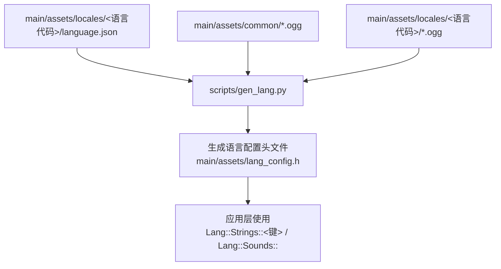
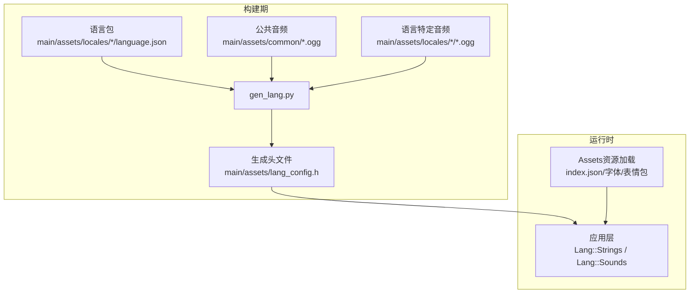
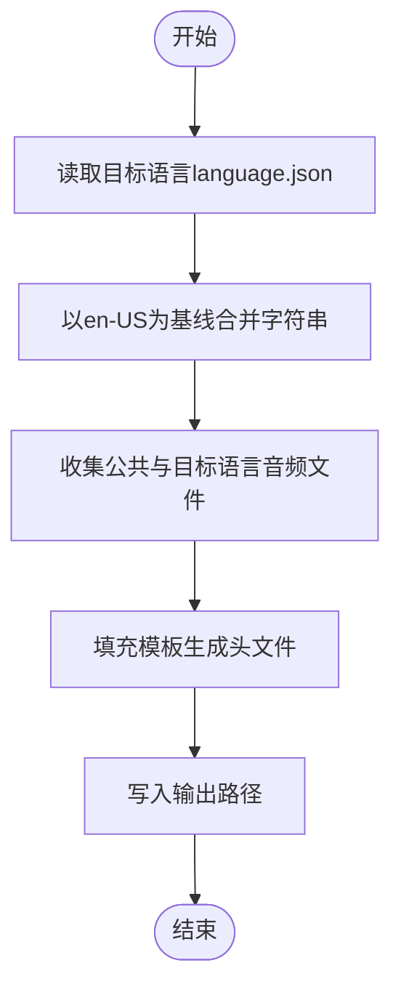
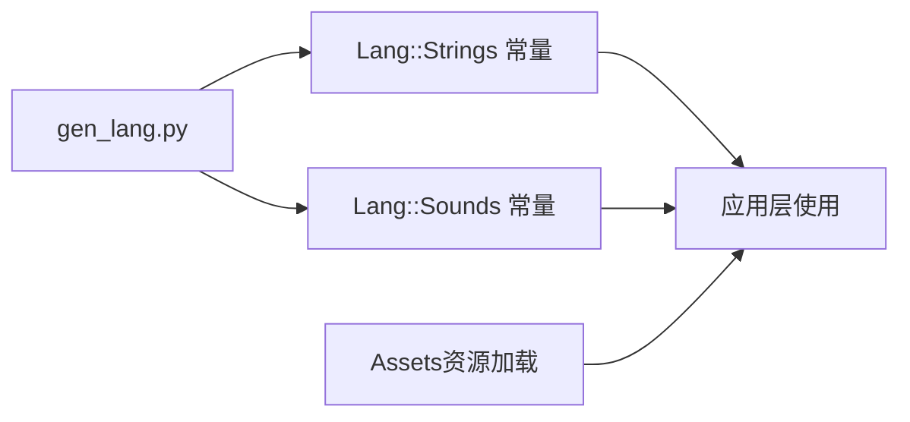

# 多语言支持

<cite>
**本文引用的文件**
- [scripts/gen_lang.py](file://scripts/gen_lang.py)
- [main/assets.cc](file://main/assets.cc)
- [main/assets/locales/zh-CN/language.json](file://main/assets/locales/zh-CN/language.json)
- [main/assets/locales/en-US/language.json](file://main/assets/locales/en-US/language.json)
- [main/assets/locales/ar-SA/language.json](file://main/assets/locales/ar-SA/language.json)
- [main/assets/locales/fr-FR/language.json](file://main/assets/locales/fr-FR/language.json)
- [README.md](file://README.md)
- [main/audio/README.md](file://main/audio/README.md)
</cite>

## 目录
1. [简介](#简介)
2. [项目结构](#项目结构)
3. [核心组件](#核心组件)
4. [架构总览](#架构总览)
5. [组件详解](#组件详解)
6. [依赖关系分析](#依赖关系分析)
7. [性能考量](#性能考量)
8. [故障排查指南](#故障排查指南)
9. [结论](#结论)
10. [附录](#附录)

## 简介
本文件面向XiaoZhi ESP32项目的多语言支持，系统性阐述本地化架构、语言包结构、资源组织、动态语言切换机制、语音合成与音频处理策略，并提供从语言包制作到系统集成的全流程指南。同时给出gen_lang.py脚本的使用方法、支持语言列表与区域设置、多语言测试与验证建议，以及多语言环境下音频处理优化策略。

## 项目结构
XiaoZhi ESP32在资源分区中集中存放多语言资产，语言包位于main/assets/locales/<语言代码>/language.json，音频资源位于main/assets/common与各语言目录下。构建期通过gen_lang.py将语言包与音频资源打包为C++头文件，供应用层直接使用。

图表来源
- [scripts/gen_lang.py](file://scripts/gen_lang.py#L53-L175)
- [main/assets/locales/zh-CN/language.json](file://main/assets/locales/zh-CN/language.json#L1-L59)
- [main/assets/locales/en-US/language.json](file://main/assets/locales/en-US/language.json#L1-L59)

章节来源
- [README.md](file://README.md#L33-L34)
- [main/assets.cc](file://main/assets.cc#L19-L70)

## 核心组件
- 语言包与资源
  - 文本资源：language.json包含language.type与strings键值对，键名统一大写，值为对应语言的文本。
  - 音频资源：各语言目录与公共目录下存放.ogg音频文件，键名由文件名派生（去扩展名并转为大写前缀OGG_）。
- 生成器gen_lang.py
  - 以en-US为基线，合并用户语言包，缺失键回退至en-US。
  - 收集各语言与公共目录的音频文件，生成对应的std::string_view常量，优先使用用户语言音频，否则回退至en-US或公共音频。
  - 输出C++头文件，命名空间为Lang，包含Lang::Strings与Lang::Sounds两部分。
- 资源加载与应用
  - 应用通过Assets类从SPIFFS/分区中加载index.json与字体、表情包等资源；语言配置头文件在编译期生成，运行时直接使用常量。
  - 语言切换通过重新生成目标语言的配置头文件并重新烧录固件实现（见“动态语言切换”）。

章节来源
- [scripts/gen_lang.py](file://scripts/gen_lang.py#L32-L175)
- [main/assets.cc](file://main/assets.cc#L19-L70)

## 架构总览
多语言系统采用“构建期生成+运行时静态访问”的架构：构建期将语言包与音频资源转换为C++常量，运行时通过命名空间Lang直接访问，避免运行时解析成本。

图表来源
- [scripts/gen_lang.py](file://scripts/gen_lang.py#L53-L175)
- [main/assets.cc](file://main/assets.cc#L19-L70)

## 组件详解

### 语言包结构与制作流程
- 结构规范
  - language.json必须包含language.type与strings对象。strings键名统一大写，值为该语言的文本。
  - 示例参考：zh-CN、en-US、ar-SA、fr-FR等语言包。
- 制作流程
  - 创建目录main/assets/locales/<语言代码>/language.json。
  - 编写strings键值对，确保键名与en-US一致以便回退。
  - 准备音频文件：将同名.ogg放入对应语言目录或公共目录；若语言目录无对应音频，则回退至en-US或公共目录。
  - 使用gen_lang.py生成配置头文件，随后编译固件。
- 键名与命名约定
  - 文本键名：全大写，如WARNING、ERROR、LOADING_PROTOCOL等。
  - 音频键名：基于文件名（不含扩展名），转为大写并加OGG_前缀，如exclamation.ogg对应OGG_EXCLAMATION。

章节来源
- [main/assets/locales/zh-CN/language.json](file://main/assets/locales/zh-CN/language.json#L1-L59)
- [main/assets/locales/en-US/language.json](file://main/assets/locales/en-US/language.json#L1-L59)
- [main/assets/locales/ar-SA/language.json](file://main/assets/locales/ar-SA/language.json#L1-L59)
- [main/assets/locales/fr-FR/language.json](file://main/assets/locales/fr-FR/language.json#L1-L59)

### gen_lang.py使用指南
- 功能概览
  - 读取目标语言language.json，以en-US为基线进行字符串合并与回退。
  - 扫描公共目录与目标语言目录的音频文件，生成Lang::Sounds常量。
  - 输出C++头文件，包含Lang::Strings与Lang::Sounds命名空间。
- 运行方式
  - 命令行参数：--language指定语言代码（如zh-CN、en-US、ja-JP），--output指定输出头文件路径。
  - 生成逻辑：自动推导项目路径，定位assets目录与locales目录，按约定生成头文件。
- 输出内容
  - Lang::Strings命名空间：每个键名生成一个constexpr const char*常量。
  - Lang::Sounds命名空间：每个音频文件生成extern与std::string_view常量，优先使用目标语言音频，否则回退至en-US或公共音频。

图表来源
- [scripts/gen_lang.py](file://scripts/gen_lang.py#L53-L175)

章节来源
- [scripts/gen_lang.py](file://scripts/gen_lang.py#L176-L187)

### 动态语言切换机制
- 当前实现
  - 语言切换通过重新生成目标语言的配置头文件并重新烧录固件实现，属于“构建期切换”。
  - 运行时通过Lang命名空间直接访问字符串与音频常量，无需额外查找。
- 推荐实践
  - 在CI中为每种语言生成独立的固件镜像，便于用户选择语言版本。
  - 若需真正“运行时切换”，可在现有基础上增加运行时语言包加载与缓存机制，但需评估内存与性能开销。

章节来源
- [scripts/gen_lang.py](file://scripts/gen_lang.py#L82-L100)
- [main/assets.cc](file://main/assets.cc#L19-L70)

### 语音合成与音频处理
- 语音合成
  - 项目采用流式ASR+LLM+TTS架构，语音合成由云端模型完成，设备侧负责播放与交互。
  - 多语言TTS通常依赖模型内建的语言/音色能力，设备侧无需对不同语言做特殊处理。
- 音频播放与回放
  - 音频服务模块负责编码/解码、播放队列与硬件编解码器对接，确保实时性与低延迟。
  - 多语言场景下，设备侧主要处理音频播放与事件音效，不涉及语音合成的音素转换与语调调节。

章节来源
- [main/audio/README.md](file://main/audio/README.md#L1-L88)

### 支持语言与区域设置
- 已有语言包示例
  - zh-CN、en-US、ar-SA、fr-FR等，均包含完整的language.json与若干音频文件。
- 区域设置
  - 语言代码遵循BCP 47风格（如zh-CN、en-US、ar-SA、fr-FR），用于区分语言与地区变体。
- 新增语言流程
  - 在main/assets/locales/<新语言代码>/创建language.json，键名与en-US保持一致。
  - 准备同名音频文件至对应语言目录或公共目录。
  - 运行gen_lang.py生成头文件并编译固件。

章节来源
- [main/assets/locales/zh-CN/language.json](file://main/assets/locales/zh-CN/language.json#L1-L59)
- [main/assets/locales/en-US/language.json](file://main/assets/locales/en-US/language.json#L1-L59)
- [main/assets/locales/ar-SA/language.json](file://main/assets/locales/ar-SA/language.json#L1-L59)
- [main/assets/locales/fr-FR/language.json](file://main/assets/locales/fr-FR/language.json#L1-L59)

### 本地化测试与验证
- 文本一致性
  - 对比各语言strings键名与en-US是否一致，确保回退路径有效。
  - 验证缺失键是否正确回退至en-US。
- 音频完整性
  - 检查目标语言目录与公共目录的音频文件是否齐全，确认Lang::Sounds常量生成正确。
- 用户体验
  - 在目标语言设备上验证UI文本显示、事件音效播放与整体交互流畅度。
  - 针对RTL语言（如ar-SA）检查界面布局与文本渲染。

章节来源
- [scripts/gen_lang.py](file://scripts/gen_lang.py#L82-L134)

## 依赖关系分析
- 语言包依赖
  - 目标语言language.json依赖en-US作为基线，缺失键回退。
  - 音频文件依赖公共目录与目标语言目录，生成Lang::Sounds常量。
- 运行时依赖
  - 应用层通过Lang命名空间访问字符串与音频常量。
  - 资源加载通过Assets类从分区读取index.json与字体、表情包等。

图表来源
- [scripts/gen_lang.py](file://scripts/gen_lang.py#L164-L175)
- [main/assets.cc](file://main/assets.cc#L19-L70)

章节来源
- [scripts/gen_lang.py](file://scripts/gen_lang.py#L53-L175)
- [main/assets.cc](file://main/assets.cc#L19-L70)

## 性能考量
- 构建期生成
  - 将语言包与音频资源预处理为C++常量，运行时直接访问，避免运行时解析与查找开销。
- 内存占用
  - 语言包与音频常量以只读形式驻留，需关注目标语言音频文件数量与大小对内存的影响。
- 实时性
  - 音频播放通过专用任务与队列实现，不受语言切换影响；多语言仅改变播放的音频文件。

章节来源
- [main/audio/README.md](file://main/audio/README.md#L14-L21)

## 故障排查指南
- 语言包缺失
  - 现象：运行时报错或文本显示为空。
  - 排查：确认language.json存在且结构正确；检查键名是否与en-US一致。
- 音频文件缺失
  - 现象：事件音效无声或回退异常。
  - 排查：确认对应语言目录与公共目录的音频文件存在；检查文件名与Lang::Sounds常量是否匹配。
- 生成器错误
  - 现象：gen_lang.py报错或未生成头文件。
  - 排查：检查输入路径、语言代码与输出路径；查看en-US基础文件是否存在。

章节来源
- [scripts/gen_lang.py](file://scripts/gen_lang.py#L69-L78)
- [scripts/gen_lang.py](file://scripts/gen_lang.py#L182-L187)

## 结论
XiaoZhi ESP32的多语言支持采用“构建期生成+运行时静态访问”的高效架构，通过gen_lang.py实现语言包与音频资源的自动化打包，结合Assets资源加载机制，确保多语言UI与音效的稳定呈现。建议在CI中为每种语言生成独立固件，并在发布前完成文本一致性与音频完整性验证，以保障用户体验。

## 附录
- 新语言添加步骤
  - 在main/assets/locales/<新语言代码>/创建language.json，键名与en-US保持一致。
  - 准备同名音频文件至对应语言目录或公共目录。
  - 运行gen_lang.py生成头文件并编译固件。
  - 在CI中为该语言生成独立镜像并进行测试。

章节来源
- [scripts/gen_lang.py](file://scripts/gen_lang.py#L53-L175)
- [main/assets/locales/zh-CN/language.json](file://main/assets/locales/zh-CN/language.json#L1-L59)
- [main/assets/locales/en-US/language.json](file://main/assets/locales/en-US/language.json#L1-L59)