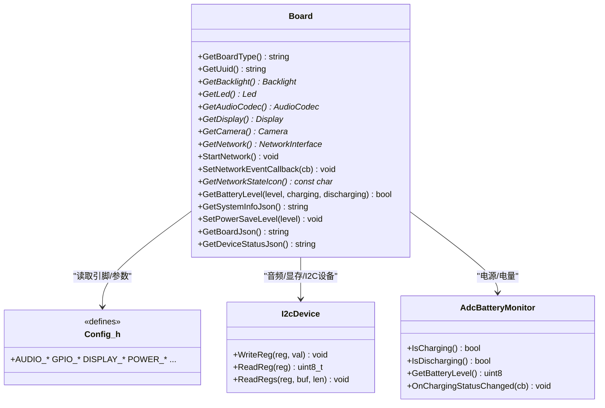
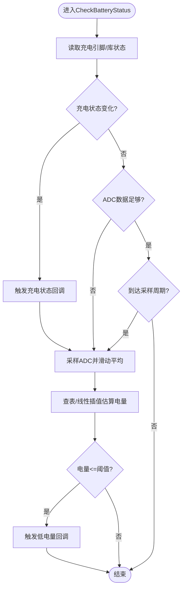

# 硬件配置

<cite>
**本文引用的文件**
- [main/boards/common/board.h](file://main/boards/common/board.h)
- [main/boards/common/board.cc](file://main/boards/common/board.cc)
- [main/boards/common/i2c_device.h](file://main/boards/common/i2c_device.h)
- [main/boards/common/i2c_device.cc](file://main/boards/common/i2c_device.cc)
- [main/boards/common/adc_battery_monitor.h](file://main/boards/common/adc_battery_monitor.h)
- [main/boards/common/adc_battery_monitor.cc](file://main/boards/common/adc_battery_monitor.cc)
- [main/boards/aipi-lite/config.h](file://main/boards/aipi-lite/config.h)
- [main/boards/xmini-c3/config.h](file://main/boards/xmini-c3/config.h)
- [main/boards/esp32s3-korvo2-v3/config.h](file://main/boards/esp32s3-korvo2-v3/config.h)
- [main/boards/esp32-cgc/config.h](file://main/boards/esp32-cgc/config.h)
- [main/boards/magiclick-c3/config.h](file://main/boards/magiclick-c3/config.h)
- [main/boards/esp-p4-function-ev-board/config.h](file://main/boards/esp-p4-function-ev-board/config.h)
- [main/boards/aipi-lite/power_manager.h](file://main/boards/aipi-lite/power_manager.h)
- [docs/custom-board.md](file://docs/custom-board.md)
</cite>

## 目录
1. [简介](#简介)
2. [项目结构](#项目结构)
3. [核心组件](#核心组件)
4. [架构总览](#架构总览)
5. [详细组件分析](#详细组件分析)
6. [依赖关系分析](#依赖关系分析)
7. [性能考量](#性能考量)
8. [故障排查指南](#故障排查指南)
9. [结论](#结论)
10. [附录](#附录)

## 简介
本文件面向XiaoZhi ESP32项目的硬件配置与平台适配，系统化阐述硬件抽象层（HAL）设计理念与Board基类的实现机制，覆盖GPIO引脚配置、外设初始化、电源管理、I2C设备访问、ADC电池监测等核心能力。同时，结合config.h中的参数结构，解析不同ESP32系列（ESP32-C3、ESP32-S3、ESP32-P4等）在引脚、显示、音频、电源等方面的差异化配置，并提供自定义硬件平台的创建流程、调试方法、最佳实践与兼容性检查清单。

## 项目结构
XiaoZhi采用“按板型分目录”的硬件配置组织方式：每个具体硬件平台位于main/boards/<platform>/目录下，包含config.h（硬件参数）、可选的power_manager.h（电源管理）、以及对应实现文件。公共硬件抽象位于main/boards/common/，提供Board基类、I2C设备封装、ADC电池监测等通用能力。

**图示来源**
- [main/boards/common/board.h](file://main/boards/common/board.h#L49-L85)
- [main/boards/common/board.cc](file://main/boards/common/board.cc#L15-L46)
- [main/boards/common/i2c_device.h](file://main/boards/common/i2c_device.h#L6-L16)
- [main/boards/common/i2c_device.cc](file://main/boards/common/i2c_device.cc#L8-L35)
- [main/boards/common/adc_battery_monitor.h](file://main/boards/common/adc_battery_monitor.h#L9-L28)
- [main/boards/common/adc_battery_monitor.cc](file://main/boards/common/adc_battery_monitor.cc#L3-L55)
- [main/boards/aipi-lite/config.h](file://main/boards/aipi-lite/config.h#L1-L54)
- [main/boards/xmini-c3/config.h](file://main/boards/xmini-c3/config.h#L1-L29)
- [main/boards/esp32s3-korvo2-v3/config.h](file://main/boards/esp32s3-korvo2-v3/config.h#L1-L81)
- [main/boards/esp32-cgc/config.h](file://main/boards/esp32-cgc/config.h#L1-L272)
- [main/boards/magiclick-c3/config.h](file://main/boards/magiclick-c3/config.h#L1-L48)
- [main/boards/esp-p4-function-ev-board/config.h](file://main/boards/esp-p4-function-ev-board/config.h#L1-L11)
- [main/boards/aipi-lite/power_manager.h](file://main/boards/aipi-lite/power_manager.h#L9-L187)

**章节来源**
- [main/boards/common/board.h](file://main/boards/common/board.h#L1-L93)
- [main/boards/common/board.cc](file://main/boards/common/board.cc#L1-L179)
- [main/boards/common/i2c_device.h](file://main/boards/common/i2c_device.h#L1-L19)
- [main/boards/common/i2c_device.cc](file://main/boards/common/i2c_device.cc#L1-L35)
- [main/boards/common/adc_battery_monitor.h](file://main/boards/common/adc_battery_monitor.h#L1-L31)
- [main/boards/common/adc_battery_monitor.cc](file://main/boards/common/adc_battery_monitor.cc#L1-L116)

## 核心组件
- Board基类与单例工厂
  - 提供统一的硬件抽象接口：获取板型、UUID、背光、LED、音频编解码器、显示、摄像头、网络接口、温度/电量查询、系统信息JSON、电源节省等级等。
  - 通过静态工厂函数create_board()与宏DECLARE_BOARD(...)实现具体板型实例化，确保全局唯一Board实例。
- I2C设备封装
  - I2cDevice对ESP-IDF I2C Master进行轻量封装，提供寄存器写入、单字节读取、多字节读取等常用操作。
- ADC电池监测
  - AdcBatteryMonitor基于ESP-IDF的adc_battery_estimation库与GPIO轮询，周期性采样并估算电池电量，支持充电状态回调。

**章节来源**
- [main/boards/common/board.h](file://main/boards/common/board.h#L49-L85)
- [main/boards/common/board.cc](file://main/boards/common/board.cc#L15-L46)
- [main/boards/common/i2c_device.h](file://main/boards/common/i2c_device.h#L6-L16)
- [main/boards/common/i2c_device.cc](file://main/boards/common/i2c_device.cc#L8-L35)
- [main/boards/common/adc_battery_monitor.h](file://main/boards/common/adc_battery_monitor.h#L9-L28)
- [main/boards/common/adc_battery_monitor.cc](file://main/boards/common/adc_battery_monitor.cc#L3-L55)

## 架构总览
下图展示Board基类如何被各平台config.h定义的引脚与外设参数驱动，以及I2C与ADC模块如何作为通用能力被具体板型复用。

**图示来源**
- [main/boards/common/board.h](file://main/boards/common/board.h#L49-L85)
- [main/boards/common/i2c_device.h](file://main/boards/common/i2c_device.h#L6-L16)
- [main/boards/common/adc_battery_monitor.h](file://main/boards/common/adc_battery_monitor.h#L9-L28)
- [main/boards/aipi-lite/config.h](file://main/boards/aipi-lite/config.h#L1-L54)

## 详细组件分析

### Board基类与单例工厂
- 设计要点
  - 单例模式：GetInstance()通过create_board()返回全局唯一Board实例，避免重复初始化。
  - 统一接口：所有硬件能力通过纯虚函数暴露，具体板型只需实现必要接口。
  - UUID生成：首次运行生成随机UUID并持久化，便于设备识别。
  - 系统信息JSON：聚合芯片信息、分区表、OTA分区、应用信息与板型特定信息。
- 关键路径
  - 构造函数读取持久化UUID，不存在则生成并保存。
  - GetSystemInfoJson()动态拼装JSON，包含语言、闪存大小、最小空闲堆、MAC、UUID、芯片型号与修订、应用版本与编译时间、分区表、当前运行分区标签、显示宽高与是否单色、以及板型JSON。

**图示来源**
- [main/boards/common/board.cc](file://main/boards/common/board.cc#L15-L46)
- [main/boards/common/board.cc](file://main/boards/common/board.cc#L70-L178)

**章节来源**
- [main/boards/common/board.h](file://main/boards/common/board.h#L49-L85)
- [main/boards/common/board.cc](file://main/boards/common/board.cc#L15-L46)
- [main/boards/common/board.cc](file://main/boards/common/board.cc#L70-L178)

### I2C设备封装（I2cDevice）
- 功能概述
  - 基于I2C Master Bus注册设备地址，封装寄存器读写与多字节读取。
  - 默认400kHz速率，7位地址长度，禁用ACK校验。
- 典型调用链
  - 构造时注册设备句柄；随后WriteReg/ReadReg/ReadRegs完成寄存器级访问。

**图示来源**
- [main/boards/common/i2c_device.cc](file://main/boards/common/i2c_device.cc#L8-L35)

**章节来源**
- [main/boards/common/i2c_device.h](file://main/boards/common/i2c_device.h#L6-L16)
- [main/boards/common/i2c_device.cc](file://main/boards/common/i2c_device.cc#L8-L35)

### ADC电池监测（AdcBatteryMonitor）
- 功能概述
  - 支持充电检测回调（若提供充电引脚），否则回退到GPIO读取。
  - 周期性定时器采样ADC，估算电池容量百分比，提供低电量状态变化回调。
- 参数与行为
  - 构造时配置ADC通道、衰减与位宽，建立周期定时器。
  - GetBatteryLevel()返回估算值；IsCharging()/IsDischarging()根据库状态或GPIO判定。
- 流程图

**图示来源**
- [main/boards/common/adc_battery_monitor.cc](file://main/boards/common/adc_battery_monitor.cc#L108-L116)
- [main/boards/aipi-lite/power_manager.h](file://main/boards/aipi-lite/power_manager.h#L27-L112)

**章节来源**
- [main/boards/common/adc_battery_monitor.h](file://main/boards/common/adc_battery_monitor.h#L9-L28)
- [main/boards/common/adc_battery_monitor.cc](file://main/boards/common/adc_battery_monitor.cc#L3-L55)
- [main/boards/common/adc_battery_monitor.cc](file://main/boards/common/adc_battery_monitor.cc#L68-L102)
- [main/boards/aipi-lite/power_manager.h](file://main/boards/aipi-lite/power_manager.h#L27-L112)

### config.h结构与字段解析
- 通用字段类别
  - 音频采样率与I2S引脚：AUDIO_INPUT_SAMPLE_RATE、AUDIO_OUTPUT_SAMPLE_RATE、AUDIO_I2S_GPIO_*。
  - 音频编解码器：AUDIO_CODEC_*（PA引脚、I2C引脚、器件地址）。
  - 按键与指示：BUILTIN_LED_GPIO、BOOT_BUTTON_GPIO、音量按键等。
  - 显示参数：DISPLAY_*（宽高、镜像/旋转/颜色顺序/偏移、SPI引脚与频率、背光引脚与极性）。
  - 电源与ADC：POWER_*（控制引脚、充电检测引脚、ADC单元与通道）。
- 平台差异示例
  - ESP32-C3（如xmini-c3、magiclick-c3）：通常使用较小分辨率OLED，引脚分布紧凑，背光可选。
  - ESP32-S3（如aipi-lite、esp32s3-korvo2-v3）：常带更大屏幕与更丰富的I2C/SPI引脚，支持双屏或多种LCD类型。
  - ESP32-P4（如esp-p4-function-ev-board）：采用官方BSP头文件集中定义引脚，简化配置。
- 示例字段路径
  - I2S引脚与编解码器地址：参见[aipi-lite/config.h](file://main/boards/aipi-lite/config.h#L11-L21)、[xmini-c3/config.h](file://main/boards/xmini-c3/config.h#L9-L18)、[magiclick-c3/config.h](file://main/boards/magiclick-c3/config.h#L9-L18)。
  - 显示参数与背光：参见[aipi-lite/config.h](file://main/boards/aipi-lite/config.h#L25-L45)、[esp32s3-korvo2-v3/config.h](file://main/boards/esp32s3-korvo2-v3/config.h#L29-L61)。
  - 电源与ADC：参见[aipi-lite/config.h](file://main/boards/aipi-lite/config.h#L47-L52)、[esp32-cgc/config.h](file://main/boards/esp32-cgc/config.h#L31-L48)。

**章节来源**
- [main/boards/aipi-lite/config.h](file://main/boards/aipi-lite/config.h#L1-L54)
- [main/boards/xmini-c3/config.h](file://main/boards/xmini-c3/config.h#L1-L29)
- [main/boards/magiclick-c3/config.h](file://main/boards/magiclick-c3/config.h#L1-L48)
- [main/boards/esp32s3-korvo2-v3/config.h](file://main/boards/esp32s3-korvo2-v3/config.h#L1-L81)
- [main/boards/esp32-cgc/config.h](file://main/boards/esp32-cgc/config.h#L1-L272)
- [main/boards/esp-p4-function-ev-board/config.h](file://main/boards/esp-p4-function-ev-board/config.h#L1-L11)

### 不同硬件平台的配置差异
- ESP32-C3系列
  - 引脚布局紧凑，常见OLED屏幕与简单按键；I2S与编解码器引脚组合相对固定。
  - 示例：xmini-c3、magiclick-c3的config.h展示了典型C3引脚分配。
- ESP32-S3系列
  - 更丰富的显示选项与I2C/SPI资源，支持多款LCD控制器与不同尺寸。
  - 示例：aipi-lite提供SPI/OLED配置；esp32s3-korvo2-v3支持ST7789/ILI9341等多配置宏。
- ESP32-P4系列
  - 使用官方BSP头文件集中定义引脚，config.h仅保留少量覆盖项，降低维护成本。
  - 示例：esp-p4-function-ev-board引入BSP头文件并覆盖背光极性等细节。

**章节来源**
- [main/boards/xmini-c3/config.h](file://main/boards/xmini-c3/config.h#L1-L29)
- [main/boards/magiclick-c3/config.h](file://main/boards/magiclick-c3/config.h#L1-L48)
- [main/boards/aipi-lite/config.h](file://main/boards/aipi-lite/config.h#L1-L54)
- [main/boards/esp32s3-korvo2-v3/config.h](file://main/boards/esp32s3-korvo2-v3/config.h#L1-L81)
- [main/boards/esp-p4-function-ev-board/config.h](file://main/boards/esp-p4-function-ev-board/config.h#L1-L11)

### 自定义硬件平台的创建流程
- 步骤概览
  - 新建目录：在main/boards/<your_board>/下创建config.h与可选的power_manager.h。
  - 编写config.h：定义音频、显示、按键、电源等引脚与参数；参考现有平台的字段命名与取值范围。
  - 实现Board子类：在对应cc文件中实现Board接口（至少实现GetBoardType、GetAudioCodec、GetDisplay、GetNetwork等），并在末尾使用DECLARE_BOARD(YourBoardClass)导出工厂函数。
  - 集成电源管理：如需ADC电量与充电检测，可复用AdcBatteryMonitor或实现类似PowerManager。
  - JSON输出：Board::GetBoardJson()由具体板型实现，用于系统信息上报。
- 参考文档
  - 自定义板型指南：参见[docs/custom-board.md](file://docs/custom-board.md)。

**章节来源**
- [main/boards/common/board.h](file://main/boards/common/board.h#L87-L90)
- [docs/custom-board.md](file://docs/custom-board.md)

## 依赖关系分析
- 板型到Board的依赖
  - 各平台通过config.h向Board暴露引脚与能力；Board统一对外提供接口。
- Board到通用模块的依赖
  - Board依赖I2C与ADC模块以实现编解码器与电源监控。
- 外部依赖
  - ESP-IDF I2C Master、ADC OneShot/Estimation、定时器、日志等。

**图示来源**
- [main/boards/common/board.h](file://main/boards/common/board.h#L49-L85)
- [main/boards/common/i2c_device.h](file://main/boards/common/i2c_device.h#L6-L16)
- [main/boards/common/adc_battery_monitor.h](file://main/boards/common/adc_battery_monitor.h#L9-L28)

**章节来源**
- [main/boards/common/board.h](file://main/boards/common/board.h#L49-L85)
- [main/boards/common/i2c_device.h](file://main/boards/common/i2c_device.h#L6-L16)
- [main/boards/common/adc_battery_monitor.h](file://main/boards/common/adc_battery_monitor.h#L9-L28)

## 性能考量
- I2C速率与稳定性
  - 默认400kHz，确保在噪声环境下稳定通信；必要时降低速率或增加上拉电阻。
- ADC采样策略
  - 采用滑动窗口与周期定时器，平衡精度与CPU占用；合理设置采样间隔与数据点数量。
- 显示刷新与背光
  - SPI频率与像素格式影响帧率；背光PWM频率避免可见频闪。
- 电源管理
  - 合理设置低电量阈值与回调，配合系统省电模式降低功耗。

## 故障排查指南
- 引脚冲突与未定义
  - 症状：编译报错或运行异常。
  - 排查：确认config.h中GPIO定义与实际硬件一致；检查是否有重复定义。
- I2C设备无法通信
  - 症状：读写寄存器失败。
  - 排查：核对设备地址、SDA/SCL引脚、上拉电阻与速率；使用示波器确认时序。
- 电量显示异常
  - 症状：电量为0或恒定不变。
  - 排查：检查充电引脚配置与ADC分压电路；确认定时器与估算库初始化成功。
- 显示异常
  - 症状：花屏、方向错误、亮度异常。
  - 排查：核对DISPLAY_*参数（宽高、镜像、交换XY、颜色顺序、偏移、背光极性）与SPI引脚映射。
- 网络事件回调不触发
  - 症状：WiFi状态无更新。
  - 排查：确认SetNetworkEventCallback已正确设置；检查网络接口实现与事件源。

## 结论
XiaoZhi的硬件抽象层通过Board基类与config.h参数化配置，实现了跨ESP32系列的统一硬件接口与灵活的平台适配。借助I2C与ADC通用模块，开发者可以快速集成音频、显示与电源管理功能。遵循本文档的配置规范、调试方法与最佳实践，可显著提升开发效率与产品可靠性。

## 附录
- 硬件兼容性检查清单
  - 引脚定义：I2S、I2C、SPI、背光、按键、电源控制引脚均在config.h中明确定义且未冲突。
  - 外设参数：显示宽高、镜像/旋转/颜色顺序、偏移与SPI频率符合面板规格。
  - 电源电路：ADC分压与充电检测引脚连接正确，定时器与估算库初始化成功。
  - 系统信息：GetSystemInfoJson与GetBoardJson输出完整且可解析。
- 最佳实践
  - 电源设计：选用合适限流电阻与滤波电容，确保ADC采样精度；为I2C总线配置合适上拉电阻。
  - 信号完整性：短路径布线，避免长环路；I2C与SPI走线尽量靠近地平面。
  - EMC考虑：合理布局去耦电容，屏蔽敏感信号线；必要时增加磁珠或共模电感。