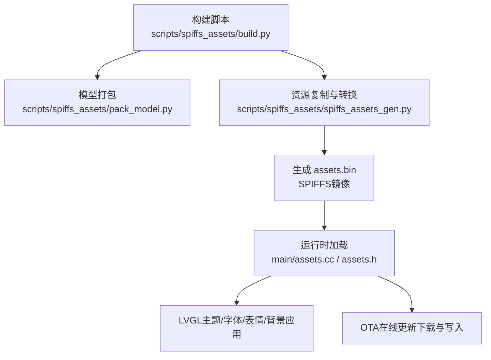
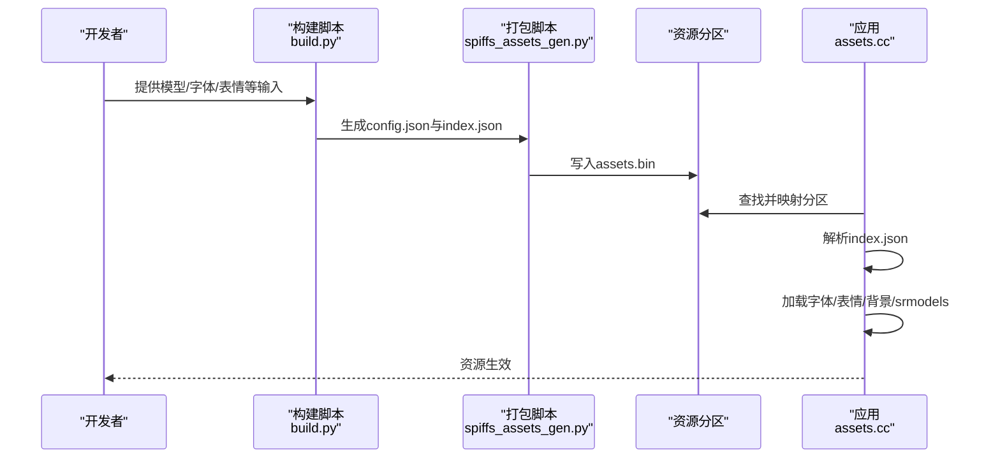
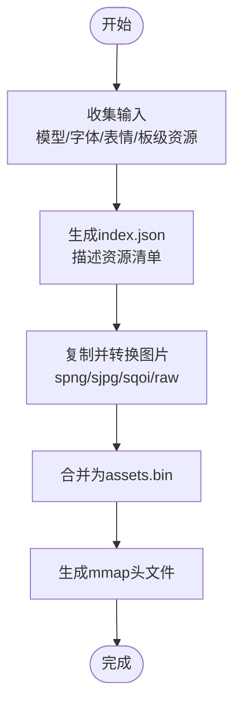
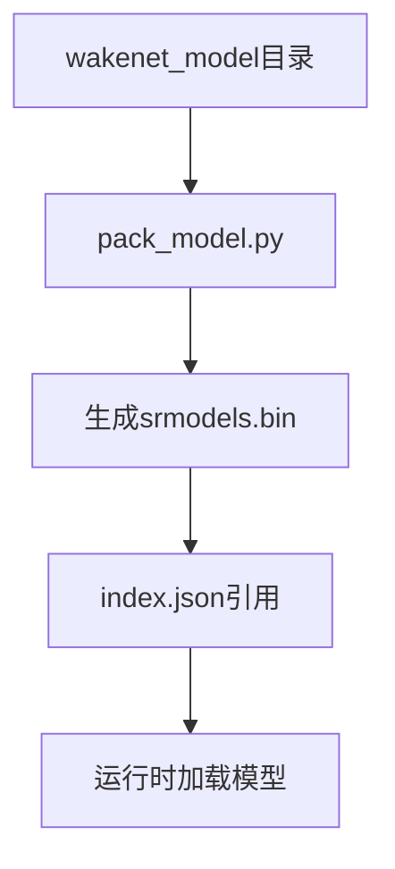
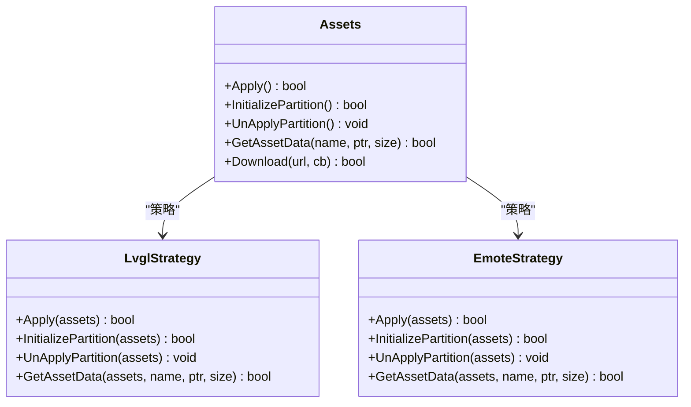
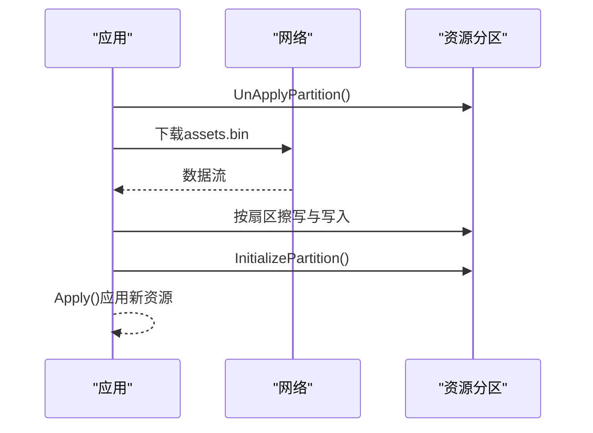
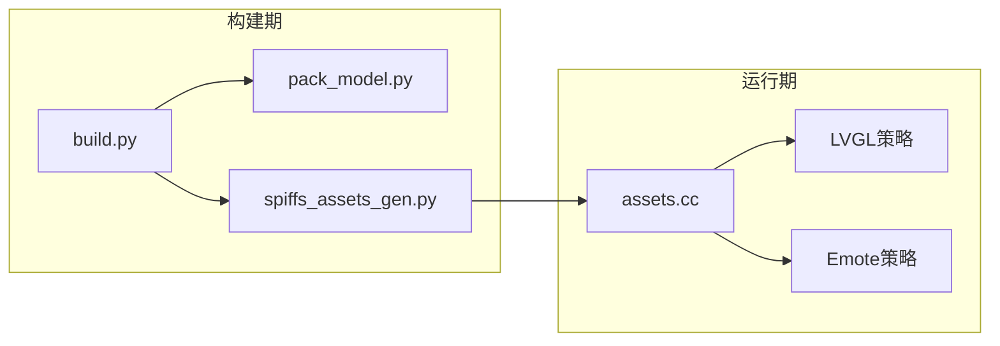

# 自定义资产

<cite>
**本文档引用的文件**
- [main/assets.cc](file://main/assets.cc)
- [main/assets.h](file://main/assets.h)
- [scripts/spiffs_assets/build.py](file://scripts/spiffs_assets/build.py)
- [scripts/spiffs_assets/spiffs_assets_gen.py](file://scripts/spiffs_assets/spiffs_assets_gen.py)
- [scripts/spiffs_assets/pack_model.py](file://scripts/spiffs_assets/pack_model.py)
- [scripts/build_default_assets.py](file://scripts/build_default_assets.py)
- [scripts/gen_lang.py](file://scripts/gen_lang.py)
- [main/assets/locales/en-US/language.json](file://main/assets/locales/en-US/language.json)
- [main/assets/locales/zh-CN/language.json](file://main/assets/locales/zh-CN/language.json)
- [main/assets/common/exclamation.ogg](file://main/assets/common/exclamation.ogg)
- [README.md](file://README.md)
</cite>

## 目录
1. [简介](#简介)
2. [项目结构](#项目结构)
3. [核心组件](#核心组件)
4. [架构总览](#架构总览)
5. [详细组件分析](#详细组件分析)
6. [依赖关系分析](#依赖关系分析)
7. [性能考量](#性能考量)
8. [故障排查指南](#故障排查指南)
9. [结论](#结论)
10. [附录](#附录)

## 简介
本文件面向XiaoZhi ESP32项目的“自定义资产”制作与部署，系统性阐述assets资源系统的设计与实现，涵盖以下主题：
- 资源打包与SPIFFS镜像生成流程
- 动态加载策略与内存映射机制
- 唤醒词资源的制作与模型打包
- 字体资源（TTF到LVGL字体）生成与多语言支持
- 表情符号与聊天背景的制作规范
- 本地化资源管理与动态切换
- 资源工具链使用指南与自动化部署

## 项目结构
XiaoZhi ESP32通过脚本将多种资源打包为二进制镜像，并在运行时通过内存映射或分区挂载的方式动态读取。关键目录与文件如下：
- main/assets：运行时资源存放位置（字体、表情、音效、本地化语言包）
- scripts/spiffs_assets：资源打包与SPIFFS镜像生成工具链
- main/assets.cc / main/assets.h：运行时资源加载与应用逻辑
- main/assets/locales：多语言字符串与音效资源
- main/assets/common：通用音效资源

图表来源
- [scripts/spiffs_assets/build.py](file://scripts/spiffs_assets/build.py#L340-L397)
- [scripts/spiffs_assets/spiffs_assets_gen.py](file://scripts/spiffs_assets/spiffs_assets_gen.py#L534-L589)
- [main/assets.cc](file://main/assets.cc#L53-L560)

章节来源
- [README.md](file://README.md#L1-L174)

## 核心组件
- 运行时资源管理器（Assets）
  - 提供资源分区查找、内存映射、校验与动态加载能力
  - 支持LVGL与非LVGL两种策略（EmoteStrategy）
  - 支持在线OTA资源下载与重初始化
- 资源打包工具链
  - build.py：聚合处理唤醒词模型、字体、表情等输入，生成index.json与config.json
  - spiffs_assets_gen.py：复制/转换资源、合并打包为assets.bin
  - pack_model.py：将多模型目录打包为srmodels.bin
- 默认资源生成器（build_default_assets.py）
  - 基于sdkconfig自动选择默认模型与字体，生成assets.bin
- 本地化语言生成器（gen_lang.py）
  - 以en-US为基线，按语言包覆盖生成C++头文件，支持音效二进制嵌入

章节来源
- [main/assets.h](file://main/assets.h#L23-L87)
- [main/assets.cc](file://main/assets.cc#L30-L65)
- [scripts/spiffs_assets/build.py](file://scripts/spiffs_assets/build.py#L340-L397)
- [scripts/spiffs_assets/spiffs_assets_gen.py](file://scripts/spiffs_assets/spiffs_assets_gen.py#L534-L589)
- [scripts/spiffs_assets/pack_model.py](file://scripts/spiffs_assets/pack_model.py#L41-L124)
- [scripts/build_default_assets.py](file://scripts/build_default_assets.py#L750-L800)
- [scripts/gen_lang.py](file://scripts/gen_lang.py#L53-L187)

## 架构总览
运行时资源系统采用“静态打包 + 动态加载”的双阶段架构：
- 构建期：脚本将资源复制到临时目录，按需转换为LVGL兼容格式，合并生成assets.bin；同时生成index.json描述资源清单
- 运行期：根据HAVE_LVGL宏选择策略，对assets分区进行内存映射或分区挂载，解析index.json，加载字体、表情、背景与srmodels

图表来源
- [scripts/spiffs_assets/build.py](file://scripts/spiffs_assets/build.py#L377-L382)
- [scripts/spiffs_assets/spiffs_assets_gen.py](file://scripts/spiffs_assets/spiffs_assets_gen.py#L534-L589)
- [main/assets.cc](file://main/assets.cc#L130-L185)

## 详细组件分析

### 资源打包与SPIFFS镜像生成
- 输入类型
  - 唤醒词模型目录（wakenet_model）：经pack_model.py打包为srmodels.bin
  - 文本字体文件（text_font）：直接复制到assets目录
  - 表情集合（emoji_collection）：复制PNG/GIF至assets，生成index.json条目
  - 板级资源（可选）：基于目标板配置加载表情、图标与布局
- 处理流程
  - build.py：复制/收集资源，生成index.json与config.json
  - spiffs_assets_gen.py：按配置复制并转换图片（支持spng/sjpg/sqoi/raw），最终合并为assets.bin
- 输出产物
  - assets.bin：SPIFFS镜像文件
  - mmap_generate_assets.h：资源索引头文件（用于运行时定位）

图表来源
- [scripts/spiffs_assets/build.py](file://scripts/spiffs_assets/build.py#L367-L378)
- [scripts/spiffs_assets/spiffs_assets_gen.py](file://scripts/spiffs_assets/spiffs_assets_gen.py#L534-L589)

章节来源
- [scripts/spiffs_assets/build.py](file://scripts/spiffs_assets/build.py#L48-L114)
- [scripts/spiffs_assets/spiffs_assets_gen.py](file://scripts/spiffs_assets/spiffs_assets_gen.py#L492-L589)

### 唤醒词资源制作流程
- 模型准备
  - 将wakenet模型目录作为输入，pack_model.py将其打包为srmodels.bin
- 打包策略
  - 递归遍历模型子目录，记录模型名、文件数、文件名与偏移，形成紧凑二进制结构
- 应用加载
  - 运行时通过index.json定位srmodels.bin，调用模型加载接口注入到音频服务

图表来源
- [scripts/spiffs_assets/pack_model.py](file://scripts/spiffs_assets/pack_model.py#L41-L124)
- [main/assets.cc](file://main/assets.cc#L71-L119)

章节来源
- [scripts/spiffs_assets/pack_model.py](file://scripts/spiffs_assets/pack_model.py#L41-L124)
- [main/assets.cc](file://main/assets.cc#L71-L119)

### 字体资源生成与多语言支持
- TTF到LVGL字体转换
  - spiffs_assets_gen.py根据配置将PNG/JPG转换为spng/sjpg/sqoi/raw等格式，适配LVGL渲染
- 多语言字符集支持
  - 语言包位于main/assets/locales/<lang>/language.json，包含字符串与音效键值
  - gen_lang.py以en-US为基线，按语言包覆盖生成C++头文件，支持音效二进制嵌入
- 字体渲染优化
  - 通过index.json的text_font字段指定字体文件，运行时加载并设置到LVGL主题

章节来源
- [scripts/spiffs_assets/spiffs_assets_gen.py](file://scripts/spiffs_assets/spiffs_assets_gen.py#L534-L589)
- [scripts/gen_lang.py](file://scripts/gen_lang.py#L53-L187)
- [main/assets/locales/en-US/language.json](file://main/assets/locales/en-US/language.json#L1-L59)
- [main/assets/locales/zh-CN/language.json](file://main/assets/locales/zh-CN/language.json#L1-L59)

### 表情符号与聊天背景制作规范
- 图像格式与尺寸
  - 支持PNG/JPG/GIF等格式，转换为spng/sjpg/sqoi/raw以提升渲染效率
  - 支持按split_height分块，便于大图渲染与内存控制
- 背景与表情引用
  - index.json的emoji_collection与skin字段描述表情与背景资源
  - 运行时解析并应用到LVGL主题

章节来源
- [scripts/spiffs_assets/spiffs_assets_gen.py](file://scripts/spiffs_assets/spiffs_assets_gen.py#L141-L174)
- [main/assets.cc](file://main/assets.cc#L262-L333)

### 本地化资源管理与动态切换
- 结构
  - main/assets/locales/<lang>/language.json：语言字符串与音效键
  - main/assets/common：通用音效资源（如exclamation.ogg）
- 生成与回退
  - gen_lang.py以en-US为基线，用户语言覆盖缺失项
  - 音效按语言优先，缺失回退至en-US或common目录
- 切换实现
  - 运行时根据当前语言加载对应资源，动态刷新UI文本与音效

章节来源
- [scripts/gen_lang.py](file://scripts/gen_lang.py#L32-L187)
- [main/assets/common/exclamation.ogg](file://main/assets/common/exclamation.ogg)

### 运行时资源加载与应用
- 分区与映射
  - 查找标签为“assets”的分区，LVGL策略下进行内存映射，非LVGL策略下通过分区挂载
- 校验与索引
  - 校验合并数据的CRC16，解析mmap表定位各资源偏移与尺寸
- 应用流程
  - 解析index.json，加载srmodels、字体、表情、背景与皮肤配置
  - 设置LVGL主题文本/背景色与背景图，刷新显示

图表来源
- [main/assets.h](file://main/assets.h#L48-L87)
- [main/assets.cc](file://main/assets.cc#L130-L185)
- [main/assets.cc](file://main/assets.cc#L359-L424)

章节来源
- [main/assets.h](file://main/assets.h#L23-L87)
- [main/assets.cc](file://main/assets.cc#L53-L356)

### OTA在线资源更新
- 流程
  - 断开当前分区映射
  - 通过HTTP下载新assets.bin，按扇区擦写与写入
  - 校验下载完整性，重新初始化分区并应用新资源
- 进度回调
  - 提供进度百分比与速率回调，便于UI反馈

图表来源
- [main/assets.cc](file://main/assets.cc#L426-L560)

章节来源
- [main/assets.cc](file://main/assets.cc#L426-L560)

## 依赖关系分析
- 脚本依赖
  - build.py依赖pack_model.py生成srmodels.bin
  - spiffs_assets_gen.py依赖Pillow、numpy等库进行图像处理与转换
- 运行时依赖
  - LVGL策略依赖spi_flash_mmap与cbin字体/图像类
  - EmoteStrategy依赖emote挂载接口

图表来源
- [scripts/spiffs_assets/build.py](file://scripts/spiffs_assets/build.py#L384-L392)
- [scripts/spiffs_assets/spiffs_assets_gen.py](file://scripts/spiffs_assets/spiffs_assets_gen.py#L534-L589)
- [main/assets.cc](file://main/assets.cc#L130-L185)

章节来源
- [scripts/spiffs_assets/build.py](file://scripts/spiffs_assets/build.py#L340-L397)
- [scripts/spiffs_assets/spiffs_assets_gen.py](file://scripts/spiffs_assets/spiffs_assets_gen.py#L534-L589)
- [main/assets.cc](file://main/assets.cc#L130-L185)

## 性能考量
- 图像转换
  - 使用spng/sjpg/sqoi/raw可显著降低存储与带宽占用，建议根据屏幕分辨率与帧率选择合适格式
  - 分块（split_height）有助于大图渲染与内存占用控制
- 校验与映射
  - 合并前计算CRC16，确保资源一致性
  - LVGL策略通过内存映射避免额外拷贝，提高加载速度
- OTA写入
  - 按扇区擦写减少写入次数，提高可靠性

## 故障排查指南
- 资源未生效
  - 检查index.json是否存在且格式正确
  - 确认assets.bin大小未超过分区容量
- 显示异常
  - 确认字体与表情文件名与index.json一致
  - 检查LVGL版本与转换脚本匹配
- OTA失败
  - 检查网络连通性与URL有效性
  - 关注进度回调日志，确认下载字节与分区大小匹配

章节来源
- [main/assets.cc](file://main/assets.cc#L164-L172)
- [scripts/spiffs_assets/spiffs_assets_gen.py](file://scripts/spiffs_assets/spiffs_assets_gen.py#L597-L601)
- [main/assets.cc](file://main/assets.cc#L426-L560)

## 结论
XiaoZhi ESP32的assets系统通过“构建期打包 + 运行时动态加载”的架构，实现了唤醒词、字体、表情、背景与本地化资源的统一管理。借助SPIFFS镜像与内存映射机制，系统在保证资源一致性的同时，兼顾了加载性能与OTA更新能力。遵循本文档的制作规范与工具链使用指南，可高效完成自定义资产的开发与部署。

## 附录

### 工具链使用指南
- 构建默认资源
  - 依据sdkconfig自动选择模型与字体，生成assets.bin
- 自定义资源打包
  - 使用build.py聚合输入，生成index.json与config.json，再由spiffs_assets_gen.py生成assets.bin
- 语言资源生成
  - 使用gen_lang.py生成语言头文件，支持en-US回退与音效嵌入

章节来源
- [scripts/build_default_assets.py](file://scripts/build_default_assets.py#L750-L800)
- [scripts/spiffs_assets/build.py](file://scripts/spiffs_assets/build.py#L340-L397)
- [scripts/gen_lang.py](file://scripts/gen_lang.py#L53-L187)