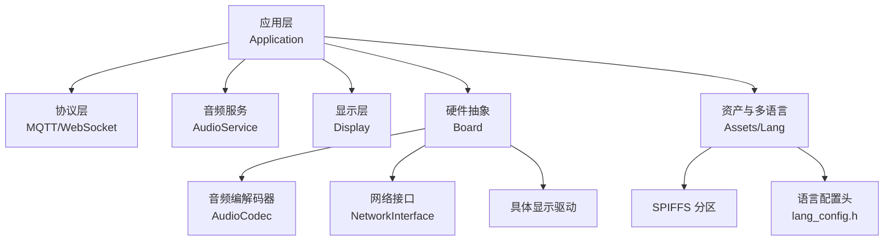
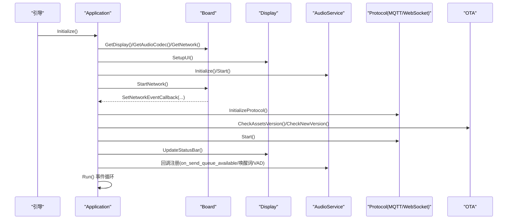
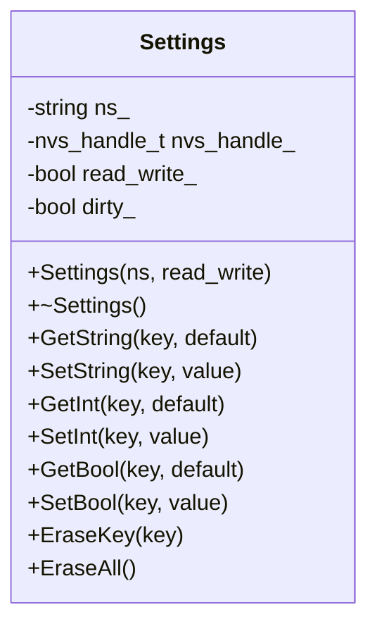
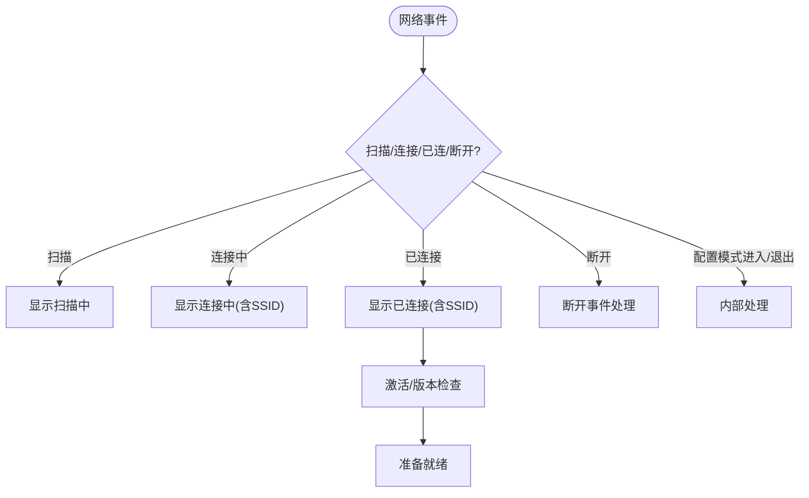
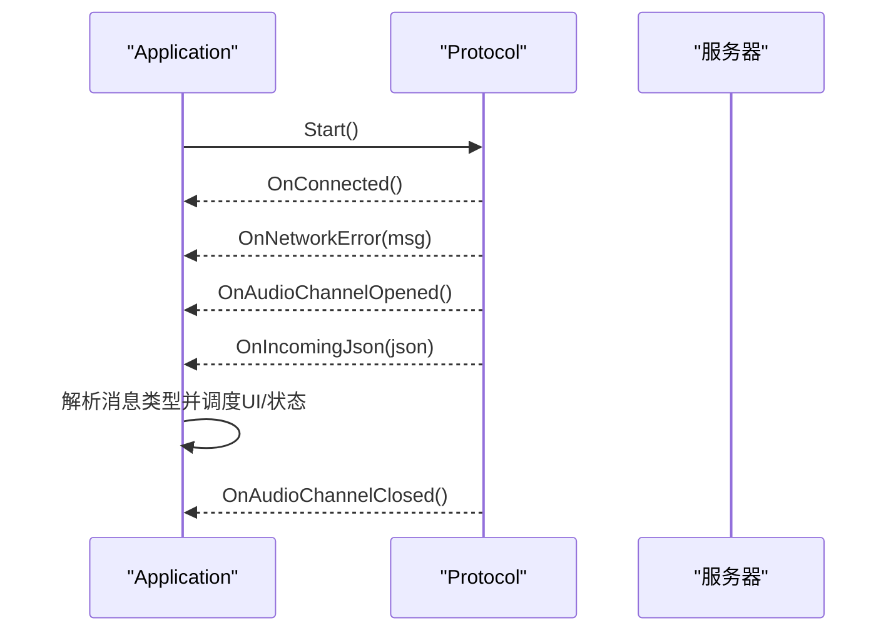
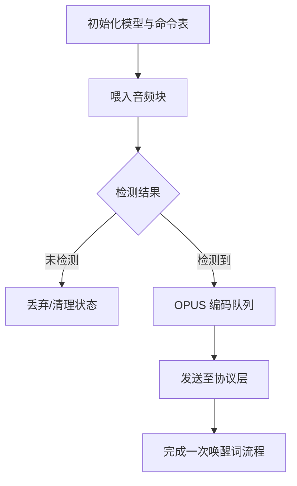
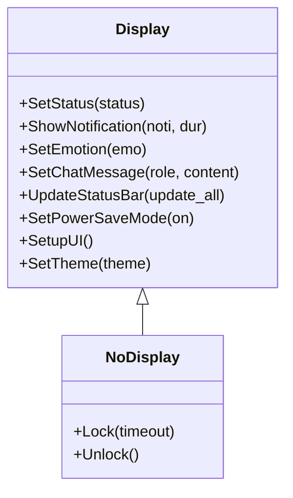
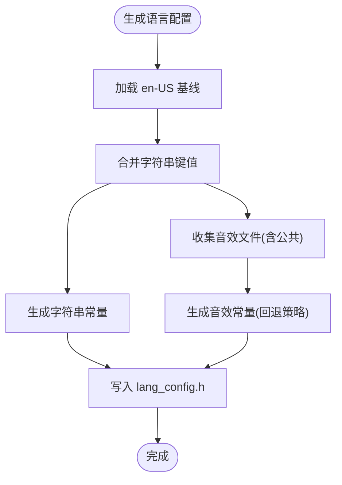
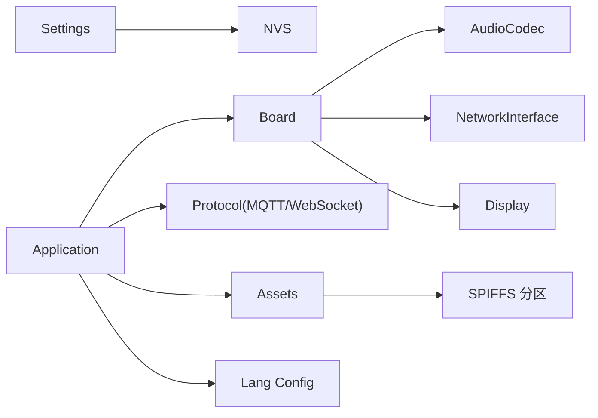

# 配置与定制

<cite>
**本文引用的文件**
- [settings.h](file://main/settings.h)
- [settings.cc](file://main/settings.cc)
- [application.h](file://main/application.h)
- [application.cc](file://main/application.cc)
- [assets.h](file://main/assets.h)
- [board.h](file://main/boards/common/board.h)
- [board.cc](file://main/boards/common/board.cc)
- [gen_lang.py](file://scripts/gen_lang.py)
- [config.json（aipi-lite）](file://main/boards/aipi-lite/config.json)
- [custom_wake_word.h](file://main/audio/wake_words/custom_wake_word.h)
- [custom_wake_word.cc](file://main/audio/wake_words/custom_wake_word.cc)
- [display.h](file://main/display/display.h)
- [sdkconfig.defaults（示例）](file://sdkconfig.defaults.esp32s3)
</cite>

## 目录
1. [简介](#简介)
2. [项目结构](#项目结构)
3. [核心组件](#核心组件)
4. [架构总览](#架构总览)
5. [详细组件分析](#详细组件分析)
6. [依赖关系分析](#依赖关系分析)
7. [性能考虑](#性能考虑)
8. [故障排除指南](#故障排除指南)
9. [结论](#结论)
10. [附录](#附录)

## 简介
本文件面向系统管理员与高级用户，提供 XiaoZhi ESP32 项目的“配置与定制”深度指南。内容涵盖：
- 运行时参数与配置项的读写与持久化
- WiFi、通信协议（MQTT/WebSocket）、音频参数、显示配置等可调参数
- 自定义资产（唤醒词、字体、表情、聊天背景等）的生成与部署流程
- 硬件配置文件结构与新硬件平台的适配方法
- 多语言支持机制与本地化资源管理
- 配置验证与测试方法、常见问题排查与性能优化建议

## 项目结构
XiaoZhi ESP32 采用模块化设计，关键配置与定制点分布在以下区域：
- 应用层：应用初始化、事件循环、状态机、协议选择与回调
- 存储层：基于 NVS 的键值配置读写
- 硬件抽象层：Board 抽象与各硬件平台实现
- 资产与多语言：SPIFFS 分区资产、语言包生成与回退策略
- 音频与唤醒词：唤醒词模型与编码流程
- 显示层：统一 UI 接口与主题能力

图表来源
- [application.cc](file://main/application.cc#L61-L163)
- [board.h](file://main/boards/common/board.h#L49-L85)
- [assets.h](file://main/assets.h#L23-L87)

章节来源
- [application.cc](file://main/application.cc#L61-L163)
- [board.h](file://main/boards/common/board.h#L49-L85)
- [assets.h](file://main/assets.h#L23-L87)

## 核心组件
- 配置存储（Settings）
  - 提供字符串、整型、布尔型键值读写，基于 NVS 持久化
  - 支持按命名空间隔离与批量擦除
- 应用主控（Application）
  - 初始化显示、音频、网络、协议；事件驱动的状态机与 UI 更新
  - 协议选择逻辑（MQTT 或 WebSocket），OTA 激活与版本检查
- 硬件抽象（Board）
  - 设备 UUID 生成与持久化、系统信息 JSON 输出、电源策略
- 资产与多语言（Assets/Lang）
  - SPIFFS 分区资产管理与应用、语言包生成脚本与回退策略
- 音频与唤醒词（CustomWakeWord）
  - 唤醒词模型加载、阈值与持续时间配置、OPUS 编码与队列管理
- 显示层（Display）
  - 统一 UI 接口：状态栏、通知、表情、聊天消息、主题切换

章节来源
- [settings.h](file://main/settings.h#L7-L26)
- [settings.cc](file://main/settings.cc#L8-L109)
- [application.h](file://main/application.h#L42-L172)
- [application.cc](file://main/application.cc#L23-L51)
- [board.h](file://main/boards/common/board.h#L49-L85)
- [board.cc](file://main/boards/common/board.cc#L15-L46)
- [assets.h](file://main/assets.h#L23-L87)
- [custom_wake_word.h](file://main/audio/wake_words/custom_wake_word.h#L20-L69)
- [custom_wake_word.cc](file://main/audio/wake_words/custom_wake_word.cc#L85-L129)
- [display.h](file://main/display/display.h#L28-L61)

## 架构总览
应用启动流程与关键交互如下：

图表来源
- [application.cc](file://main/application.cc#L61-L163)
- [application.cc](file://main/application.cc#L473-L610)
- [board.cc](file://main/boards/common/board.cc#L15-L46)

章节来源
- [application.cc](file://main/application.cc#L61-L163)
- [application.cc](file://main/application.cc#L473-L610)

## 详细组件分析

### 配置存储与运行时参数
- 键值类型与命名空间
  - 字符串、整型、布尔型三类键值
  - 通过命名空间隔离不同模块（如“assets”、“board”）
- 写入与提交
  - 写入仅在读写模式下生效，退出析构时自动提交
- 典型用途
  - 资产下载 URL、设备 UUID、唤醒词阈值、监听模式等

图表来源
- [settings.h](file://main/settings.h#L7-L26)
- [settings.cc](file://main/settings.cc#L8-L109)

章节来源
- [settings.h](file://main/settings.h#L7-L26)
- [settings.cc](file://main/settings.cc#L8-L109)

### WiFi 与网络配置
- 网络事件回调
  - 扫描、连接中、已连接、断开、WiFi 配置模式进入/退出、蜂窝模组事件
- UI 展示与状态栏更新
  - 根据事件动态更新通知与状态栏
- 功耗策略
  - 连接/断开时切换电源保存等级

图表来源
- [application.cc](file://main/application.cc#L102-L156)
- [application.cc](file://main/application.cc#L261-L297)

章节来源
- [application.cc](file://main/application.cc#L102-L156)
- [application.cc](file://main/application.cc#L261-L297)

### 通信协议配置（MQTT/WebSocket）
- 协议选择
  - 根据 OTA 配置决定使用 MQTT 或 WebSocket，默认回退到 MQTT
- 连接与错误处理
  - 成功连接后关闭告警；网络错误触发错误事件
- 音频通道
  - 打开/关闭音频通道时切换电源保存等级
- 服务器消息分发
  - TTS/STT/LLM/MCP/System/自定义消息等类型解析与 UI 响应

图表来源
- [application.cc](file://main/application.cc#L473-L610)

章节来源
- [application.cc](file://main/application.cc#L473-L610)

### 音频参数与唤醒词配置
- 唤醒词模型与参数
  - 从资产索引加载模型配置（语言、持续时间、阈值、命令表）
  - 支持内置配置与外部模型两种方式
- 数据流与编码
  - 实时喂入音频块，检测到唤醒词后进行 OPUS 编码并排队发送
- 参数调优
  - 阈值、检测窗口、命令词集合可通过配置文件与构建选项控制

图表来源
- [custom_wake_word.cc](file://main/audio/wake_words/custom_wake_word.cc#L37-L82)
- [custom_wake_word.cc](file://main/audio/wake_words/custom_wake_word.cc#L146-L200)
- [custom_wake_word.cc](file://main/audio/wake_words/custom_wake_word.cc#L218-L293)

章节来源
- [custom_wake_word.h](file://main/audio/wake_words/custom_wake_word.h#L20-L69)
- [custom_wake_word.cc](file://main/audio/wake_words/custom_wake_word.cc#L37-L82)
- [custom_wake_word.cc](file://main/audio/wake_words/custom_wake_word.cc#L85-L129)
- [custom_wake_word.cc](file://main/audio/wake_words/custom_wake_word.cc#L146-L200)
- [custom_wake_word.cc](file://main/audio/wake_words/custom_wake_word.cc#L218-L293)

### 显示配置与主题
- 统一接口
  - 状态栏、通知、表情、聊天消息、主题切换、电源省电模式
- 主题与 LVGL
  - 可选启用 LVGL，支持主题对象与锁机制
- 无显示回退
  - 无显示板卡默认使用空实现

图表来源
- [display.h](file://main/display/display.h#L28-L87)

章节来源
- [display.h](file://main/display/display.h#L28-L87)

### 资产与多语言支持
- 资产分区与应用
  - 下载新资产、进度回调、应用到 SPIFFS 分区、校验与映射
- 语言包生成与回退
  - Python 脚本合并 en-US 基线与目标语言，生成 lang_config.h 并内嵌音效
  - 未覆盖的字符串与音效回退到 en-US

图表来源
- [gen_lang.py](file://scripts/gen_lang.py#L32-L174)

章节来源
- [assets.h](file://main/assets.h#L23-L87)
- [gen_lang.py](file://scripts/gen_lang.py#L32-L174)

### 硬件配置文件结构与新平台适配
- 配置文件位置与命名
  - 各硬件平台在 main/boards/<platform>/config.json
- 关键字段
  - target：目标芯片系列
  - builds：构建条目，包含 sdkconfig 追加项（如分区表、闪存大小）
- 示例
  - aipi-lite 指定 16MB 闪存与分区表
- 新平台适配步骤
  - 在 main/boards/<new_platform>/ 创建目录与实现文件
  - 提供 Board 派生类、音频编解码器、显示驱动、网络接口
  - 在 config.json 中声明 target 与分区表
  - 如需自定义 sdkconfig，通过 sdkconfig.defaults.* 与 CONFIG_* 宏控制

章节来源
- [config.json（aipi-lite）](file://main/boards/aipi-lite/config.json#L1-L12)
- [board.h](file://main/boards/common/board.h#L49-L85)
- [sdkconfig.defaults（示例）](file://sdkconfig.defaults.esp32s3)

## 依赖关系分析
- 应用层对硬件抽象与协议层的依赖
- 资产与多语言对 SPIFFS 分区与生成脚本的依赖
- 唤醒词对语音识别模型与 OPUS 编码库的依赖
- 显示层对 LVGL 或具体驱动的依赖

图表来源
- [application.cc](file://main/application.cc#L61-L163)
- [board.h](file://main/boards/common/board.h#L49-L85)
- [assets.h](file://main/assets.h#L23-L87)
- [gen_lang.py](file://scripts/gen_lang.py#L32-L174)

章节来源
- [application.cc](file://main/application.cc#L61-L163)
- [board.h](file://main/boards/common/board.h#L49-L85)
- [assets.h](file://main/assets.h#L23-L87)

## 性能考虑
- 事件驱动与定时器
  - 使用 FreeRTOS 事件组与周期定时器减少轮询开销
- 电源策略
  - 连接/断开与音频通道打开/关闭时切换电源保存等级
- 唤醒词编码
  - 使用静态任务与 OPUS 编码，避免主线程阻塞
- 日志与调试
  - 定期打印堆内存统计，便于定位内存压力

章节来源
- [application.cc](file://main/application.cc#L36-L46)
- [application.cc](file://main/application.cc#L504-L520)
- [application.cc](file://main/application.cc#L253-L257)
- [custom_wake_word.cc](file://main/audio/wake_words/custom_wake_word.cc#L230-L293)

## 故障排除指南
- 唤醒词不触发或误触发
  - 检查阈值与检测持续时间配置；确认模型语言与命令表一致
- 无法连接网络
  - 查看网络事件日志与状态栏提示；确认 WiFi 密码与热点可用性
- 语音通道异常
  - 检查采样率匹配与电源保存等级；关注协议层错误回调
- 语言包缺失或声音文件回退
  - 确认语言包生成脚本执行成功；检查目标语言与 en-US 的覆盖情况
- 资产下载失败
  - 检查下载 URL、网络连通性与分区有效性；重试或回滚到上一版本

章节来源
- [custom_wake_word.cc](file://main/audio/wake_words/custom_wake_word.cc#L107-L129)
- [application.cc](file://main/application.cc#L102-L156)
- [application.cc](file://main/application.cc#L493-L510)
- [gen_lang.py](file://scripts/gen_lang.py#L128-L134)
- [application.cc](file://main/application.cc#L356-L396)

## 结论
通过 NVS 持久化配置、模块化的硬件抽象、灵活的协议选择与资产/语言管理，XiaoZhi ESP32 为系统管理员与高级用户提供了强大的定制能力。遵循本文档的配置流程与最佳实践，可在保证稳定性的前提下快速实现个性化部署。

## 附录

### 配置验证与测试清单
- 基础功能
  - 启动日志、状态栏、通知、表情、聊天消息是否正常
- 网络
  - 扫描、连接、断开事件是否正确触发与 UI 更新
- 语音
  - 唤醒词检测、TTS/STT 交互、音频通道打开/关闭
- 资产与语言
  - 新资产下载与应用、语言包回退行为
- 硬件
  - 不同硬件平台的分区表与 sdkconfig 是否匹配

章节来源
- [application.cc](file://main/application.cc#L102-L156)
- [application.cc](file://main/application.cc#L356-L396)
- [gen_lang.py](file://scripts/gen_lang.py#L128-L134)