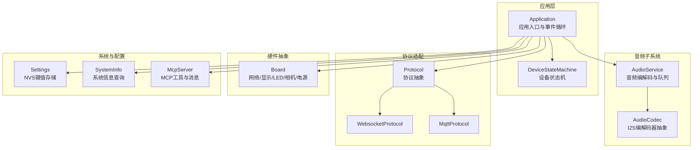
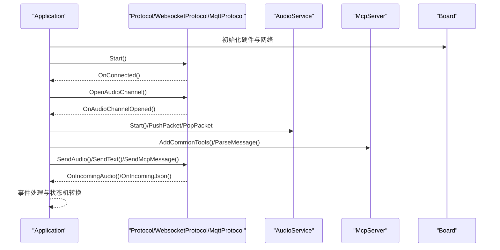
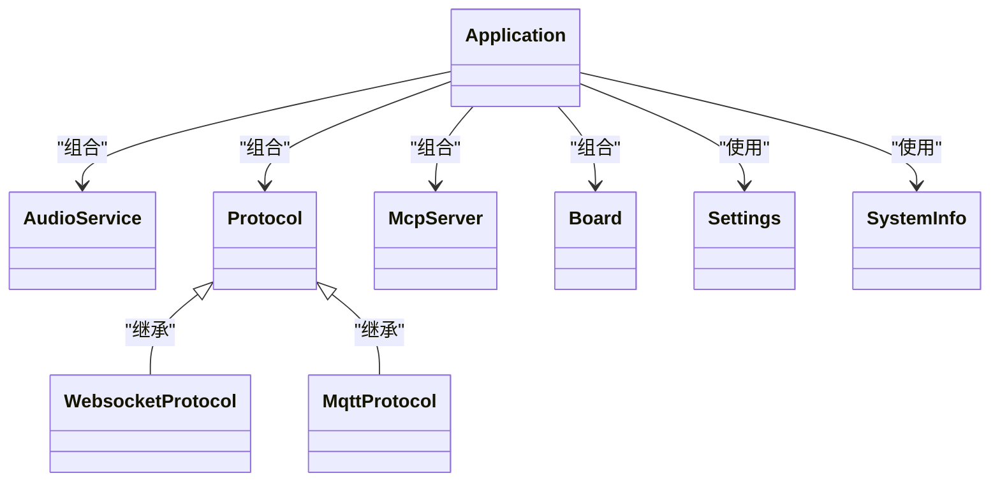

# API参考

<cite>
**本文引用的文件**
- [main/application.h](file://main/application.h)
- [main/application.cc](file://main/application.cc)
- [main/audio/audio_service.h](file://main/audio/audio_service.h)
- [main/audio/audio_service.cc](file://main/audio/audio_service.cc)
- [main/audio/audio_codec.h](file://main/audio/audio_codec.h)
- [main/audio/audio_codec.cc](file://main/audio/audio_codec.cc)
- [main/mcp_server.h](file://main/mcp_server.h)
- [main/mcp_server.cc](file://main/mcp_server.cc)
- [main/boards/common/board.h](file://main/boards/common/board.h)
- [main/boards/common/board.cc](file://main/boards/common/board.cc)
- [main/protocols/protocol.h](file://main/protocols/protocol.h)
- [main/protocols/websocket_protocol.h](file://main/protocols/websocket_protocol.h)
- [main/protocols/websocket_protocol.cc](file://main/protocols/websocket_protocol.cc)
- [main/protocols/mqtt_protocol.h](file://main/protocols/mqtt_protocol.h)
- [main/protocols/mqtt_protocol.cc](file://main/protocols/mqtt_protocol.cc)
- [main/device_state.h](file://main/device_state.h)
- [main/device_state_machine.h](file://main/device_state_machine.h)
- [main/settings.h](file://main/settings.h)
- [main/system_info.h](file://main/system_info.h)
- [docs/websocket.md](file://docs/websocket.md)
- [docs/mcp-protocol.md](file://docs/mcp-protocol.md)
</cite>

## 目录
1. [简介](#简介)
2. [项目结构](#项目结构)
3. [核心组件](#核心组件)
4. [架构总览](#架构总览)
5. [详细组件分析](#详细组件分析)
6. [依赖关系分析](#依赖关系分析)
7. [性能考量](#性能考量)
8. [故障排查指南](#故障排查指南)
9. [结论](#结论)
10. [附录](#附录)

## 简介
本API参考面向XiaoZhi ESP32项目的API使用者与集成开发者，系统性梳理并规范以下公共接口与API端点：
- Application主类：应用生命周期、事件驱动、状态机、音频通道与协议资源管理
- AudioService音频服务：音频采集/播放、编解码、队列与回调、唤醒词与语音活动检测
- MCP服务器API：工具注册、参数schema、调用返回、图像内容封装
- Board硬件抽象接口：网络、显示、LED、背光、相机、电源管理、系统信息
- Protocol通信协议接口：WebSocket/MQTT适配层、二进制协议、会话与事件回调
- WebSocket与MQTT协议文档：握手、消息类型、事件、二进制帧格式、错误处理
- Socket API与二进制协议：BinaryProtocol2/3结构、时间戳、payload尺寸
- IPC/Pipe通信：本仓库未提供具体实现，建议参考平台能力与第三方库
- 安全、速率限制、版本信息与客户端实现建议

## 项目结构
XiaoZhi ESP32采用模块化设计，按功能域划分目录：
- main：核心应用、音频子系统、协议适配、硬件抽象、设备状态与系统信息
- docs：协议与用法文档（WebSocket、MCP）
- partitions/scripts：分区表与构建脚本
- boards：各硬件板卡的实现与配置

**图表来源**
- [main/application.h](file://main/application.h#L42-L172)
- [main/audio/audio_service.h](file://main/audio/audio_service.h#L105-L193)
- [main/audio/audio_codec.h](file://main/audio/audio_codec.h#L17-L59)
- [main/protocols/protocol.h](file://main/protocols/protocol.h#L44-L95)
- [main/protocols/websocket_protocol.h](file://main/protocols/websocket_protocol.h#L13-L32)
- [main/protocols/mqtt_protocol.h](file://main/protocols/mqtt_protocol.h#L26-L62)
- [main/boards/common/board.h](file://main/boards/common/board.h#L49-L84)
- [main/mcp_server.h](file://main/mcp_server.h#L314-L342)
- [main/settings.h](file://main/settings.h#L7-L26)
- [main/system_info.h](file://main/system_info.h#L9-L21)

**章节来源**
- [main/application.h](file://main/application.h#L1-L190)
- [main/audio/audio_service.h](file://main/audio/audio_service.h#L1-L195)
- [main/boards/common/board.h](file://main/boards/common/board.h#L1-L93)
- [main/protocols/protocol.h](file://main/protocols/protocol.h#L1-L99)
- [main/mcp_server.h](file://main/mcp_server.h#L1-L345)

## 核心组件
本节对关键API进行分类与要点说明。

- Application主类
  - 单例模式，提供Initialize/Run、状态切换、事件调度、音频通道控制、OTA升级、MCP消息发送、AEC模式设置等
  - 事件位：定时器、网络、唤醒词、VAD、错误、激活完成、聊天切换、开始/停止监听等
  - 线程安全：通过队列与互斥锁保护主任务队列与共享状态
  - 关键方法路径：[main/application.h](file://main/application.h#L42-L172)，[main/application.cc](file://main/application.cc)

- AudioService音频服务
  - 音频输入/输出任务、Opus编解码任务、唤醒词检测、语音活动检测、测试队列与播放队列
  - 队列容量与帧时长配置、事件组与回调、调试统计
  - 关键结构：AudioStreamPacket、BinaryProtocol2/3、ListeningMode、AbortReason
  - 关键方法路径：[main/audio/audio_service.h](file://main/audio/audio_service.h#L105-L193)，[main/audio/audio_service.cc](file://main/audio/audio_service.cc)

- MCP服务器API
  - 工具注册（McpTool）、属性schema（Property/PropertyList）、调用返回（ReturnValue）
  - 图像内容封装（ImageContent）、capabilities与audience注解
  - 关键方法路径：[main/mcp_server.h](file://main/mcp_server.h#L208-L342)，[main/mcp_server.cc](file://main/mcp_server.cc)

- Board硬件抽象接口
  - 网络事件枚举与回调、UUID生成、电源保存级别、系统信息JSON、设备状态JSON
  - 关键方法路径：[main/boards/common/board.h](file://main/boards/common/board.h#L49-L84)，[main/boards/common/board.cc](file://main/boards/common/board.cc)

- Protocol通信协议接口
  - 抽象基类：音频通道打开/关闭、文本/二进制消息发送、回调注册、会话ID与服务器参数
  - 二进制协议：BinaryProtocol2/3结构、类型、保留字段、payload_size、payload
  - 关键方法路径：[main/protocols/protocol.h](file://main/protocols/protocol.h#L44-L95)

- WebSocket/MQTT协议
  - WebsocketProtocol：Start/OpenAudioChannel/SendAudio/CloseAudioChannel/IsAudioChannelOpened
  - MqttProtocol：Start/OpenAudioChannel/SendAudio/CloseAudioChannel/IsAudioChannelOpened、AES解密、心跳与重连
  - 关键方法路径：[main/protocols/websocket_protocol.h](file://main/protocols/websocket_protocol.h#L13-L32)，[main/protocols/websocket_protocol.cc](file://main/protocols/websocket_protocol.cc)，[main/protocols/mqtt_protocol.h](file://main/protocols/mqtt_protocol.h#L26-L62)，[main/protocols/mqtt_protocol.cc](file://main/protocols/mqtt_protocol.cc)

- Settings与SystemInfo
  - Settings：字符串/整型/布尔读写、擦除键与命名空间
  - SystemInfo：闪存大小、堆内存、MAC地址、芯片型号、任务CPU使用与列表打印
  - 关键方法路径：[main/settings.h](file://main/settings.h#L7-L26)，[main/system_info.h](file://main/system_info.h#L9-L21)

**章节来源**
- [main/application.h](file://main/application.h#L42-L172)
- [main/audio/audio_service.h](file://main/audio/audio_service.h#L105-L193)
- [main/mcp_server.h](file://main/mcp_server.h#L208-L342)
- [main/boards/common/board.h](file://main/boards/common/board.h#L49-L84)
- [main/protocols/protocol.h](file://main/protocols/protocol.h#L44-L95)
- [main/protocols/websocket_protocol.h](file://main/protocols/websocket_protocol.h#L13-L32)
- [main/protocols/mqtt_protocol.h](file://main/protocols/mqtt_protocol.h#L26-L62)
- [main/settings.h](file://main/settings.h#L7-L26)
- [main/system_info.h](file://main/system_info.h#L9-L21)

## 架构总览
XiaoZhi ESP32通过Application统一调度，AudioService负责音频通路，Protocol抽象承载WebSocket/MQTT传输，McpServer提供设备侧工具能力，Board抽象硬件资源，Settings/SystemInfo提供配置与系统信息。

**图表来源**
- [main/application.h](file://main/application.h#L52-L121)
- [main/protocols/websocket_protocol.h](file://main/protocols/websocket_protocol.h#L13-L32)
- [main/protocols/mqtt_protocol.h](file://main/protocols/mqtt_protocol.h#L26-L62)
- [main/audio/audio_service.h](file://main/audio/audio_service.h#L110-L136)
- [main/mcp_server.h](file://main/mcp_server.h#L321-L327)
- [main/boards/common/board.h](file://main/boards/common/board.h#L77-L78)

## 详细组件分析

### Application主类API
- 单例与生命周期
  - GetInstance()：获取全局实例
  - Initialize()：异步网络连接、显示/音频/回调初始化
  - Run()：主事件循环，处理网络、状态变更、用户交互
- 事件与状态
  - SetDeviceState(state)：请求状态转换（受DeviceStateMachine约束）
  - GetDeviceState()：查询当前状态
  - Schedule(callback)：线程安全地在主任务上下文调度回调
  - ToggleChatState()/StartListening()/StopListening()：事件驱动的UI/交互控制
- 音频与协议
  - GetAudioService()：获取AudioService引用
  - ResetProtocol()：释放网络后的协议资源（音频通道、协议、OTA）
  - SendMcpMessage(payload)：发送MCP消息
  - SetAecMode(mode)/GetAecMode()：设置/查询AEC模式
- 系统与升级
  - Reboot()：重启
  - UpgradeFirmware(url, version)：OTA升级
  - CanEnterSleepMode()：睡眠模式判定
- 事件位与回调
  - 事件位：MAIN_EVENT_SCHEDULE、MAIN_EVENT_SEND_AUDIO、MAIN_EVENT_WAKE_WORD_DETECTED、MAIN_EVENT_VAD_CHANGE、MAIN_EVENT_ERROR、MAIN_EVENT_ACTIVATION_DONE、MAIN_EVENT_CLOCK_TICK、MAIN_EVENT_NETWORK_CONNECTED、MAIN_EVENT_NETWORK_DISCONNECTED、MAIN_EVENT_TOGGLE_CHAT、MAIN_EVENT_START_LISTENING、MAIN_EVENT_STOP_LISTENING、MAIN_EVENT_STATE_CHANGED
  - 事件处理函数：HandleStateChangedEvent、HandleToggleChatEvent、HandleStartListeningEvent、HandleStopListeningEvent、HandleNetworkConnectedEvent、HandleNetworkDisconnectedEvent、HandleActivationDoneEvent、HandleWakeWordDetectedEvent

使用示例与注意事项
- 使用单例GetInstance()获取实例，避免重复初始化
- 通过Schedule在主任务上下文执行耗时操作，防止竞态
- 状态切换需遵循DeviceStateMachine规则，非法转换将被拒绝
- ResetProtocol应在网络断开或重连前调用，确保资源回收

**章节来源**
- [main/application.h](file://main/application.h#L42-L172)
- [main/application.cc](file://main/application.cc)

### AudioService音频服务API
- 初始化与启停
  - Initialize(codec)：绑定音频编解码器
  - Start()/Stop()：启动/停止音频任务
- 音频数据流
  - PushPacketToDecodeQueue(packet, wait)：推送解码队列
  - PopPacketFromSendQueue()：弹出待发送包
  - ReadAudioData(data, sample_rate, samples)：读取PCM数据
  - PlaySound(sound)：播放内置音效
- 唤醒词与语音检测
  - EncodeWakeWord()：编码唤醒词
  - PopWakeWordPacket()/GetLastWakeWord()：获取唤醒词包
  - EnableWakeWordDetection()/EnableVoiceProcessing()/EnableAudioTesting()/EnableDeviceAec()
  - IsVoiceDetected()/IsAfeWakeWord()：语音检测状态
- 队列与统计
  - WaitForPlaybackQueueEmpty()：等待播放队列清空
  - DebugStatistics：输入/解码/编码/播放计数
- 配置与回调
  - SetCallbacks(callbacks)：设置回调（发送队列可用、唤醒词检测、VAD变化、测试队列满）
  - SetModelsList(models_list)：设置模型列表
  - ResetDecoder()：重置解码器

使用示例与注意事项
- 在Start()前必须调用Initialize并传入有效的AudioCodec
- 队列容量与帧时长影响延迟与稳定性，需结合硬件性能调整
- 唤醒词与语音处理可独立开关，避免资源浪费

**章节来源**
- [main/audio/audio_service.h](file://main/audio/audio_service.h#L105-L193)
- [main/audio/audio_service.cc](file://main/audio/audio_service.cc)

### MCP服务器API
- 工具注册
  - AddCommonTools()/AddUserOnlyTools()：注册通用/仅用户可见工具
  - AddTool(name, description, properties, callback)/AddUserOnlyTool()：注册单个工具
  - ParseMessage(json/message)：解析MCP消息（JSON-RPC 2.0）
- 工具与参数
  - McpTool：工具名称、描述、输入schema、回调、受众注解
  - Property/PropertyList：属性类型（布尔/整数/字符串）、默认值、取值范围、必填项
  - ReturnValue：返回值类型（bool/int/string/cJSON*/ImageContent*）
- 图像内容
  - ImageContent：mimeType与Base64编码数据，to_json()生成JSON对象
- 能力与会话
  - ReplyResult(id, result)/ReplyError(id, message)：响应调用结果
  - GetToolsList(id, cursor, list_user_only_tools)：列举工具
  - DoToolCall(id, tool_name, tool_arguments)：执行工具调用

使用示例与注意事项
- 工具的inputSchema应与实际参数一致，整数属性可设置最小/最大值与默认值
- 回调返回值支持文本与图像，注意内存管理（ImageContent*由调用方释放）
- MCP消息遵循JSON-RPC 2.0规范，method/params/id/result/error字段需严格匹配

**章节来源**
- [main/mcp_server.h](file://main/mcp_server.h#L208-L342)
- [main/mcp_server.cc](file://main/mcp_server.cc)

### Board硬件抽象接口API
- 单例与实例
  - GetInstance()：获取Board实例（通过工厂函数create_board）
  - GetBoardType()/GetUuid()：获取板型与设备UUID
- 硬件资源
  - GetAudioCodec()/GetDisplay()/GetLed()/GetBacklight()/GetCamera()：获取对应硬件对象
- 网络与电源
  - StartNetwork()/GetNetwork()：启动网络接口与获取网络句柄
  - SetNetworkEventCallback(cb)：设置网络事件回调
  - SetPowerSaveLevel(level)：设置电源保存级别
- 系统信息
  - GetNetworkStateIcon()：获取网络状态图标
  - GetTemperature()/GetBatteryLevel()/GetSystemInfoJson()/GetBoardJson()/GetDeviceStatusJson()：温度、电量、系统/板卡/设备状态JSON

使用示例与注意事项
- Board实例由各板卡实现通过DECLARE_BOARD宏导出工厂函数
- 网络事件回调用于UI反馈与状态机联动

**章节来源**
- [main/boards/common/board.h](file://main/boards/common/board.h#L49-L84)
- [main/boards/common/board.cc](file://main/boards/common/board.cc)

### Protocol通信协议接口API
- 抽象方法
  - Start()/OpenAudioChannel()/CloseAudioChannel(send_goodbye)/IsAudioChannelOpened()
  - SendAudio(packet)/SendWakeWordDetected(wake_word)/SendStartListening(mode)/SendStopListening()/SendAbortSpeaking(reason)/SendMcpMessage(message)
  - OnIncomingAudio/on_incoming_json/on_audio_channel_opened/on_audio_channel_closed/on_network_error/on_connected/on_disconnected
- 数据结构
  - AudioStreamPacket：采样率、帧时长、时间戳、payload
  - BinaryProtocol2：version/type/reserved/timestamp/payload_size/payload
  - BinaryProtocol3：type/reserved/payload_size/payload
- 事件与状态
  - server_sample_rate/server_frame_duration/session_id
  - error_occurred_/last_incoming_time_

使用示例与注意事项
- 子类需实现SendText(text)以发送文本消息
- 二进制协议版本通过配置选择，版本2/3包含元数据字段

**章节来源**
- [main/protocols/protocol.h](file://main/protocols/protocol.h#L44-L95)

### WebSocket协议API
- 类方法
  - Start()：建立WebSocket连接并发送hello
  - OpenAudioChannel()/SendAudio()/CloseAudioChannel()/IsAudioChannelOpened()
- 消息与事件
  - OnIncomingJson回调解析hello、listen、abort、wake word detect、mcp、system等消息
  - ParseServerHello(root)：解析服务器hello，设置session_id与音频参数
  - GetHelloMessage()：构造hello消息
- 事件位
  - WEBSOCKET_PROTOCOL_SERVER_HELLO_EVENT：服务器hello事件

使用示例与注意事项
- 连接建立后需等待服务器hello，超时触发网络错误回调
- 二进制协议版本通过配置选择，支持版本1（直接Opus）、版本2（含时间戳）、版本3（简化）

**章节来源**
- [main/protocols/websocket_protocol.h](file://main/protocols/websocket_protocol.h#L13-L32)
- [main/protocols/websocket_protocol.cc](file://main/protocols/websocket_protocol.cc)
- [docs/websocket.md](file://docs/websocket.md#L1-L496)

### MQTT协议API
- 类方法
  - Start()：启动MQTT客户端并发送hello
  - OpenAudioChannel()/SendAudio()/CloseAudioChannel()/IsAudioChannelOpened()
- 加密与重连
  - AES上下文与nonce、UDP服务器地址与端口、序列号、心跳与重连定时器
  - StartMqttClient(report_error)：启动MQTT客户端
  - DecodeHexString(hex_string)：十六进制解码
- 消息与事件
  - ParseServerHello(root)：解析服务器hello
  - GetHelloMessage()：构造hello消息

使用示例与注意事项
- MQTT协议包含加密与UDP辅助，需确保服务器端配置一致
- 重连间隔与心跳周期可配置，避免频繁断连

**章节来源**
- [main/protocols/mqtt_protocol.h](file://main/protocols/mqtt_protocol.h#L26-L62)
- [main/protocols/mqtt_protocol.cc](file://main/protocols/mqtt_protocol.cc)

### 设备状态与状态机
- 设备状态枚举：未知/启动中/WiFi配置/空闲/连接中/监听/说话/升级/激活/音频测试/FatalError
- 状态机
  - TransitionTo(new_state)/CanTransitionTo(target)：状态转换与合法性检查
  - AddStateChangeListener()/RemoveStateChangeListener()：状态变化观察者
  - GetStateName(state)：状态名字符串

使用示例与注意事项
- 状态转换遵循严格规则，非法转换将被拒绝
- 状态变化回调在TransitionTo调用上下文中触发

**章节来源**
- [main/device_state.h](file://main/device_state.h#L4-L16)
- [main/device_state_machine.h](file://main/device_state_machine.h#L17-L81)

### 配置与系统信息API
- Settings
  - 构造函数(namespace, read_write)
  - GetString/SetString/GetInt/SetInt/GetBool/SetBool/EraseKey/EraseAll
- SystemInfo
  - GetFlashSize/GetMinimumFreeHeapSize/GetFreeHeapSize/GetMacAddress/GetChipModelName
  - GetUserAgent/PrintTaskCpuUsage/PrintTaskList/PrintHeapStats/PrintPmLocks

使用示例与注意事项
- Settings使用NVS命名空间隔离配置，避免键冲突
- SystemInfo用于诊断与监控，建议在调试模式启用打印

**章节来源**
- [main/settings.h](file://main/settings.h#L7-L26)
- [main/system_info.h](file://main/system_info.h#L9-L21)

## 依赖关系分析
- Application依赖AudioService、Protocol、DeviceStateMachine、McpServer、Settings、SystemInfo、Board
- AudioService依赖AudioCodec、Protocol、AudioDebugger、WakeWord、AudioProcessor
- Protocol抽象被WebsocketProtocol与MqttProtocol实现
- Board提供硬件资源与网络接口
- Settings/SystemInfo为系统支撑模块

**图表来源**
- [main/application.h](file://main/application.h#L127-L137)
- [main/audio/audio_service.h](file://main/audio/audio_service.h#L138-L142)
- [main/protocols/protocol.h](file://main/protocols/protocol.h#L44-L95)
- [main/protocols/websocket_protocol.h](file://main/protocols/websocket_protocol.h#L13-L32)
- [main/protocols/mqtt_protocol.h](file://main/protocols/mqtt_protocol.h#L26-L62)
- [main/mcp_server.h](file://main/mcp_server.h#L314-L342)
- [main/boards/common/board.h](file://main/boards/common/board.h#L62-L64)
- [main/settings.h](file://main/settings.h#L7-L26)
- [main/system_info.h](file://main/system_info.h#L9-L21)

**章节来源**
- [main/application.h](file://main/application.h#L127-L137)
- [main/audio/audio_service.h](file://main/audio/audio_service.h#L138-L142)
- [main/protocols/protocol.h](file://main/protocols/protocol.h#L44-L95)

## 性能考量
- 音频队列容量与帧时长
  - OPUS_FRAME_DURATION_MS与队列上限决定端到端延迟与吞吐
  - 建议根据网络带宽与CPU负载动态调整
- 任务优先级与调度
  - 使用TaskPriorityReset在关键路径临时提升优先级
  - 避免长时间阻塞主事件循环
- 资源回收
  - ResetProtocol在断网或重连前调用，释放音频通道与协议资源
- 功耗与电源管理
  - PowerSaveLevel提供低功耗/平衡/性能三种模式
  - AudioService提供音频功率超时与检查间隔

[本节为通用指导，无需特定文件来源]

## 故障排查指南
- WebSocket连接失败
  - 检查握手头（Authorization、Protocol-Version、Device-Id、Client-Id）
  - 等待服务器hello超时：触发网络错误回调
  - 参考：[docs/websocket.md](file://docs/websocket.md#L82-L91)，[docs/websocket.md](file://docs/websocket.md#L369-L378)
- MQTT断连与重连
  - 检查AES配置与UDP服务器地址/端口
  - 关注重连定时器与心跳周期
  - 参考：[main/protocols/mqtt_protocol.h](file://main/protocols/mqtt_protocol.h#L21-L22)，[main/protocols/mqtt_protocol.cc](file://main/protocols/mqtt_protocol.cc)
- 音频异常
  - 检查队列是否溢出或阻塞
  - 确认采样率与帧时长配置一致
  - 参考：[main/audio/audio_service.h](file://main/audio/audio_service.h#L39-L48)
- MCP工具调用失败
  - 核对inputSchema与参数类型/范围
  - 检查工具名称与回调实现
  - 参考：[docs/mcp-protocol.md](file://docs/mcp-protocol.md#L108-L148)，[main/mcp_server.h](file://main/mcp_server.h#L272-L311)

**章节来源**
- [docs/websocket.md](file://docs/websocket.md#L82-L91)
- [docs/websocket.md](file://docs/websocket.md#L369-L378)
- [main/protocols/mqtt_protocol.h](file://main/protocols/mqtt_protocol.h#L21-L22)
- [main/protocols/mqtt_protocol.cc](file://main/protocols/mqtt_protocol.cc)
- [main/audio/audio_service.h](file://main/audio/audio_service.h#L39-L48)
- [docs/mcp-protocol.md](file://docs/mcp-protocol.md#L108-L148)
- [main/mcp_server.h](file://main/mcp_server.h#L272-L311)

## 结论
本文档系统梳理了XiaoZhi ESP32的核心API，覆盖应用层、音频、协议、硬件抽象、MCP工具与系统配置。建议在集成时：
- 严格遵循状态机与事件驱动模型
- 正确配置二进制协议版本与音频参数
- 使用Settings与SystemInfo进行配置与诊断
- 借助MCP工具体系实现设备能力的标准化暴露

[本节为总结，无需特定文件来源]

## 附录

### WebSocket API消息类型与格式
- hello：握手消息，包含features、transport、audio_params
- listen：开始/停止/检测监听，支持auto/manual/realtime模式
- abort：中止说话或通道
- wake word detected：唤醒词检测上报
- mcp：JSON-RPC 2.0封装的MCP消息
- tts/stt/system/custom：TTS/ASR/系统控制/自定义消息
- 二进制帧：Opus音频数据，支持版本1/2/3

参考：[docs/websocket.md](file://docs/websocket.md#L128-L292)

**章节来源**
- [docs/websocket.md](file://docs/websocket.md#L128-L292)

### Socket API与二进制协议
- BinaryProtocol2：version/type/reserved/timestamp/payload_size/payload
- BinaryProtocol3：type/reserved/payload_size/payload
- 适用场景：服务器AEC、跨协议传输

参考：[main/protocols/protocol.h](file://main/protocols/protocol.h#L17-L31)

**章节来源**
- [main/protocols/protocol.h](file://main/protocols/protocol.h#L17-L31)

### IPC/Pipe通信
- 本仓库未提供具体实现
- 建议使用平台提供的消息队列/管道机制或第三方库
- 注意线程安全与缓冲区管理

[本节为概念性说明，无需特定文件来源]

### 安全、速率限制与版本信息
- 安全：Authorization令牌、会话ID、设备UUID
- 速率限制：队列容量与帧时长控制
- 版本：协议版本与二进制协议版本

参考：[docs/websocket.md](file://docs/websocket.md#L381-L402)，[main/protocols/protocol.h](file://main/protocols/protocol.h#L17-L31)

**章节来源**
- [docs/websocket.md](file://docs/websocket.md#L381-L402)
- [main/protocols/protocol.h](file://main/protocols/protocol.h#L17-L31)

### 客户端实现指南与性能优化
- 客户端：遵循JSON-RPC 2.0与消息类型规范
- 优化：合理设置帧时长、队列容量、电源模式与任务优先级

参考：[docs/mcp-protocol.md](file://docs/mcp-protocol.md#L1-L270)，[docs/websocket.md](file://docs/websocket.md#L1-L496)

**章节来源**
- [docs/mcp-protocol.md](file://docs/mcp-protocol.md#L1-L270)
- [docs/websocket.md](file://docs/websocket.md#L1-L496)