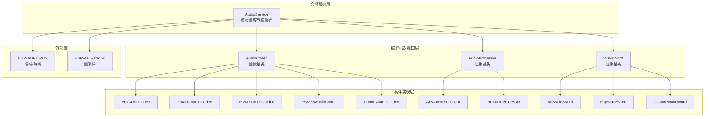
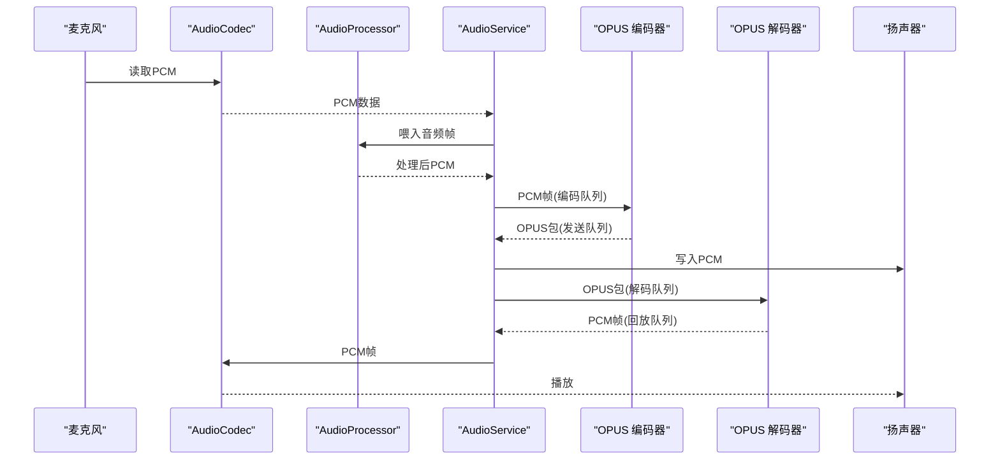
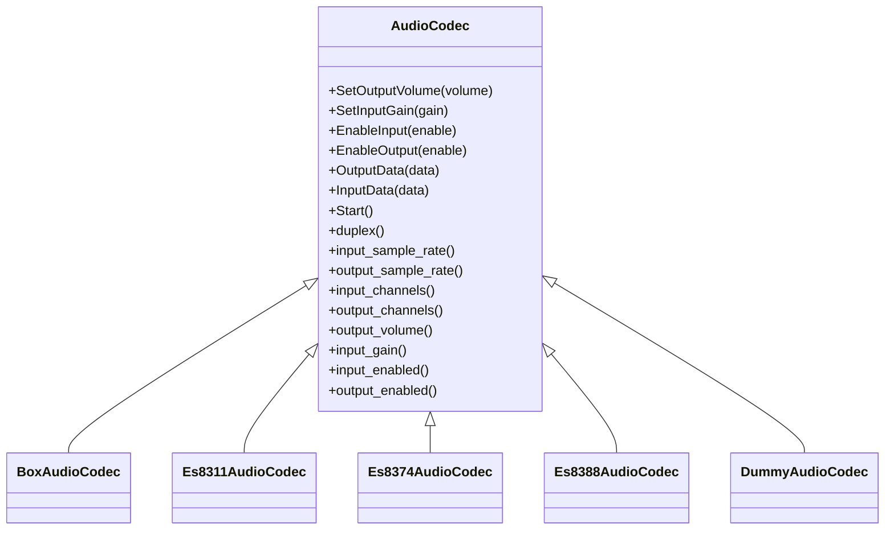
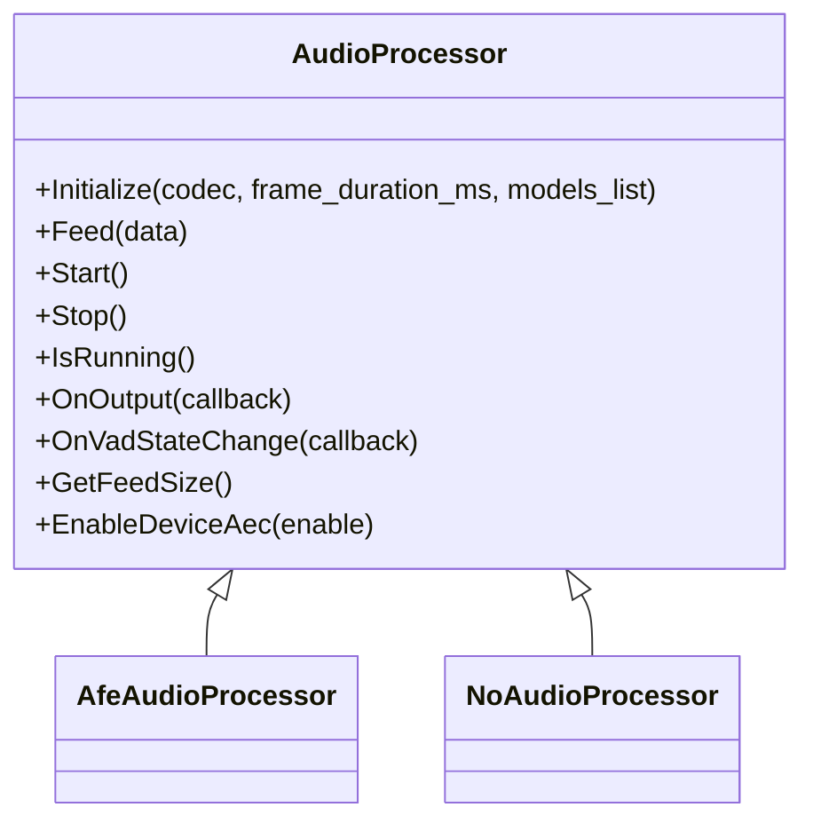
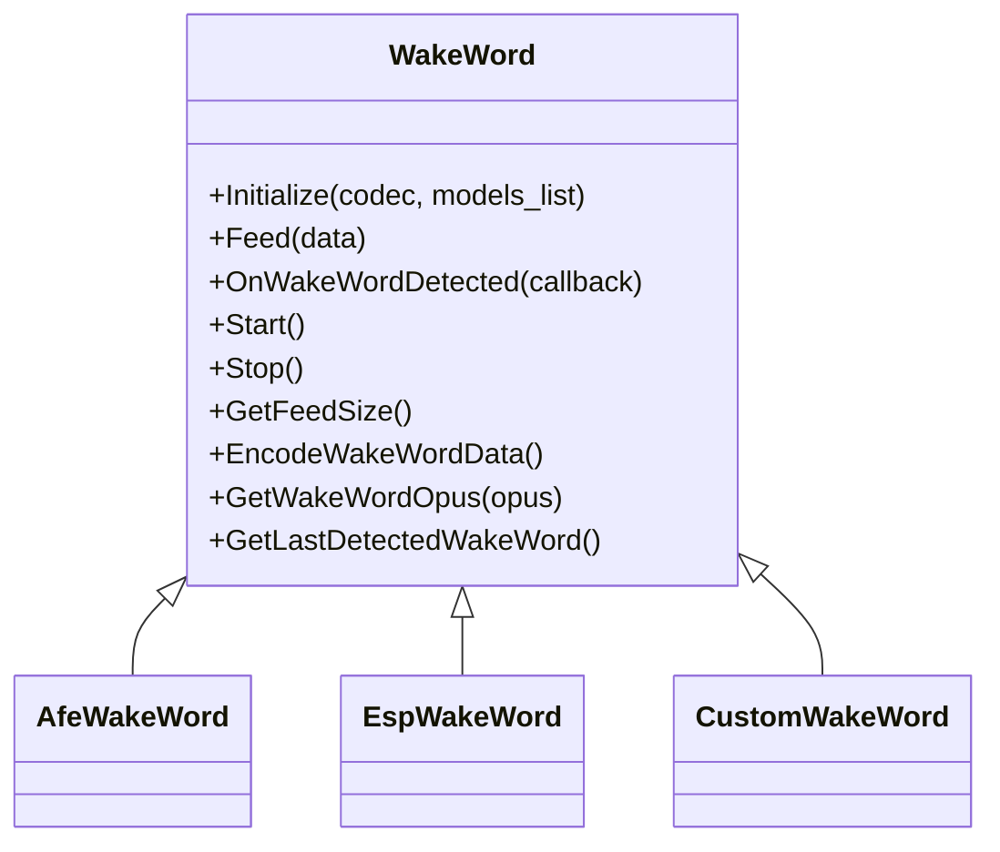
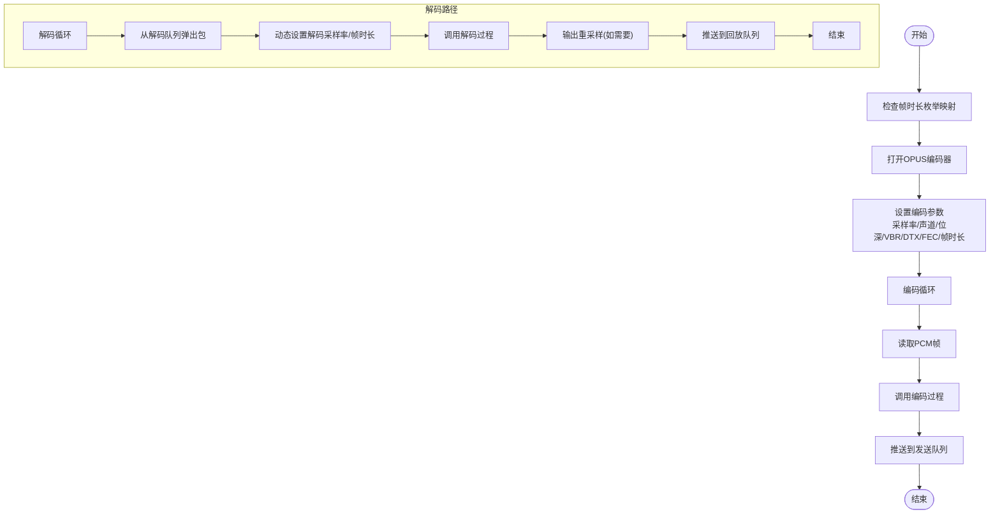
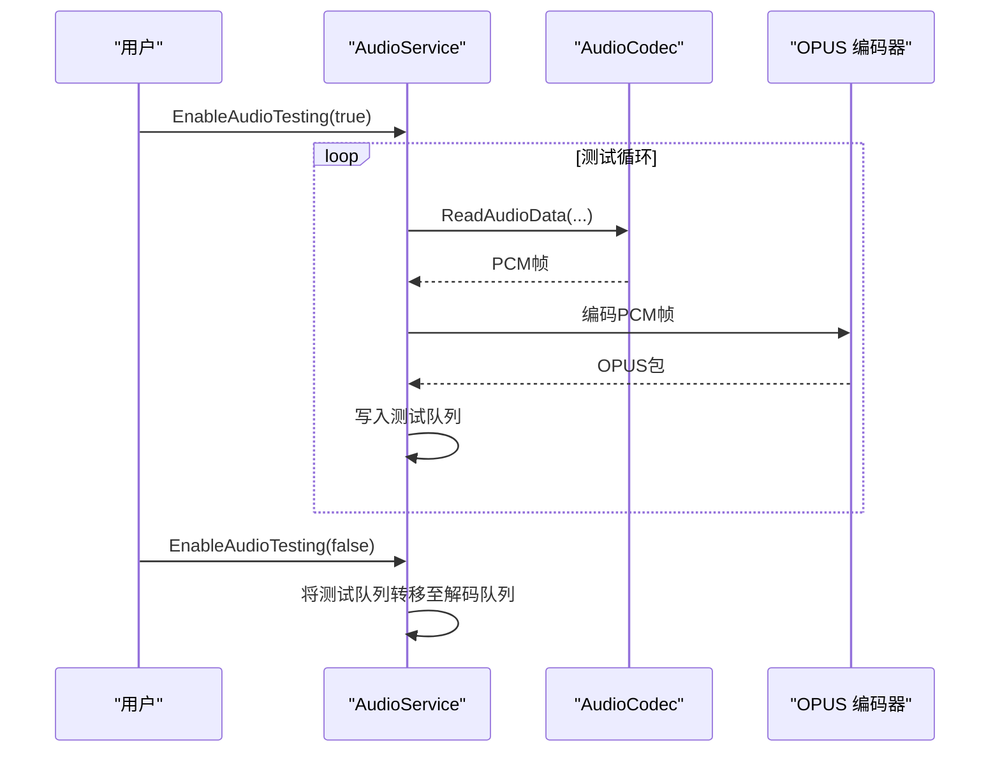
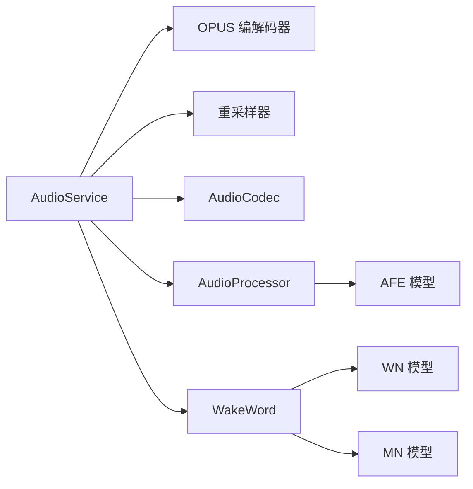

# AudioService音频服务API

<cite>
**本文档引用的文件**
- [audio_service.h](file://main/audio/audio_service.h)
- [audio_service.cc](file://main/audio/audio_service.cc)
- [audio_codec.h](file://main/audio/audio_codec.h)
- [audio_processor.h](file://main/audio/audio_processor.h)
- [box_audio_codec.h](file://main/audio/codecs/box_audio_codec.h)
- [dummy_audio_codec.h](file://main/audio/codecs/dummy_audio_codec.h)
- [es8311_audio_codec.h](file://main/audio/codecs/es8311_audio_codec.h)
- [es8374_audio_codec.h](file://main/audio/codecs/es8374_audio_codec.h)
- [es8388_audio_codec.h](file://main/audio/codecs/es8388_audio_codec.h)
- [afe_audio_processor.h](file://main/audio/processors/afe_audio_processor.h)
- [no_audio_processor.h](file://main/audio/processors/no_audio_processor.h)
- [audio_debugger.h](file://main/audio/processors/audio_debugger.h)
- [wake_word.h](file://main/audio/wake_word.h)
- [afe_wake_word.h](file://main/audio/wake_words/afe_wake_word.h)
- [esp_wake_word.h](file://main/audio/wake_words/esp_wake_word.h)
- [custom_wake_word.h](file://main/audio/wake_words/custom_wake_word.h)
</cite>

## 目录
1. [简介](#简介)
2. [项目结构](#项目结构)
3. [核心组件](#核心组件)
4. [架构总览](#架构总览)
5. [详细组件分析](#详细组件分析)
6. [依赖关系分析](#依赖关系分析)
7. [性能考虑](#性能考虑)
8. [故障排除指南](#故障排除指南)
9. [结论](#结论)

## 简介
本文件为 AudioService 音频服务类的完整 API 参考文档，覆盖以下关键能力：
- 音频编解码器接口与抽象基类
- 音频流处理方法（输入/输出/编解码）
- OPUS 编解码操作与帧时长配置
- 音频质量控制（采样率、比特率、帧时长、VBR/DTX/FEC）
- 音频初始化配置、编码/解码队列管理
- 语音检测与唤醒词识别集成
- 音频测试功能与播放本地音效
- 调试工具与性能优化建议

## 项目结构
AudioService 所在目录位于 main/audio，主要文件组织如下：
- 核心服务：audio_service.{h,cc}
- 抽象接口：audio_codec.h, audio_processor.h, wake_word.h
- 具体实现：codecs/*, processors/*, wake_words/*
- 调试器：processors/audio_debugger.h
- 拆包器：demuxer/ogg_demuxer.h（在服务中使用）

图表来源
- [audio_service.h](file://main/audio/audio_service.h#L105-L195)
- [audio_codec.h](file://main/audio/audio_codec.h#L17-L61)
- [audio_processor.h](file://main/audio/audio_processor.h#L11-L27)
- [wake_word.h](file://main/audio/wake_word.h#L11-L27)

章节来源
- [audio_service.h](file://main/audio/audio_service.h#L1-L195)
- [audio_service.cc](file://main/audio/audio_service.cc#L1-L732)

## 核心组件
- AudioService：音频服务主控制器，负责编解码器初始化、任务调度、队列管理、OPUS 编解码、音频测试与播放、设备电源管理等。
- AudioCodec：音频编解码器抽象基类，定义输入/输出、增益/音量、启用/禁用等通用接口。
- AudioProcessor：音频处理器抽象基类，定义初始化、喂入、启动/停止、回调注册、VAD 状态变更、设备 AEC 开关等接口。
- WakeWord：唤醒词检测抽象基类，定义初始化、喂入、回调、启动/停止、编码唤醒词数据、获取最后检测结果等接口。

章节来源
- [audio_service.h](file://main/audio/audio_service.h#L105-L195)
- [audio_codec.h](file://main/audio/audio_codec.h#L17-L61)
- [audio_processor.h](file://main/audio/audio_processor.h#L11-L27)
- [wake_word.h](file://main/audio/wake_word.h#L11-L27)

## 架构总览
AudioService 采用多任务模型：
- 输入任务：从音频编解码器读取 PCM 数据，送入音频处理器或唤醒词检测，再进入编码队列。
- OPUS 编解码任务：从编码队列取出 PCM 帧进行 OPUS 编码，放入发送队列；从解码队列取出 OPUS 包进行解码，放入回放队列。
- 输出任务：从回放队列取出 PCM 数据写入音频编解码器。

图表来源
- [audio_service.cc](file://main/audio/audio_service.cc#L230-L446)

章节来源
- [audio_service.cc](file://main/audio/audio_service.cc#L125-L167)

## 详细组件分析

### AudioService 类 API 参考
- 初始化与生命周期
  - Initialize(AudioCodec* codec)：初始化编解码器、OPUS 编解码器、重采样器、音频处理器与唤醒词模块。
  - Start()：启动输入/输出/编解码任务与定时器。
  - Stop()：停止定时器，清空所有队列并通知等待线程。
  - ~AudioService()：析构时关闭 OPUS 编解码器、重采样器与事件组。
- 音频编解码与队列管理
  - PushPacketToDecodeQueue(std::unique_ptr<AudioStreamPacket>, bool wait=false)：向解码队列推送 OPUS 包，支持阻塞等待。
  - PopPacketFromSendQueue()：从发送队列弹出一个 OPUS 包。
  - PushTaskToEncodeQueue(AudioTaskType, std::vector<int16_t>&&)：将 PCM 帧推入编码队列，并可携带时间戳用于服务端 AEC 同步。
  - SetDecodeSampleRate(int, int)：动态切换解码采样率与帧时长，必要时重建解码器与输出重采样器。
  - ResetDecoder()：重置解码器状态，清空解码/回放缓冲与时间戳队列。
- 音频处理器与唤醒词
  - EnableVoiceProcessing(bool)：启用/禁用音频处理器（VAD、降噪、AEC 等）。
  - EnableWakeWordDetection(bool)：启用/禁用唤醒词检测，按模型自动选择 AFE 或 ESP 实现。
  - EncodeWakeWord()：触发唤醒词 PCM 数据编码为 OPUS。
  - PopWakeWordPacket()：弹出最近一次唤醒词的 OPUS 包。
  - GetLastWakeWord()：获取最后一次唤醒词文本。
  - IsAfeWakeWord()：判断当前唤醒词实现是否为 AFE。
- 音频测试与播放
  - EnableAudioTesting(bool)：启用/禁用音频测试模式，测试期间将 PCM 直接编码为 OPUS 并写入测试队列。
  - PlaySound(const std::string_view&)：通过 OGG 拆包器解析并推送解码包到解码队列进行播放。
  - ReadAudioData(...)：从编解码器读取指定长度的 PCM 数据，必要时进行输入重采样。
- 状态查询与同步
  - IsIdle()：判断所有队列是否为空。
  - WaitForPlaybackQueueEmpty()：等待解码/回放队列清空。
  - IsVoiceDetected()：返回 VAD 检测状态。
  - SetCallbacks(AudioServiceCallbacks&)：注册回调，包括发送队列可用、唤醒词检测、VAD 状态变化、音频测试队列满等。
- 设备电源管理
  - CheckAndUpdateAudioPowerState()：根据最近输入/输出时间自动关闭编解码器输入/输出以节能。

章节来源
- [audio_service.h](file://main/audio/audio_service.h#L105-L195)
- [audio_service.cc](file://main/audio/audio_service.cc#L62-L123)
- [audio_service.cc](file://main/audio/audio_service.cc#L125-L182)
- [audio_service.cc](file://main/audio/audio_service.cc#L184-L228)
- [audio_service.cc](file://main/audio/audio_service.cc#L230-L288)
- [audio_service.cc](file://main/audio/audio_service.cc#L290-L325)
- [audio_service.cc](file://main/audio/audio_service.cc#L327-L446)
- [audio_service.cc](file://main/audio/audio_service.cc#L448-L482)
- [audio_service.cc](file://main/audio/audio_service.cc#L484-L504)
- [audio_service.cc](file://main/audio/audio_service.cc#L506-L518)
- [audio_service.cc](file://main/audio/audio_service.cc#L520-L529)
- [audio_service.cc](file://main/audio/audio_service.cc#L531-L547)
- [audio_service.cc](file://main/audio/audio_service.cc#L549-L577)
- [audio_service.cc](file://main/audio/audio_service.cc#L579-L604)
- [audio_service.cc](file://main/audio/audio_service.cc#L606-L617)
- [audio_service.cc](file://main/audio/audio_service.cc#L619-L627)
- [audio_service.cc](file://main/audio/audio_service.cc#L629-L631)
- [audio_service.cc](file://main/audio/audio_service.cc#L633-L654)
- [audio_service.cc](file://main/audio/audio_service.cc#L656-L666)
- [audio_service.cc](file://main/audio/audio_service.cc#L668-L680)
- [audio_service.cc](file://main/audio/audio_service.cc#L682-L695)
- [audio_service.cc](file://main/audio/audio_service.cc#L697-L731)

### 音频编解码器抽象与实现
- 抽象基类 AudioCodec
  - 关键接口：SetOutputVolume(int), SetInputGain(float), EnableInput(bool), EnableOutput(bool), OutputData(...), InputData(...), Start()。
  - 属性：输入/输出采样率、通道数、音量、增益、启用状态等。
- 具体实现
  - BoxAudioCodec：基于 esp_codec_dev 的 I2S 音频编解码器，支持 PA 推放、MCLK 等硬件配置。
  - Es8311AudioCodec / Es8374AudioCodec / Es8388AudioCodec：针对不同芯片的 I2C 控制音频编解码器实现。
  - DummyAudioCodec：占位实现，便于无硬件环境测试。

图表来源
- [audio_codec.h](file://main/audio/audio_codec.h#L17-L61)
- [box_audio_codec.h](file://main/audio/codecs/box_audio_codec.h#L11-L41)
- [es8311_audio_codec.h](file://main/audio/codecs/es8311_audio_codec.h#L13-L42)
- [es8374_audio_codec.h](file://main/audio/codecs/es8374_audio_codec.h#L13-L41)
- [es8388_audio_codec.h](file://main/audio/codecs/es8388_audio_codec.h#L12-L41)
- [dummy_audio_codec.h](file://main/audio/codecs/dummy_audio_codec.h#L6-L16)

章节来源
- [audio_codec.h](file://main/audio/audio_codec.h#L17-L61)
- [box_audio_codec.h](file://main/audio/codecs/box_audio_codec.h#L11-L41)
- [es8311_audio_codec.h](file://main/audio/codecs/es8311_audio_codec.h#L13-L42)
- [es8374_audio_codec.h](file://main/audio/codecs/es8374_audio_codec.h#L13-L41)
- [es8388_audio_codec.h](file://main/audio/codecs/es8388_audio_codec.h#L12-L41)
- [dummy_audio_codec.h](file://main/audio/codecs/dummy_audio_codec.h#L6-L16)

### 音频处理器抽象与实现
- 抽象基类 AudioProcessor
  - 关键接口：Initialize(...), Feed(...), Start(), Stop(), IsRunning(), OnOutput(...), OnVadStateChange(...), GetFeedSize(), EnableDeviceAec(bool)。
- 具体实现
  - AfeAudioProcessor：基于 ESP-AFE 的语音识别/降噪/AEC 等处理，内部维护音频处理任务与缓冲。
  - NoAudioProcessor：空实现，用于无处理器场景。

图表来源
- [audio_processor.h](file://main/audio/audio_processor.h#L11-L27)
- [afe_audio_processor.h](file://main/audio/processors/afe_audio_processor.h#L17-L48)
- [no_audio_processor.h](file://main/audio/processors/no_audio_processor.h#L11-L34)

章节来源
- [audio_processor.h](file://main/audio/audio_processor.h#L11-L27)
- [afe_audio_processor.h](file://main/audio/processors/afe_audio_processor.h#L17-L48)
- [no_audio_processor.h](file://main/audio/processors/no_audio_processor.h#L11-L34)

### 唤醒词检测抽象与实现
- 抽象基类 WakeWord
  - 关键接口：Initialize(...), Feed(...), OnWakeWordDetected(...), Start(), Stop(), GetFeedSize(), EncodeWakeWordData(), GetWakeWordOpus(...), GetLastDetectedWakeWord()。
- 具体实现
  - AfeWakeWord：基于 ESP-AFE 的唤醒词检测，支持唤醒词 PCM 存储与 OPUS 编码。
  - EspWakeWord：基于 ESP-WN 的唤醒词检测。
  - CustomWakeWord：基于 ESP-MN 的自定义命令唤醒词检测，支持阈值、持续时间等参数化配置。

图表来源
- [wake_word.h](file://main/audio/wake_word.h#L11-L27)
- [afe_wake_word.h](file://main/audio/wake_words/afe_wake_word.h#L22-L63)
- [esp_wake_word.h](file://main/audio/wake_words/esp_wake_word.h#L17-L46)
- [custom_wake_word.h](file://main/audio/wake_words/custom_wake_word.h#L20-L72)

章节来源
- [wake_word.h](file://main/audio/wake_word.h#L11-L27)
- [afe_wake_word.h](file://main/audio/wake_words/afe_wake_word.h#L22-L63)
- [esp_wake_word.h](file://main/audio/wake_words/esp_wake_word.h#L17-L46)
- [custom_wake_word.h](file://main/audio/wake_words/custom_wake_word.h#L20-L72)

### OPUS 编解码与帧时长配置
- 编码配置要点
  - 采样率：16kHz
  - 声道：单声道
  - 位深：16bit
  - 应用模式：音频应用
  - VBR：开启
  - DTX：开启
  - FEC：关闭
  - 帧时长：可通过宏映射为 5/10/20/40/60/80/100/120ms
- 解码配置要点
  - 支持动态切换采样率与帧时长，必要时重建解码器与输出重采样器
- 队列容量
  - 发送/解码队列最大包数：2400ms / 帧时长
  - 编码/回放缓冲最大任务数：2
  - 测试模式最大时长：10000ms

图表来源
- [audio_service.h](file://main/audio/audio_service.h#L55-L76)
- [audio_service.cc](file://main/audio/audio_service.cc#L62-L84)
- [audio_service.cc](file://main/audio/audio_service.cc#L327-L446)
- [audio_service.cc](file://main/audio/audio_service.cc#L448-L482)

章节来源
- [audio_service.h](file://main/audio/audio_service.h#L39-L76)
- [audio_service.cc](file://main/audio/audio_service.cc#L62-L84)
- [audio_service.cc](file://main/audio/audio_service.cc#L327-L446)
- [audio_service.cc](file://main/audio/audio_service.cc#L448-L482)

### 音频参数配置与质量控制
- 采样率设置
  - 编码统一使用 16kHz；输入采样率不为 16kHz 时通过重采样器转换。
  - 输出重采样器在解码采样率与板载编解码器输出采样率不一致时启用。
- 比特率控制
  - OPUS 编码采用自动比特率（VBR），可根据语音活动动态调整。
- 帧时长控制
  - 通过宏映射支持多种帧时长，影响队列容量与延迟。
- 音频格式转换
  - 单声道化（双声道输入时仅取左声道用于测试）。
  - PCM 与 OPUS 互转由 OPUS 编解码器完成。
- AEC 与 VAD
  - 通过音频处理器启用设备侧 AEC。
  - VAD 状态变化通过回调通知上层。

章节来源
- [audio_service.cc](file://main/audio/audio_service.cc#L86-L93)
- [audio_service.cc](file://main/audio/audio_service.cc#L196-L207)
- [audio_service.cc](file://main/audio/audio_service.cc#L370-L379)
- [audio_service.cc](file://main/audio/audio_service.cc#L579-L604)

### 音频测试功能
- 功能概述
  - 在测试模式下，输入任务直接读取 PCM 并编码为 OPUS，写入测试队列。
  - 测试队列满后自动停止测试；停止时将测试队列内容转移至解码队列进行播放。
- 关键接口
  - EnableAudioTesting(bool)：启用/禁用测试模式。
  - ReadAudioData(...)：读取 PCM 数据并进行必要的重采样。
  - PlaySound(...)：通过 OGG 拆包器解析并播放本地音效。

图表来源
- [audio_service.cc](file://main/audio/audio_service.cc#L606-L617)
- [audio_service.cc](file://main/audio/audio_service.cc#L184-L228)
- [audio_service.cc](file://main/audio/audio_service.cc#L633-L654)

章节来源
- [audio_service.cc](file://main/audio/audio_service.cc#L606-L617)
- [audio_service.cc](file://main/audio/audio_service.cc#L184-L228)
- [audio_service.cc](file://main/audio/audio_service.cc#L633-L654)

### 音频调试工具
- AudioDebugger
  - 提供将原始 PCM 数据通过 UDP 发送的能力，便于网络侧调试。
  - 在启用音频调试开关时，AudioService 会在读取 PCM 后调用调试器喂入数据。

章节来源
- [audio_debugger.h](file://main/audio/processors/audio_debugger.h#L10-L22)
- [audio_service.cc](file://main/audio/audio_service.cc#L219-L225)

## 依赖关系分析
- 组件耦合
  - AudioService 对 AudioCodec、AudioProcessor、WakeWord 采用组合与回调方式，降低耦合度。
  - OPUS 编解码器与重采样器通过 ESP-ADF 与 ESP-AE 提供，运行于独立任务。
- 外部依赖
  - OPUS 编解码：esp_opus_enc/dec
  - 重采样：esp_ae_rate_cvt
  - 唤醒词：esp_afe_sr_models / esp_wn_models / esp_mn_models
  - 音频编解码设备：esp_codec_dev

图表来源
- [audio_service.h](file://main/audio/audio_service.h#L15-L26)
- [audio_service.cc](file://main/audio/audio_service.cc#L25-L36)

章节来源
- [audio_service.h](file://main/audio/audio_service.h#L15-L26)
- [audio_service.cc](file://main/audio/audio_service.cc#L25-L36)

## 性能考虑
- 队列容量与延迟
  - 发送/解码队列容量与帧时长成反比，帧时长越短延迟越低但 CPU 占用越高。
  - 编码/回放缓冲限制为 2，避免内存占用过大。
- 重采样策略
  - 输入重采样仅在采样率不为 16kHz 时启用；输出重采样仅在解码采样率与板载输出不一致时启用。
- 任务优先级与栈大小
  - 输入/输出任务优先级高于编解码任务，确保实时性。
- 功耗管理
  - 通过定时器检测最近输入/输出时间，超时自动关闭编解码器输入/输出引脚，降低功耗。

章节来源
- [audio_service.h](file://main/audio/audio_service.h#L39-L48)
- [audio_service.cc](file://main/audio/audio_service.cc#L86-L93)
- [audio_service.cc](file://main/audio/audio_service.cc#L470-L481)
- [audio_service.cc](file://main/audio/audio_service.cc#L682-L695)

## 故障排除指南
- 编解码器初始化失败
  - 现象：日志显示创建失败，错误码非零。
  - 排查：确认硬件连接、I2C 引脚、PA 引脚配置正确；检查编解码器驱动初始化顺序。
- 音频无声
  - 现象：输出任务无法播放。
  - 排查：确认输出已启用且未被电源定时器关闭；检查编解码器输出通道与音量设置。
- 唤醒词无效
  - 现象：未检测到唤醒词或检测不稳定。
  - 排查：确认模型列表正确加载；检查唤醒词实现类型（AFE/ESP/CUSTOM）与模型匹配；验证输入增益与采样率。
- 队列拥塞
  - 现象：发送/解码队列积压导致延迟增大。
  - 排查：降低帧时长或提升编解码任务优先级；检查网络发送速率；确认回调 on_send_queue_available 是否及时处理。
- 测试模式异常
  - 现象：测试队列满后自动停止或无法播放。
  - 排查：确认测试模式开关逻辑；检查测试队列转移流程。

章节来源
- [audio_service.cc](file://main/audio/audio_service.cc#L68-L84)
- [audio_service.cc](file://main/audio/audio_service.cc#L303-L307)
- [audio_service.cc](file://main/audio/audio_service.cc#L557-L562)
- [audio_service.cc](file://main/audio/audio_service.cc#L508-L518)
- [audio_service.cc](file://main/audio/audio_service.cc#L606-L617)

## 结论
AudioService 提供了完整的音频采集、处理、编码、传输、解码与播放流水线，具备良好的扩展性与可移植性。通过抽象接口与多实现策略，可在不同硬件平台上灵活适配；通过 OPUS 编解码与重采样器，兼顾音质与资源占用；通过队列与任务分离，保证实时性与稳定性。结合调试工具与性能优化建议，可进一步提升系统可靠性与用户体验。