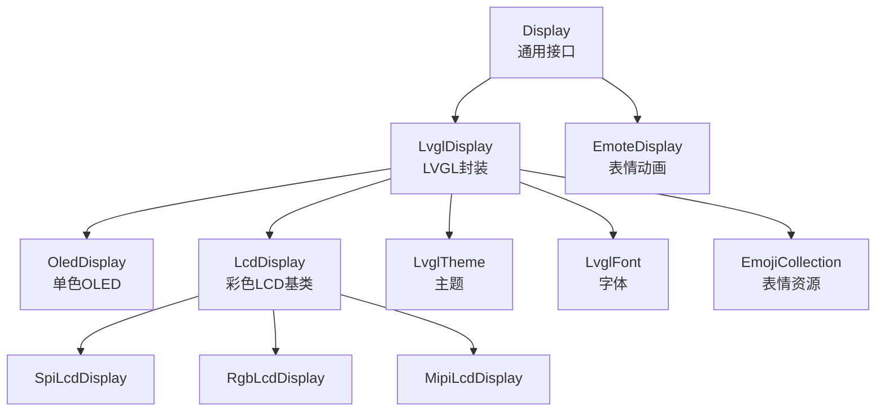
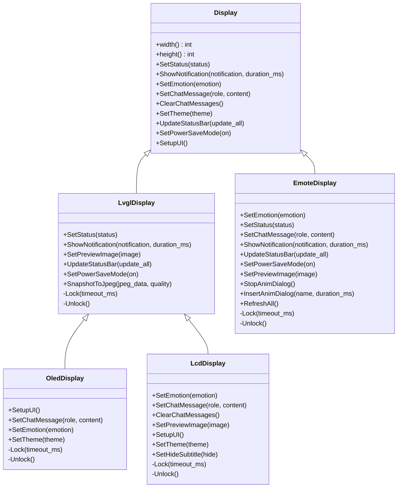
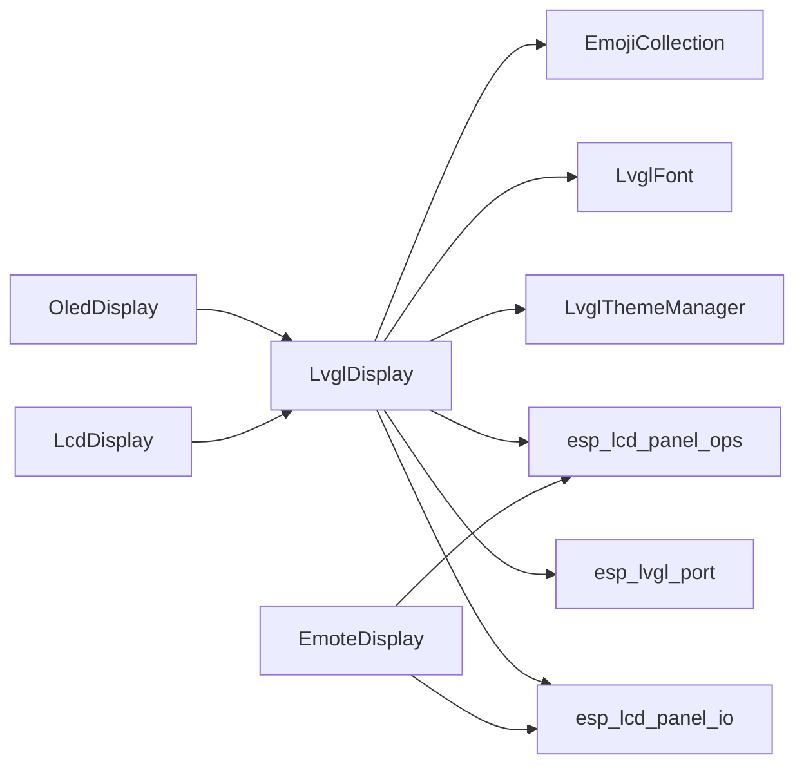

# 显示API

<cite>
**本文引用的文件**
- [main/display/display.h](file://main/display/display.h)
- [main/display/display.cc](file://main/display/display.cc)
- [main/display/lvgl_display/lvgl_display.h](file://main/display/lvgl_display/lvgl_display.h)
- [main/display/lvgl_display/lvgl_display.cc](file://main/display/lvgl_display/lvgl_display.cc)
- [main/display/oled_display.h](file://main/display/oled_display.h)
- [main/display/oled_display.cc](file://main/display/oled_display.cc)
- [main/display/lcd_display.h](file://main/display/lcd_display.h)
- [main/display/lcd_display.cc](file://main/display/lcd_display.cc)
- [main/display/emote_display.h](file://main/display/emote_display.h)
- [main/display/emote_display.cc](file://main/display/emote_display.cc)
- [main/display/lvgl_display/lvgl_theme.h](file://main/display/lvgl_display/lvgl_theme.h)
- [main/display/lvgl_display/lvgl_theme.cc](file://main/display/lvgl_display/lvgl_theme.cc)
- [main/display/lvgl_display/lvgl_font.h](file://main/display/lvgl_display/lvgl_font.h)
- [main/display/lvgl_display/lvgl_font.cc](file://main/display/lvgl_display/lvgl_font.cc)
- [main/display/lvgl_display/emoji_collection.h](file://main/display/lvgl_display/emoji_collection.h)
- [main/display/lvgl_display/emoji_collection.cc](file://main/display/lvgl_display/emoji_collection.cc)
</cite>

## 目录
1. [简介](#简介)
2. [项目结构](#项目结构)
3. [核心组件](#核心组件)
4. [架构总览](#架构总览)
5. [详细组件分析](#详细组件分析)
6. [依赖关系分析](#依赖关系分析)
7. [性能考虑](#性能考虑)
8. [故障排查指南](#故障排查指南)
9. [结论](#结论)
10. [附录](#附录)

## 简介
本文件为Display显示系统的API参考文档，覆盖通用显示接口与具体实现（OLED与LCD），并包含表情显示系统、动画效果、主题与字体、截图能力、电源管理、通知与状态栏更新、调试与分辨率适配、多语言支持等高级功能。文档同时提供性能优化、内存管理与功耗控制的技术建议。

## 项目结构
显示子系统采用分层设计：
- 抽象基类：Display（通用接口）
- LVGL封装：LvglDisplay（统一的状态栏、通知、电源模式、截图等）
- 具体实现：OledDisplay（单色OLED）、LcdDisplay及其派生（SPI/LCD/RGB/MIPI LCD）、EmoteDisplay（表情动画）
- 主题与字体：LvglTheme/LvglFont/EmojiCollection
- 图像与动画：LvglImage/LvglGif

图表来源
- [main/display/display.h](file://main/display/display.h#L28-L61)
- [main/display/lvgl_display/lvgl_display.h](file://main/display/lvgl_display/lvgl_display.h#L15-L50)
- [main/display/oled_display.h](file://main/display/oled_display.h#L10-L39)
- [main/display/lcd_display.h](file://main/display/lcd_display.h#L17-L83)
- [main/display/emote_display.h](file://main/display/emote_display.h#L12-L40)
- [main/display/lvgl_display/lvgl_theme.h](file://main/display/lvgl_display/lvgl_theme.h)
- [main/display/lvgl_display/lvgl_font.h](file://main/display/lvgl_display/lvgl_font.h)
- [main/display/lvgl_display/emoji_collection.h](file://main/display/lvgl_display/emoji_collection.h)

章节来源
- [main/display/display.h](file://main/display/display.h#L28-L61)
- [main/display/lvgl_display/lvgl_display.h](file://main/display/lvgl_display/lvgl_display.h#L15-L50)
- [main/display/oled_display.h](file://main/display/oled_display.h#L10-L39)
- [main/display/lcd_display.h](file://main/display/lcd_display.h#L17-L83)
- [main/display/emote_display.h](file://main/display/emote_display.h#L12-L40)

## 核心组件
- Display：定义通用显示接口，如初始化标记、状态设置、通知、表情、聊天消息、主题切换、电源模式、UI构建等。
- LvglDisplay：在Display之上封装LVGL通用能力，包括通知定时器、状态栏图标更新（静音、电量、网络）、电源锁、截图等。
- OledDisplay：基于LVGL的单色OLED实现，支持128x64与128x32布局，表情使用FontAwesome图标或内置大号图标。
- LcdDisplay：基于LVGL的彩色LCD实现，支持多种面板类型（SPI/LCD/RGB/MIPI），支持WeChat风格消息气泡、图片预览、表情GIF播放、隐藏副标题等。
- EmoteDisplay：基于独立表情引擎的显示实现，支持插入动画对话框、停止动画、全量刷新等。

章节来源
- [main/display/display.h](file://main/display/display.h#L28-L61)
- [main/display/lvgl_display/lvgl_display.h](file://main/display/lvgl_display/lvgl_display.h#L15-L50)
- [main/display/oled_display.h](file://main/display/oled_display.h#L10-L39)
- [main/display/lcd_display.h](file://main/display/lcd_display.h#L17-L83)
- [main/display/emote_display.h](file://main/display/emote_display.h#L12-L40)

## 架构总览
显示系统通过Display抽象统一对外接口，内部以LvglDisplay为通用层，向下对接不同面板驱动（OLED/LCD/Emote），并通过LvglTheme/LvglFont/EmojiCollection提供主题化外观与表情资源。

图表来源
- [main/display/display.h](file://main/display/display.h#L28-L61)
- [main/display/lvgl_display/lvgl_display.h](file://main/display/lvgl_display/lvgl_display.h#L15-L50)
- [main/display/oled_display.h](file://main/display/oled_display.h#L10-L39)
- [main/display/lcd_display.h](file://main/display/lcd_display.h#L17-L83)
- [main/display/emote_display.h](file://main/display/emote_display.h#L12-L40)

## 详细组件分析

### Display 抽象接口
- 初始化与生命周期
  - SetupUI()：标记UI已初始化；避免重复调用
  - width()/height()：返回屏幕分辨率
- 用户交互
  - SetStatus(const char*)：设置顶部状态文本
  - ShowNotification(const char*, int)：显示通知，带持续时间定时器
  - SetEmotion(const char*)：设置表情（字符串名称）
  - SetChatMessage(const char*, const char*)：设置聊天消息（role/content）
  - ClearChatMessages()：清理聊天消息
  - SetTheme(Theme*)：切换主题并持久化
  - UpdateStatusBar(bool)：更新状态栏图标（静音、电量、网络）
  - SetPowerSaveMode(bool)：进入/退出省电模式
- 并发与锁定
  - DisplayLockGuard：自动加解锁，防止LVGL对象并发访问
  - Lock()/Unlock()：虚函数，由子类实现

章节来源
- [main/display/display.h](file://main/display/display.h#L28-L61)
- [main/display/display.cc](file://main/display/display.cc#L17-L60)

### LvglDisplay 通用LVGL封装
- 通知与状态栏
  - ShowNotification：显示通知并启动一次性定时器，到期后恢复状态文本
  - UpdateStatusBar：周期性更新静音、电池、网络图标；空闲时每10秒更新时间为“HH:MM”
  - SetPowerSaveMode：根据开关切换表情与消息
- 截图能力
  - SnapshotToJpeg：对当前屏幕快照并编码为JPEG（需启用LV_USE_SNAPSHOT）
- 电源管理
  - 创建并持有PM锁，在状态栏更新期间提升APB频率

章节来源
- [main/display/lvgl_display/lvgl_display.h](file://main/display/lvgl_display/lvgl_display.h#L15-L50)
- [main/display/lvgl_display/lvgl_display.cc](file://main/display/lvgl_display/lvgl_display.cc#L18-L271)

### OledDisplay 单色OLED实现
- 屏幕尺寸与布局
  - 支持128x64与128x32两种布局，分别在SetupUI_128x64与SetupUI_128x32中构建UI层次
- 字体与主题
  - 内置文本、图标与大号图标字体；默认深色主题
- 表情与聊天
  - SetEmotion：将表情名映射为FontAwesome UTF-8字符，显示于左侧大号标签
  - SetChatMessage：支持单行滚动文本，128x64布局下右侧区域可显示滚动文本
- 刷新与旋转
  - 通过LVGL端口配置monochrome=true、旋转镜像参数

章节来源
- [main/display/oled_display.h](file://main/display/oled_display.h#L10-L39)
- [main/display/oled_display.cc](file://main/display/oled_display.cc#L20-L409)

### LcdDisplay 彩色LCD实现
- 面板类型
  - SpiLcdDisplay、RgbLcdDisplay、MipiLcdDisplay：分别对应SPI/LCD、RGB、MIPI接口
- 主题与字体
  - 提供浅色/深色主题，支持背景图、气泡颜色、边框、低电量提示色等
- 聊天与图片
  - WeChat风格：按角色生成消息气泡，支持系统消息折叠、最大消息数限制、自动滚动
  - SetPreviewImage：在聊天区插入图片预览，自动缩放至最大宽高限制
- 动画与表情
  - SetEmotion：优先从EmojiCollection加载图片/GIF；若无则回退到FontAwesome图标；支持停止GIF并隐藏控件
- 隐藏副标题
  - SetHideSubtitle：隐藏底部副标题栏，立即生效

章节来源
- [main/display/lcd_display.h](file://main/display/lcd_display.h#L17-L83)
- [main/display/lcd_display.cc](file://main/display/lcd_display.cc#L65-L1260)

### EmoteDisplay 表情动画实现
- 初始化与回调
  - 使用独立表情引擎初始化句柄，注册IO刷新回调，直接向面板写入像素
- 动画控制
  - InsertAnimDialog：插入指定表情动画并设定时长
  - StopAnimDialog：停止当前动画对话框
  - RefreshAll：触发全量刷新
- 消息与状态
  - SetChatMessage/SetStatus/SetNotification：将系统事件映射到表情引擎事件
  - SetPreviewImage：不支持预览图（记录日志）

章节来源
- [main/display/emote_display.h](file://main/display/emote_display.h#L12-L40)
- [main/display/emote_display.cc](file://main/display/emote_display.cc#L74-L250)

### 主题与字体系统
- 主题（LvglTheme）
  - 文本/图标/大号图标字体、背景色/图片、聊天气泡色、边框色、低电量提示色、间距等
  - 支持注册与按名称获取主题
- 字体（LvglFont）
  - 内置文本、图标、大号图标字体声明与使用
- 表情集合（EmojiCollection）
  - 通过表情名获取图片描述，支持GIF检测与帧回调

章节来源
- [main/display/lvgl_display/lvgl_theme.h](file://main/display/lvgl_display/lvgl_theme.h)
- [main/display/lvgl_display/lvgl_theme.cc](file://main/display/lvgl_display/lvgl_theme.cc)
- [main/display/lvgl_display/lvgl_font.h](file://main/display/lvgl_display/lvgl_font.h)
- [main/display/lvgl_display/lvgl_font.cc](file://main/display/lvgl_display/lvgl_font.cc)
- [main/display/lvgl_display/emoji_collection.h](file://main/display/lvgl_display/emoji_collection.h)
- [main/display/lvgl_display/emoji_collection.cc](file://main/display/lvgl_display/emoji_collection.cc)

## 依赖关系分析
- 组件耦合
  - LvglDisplay依赖LVGL端口与主题/字体/表情资源
  - OledDisplay/LcdDisplay均继承LvglDisplay，共享通知、状态栏、截图等能力
  - EmoteDisplay独立于LVGL，直接与面板IO交互
- 外部依赖
  - LVGL端口（esp_lvgl_port）、面板驱动（esp_lcd_panel_*）、电源管理（esp_pm）、定时器（esp_timer）

图表来源
- [main/display/lvgl_display/lvgl_display.cc](file://main/display/lvgl_display/lvgl_display.cc#L18-L70)
- [main/display/oled_display.cc](file://main/display/oled_display.cc#L40-L77)
- [main/display/lcd_display.cc](file://main/display/lcd_display.cc#L129-L163)
- [main/display/emote_display.cc](file://main/display/emote_display.cc#L74-L112)

章节来源
- [main/display/lvgl_display/lvgl_display.cc](file://main/display/lvgl_display/lvgl_display.cc#L18-L70)
- [main/display/oled_display.cc](file://main/display/oled_display.cc#L40-L77)
- [main/display/lcd_display.cc](file://main/display/lcd_display.cc#L129-L163)
- [main/display/emote_display.cc](file://main/display/emote_display.cc#L74-L112)

## 性能考虑
- 刷新策略
  - OLED：monochrome=true，减少带宽与内存占用
  - LCD：RGB/MIPI可开启双缓冲与避免撕裂，SPI模式默认单缓冲
- 图像缓存
  - 在具备PSRAM时启用LVGL图像缓存，降低解码开销
- 功耗控制
  - UpdateStatusBar期间获取PM锁提升频率，结束后释放；省电模式下切换表情与清空消息
- 内存管理
  - 图片/GIF使用智能指针管理生命周期；聊天消息超过阈值时删除最旧项，保持滚动流畅
- 截图
  - 使用回调式JPEG编码，避免一次性分配大块内存

章节来源
- [main/display/oled_display.cc](file://main/display/oled_display.cc#L48-L77)
- [main/display/lcd_display.cc](file://main/display/lcd_display.cc#L116-L126)
- [main/display/lcd_display.cc](file://main/display/lcd_display.cc#L504-L698)
- [main/display/lvgl_display/lvgl_display.cc](file://main/display/lvgl_display/lvgl_display.cc#L230-L271)

## 故障排查指南
- UI未初始化导致调用失败
  - 现象：SetChatMessage/SetEmotion等在SetupUI前调用会记录警告
  - 处理：确保先调用SetupUI后再进行渲染操作
- 对象为空指针
  - 现象：status_label_/content_等为空时记录错误
  - 处理：确认UI已成功创建且未被提前销毁
- 通知显示异常
  - 现象：通知显示后未自动隐藏
  - 处理：检查通知定时器是否创建成功，确认duration_ms参数正确
- 低电量弹窗
  - 现象：低电量弹窗未出现或无法关闭
  - 处理：确认电池状态读取正常，图标变化后弹窗显隐逻辑生效
- 截图失败
  - 现象：SnapshotToJpeg返回false
  - 处理：确认LV_USE_SNAPSHOT已启用，颜色格式匹配

章节来源
- [main/display/display.cc](file://main/display/display.cc#L23-L50)
- [main/display/lvgl_display/lvgl_display.cc](file://main/display/lvgl_display/lvgl_display.cc#L72-L111)
- [main/display/lvgl_display/lvgl_display.cc](file://main/display/lvgl_display/lvgl_display.cc#L177-L190)
- [main/display/lvgl_display/lvgl_display.cc](file://main/display/lvgl_display/lvgl_display.cc#L230-L271)

## 结论
该显示系统以Display为抽象核心，通过LvglDisplay统一LVGL能力，向下兼容OLED与多种LCD面板，并提供表情动画与主题化外观。系统在性能、内存与功耗方面提供了多项优化策略，同时具备通知、状态栏、截图、多语言等实用功能。建议在实际部署中结合目标硬件特性选择合适的面板类型与刷新策略，并合理使用主题与动画以平衡视觉体验与资源消耗。

## 附录

### API规范摘要

- 通用接口（Display）
  - Initialize/SetupUI：标记UI初始化完成
  - SetStatus/ShowNotification：状态文本与通知显示
  - SetEmotion：表情设置（字符串名称）
  - SetChatMessage/ClearChatMessages：聊天消息设置与清理
  - SetTheme/UpdateStatusBar/SetPowerSaveMode：主题切换、状态栏更新、省电模式
  - width/height：屏幕分辨率查询

- LVGL封装（LvglDisplay）
  - SetPreviewImage：预览图像设置（部分实现可用）
  - SnapshotToJpeg：屏幕截图转JPEG

- OLED实现（OledDisplay）
  - SetupUI：128x64/128x32布局构建
  - SetChatMessage/SetEmotion/SetTheme：表情与文本渲染

- LCD实现（LcdDisplay）
  - 多种面板类型构造（SPI/LCD/RGB/MIPI）
  - WeChat风格消息气泡、图片预览、表情GIF播放
  - SetHideSubtitle：隐藏副标题栏

- 表情实现（EmoteDisplay）
  - InsertAnimDialog/StopAnimDialog/RefreshAll：动画控制
  - SetChatMessage/SetStatus/ShowNotification：事件映射

章节来源
- [main/display/display.h](file://main/display/display.h#L28-L61)
- [main/display/lvgl_display/lvgl_display.h](file://main/display/lvgl_display/lvgl_display.h#L15-L50)
- [main/display/oled_display.h](file://main/display/oled_display.h#L10-L39)
- [main/display/lcd_display.h](file://main/display/lcd_display.h#L17-L83)
- [main/display/emote_display.h](file://main/display/emote_display.h#L12-L40)