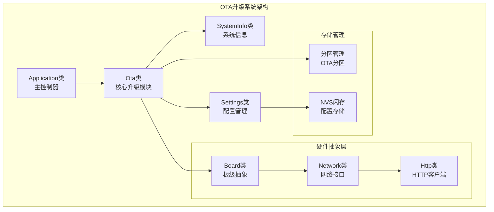
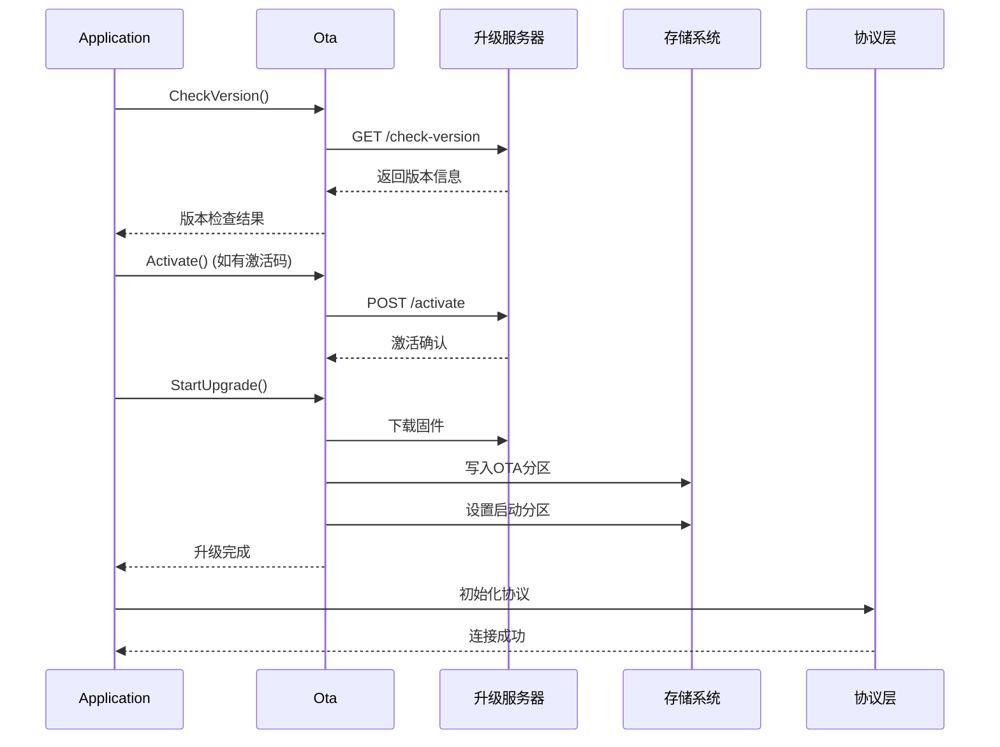
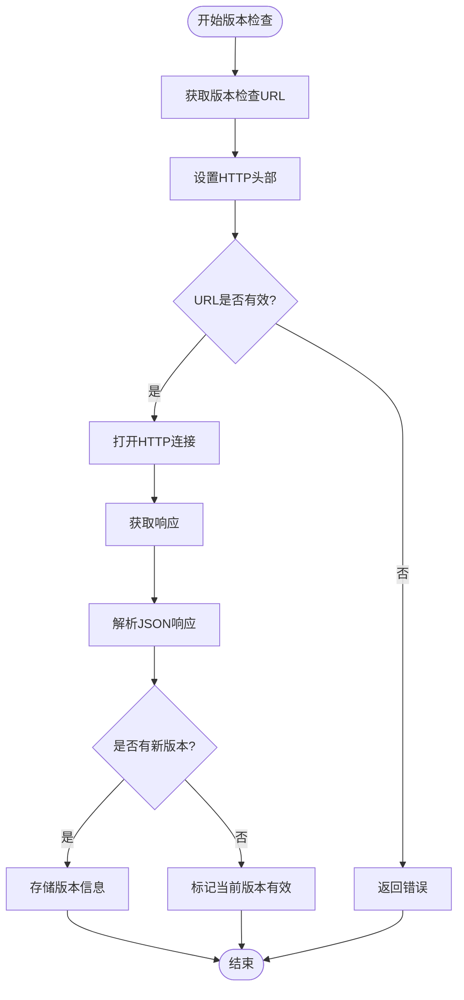
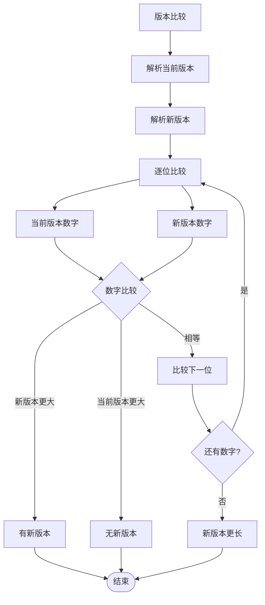
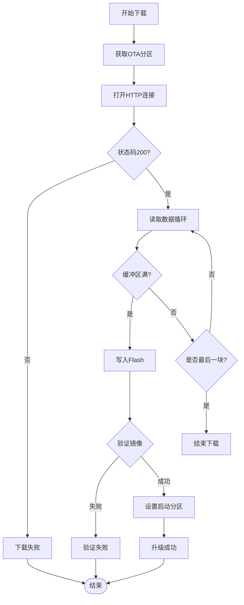
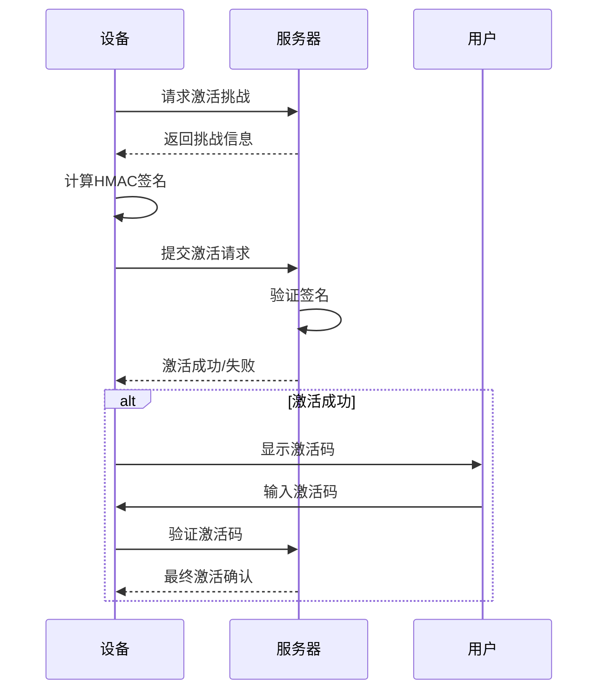
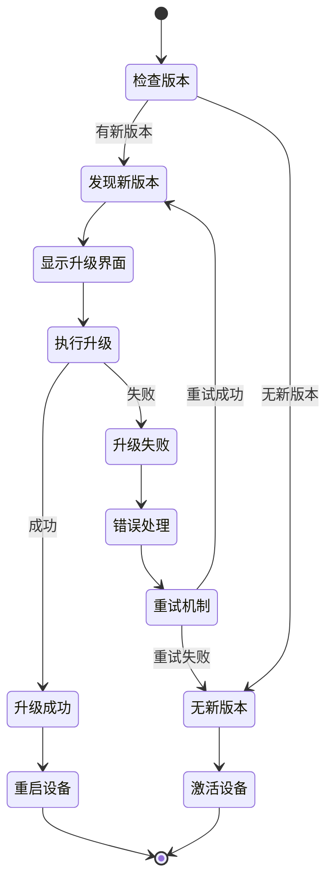
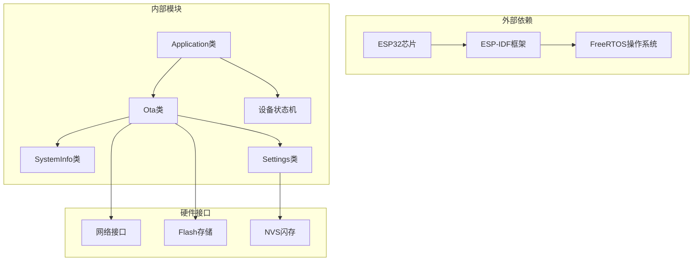
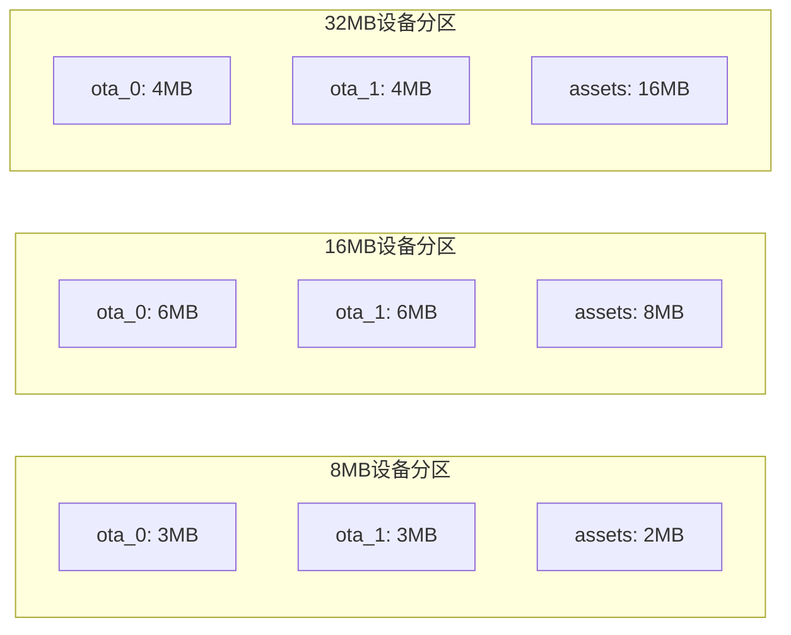

# OTA固件升级API

<cite>
**本文档引用的文件**
- [ota.h](file://main/ota.h)
- [ota.cc](file://main/ota.cc)
- [application.h](file://main/application.h)
- [application.cc](file://main/application.cc)
- [system_info.h](file://main/system_info.h)
- [system_info.cc](file://main/system_info.cc)
- [settings.h](file://main/settings.h)
- [device_state.h](file://main/device_state.h)
- [device_state_machine.h](file://main/device_state_machine.h)
- [8m.csv](file://partitions/v2/8m.csv)
- [16m.csv](file://partitions/v2/16m.csv)
- [32m.csv](file://partitions/v2/32m.csv)
</cite>

## 目录
1. [简介](#简介)
2. [项目结构](#项目结构)
3. [核心组件](#核心组件)
4. [架构概览](#架构概览)
5. [详细组件分析](#详细组件分析)
6. [依赖关系分析](#依赖关系分析)
7. [性能考虑](#性能考虑)
8. [故障排除指南](#故障排除指南)
9. [结论](#结论)
10. [附录](#附录)

## 简介

本文档提供了ESP32设备OTA（Over-The-Air）固件升级系统的完整API参考文档。该系统实现了从版本检查、固件下载到安装升级的完整流程，包含激活码系统、版本管理、升级流程控制、安全验证等核心技术。

OTA升级系统基于ESP-IDF框架构建，采用模块化设计，通过Ota类提供核心升级功能，Application类负责协调整个升级流程，SystemInfo类提供系统信息查询，Settings类管理配置参数。

## 项目结构

OTA固件升级系统主要由以下核心模块组成：

**图表来源**
- [ota.h](file://main/ota.h#L10-L56)
- [application.h](file://main/application.h#L42-L172)
- [system_info.h](file://main/system_info.h#L9-L21)

**章节来源**
- [ota.h](file://main/ota.h#L1-L59)
- [application.h](file://main/application.h#L1-L190)

## 核心组件

### Ota类 - 核心升级模块

Ota类是OTA升级系统的核心，提供完整的固件升级功能：

#### 主要接口
- `CheckVersion()` - 检查新版本
- `Activate()` - 设备激活
- `StartUpgrade()` - 开始升级
- `MarkCurrentVersionValid()` - 标记当前版本有效

#### 关键属性
- 版本管理：current_version_, firmware_version_
- 升级状态：has_new_version_, has_activation_challenge_
- 配置参数：activation_timeout_ms_
- 网络配置：has_mqtt_config_, has_websocket_config_

**章节来源**
- [ota.h](file://main/ota.h#L10-L56)
- [ota.cc](file://main/ota.cc#L28-L493)

### Application类 - 主控制器

Application类负责协调整个OTA升级流程，包括版本检查、激活码处理、协议初始化等：

#### 协调功能
- 版本检查循环
- 激活码显示和输入
- 升级流程控制
- 错误处理和重试机制

**章节来源**
- [application.h](file://main/application.h#L42-L172)
- [application.cc](file://main/application.cc#L323-L471)

## 架构概览

OTA升级系统采用分层架构设计，确保各组件职责清晰、耦合度低：

**图表来源**
- [application.cc](file://main/application.cc#L398-L471)
- [ota.cc](file://main/ota.cc#L77-L245)
- [ota.cc](file://main/ota.cc#L267-L387)

## 详细组件分析

### 版本检查流程

版本检查是OTA升级的第一步，系统会向服务器请求最新的固件信息：

**图表来源**
- [ota.cc](file://main/ota.cc#L77-L245)

#### 版本比较算法

系统使用语义化版本比较算法，支持多级版本号比较：

**图表来源**
- [ota.cc](file://main/ota.cc#L406-L419)

**章节来源**
- [ota.cc](file://main/ota.cc#L77-L245)
- [ota.cc](file://main/ota.cc#L394-L419)

### 固件下载与安装

固件下载采用流式传输方式，支持断点续传和完整性校验：

**图表来源**
- [ota.cc](file://main/ota.cc#L267-L387)

#### 安全验证机制

系统实现了多层次的安全验证：

1. **HMAC签名验证**：使用ESP32的HMAC功能进行数据完整性验证
2. **OTA分区验证**：ESP-IDF内置的OTA镜像验证机制
3. **网络传输安全**：支持HTTPS传输
4. **设备身份验证**：基于序列号的设备识别

**章节来源**
- [ota.cc](file://main/ota.cc#L267-L387)
- [ota.cc](file://main/ota.cc#L421-L456)

### 激活码系统

激活码系统提供设备注册和授权功能：

**图表来源**
- [ota.cc](file://main/ota.cc#L458-L492)

**章节来源**
- [ota.cc](file://main/ota.cc#L421-L456)
- [ota.cc](file://main/ota.cc#L458-L492)

### 升级流程控制

Application类负责协调整个升级流程，包括错误处理和重试机制：

**图表来源**
- [application.cc](file://main/application.cc#L398-L471)
- [application.cc](file://main/application.cc#L967-L1017)

**章节来源**
- [application.cc](file://main/application.cc#L398-L471)
- [application.cc](file://main/application.cc#L967-L1017)

## 依赖关系分析

OTA升级系统的关键依赖关系如下：

**图表来源**
- [ota.h](file://main/ota.h#L1-L59)
- [application.h](file://main/application.h#L1-L190)

**章节来源**
- [ota.h](file://main/ota.h#L1-L59)
- [application.h](file://main/application.h#L1-L190)

## 性能考虑

### 内存管理

OTA升级过程中的内存使用需要特别关注：

- **缓冲区大小**：使用4KB页面大小进行数据传输
- **堆栈使用**：升级过程中临时增加内存占用
- **碎片整理**：升级完成后进行内存碎片整理

### 网络优化

- **超时设置**：合理的HTTP连接超时和读取超时
- **重试策略**：指数退避的重试机制
- **带宽控制**：避免影响其他网络服务

### 存储优化

- **分区布局**：合理的OTA分区大小分配
- **磨损均衡**：在两个OTA分区间轮换使用
- **空间预留**：为系统运行预留足够的存储空间

## 故障排除指南

### 常见问题及解决方案

#### 版本检查失败
- **症状**：无法获取最新版本信息
- **原因**：网络连接问题、服务器响应异常
- **解决**：检查网络配置、查看日志输出、重试连接

#### 升级下载中断
- **症状**：下载过程中断
- **原因**：网络不稳定、服务器问题
- **解决**：启用自动重试、检查网络质量

#### 验证失败
- **症状**：升级后设备无法正常启动
- **原因**：固件损坏、验证失败
- **解决**：重新下载固件、检查存储空间

#### 激活失败
- **症状**：设备无法完成激活
- **原因**：激活码错误、HMAC计算失败
- **解决**：重新生成激活码、检查设备序列号

**章节来源**
- [ota.cc](file://main/ota.cc#L370-L377)
- [application.cc](file://main/application.cc#L408-L431)

## 结论

OTA固件升级系统提供了完整的设备远程升级解决方案，具有以下特点：

1. **安全性**：多重验证机制确保升级过程的安全性
2. **可靠性**：完善的错误处理和重试机制
3. **易用性**：简洁的API接口和清晰的升级流程
4. **可扩展性**：模块化设计便于功能扩展

该系统适用于各种ESP32设备的固件升级需求，为设备维护和功能更新提供了可靠的保障。

## 附录

### 配置参数说明

| 参数名称 | 类型 | 默认值 | 描述 |
|---------|------|--------|------|
| ota_url | 字符串 | 空 | OTA服务器地址 |
| activation_timeout_ms | 整数 | 30000 | 激活超时时间(毫秒) |
| retry_count | 整数 | 10 | 最大重试次数 |
| retry_delay | 整数 | 10 | 初始重试延迟(秒) |

### 系统要求

- **存储空间**：至少需要两个OTA分区的空间
- **网络要求**：稳定的网络连接，支持HTTP/HTTPS协议
- **电源要求**：升级过程中需要稳定的电源供应
- **时间窗口**：建议在设备空闲时进行升级

### 分区配置示例

不同容量的设备需要不同的分区配置：

**图表来源**
- [8m.csv](file://partitions/v2/8m.csv#L6-L7)
- [16m.csv](file://partitions/v2/16m.csv#L6-L7)
- [32m.csv](file://partitions/v2/32m.csv#L7-L8)