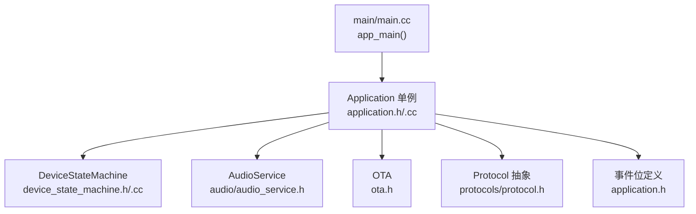
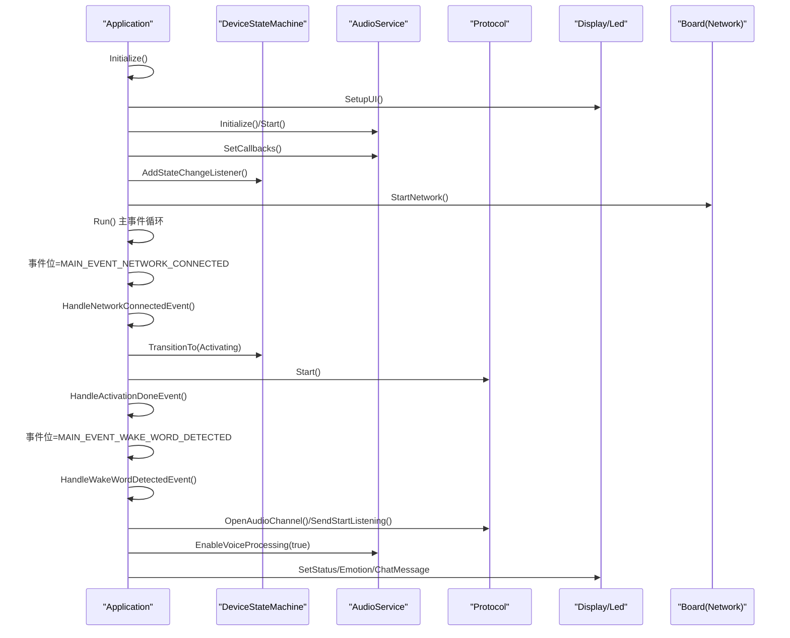
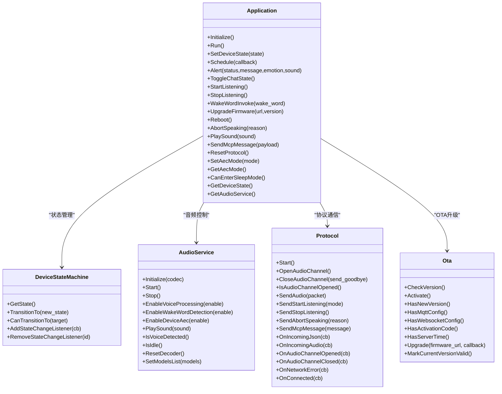

# Application应用API

<cite>
**本文引用的文件**
- [main/application.h](file://main/application.h)
- [main/application.cc](file://main/application.cc)
- [main/main.cc](file://main/main.cc)
- [main/device_state.h](file://main/device_state.h)
- [main/device_state_machine.h](file://main/device_state_machine.h)
- [main/device_state_machine.cc](file://main/device_state_machine.cc)
- [main/audio/audio_service.h](file://main/audio/audio_service.h)
- [main/ota.h](file://main/ota.h)
- [main/protocols/protocol.h](file://main/protocols/protocol.h)
</cite>

## 目录
1. [简介](#简介)
2. [项目结构](#项目结构)
3. [核心组件](#核心组件)
4. [架构总览](#架构总览)
5. [详细组件分析](#详细组件分析)
6. [依赖关系分析](#依赖关系分析)
7. [性能考量](#性能考量)
8. [故障排查指南](#故障排查指南)
9. [结论](#结论)
10. [附录](#附录)

## 简介
本文件为Application主应用类的详细API参考文档。Application是系统的单例入口，负责：
- 初始化系统（显示、音频、网络、协议）
- 运行主事件循环（基于FreeRTOS事件组）
- 状态管理与状态机交互
- 回调调度（跨任务安全）
- 告警显示与音效播放
- 聊天状态切换与语音监听控制
- 固件升级与重启
- 唤醒词触发与音频通道管理
- 与音频服务、OTA、协议层的深度集成

文档覆盖所有公共方法的参数、返回值、线程安全性、使用场景与调用示例，并解释事件位、状态机交互与音频服务集成等关键概念。

## 项目结构
Application位于main目录，与设备状态机、音频服务、OTA、协议抽象等模块协同工作。其入口在main函数中被调用，完成初始化后进入Run主事件循环。

图表来源
- [main/main.cc](file://main/main.cc#L15-L31)
- [main/application.h](file://main/application.h#L20-L34)
- [main/application.cc](file://main/application.cc#L61-L163)

章节来源
- [main/main.cc](file://main/main.cc#L15-L31)
- [main/application.h](file://main/application.h#L20-L34)

## 核心组件
- Application：单例主控制器，封装初始化、事件循环、状态切换、调度、告警、监听控制、升级、唤醒词触发等。
- DeviceStateMachine：严格的状态机，保证合法状态转换并通知观察者。
- AudioService：音频采集/编码/解码/播放队列与任务管理，提供唤醒词检测、VAD、AEC等能力。
- OTA：版本检查、激活、固件升级。
- Protocol：音频通道打开/关闭、发送音频/文本、接收消息的抽象接口。

章节来源
- [main/application.h](file://main/application.h#L42-L172)
- [main/device_state_machine.h](file://main/device_state_machine.h#L17-L81)
- [main/audio/audio_service.h](file://main/audio/audio_service.h#L105-L193)
- [main/ota.h](file://main/ota.h#L10-L56)
- [main/protocols/protocol.h](file://main/protocols/protocol.h#L44-L95)

## 架构总览
Application通过事件位驱动主循环，将外部事件（网络、音频、状态变化）转化为内部处理流程；同时通过状态机驱动UI与硬件行为，通过音频服务与协议层完成端到端语音链路。

图表来源
- [main/application.cc](file://main/application.cc#L165-L259)
- [main/application.cc](file://main/application.cc#L261-L338)
- [main/application.cc](file://main/application.cc#L776-L820)
- [main/device_state_machine.cc](file://main/device_state_machine.cc#L108-L131)
- [main/audio/audio_service.h](file://main/audio/audio_service.h#L105-L193)
- [main/protocols/protocol.h](file://main/protocols/protocol.h#L44-L95)

## 详细组件分析

### Application 单例与事件位
- 单例获取：GetInstance() 返回静态实例，禁止拷贝构造与赋值。
- 事件位（Main Event Bits）：用于事件驱动的主循环，涵盖调度、音频发送、唤醒词检测、VAD变化、错误、激活完成、时钟tick、网络连接/断开、聊天切换、开始/停止监听、状态变更等。
- 线程安全：事件位与互斥锁保护回调队列，Schedule()提供跨任务安全执行入口。

章节来源
- [main/application.h](file://main/application.h#L42-L51)
- [main/application.h](file://main/application.h#L20-L34)
- [main/application.cc](file://main/application.cc#L929-L935)

### Initialize() 初始化
- 功能：设置显示UI、初始化并启动音频服务、注册音频回调、添加状态变化监听、启动周期时钟、注册MCP工具、设置网络事件回调、异步启动网络。
- 关键点：音频回调将事件位置位；状态变化监听通过事件位通知；网络事件回调更新UI并置位相应事件位。
- 使用场景：系统上电后的首次初始化。
- 示例路径：见“附录：完整初始化与控制示例”。

章节来源
- [main/application.cc](file://main/application.cc#L61-L163)

### Run() 主事件循环
- 功能：设置主任务优先级，等待事件位，按位分发处理，包括网络连接/断开、激活完成、状态变更、聊天切换、开始/停止监听、音频发送、唤醒词检测、VAD变化、调度队列、时钟tick等。
- 处理策略：每类事件对应一个处理器，必要时通过Schedule()将UI/播放等操作切回主任务。
- 性能：事件驱动避免忙轮询，周期时钟用于状态栏刷新与调试输出。

章节来源
- [main/application.cc](file://main/application.cc#L165-L259)

### SetDeviceState() 状态切换
- 功能：委托DeviceStateMachine执行状态转换，返回是否成功。
- 线程安全：直接调用状态机，状态机内部有原子与互斥保护。
- 使用场景：任何需要改变设备状态的逻辑入口（如从空闲进入连接/监听/说话）。

章节来源
- [main/application.h](file://main/application.h#L66-L73)
- [main/application.cc](file://main/application.cc#L57-L59)
- [main/device_state_machine.h](file://main/device_state_machine.h#L31-L41)

### Schedule() 回调调度
- 功能：将回调入队并置位调度事件位，主循环在MAIN_EVENT_SCHEDULE触发时批量执行队列中的任务。
- 线程安全：内部互斥保护队列，跨任务安全。
- 使用场景：将UI更新、音效播放等必须在主任务执行的操作安全地调度到主循环。

章节来源
- [main/application.h](file://main/application.h#L75-L78)
- [main/application.cc](file://main/application.cc#L929-L935)

### Alert() 告警显示
- 功能：设置状态、表情、聊天消息，并可选播放音效。
- 线程安全：建议在主任务或通过Schedule()调用。
- 使用场景：网络错误、激活提示、OTA进度、系统命令等。

章节来源
- [main/application.h](file://main/application.h#L80-L84)
- [main/application.cc](file://main/application.cc#L642-L660)

### ToggleChatState() 聊天状态切换
- 功能：发送MAIN_EVENT_TOGGLE_CHAT事件，由主循环处理，根据当前状态在激活/配置/音频测试之间切换，或发起连接/关闭音频通道。
- 线程安全：事件位方式，跨任务安全。
- 使用场景：用户按键/触摸触发的聊天模式切换。

章节来源
- [main/application.h](file://main/application.h#L88-L92)
- [main/application.cc](file://main/application.cc#L662-L711)

### StartListening()/StopListening() 语音监听控制
- 功能：分别发送MAIN_EVENT_START_LISTENING/MAIN_EVENT_STOP_LISTENING事件；主循环根据协议状态与当前状态决定打开/关闭音频通道、发送开始/停止监听指令、调整监听模式。
- 线程安全：事件位方式，跨任务安全。
- 使用场景：手动触发开始/结束监听。

章节来源
- [main/application.h](file://main/application.h#L94-L104)
- [main/application.cc](file://main/application.cc#L728-L774)

### WakeWordInvoke() 唤醒词触发
- 功能：当处于空闲态时，若音频通道未打开则先打开通道，然后继续唤醒词流程；若正在说话或监听，则中止说话或关闭通道。
- 线程安全：内部通过Schedule()确保在主任务执行关键步骤。
- 使用场景：软件触发唤醒词（如按键长按）。

章节来源
- [main/application.h](file://main/application.h#L107-L107)
- [main/application.cc](file://main/application.cc#L1019-L1050)

### UpgradeFirmware() 固件升级
- 功能：关闭音频通道、显示升级提示、降低功耗、调用OTA升级、失败时恢复音频服务与低功耗、成功则立即重启。
- 线程安全：内部通过Schedule()与事件位协调。
- 使用场景：OTA检查到新版本或手动触发升级。

章节来源
- [main/application.h](file://main/application.h#L108-L108)
- [main/application.cc](file://main/application.cc#L967-L1017)
- [main/ota.h](file://main/ota.h#L23-L24)

### 其他重要接口
- Reboot()：关闭音频通道与协议、停止音频服务、延时后重启。
- AbortSpeaking()：中止说话，向协议发送中止消息。
- DismissAlert()：清除告警状态。
- PlaySound()/SendMcpMessage()/ResetProtocol()/SetAecMode()/GetAecMode()/CanEnterSleepMode()：分别用于音效播放、MCP消息发送、协议重置、AEC模式设置与查询、睡眠模式判断。

章节来源
- [main/application.h](file://main/application.h#L106-L121)
- [main/application.cc](file://main/application.cc#L954-L1118)

## 依赖关系分析

图表来源
- [main/application.h](file://main/application.h#L42-L172)
- [main/device_state_machine.h](file://main/device_state_machine.h#L17-L81)
- [main/audio/audio_service.h](file://main/audio/audio_service.h#L105-L193)
- [main/protocols/protocol.h](file://main/protocols/protocol.h#L44-L95)
- [main/ota.h](file://main/ota.h#L10-L56)

## 性能考量
- 事件驱动：主循环基于事件位等待，避免忙轮询，降低CPU占用。
- 队列化处理：音频发送、回调任务均采用队列，配合互斥锁保证线程安全。
- 采样率与帧时长：音频编码器配置固定帧时长，Decode/Send队列容量与帧时长匹配，避免阻塞。
- 功耗控制：网络连接/断开、升级前后动态调整电源策略。
- 状态机约束：严格的合法状态转换减少无效分支与资源竞争。

## 故障排查指南
- 网络错误：主循环收到MAIN_EVENT_ERROR后，将状态切回空闲并弹出错误告警；检查网络事件回调与协议网络错误回调。
- 激活失败：多次重试后仍失败，检查版本检查URL与OTA配置；确认设备具备有效激活码或挑战。
- 升级失败：升级失败会恢复音频服务与低功耗，检查升级URL与服务器可达性。
- 唤醒词误触发：检查唤醒词检测开关与AEC模式；在监听态可选择禁用唤醒词检测以减少误触。
- 音频卡顿：检查发送队列是否积压，确认音频通道打开状态与采样率匹配。

章节来源
- [main/application.cc](file://main/application.cc#L187-L190)
- [main/application.cc](file://main/application.cc#L408-L431)
- [main/application.cc](file://main/application.cc#L1001-L1008)
- [main/application.cc](file://main/application.cc#L895-L901)

## 结论
Application作为系统中枢，通过事件驱动与状态机协作，实现了稳定可靠的语音交互体验。其API设计强调线程安全与跨模块解耦，适合在多任务环境中可靠运行。建议在调用涉及UI与音频的操作时统一通过Schedule()或事件位触发，确保主循环的稳定性与一致性。

## 附录

### 事件位定义
- MAIN_EVENT_SCHEDULE：调度回调队列执行
- MAIN_EVENT_SEND_AUDIO：音频发送队列可用
- MAIN_EVENT_WAKE_WORD_DETECTED：检测到唤醒词
- MAIN_EVENT_VAD_CHANGE：语音活动(VAD)变化
- MAIN_EVENT_ERROR：网络错误
- MAIN_EVENT_ACTIVATION_DONE：激活完成
- MAIN_EVENT_CLOCK_TICK：周期时钟
- MAIN_EVENT_NETWORK_CONNECTED/DISCONNECTED：网络状态变化
- MAIN_EVENT_TOGGLE_CHAT：聊天状态切换
- MAIN_EVENT_START_LISTENING/STOP_LISTENING：开始/停止监听
- MAIN_EVENT_STATE_CHANGED：设备状态变化

章节来源
- [main/application.h](file://main/application.h#L20-L34)

### 设备状态机交互
- 合法状态转换：状态机提供TransitionTo()与CanTransitionTo()，非法转换会被拒绝并记录日志。
- 状态监听：通过AddStateChangeListener()注册回调，在状态变更时通知观察者。

章节来源
- [main/device_state.h](file://main/device_state.h#L4-L16)
- [main/device_state_machine.h](file://main/device_state_machine.h#L31-L59)
- [main/device_state_machine.cc](file://main/device_state_machine.cc#L108-L131)

### 音频服务集成要点
- 音频输入/输出/编解码任务分离，发送/解码队列容量与OPUS帧时长匹配。
- 唤醒词检测、VAD、AEC、音效播放等功能通过回调与事件位联动。
- 采样率与帧时长不匹配时会发出警告，需关注音频质量。

章节来源
- [main/audio/audio_service.h](file://main/audio/audio_service.h#L28-L76)
- [main/audio/audio_service.h](file://main/audio/audio_service.h#L105-L193)

### 完整初始化与控制示例
以下示例展示如何正确使用Application API进行系统初始化与控制（仅提供路径，不包含具体代码内容）：

- 系统入口与初始化
  - 参考路径：[main/main.cc](file://main/main.cc#L15-L31)
  - 初始化流程：[main/application.cc](file://main/application.cc#L61-L163)

- 主事件循环
  - 参考路径：[main/application.cc](file://main/application.cc#L165-L259)

- 状态切换与UI联动
  - 参考路径：[main/application.cc](file://main/application.cc#L855-L927)
  - 状态机实现：[main/device_state_machine.cc](file://main/device_state_machine.cc#L108-L131)

- 唤醒词触发与监听控制
  - 参考路径：[main/application.cc](file://main/application.cc#L776-L820)
  - 手动监听控制：[main/application.cc](file://main/application.cc#L728-L774)

- 固件升级
  - 参考路径：[main/application.cc](file://main/application.cc#L967-L1017)
  - OTA接口：[main/ota.h](file://main/ota.h#L15-L33)

- 协议与音频通道
  - 协议抽象：[main/protocols/protocol.h](file://main/protocols/protocol.h#L44-L95)
  - 协议初始化与回调：[main/application.cc](file://main/application.cc#L473-L610)