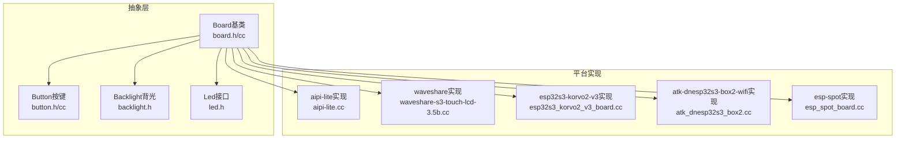
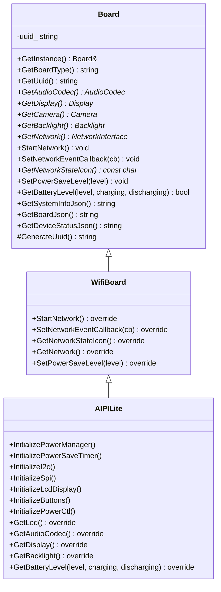
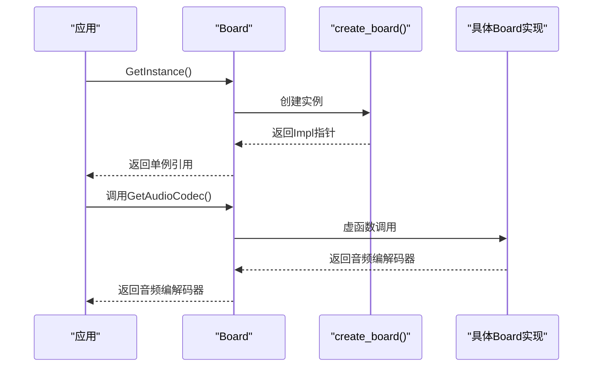
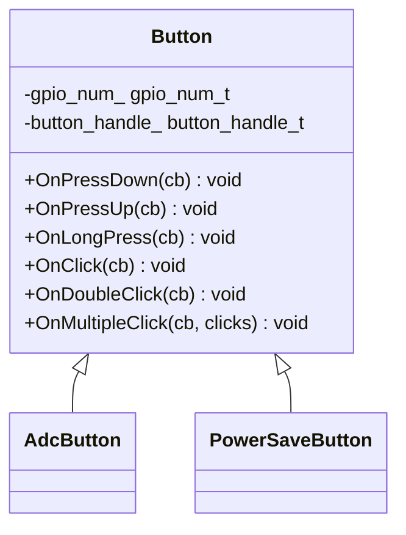
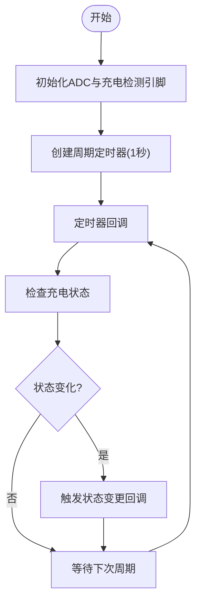
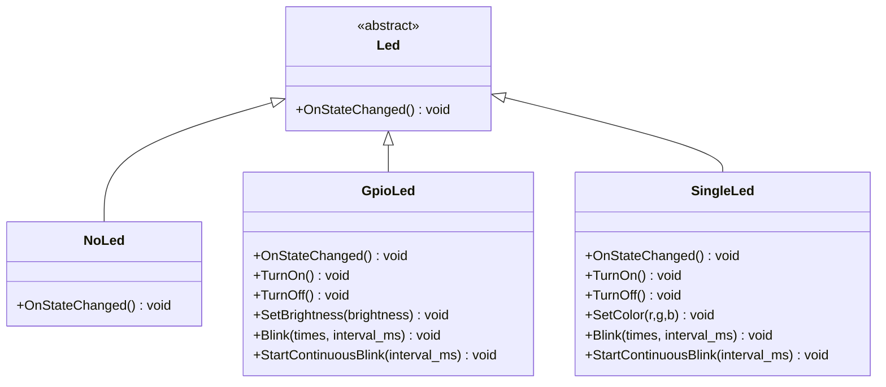
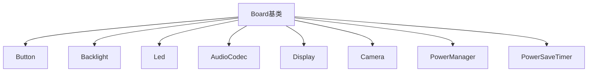

# Board硬件抽象API

<cite>
**本文档引用的文件**
- [board.h](file://main/boards/common/board.h)
- [board.cc](file://main/boards/common/board.cc)
- [button.h](file://main/boards/common/button.h)
- [button.cc](file://main/boards/common/button.cc)
- [adc_battery_monitor.h](file://main/boards/common/adc_battery_monitor.h)
- [adc_battery_monitor.cc](file://main/boards/common/adc_battery_monitor.cc)
- [backlight.h](file://main/boards/common/backlight.h)
- [led.h](file://main/led/led.h)
- [gpio_led.h](file://main/led/gpio_led.h)
- [gpio_led.cc](file://main/led/gpio_led.cc)
- [single_led.h](file://main/led/single_led.h)
- [single_led.cc](file://main/led/single_led.cc)
- [aipi-lite.cc](file://main/boards/aipi-lite/aipi-lite.cc)
- [config.h](file://main/boards/aipi-lite/config.h)
- [config.json](file://main/boards/aipi-lite/config.json)
- [esp32s3_korvo2_v3_board.cc](file://main/boards/esp32s3-korvo2-v3/esp32s3_korvo2_v3_board.cc)
- [waveshare-s3-touch-lcd-3.5b.cc](file://main/boards/waveshare/esp32-s3-touch-lcd-3.5b/waveshare-s3-touch-lcd-3.5b.cc)
- [atk_dnesp32s3_box2.cc](file://main/boards/atk-dnesp32s3-box2-wifi/atk_dnesp32s3_box2.cc)
- [esp_spot_board.cc](file://main/boards/esp-spot/esp_spot_board.cc)
</cite>

## 目录
1. [简介](#简介)
2. [项目结构](#项目结构)
3. [核心组件](#核心组件)
4. [架构总览](#架构总览)
5. [详细组件分析](#详细组件分析)
6. [依赖关系分析](#依赖关系分析)
7. [性能考虑](#性能考虑)
8. [故障排除指南](#故障排除指南)
9. [结论](#结论)
10. [附录](#附录)

## 简介
本文件为Board硬件抽象层的完整API参考文档，面向新硬件平台适配与二次开发。内容覆盖Board基类的设计模式、通用硬件接口规范、抽象方法定义、具体实现要求，以及硬件配置文件格式、引脚定义、外设控制、传感器接口等。同时提供新硬件平台适配的API规范、实现指南、调试工具与测试方法，帮助开发者快速、正确地在不同硬件平台上集成统一的硬件抽象接口。

## 项目结构
Board抽象层位于main/boards/common目录，采用“公共抽象 + 平台特定实现”的分层组织方式：
- 抽象层：Board基类、Button按键、Backlight背光、LED接口等
- 平台实现：各厂商/型号的硬件板卡实现，如aipi-lite、waveshare系列、esp32s3-korvo2-v3等
- 配置文件：每个板卡的config.h定义引脚、外设参数；config.json定义目标芯片与分区表

**图表来源**
- [board.h](file://main/boards/common/board.h#L49-L85)
- [button.h](file://main/boards/common/button.h#L11-L34)
- [backlight.h](file://main/boards/common/backlight.h#L10-L36)
- [led.h](file://main/led/led.h#L4-L16)
- [aipi-lite.cc](file://main/boards/aipi-lite/aipi-lite.cc#L26-L247)
- [waveshare-s3-touch-lcd-3.5b.cc](file://main/boards/waveshare/esp32-s3-touch-lcd-3.5b/waveshare-s3-touch-lcd-3.5b.cc#L307-L347)
- [esp32s3_korvo2_v3_board.cc](file://main/boards/esp32s3-korvo2-v3/esp32s3_korvo2_v3_board.cc#L396-L438)
- [atk_dnesp32s3_box2.cc](file://main/boards/atk-dnesp32s3-box2-wifi/atk_dnesp32s3_box2.cc#L399-L438)
- [esp_spot_board.cc](file://main/boards/esp-spot/esp_spot_board.cc#L391-L425)

**章节来源**
- [board.h](file://main/boards/common/board.h#L1-L93)
- [board.cc](file://main/boards/common/board.cc#L1-L179)

## 核心组件
Board抽象层提供统一的硬件接口，所有具体硬件平台均通过继承Board并实现其纯虚接口完成适配。核心接口包括：

- 基础信息与生命周期
  - GetBoardType(): 返回硬件类型字符串
  - GetUuid(): 返回设备唯一标识
  - GetSystemInfoJson(): 返回系统信息JSON
  - GetBoardJson(): 返回板卡特定信息JSON
  - GetDeviceStatusJson(): 返回设备状态JSON

- 硬件资源访问
  - GetAudioCodec(): 返回音频编解码器指针
  - GetDisplay(): 返回显示设备指针（可为空）
  - GetCamera(): 返回摄像头指针（可为空）
  - GetBacklight(): 返回背光控制指针（可为空）

- 网络与电源
  - GetNetwork(): 返回网络接口指针
  - StartNetwork(): 启动网络
  - SetNetworkEventCallback(): 设置网络事件回调
  - GetNetworkStateIcon(): 返回网络状态图标
  - SetPowerSaveLevel(level): 设置省电等级
  - GetBatteryLevel(level, charging, discharging): 读取电池状态

- 通用硬件接口（建议实现）
  - Initialize(): 硬件初始化
  - PowerOn()/PowerOff(): 电源控制
  - GetBatteryVoltage(): 电池电压读取
  - ButtonPress(): 按键处理
  - LedControl(): LED控制

上述接口在Board基类中声明为纯虚或带默认实现，具体平台需根据硬件能力选择性覆盖。

**章节来源**
- [board.h](file://main/boards/common/board.h#L61-L85)
- [board.cc](file://main/boards/common/board.cc#L70-L178)

## 架构总览
Board采用单例工厂模式，通过全局工厂函数create_board()创建具体Board实例，并由Board::GetInstance()提供静态访问入口。平台实现通过宏DECLARE_BOARD(类名)注册到工厂。

**图表来源**
- [board.h](file://main/boards/common/board.h#L49-L85)
- [aipi-lite.cc](file://main/boards/aipi-lite/aipi-lite.cc#L26-L247)

**章节来源**
- [board.h](file://main/boards/common/board.h#L49-L90)
- [board.cc](file://main/boards/common/board.cc#L15-L46)

## 详细组件分析

### Board基类与工厂模式
- 单例工厂：GetInstance()通过create_board()创建Board实例，避免重复构造
- 抽象接口：所有硬件相关能力均以纯虚函数暴露，强制平台实现
- 默认实现：GetDisplay()/GetLed()等提供空实现或占位对象，保证调用安全
- 设备标识：GenerateUuid()基于ESP32硬件随机源生成UUID，Settings持久化存储

**图表来源**
- [board.h](file://main/boards/common/board.h#L62-L65)
- [board.h](file://main/boards/common/board.h#L87-L90)
- [board.cc](file://main/boards/common/board.cc#L15-L23)

**章节来源**
- [board.h](file://main/boards/common/board.h#L49-L90)
- [board.cc](file://main/boards/common/board.cc#L15-L46)

### 按键系统（Button）
- 支持GPIO按键与ADC按键两种方式
- 提供点击、双击、长按、多击等事件回调
- PowerSaveButton专门用于省电场景的按键处理

**图表来源**
- [button.h](file://main/boards/common/button.h#L11-L47)
- [button.cc](file://main/boards/common/button.cc#L18-L125)

**章节来源**
- [button.h](file://main/boards/common/button.h#L1-L50)
- [button.cc](file://main/boards/common/button.cc#L1-L125)

### 电池监控（AdcBatteryMonitor）
- 基于ADC与充电检测引脚估算电池电量
- 定时器周期检查充电状态变化
- 提供是否充电/放电与电量百分比查询

**图表来源**
- [adc_battery_monitor.cc](file://main/boards/common/adc_battery_monitor.cc#L44-L54)
- [adc_battery_monitor.cc](file://main/boards/common/adc_battery_monitor.cc#L108-L116)

**章节来源**
- [adc_battery_monitor.h](file://main/boards/common/adc_battery_monitor.h#L1-L31)
- [adc_battery_monitor.cc](file://main/boards/common/adc_battery_monitor.cc#L1-L116)

### 背光控制（Backlight/PwmBacklight）
- 统一背光接口Backlight，支持亮度恢复与渐变过渡
- PwmBacklight基于PWM输出控制背光亮度
- 支持省电模式下的亮度降低与恢复

**章节来源**
- [backlight.h](file://main/boards/common/backlight.h#L10-L36)

### LED控制（Led/GpioLed/SingleLed）
- Led为抽象接口，OnStateChanged()响应设备状态变化
- GpioLed支持PWM调光与闪烁/渐变
- SingleLed基于LED Strip控制单色LED

**图表来源**
- [led.h](file://main/led/led.h#L4-L16)
- [gpio_led.h](file://main/led/gpio_led.h#L13-L47)
- [single_led.h](file://main/led/single_led.h#L11-L36)

**章节来源**
- [led.h](file://main/led/led.h#L1-L17)
- [gpio_led.h](file://main/led/gpio_led.h#L1-L49)
- [gpio_led.cc](file://main/led/gpio_led.cc#L46-L169)
- [single_led.h](file://main/led/single_led.h#L1-L38)
- [single_led.cc](file://main/led/single_led.cc#L51-L103)

### 网络与电源管理
- 网络接口：GetNetwork()/StartNetwork()/SetNetworkEventCallback()/GetNetworkStateIcon()
- 电源管理：SetPowerSaveLevel()枚举控制低功耗/平衡/高性能模式
- 电池状态：GetBatteryLevel()返回电量、充电/放电状态

平台实现示例：
- aipi-lite：通过PowerManager与PowerSaveTimer实现省电与关机流程
- waveshare系列：PMIC/AXP2101配合背光与显示省电
- esp32s3-korvo2-v3：音频编解码器与显示初始化顺序严格控制
- atk-dnesp32s3-box2-wifi：ADC+PMIC组合读取电池状态
- esp-spot：ADC校准后计算电池电压与电量百分比

**章节来源**
- [aipi-lite.cc](file://main/boards/aipi-lite/aipi-lite.cc#L36-L65)
- [waveshare-s3-touch-lcd-3.5b.cc](file://main/boards/waveshare/esp32-s3-touch-lcd-3.5b/waveshare-s3-touch-lcd-3.5b.cc#L342-L347)
- [esp32s3_korvo2_v3_board.cc](file://main/boards/esp32s3-korvo2-v3/esp32s3_korvo2_v3_board.cc#L396-L438)
- [atk_dnesp32s3_box2.cc](file://main/boards/atk-dnesp32s3-box2-wifi/atk_dnesp32s3_box2.cc#L433-L438)
- [esp_spot_board.cc](file://main/boards/esp-spot/esp_spot_board.cc#L403-L425)

## 依赖关系分析
Board抽象层与平台实现之间的耦合度低，主要通过以下依赖链路交互：
- Board → Platform Board（虚函数多态）
- Board → Button/Backlight/Led（组合关系）
- Platform Board → AudioCodec/Display/Camera（组合关系）
- Platform Board → PowerManager/PowerSaveTimer（组合关系）

**图表来源**
- [board.h](file://main/boards/common/board.h#L49-L85)
- [button.h](file://main/boards/common/button.h#L11-L34)
- [backlight.h](file://main/boards/common/backlight.h#L10-L36)
- [led.h](file://main/led/led.h#L4-L16)

**章节来源**
- [board.h](file://main/boards/common/board.h#L1-L93)

## 性能考虑
- 省电策略：通过SetPowerSaveLevel()切换低功耗模式，结合PowerSaveTimer在无操作时降低背光与进入睡眠
- ADC采样：电池监控采用定时器周期采样，避免频繁ADC读取造成功耗增加
- PWM调光：GpioLed使用LEDC PWM与淡入淡出回调，减少CPU占用
- 显示优化：背光与显示的省电状态联动，缩短唤醒时间

[本节为通用指导，无需列出具体文件来源]

## 故障排除指南
- 无法获取电池状态
  - 检查ADC通道与上拉/下拉电阻配置
  - 确认充电检测引脚连接与电平逻辑
  - 参考平台实现中的ADC校准与电压补偿流程
- 按键无响应
  - 确认GPIO按键/ADC按键初始化参数（长按/短按时间）
  - 检查回调注册与中断使能
- 背光不工作
  - 确认PWM频率与GPIO引脚映射
  - 检查输出反转配置与负载特性
- 显示异常
  - 检查SPI/I2C时序与CS/DC/RESET引脚
  - 确认面板驱动初始化顺序与命令序列

**章节来源**
- [adc_battery_monitor.cc](file://main/boards/common/adc_battery_monitor.cc#L68-L102)
- [button.cc](file://main/boards/common/button.cc#L44-L125)
- [gpio_led.cc](file://main/led/gpio_led.cc#L108-L169)
- [aipi-lite.cc](file://main/boards/aipi-lite/aipi-lite.cc#L98-L132)

## 结论
Board硬件抽象层通过清晰的接口定义与灵活的平台实现机制，为多款硬件平台提供了统一的开发体验。遵循本文档的API规范与实现指南，开发者可以快速完成新硬件平台的适配，并利用现有的按键、背光、LED、电源管理等通用模块，提升开发效率与代码质量。

[本节为总结性内容，无需列出具体文件来源]

## 附录

### 硬件配置文件格式与引脚定义
- config.h：定义音频、显示、按键、背光、电源等引脚与参数
- config.json：定义目标芯片与分区表

示例路径：
- [config.h](file://main/boards/aipi-lite/config.h#L1-L54)
- [config.json](file://main/boards/aipi-lite/config.json#L1-L12)

**章节来源**
- [config.h](file://main/boards/aipi-lite/config.h#L1-L54)
- [config.json](file://main/boards/aipi-lite/config.json#L1-L12)

### 新硬件平台适配API规范与实现指南
- 必须实现的接口
  - Initialize(): 硬件初始化（建议在构造函数中调用）
  - PowerOn()/PowerOff(): 电源控制（可选，若平台具备独立电源管理）
  - GetBatteryVoltage(): 电池电压读取（可选，若平台具备ADC或PMIC）
  - ButtonPress(): 按键处理（建议提供Button实例与回调）
  - LedControl(): LED控制（建议提供Led实例与状态映射）
  - GetAudioCodec()/GetDisplay()/GetCamera()/GetBacklight(): 资源访问
  - GetNetwork()/StartNetwork()/SetNetworkEventCallback()/GetNetworkStateIcon(): 网络接口
  - SetPowerSaveLevel(level)/GetBatteryLevel(level, charging, discharging): 电源管理

- 推荐实现步骤
  1. 在config.h中定义所有硬件引脚与参数
  2. 在平台实现类中构造并初始化各外设（I2C/SPI/ADC等）
  3. 注册按键事件与电源管理回调
  4. 实现GetBoardJson()返回板卡特定信息
  5. 使用宏DECLARE_BOARD(类名)注册到工厂

- 调试工具与测试方法
  - 使用GetSystemInfoJson()/GetDeviceStatusJson()输出系统与设备状态
  - 通过SetNetworkEventCallback()观察网络事件流
  - 利用PowerSaveTimer验证省电模式行为
  - 对比不同平台实现的初始化顺序与参数差异

**章节来源**
- [board.h](file://main/boards/common/board.h#L61-L85)
- [board.cc](file://main/boards/common/board.cc#L70-L178)
- [aipi-lite.cc](file://main/boards/aipi-lite/aipi-lite.cc#L184-L198)
- [config.h](file://main/boards/aipi-lite/config.h#L1-L54)