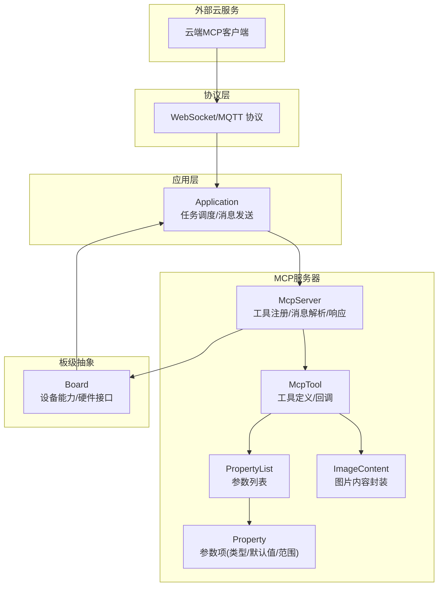
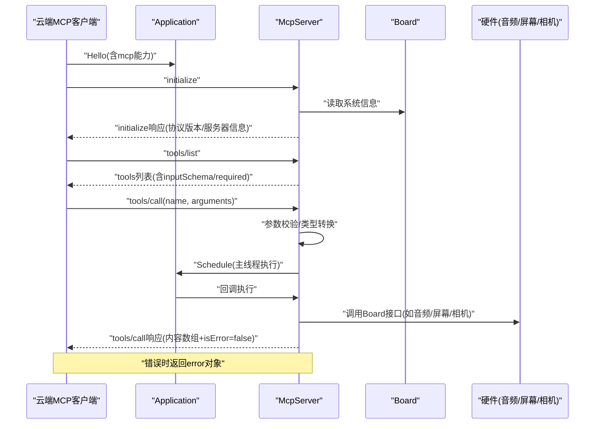
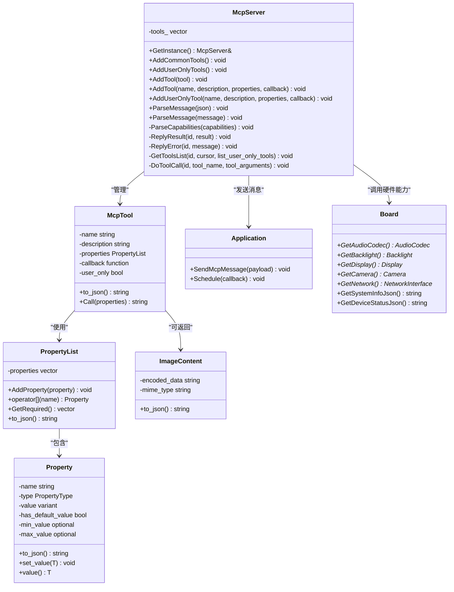
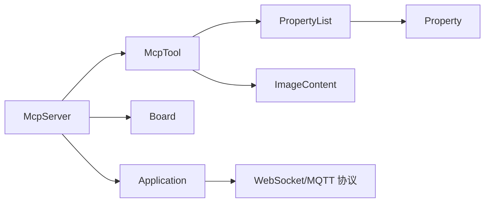

# MCP服务器API

<cite>
**本文引用的文件**
- [mcp_server.h](file://main/mcp_server.h)
- [mcp_server.cc](file://main/mcp_server.cc)
- [mcp-protocol.md](file://docs/mcp-protocol.md)
- [mcp-usage.md](file://docs/mcp-usage.md)
- [application.h](file://main/application.h)
- [application.cc](file://main/application.cc)
- [board.h](file://main/boards/common/board.h)
- [press_to_talk_mcp_tool.h](file://main/boards/common/press_to_talk_mcp_tool.h)
- [press_to_talk_mcp_tool.cc](file://main/boards/common/press_to_talk_mcp_tool.cc)
</cite>

## 目录
1. [简介](#简介)
2. [项目结构](#项目结构)
3. [核心组件](#核心组件)
4. [架构总览](#架构总览)
5. [详细组件分析](#详细组件分析)
6. [依赖关系分析](#依赖关系分析)
7. [性能考虑](#性能考虑)
8. [故障排查指南](#故障排查指南)
9. [结论](#结论)
10. [附录](#附录)

## 简介
本文件为MCP（Model Context Protocol）服务器类的详细API参考文档，覆盖MCP协议服务器的核心接口与数据结构，包括工具注册与移除、消息解析与响应发送、工具回调与参数校验、设备控制命令与云服务集成等。文档同时给出协议消息格式、命令结构、参数验证、错误处理的技术细节，并提供设备控制工具的注册示例、云服务集成接口、远程控制命令等实用案例，以及MCP服务器的状态管理、连接处理、消息路由等核心功能说明。

## 项目结构
MCP服务器位于主程序目录，配合应用层、协议层、板级抽象层共同完成设备与云端的MCP交互：
- 服务器核心：mcp_server.h/.cc
- 应用层：application.h/.cc（负责协议调度、消息发送）
- 板级抽象：board.h（设备能力、音频、屏幕、相机、网络等）
- 工具示例：press_to_talk_mcp_tool.h/.cc（按键说话模式工具）

图表来源
- [mcp_server.h](file://main/mcp_server.h#L314-L342)
- [mcp_server.cc](file://main/mcp_server.cc#L314-L322)
- [application.h](file://main/application.h#L110-L111)
- [board.h](file://main/boards/common/board.h#L49-L84)

章节来源
- [mcp_server.h](file://main/mcp_server.h#L1-L345)
- [mcp_server.cc](file://main/mcp_server.cc#L1-L564)
- [application.h](file://main/application.h#L1-L190)
- [application.cc](file://main/application.cc#L96-L100)
- [board.h](file://main/boards/common/board.h#L1-L93)

## 核心组件
- McpServer：MCP服务器核心，提供工具注册、消息解析、响应发送、工具调用等能力
- McpTool：工具定义，包含名称、描述、输入参数Schema、回调函数、可见性标记
- PropertyList：参数列表，支持必填与可选参数、默认值、范围约束
- Property：参数项，支持布尔、整数、字符串三类类型，整数支持最小/最大值
- ImageContent：图片内容封装，自动Base64编码并输出JSON结构
- Application：应用层，负责协议资源管理、消息发送、任务调度
- Board：板级抽象，提供设备能力接口（音频、屏幕、相机、网络等）

章节来源
- [mcp_server.h](file://main/mcp_server.h#L52-L342)
- [mcp_server.cc](file://main/mcp_server.cc#L314-L322)
- [application.h](file://main/application.h#L110-L111)
- [board.h](file://main/boards/common/board.h#L49-L84)

## 架构总览
MCP服务器遵循JSON-RPC 2.0规范承载于底层传输协议之上，典型交互包括初始化、列举工具、调用工具、错误与通知等。

图表来源
- [mcp-protocol.md](file://docs/mcp-protocol.md#L61-L196)
- [mcp_server.cc](file://main/mcp_server.cc#L387-L436)
- [application.cc](file://main/application.cc#L96-L100)

章节来源
- [mcp-protocol.md](file://docs/mcp-protocol.md#L1-L270)
- [mcp_server.cc](file://main/mcp_server.cc#L324-L436)

## 详细组件分析

### McpServer 类
- 单例模式：通过静态GetInstance()获取实例
- 工具注册
  - AddTool(McpTool*)
  - AddTool(name, description, properties, callback)
  - AddUserOnlyTool(name, description, properties, callback)
  - AddCommonTools()：注册常用工具（设备状态、音量、屏幕亮度/主题、拍照等）
  - AddUserOnlyTools()：注册用户专用工具（系统信息、重启、固件升级、屏幕截图/预览、资源下载URL等）
- 消息处理
  - ParseMessage(string/json)：解析JSON-RPC负载
  - ParseCapabilities：解析客户端能力（如视觉解释服务地址与Token）
- 响应发送
  - ReplyResult(id, result)
  - ReplyError(id, message)
- 工具调用
  - GetToolsList(id, cursor, list_user_only_tools)：分页返回工具列表，受负载大小限制
  - DoToolCall(id, tool_name, tool_arguments)：参数校验、主线程调度执行、回调返回

图表来源
- [mcp_server.h](file://main/mcp_server.h#L208-L342)
- [mcp_server.cc](file://main/mcp_server.cc#L314-L322)
- [application.h](file://main/application.h#L110-L111)
- [board.h](file://main/boards/common/board.h#L49-L84)

章节来源
- [mcp_server.h](file://main/mcp_server.h#L314-L342)
- [mcp_server.cc](file://main/mcp_server.cc#L324-L563)

### McpTool 工具定义
- 名称与描述：唯一标识与自然语言说明
- 输入Schema：由PropertyList生成，包含必填参数required
- 回调函数：接收PropertyList并返回ReturnValue（bool/int/string/cJSON*/ImageContent*）
- 可见性：user_only=true时仅用户工具可见，AI不可见
- 输出：统一包装为包含content数组与isError标志的JSON对象

章节来源
- [mcp_server.h](file://main/mcp_server.h#L208-L312)

### PropertyList 与 Property 参数列表
- 支持类型：布尔、整数、字符串
- 默认值：可选，默认值存在则为可选参数
- 整数范围：可设置最小/最大值，运行时写入会校验
- 必填检测：GetRequired()返回未提供默认值的参数名集合
- Schema生成：to_json()输出符合MCP inputSchema的对象结构

章节来源
- [mcp_server.h](file://main/mcp_server.h#L52-L206)

### ImageContent 图片内容封装
- 自动Base64编码原始二进制数据
- 输出JSON结构包含type/mimeType/data
- 作为工具返回值之一，用于图像类结果

章节来源
- [mcp_server.h](file://main/mcp_server.h#L16-L47)

### Application 与 Board 集成
- Application.SendMcpMessage：通过底层协议发送MCP JSON-RPC响应
- Application.Schedule：将工具回调调度到主线程执行，保证线程安全
- Board：提供设备能力接口（音频编解码器、背光、显示、相机、网络、系统信息、设备状态）

章节来源
- [application.h](file://main/application.h#L110-L111)
- [application.cc](file://main/application.cc#L96-L100)
- [board.h](file://main/boards/common/board.h#L49-L84)

### 设备控制工具注册示例
- 常用工具（AddCommonTools）
  - 设备状态查询：self.get_device_status
  - 音量设置：self.audio_speaker.set_volume(volume: 0..100)
  - 屏幕亮度：self.screen.set_brightness(brightness: 0..100)
  - 主题切换：self.screen.set_theme(theme: "light"/"dark")
  - 拍照与解释：self.camera.take_photo(question: string)
- 用户专用工具（AddUserOnlyTools）
  - 系统信息：self.get_system_info
  - 重启：self.reboot
  - 固件升级：self.upgrade_firmware(url: string)
  - 屏幕信息：self.screen.get_info
  - 截图上传：self.screen.snapshot(url: string, quality: 1..100)
  - 图片预览：self.screen.preview_image(url: string)
  - 资源下载URL设置：self.assets.set_download_url(url: string)

章节来源
- [mcp_server.cc](file://main/mcp_server.cc#L33-L126)
- [mcp_server.cc](file://main/mcp_server.cc#L128-L301)

### 按键说话模式工具（Press-to-Talk）
- 工具名称：self.set_press_to_talk
- 参数：mode（"press_to_talk" 或 "click_to_talk"）
- 功能：切换长按说话与单击说话模式，并持久化到设置
- 注册：PressToTalkMcpTool::Initialize()中注册到McpServer

章节来源
- [press_to_talk_mcp_tool.h](file://main/boards/common/press_to_talk_mcp_tool.h#L1-L29)
- [press_to_talk_mcp_tool.cc](file://main/boards/common/press_to_talk_mcp_tool.cc#L10-L29)

## 依赖关系分析
- McpServer依赖Application进行消息发送与任务调度
- McpServer依赖Board访问设备硬件能力
- McpTool依赖PropertyList/Property进行参数Schema与校验
- ImageContent依赖mbedTLS进行Base64编码
- 协议层面遵循JSON-RPC 2.0，消息封装在基础协议（WebSocket/MQTT）的消息体中

图表来源
- [mcp_server.h](file://main/mcp_server.h#L314-L342)
- [application.h](file://main/application.h#L110-L111)
- [board.h](file://main/boards/common/board.h#L49-L84)

章节来源
- [mcp_server.h](file://main/mcp_server.h#L1-L345)
- [application.h](file://main/application.h#L1-L190)
- [board.h](file://main/boards/common/board.h#L1-L93)

## 性能考虑
- 工具列表分页：GetToolsList采用最大负载阈值（字节级）控制单次响应大小，避免超限
- 主线程调度：DoToolCall通过Application.Schedule将工具回调调度至主线程，确保硬件访问安全
- 提升响应速度：AddCommonTools将常用工具置于列表前端，利于提示缓存
- 任务优先级：相机拍照场景使用TaskPriorityReset降低优先级，避免影响实时语音

章节来源
- [mcp_server.cc](file://main/mcp_server.cc#L455-L509)
- [mcp_server.cc](file://main/mcp_server.cc#L554-L563)
- [mcp_server.cc](file://main/mcp_server.cc#L112-L114)

## 故障排查指南
- 解析失败
  - 现象：日志提示无法解析MCP消息
  - 处理：检查消息是否为合法JSON；确认包含jsonrpc、method、params、id字段
- 版本不匹配
  - 现象：日志提示无效JSONRPC版本
  - 处理：确保jsonrpc为"2.0"
- 方法未实现
  - 现象：日志提示方法未实现
  - 处理：确认method是否为initialize/tools/list/tools/call
- 参数缺失或类型不匹配
  - 现象：tools/call返回缺失有效参数或抛出异常
  - 处理：核对PropertyList中必填参数与类型；整数需在范围内
- 工具不存在
  - 现象：tools/call返回未知工具
  - 处理：确认工具名称拼写正确；检查是否已注册
- 负载过大
  - 现象：tools/list返回因负载大小限制而截断
  - 处理：使用nextCursor进行分页请求

章节来源
- [mcp_server.cc](file://main/mcp_server.cc#L324-L436)
- [mcp_server.cc](file://main/mcp_server.cc#L511-L563)

## 结论
MCP服务器提供了标准化的工具发现与调用机制，结合设备能力抽象与应用层调度，实现了灵活的设备控制与云服务集成。通过清晰的参数Schema、严格的类型与范围校验、完善的错误处理与分页策略，MCP服务器在保证易用性的同时兼顾了可靠性与性能。

## 附录

### API规范摘要

- 工具注册
  - AddTool(McpTool*)
  - AddTool(name, description, properties, callback)
  - AddUserOnlyTool(name, description, properties, callback)
  - AddCommonTools()
  - AddUserOnlyTools()

- 消息处理
  - ParseMessage(message/json)
  - ReplyResult(id, result)
  - ReplyError(id, message)

- 工具调用
  - GetToolsList(id, cursor, list_user_only_tools)
  - DoToolCall(id, tool_name, tool_arguments)

- 数据结构
  - McpTool：name/description/inputSchema/callback/user_only
  - PropertyList：AddProperty()/GetRequired()/to_json()
  - Property：name/type/default/min/max/value/set_value
  - ImageContent：to_json()

- 协议要点
  - JSON-RPC 2.0承载于基础协议（WebSocket/MQTT）
  - initialize：返回protocolVersion/serverInfo/capabilities.tools
  - tools/list：返回tools数组与nextCursor
  - tools/call：返回content数组与isError标志

章节来源
- [mcp_server.h](file://main/mcp_server.h#L314-L342)
- [mcp_server.cc](file://main/mcp_server.cc#L324-L563)
- [mcp-protocol.md](file://docs/mcp-protocol.md#L61-L196)