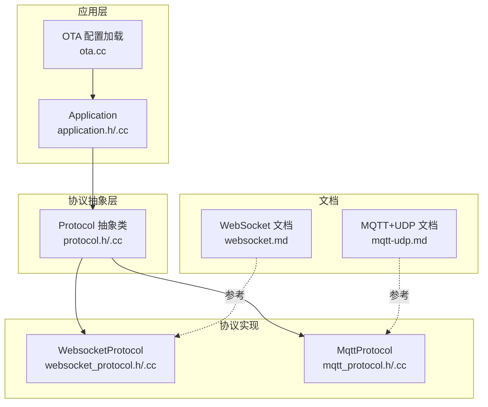
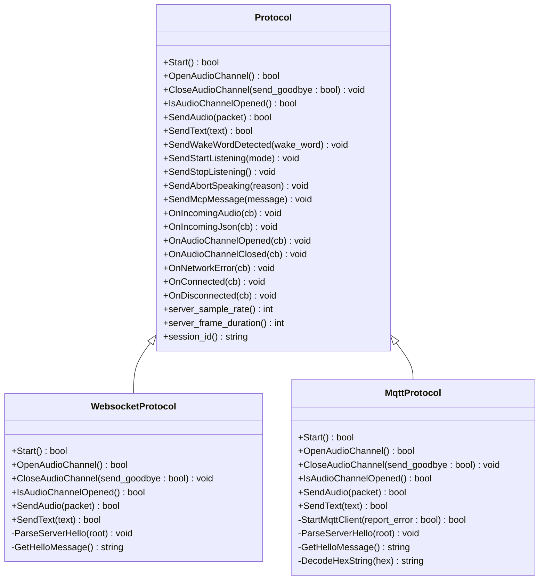
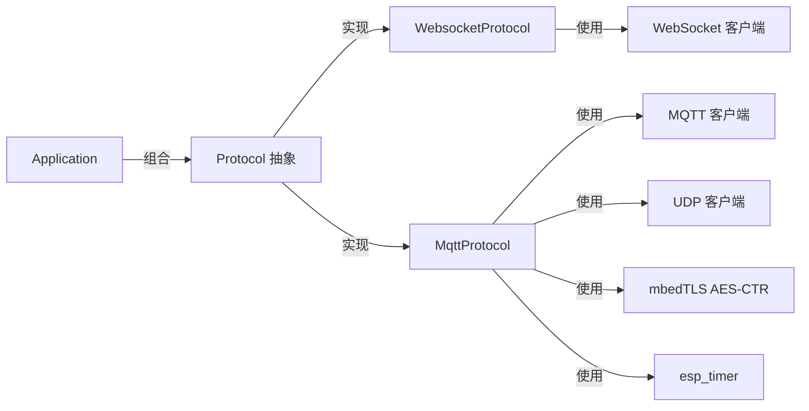

# 协议通信协议API

<cite>
**本文档引用的文件**
- [protocol.h](file://main/protocols/protocol.h)
- [protocol.cc](file://main/protocols/protocol.cc)
- [websocket_protocol.h](file://main/protocols/websocket_protocol.h)
- [websocket_protocol.cc](file://main/protocols/websocket_protocol.cc)
- [mqtt_protocol.h](file://main/protocols/mqtt_protocol.h)
- [mqtt_protocol.cc](file://main/protocols/mqtt_protocol.cc)
- [application.h](file://main/application.h)
- [application.cc](file://main/application.cc)
- [websocket.md](file://docs/websocket.md)
- [mqtt-udp.md](file://docs/mqtt-udp.md)
- [ota.cc](file://main/ota.cc)
</cite>

## 目录
1. [简介](#简介)
2. [项目结构](#项目结构)
3. [核心组件](#核心组件)
4. [架构总览](#架构总览)
5. [详细组件分析](#详细组件分析)
6. [依赖关系分析](#依赖关系分析)
7. [性能考量](#性能考量)
8. [故障排查指南](#故障排查指南)
9. [结论](#结论)
10. [附录](#附录)

## 简介
本文件为 Protocol 通信协议抽象层及其实现的详细 API 参考文档。Protocol 抽象类定义了统一的协议接口，包括连接建立、断开、音频通道管理、消息发送与回调注册等通用能力；具体实现包括 WebSocketProtocol 与 MqttProtocol，分别通过 WebSocket 与 MQTT+UDP 混合通道完成与服务器的双向通信。

文档目标读者既包括需要快速集成的开发者，也包括需要深入理解协议细节的技术人员。内容涵盖：
- 抽象接口与回调机制
- WebSocket 与 MQTT 的具体实现差异
- 连接参数、消息格式、事件处理与错误重连策略
- 协议选择指南、配置参数说明、性能优化建议
- 示例与调试排障方法

## 项目结构
协议相关代码位于 main/protocols 目录，应用层通过 main/application.* 使用协议实例；配套文档位于 docs 目录，提供协议行为说明与示例。

图表来源
- [protocol.h](file://main/protocols/protocol.h#L44-L95)
- [websocket_protocol.h](file://main/protocols/websocket_protocol.h#L13-L32)
- [mqtt_protocol.h](file://main/protocols/mqtt_protocol.h#L26-L62)
- [application.h](file://main/application.h#L129-L129)
- [ota.cc](file://main/ota.cc#L167-L186)

章节来源
- [protocol.h](file://main/protocols/protocol.h#L1-L99)
- [websocket_protocol.h](file://main/protocols/websocket_protocol.h#L1-L35)
- [mqtt_protocol.h](file://main/protocols/mqtt_protocol.h#L1-L66)
- [application.h](file://main/application.h#L129-L129)
- [ota.cc](file://main/ota.cc#L167-L186)

## 核心组件
本节聚焦 Protocol 抽象层的公共接口与回调机制，以及两个具体实现的关键差异。

- 抽象接口与回调
  - 连接与通道管理：Start()、OpenAudioChannel()、CloseAudioChannel()、IsAudioChannelOpened()
  - 音频与消息：SendAudio()、SendText()（虚函数，子类实现）
  - 业务消息：SendWakeWordDetected()、SendStartListening()、SendStopListening()、SendAbortSpeaking()、SendMcpMessage()
  - 回调注册：OnIncomingAudio()、OnIncomingJson()、OnAudioChannelOpened()、OnAudioChannelClosed()、OnNetworkError()、OnConnected()、OnDisconnected()
  - 状态与错误：server_sample_rate()、server_frame_duration()、session_id()、SetError()、IsTimeout()

- WebSocket 实现要点
  - 二进制协议版本：支持版本1（直接二进制）、版本2（含时间戳）、版本3（简化头）
  - 握手：发送 hello，等待服务器 hello，设置会话参数与事件标志
  - 头部：Authorization、Protocol-Version、Device-Id、Client-Id
  - 通道：连接建立后发送 hello，等待服务器 hello，随后回调通道打开

- MQTT 实现要点
  - 混合通道：MQTT 控制通道 + UDP 音频通道
  - 加密：AES-CTR 加密 UDP 音频包，序列号防重放
  - 重连：断线定时器自动重连，避免竞态
  - 通道：先 MQTT hello 获取 UDP 连接信息，再建立 UDP 连接

章节来源
- [protocol.h](file://main/protocols/protocol.h#L44-L95)
- [protocol.cc](file://main/protocols/protocol.cc#L7-L90)
- [websocket_protocol.h](file://main/protocols/websocket_protocol.h#L13-L32)
- [websocket_protocol.cc](file://main/protocols/websocket_protocol.cc#L23-L201)
- [mqtt_protocol.h](file://main/protocols/mqtt_protocol.h#L26-L62)
- [mqtt_protocol.cc](file://main/protocols/mqtt_protocol.cc#L13-L390)

## 架构总览
下图展示应用层、协议抽象层与具体实现之间的关系，以及消息流向。

图表来源
- [protocol.h](file://main/protocols/protocol.h#L44-L95)
- [websocket_protocol.h](file://main/protocols/websocket_protocol.h#L13-L32)
- [mqtt_protocol.h](file://main/protocols/mqtt_protocol.h#L26-L62)

## 详细组件分析

### Protocol 抽象层 API
- 连接与通道
  - Start()：启动协议（具体实现可按需延迟连接）
  - OpenAudioChannel()：打开音频通道（建立网络连接、握手、等待服务器确认）
  - CloseAudioChannel(send_goodbye: bool)：关闭音频通道，可选择是否发送 goodbye
  - IsAudioChannelOpened()：检查通道是否可用（连接、未超时、未出错）

- 音频与消息
  - SendAudio(packet)：发送音频帧（Opus 编码）
  - SendText(text)：发送文本消息（JSON），由子类实现
  - SendMcpMessage(payload)：封装 MCP JSON-RPC 消息并发送

- 业务消息
  - SendWakeWordDetected(wake_word)：发送唤醒词检测事件
  - SendStartListening(mode)：开始监听（支持 auto/manual/realtime）
  - SendStopListening()：停止监听
  - SendAbortSpeaking(reason)：中止说话（可携带原因）

- 回调注册
  - OnIncomingAudio(cb)：接收二进制音频帧
  - OnIncomingJson(cb)：接收 JSON 控制消息
  - OnAudioChannelOpened(cb)/OnAudioChannelClosed(cb)：通道打开/关闭事件
  - OnNetworkError(cb)：网络错误回调
  - OnConnected(cb)/OnDisconnected(cb)：连接建立/断开事件

- 状态与工具
  - server_sample_rate()/server_frame_duration()/session_id()：会话参数与标识
  - SetError(message)：设置错误并触发回调
  - IsTimeout()：通道超时检测（默认120秒）

章节来源
- [protocol.h](file://main/protocols/protocol.h#L44-L95)
- [protocol.cc](file://main/protocols/protocol.cc#L7-L90)

### WebSocketProtocol API
- 连接与握手
  - Start()：按需连接（音频会话开始时）
  - OpenAudioChannel()：读取配置（URL、Token、版本），设置头部，建立连接，发送 hello，等待服务器 hello
  - CloseAudioChannel()：释放 WebSocket 资源
  - IsAudioChannelOpened()：连接可用且未超时

- 消息收发
  - SendAudio(packet)：根据版本序列化二进制帧（版本1直接发送，版本2/3使用结构化头）
  - SendText(text)：发送 JSON 文本
  - OnData 回调：解析二进制音频帧或 JSON 消息，更新会话时间

- 头部与版本
  - Authorization（Bearer Token）、Protocol-Version、Device-Id、Client-Id
  - 二进制协议版本：1（直接二进制）、2（含时间戳）、3（简化头）

- 事件与错误
  - OnDisconnected：触发通道关闭回调
  - SetError：网络错误上报

章节来源
- [websocket_protocol.h](file://main/protocols/websocket_protocol.h#L13-L32)
- [websocket_protocol.cc](file://main/protocols/websocket_protocol.cc#L23-L201)
- [websocket.md](file://docs/websocket.md#L82-L126)

### MqttProtocol API
- 连接与握手
  - Start()：启动 MQTT 客户端
  - StartMqttClient(report_error: bool)：读取配置（endpoint、client_id、username、password、keepalive、publish_topic），建立连接，注册回调
  - OpenAudioChannel()：发送 hello，等待服务器 hello，解析 UDP 连接信息，初始化 AES-CTR，建立 UDP 连接
  - CloseAudioChannel(send_goodbye: bool)：关闭 UDP，可选择发送 goodbye

- 音频与加密
  - SendAudio(packet)：AES-CTR 加密并发送 UDP 包，包含类型、长度、SSRC、时间戳、序列号
  - OnMessage 回调：解析 JSON 控制消息，处理 goodbye、通道关闭等

- 重连与并发
  - 断线定时器自动重连，避免竞态（alive_ 标记）
  - UDP 连接加互斥锁保护

- 事件与错误
  - OnDisconnected/OnConnected：断线/重连回调
  - SetError：网络错误上报

章节来源
- [mqtt_protocol.h](file://main/protocols/mqtt_protocol.h#L26-L62)
- [mqtt_protocol.cc](file://main/protocols/mqtt_protocol.cc#L13-L390)
- [mqtt-udp.md](file://docs/mqtt-udp.md#L280-L300)

### 应用层集成与事件流
- 协议选择
  - 根据 OTA 配置动态选择 WebSocket 或 MQTT 协议
- 事件绑定
  - OnConnected/OnNetworkError/OnIncomingAudio/OnAudioChannelOpened/OnAudioChannelClosed/OnIncomingJson 等回调
- 状态机联动
  - 根据 JSON 消息切换设备状态（Listening/Speaking/Idle），驱动 UI 与音频播放

章节来源
- [application.h](file://main/application.h#L129-L129)
- [application.cc](file://main/application.cc#L473-L610)
- [ota.cc](file://main/ota.cc#L167-L186)

## 依赖关系分析
- 组件耦合
  - Application 依赖 Protocol 抽象接口，屏蔽具体实现差异
  - WebSocket/MQTT 实现依赖 Board/Settings/NVS 等基础设施
- 外部依赖
  - WebSocket：WebSocket 客户端库、cJSON、ESP_LOG
  - MQTT：MQTT 客户端库、UDP、mbedTLS AES-CTR、esp_timer
- 潜在循环依赖
  - 协议层不依赖应用层，应用层持有协议实例并注册回调，无循环

图表来源
- [application.h](file://main/application.h#L129-L129)
- [websocket_protocol.cc](file://main/protocols/websocket_protocol.cc#L94-L110)
- [mqtt_protocol.cc](file://main/protocols/mqtt_protocol.cc#L81-L83)

章节来源
- [application.h](file://main/application.h#L129-L129)
- [websocket_protocol.cc](file://main/protocols/websocket_protocol.cc#L94-L110)
- [mqtt_protocol.cc](file://main/protocols/mqtt_protocol.cc#L81-L83)

## 性能考量
- WebSocket
  - 二进制协议版本选择：版本2/3可携带时间戳，利于服务器端 AEC；版本1最简，CPU 开销更低
  - 头部与序列：合理设置 Protocol-Version 与 Device-Id/Client-Id，减少握手失败
- MQTT+UDP
  - AES-CTR 加密与序列号：确保实时性与安全性，注意 CPU 占用
  - 并发控制：UDP 连接使用互斥锁，避免竞态
  - 重连策略：断线定时器避免频繁重连，降低网络压力
- 通用
  - 超时检测：默认120秒，避免资源泄漏
  - 采样率与帧时长：与服务器对齐，减少重采样带来的失真

章节来源
- [websocket.md](file://docs/websocket.md#L393-L398)
- [mqtt-udp.md](file://docs/mqtt-udp.md#L323-L343)
- [protocol.cc](file://main/protocols/protocol.cc#L81-L90)

## 故障排查指南
- 连接失败
  - WebSocket：检查 URL、Token、Protocol-Version、Device-Id/Client-Id；确认握手 hello 是否收到
  - MQTT：检查 endpoint、client_id、username/password、keepalive；关注断线定时器与重连
- 通道不可用
  - 检查 IsAudioChannelOpened() 条件：连接、未超时、未出错
  - MQTT：确认 UDP 连接信息与 AES 密钥解析成功
- 音频异常
  - 采样率不匹配：服务器与设备输出采样率不一致可能导致失真
  - 序列号异常：MQTT UDP 接收端会记录警告，但可能继续处理
- 日志与回调
  - 使用 OnNetworkError 回调获取错误信息
  - WebSocket 断开触发 OnDisconnected，MQTT 断开触发 OnDisconnected 并自动重连

章节来源
- [websocket_protocol.cc](file://main/protocols/websocket_protocol.cc#L175-L194)
- [mqtt_protocol.cc](file://main/protocols/mqtt_protocol.cc#L85-L98)
- [application.cc](file://main/application.cc#L493-L496)

## 结论
Protocol 抽象层提供了统一的接口与回调机制，WebSocket 与 MQTT 两种实现满足不同网络与实时性需求。WebSocket 更简单、握手明确；MQTT+UDP 将控制与数据分离，适合高实时性场景。通过合理的配置与错误处理策略，可在复杂网络环境中稳定运行。

## 附录

### 协议选择指南
- 优先选择 WebSocket：部署简单、握手明确、调试方便
- 选择 MQTT+UDP：对实时性要求高、需要分离控制与数据通道、具备 UDP 环境

章节来源
- [mqtt-udp.md](file://docs/mqtt-udp.md#L346-L357)

### 配置参数说明
- WebSocket
  - url：服务器地址
  - token：访问令牌（可选，自动补全 Bearer 前缀）
  - version：二进制协议版本（1/2/3）
- MQTT
  - endpoint：服务器地址[:端口]
  - client_id：客户端标识
  - username/password：认证凭据
  - keepalive：心跳间隔（秒）
  - publish_topic：发布主题

章节来源
- [websocket_protocol.cc](file://main/protocols/websocket_protocol.cc#L84-L110)
- [mqtt_protocol.cc](file://main/protocols/mqtt_protocol.cc#L65-L71)
- [websocket.md](file://docs/websocket.md#L82-L91)
- [mqtt-udp.md](file://docs/mqtt-udp.md#L259-L277)

### 示例与最佳实践
- 建议在 OpenAudioChannel() 前后记录日志，便于定位握手问题
- 使用 OnIncomingJson 回调集中处理控制消息，避免分散处理
- MQTT UDP 场景下，确保 AES 密钥与 nonce 正确解析，序列号连续性检查有助于发现异常

章节来源
- [websocket_protocol.cc](file://main/protocols/websocket_protocol.cc#L182-L200)
- [mqtt_protocol.cc](file://main/protocols/mqtt_protocol.cc#L227-L238)