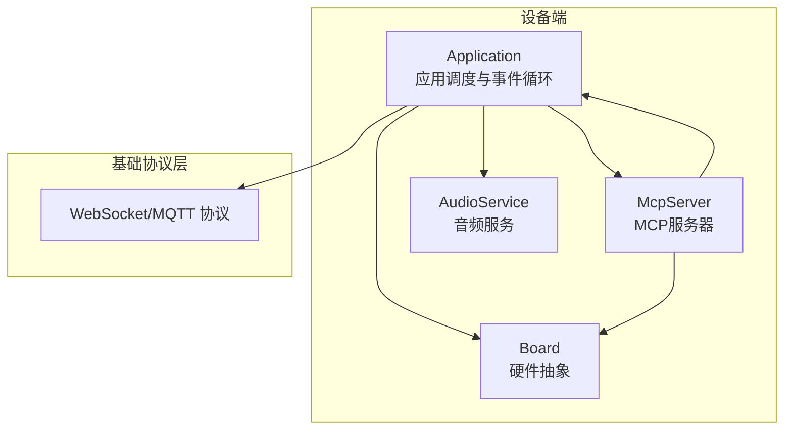
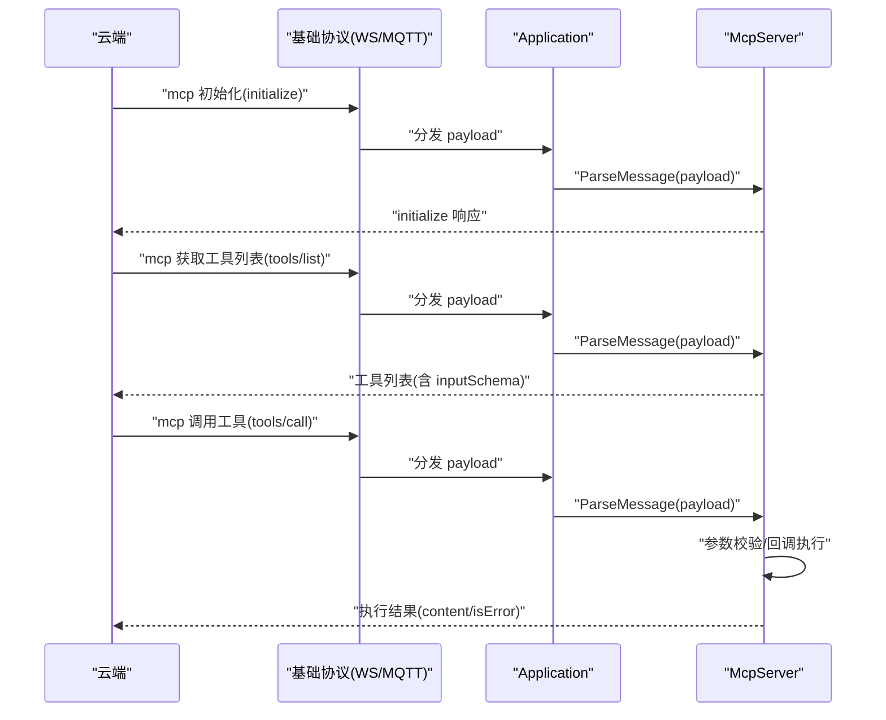
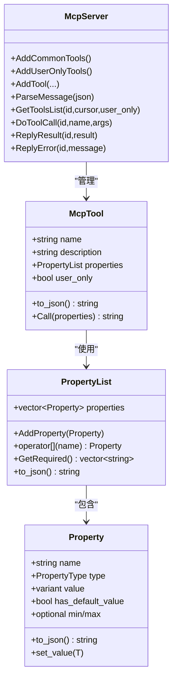
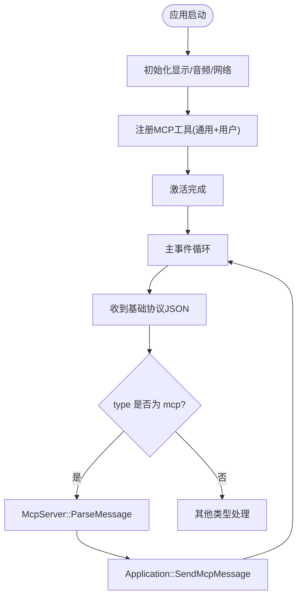
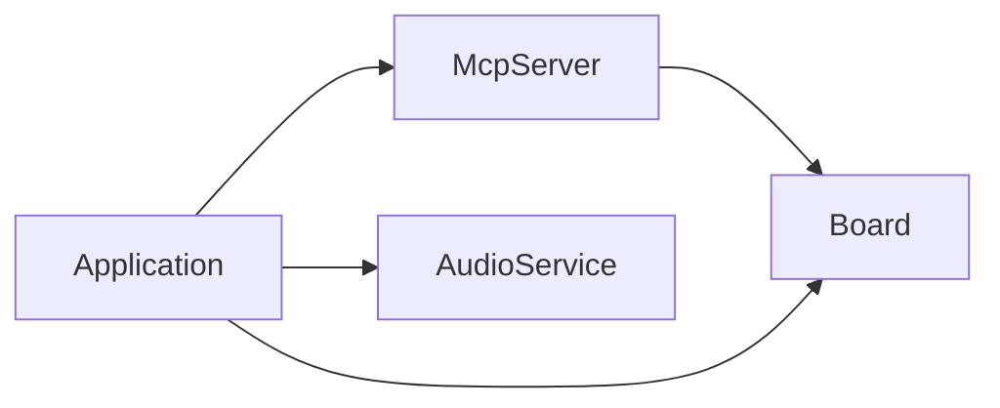

# MCP协议

<cite>
**本文引用的文件**
- [mcp-protocol.md](file://docs/mcp-protocol.md)
- [mcp-usage.md](file://docs/mcp-usage.md)
- [mcp_server.h](file://main/mcp_server.h)
- [mcp_server.cc](file://main/mcp_server.cc)
- [application.h](file://main/application.h)
- [application.cc](file://main/application.cc)
- [board.h](file://main/boards/common/board.h)
- [board.cc](file://main/boards/common/board.cc)
- [audio_service.h](file://main/audio/audio_service.h)
</cite>

## 目录
1. [简介](#简介)
2. [项目结构](#项目结构)
3. [核心组件](#核心组件)
4. [架构总览](#架构总览)
5. [详细组件分析](#详细组件分析)
6. [依赖关系分析](#依赖关系分析)
7. [性能考量](#性能考量)
8. [故障排查指南](#故障排查指南)
9. [结论](#结论)
10. [附录](#附录)

## 简介
本文件为 XiaoZhi ESP32 项目的 MCP（Model Context Protocol）协议权威文档，面向设备控制开发者与 IoT 应用工程师，系统阐述 MCP 协议在设备控制与云服务集成中的作用、MCP 服务器实现机制、工具注册系统、参数传递与状态管理、设备侧控制实现（扬声器、LED、屏幕、摄像头等）、云侧扩展能力（智能家居、桌面操作、知识搜索、邮件服务等场景思路），并提供工具开发指南与最佳实践。

## 项目结构
XiaoZhi ESP32 将 MCP 协议嵌入到设备主应用中，通过基础协议（WebSocket/MQTT）承载 MCP JSON-RPC 消息，设备端由 Application 统一调度，McpServer 负责解析与执行工具调用，Board 抽象硬件能力，AudioService 提供音频链路支撑。

图表来源
- [application.cc](file://main/application.cc#L473-L610)
- [mcp_server.cc](file://main/mcp_server.cc#L324-L436)
- [board.h](file://main/boards/common/board.h#L49-L85)
- [audio_service.h](file://main/audio/audio_service.h#L105-L195)

章节来源
- [application.cc](file://main/application.cc#L61-L163)
- [mcp_server.cc](file://main/mcp_server.cc#L33-L126)
- [board.h](file://main/boards/common/board.h#L49-L85)

## 核心组件
- MCP 服务器（McpServer）
  - 负责解析 JSON-RPC 2.0 的 initialize/tools/list/tools/call 等方法，维护工具列表，执行工具回调，封装返回内容。
  - 支持用户可见工具与仅用户工具两类，后者用于系统运维类能力。
- 应用入口（Application）
  - 初始化显示、音频、网络、协议栈；在激活完成后注册 MCP 工具；接收基础协议消息并分发到 McpServer。
- 硬件抽象（Board）
  - 提供音频编解码器、屏幕、背光、LED、摄像头、网络接口等能力查询与状态 JSON 生成。
- 音频服务（AudioService）
  - 管理麦克风采集、编码、发送队列、播放队列、解码、唤醒词检测、语音处理开关等。

章节来源
- [mcp_server.h](file://main/mcp_server.h#L314-L342)
- [mcp_server.cc](file://main/mcp_server.cc#L324-L436)
- [application.h](file://main/application.h#L42-L172)
- [application.cc](file://main/application.cc#L96-L100)
- [board.h](file://main/boards/common/board.h#L49-L85)
- [audio_service.h](file://main/audio/audio_service.h#L105-L195)

## 架构总览
MCP 协议在设备与云端之间以 JSON-RPC 2.0 承载，通过基础协议（WebSocket/MQTT）传输。设备端在激活完成后注册通用工具与用户工具，云端通过 tools/list 发现工具，再通过 tools/call 调用具体功能。

图表来源
- [mcp-protocol.md](file://docs/mcp-protocol.md#L61-L196)
- [application.cc](file://main/application.cc#L565-L569)
- [mcp_server.cc](file://main/mcp_server.cc#L387-L436)

## 详细组件分析

### MCP 服务器（McpServer）
- 工具注册
  - AddTool/AddUserOnlyTool：注册工具，支持用户可见与仅用户工具。
  - AddCommonTools：注册通用工具（设备状态、音量、屏幕亮度/主题、拍照等）。
  - AddUserOnlyTools：注册系统工具（系统信息、重启、固件升级、屏幕截图/预览等）。
- 消息解析与路由
  - initialize：返回协议版本、能力声明、服务器信息。
  - tools/list：按游标分页返回工具清单，支持 withUserTools 过滤。
  - tools/call：解析参数，校验必填项与类型，调度到主线程执行工具回调，封装返回内容。
- 结果封装
  - 统一以 JSON-RPC 2.0 的 result/error 返回，content 数组中包含文本或图片内容，isError 标记是否错误。
- 参数系统
  - Property/PropertyList：支持布尔、整数、字符串三类，整数可配置范围与默认值；运行时校验并设置参数值。
  - inputSchema：自动从 PropertyList 生成 JSON Schema，标注 required 字段与范围约束。

图表来源
- [mcp_server.h](file://main/mcp_server.h#L208-L342)

章节来源
- [mcp_server.h](file://main/mcp_server.h#L58-L156)
- [mcp_server.h](file://main/mcp_server.h#L208-L312)
- [mcp_server.h](file://main/mcp_server.h#L314-L342)
- [mcp_server.cc](file://main/mcp_server.cc#L33-L126)
- [mcp_server.cc](file://main/mcp_server.cc#L128-L301)
- [mcp_server.cc](file://main/mcp_server.cc#L324-L436)
- [mcp_server.cc](file://main/mcp_server.cc#L455-L509)
- [mcp_server.cc](file://main/mcp_server.cc#L511-L563)

### 应用入口（Application）
- 初始化阶段
  - 初始化显示、音频、网络回调；注册 MCP 通用工具与用户工具。
  - 激活完成后进入主事件循环，处理网络、状态、音频事件。
- 协议接入
  - 根据 OTA 配置选择 WebSocket 或 MQTT；注册回调处理 incoming JSON，识别 type=mcp 并交由 McpServer 解析。
- 线程安全
  - 所有与协议发送、工具执行相关的操作均通过 Schedule 调度到主任务执行，避免并发问题。
- MCP 消息发送
  - SendMcpMessage 将 MCP 响应通过基础协议发送回云端。

图表来源
- [application.cc](file://main/application.cc#L61-L163)
- [application.cc](file://main/application.cc#L473-L610)
- [application.cc](file://main/application.cc#L1069-L1076)

章节来源
- [application.h](file://main/application.h#L42-L172)
- [application.cc](file://main/application.cc#L96-L100)
- [application.cc](file://main/application.cc#L521-L607)
- [application.cc](file://main/application.cc#L1069-L1076)

### 硬件抽象（Board）
- 能力接口
  - GetAudioCodec、GetDisplay、GetBacklight、GetLed、GetCamera、GetNetwork 等。
  - GetSystemInfoJson、GetDeviceStatusJson：生成系统与设备状态的 JSON 字符串，供工具调用。
- 设备状态
  - McpServer::AddCommonTools 中的 self.get_device_status 工具直接复用 Board::GetDeviceStatusJson。

章节来源
- [board.h](file://main/boards/common/board.h#L49-L85)
- [board.cc](file://main/boards/common/board.cc#L70-L178)
- [mcp_server.cc](file://main/mcp_server.cc#L45-L53)

### 音频服务（AudioService）
- 链路与队列
  - 录音 -> 处理器 -> 编码队列 -> 发送队列 -> 基础协议发送；服务器 -> 解码队列 -> 播放队列 -> 扬声器。
- 关键能力
  - 唤醒词检测、语音活动检测（VAD）、音频测试、AEC 模式切换、播放提示音等。
- 与 MCP 的关系
  - 音量控制工具 self.audio_speaker.set_volume 通过 AudioCodec 设置输出音量。
  - 屏幕截图/预览工具涉及网络下载与显示，依赖 Board::GetNetwork 与 Display。

章节来源
- [audio_service.h](file://main/audio/audio_service.h#L28-L76)
- [audio_service.h](file://main/audio/audio_service.h#L105-L195)
- [mcp_server.cc](file://main/mcp_server.cc#L55-L64)
- [mcp_server.cc](file://main/mcp_server.cc#L171-L285)

## 依赖关系分析
- McpServer 依赖 Board 提供的硬件能力（音频、屏幕、背光、摄像头、网络）与状态 JSON。
- Application 作为中枢，负责协议接入、事件分发与线程调度，向上提供 SendMcpMessage，向下驱动 McpServer。
- Board 为 McpServer 提供真实设备能力，McpServer 通过工具回调间接控制硬件。

图表来源
- [mcp_server.cc](file://main/mcp_server.cc#L33-L126)
- [application.cc](file://main/application.cc#L96-L100)
- [board.h](file://main/boards/common/board.h#L49-L85)

章节来源
- [mcp_server.cc](file://main/mcp_server.cc#L33-L126)
- [application.cc](file://main/application.cc#L96-L100)
- [board.h](file://main/boards/common/board.h#L49-L85)

## 性能考量
- 工具优先级与缓存
  - AddCommonTools 将常用工具置于工具列表前端，利于提示缓存命中，降低响应时间。
- 分页与负载控制
  - tools/list 对返回负载进行上限控制，超限时通过 nextCursor 分页，避免单次响应过大。
- 线程与调度
  - 所有工具执行通过 Application::Schedule 调度到主任务，避免并发竞争与资源冲突。
- 网络与存储
  - 屏幕截图上传采用 multipart/form-data，内存分配与状态码校验确保稳定性。

章节来源
- [mcp_server.cc](file://main/mcp_server.cc#L33-L36)
- [mcp_server.cc](file://main/mcp_server.cc#L455-L509)
- [application.cc](file://main/application.cc#L929-L935)
- [mcp_server.cc](file://main/mcp_server.cc#L190-L242)

## 故障排查指南
- 常见错误
  - JSONRPC 版本不匹配、缺少 method/id、tools/call 缺少参数或参数类型不符、未知工具名。
- 日志与定位
  - McpServer 在解析与执行过程中记录详细日志，便于定位参数校验失败、工具未找到、执行异常等问题。
- 系统工具
  - 用户工具（如 self.reboot、self.upgrade_firmware）仅限用户通道调用，避免误触发；若云端误调用，将返回错误。

章节来源
- [mcp_server.cc](file://main/mcp_server.cc#L354-L436)
- [mcp_server.cc](file://main/mcp_server.cc#L511-L563)

## 结论
XiaoZhi ESP32 的 MCP 协议通过清晰的工具注册体系、严谨的参数校验与线程安全调度，实现了设备与云端的高效协作。设备侧以 Board 抽象硬件能力，Application 统一调度，McpServer 提供标准化的工具执行框架，既满足日常控制需求，也为扩展智能家居、桌面操作、知识搜索、邮件服务等场景提供了坚实基础。

## 附录

### MCP 协议交互流程（摘要）
- 连接建立与能力通告：设备通过基础协议 hello 声明支持 MCP。
- initialize：云端发起初始化，设备返回协议版本、能力与服务器信息。
- tools/list：云端获取工具清单，支持分页与过滤用户工具。
- tools/call：云端调用具体工具，设备执行并返回结果。
- 主动通知：设备可通过通知类方法向云端推送状态变更（示例性说明）。

章节来源
- [mcp-protocol.md](file://docs/mcp-protocol.md#L37-L214)

### 设备侧典型工具实现要点
- 工具注册
  - 使用 McpServer::AddTool/AddUserOnlyTool 注册，建议采用“模块.功能”的命名风格，提供简洁描述与 inputSchema。
- 参数系统
  - 使用 Property/PropertyList 定义参数类型、默认值与范围；运行时自动校验并设置参数值。
- 工具回调
  - 回调返回值支持 bool/int/string/cJSON* 与图像内容，McpServer 自动封装为 JSON-RPC result。
- 线程安全
  - 工具执行通过 Application::Schedule 调度到主任务，避免并发访问硬件资源。

章节来源
- [mcp-usage.md](file://docs/mcp-usage.md#L18-L59)
- [mcp_server.h](file://main/mcp_server.h#L58-L156)
- [mcp_server.h](file://main/mcp_server.h#L208-L312)
- [mcp_server.cc](file://main/mcp_server.cc#L314-L322)
- [application.cc](file://main/application.cc#L929-L935)

### 云端扩展场景思路
- 智能家居控制：通过工具调用实现灯光、空调、窗帘等设备控制（需在设备侧注册对应工具）。
- PC 桌面操作：通过屏幕截图与预览工具实现远程查看与交互（需设备侧屏幕能力支持）。
- 知识搜索与邮件服务：结合摄像头拍照与解释能力，实现“看到即问”的智能问答（需云端具备相应服务与鉴权）。

章节来源
- [mcp_server.cc](file://main/mcp_server.cc#L100-L121)
- [mcp_server.cc](file://main/mcp_server.cc#L171-L285)