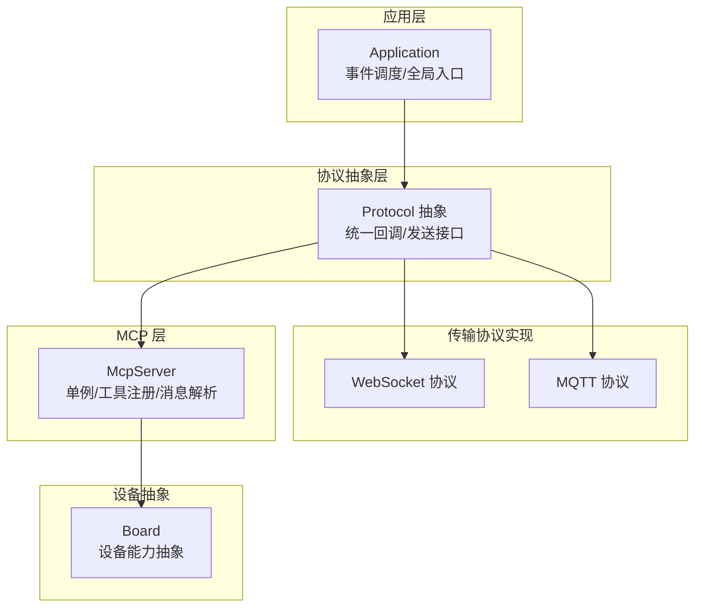
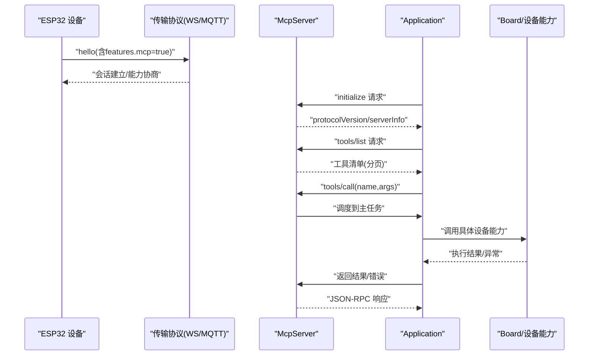
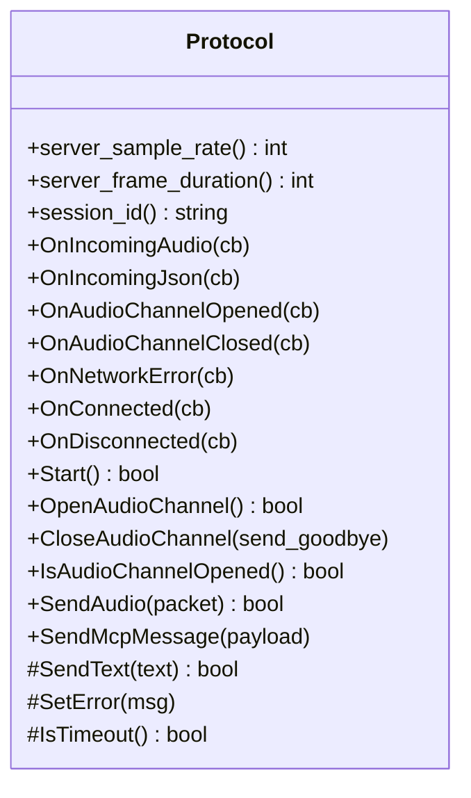
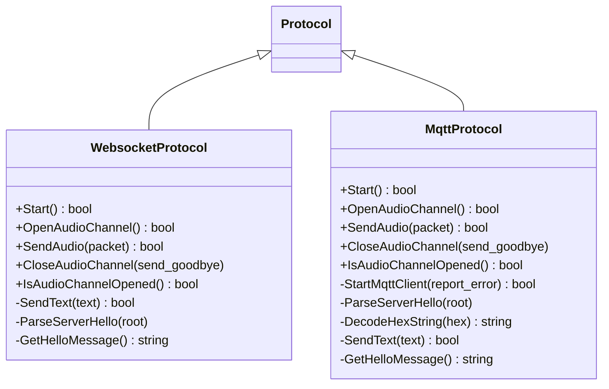
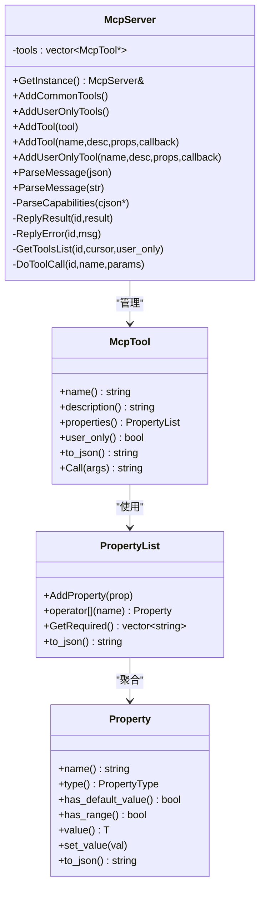
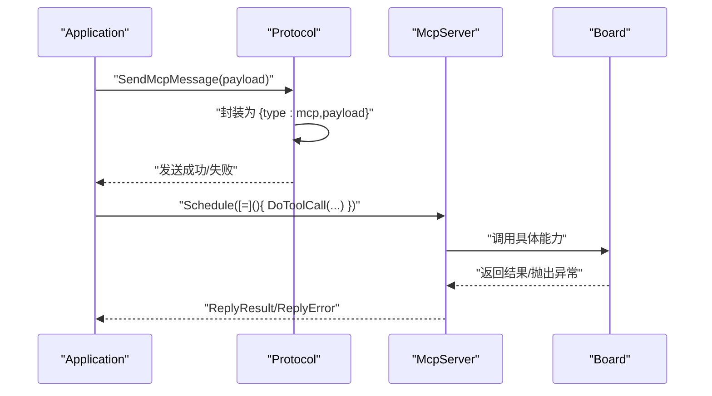
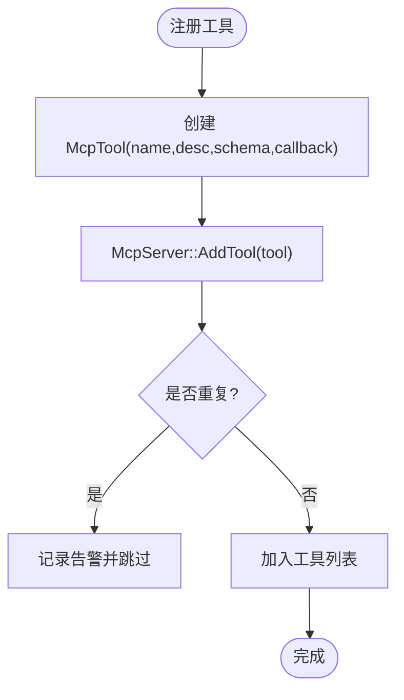
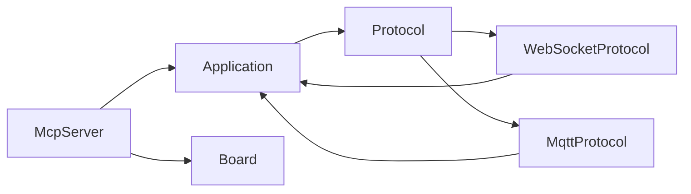

# 协议架构设计

<cite>
**本文引用的文件**
- [mcp_server.h](file://main/mcp_server.h)
- [mcp_server.cc](file://main/mcp_server.cc)
- [protocol.h](file://main/protocols/protocol.h)
- [protocol.cc](file://main/protocols/protocol.cc)
- [websocket_protocol.h](file://main/protocols/websocket_protocol.h)
- [websocket_protocol.cc](file://main/protocols/websocket_protocol.cc)
- [mqtt_protocol.h](file://main/protocols/mqtt_protocol.h)
- [mqtt_protocol.cc](file://main/protocols/mqtt_protocol.cc)
- [application.h](file://main/application.h)
- [board.h](file://main/boards/common/board.h)
- [board.cc](file://main/boards/common/board.cc)
- [mcp-protocol.md](file://docs/mcp-protocol.md)
- [mcp_controller.cc (zhengchen-cam)](file://main/boards/zhengchen-cam/mcp_controller.cc)
- [mcp_controller.cc (zhengchen-cam-ml307)](file://main/boards/zhengchen-cam-ml307/mcp_controller.cc)
</cite>

## 目录
1. [引言](#引言)
2. [项目结构](#项目结构)
3. [核心组件](#核心组件)
4. [架构总览](#架构总览)
5. [详细组件分析](#详细组件分析)
6. [依赖关系分析](#依赖关系分析)
7. [性能考量](#性能考量)
8. [故障排查指南](#故障排查指南)
9. [结论](#结论)
10. [附录](#附录)

## 引言
本文件面向系统架构师与高级开发者，系统性阐述 XiaoZhi ESP32 项目中 MCP（Model Context Protocol）协议的架构设计与实现要点。文档聚焦以下目标：
- 解释 MCP 协议抽象层设计、消息解析机制与工具注册系统
- 描述 MCP 服务器单例模式与全局访问机制
- 说明协议能力协商过程与消息路由机制
- 阐述 MCP 协议与设备控制系统（WebSocket、MQTT 等）的集成关系
- 提供协议架构图与组件交互流程，帮助快速定位问题与扩展新工具

## 项目结构
XiaoZhi ESP32 将协议抽象与具体传输协议实现解耦：
- 协议抽象层：统一的 Protocol 抽象类，定义通用回调与消息发送接口
- 传输协议实现：WebSocket 与 MQTT 两种传输适配器，负责底层网络收发与会话管理
- MCP 服务器：基于 JSON-RPC 2.0 的 MCP 实现，负责工具注册、能力协商与消息路由
- 应用层：Application 统一调度与事件驱动，桥接协议与设备资源
- 板级适配：Board 抽象设备能力，各板卡按需实现具体功能

图表来源
- [application.h](file://main/application.h#L42-L172)
- [protocol.h](file://main/protocols/protocol.h#L44-L95)
- [websocket_protocol.cc](file://main/protocols/websocket_protocol.cc#L23-L201)
- [mqtt_protocol.cc](file://main/protocols/mqtt_protocol.cc#L55-L152)
- [mcp_server.cc](file://main/mcp_server.cc#L23-L32)

章节来源
- [application.h](file://main/application.h#L42-L172)
- [protocol.h](file://main/protocols/protocol.h#L44-L95)
- [websocket_protocol.h](file://main/protocols/websocket_protocol.h#L13-L32)
- [mqtt_protocol.h](file://main/protocols/mqtt_protocol.h#L26-L62)
- [mcp_server.h](file://main/mcp_server.h#L314-L342)

## 核心组件
- 协议抽象层（Protocol）
  - 定义统一回调（音频/文本/网络事件）、会话参数与消息发送接口
  - 通过虚函数实现与具体传输协议的解耦
- 传输协议实现
  - WebSocketProtocol：负责 WebSocket 连接、hello 能力通告、二进制帧解析与 MCP 文本封装
  - MqttProtocol：负责 MQTT 连接、hello 能力通告、UDP 加密音频通道与 MCP 文本封装
- MCP 服务器（McpServer）
  - 单例模式提供全局访问
  - 工具注册与校验（Property/PropertyList）
  - JSON-RPC 2.0 消息解析与路由（initialize/tools/list/tools/call）
  - 结果/错误响应与异步回调调度
- 应用层（Application）
  - 事件驱动主循环，统一调度工具调用
  - 通过 Protocol 抽象向上层发送 MCP 消息
- 设备抽象（Board）
  - 统一设备能力接口（音频、显示、相机、网络等）
  - 为 MCP 工具提供底层资源访问

章节来源
- [protocol.h](file://main/protocols/protocol.h#L44-L95)
- [protocol.cc](file://main/protocols/protocol.cc#L7-L90)
- [websocket_protocol.cc](file://main/protocols/websocket_protocol.cc#L23-L201)
- [mqtt_protocol.cc](file://main/protocols/mqtt_protocol.cc#L55-L152)
- [mcp_server.h](file://main/mcp_server.h#L314-L342)
- [mcp_server.cc](file://main/mcp_server.cc#L23-L32)
- [application.h](file://main/application.h#L42-L172)
- [board.h](file://main/boards/common/board.h#L49-L85)

## 架构总览
MCP 协议在本项目中的定位是“设备侧工具暴露与远程调用”的桥梁。其工作流如下：
- 传输层通过 WebSocket/MQTT 与云端服务建立连接，并发送 hello 能力通告（包含 mcp:true）
- 客户端发起 initialize，MCP 服务器返回协议版本与 serverInfo
- 客户端调用 tools/list 获取工具清单；随后调用 tools/call 执行具体工具
- 工具执行由 Application 统一调度，最终通过 Protocol 抽象回传 MCP 结果或错误

图表来源
- [mcp-protocol.md](file://docs/mcp-protocol.md#L219-L267)
- [protocol.cc](file://main/protocols/protocol.cc#L76-L79)
- [mcp_server.cc](file://main/mcp_server.cc#L387-L436)

章节来源
- [mcp-protocol.md](file://docs/mcp-protocol.md#L1-L270)
- [protocol.cc](file://main/protocols/protocol.cc#L76-L79)
- [mcp_server.cc](file://main/mcp_server.cc#L387-L436)

## 详细组件分析

### 协议抽象层（Protocol）
- 职责
  - 统一回调注册：音频包、JSON 文本、通道开闭、网络错误、连接/断开
  - 会话参数：server_sample_rate、server_frame_duration、session_id、超时检测
  - 消息封装：将 MCP JSON-RPC 负载封装为传输层消息（type=mcp）
- 关键点
  - SendMcpMessage 将 MCP 负载嵌入传输层消息体
  - IsTimeout 基于 steady_clock 的超时检测，避免僵尸通道

图表来源
- [protocol.h](file://main/protocols/protocol.h#L44-L95)
- [protocol.cc](file://main/protocols/protocol.cc#L7-L90)

章节来源
- [protocol.h](file://main/protocols/protocol.h#L44-L95)
- [protocol.cc](file://main/protocols/protocol.cc#L7-L90)

### 传输协议实现（WebSocket/MQTT）
- WebSocketProtocol
  - 连接建立：读取配置、设置请求头、发送 hello
  - 数据解析：识别 binary/json，解析二进制帧为 AudioStreamPacket，解析 JSON 并分发
  - 超时与错误：通过 Protocol::SetError 上报
- MqttProtocol
  - 连接管理：定时重连、断线回调触发重连
  - 音频通道：通过 UDP 传输加密 OPUS 帧，AES-CTR 解密
  - hello 解析：从服务器 hello 中提取 session_id、采样率、帧长与 UDP 凭据

图表来源
- [websocket_protocol.h](file://main/protocols/websocket_protocol.h#L13-L32)
- [mqtt_protocol.h](file://main/protocols/mqtt_protocol.h#L26-L62)
- [protocol.h](file://main/protocols/protocol.h#L44-L95)

章节来源
- [websocket_protocol.cc](file://main/protocols/websocket_protocol.cc#L23-L201)
- [mqtt_protocol.cc](file://main/protocols/mqtt_protocol.cc#L55-L152)

### MCP 服务器（McpServer）
- 单例模式
  - 提供 GetInstance 全局访问，确保工具注册与消息处理的集中性
- 工具注册系统
  - Property/PropertyList：定义参数类型、默认值、取值范围
  - McpTool：封装工具名称、描述、输入 Schema、回调与可见性（user_only）
  - AddTool/AddUserOnlyTool：去重注册、日志记录
- 能力协商与消息路由
  - initialize：解析 capabilities（如 vision.url/token），返回 protocolVersion/serverInfo
  - tools/list：按 cursor 分页返回工具清单，受 payload 大小限制
  - tools/call：参数校验（类型/必填）、调度到主任务执行、返回 JSON-RPC 结果或错误
- 结果封装
  - 支持文本/图像/JSON 多种返回类型，统一包装为 MCP content 数组

图表来源
- [mcp_server.h](file://main/mcp_server.h#L208-L342)
- [mcp_server.cc](file://main/mcp_server.cc#L33-L322)

章节来源
- [mcp_server.h](file://main/mcp_server.h#L208-L342)
- [mcp_server.cc](file://main/mcp_server.cc#L33-L322)

### 应用层（Application）与设备抽象（Board）
- Application
  - 单例入口，提供 Schedule 异步调度、事件驱动主循环、OTA、音视频服务等
  - 通过 Protocol 抽象向上层发送 MCP 消息（SendMcpMessage）
- Board
  - 设备能力抽象：音频编解码、屏幕、相机、网络、系统信息等
  - 为 MCP 工具提供底层资源访问（如音量、亮度、拍照、主题）

图表来源
- [application.h](file://main/application.h#L106-L121)
- [protocol.cc](file://main/protocols/protocol.cc#L76-L79)
- [mcp_server.cc](file://main/mcp_server.cc#L554-L563)
- [board.h](file://main/boards/common/board.h#L49-L85)

章节来源
- [application.h](file://main/application.h#L42-L172)
- [board.h](file://main/boards/common/board.h#L49-L85)
- [board.cc](file://main/boards/common/board.cc#L70-L178)

### 工具注册与扩展（以 zhengchen-cam 为例）
- 通过 McpServer::AddTool 注册自定义工具
- 参数校验由 Property/PropertyList 自动完成
- 执行回调在 Application 主任务中调度，保证线程安全

图表来源
- [mcp_controller.cc (zhengchen-cam)](file://main/boards/zhengchen-cam/mcp_controller.cc#L23-L83)
- [mcp_server.cc](file://main/mcp_server.cc#L303-L322)

章节来源
- [mcp_controller.cc (zhengchen-cam)](file://main/boards/zhengchen-cam/mcp_controller.cc#L16-L83)
- [mcp_controller.cc (zhengchen-cam-ml307)](file://main/boards/zhengchen-cam-ml307/mcp_controller.cc#L16-L83)
- [mcp_server.cc](file://main/mcp_server.cc#L303-L322)

## 依赖关系分析
- McpServer 依赖 Board 提供设备能力，依赖 Application 的调度机制
- Protocol 抽象被 WebSocket/MQTT 实现继承，向上层屏蔽传输差异
- Application 作为中枢，协调协议与工具执行
- 板级控制器在各自板卡目录中注册工具，体现“按板卡扩展”的模块化设计

图表来源
- [mcp_server.cc](file://main/mcp_server.cc#L23-L32)
- [application.h](file://main/application.h#L129-L137)
- [protocol.h](file://main/protocols/protocol.h#L44-L95)
- [websocket_protocol.cc](file://main/protocols/websocket_protocol.cc#L23-L201)
- [mqtt_protocol.cc](file://main/protocols/mqtt_protocol.cc#L55-L152)

章节来源
- [mcp_server.cc](file://main/mcp_server.cc#L23-L32)
- [application.h](file://main/application.h#L129-L137)
- [protocol.h](file://main/protocols/protocol.h#L44-L95)

## 性能考量
- 工具列表分页与负载上限
  - tools/list 采用 cursor 分页与 payload 大小限制，避免一次性返回过多工具导致内存压力
- 主任务调度与优先级
  - 工具调用通过 Application::Schedule 调度至主任务，避免并发竞争；部分耗时操作（如拍照）通过 TaskPriorityReset 临时降级，平衡实时性与稳定性
- 传输层优化
  - WebSocket/MQTT 均具备超时检测与错误上报，保障通道健康
  - MQTT 使用 AES-CTR 对音频帧加密，兼顾安全性与性能

章节来源
- [mcp_server.cc](file://main/mcp_server.cc#L455-L509)
- [mcp_server.cc](file://main/mcp_server.cc#L554-L563)
- [websocket_protocol.cc](file://main/protocols/websocket_protocol.cc#L83-L201)
- [mqtt_protocol.cc](file://main/protocols/mqtt_protocol.cc#L166-L295)

## 故障排查指南
- 无法解析 MCP 消息
  - 检查 JSON-RPC 字段完整性（jsonrpc/method/id/params/result/error）
  - 确认 method 非 notifications 前缀（服务器忽略通知）
- tools/call 参数错误
  - 核对参数类型与必填项；整型参数需满足范围约束
  - 若缺失有效参数，服务器将返回错误并记录日志
- 通道超时或断开
  - WebSocket/MQTT 均有超时检测；检查网络连通性与服务器心跳
  - MQTT 断线后自动重连，关注重连定时器状态
- 工具未注册或重复注册
  - 查看工具列表与日志；重复注册会被忽略并记录警告

章节来源
- [mcp_server.cc](file://main/mcp_server.cc#L353-L436)
- [mcp_server.cc](file://main/mcp_server.cc#L511-L563)
- [protocol.cc](file://main/protocols/protocol.cc#L81-L90)
- [websocket_protocol.cc](file://main/protocols/websocket_protocol.cc#L168-L194)
- [mqtt_protocol.cc](file://main/protocols/mqtt_protocol.cc#L85-L98)

## 结论
XiaoZhi ESP32 的 MCP 协议架构以 Protocol 抽象为核心，结合 WebSocket/MQTT 传输，实现了设备能力的标准化暴露与远程调用。McpServer 通过单例模式与工具注册系统，提供了清晰的扩展点；Application 的调度机制确保了工具执行的线程安全与性能平衡。该设计既满足了跨平台通信需求，也为不同板卡的功能扩展提供了良好的模块化基础。

## 附录
- MCP 交互流程参考文档
  - [mcp-protocol.md](file://docs/mcp-protocol.md#L1-L270)
- 工具注册示例
  - [mcp_controller.cc (zhengchen-cam)](file://main/boards/zhengchen-cam/mcp_controller.cc#L23-L83)
  - [mcp_controller.cc (zhengchen-cam-ml307)](file://main/boards/zhengchen-cam-ml307/mcp_controller.cc#L23-L83)