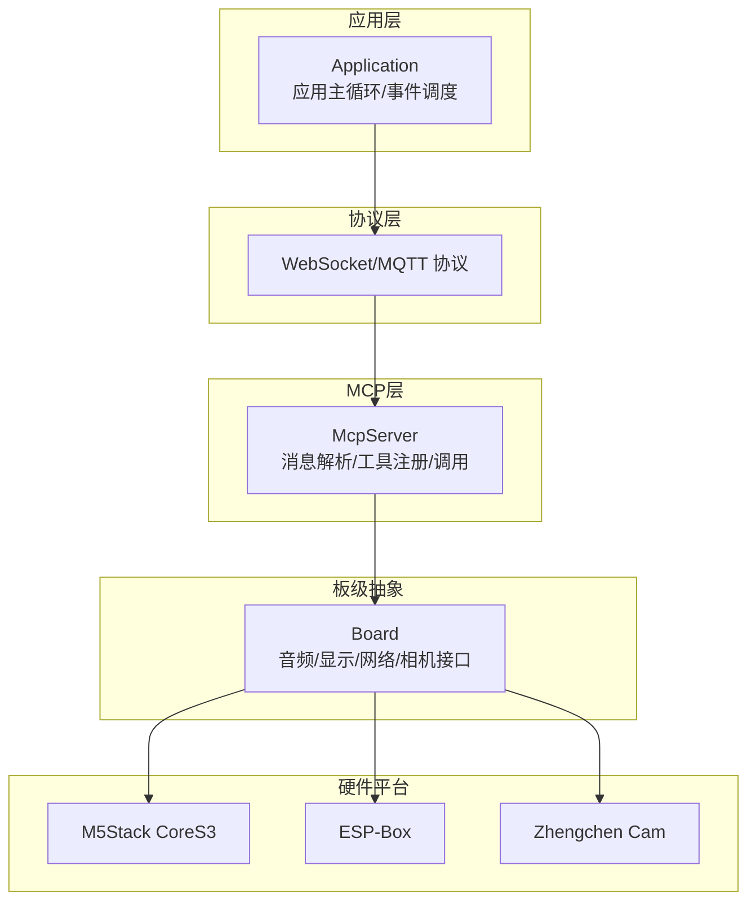
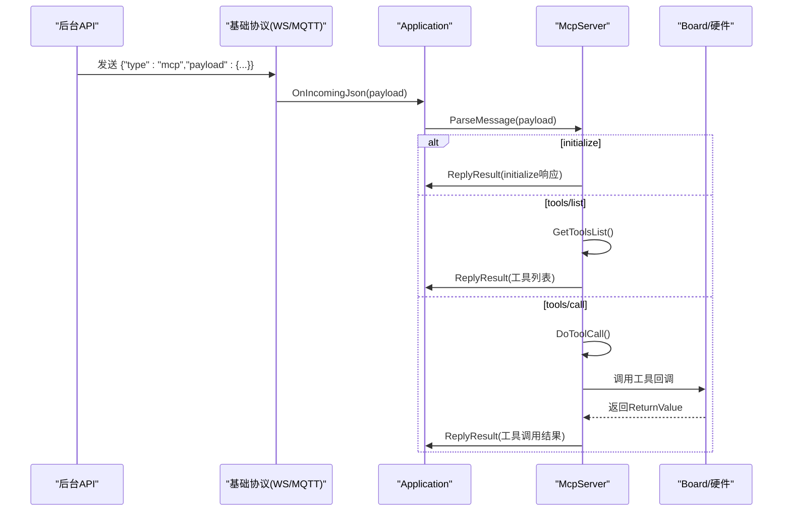
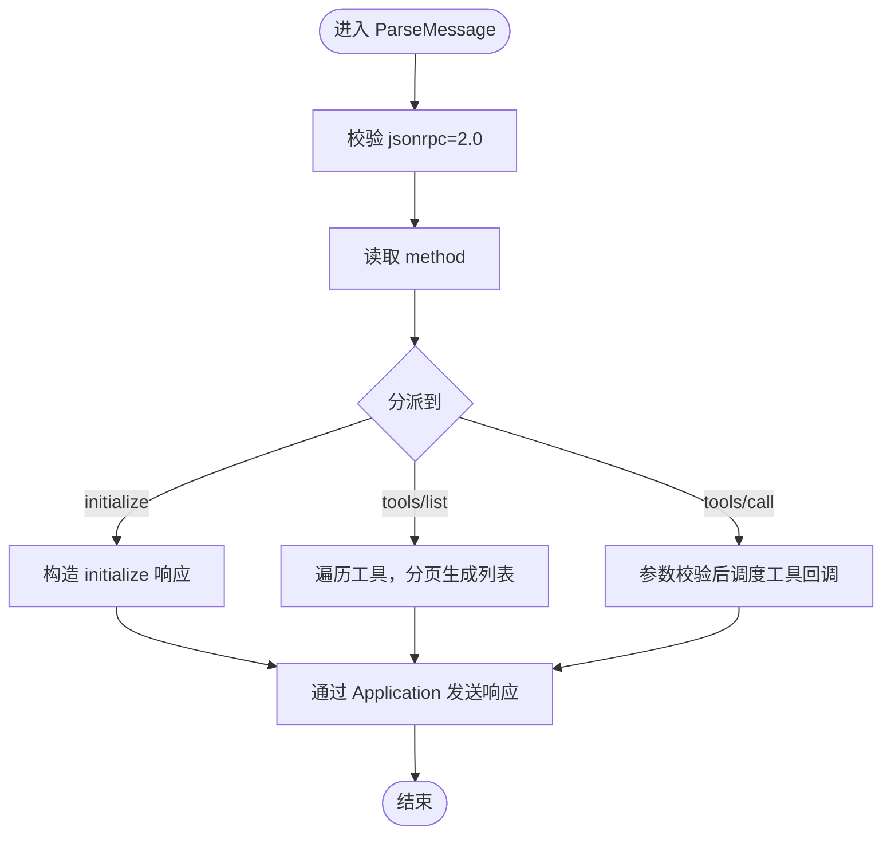
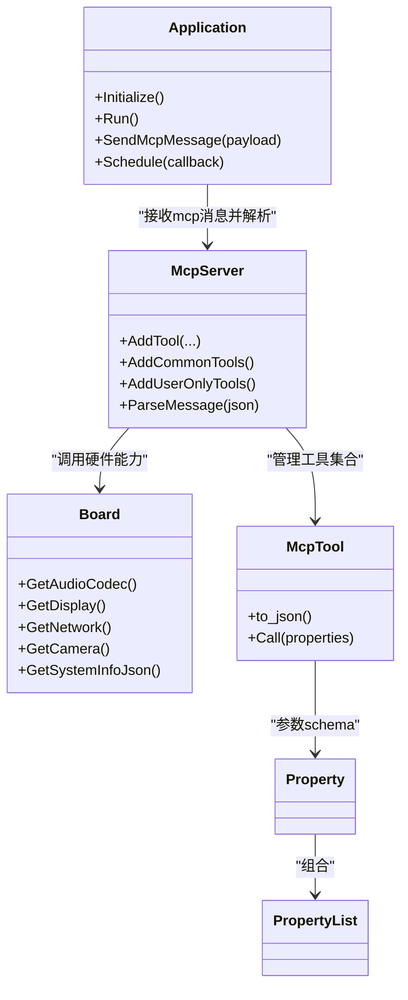

# 开发指南

<cite>
**本文引用的文件**
- [README.md](file://README.md)
- [mcp-protocol.md](file://docs/mcp-protocol.md)
- [mcp-usage.md](file://docs/mcp-usage.md)
- [mcp_server.h](file://main/mcp_server.h)
- [mcp_server.cc](file://main/mcp_server.cc)
- [application.h](file://main/application.h)
- [application.cc](file://main/application.cc)
- [board.h](file://main/boards/common/board.h)
- [board.cc](file://main/boards/common/board.cc)
- [m5stack_core_s3.cc](file://main/boards/m5stack-core-s3/m5stack_core_s3.cc)
- [esp_box_board.cc](file://main/boards/esp-box/esp_box_board.cc)
- [zhengchen_cam_board.cc](file://main/boards/zhengchen-cam/zhengchen_cam_board.cc)
- [mcp_controller.cc](file://main/boards/zhengchen-cam/mcp_controller.cc)
- [press_to_talk_mcp_tool.cc](file://main/boards/common/press_to_talk_mcp_tool.cc)
- [code_style.md](file://docs/code_style.md)
</cite>

## 目录
1. [简介](#简介)
2. [项目结构](#项目结构)
3. [核心组件](#核心组件)
4. [架构总览](#架构总览)
5. [详细组件分析](#详细组件分析)
6. [依赖关系分析](#依赖关系分析)
7. [性能考量](#性能考量)
8. [故障排除指南](#故障排除指南)
9. [结论](#结论)
10. [附录](#附录)

## 简介
本指南面向MCP协议初学者与中级开发者，系统讲解如何在XiaoZhi ESP32项目中从零开发MCP工具。内容覆盖开发环境搭建、工具设计原则、代码实现步骤、测试验证方法、最佳实践与调试技巧，并提供从简单工具到复杂应用的完整开发案例路径，帮助你在ESP32上高效构建设备侧MCP工具，实现灵活的设备控制与扩展。

## 项目结构
XiaoZhi ESP32项目采用模块化组织，MCP协议栈位于main目录，配合协议层、应用层、板级抽象层协同工作。关键目录与文件：
- main/mcp_server.*：MCP协议解析与工具注册、调用、响应生成
- main/application.*：应用主循环、协议初始化、事件调度、MCP消息入口
- main/boards/common/board.*：板级抽象接口，提供音频、显示、网络、相机等能力
- main/boards/*/：各硬件平台适配，负责在各自平台上注册MCP工具
- docs/*：协议与用法文档，含MCP协议交互与工具注册说明

图表来源
- [application.cc](file://main/application.cc#L521-L610)
- [mcp_server.cc](file://main/mcp_server.cc#L324-L436)
- [board.h](file://main/boards/common/board.h#L49-L85)

章节来源
- [README.md](file://README.md#L1-L174)
- [application.cc](file://main/application.cc#L61-L163)
- [mcp_server.cc](file://main/mcp_server.cc#L324-L436)
- [board.h](file://main/boards/common/board.h#L49-L85)

## 核心组件
- McpServer：MCP协议核心，负责解析initialize/tools/list/tools/call等方法，管理工具注册与调用，生成标准JSON-RPC响应。
- Application：应用主循环，负责协议初始化、事件分发、MCP消息入口（接收payload并转发至McpServer）。
- Board：板级抽象，提供音频编解码、显示、网络、相机等能力，供MCP工具调用。
- 各硬件平台适配：在各自Board实现中注册平台专属MCP工具，形成“通用工具 + 平台工具”的组合。

章节来源
- [mcp_server.h](file://main/mcp_server.h#L314-L342)
- [mcp_server.cc](file://main/mcp_server.cc#L33-L126)
- [application.cc](file://main/application.cc#L521-L610)
- [board.h](file://main/boards/common/board.h#L49-L85)

## 架构总览
MCP消息在基础协议（WebSocket/MQTT）之上承载，Application在收到"type":"mcp"的消息后，提取payload并交由McpServer解析。McpServer根据method分派到对应处理逻辑，最终通过Application回传JSON-RPC响应。

图表来源
- [application.cc](file://main/application.cc#L565-L610)
- [mcp_server.cc](file://main/mcp_server.cc#L387-L436)
- [mcp_server.cc](file://main/mcp_server.cc#L455-L509)
- [mcp_server.cc](file://main/mcp_server.cc#L511-L563)

章节来源
- [application.cc](file://main/application.cc#L521-L610)
- [mcp_server.cc](file://main/mcp_server.cc#L387-L436)
- [mcp_server.cc](file://main/mcp_server.cc#L455-L509)
- [mcp_server.cc](file://main/mcp_server.cc#L511-L563)

## 详细组件分析

### McpServer：消息解析与工具管理
- 能力与方法
  - initialize：返回协议版本、能力与服务器信息
  - tools/list：分页返回工具清单，支持cursor与withUserTools过滤
  - tools/call：校验参数类型与必填项，调度到工具回调，生成标准JSON-RPC响应
- 数据结构
  - Property/PropertyList：参数定义与校验（类型、默认值、范围）
  - McpTool：工具注册与调用封装，支持user_only标注
  - ReturnValue：统一返回类型（bool/int/string/cJSON*/ImageContent*）
- 关键流程
  - 解析JSON-RPC字段，校验版本与id
  - 分派到initialize/tools/list/tools/call
  - tools/call中对参数进行类型与范围校验，异常抛出统一转为错误响应

图表来源
- [mcp_server.cc](file://main/mcp_server.cc#L353-L436)
- [mcp_server.cc](file://main/mcp_server.cc#L455-L509)
- [mcp_server.cc](file://main/mcp_server.cc#L511-L563)

章节来源
- [mcp_server.h](file://main/mcp_server.h#L58-L156)
- [mcp_server.h](file://main/mcp_server.h#L208-L312)
- [mcp_server.cc](file://main/mcp_server.cc#L33-L126)
- [mcp_server.cc](file://main/mcp_server.cc#L387-L436)
- [mcp_server.cc](file://main/mcp_server.cc#L455-L509)
- [mcp_server.cc](file://main/mcp_server.cc#L511-L563)

### Application：协议接入与事件调度
- 负责协议初始化（WebSocket或MQTT），注册回调
- 在收到"type":"mcp"时，提取payload并调用McpServer::ParseMessage
- 提供Schedule机制，将工具回调调度到主任务线程执行，保证线程安全

章节来源
- [application.cc](file://main/application.cc#L473-L610)
- [application.h](file://main/application.h#L110-L121)

### Board与硬件平台：能力提供者
- Board抽象定义音频、显示、网络、相机等接口，MCP工具通过Board调用底层硬件
- 各平台在Board实现中注册平台专属工具，如AEC模式切换、重启、屏幕截图等

章节来源
- [board.h](file://main/boards/common/board.h#L49-L85)
- [board.cc](file://main/boards/common/board.cc#L70-L178)
- [m5stack_core_s3.cc](file://main/boards/m5stack-core-s3/m5stack_core_s3.cc#L334-L397)
- [esp_box_board.cc](file://main/boards/esp-box/esp_box_board.cc#L138-L175)
- [zhengchen_cam_board.cc](file://main/boards/zhengchen-cam/zhengchen_cam_board.cc#L334-L334)

### 工具注册与调用：从简单到复杂
- 简单工具：无参或少量参数，直接返回布尔/字符串/整数
- 复杂工具：涉及硬件操作（如相机拍照、屏幕截图）、异步下载、HTTP上传
- 用户专用工具：标记user_only，仅用户可见，避免被AI直接调用

章节来源
- [mcp-usage.md](file://docs/mcp-usage.md#L18-L59)
- [mcp_server.cc](file://main/mcp_server.cc#L33-L126)
- [mcp_server.cc](file://main/mcp_server.cc#L128-L301)
- [mcp_controller.cc](file://main/boards/zhengchen-cam/mcp_controller.cc#L23-L83)
- [press_to_talk_mcp_tool.cc](file://main/boards/common/press_to_talk_mcp_tool.cc#L10-L29)

## 依赖关系分析
- McpServer依赖Board能力（音频、显示、网络、相机等），通过Board接口实现工具功能
- Application依赖McpServer进行消息解析与响应；同时负责协议初始化与事件调度
- 各硬件平台通过Board实现注册平台专属MCP工具，形成“通用工具 + 平台工具”的组合

图表来源
- [application.h](file://main/application.h#L42-L172)
- [mcp_server.h](file://main/mcp_server.h#L314-L342)
- [board.h](file://main/boards/common/board.h#L49-L85)
- [mcp_server.h](file://main/mcp_server.h#L208-L312)
- [mcp_server.h](file://main/mcp_server.h#L58-L156)

章节来源
- [application.h](file://main/application.h#L42-L172)
- [mcp_server.h](file://main/mcp_server.h#L314-L342)
- [board.h](file://main/boards/common/board.h#L49-L85)

## 性能考量
- 工具列表分页与负载上限：tools/list在生成响应时检查payload大小，避免超限导致传输失败
- 主线程调度：tools/call通过Application::Schedule将工具回调调度到主任务线程，避免并发问题
- 硬件操作降优先级：如相机拍照场景，使用TaskPriorityReset降低任务优先级，避免影响语音链路
- 屏幕截图上传：采用multipart/form-data，合理设置边界与缓冲，避免内存碎片

章节来源
- [mcp_server.cc](file://main/mcp_server.cc#L455-L509)
- [mcp_server.cc](file://main/mcp_server.cc#L112-L121)
- [mcp_server.cc](file://main/mcp_server.cc#L206-L242)

## 故障排除指南
- 常见错误与定位
  - JSON-RPC版本不匹配：检查jsonrpc字段是否为"2.0"
  - 缺少method/id/params：校验字段完整性
  - tools/call参数缺失或类型不匹配：检查必填参数与类型，范围越界会抛出异常
  - Unknown tool：确认工具名称拼写与注册一致
  - Payload超限：tools/list分页请求，或减少工具数量
- 日志与调试
  - 使用ESP_LOG输出错误信息，便于定位
  - 逐步缩小问题范围：先验证initialize与tools/list，再验证tools/call
- 线程与资源
  - 确保工具回调在主线程执行（通过Application::Schedule）
  - 硬件操作注意内存分配与释放，避免泄漏

章节来源
- [mcp_server.cc](file://main/mcp_server.cc#L353-L436)
- [mcp_server.cc](file://main/mcp_server.cc#L511-L563)
- [mcp_server.cc](file://main/mcp_server.cc#L455-L509)

## 结论
通过本指南，你可以基于XiaoZhi ESP32项目在ESP32上系统地开发MCP工具。遵循工具设计原则（清晰命名、参数schema、错误处理、日志记录）、采用分页与主线程调度等最佳实践，结合平台适配与硬件能力，即可快速构建从简单到复杂的MCP工具，实现灵活的设备控制与扩展。

## 附录

### 开发环境搭建与代码风格
- 使用clang-format统一代码风格，遵循Google C++风格并满足项目要求
- IDE集成建议：VSCode/CLion配置clang-format，保存时自动格式化

章节来源
- [code_style.md](file://docs/code_style.md#L1-L91)

### MCP协议与工具用法速查
- 协议要点：JSON-RPC 2.0封装在基础协议消息体中，method包括initialize、tools/list、tools/call
- 工具注册：使用McpServer::AddTool/AddCommonTools/AddUserOnlyTools
- 工具调用：tools/call携带name与arguments，返回content与isError

章节来源
- [mcp-protocol.md](file://docs/mcp-protocol.md#L1-L270)
- [mcp-usage.md](file://docs/mcp-usage.md#L1-L115)

### 实战案例路径
- 从简单到复杂
  - 简单工具：音量调节、背光亮度设置（参考通用工具）
  - 复杂工具：相机拍照并解释、屏幕截图上传、重启设备
  - 平台专属：AEC模式切换、屏幕信息查询、资产下载URL设置
- 实现步骤
  - 在对应Board实现中注册工具
  - 定义PropertyList与参数schema
  - 实现回调逻辑，必要时通过Application::Schedule调度
  - 测试initialize、tools/list、tools/call全流程

章节来源
- [mcp_server.cc](file://main/mcp_server.cc#L33-L126)
- [mcp_server.cc](file://main/mcp_server.cc#L128-L301)
- [mcp_controller.cc](file://main/boards/zhengchen-cam/mcp_controller.cc#L23-L83)
- [press_to_talk_mcp_tool.cc](file://main/boards/common/press_to_talk_mcp_tool.cc#L10-L29)