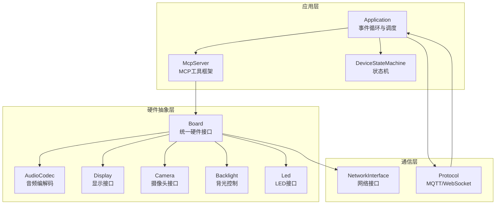
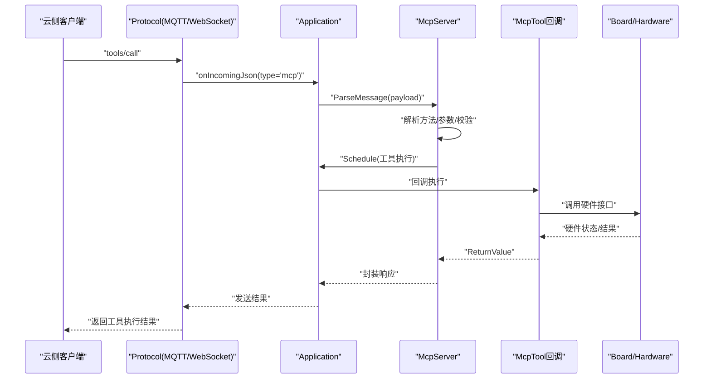
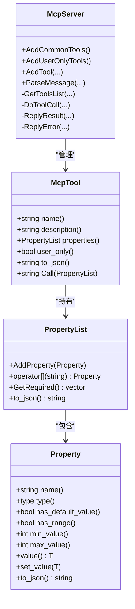
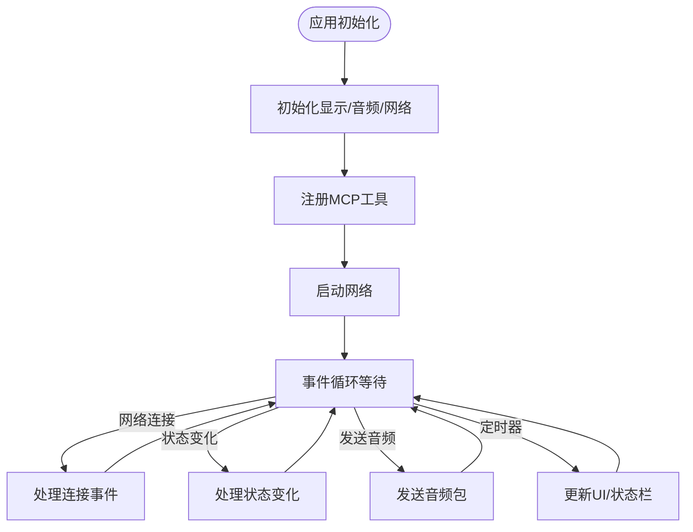
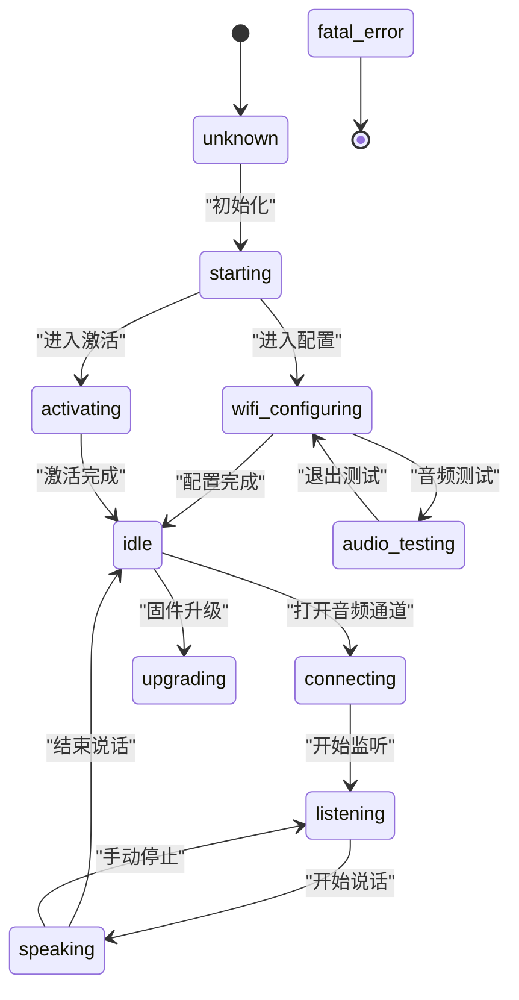
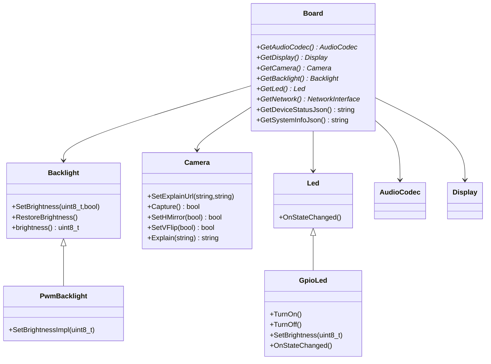
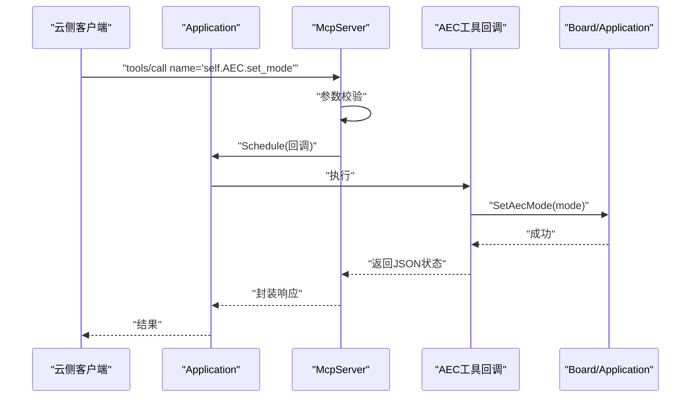
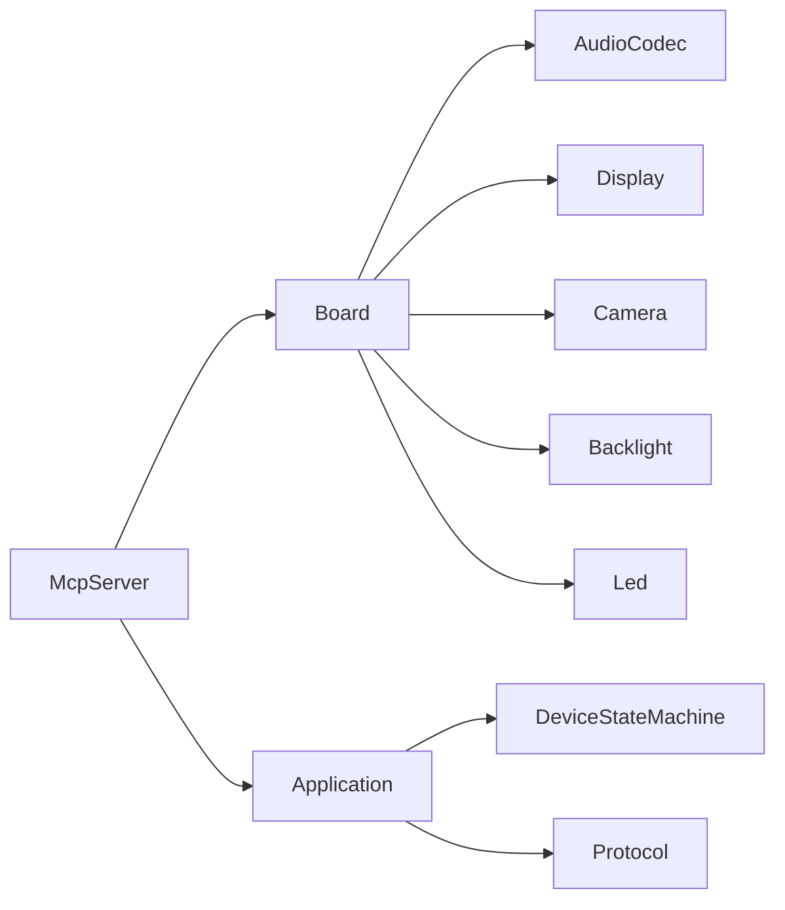

# 设备控制实现

<cite>
**本文引用的文件**
- [mcp_server.h](file://main/mcp_server.h)
- [mcp_server.cc](file://main/mcp_server.cc)
- [application.h](file://main/application.h)
- [application.cc](file://main/application.cc)
- [device_state.h](file://main/device_state.h)
- [device_state_machine.h](file://main/device_state_machine.h)
- [device_state_machine.cc](file://main/device_state_machine.cc)
- [led.h](file://main/led/led.h)
- [gpio_led.h](file://main/led/gpio_led.h)
- [gpio_led.cc](file://main/led/gpio_led.cc)
- [audio_service.h](file://main/audio/audio_service.h)
- [display.h](file://main/display/display.h)
- [board.h](file://main/boards/common/board.h)
- [backlight.h](file://main/boards/common/backlight.h)
- [camera.h](file://main/boards/common/camera.h)
- [mcp_controller.cc](file://main/boards/zhengchen-cam/mcp_controller.cc)
- [mcp_controller-ml307.cc](file://main/boards/zhengchen-cam-ml307/mcp_controller.cc)
- [mcp-protocol.md](file://docs/mcp-protocol.md)
- [mcp-usage.md](file://docs/mcp-usage.md)
</cite>

## 目录
1. [简介](#简介)
2. [项目结构](#项目结构)
3. [核心组件](#核心组件)
4. [架构总览](#架构总览)
5. [详细组件分析](#详细组件分析)
6. [依赖关系分析](#依赖关系分析)
7. [性能考虑](#性能考虑)
8. [故障排除指南](#故障排除指南)
9. [结论](#结论)
10. [附录](#附录)

## 简介
本文件面向IoT应用工程师，系统化阐述XiaoZhi ESP32项目中基于MCP（Model Context Protocol）的设备控制实现。内容涵盖设备侧工具定义与执行、硬件抽象层封装、设备状态管理、命令解析与调度、以及云侧MCP扩展能力的落地方式。文档同时提供完整的开发示例与最佳实践，帮助快速构建稳定可靠的设备控制系统。

## 项目结构
围绕MCP设备控制的关键代码分布在以下模块：
- MCP服务器与工具框架：mcp_server.h/.cc
- 应用主循环与事件调度：application.h/.cc
- 设备状态机：device_state.h, device_state_machine.h/.cc
- 硬件抽象层：board.h, backlight.h, camera.h
- 显示与LED：display.h, led.h, gpio_led.h/.cc
- 音频服务：audio_service.h
- 板级控制器示例：mcp_controller.cc（多块板卡）

图表来源
- [application.cc](file://main/application.cc#L61-L163)
- [mcp_server.cc](file://main/mcp_server.cc#L33-L126)
- [board.h](file://main/boards/common/board.h#L49-L85)
- [display.h](file://main/display/display.h#L28-L61)
- [backlight.h](file://main/boards/common/backlight.h#L10-L37)
- [camera.h](file://main/boards/common/camera.h#L6-L17)
- [led.h](file://main/led/led.h#L4-L18)

章节来源
- [application.cc](file://main/application.cc#L61-L163)
- [mcp_server.cc](file://main/mcp_server.cc#L33-L126)
- [board.h](file://main/boards/common/board.h#L49-L85)

## 核心组件
- MCP服务器与工具框架
  - 提供工具注册、参数校验、回调执行、结果封装与错误处理。
  - 支持“仅用户可见”工具，用于系统运维类操作。
- 应用主循环与事件调度
  - 统一事件驱动模型，负责网络、状态变化、音频通道、UI更新等。
  - 通过Schedule机制将耗时或阻塞操作调度到主任务执行。
- 设备状态机
  - 定义设备状态与合法转换规则，提供观察者回调以联动UI与硬件。
- 硬件抽象层
  - Board统一抽象音频、显示、摄像头、背光、LED、网络等硬件资源。
  - 通过接口与具体板卡实现解耦，便于扩展新硬件平台。

章节来源
- [mcp_server.h](file://main/mcp_server.h#L208-L342)
- [mcp_server.cc](file://main/mcp_server.cc#L33-L126)
- [application.h](file://main/application.h#L42-L172)
- [application.cc](file://main/application.cc#L165-L259)
- [device_state.h](file://main/device_state.h#L4-L16)
- [device_state_machine.h](file://main/device_state_machine.h#L17-L81)
- [board.h](file://main/boards/common/board.h#L49-L85)

## 架构总览
MCP控制流从云侧发起，经由MQTT/WebSocket进入设备，由Application接收并转发至McpServer，McpServer解析消息、校验参数、调度到主任务执行工具回调，最终通过Board访问硬件并返回结果。

图表来源
- [application.cc](file://main/application.cc#L565-L609)
- [mcp_server.cc](file://main/mcp_server.cc#L413-L436)
- [mcp_server.cc](file://main/mcp_server.cc#L511-L563)

## 详细组件分析

### MCP服务器与工具框架
- 工具定义与参数校验
  - 使用Property/PropertyList定义参数类型、默认值与取值范围；DoToolCall在主任务中按需校验参数并调用回调。
  - 支持布尔、整数、字符串三类参数，整数参数可限定范围，超界抛出异常。
- 结果封装与错误处理
  - Call方法将ReturnValue封装为MCP标准响应，支持文本与图片两种内容类型；异常转为错误响应。
- 常用工具
  - 自检工具：self.get_device_status
  - 音频控制：self.audio_speaker.set_volume
  - 屏幕控制：self.screen.set_brightness（若存在背光）
  - 主题切换：self.screen.set_theme（LVGL场景）
  - 拍照与解释：self.camera.take_photo（若存在摄像头）
  - 用户运维工具：self.get_system_info、self.reboot、self.upgrade_firmware、屏幕截图与预览等

图表来源
- [mcp_server.h](file://main/mcp_server.h#L58-L342)

章节来源
- [mcp_server.h](file://main/mcp_server.h#L58-L342)
- [mcp_server.cc](file://main/mcp_server.cc#L33-L126)
- [mcp_server.cc](file://main/mcp_server.cc#L511-L563)

### 应用主循环与事件调度
- 初始化阶段
  - 设置显示、音频、网络事件回调；注册MCP通用工具与用户工具；启动网络。
- 事件驱动
  - 通过事件组触发网络连接/断开、状态变化、语音检测、定时器等；在主任务中处理音频发送队列、唤醒词检测、LED状态联动等。
- 任务调度
  - Schedule将工具回调等需要主线程执行的逻辑入队，避免并发问题。

图表来源
- [application.cc](file://main/application.cc#L61-L163)
- [application.cc](file://main/application.cc#L165-L259)

章节来源
- [application.h](file://main/application.h#L42-L172)
- [application.cc](file://main/application.cc#L61-L163)
- [application.cc](file://main/application.cc#L165-L259)

### 设备状态机
- 状态定义
  - 包含启动、配置、空闲、连接中、监听、说话、升级、激活、音频测试、致命错误等状态。
- 转换规则
  - 严格的状态转换矩阵，非法转换会被拒绝；转换成功后通知观察者。
- 观察者回调
  - UI与LED等组件通过回调感知状态变化，实现联动。

图表来源
- [device_state.h](file://main/device_state.h#L4-L16)
- [device_state_machine.cc](file://main/device_state_machine.cc#L34-L131)

章节来源
- [device_state.h](file://main/device_state.h#L4-L16)
- [device_state_machine.h](file://main/device_state_machine.h#L17-L81)
- [device_state_machine.cc](file://main/device_state_machine.cc#L34-L131)

### 硬件抽象层与设备控制
- Board统一接口
  - 提供AudioCodec、Display、Camera、Backlight、Led、Network等接口，屏蔽不同板卡差异。
- 背光控制
  - Backlight/PwmBacklight抽象PWM背光，支持亮度设置与渐变过渡。
- 摄像头接口
  - Camera抽象拍照、镜像翻转、AI解释等能力，结合MCP工具实现视觉能力。
- LED控制
  - Led接口与GpioLed实现，根据设备状态自动联动LED行为（闪烁、呼吸、亮度等）。

图表来源
- [board.h](file://main/boards/common/board.h#L49-L85)
- [backlight.h](file://main/boards/common/backlight.h#L10-L37)
- [camera.h](file://main/boards/common/camera.h#L6-L17)
- [led.h](file://main/led/led.h#L4-L18)
- [gpio_led.h](file://main/led/gpio_led.h#L13-L47)

章节来源
- [board.h](file://main/boards/common/board.h#L49-L85)
- [backlight.h](file://main/boards/common/backlight.h#L10-L37)
- [camera.h](file://main/boards/common/camera.h#L6-L17)
- [led.h](file://main/led/led.h#L4-L18)
- [gpio_led.h](file://main/led/gpio_led.h#L13-L47)

### 设备控制工具开发示例
以下示例展示如何在特定板卡上注册自定义MCP工具，涵盖工具定义、参数验证、设备操作与状态反馈的完整流程。

- AEC模式设置与查询
  - 工具：self.AEC.set_mode、self.AEC.get_mode
  - 参数：mode（字符串，枚举值）
  - 行为：设置/获取AEC模式，返回JSON状态信息
  - 实现要点：通过Application访问AecMode，延时以确保UI更新，返回结构化结果

- 设备重启
  - 工具：self.res.esp_restart
  - 参数：无
  - 行为：延迟后触发系统重启，返回布尔值

图表来源
- [mcp_controller.cc](file://main/boards/zhengchen-cam/mcp_controller.cc#L27-L51)
- [application.cc](file://main/application.cc#L565-L609)

章节来源
- [mcp_controller.cc](file://main/boards/zhengchen-cam/mcp_controller.cc#L27-L80)
- [mcp_controller-ml307.cc](file://main/boards/zhengchen-cam-ml307/mcp_controller.cc#L27-L80)

### 云侧MCP扩展能力
- 智能家居控制
  - 通过自定义工具对接IoT设备（如继电器、传感器、IoT Hub），实现开关控制、状态上报与联动。
- PC桌面操作
  - 在具备USB/蓝牙等接口的设备上，可通过工具实现按键模拟、窗口控制、剪贴板读写等（需扩展硬件与驱动）。
- 知识搜索
  - 结合本地/云端检索服务，通过工具返回结构化结果，配合UI展示。
- 邮件服务
  - 通过网络接口与SMTP服务集成，实现邮件发送工具，支持附件与主题参数。

说明：上述能力为概念性扩展，需在设备侧新增对应工具与硬件驱动实现。

## 依赖关系分析
- 组件耦合
  - McpServer依赖Board/Hardware接口进行实际设备操作；Application作为事件中枢协调各子系统。
  - 设备状态机与UI/LED等组件松耦合，通过观察者回调联动。
- 外部依赖
  - cJSON用于JSON序列化/反序列化
  - LVGL用于图形界面（部分板卡）
  - FreeRTOS事件组与任务调度

图表来源
- [mcp_server.cc](file://main/mcp_server.cc#L33-L126)
- [application.cc](file://main/application.cc#L61-L163)
- [board.h](file://main/boards/common/board.h#L49-L85)

章节来源
- [mcp_server.cc](file://main/mcp_server.cc#L33-L126)
- [application.cc](file://main/application.cc#L61-L163)
- [board.h](file://main/boards/common/board.h#L49-L85)

## 性能考虑
- 工具执行线程模型
  - 所有工具回调通过Application::Schedule调度到主任务执行，避免多任务并发访问硬件导致的竞争与死锁。
- JSON负载控制
  - 工具列表分页返回，避免单次响应过大；DoToolCall在主任务中执行，减少上下文切换。
- 音频与显示资源
  - AudioService采用分离编码/解码任务与队列，合理设置队列长度与帧时长，降低延迟。
- 电源与性能策略
  - Board提供PowerSaveLevel枚举，根据场景动态调整功耗（低功耗/平衡/高性能）。

## 故障排除指南
- 工具未找到
  - 现象：返回Unknown tool错误
  - 排查：确认工具名称拼写、是否在正确的板卡初始化中注册
- 参数缺失或类型不匹配
  - 现象：返回Missing valid argument或范围越界错误
  - 排查：核对PropertyList定义与调用参数类型、范围
- 工具执行异常
  - 现象：工具回调抛出异常，返回错误响应
  - 排查：查看回调内部日志，确认硬件接口调用顺序与返回值
- 网络/协议问题
  - 现象：MCP消息无法到达或响应超时
  - 排查：检查Protocol初始化、连接状态与事件回调链路

章节来源
- [mcp_server.cc](file://main/mcp_server.cc#L511-L563)
- [application.cc](file://main/application.cc#L565-L609)

## 结论
XiaoZhi ESP32项目通过MCP协议实现了设备侧的标准化控制能力，借助硬件抽象层与事件驱动架构，既保证了跨板卡的兼容性，又提供了良好的扩展性。开发者可基于McpServer框架快速定义工具、接入硬件、实现云侧控制与本地联动，构建稳定可靠的IoT设备控制系统。

## 附录
- 开发步骤建议
  - 明确控制目标与参数范围，设计工具签名
  - 在Board/Hardware层实现底层操作
  - 在Application初始化阶段注册工具
  - 编写参数校验与错误处理逻辑
  - 在UI/LED中订阅状态变化，提供可视化反馈
- 参考文档
  - MCP协议规范与用法说明：[mcp-protocol.md](file://docs/mcp-protocol.md)、[mcp-usage.md](file://docs/mcp-usage.md)