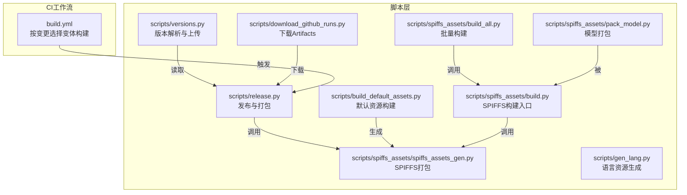
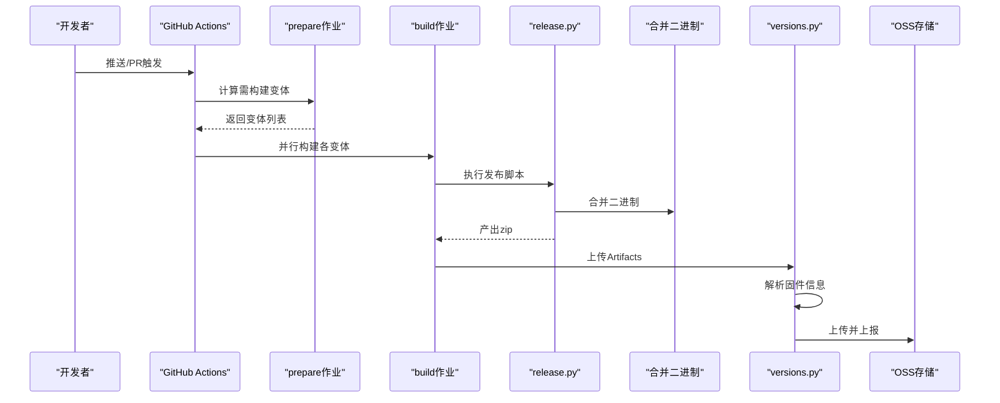
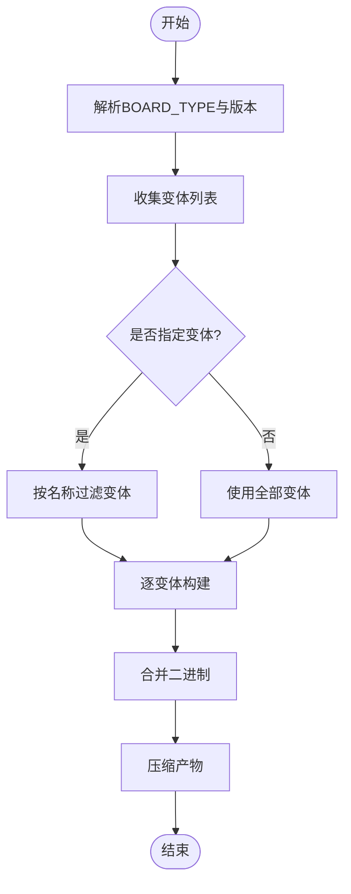
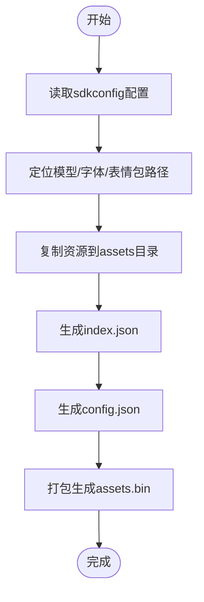
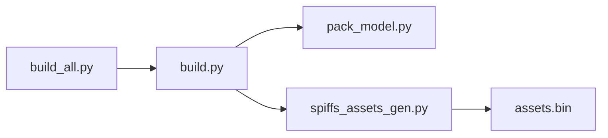
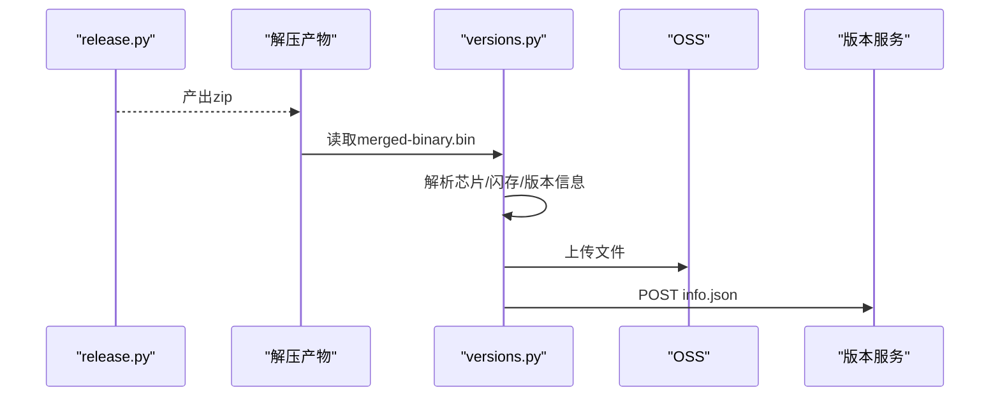
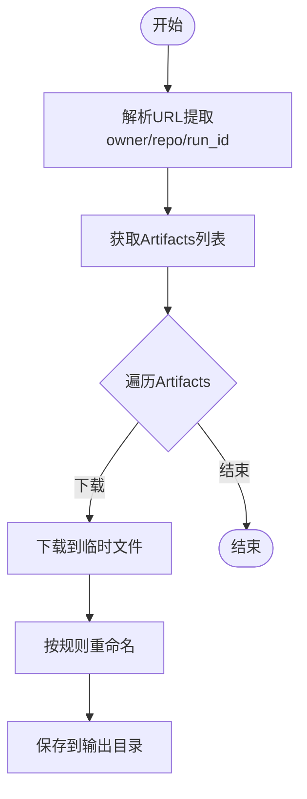
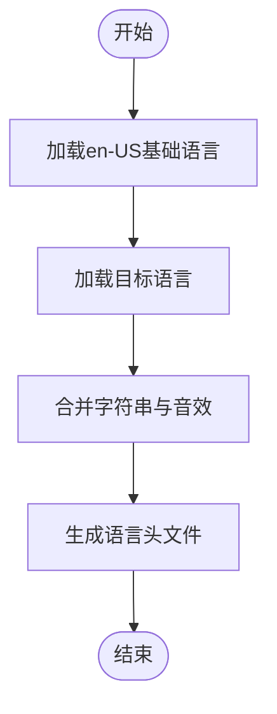
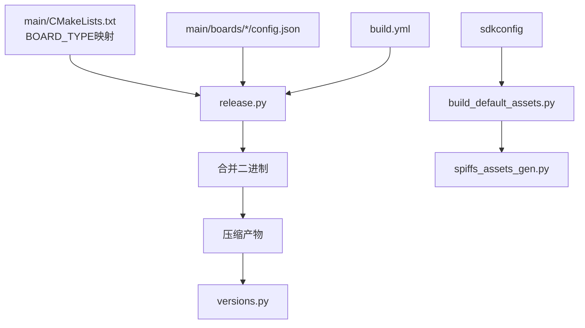

# 发布与部署工具

<cite>
**本文档引用的文件**
- [scripts/release.py](file://scripts/release.py)
- [scripts/build_default_assets.py](file://scripts/build_default_assets.py)
- [scripts/versions.py](file://scripts/versions.py)
- [scripts/spiffs_assets/build.py](file://scripts/spiffs_assets/build.py)
- [scripts/spiffs_assets/build_all.py](file://scripts/spiffs_assets/build_all.py)
- [scripts/spiffs_assets/pack_model.py](file://scripts/spiffs_assets/pack_model.py)
- [scripts/spiffs_assets/spiffs_assets_gen.py](file://scripts/spiffs_assets/spiffs_assets_gen.py)
- [scripts/download_github_runs.py](file://scripts/download_github_runs.py)
- [scripts/gen_lang.py](file://scripts/gen_lang.py)
- [.github/workflows/build.yml](file://.github/workflows/build.yml)
- [README.md](file://README.md)
</cite>

## 目录
1. [简介](#简介)
2. [项目结构](#项目结构)
3. [核心组件](#核心组件)
4. [架构总览](#架构总览)
5. [详细组件分析](#详细组件分析)
6. [依赖关系分析](#依赖关系分析)
7. [性能考虑](#性能考虑)
8. [故障排除指南](#故障排除指南)
9. [结论](#结论)
10. [附录](#附录)

## 简介
本文件面向DevOps团队与项目维护者，系统化梳理XiaoZhi ESP32项目的发布与部署工具链，涵盖版本管理、固件打包、SPIFFS资源构建、自动化发布与上传、版本兼容性检查、部署与回滚策略、质量检查清单与验证流程等内容。通过脚本级工具与GitHub Actions工作流的协同，实现从代码变更到固件产物的全链路自动化。

## 项目结构
项目采用“脚本驱动 + CI工作流”的发布体系：
- 脚本层：发布打包、资源构建、版本解析、下载归档等
- CI层：按变更范围选择性构建，产物上传与归档
- 资源层：默认资源构建、多语言资源生成、SPIFFS分区打包

图表来源
- [scripts/release.py](file://scripts/release.py#L183-L261)
- [scripts/spiffs_assets/spiffs_assets_gen.py](file://scripts/spiffs_assets/spiffs_assets_gen.py#L534-L589)
- [.github/workflows/build.yml](file://.github/workflows/build.yml#L15-L112)

章节来源
- [scripts/release.py](file://scripts/release.py#L1-L324)
- [.github/workflows/build.yml](file://.github/workflows/build.yml#L1-L112)

## 核心组件
- 发布与打包脚本：负责解析版本、选择变体、写入sdkconfig、编译、合并二进制、压缩产物
- 默认资源构建：基于sdkconfig与配置生成assets.bin，包含语音唤醒模型、字体、表情包等
- 版本解析与上传：解析固件信息、上传至OSS、上报版本服务
- SPIFFS资源构建：按参数组合批量生成assets.bin，支持图像格式转换与分块
- 下载Artifacts：从GitHub Actions运行中下载并重命名产物
- 语言资源生成：生成多语言头文件，支持回退到英文

章节来源
- [scripts/release.py](file://scripts/release.py#L183-L261)
- [scripts/build_default_assets.py](file://scripts/build_default_assets.py#L750-L800)
- [scripts/versions.py](file://scripts/versions.py#L223-L246)
- [scripts/spiffs_assets/build.py](file://scripts/spiffs_assets/build.py#L340-L397)
- [scripts/spiffs_assets/build_all.py](file://scripts/spiffs_assets/build_all.py#L80-L143)
- [scripts/spiffs_assets/pack_model.py](file://scripts/spiffs_assets/pack_model.py#L41-L124)
- [scripts/download_github_runs.py](file://scripts/download_github_runs.py#L160-L260)
- [scripts/gen_lang.py](file://scripts/gen_lang.py#L53-L175)

## 架构总览
发布流程从CI工作流触发，根据变更范围筛选待构建变体；每个变体由发布脚本完成编译与打包；随后进行版本信息提取与上传；同时可选地生成SPIFFS资源与语言资源。

图表来源
- [.github/workflows/build.yml](file://.github/workflows/build.yml#L15-L112)
- [scripts/release.py](file://scripts/release.py#L286-L295)
- [scripts/versions.py](file://scripts/versions.py#L223-L246)

## 详细组件分析

### 发布与打包脚本（scripts/release.py）
- 功能要点
  - 从编译命令中解析当前BOARD_TYPE
  - 从根CMakeLists读取PROJECT_VER作为版本号
  - 遍历boards配置收集变体，支持过滤指定变体
  - 依据config.json与CMake映射生成sdkconfig_append并应用自动依赖
  - 设置目标芯片、追加sdkconfig、编译、合并二进制、压缩产物
  - 提供“列出变体”“当前目录打包”两种模式
- 关键流程

图表来源
- [scripts/release.py](file://scripts/release.py#L183-L261)
- [scripts/release.py](file://scripts/release.py#L286-L295)

章节来源
- [scripts/release.py](file://scripts/release.py#L16-L38)
- [scripts/release.py](file://scripts/release.py#L73-L100)
- [scripts/release.py](file://scripts/release.py#L104-L126)
- [scripts/release.py](file://scripts/release.py#L183-L261)
- [scripts/release.py](file://scripts/release.py#L266-L324)

### 默认资源构建（scripts/build_default_assets.py）
- 功能要点
  - 读取sdkconfig识别唤醒词/多语言模型配置
  - 复制唤醒模型、文本字体、表情包、额外文件到临时构建目录
  - 生成index.json与config.json
  - 使用简化打包器生成assets.bin并输出头文件
- 关键流程

图表来源
- [scripts/build_default_assets.py](file://scripts/build_default_assets.py#L750-L800)
- [scripts/build_default_assets.py](file://scripts/build_default_assets.py#L296-L351)

章节来源
- [scripts/build_default_assets.py](file://scripts/build_default_assets.py#L456-L529)
- [scripts/build_default_assets.py](file://scripts/build_default_assets.py#L648-L748)
- [scripts/build_default_assets.py](file://scripts/build_default_assets.py#L750-L800)

### SPIFFS资源构建（scripts/spiffs_assets）
- build.py：单次构建入口，支持唤醒模型、字体、表情包、布局与图标集合
- build_all.py：批量组合构建，枚举模型/字体/表情包组合生成多套assets.bin
- pack_model.py：将模型目录打包为srmodels.bin
- spiffs_assets_gen.py：通用SPIFFS打包器，支持图像格式转换、分块、校验与头文件生成

图表来源
- [scripts/spiffs_assets/build.py](file://scripts/spiffs_assets/build.py#L340-L397)
- [scripts/spiffs_assets/build_all.py](file://scripts/spiffs_assets/build_all.py#L80-L143)
- [scripts/spiffs_assets/pack_model.py](file://scripts/spiffs_assets/pack_model.py#L41-L124)
- [scripts/spiffs_assets/spiffs_assets_gen.py](file://scripts/spiffs_assets/spiffs_assets_gen.py#L534-L589)

章节来源
- [scripts/spiffs_assets/build.py](file://scripts/spiffs_assets/build.py#L48-L74)
- [scripts/spiffs_assets/build.py](file://scripts/spiffs_assets/build.py#L263-L277)
- [scripts/spiffs_assets/build_all.py](file://scripts/spiffs_assets/build_all.py#L32-L78)
- [scripts/spiffs_assets/pack_model.py](file://scripts/spiffs_assets/pack_model.py#L41-L124)
- [scripts/spiffs_assets/spiffs_assets_gen.py](file://scripts/spiffs_assets/spiffs_assets_gen.py#L391-L491)

### 版本解析与上传（scripts/versions.py）
- 功能要点
  - 解析merged-binary.bin中的应用分区，提取芯片ID、闪存大小、版本、编译时间、SHA256等
  - 从产物目录推断主板型号，生成info.json
  - 上传产物至OSS，向版本服务POST信息
- 关键流程

图表来源
- [scripts/versions.py](file://scripts/versions.py#L223-L246)
- [scripts/versions.py](file://scripts/versions.py#L98-L159)

章节来源
- [scripts/versions.py](file://scripts/versions.py#L16-L42)
- [scripts/versions.py](file://scripts/versions.py#L98-L159)
- [scripts/versions.py](file://scripts/versions.py#L168-L178)
- [scripts/versions.py](file://scripts/versions.py#L179-L222)

### 下载Artifacts（scripts/download_github_runs.py）
- 功能要点
  - 解析GitHub Actions运行URL，拉取Artifacts列表
  - 下载并按规则重命名为标准版本命名
  - 支持分页获取，避免遗漏
- 关键流程

图表来源
- [scripts/download_github_runs.py](file://scripts/download_github_runs.py#L160-L260)

章节来源
- [scripts/download_github_runs.py](file://scripts/download_github_runs.py#L21-L40)
- [scripts/download_github_runs.py](file://scripts/download_github_runs.py#L42-L91)
- [scripts/download_github_runs.py](file://scripts/download_github_runs.py#L121-L158)

### 语言资源生成（scripts/gen_lang.py）
- 功能要点
  - 以en-US为基准语言，合并用户语言字符串与音效
  - 生成语言头文件，包含字符串常量与音效视图
  - 支持公共音效与语言特定音效的回退机制
- 关键流程

图表来源
- [scripts/gen_lang.py](file://scripts/gen_lang.py#L53-L100)
- [scripts/gen_lang.py](file://scripts/gen_lang.py#L108-L162)

章节来源
- [scripts/gen_lang.py](file://scripts/gen_lang.py#L32-L46)
- [scripts/gen_lang.py](file://scripts/gen_lang.py#L108-L162)

## 依赖关系分析
- 发布脚本依赖CMake映射与boards配置，动态生成sdkconfig_append并应用自动依赖规则
- 资源构建脚本依赖sdkconfig解析唤醒词/模型配置，再调用SPIFFS打包器
- 版本解析脚本依赖固件二进制结构，解析分区表与应用描述
- CI工作流通过脚本输出变体列表，按需并行构建

图表来源
- [scripts/release.py](file://scripts/release.py#L104-L126)
- [scripts/release.py](file://scripts/release.py#L224-L229)
- [scripts/build_default_assets.py](file://scripts/build_default_assets.py#L456-L529)
- [.github/workflows/build.yml](file://.github/workflows/build.yml#L15-L112)

章节来源
- [scripts/release.py](file://scripts/release.py#L104-L126)
- [scripts/release.py](file://scripts/release.py#L128-L168)
- [scripts/build_default_assets.py](file://scripts/build_default_assets.py#L456-L529)
- [.github/workflows/build.yml](file://.github/workflows/build.yml#L15-L112)

## 性能考虑
- 变体选择性构建：CI根据变更范围缩小构建矩阵，减少流水线时长
- 并行构建：矩阵策略并行编译不同变体，提升吞吐
- 资源打包优化：SPIFFS打包器支持图像格式转换与分块，降低内存占用
- 产物复用：默认资源构建与SPIFFS构建可独立执行，便于缓存与增量更新

## 故障排除指南
- 编译失败
  - 检查BOARD_TYPE是否存在于CMake映射中
  - 确认config.json的builds字段与变体名称一致
  - 查看合并二进制阶段输出
- 版本信息缺失
  - 确认merged-binary.bin包含有效应用分区
  - 检查OSS凭据与端点配置
- 资源打包异常
  - 确认模型/字体/表情包路径存在且可访问
  - 检查SPIFFS分区大小与生成文件大小关系
- CI构建未触发
  - 检查分支保护与权限配置
  - 确认脚本输出变体列表非空

章节来源
- [scripts/release.py](file://scripts/release.py#L301-L324)
- [scripts/versions.py](file://scripts/versions.py#L168-L178)
- [scripts/spiffs_assets/spiffs_assets_gen.py](file://scripts/spiffs_assets/spiffs_assets_gen.py#L597-L601)
- [.github/workflows/build.yml](file://.github/workflows/build.yml#L12-L14)

## 结论
本发布与部署工具链通过脚本与CI的协同，实现了从版本管理、资源构建到固件打包与上传的全流程自动化。结合变体选择性构建与并行策略，显著提升了发布效率；通过版本解析与上传机制，确保产物可追溯与可分发。建议在生产环境中完善质量检查与回滚策略，持续优化资源打包与CI性能。

## 附录

### 版本管理与兼容性
- 版本号规则
  - 从根CMakeLists读取PROJECT_VER作为版本号
- 兼容性检查
  - v2与v1分区表不兼容，OTA不可直接升级
  - 硬件v1可通过手动刷写升级至v2

章节来源
- [scripts/release.py](file://scripts/release.py#L32-L38)
- [README.md](file://README.md#L17-L21)

### 发布流程标准化步骤
- 本地验证
  - 运行默认资源构建与SPIFFS资源构建
  - 执行发布脚本生成zip
- CI触发
  - 推送/PR触发build.yml
  - prepare作业计算变体，build作业并行构建
- 产物处理
  - versions.py解析并上传至OSS，上报版本服务
  - 可选：download_github_runs.py下载Artifacts并重命名

章节来源
- [.github/workflows/build.yml](file://.github/workflows/build.yml#L15-L112)
- [scripts/versions.py](file://scripts/versions.py#L223-L246)
- [scripts/download_github_runs.py](file://scripts/download_github_runs.py#L160-L260)

### 部署策略与回滚机制
- 部署策略
  - 使用versions.py解析的芯片/闪存信息与版本标签
  - 将产物上传至OSS并生成访问URL
- 回滚机制
  - 基于版本标签与OSS存储，可快速切换到历史版本
  - 对于v1→v2升级，采用手动刷写方式

章节来源
- [scripts/versions.py](file://scripts/versions.py#L168-L178)
- [README.md](file://README.md#L17-L21)

### 自动化部署配置
- GitHub Actions
  - 权限：contents: read
  - 触发：push到main或ci/*分支；pull_request到main
  - 步骤：安装jq、获取变体列表、按变更范围筛选、并行构建、上传Artifacts
- 环境变量
  - OSS相关：ACCESS_KEY_ID、ACCESS_KEY_SECRET、ENDPOINT、BUCKET_NAME、BUCKET_URL
  - 版本服务：SERVER_URL、TOKEN
  - GitHub下载：GITHUB_TOKEN

章节来源
- [.github/workflows/build.yml](file://.github/workflows/build.yml#L1-L112)
- [scripts/versions.py](file://scripts/versions.py#L168-L178)
- [scripts/download_github_runs.py](file://scripts/download_github_runs.py#L181-L189)

### 发布前质量检查清单
- 代码与配置
  - CMakeLists版本号正确
  - boards配置文件完整，builds字段齐全
  - sdkconfig中唤醒词/模型配置正确
- 资源与打包
  - 默认资源构建通过
  - SPIFFS资源大小在分区限制内
  - 语言资源生成无缺失
- 流水线与产物
  - CI变体列表非空
  - 合并二进制生成成功
  - 版本解析与上传成功

章节来源
- [scripts/release.py](file://scripts/release.py#L183-L261)
- [scripts/spiffs_assets/spiffs_assets_gen.py](file://scripts/spiffs_assets/spiffs_assets_gen.py#L597-L601)
- [scripts/gen_lang.py](file://scripts/gen_lang.py#L108-L162)
- [.github/workflows/build.yml](file://.github/workflows/build.yml#L35-L84)