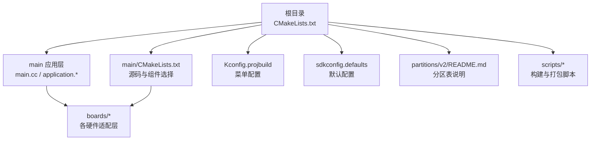
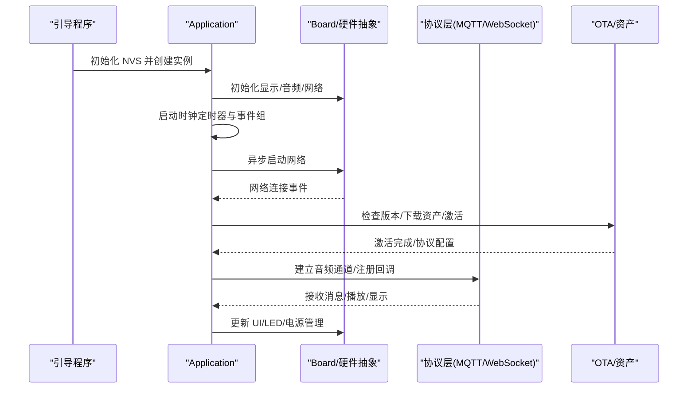
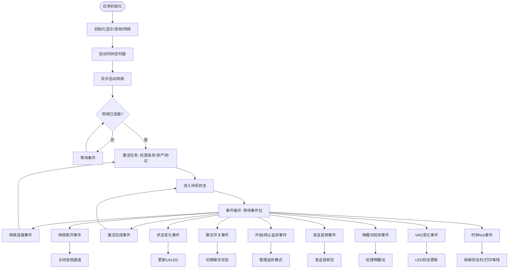
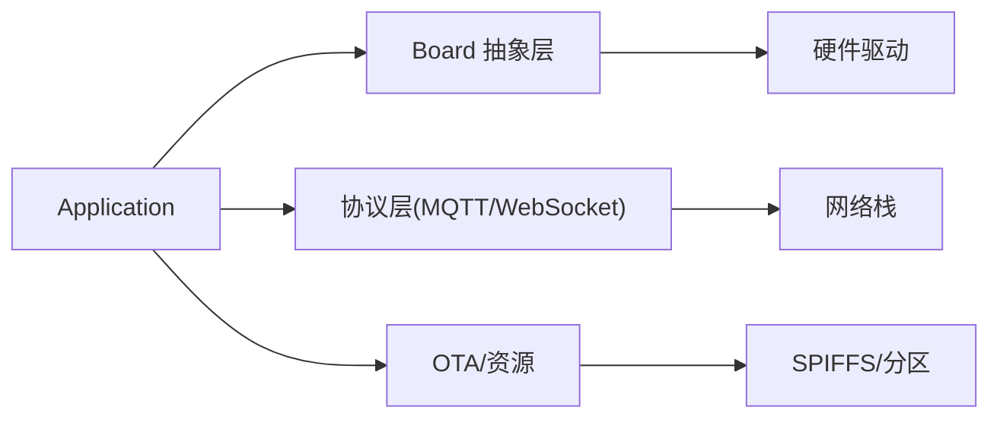

# 快速开始

<cite>
**本文引用的文件**
- [README.md](file://README.md)
- [CMakeLists.txt](file://CMakeLists.txt)
- [main/CMakeLists.txt](file://main/CMakeLists.txt)
- [main/application.h](file://main/application.h)
- [main/application.cc](file://main/application.cc)
- [main/main.cc](file://main/main.cc)
- [main/Kconfig.projbuild](file://main/Kconfig.projbuild)
- [sdkconfig.defaults](file://sdkconfig.defaults)
- [partitions/v2/README.md](file://partitions/v2/README.md)
- [scripts/build_default_assets.py](file://scripts/build_default_assets.py)
- [scripts/release.py](file://scripts/release.py)
</cite>

## 目录
1. [简介](#简介)
2. [项目结构](#项目结构)
3. [核心组件](#核心组件)
4. [架构总览](#架构总览)
5. [详细组件分析](#详细组件分析)
6. [依赖关系分析](#依赖关系分析)
7. [性能考虑](#性能考虑)
8. [故障排查指南](#故障排查指南)
9. [结论](#结论)
10. [附录](#附录)

## 简介
本指南面向首次接触 XiaoZhi ESP32 项目的用户，提供从零开始的完整设置流程，涵盖硬件准备、开发环境搭建、ESP-IDF 配置、工具链安装、两种使用方式（无需开发环境的固件烧录与完整开发环境）、命令行操作示例、常见问题解决以及首次编译运行的验证步骤。文档同时兼顾初学者与有经验用户的使用场景，帮助您快速启动设备并进入后续开发。

## 项目结构
XiaoZhi ESP32 是基于 ESP-IDF 的嵌入式项目，采用模块化设计，支持多种硬件平台与显示/音频/网络组合。项目通过 Kconfig 与 CMakeLists 控制目标芯片、显示风格、唤醒词实现、语言等配置，并通过分区表 v2 支持动态资源更新。

图示来源
- [CMakeLists.txt](file://CMakeLists.txt#L1-L14)
- [main/CMakeLists.txt](file://main/CMakeLists.txt#L1-L120)
- [main/Kconfig.projbuild](file://main/Kconfig.projbuild#L1-L60)
- [sdkconfig.defaults](file://sdkconfig.defaults#L1-L79)
- [partitions/v2/README.md](file://partitions/v2/README.md#L1-L107)
- [scripts/release.py](file://scripts/release.py#L180-L261)

章节来源
- [CMakeLists.txt](file://CMakeLists.txt#L1-L14)
- [main/CMakeLists.txt](file://main/CMakeLists.txt#L1-L120)
- [main/Kconfig.projbuild](file://main/Kconfig.projbuild#L1-L60)
- [sdkconfig.defaults](file://sdkconfig.defaults#L1-L79)
- [partitions/v2/README.md](file://partitions/v2/README.md#L1-L107)
- [scripts/release.py](file://scripts/release.py#L180-L261)

## 核心组件
- 应用入口与主循环
  - 入口函数负责初始化 NVS、创建并运行 Application 实例，进入主事件循环。
  - 关键路径参考：[main.cc](file://main/main.cc#L15-L31)
- 应用状态机与协议处理
  - Application 负责初始化显示、音频、网络回调，维护事件组与状态机，处理激活流程、OTA 升级、协议连接与消息分发。
  - 关键路径参考：[application.h](file://main/application.h#L42-L172)，[application.cc](file://main/application.cc#L61-L163)
- 构建系统与目标选择
  - 根 CMakeLists 指定最小构建与版本号；main/CMakeLists 动态拼接源码与硬件适配文件；Kconfig.projbuild 提供菜单配置项。
  - 关键路径参考：[CMakeLists.txt](file://CMakeLists.txt#L1-L14)，[main/CMakeLists.txt](file://main/CMakeLists.txt#L67-L120)，[main/Kconfig.projbuild](file://main/Kconfig.projbuild#L120-L180)
- 默认配置与分区表
  - sdkconfig.defaults 提供默认优化选项与分区表；partitions/v2/README.md 说明 v2 分区布局与优势。
  - 关键路径参考：[sdkconfig.defaults](file://sdkconfig.defaults#L1-L79)，[partitions/v2/README.md](file://partitions/v2/README.md#L24-L107)
- 资源打包与发布
  - scripts/build_default_assets.py 用于生成 assets.bin；scripts/release.py 用于批量编译与打包。
  - 关键路径参考：[scripts/build_default_assets.py](file://scripts/build_default_assets.py#L750-L800)，[scripts/release.py](file://scripts/release.py#L180-L261)

章节来源
- [main/main.cc](file://main/main.cc#L15-L31)
- [main/application.h](file://main/application.h#L42-L172)
- [main/application.cc](file://main/application.cc#L61-L163)
- [CMakeLists.txt](file://CMakeLists.txt#L1-L14)
- [main/CMakeLists.txt](file://main/CMakeLists.txt#L67-L120)
- [main/Kconfig.projbuild](file://main/Kconfig.projbuild#L120-L180)
- [sdkconfig.defaults](file://sdkconfig.defaults#L1-L79)
- [partitions/v2/README.md](file://partitions/v2/README.md#L24-L107)
- [scripts/build_default_assets.py](file://scripts/build_default_assets.py#L750-L800)
- [scripts/release.py](file://scripts/release.py#L180-L261)

## 架构总览
XiaoZhi ESP32 的运行时架构围绕 Application 的事件驱动模型展开：应用初始化后，根据硬件配置加载显示、音频与网络模块，随后进入主事件循环等待各类事件（网络连接、唤醒词检测、VAD 变化、UI 交互等），并按状态机切换设备状态，完成激活、OTA、协议通道建立与消息处理。

图示来源
- [main/main.cc](file://main/main.cc#L15-L31)
- [main/application.cc](file://main/application.cc#L61-L163)
- [main/application.cc](file://main/application.cc#L261-L338)
- [main/application.cc](file://main/application.cc#L473-L610)

章节来源
- [main/main.cc](file://main/main.cc#L15-L31)
- [main/application.cc](file://main/application.cc#L61-L163)
- [main/application.cc](file://main/application.cc#L261-L338)
- [main/application.cc](file://main/application.cc#L473-L610)

## 详细组件分析

### 组件一：应用生命周期与事件循环
- 初始化阶段
  - 创建 Application 单例，初始化事件组与定时器，设置显示与音频服务，注册网络事件回调。
- 运行阶段
  - 主循环等待事件位，分别处理网络连接/断开、激活完成、状态变化、聊天开关、开始/停止监听、发送音频包、唤醒词检测、VAD 变化等。
- 关键行为
  - 在网络连接后触发激活任务，检查新版本与资产，初始化协议（MQTT 或 WebSocket），并在断网时关闭音频通道。
- 代码路径参考
  - [application.cc](file://main/application.cc#L61-L163)
  - [application.cc](file://main/application.cc#L165-L259)
  - [application.cc](file://main/application.cc#L261-L338)

图示来源
- [main/application.cc](file://main/application.cc#L61-L163)
- [main/application.cc](file://main/application.cc#L165-L259)
- [main/application.cc](file://main/application.cc#L261-L338)

章节来源
- [main/application.cc](file://main/application.cc#L61-L163)
- [main/application.cc](file://main/application.cc#L165-L259)
- [main/application.cc](file://main/application.cc#L261-L338)

### 组件二：构建系统与硬件选择
- 目标芯片与变体
  - 通过 Kconfig.projbuild 的 BOARD_TYPE 选择具体硬件平台（如 ESP32-S3、ESP32-C3、ESP32-P4 等），并可进一步细化屏幕类型、显示风格、唤醒词实现等。
- 构建配置
  - main/CMakeLists 根据 CONFIG_BOARD_TYPE_* 条件拼接对应硬件源码与资源，自动选择音频处理器与唤醒词实现。
- 默认配置
  - sdkconfig.defaults 设置分区表（v2）、内存与网络相关优化、LVGL 配置等。
- 代码路径参考
  - [main/Kconfig.projbuild](file://main/Kconfig.projbuild#L120-L180)
  - [main/CMakeLists.txt](file://main/CMakeLists.txt#L67-L120)
  - [sdkconfig.defaults](file://sdkconfig.defaults#L14-L27)

章节来源
- [main/Kconfig.projbuild](file://main/Kconfig.projbuild#L120-L180)
- [main/CMakeLists.txt](file://main/CMakeLists.txt#L67-L120)
- [sdkconfig.defaults](file://sdkconfig.defaults#L14-L27)

### 组件三：资源打包与发布
- 资源打包
  - scripts/build_default_assets.py 读取 sdkconfig 与内置字体/表情包/唤醒词模型，生成 assets.bin 与索引文件，供 SPIFFS 分区使用。
- 发布打包
  - scripts/release.py 读取各硬件变体配置，设置目标芯片、追加 sdkconfig、执行构建、合并二进制并打包为 zip，便于批量发布。
- 代码路径参考
  - [scripts/build_default_assets.py](file://scripts/build_default_assets.py#L750-L800)
  - [scripts/release.py](file://scripts/release.py#L180-L261)

章节来源
- [scripts/build_default_assets.py](file://scripts/build_default_assets.py#L750-L800)
- [scripts/release.py](file://scripts/release.py#L180-L261)

## 依赖关系分析
- 组件耦合
  - Application 依赖 Board 抽象层（显示/音频/网络）、协议层（MQTT/WebSocket）、OTA 与资源系统；事件组与 FreeRTOS 定时器贯穿运行时控制。
- 直接/间接依赖
  - main/CMakeLists 动态引入 boards/* 下的硬件适配源码；Kconfig.projbuild 决定编译宏与功能开关；sdkconfig.defaults 提供默认值。
- 外部依赖
  - ESP-IDF SDK、ESP-SR（唤醒词模型）、LVGL UI 框架、SPIFFS 文件系统等。

图示来源
- [main/application.cc](file://main/application.cc#L61-L163)
- [main/CMakeLists.txt](file://main/CMakeLists.txt#L67-L120)
- [sdkconfig.defaults](file://sdkconfig.defaults#L14-L27)

章节来源
- [main/application.cc](file://main/application.cc#L61-L163)
- [main/CMakeLists.txt](file://main/CMakeLists.txt#L67-L120)
- [sdkconfig.defaults](file://sdkconfig.defaults#L14-L27)

## 性能考虑
- 内存与分区
  - v2 分区表将模型分区替换为更大容量的 assets 分区，支持动态内容更新；默认配置中对 LVGL、HTTPD、SSL 等进行裁剪以节省空间。
- 任务优先级与时钟
  - 主任务优先级提升至 10，定时器每秒触发一次刷新状态栏与周期性堆栈统计，便于调试与监控。
- 语音与网络
  - 根据目标芯片与是否启用 PSRAM 选择唤醒词实现（ESP32 C3/C5/C6 与 ESP32 S3/P4 的差异），并可选设备端/服务器端 AEC 以降低回声影响。

章节来源
- [sdkconfig.defaults](file://sdkconfig.defaults#L1-L79)
- [main/application.cc](file://main/application.cc#L94-L163)
- [main/Kconfig.projbuild](file://main/Kconfig.projbuild#L626-L723)

## 故障排查指南
- NVS 初始化失败或损坏
  - 现象：启动时报错或反复擦除 NVS。
  - 处理：确认 nvs_flash_init 返回值，必要时擦除并重新初始化。
  - 参考：[main/main.cc](file://main/main.cc#L17-L24)
- 网络连接异常
  - 现象：无法连接 Wi-Fi 或 4G 模块注册失败。
  - 处理：检查网络事件回调中的错误提示，确认 AP 凭据、SIM 卡状态与运营商支持。
  - 参考：[main/application.cc](file://main/application.cc#L102-L156)
- 激活失败或超时
  - 现象：OTA 检查版本/激活超时。
  - 处理：查看重试逻辑与错误提示，确认服务器地址与网络连通性。
  - 参考：[main/application.cc](file://main/application.cc#L398-L471)
- 音频通道异常
  - 现象：无法打开/关闭音频通道或采样率不匹配导致失真。
  - 处理：确认协议返回的采样率与设备输出一致，必要时调整配置。
  - 参考：[main/application.cc](file://main/application.cc#L473-L520)
- 分区表不兼容
  - 现象：从 v1 升级到 v2 无法 OTA。
  - 处理：按照 v2 说明刷写新的分区表，首次启动会自动下载所需资产。
  - 参考：[partitions/v2/README.md](file://partitions/v2/README.md#L94-L107)

章节来源
- [main/main.cc](file://main/main.cc#L17-L24)
- [main/application.cc](file://main/application.cc#L102-L156)
- [main/application.cc](file://main/application.cc#L398-L471)
- [main/application.cc](file://main/application.cc#L473-L520)
- [partitions/v2/README.md](file://partitions/v2/README.md#L94-L107)

## 结论
通过本快速开始指南，您可以：
- 明确两种使用方式：直接烧录固件与完整开发环境；
- 正确选择硬件平台并完成编译与打包；
- 理解应用生命周期、事件循环与资源管理；
- 在首次编译后进行验证，确保设备正常启动与联网。

建议在完成基础验证后，逐步深入 Kconfig 与 boards/* 的定制，结合 scripts/* 脚本实现自动化构建与发布。

## 附录

### A. 两种使用方式与适用人群
- 无需开发环境的固件烧录（适合初学者）
  - 优点：上手快，无需安装工具链与 IDE。
  - 适用：快速体验设备功能、演示与教学场景。
  - 参考：[README.md](file://README.md#L107-L114)
- 完整开发环境（适合开发者与硬件爱好者）
  - 优点：可自定义硬件适配、语言、显示风格、唤醒词实现等。
  - 适用：二次开发、多平台适配、深度定制。
  - 参考：[README.md](file://README.md#L115-L121)

章节来源
- [README.md](file://README.md#L107-L121)

### B. 硬件平台选择建议
- 初学者
  - 推荐面包板/入门套件（如 Bread Compact WiFi/LCD/Camera），便于理解电路与外设。
  - 参考：[main/Kconfig.projbuild](file://main/Kconfig.projbuild#L125-L145)
- 开发者
  - 根据目标芯片（ESP32-S3/C3/P4）与屏幕类型（OLED/LCD/AMOLED）选择对应变体。
  - 参考：[main/Kconfig.projbuild](file://main/Kconfig.projbuild#L529-L581)
- 硬件爱好者
  - 可参考 boards/* 下的硬件适配文件，结合 Kconfig 与 CMakeLists 进行扩展。
  - 参考：[main/CMakeLists.txt](file://main/CMakeLists.txt#L67-L120)

章节来源
- [main/Kconfig.projbuild](file://main/Kconfig.projbuild#L125-L145)
- [main/Kconfig.projbuild](file://main/Kconfig.projbuild#L529-L581)
- [main/CMakeLists.txt](file://main/CMakeLists.txt#L67-L120)

### C. 命令行操作示例（基于仓库脚本）
- 设置目标芯片
  - 示例：idf.py set-target esp32s3
  - 参考：[scripts/release.py](file://scripts/release.py#L240-L244)
- 追加 sdkconfig 配置并构建
  - 示例：追加 CONFIG_BOARD_TYPE_ESP_BOX_3=y，然后执行构建
  - 参考：[scripts/release.py](file://scripts/release.py#L245-L254)
- 合并二进制并打包
  - 示例：idf.py merge-bin 后 zip 打包
  - 参考：[scripts/release.py](file://scripts/release.py#L256-L260)

章节来源
- [scripts/release.py](file://scripts/release.py#L240-L260)

### D. 第一次编译运行验证步骤
- 验证步骤
  - 选择硬件平台（Kconfig 选择 BOARD_TYPE）。
  - 编译并生成合并后的二进制文件。
  - 使用烧录工具将固件烧录到设备。
  - 上电后观察显示与 LED 是否按预期工作，尝试语音唤醒与聊天交互。
- 参考路径
  - [main/Kconfig.projbuild](file://main/Kconfig.projbuild#L120-L180)
  - [CMakeLists.txt](file://CMakeLists.txt#L1-L14)
  - [main/main.cc](file://main/main.cc#L15-L31)
  - [partitions/v2/README.md](file://partitions/v2/README.md#L24-L107)

章节来源
- [main/Kconfig.projbuild](file://main/Kconfig.projbuild#L120-L180)
- [CMakeLists.txt](file://CMakeLists.txt#L1-L14)
- [main/main.cc](file://main/main.cc#L15-L31)
- [partitions/v2/README.md](file://partitions/v2/README.md#L24-L107)