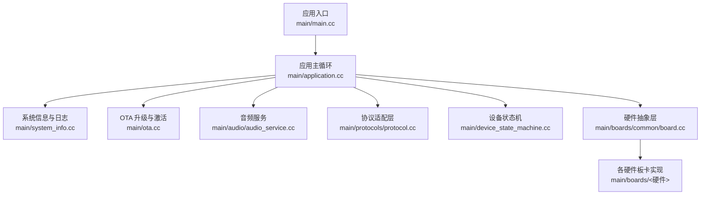
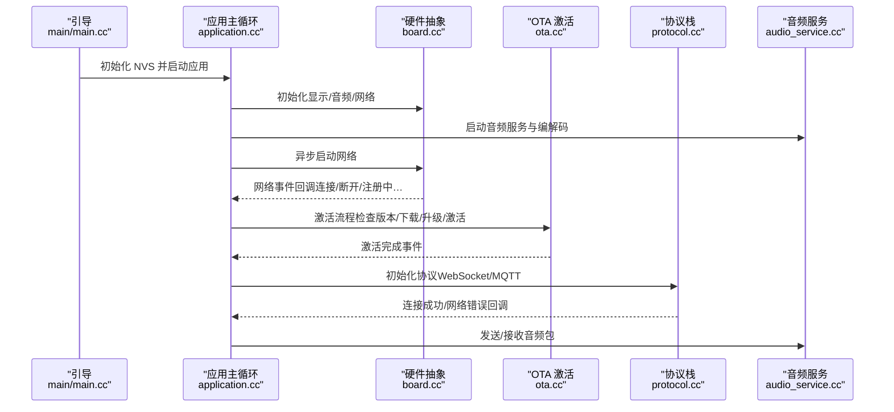
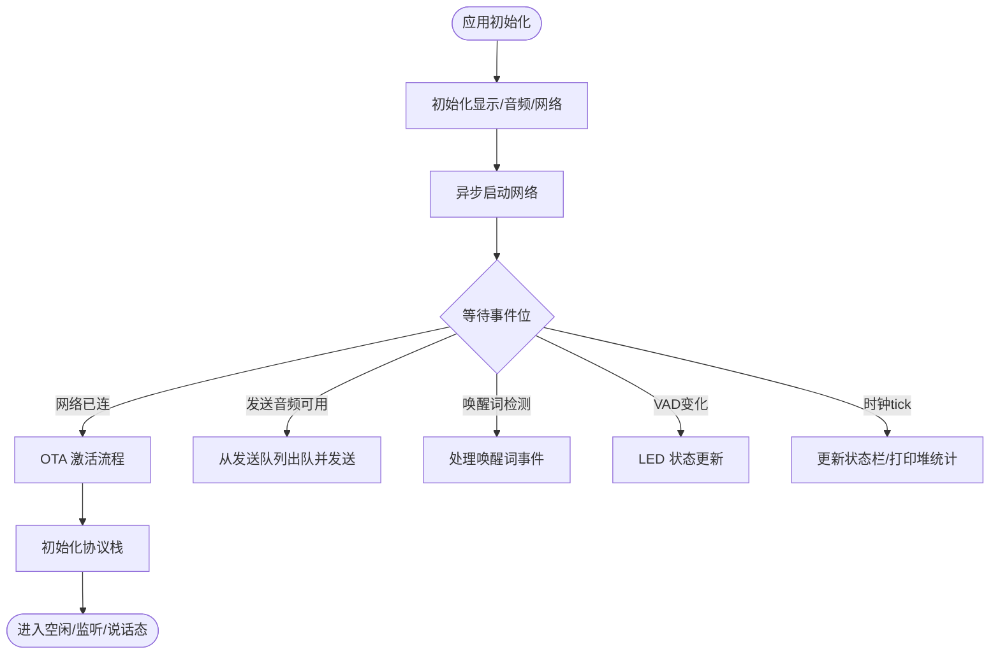
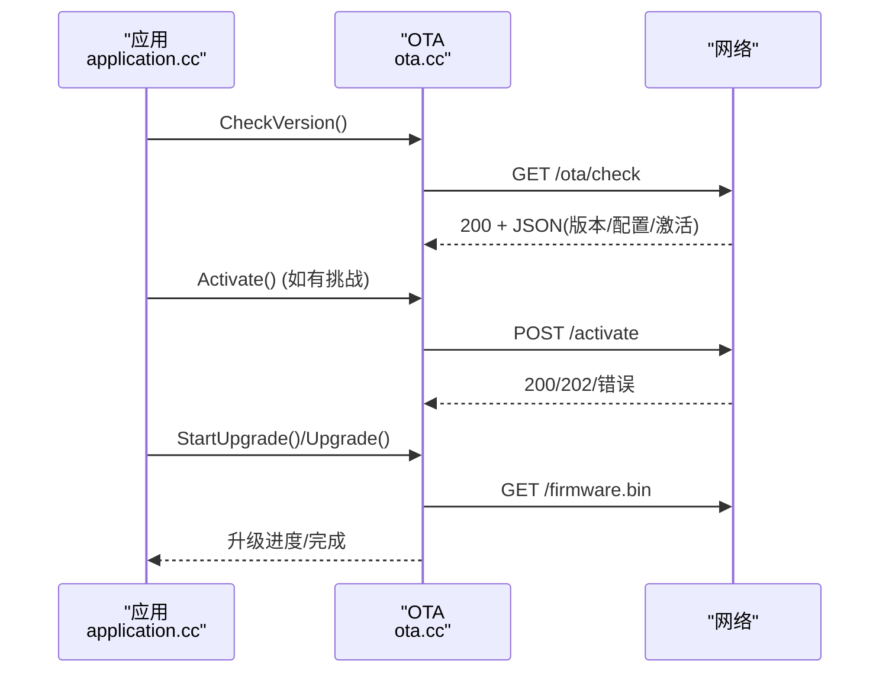
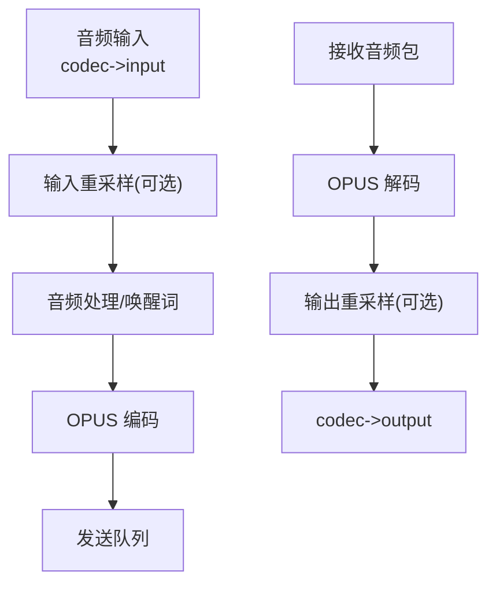
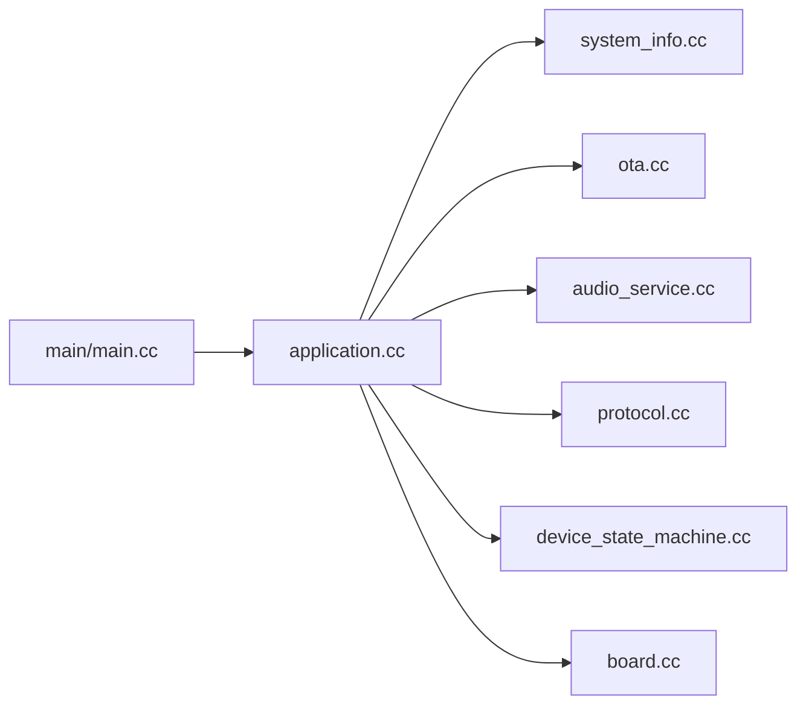

# 故障排除与FAQ

<cite>
**本文引用的文件**
- [README.md](file://README.md)
- [main/main.cc](file://main/main.cc)
- [main/application.cc](file://main/application.cc)
- [main/system_info.cc](file://main/system_info.cc)
- [main/ota.cc](file://main/ota.cc)
- [main/audio/audio_service.cc](file://main/audio/audio_service.cc)
- [main/boards/common/board.cc](file://main/boards/common/board.cc)
- [main/device_state_machine.cc](file://main/device_state_machine.cc)
- [main/protocols/protocol.cc](file://main/protocols/protocol.cc)
- [docs/blufi.md](file://docs/blufi.md)
- [scripts/acoustic_check/readme.md](file://scripts/acoustic_check/readme.md)
</cite>

## 目录
1. [简介](#简介)
2. [项目结构](#项目结构)
3. [核心组件](#核心组件)
4. [架构总览](#架构总览)
5. [详细组件分析](#详细组件分析)
6. [依赖关系分析](#依赖关系分析)
7. [性能考虑](#性能考虑)
8. [故障排除指南](#故障排除指南)
9. [结论](#结论)
10. [附录](#附录)

## 简介
本文件为 XiaoZhi ESP32 项目的“故障排除与FAQ”，聚焦于硬件连接、固件烧录、网络连接、音频播放等常见问题，提供系统化调试方法与工具使用指南，并对错误代码与状态机进行解释，帮助用户快速定位与解决问题。内容涵盖日志分析、性能监控、内存诊断、OTA 升级与激活流程、音频链路与唤醒词检测、以及多硬件平台的差异与注意事项。

## 项目结构
XiaoZhi ESP32 是基于 ESP-IDF 的实时语音交互设备，采用模块化设计，关键目录与职责如下：
- main：应用入口、应用主循环、系统信息、OTA、音频服务、协议适配层、设备状态机、硬件抽象层（board）
- docs：协议与配网文档（如 BluFi）
- scripts：辅助脚本（声学测试、资源打包、音频转换等）

图表来源
- [main/main.cc](file://main/main.cc#L15-L30)
- [main/application.cc](file://main/application.cc#L61-L163)
- [main/system_info.cc](file://main/system_info.cc#L148-L156)
- [main/ota.cc](file://main/ota.cc#L77-L244)
- [main/audio/audio_service.cc](file://main/audio/audio_service.cc#L62-L123)
- [main/boards/common/board.cc](file://main/boards/common/board.cc#L70-L178)
- [main/device_state_machine.cc](file://main/device_state_machine.cc#L108-L131)
- [main/protocols/protocol.cc](file://main/protocols/protocol.cc#L7-L33)

章节来源
- [README.md](file://README.md#L1-L174)
- [main/main.cc](file://main/main.cc#L15-L30)

## 核心组件
- 应用主循环与事件驱动：负责初始化、网络事件回调、UI 更新、状态切换与任务调度
- 系统信息与日志：打印堆内存统计、任务 CPU 使用情况、PM 锁状态等
- OTA 升级与激活：版本检查、激活挑战/应答、固件升级、服务器时间同步
- 音频服务：OPUS 编解码、采样率重采样、唤醒词检测、音频处理管线、播放队列
- 协议适配层：WebSocket/MQTT 协议抽象，消息分发与通道生命周期管理
- 设备状态机：严格的状态转移表，确保设备行为可预期
- 硬件抽象层：统一获取显示、音频编解码器、网络、LED、相机等能力

章节来源
- [main/application.cc](file://main/application.cc#L61-L163)
- [main/system_info.cc](file://main/system_info.cc#L148-L156)
- [main/ota.cc](file://main/ota.cc#L77-L244)
- [main/audio/audio_service.cc](file://main/audio/audio_service.cc#L62-L123)
- [main/protocols/protocol.cc](file://main/protocols/protocol.cc#L7-L33)
- [main/device_state_machine.cc](file://main/device_state_machine.cc#L108-L131)
- [main/boards/common/board.cc](file://main/boards/common/board.cc#L70-L178)

## 架构总览
XiaoZhi ESP32 的运行时由“应用主循环 + 事件组”驱动，网络事件、音频事件、定时器事件通过事件位触发相应处理分支；OTA 激活完成后选择协议栈（WebSocket 或 MQTT），建立音频通道并开始语音交互。

图表来源
- [main/main.cc](file://main/main.cc#L15-L30)
- [main/application.cc](file://main/application.cc#L61-L163)
- [main/ota.cc](file://main/ota.cc#L323-L338)
- [main/protocols/protocol.cc](file://main/protocols/protocol.cc#L23-L49)
- [main/audio/audio_service.cc](file://main/audio/audio_service.cc#L125-L167)

## 详细组件分析

### 应用主循环与事件驱动
- 初始化顺序：NVS → 应用单例 → 显示/UI → 音频服务 → 网络异步启动 → 状态栏更新
- 事件组：包含时钟 tick、发送音频、唤醒词检测、VAD 变化、网络连接/断开、状态变更等事件位
- 网络事件回调：根据事件类型更新 UI 通知、蜂鸣音效与状态栏
- OTA 激活：版本检查、资产下载与应用、固件升级、协议初始化
- 协议回调：网络错误、音频通道打开/关闭、JSON 消息解析与系统命令

图表来源
- [main/application.cc](file://main/application.cc#L165-L259)
- [main/application.cc](file://main/application.cc#L261-L321)
- [main/application.cc](file://main/application.cc#L473-L610)

章节来源
- [main/application.cc](file://main/application.cc#L61-L163)
- [main/application.cc](file://main/application.cc#L165-L259)
- [main/application.cc](file://main/application.cc#L261-L321)
- [main/application.cc](file://main/application.cc#L473-L610)

### 系统信息与日志
- 堆内存统计：周期性打印内部 SRAM 空闲与最小空闲
- 任务 CPU 使用：采集前后系统状态，计算各任务运行时间占比
- PM 锁状态：打印锁信息，辅助排查电源管理阻塞
- 设备信息 JSON：上报 Flash 大小、MAC 地址、芯片型号、分区表、运行分区等

章节来源
- [main/system_info.cc](file://main/system_info.cc#L148-L156)
- [main/system_info.cc](file://main/system_info.cc#L57-L140)
- [main/boards/common/board.cc](file://main/boards/common/board.cc#L70-L178)

### OTA 升级与激活
- 版本检查：构造系统信息 JSON，向 OTA URL 发起请求，解析响应中的新版本、MQTT/WebSocket 配置、服务器时间
- 激活挑战/应答：若设备具备序列号，使用 HMAC-SHA256 计算挑战签名，提交激活
- 固件升级：HTTP 下载镜像，按页写入 OTA 分区，校验并设置下次启动分区
- 标记有效：将当前运行镜像标记为有效，取消回滚

图表来源
- [main/ota.cc](file://main/ota.cc#L77-L244)
- [main/ota.cc](file://main/ota.cc#L458-L492)
- [main/ota.cc](file://main/ota.cc#L267-L387)

章节来源
- [main/ota.cc](file://main/ota.cc#L77-L244)
- [main/ota.cc](file://main/ota.cc#L267-L387)
- [main/ota.cc](file://main/ota.cc#L458-L492)

### 音频服务与唤醒词
- OPUS 编解码：编码帧大小与采样率固定，解码按服务器采样率动态重建
- 重采样：输入/输出采样率与设备编解码器不一致时进行重采样
- 唤醒词检测：根据模型前缀选择 AFE 或 ESP 唤醒词实现，支持回调
- 音频处理：音频输入/输出任务、编解码任务、发送/播放队列、音频功率管理定时器
- 音频调试：可选的音频调试器，将原始 PCM 数据转发到 UDP

图表来源
- [main/audio/audio_service.cc](file://main/audio/audio_service.cc#L62-L123)
- [main/audio/audio_service.cc](file://main/audio/audio_service.cc#L327-L446)
- [main/audio/audio_service.cc](file://main/audio/audio_service.cc#L448-L482)

章节来源
- [main/audio/audio_service.cc](file://main/audio/audio_service.cc#L62-L123)
- [main/audio/audio_service.cc](file://main/audio/audio_service.cc#L125-L167)
- [main/audio/audio_service.cc](file://main/audio/audio_service.cc#L327-L446)
- [main/audio/audio_service.cc](file://main/audio/audio_service.cc#L448-L482)

### 协议适配层
- 抽象接口：连接/断开、音频通道打开/关闭、网络错误、JSON 消息回调
- 心跳超时：通道超过阈值无消息视为超时
- 消息类型：tts/stt/llm/mcp/system/custom 等，分别驱动 UI、音频播放、系统命令等

章节来源
- [main/protocols/protocol.cc](file://main/protocols/protocol.cc#L7-L33)
- [main/protocols/protocol.cc](file://main/protocols/protocol.cc#L81-L90)

### 设备状态机
- 状态集合：启动、Wi-Fi 配网、空闲、连接中、监听、说话、升级、激活、音频测试、致命错误等
- 转移规则：严格的有向图，禁止非法跳转；状态变更通过回调通知 UI 与业务逻辑

章节来源
- [main/device_state_machine.cc](file://main/device_state_machine.cc#L108-L131)

### 硬件抽象层
- 统一生成/持久化 UUID，拼装系统信息 JSON，供 OTA 与云端上报使用
- 提供显示、LED、相机、网络等能力的统一接口

章节来源
- [main/boards/common/board.cc](file://main/boards/common/board.cc#L15-L46)
- [main/boards/common/board.cc](file://main/boards/common/board.cc#L70-L178)

## 依赖关系分析
- 入口依赖：main/main.cc 依赖 application 与 system_info
- 应用依赖：application 依赖 board、display、audio_codec、protocol、assets、settings、mcp_server、ota
- 音频依赖：audio_service 依赖 codec、processors、wake_words、demuxer、timer
- 协议依赖：protocol 抽象，具体实现为 WebSocket/MQTT
- 状态机：被 application 与 UI 事件驱动

图表来源
- [main/main.cc](file://main/main.cc#L15-L30)
- [main/application.cc](file://main/application.cc#L1-L20)

章节来源
- [main/main.cc](file://main/main.cc#L15-L30)
- [main/application.cc](file://main/application.cc#L1-L20)

## 性能考虑
- 内存使用：定期打印内部 SRAM 空闲与最小空闲，避免碎片化；注意音频队列长度与帧大小
- CPU 负载：使用任务 CPU 使用统计，识别高占用任务；必要时降低采样率或关闭非关键功能
- 功耗管理：音频通道打开时提升性能档位，关闭时退回低功耗；音频输入/输出空闲后关闭外设
- 重采样：当服务器采样率与设备输出不一致时，尽量在设备侧重采样以减少失真
- OTA 升级：升级期间提高性能档位，完成后恢复低功耗

章节来源
- [main/system_info.cc](file://main/system_info.cc#L148-L156)
- [main/system_info.cc](file://main/system_info.cc#L57-L140)
- [main/audio/audio_service.cc](file://main/audio/audio_service.cc#L682-L695)
- [main/application.cc](file://main/application.cc#L504-L520)

## 故障排除指南

### 一、硬件连接问题
- 现象
  - 上电无显示/无反应
  - 按键无效、LED 不亮
  - 音频无声或杂音
- 排查步骤
  - 检查供电与电源管理芯片状态（如 AXP2101/SY6970）
  - 确认板卡配置文件与硬件引脚映射正确
  - 使用系统信息打印功能查看设备信息与分区表
- 相关日志与接口
  - 系统信息 JSON 包含 Flash、MAC、芯片型号、分区表、运行分区等
  - 音频服务在输入/输出时自动开启编解码器，若无声音，检查 codec 初始化与引脚

章节来源
- [main/boards/common/board.cc](file://main/boards/common/board.cc#L70-L178)
- [main/audio/audio_service.cc](file://main/audio/audio_service.cc#L303-L322)

### 二、固件烧录失败
- 现象
  - 烧录报错、无法连接、擦除失败
- 排查步骤
  - 清理 NVS：应用入口会检测 NVS 新版本或无可用页，自动擦除并重试
  - 检查串口驱动、USB 线缆、波特率与烧录参数
  - 确认分区表与目标芯片匹配（v1/v2 不兼容）
- 相关日志与接口
  - NVS 初始化与擦除逻辑
  - 分区表说明与升级路径

章节来源
- [main/main.cc](file://main/main.cc#L18-L24)
- [README.md](file://README.md#L17-L21)

### 三、网络连接异常
- 现象
  - Wi-Fi 无法连接、注册超时、Modem 错误
- 排查步骤
  - 查看网络事件回调：扫描中、连接中、已连接、断开、注册中、SIM/注册错误等
  - 使用 BluFi（BLE Wi‑Fi 配网）进行 Wi‑Fi 凭据下发
  - 检查路由器、账号与 OTA URL 配置
- 相关日志与接口
  - 网络事件回调与 UI 通知
  - BluFi 配网说明与注意事项

章节来源
- [main/application.cc](file://main/application.cc#L102-L156)
- [docs/blufi.md](file://docs/blufi.md#L1-L38)

### 四、OTA 升级与激活失败
- 现象
  - 版本检查失败、激活超时/失败、固件升级中断
- 排查步骤
  - 检查 OTA URL 与网络连通性
  - 若存在激活挑战，确认序列号与 HMAC 计算正确
  - 观察升级进度与速度，确保缓冲区充足
- 相关日志与接口
  - 版本检查与激活流程
  - 升级写入与校验逻辑

章节来源
- [main/ota.cc](file://main/ota.cc#L77-L244)
- [main/ota.cc](file://main/ota.cc#L458-L492)
- [main/ota.cc](file://main/ota.cc#L267-L387)

### 五、音频播放问题
- 现象
  - 无声音、破音、延迟大、唤醒词不识别
- 排查步骤
  - 检查音频编解码器初始化与采样率配置
  - 对比服务器采样率与设备输出采样率，必要时启用重采样
  - 使用音频调试工具（UDP）观察 PCM 时域/频域
  - 关注音频队列长度与编码帧大小
- 相关日志与接口
  - 音频服务初始化、编解码、重采样与队列
  - 唤醒词检测与 VAD 状态回调

章节来源
- [main/audio/audio_service.cc](file://main/audio/audio_service.cc#L62-L123)
- [main/audio/audio_service.cc](file://main/audio/audio_service.cc#L327-L446)
- [main/audio/audio_service.cc](file://main/audio/audio_service.cc#L448-L482)
- [scripts/acoustic_check/readme.md](file://scripts/acoustic_check/readme.md#L1-L23)

### 六、错误代码与状态机
- 网络错误：协议层设置错误并回调应用，应用弹出错误提示
- 通道超时：协议层检测长时间无消息并记录日志
- 状态机：严格的状态转移，非法跳转会被拒绝并记录警告
- 建议
  - 结合状态机日志与网络事件，定位卡顿或死循环
  - 出现致命错误时，重启设备并检查最近一次状态变更

章节来源
- [main/protocols/protocol.cc](file://main/protocols/protocol.cc#L35-L49)
- [main/protocols/protocol.cc](file://main/protocols/protocol.cc#L81-L90)
- [main/device_state_machine.cc](file://main/device_state_machine.cc#L116-L131)

### 七、不同硬件平台注意事项
- ESP32-S3/ESP32-P4：支持 AFE 唤醒词与更多音频处理器特性
- ESP32-C3/C6/P4：注意 Wi‑Fi MAC 获取方式差异
- 各板卡的音频编解码器与引脚配置不同，需核对 config.h 与对应驱动

章节来源
- [main/system_info.cc](file://main/system_info.cc#L37-L44)
- [main/audio/audio_service.cc](file://main/audio/audio_service.cc#L31-L36)

### 八、预防性维护与最佳实践
- 定期打印堆内存与任务 CPU 使用，发现异常提前干预
- 升级前备份配置，升级后验证音频与网络功能
- 使用音频调试工具进行声学链路验证，降低现场返工概率
- 保持开发环境与工具链最新，避免已知问题

章节来源
- [main/system_info.cc](file://main/system_info.cc#L148-L156)
- [main/audio/audio_service.cc](file://main/audio/audio_service.cc#L219-L225)
- [scripts/acoustic_check/readme.md](file://scripts/acoustic_check/readme.md#L1-L23)

### 九、问题报告与反馈流程（标准化）
- 收集信息
  - 设备型号、芯片平台、固件版本、分区表版本
  - 日志片段（含错误码、状态机日志、网络事件）
  - 复现步骤、环境条件（Wi‑Fi、电源、温度）
- 提交渠道
  - GitHub Issues，附带上述信息与截图/录音（如适用）
- 响应与跟进
  - 维护团队将评估问题并给出修复方案或临时规避措施

章节来源
- [README.md](file://README.md#L163-L163)

## 结论
通过系统化的日志与性能监控、严格的设备状态机与协议抽象、完善的 OTA 激活与音频链路，XiaoZhi ESP32 能够在多硬件平台上稳定运行。遇到问题时，建议优先从网络事件与状态机日志入手，结合系统信息与音频调试工具定位根因，并遵循标准化的报告流程以便快速闭环。

## 附录

### A. 常见问题速查
- 无法联网：检查 Wi‑Fi 凭据、路由器、BluFi 配网开关
- 固件升级失败：检查 OTA URL、网络连通、升级缓冲区
- 音频无声：检查 codec 初始化、重采样、队列长度
- 唤醒词不灵敏：调整模型与阈值、检查麦克风增益与降噪

### B. 调试工具清单
- 日志打印：系统信息、任务 CPU 使用、PM 锁状态
- 音频调试：UDP PCM 观察、声学测试工具
- OTA 诊断：版本检查日志、激活挑战/应答、升级进度

章节来源
- [main/system_info.cc](file://main/system_info.cc#L57-L140)
- [scripts/acoustic_check/readme.md](file://scripts/acoustic_check/readme.md#L1-L23)
- [main/ota.cc](file://main/ota.cc#L77-L244)