# LCD显示系统

<cite>
**本文档引用的文件**
- [display.h](file://main/display/display.h)
- [lvgl_display.h](file://main/display/lvgl_display/lvgl_display.h)
- [lcd_display.h](file://main/display/lcd_display.h)
- [lcd_display.cc](file://main/display/lcd_display.cc)
- [lvgl_image.h](file://main/display/lvgl_display/lvgl_image.h)
- [lvgl_image.cc](file://main/display/lvgl_display/lvgl_image.cc)
- [backlight.h](file://main/boards/common/backlight.h)
- [backlight.cc](file://main/boards/common/backlight.cc)
- [board.h](file://main/boards/common/board.h)
- [esp32-s3-touch-lcd-1.83/config.h](file://main/boards/waveshare/esp32-s3-touch-lcd-1.83/config.h)
- [m5stack-core-s3/config.h](file://main/boards/m5stack-core-s3/config.h)
- [esp32-s3-touch-lcd-1.46.cc](file://main/boards/waveshare/esp32-s3-touch-lcd-1.46/esp32-s3-touch-lcd-1.46.cc)
- [esp-sensairshuttle.cc](file://main/boards/esp-sensairshuttle/esp-sensairshuttle.cc)
- [otto_robot.cc](file://main/boards/otto-robot/otto_robot.cc)
- [custom_lcd_display.h](file://main/boards/waveshare/esp32-s3-rlcd-4.2/custom_lcd_display.h)
- [custom_lcd_display.cc](file://main/boards/waveshare/esp32-s3-rlcd-4.2/custom_lcd_display.cc)
- [LVGLImage.py](file://scripts/Image_Converter/LVGLImage.py)
</cite>

## 目录
1. [简介](#简介)
2. [项目结构](#项目结构)
3. [核心组件](#核心组件)
4. [架构概览](#架构概览)
5. [详细组件分析](#详细组件分析)
6. [依赖关系分析](#依赖关系分析)
7. [性能考虑](#性能考虑)
8. [故障排除指南](#故障排除指南)
9. [结论](#结论)

## 简介

XiaoZhi ESP32项目的LCD显示系统是一个基于LVGL图形库的完整显示解决方案，支持多种显示接口和屏幕类型。该系统提供了统一的显示抽象层，支持SPI、RGB、MIPI等多种接口标准，能够适配从1.28英寸到4.3英寸的各种尺寸屏幕。

系统采用模块化设计，通过继承体系支持不同的显示驱动类型，包括SPI LCD、RGB LCD和MIPI LCD等。同时集成了背光控制、主题管理、图像处理等功能模块，为用户提供完整的显示体验。

## 项目结构

LCD显示系统主要分布在以下目录中：

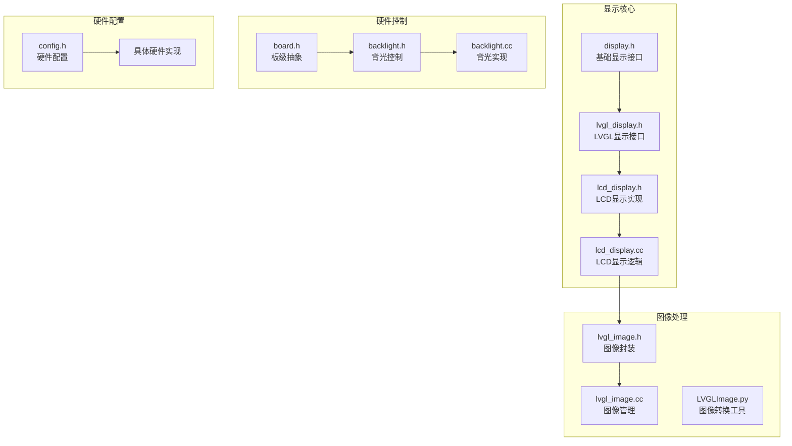

**图表来源**
- [display.h](file://main/display/display.h#L1-L88)
- [lvgl_display.h](file://main/display/lvgl_display/lvgl_display.h#L1-L54)
- [lcd_display.h](file://main/display/lcd_display.h#L1-L86)

**章节来源**
- [display.h](file://main/display/display.h#L1-L88)
- [lvgl_display.h](file://main/display/lvgl_display/lvgl_display.h#L1-L54)
- [lcd_display.h](file://main/display/lcd_display.h#L1-L86)

## 核心组件

### 显示接口层次结构

系统采用分层设计模式，通过虚基类定义统一接口，派生类实现具体功能：

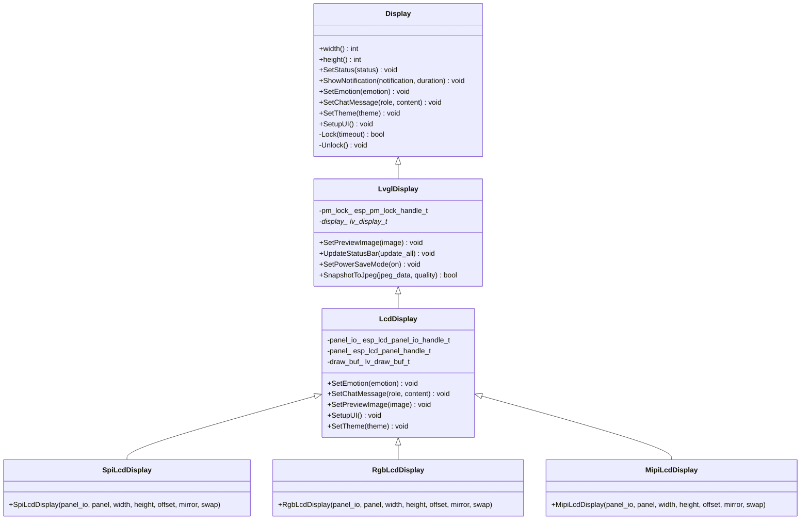

**图表来源**
- [display.h](file://main/display/display.h#L28-L61)
- [lvgl_display.h](file://main/display/lvgl_display/lvgl_display.h#L15-L50)
- [lcd_display.h](file://main/display/lcd_display.h#L17-L83)

### 主题管理系统

系统内置了完整的主题管理机制，支持浅色和深色两种主题：

| 主题属性 | 浅色主题 | 深色主题 |
|---------|---------|---------|
| 背景颜色 | #FFFFFF | #000000 |
| 文本颜色 | #000000 | #FFFFFF |
| 用户气泡 | #00FF00 | #00FF00 |
| 助手气泡 | #DDDDDD | #222222 |
| 系统背景 | #E0E0E0 | #1F1F1F |
| 低电量颜色 | #000000 | #FF0000 |

**章节来源**
- [lcd_display.cc](file://main/display/lcd_display.cc#L25-L63)

## 架构概览

### 硬件抽象层架构

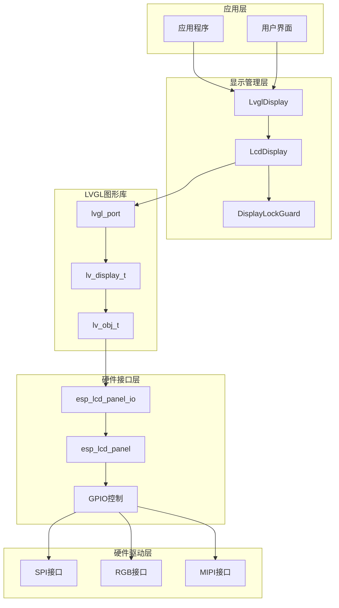

**图表来源**
- [lvgl_display.h](file://main/display/lvgl_display/lvgl_display.h#L15-L50)
- [lcd_display.h](file://main/display/lcd_display.h#L17-L83)

### 显示初始化流程

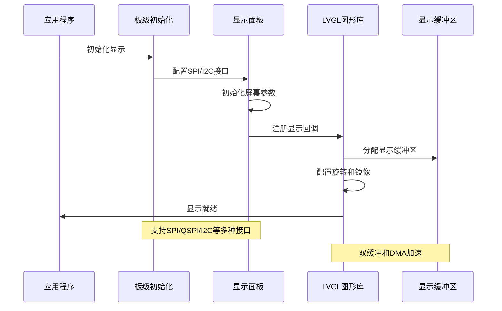

**图表来源**
- [lcd_display.cc](file://main/display/lcd_display.cc#L92-L172)
- [esp32-s3-touch-lcd-1.46.cc](file://main/boards/waveshare/esp32-s3-touch-lcd-1.46/esp32-s3-touch-lcd-1.46.cc#L117-L138)

## 详细组件分析

### SPI LCD显示驱动

SPI LCD驱动实现了完整的显示功能，支持多种旋转和镜像配置：

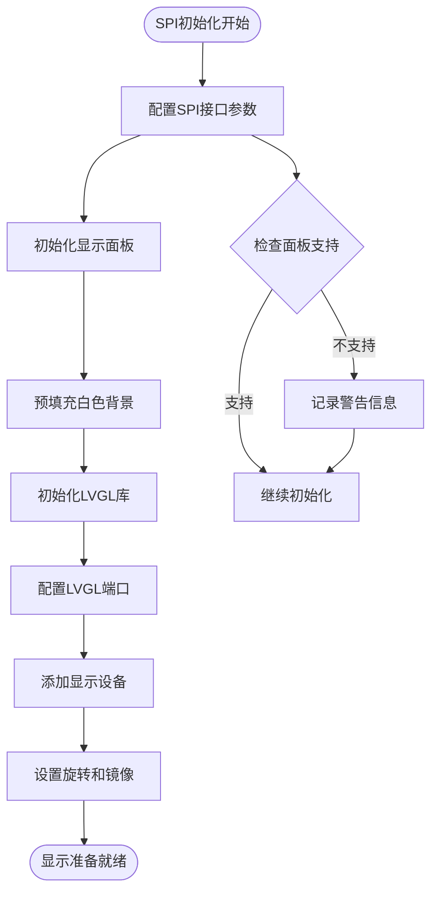

**图表来源**
- [lcd_display.cc](file://main/display/lcd_display.cc#L92-L172)

SPI LCD驱动的关键特性包括：
- **双缓冲支持**：通过`double_buffer = false`配置
- **DMA传输**：启用`buff_dma = 1`进行高效数据传输
- **字节交换**：`swap_bytes = 1`优化数据格式
- **旋转支持**：完全支持90°、180°、270°旋转

**章节来源**
- [lcd_display.cc](file://main/display/lcd_display.cc#L137-L161)

### RGB LCD显示驱动

RGB LCD驱动针对RGB接口进行了专门优化：

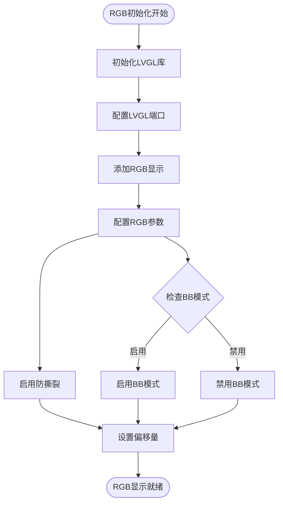

**图表来源**
- [lcd_display.cc](file://main/display/lcd_display.cc#L176-L233)

RGB LCD驱动的特殊配置：
- **BB模式**：`avoid_tearing = true`启用防撕裂
- **全刷新**：`full_refresh = 1`确保完整显示更新
- **直接模式**：`direct_mode = 1`优化RGB接口性能

**章节来源**
- [lcd_display.cc](file://main/display/lcd_display.cc#L217-L222)

### 自定义LCD显示驱动

对于特殊需求的LCD屏幕，系统提供了自定义驱动支持：

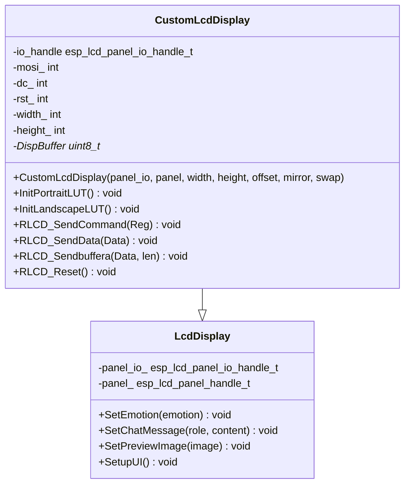

**图表来源**
- [custom_lcd_display.h](file://main/boards/waveshare/esp32-s3-rlcd-4.2/custom_lcd_display.h#L20-L46)

**章节来源**
- [custom_lcd_display.h](file://main/boards/waveshare/esp32-s3-rlcd-4.2/custom_lcd_display.h#L1-L46)

### 背光控制系统

背光控制是显示系统的重要组成部分，提供了平滑的亮度调节功能：

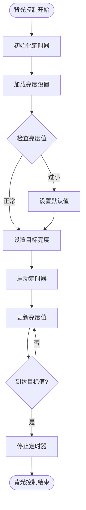

**图表来源**
- [backlight.cc](file://main/boards/common/backlight.cc#L70-L82)

背光控制的关键特性：
- **PWM调光**：使用LEDC定时器实现精确控制
- **渐变效果**：5ms间隔的平滑亮度变化
- **配置持久化**：自动保存和恢复亮度设置
- **频率优化**：25kHz PWM频率避免电感啸叫

**章节来源**
- [backlight.h](file://main/boards/common/backlight.h#L10-L36)
- [backlight.cc](file://main/boards/common/backlight.cc#L46-L82)

### 图像处理系统

系统提供了完整的图像处理能力，支持多种图像格式和操作：

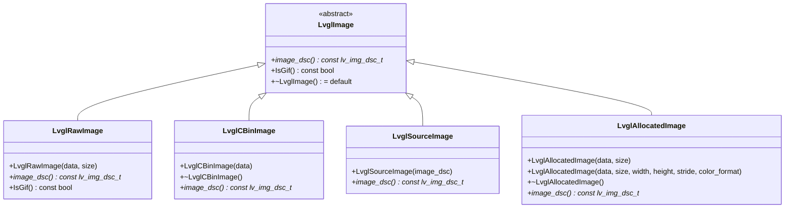

**图表来源**
- [lvgl_image.h](file://main/display/lvgl_display/lvgl_image.h#L6-L53)

**章节来源**
- [lvgl_image.h](file://main/display/lvgl_display/lvgl_image.h#L1-L53)
- [lvgl_image.cc](file://main/display/lvgl_display/lvgl_image.cc#L48-L64)

## 依赖关系分析

### 硬件接口依赖

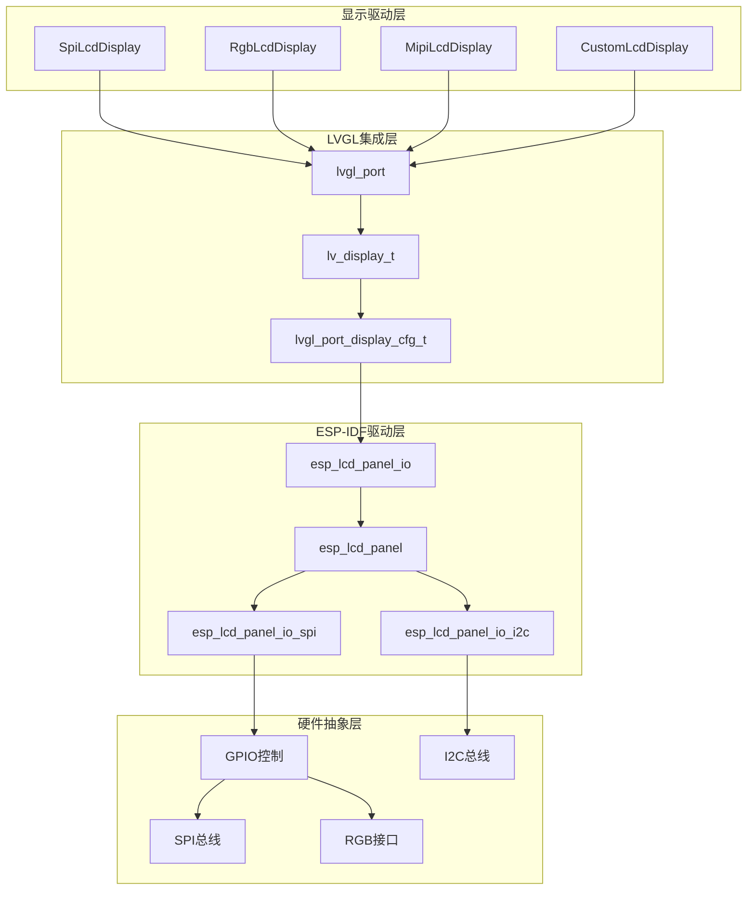

**图表来源**
- [lcd_display.h](file://main/display/lcd_display.h#L62-L83)
- [lvgl_display.h](file://main/display/lvgl_display/lvgl_display.h#L15-L50)

### 配置文件组织

系统通过配置文件实现硬件无关的设计：

| 配置文件 | 功能描述 | 支持的硬件 |
|---------|---------|----------|
| config.h | 基础硬件配置 | 所有支持的硬件平台 |
| esp32-s3-touch-lcd-1.83/config.h | 1.83英寸触摸屏配置 | Waveshare 1.83寸触摸屏 |
| m5stack-core-s3/config.h | M5Stack核心S3配置 | M5Stack系列设备 |
| 其他config.h | 特定硬件配置 | 各种定制硬件平台 |

**章节来源**
- [esp32-s3-touch-lcd-1.83/config.h](file://main/boards/waveshare/esp32-s3-touch-lcd-1.83/config.h#L1-L48)
- [m5stack-core-s3/config.h](file://main/boards/m5stack-core-s3/config.h#L1-L67)

## 性能考虑

### 显示刷新优化

系统采用了多种优化策略来提升显示性能：

1. **双缓冲技术**：RGB LCD驱动启用双缓冲模式，减少显示撕裂
2. **DMA传输**：SPI接口使用DMA传输，提高数据传输效率
3. **字节交换优化**：启用字节交换减少数据格式转换开销
4. **PSRAM缓存**：在支持PSRAM的设备上启用图像缓存

### 内存管理优化

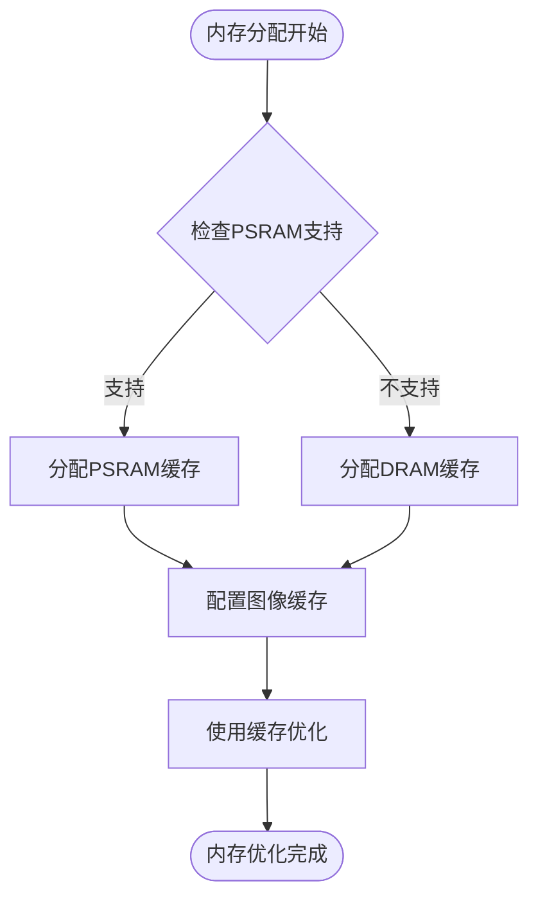

**图表来源**
- [lcd_display.cc](file://main/display/lcd_display.cc#L116-L126)

### 刷新率优化策略

系统通过以下方式优化刷新率：

- **部分刷新**：LVGL端口支持部分刷新区域
- **批量传输**：自定义驱动支持批量数据传输
- **旋转优化**：针对旋转场景优化数据传输路径
- **DMA链式传输**：使用DMA链式传输减少CPU干预

**章节来源**
- [custom_lcd_display.cc](file://main/boards/waveshare/esp32-s3-rlcd-4.2/custom_lcd_display.cc#L46-L95)

## 故障排除指南

### 常见问题诊断

| 问题症状 | 可能原因 | 解决方案 |
|---------|---------|---------|
| 屏幕无显示 | SPI连接错误 | 检查CS、DC、MOSI引脚连接 |
| 显示异常 | 时序参数不正确 | 调整pclk_hz和spi_mode参数 |
| 闪烁现象 | DMA配置问题 | 检查DMA通道和缓冲区配置 |
| 亮度异常 | 背光控制问题 | 验证PWM频率和占空比设置 |
| 图像失真 | 数据格式错误 | 确认RGB顺序和像素格式 |

### 调试工具和方法

1. **日志输出**：系统大量使用ESP_LOG宏输出调试信息
2. **状态监控**：通过`UpdateStatusBar`监控显示状态
3. **内存检测**：使用`esp_psram_get_size()`检查PSRAM状态
4. **性能分析**：通过`lvgl_port_lock/unlock`监控显示锁定状态

### 硬件兼容性检查

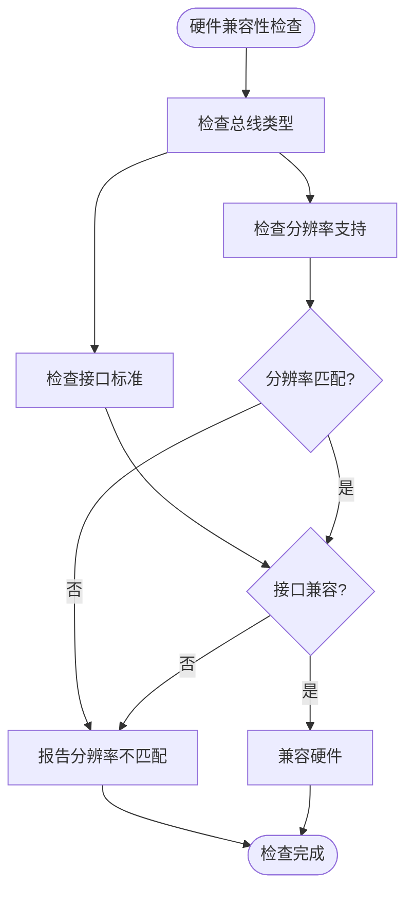

**图表来源**
- [board.h](file://main/boards/common/board.h#L49-L84)

**章节来源**
- [board.h](file://main/boards/common/board.h#L1-L93)

## 结论

XiaoZhi ESP32项目的LCD显示系统展现了优秀的工程设计和实现质量。系统通过模块化的架构设计，成功地将LVGL图形库与ESP-IDF硬件驱动相结合，提供了高度可扩展和可维护的显示解决方案。

主要优势包括：

1. **架构清晰**：分层设计使得代码结构清晰，易于理解和维护
2. **功能完整**：涵盖了从基础显示到高级特效的完整功能
3. **性能优化**：通过多种技术手段优化显示性能
4. **硬件兼容**：支持多种显示接口和屏幕类型
5. **易于扩展**：良好的抽象层便于添加新的显示设备

该系统为嵌入式显示应用提供了一个优秀的参考实现，具有很高的实用价值和学习价值。