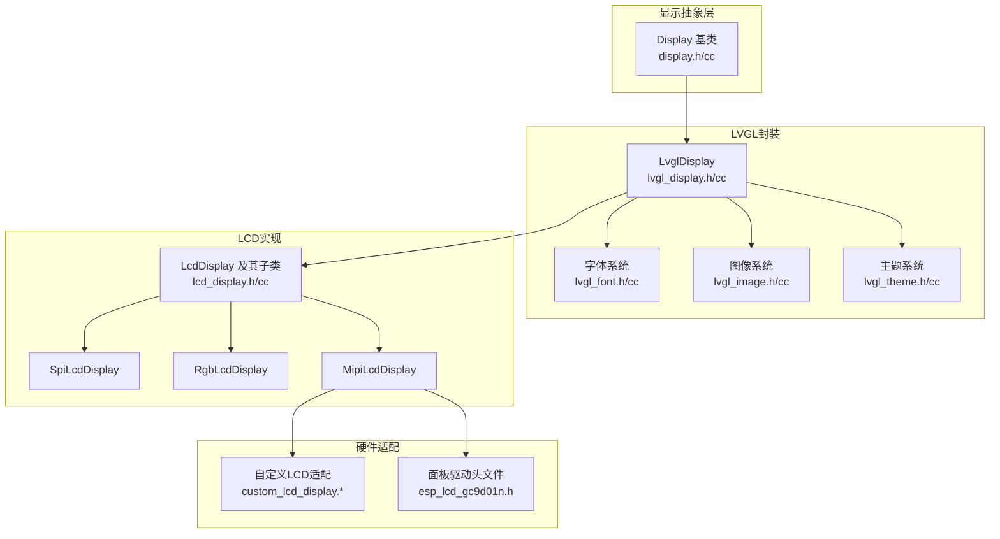
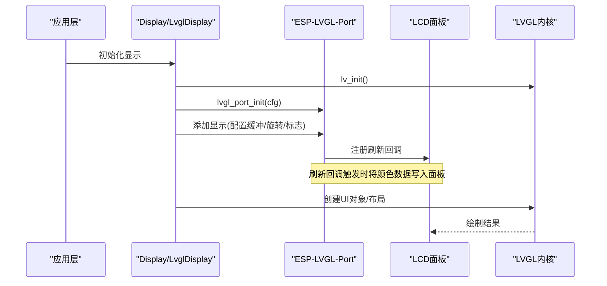
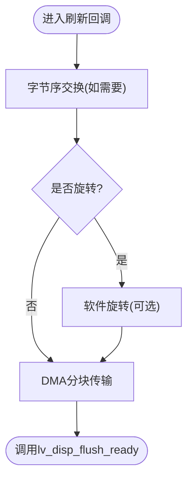
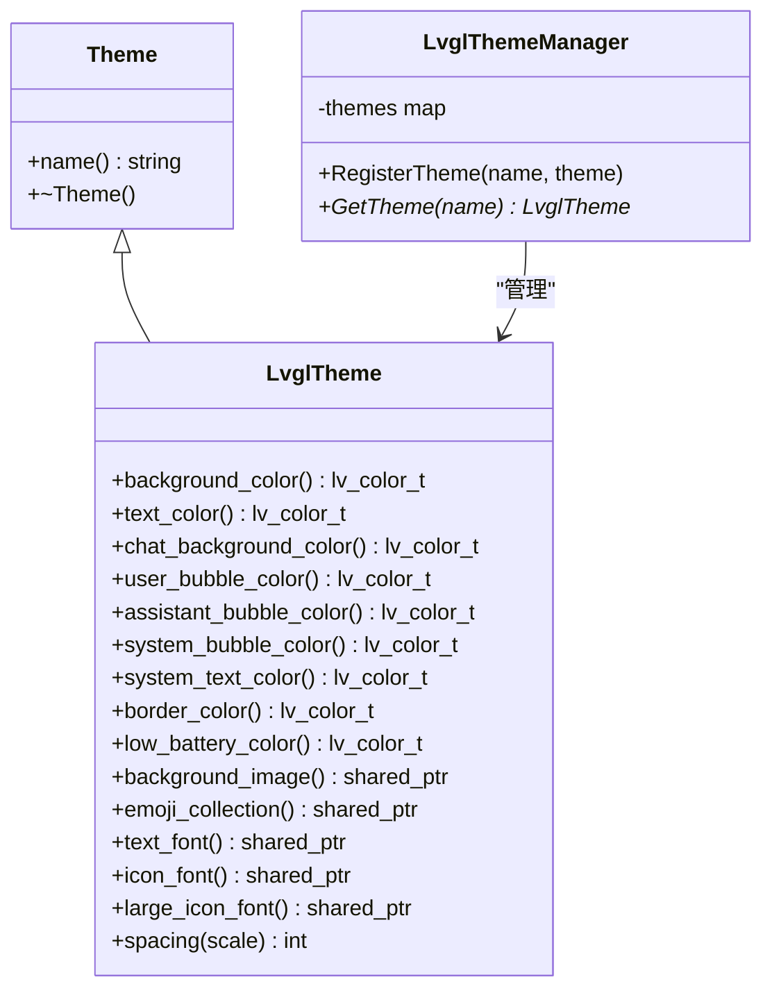
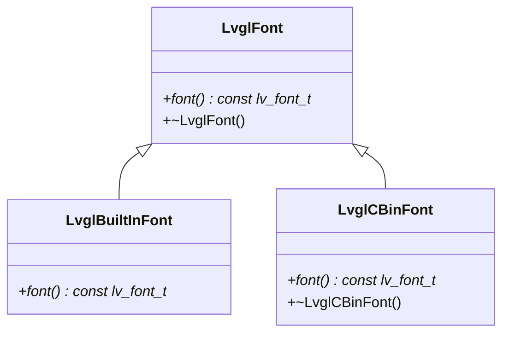
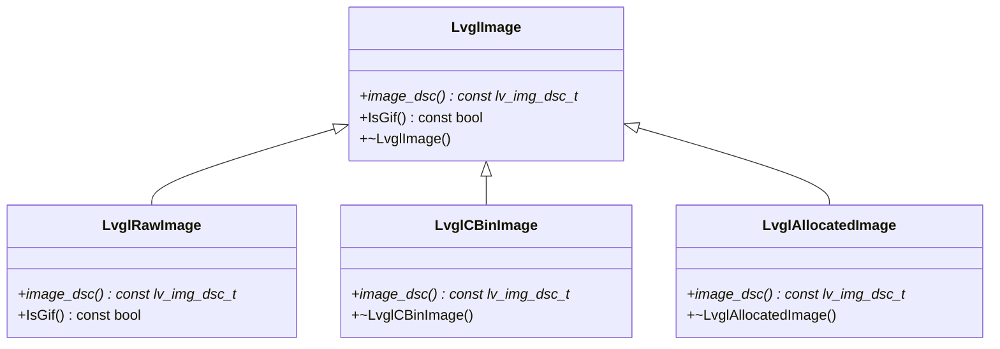
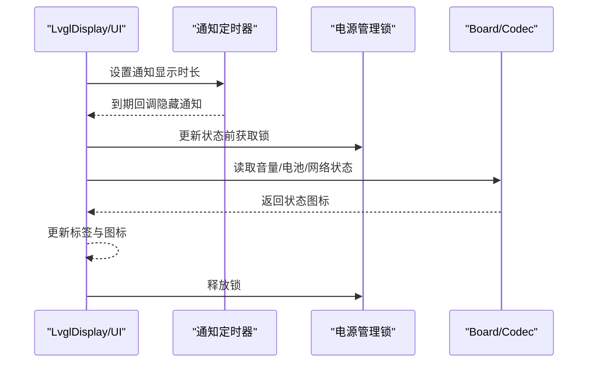
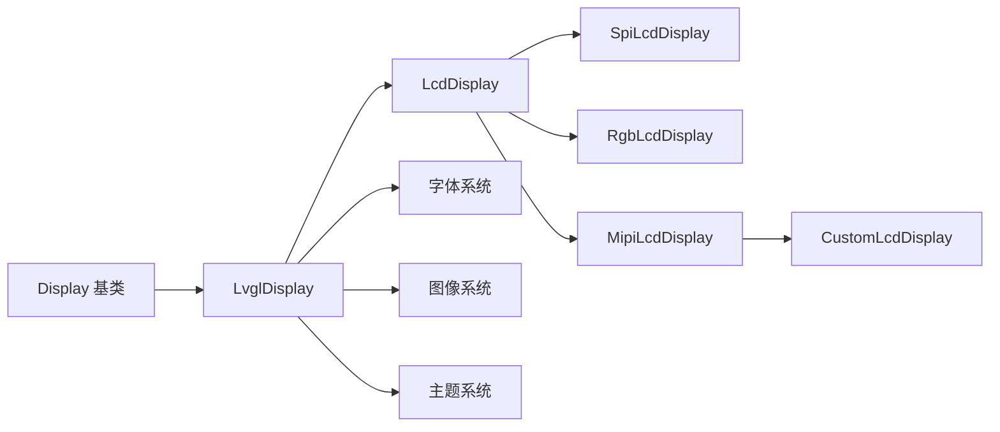

# LVGL图形库集成

<cite>
**本文引用的文件**
- [main/display/display.h](file://main/display/display.h)
- [main/display/display.cc](file://main/display/display.cc)
- [main/display/lvgl_display/lvgl_display.h](file://main/display/lvgl_display/lvgl_display.h)
- [main/display/lvgl_display/lvgl_display.cc](file://main/display/lvgl_display/lvgl_display.cc)
- [main/display/lvgl_display/lvgl_theme.h](file://main/display/lvgl_display/lvgl_theme.h)
- [main/display/lvgl_display/lvgl_theme.cc](file://main/display/lvgl_display/lvgl_theme.cc)
- [main/display/lvgl_display/lvgl_font.h](file://main/display/lvgl_display/lvgl_font.h)
- [main/display/lvgl_display/lvgl_font.cc](file://main/display/lvgl_display/lvgl_font.cc)
- [main/display/lvgl_display/lvgl_image.h](file://main/display/lvgl_display/lvgl_image.h)
- [main/display/lvgl_display/lvgl_image.cc](file://main/display/lvgl_display/lvgl_image.cc)
- [main/display/lcd_display.h](file://main/display/lcd_display.h)
- [main/display/lcd_display.cc](file://main/display/lcd_display.cc)
- [main/boards/waveshare/esp32-s3-touch-lcd-3.49/custom_lcd_display.h](file://main/boards/waveshare/esp32-s3-touch-lcd-3.49/custom_lcd_display.h)
- [main/boards/waveshare/esp32-s3-touch-lcd-3.49/custom_lcd_display.cc](file://main/boards/waveshare/esp32-s3-touch-lcd-3.49/custom_lcd_display.cc)
- [main/boards/waveshare/esp32-s3-rlcd-4.2/custom_lcd_display.h](file://main/boards/waveshare/esp32-s3-rlcd-4.2/custom_lcd_display.h)
- [main/boards/waveshare/esp32-s3-rlcd-4.2/custom_lcd_display.cc](file://main/boards/waveshare/esp32-s3-rlcd-4.2/custom_lcd_display.cc)
- [main/boards/lilygo-t-circle-s3/esp_lcd_gc9d01n.h](file://main/boards/lilygo-t-circle-s3/esp_lcd_gc9d01n.h)
</cite>

## 目录
1. [简介](#简介)
2. [项目结构](#项目结构)
3. [核心组件](#核心组件)
4. [架构总览](#架构总览)
5. [详细组件分析](#详细组件分析)
6. [依赖关系分析](#依赖关系分析)
7. [性能考虑](#性能考虑)
8. [故障排查指南](#故障排查指南)
9. [结论](#结论)
10. [附录](#附录)

## 简介
本文件面向XiaoZhi ESP32项目，系统化梳理LVGL图形库在ESP32平台上的集成方案与配置方法，覆盖显示驱动初始化、缓冲区与刷新机制、主题系统定制、字体与图像处理、性能优化与内存管理，以及控件使用示例与最佳实践。文档基于仓库现有代码进行分析，确保所有说明均可在源码中找到对应实现依据。

## 项目结构
LVGL相关代码主要位于以下路径：
- 显示抽象层：main/display/display.h, main/display/display.cc
- LVGL显示封装：main/display/lvgl_display/*.h/.cc
- LCD显示实现：main/display/lcd_display.{h,cc}
- 各板卡LCD适配：main/boards/*/custom_lcd_display.{h,cc}
- 字体与图像：main/display/lvgl_display/lvgl_font.{h,cc}, lvgl_image.{h,cc}
- 主题系统：main/display/lvgl_display/lvgl_theme.{h,cc}

**图表来源**
- [main/display/display.h](file://main/display/display.h#L28-L61)
- [main/display/lvgl_display/lvgl_display.h](file://main/display/lvgl_display/lvgl_display.h#L15-L50)
- [main/display/lcd_display.h](file://main/display/lcd_display.h#L17-L83)

**章节来源**
- [main/display/display.h](file://main/display/display.h#L1-L88)
- [main/display/lvgl_display/lvgl_display.h](file://main/display/lvgl_display/lvgl_display.h#L1-L54)
- [main/display/lcd_display.h](file://main/display/lcd_display.h#L1-L86)

## 核心组件
- Display基类：定义统一的显示接口与状态管理，派生出无显示占位实现。
- LvglDisplay：继承自Display，封装LVGL对象、状态栏、通知、电源节省模式、截图等功能。
- LcdDisplay及其子类：基于ESP-LVGL-Port对接不同面板（SPI、RGB、MIPI），完成显示初始化、缓冲区设置、刷新回调注册。
- 主题系统：LvglTheme集中管理颜色、字体、图标、背景图、间距等视觉属性；LvglThemeManager负责主题注册与获取。
- 字体系统：支持内置字体与cbin格式字体，提供统一的LvglFont接口。
- 图像系统：支持原始数据、cbin、已分配内存等多种图像封装，提供GIF播放能力。

**章节来源**
- [main/display/display.cc](file://main/display/display.cc#L17-L61)
- [main/display/lvgl_display/lvgl_display.cc](file://main/display/lvgl_display/lvgl_display.cc#L18-L70)
- [main/display/lcd_display.cc](file://main/display/lcd_display.cc#L25-L90)
- [main/display/lvgl_display/lvgl_theme.cc](file://main/display/lvgl_display/lvgl_theme.cc#L1-L31)
- [main/display/lvgl_display/lvgl_font.cc](file://main/display/lvgl_display/lvgl_font.cc#L1-L13)
- [main/display/lvgl_display/lvgl_image.cc](file://main/display/lvgl_display/lvgl_image.cc#L1-L64)

## 架构总览
LVGL在XiaoZhi中的集成采用“抽象层 + LVGL封装 + 具体LCD实现”的分层设计。应用通过Display接口操作UI，具体实现由LcdDisplay家族负责与硬件面板交互，并通过ESP-LVGL-Port完成LVGL初始化、显示对象创建与刷新回调绑定。

**图表来源**
- [main/display/lvgl_display/lvgl_display.cc](file://main/display/lvgl_display/lvgl_display.cc#L18-L41)
- [main/display/lcd_display.cc](file://main/display/lcd_display.cc#L113-L172)
- [main/boards/waveshare/esp32-s3-touch-lcd-3.49/custom_lcd_display.cc](file://main/boards/waveshare/esp32-s3-touch-lcd-3.49/custom_lcd_display.cc#L103-L110)

## 详细组件分析

### 显示驱动与刷新机制
- LVGL初始化与端口配置：在各LCD实现中先调用lv_init，再初始化ESP-LVGL-Port，随后添加显示设备并设置缓冲区大小、双缓冲、DMA、字节交换、避免撕裂等标志。
- 刷新回调：部分自定义实现中直接设置lv_display_set_flush_cb或通过lvgl_port_add_*接口注册回调，回调中对区域旋转、字节序交换、分块传输等进行处理，最后调用lv_disp_flush_ready。
- 缓冲区管理：根据面板类型选择单缓冲或双缓冲，部分实现使用PSRAM作为绘图缓冲，减少DRAM占用；部分自定义实现使用DMA分块传输提升刷新效率。

**图表来源**
- [main/boards/waveshare/esp32-s3-touch-lcd-3.49/custom_lcd_display.cc](file://main/boards/waveshare/esp32-s3-touch-lcd-3.49/custom_lcd_display.cc#L46-L95)

**章节来源**
- [main/display/lcd_display.cc](file://main/display/lcd_display.cc#L113-L172)
- [main/display/lcd_display.cc](file://main/display/lcd_display.cc#L175-L233)
- [main/display/lcd_display.cc](file://main/display/lcd_display.cc#L235-L284)
- [main/boards/waveshare/esp32-s3-touch-lcd-3.49/custom_lcd_display.cc](file://main/boards/waveshare/esp32-s3-touch-lcd-3.49/custom_lcd_display.cc#L98-L110)
- [main/boards/waveshare/esp32-s3-rlcd-4.2/custom_lcd_display.cc](file://main/boards/waveshare/esp32-s3-rlcd-4.2/custom_lcd_display.cc#L77-L108)

### 主题系统定制
- 主题属性：背景色、文本色、聊天背景色、用户/助手/系统气泡色、边框色、低电量提示色、背景图、表情包集合、文本/图标/大图标字体、间距等。
- 主题管理：默认注册light/dark主题，从设置中读取当前主题名称并切换。
- 使用方式：在UI构建阶段，从当前主题获取字体与颜色，设置到屏幕、容器、标签等对象上。

**图表来源**
- [main/display/lvgl_display/lvgl_theme.h](file://main/display/lvgl_display/lvgl_theme.h#L14-L76)
- [main/display/lvgl_display/lvgl_theme.h](file://main/display/lvgl_display/lvgl_theme.h#L79-L94)
- [main/display/lvgl_display/lvgl_theme.cc](file://main/display/lvgl_display/lvgl_theme.cc#L1-L31)

**章节来源**
- [main/display/lcd_display.cc](file://main/display/lcd_display.cc#L25-L63)
- [main/display/lvgl_display/lvgl_theme.cc](file://main/display/lvgl_display/lvgl_theme.cc#L17-L30)

### 字体系统集成
- 内置字体：通过LVGL内置字体声明，在主题中直接使用。
- cbin字体：通过cbin_font_create加载二进制字体，生命周期由LvglCBinFont管理。
- 中文支持：项目未直接提供中文字体文件，但通过cbin字体机制可接入中文字体资源；建议结合脚本工具生成cbin字体并按需加载。

**图表来源**
- [main/display/lvgl_display/lvgl_font.h](file://main/display/lvgl_display/lvgl_font.h#L6-L31)
- [main/display/lvgl_display/lvgl_font.cc](file://main/display/lvgl_display/lvgl_font.cc#L1-L13)

**章节来源**
- [main/display/lvgl_display/lvgl_font.h](file://main/display/lvgl_display/lvgl_font.h#L1-L32)
- [main/display/lvgl_display/lvgl_font.cc](file://main/display/lvgl_display/lvgl_font.cc#L1-L13)
- [main/display/lcd_display.cc](file://main/display/lcd_display.cc#L21-L28)

### 图像处理与显示
- 图像封装：支持原始数据、cbin描述符、已分配内存三种形式；LvglRawImage/LvglAllocatedImage用于不同来源的图像数据；IsGif检测用于区分GIF与静态图。
- GIF播放：通过LvglGif控制器实现动画播放，配合定时器与事件回调清理资源。
- 截图与JPEG导出：在启用CONFIG_LV_USE_SNAPSHOT时，对活动屏幕进行快照，字节序转换后通过回调式编码输出JPEG，避免一次性分配大块内存。

**图表来源**
- [main/display/lvgl_display/lvgl_image.h](file://main/display/lvgl_display/lvgl_image.h#L7-L53)
- [main/display/lvgl_display/lvgl_image.cc](file://main/display/lvgl_display/lvgl_image.cc#L12-L64)

**章节来源**
- [main/display/lvgl_display/lvgl_image.h](file://main/display/lvgl_display/lvgl_image.h#L1-L53)
- [main/display/lvgl_display/lvgl_image.cc](file://main/display/lvgl_display/lvgl_image.cc#L1-L64)
- [main/display/lvgl_display/lvgl_display.cc](file://main/display/lvgl_display/lvgl_display.cc#L230-L270)

### 控件使用示例与最佳实践
- 状态栏与通知：通过状态标签与通知标签实现信息展示，通知在设定时长后自动隐藏；静音/电量/网络图标随状态变化更新。
- 聊天消息：按角色（用户/助手/系统）设置不同气泡样式与对齐方式；系统消息会合并最新一条以减少刷屏；超过最大条数时自动删除最旧消息并滚动至底部。
- 预览图：支持在聊天区插入缩放后的图片预览，自动计算缩放比例并居中显示，点击删除时释放图像资源。
- 电源节省：进入省电模式时切换表情与状态提示，降低功耗。

**图表来源**
- [main/display/lvgl_display/lvgl_display.cc](file://main/display/lvgl_display/lvgl_display.cc#L18-L41)
- [main/display/lvgl_display/lvgl_display.cc](file://main/display/lvgl_display/lvgl_display.cc#L113-L215)

**章节来源**
- [main/display/lvgl_display/lvgl_display.cc](file://main/display/lvgl_display/lvgl_display.cc#L72-L111)
- [main/display/lvgl_display/lvgl_display.cc](file://main/display/lvgl_display/lvgl_display.cc#L113-L215)
- [main/display/lcd_display.cc](file://main/display/lcd_display.cc#L504-L698)
- [main/display/lcd_display.cc](file://main/display/lcd_display.cc#L700-L782)

## 依赖关系分析
- 抽象层与封装层：Display为抽象接口，LvglDisplay继承之；LcdDisplay进一步继承，形成多态体系。
- 第三方库：ESP-LVGL-Port负责LVGL与硬件面板的桥接；ESP-IDF的PSRAM、定时器、电源管理等模块被广泛使用。
- 板级适配：不同LCD面板通过各自的custom_lcd_display实现刷新回调与缓冲策略，保持上层UI一致。

**图表来源**
- [main/display/display.h](file://main/display/display.h#L28-L61)
- [main/display/lvgl_display/lvgl_display.h](file://main/display/lvgl_display/lvgl_display.h#L15-L50)
- [main/display/lcd_display.h](file://main/display/lcd_display.h#L17-L83)

**章节来源**
- [main/display/display.h](file://main/display/display.h#L1-L88)
- [main/display/lvgl_display/lvgl_display.h](file://main/display/lvgl_display/lvgl_display.h#L1-L54)
- [main/display/lcd_display.h](file://main/display/lcd_display.h#L1-L86)

## 性能考虑
- 缓冲策略
  - 单/双缓冲：根据面板能力选择，双缓冲可避免撕裂但增加内存占用。
  - DMA分块传输：将大区域分块发送，降低单次DMA压力，提高稳定性。
  - PSRAM使用：在具备PSRAM时启用图像缓存与绘图缓冲，减少DRAM占用。
- 刷新优化
  - 避免撕裂：开启avoid_tearing或使用全刷新模式。
  - 字节序交换：在回调中进行，减少LVGL内部转换开销。
  - 区域刷新：仅刷新变化区域，减少面板写入次数。
- 内存管理
  - 已分配图像：在析构时释放堆内存，防止泄漏。
  - 回调式JPEG编码：避免一次性分配大块内存，降低峰值内存。
- 电源管理
  - 更新期间获取电源锁，保证刷新过程稳定，结束后及时释放。

**章节来源**
- [main/display/lcd_display.cc](file://main/display/lcd_display.cc#L116-L126)
- [main/boards/waveshare/esp32-s3-touch-lcd-3.49/custom_lcd_display.cc](file://main/boards/waveshare/esp32-s3-touch-lcd-3.49/custom_lcd_display.cc#L71-L95)
- [main/display/lvgl_display/lvgl_display.cc](file://main/display/lvgl_display/lvgl_display.cc#L230-L270)

## 故障排查指南
- 显示初始化失败
  - 检查lvgl_port_add_*返回值，确认面板句柄与IO句柄有效。
  - 核对缓冲区大小、颜色格式、旋转参数与面板实际配置一致。
- 刷新异常/撕裂
  - 确认双缓冲与避免撕裂标志设置正确。
  - 若使用软件旋转，评估性能影响并考虑改用硬件旋转。
- 内存不足
  - 在PSRAM可用时启用PSRAM缓冲与图像缓存。
  - 对大图采用缩放策略，避免一次性加载超大图像。
- 字体/图像不生效
  - 确认cbin字体/图像描述符创建成功，且在主题中正确设置。
  - 检查图像信息获取流程，避免空指针与尺寸异常。
- 通知/状态栏不更新
  - 确保UI已初始化后再设置状态与通知。
  - 检查定时器创建与启动逻辑，避免重复创建导致资源泄漏。

**章节来源**
- [main/display/lcd_display.cc](file://main/display/lcd_display.cc#L113-L172)
- [main/display/lvgl_display/lvgl_image.cc](file://main/display/lvgl_display/lvgl_image.cc#L37-L46)
- [main/display/lvgl_display/lvgl_display.cc](file://main/display/lvgl_display/lvgl_display.cc#L72-L88)

## 结论
XiaoZhi项目在ESP32上实现了较为完整的LVGL图形栈集成：抽象层清晰、封装层完备、具体LCD实现灵活适配多款面板。通过主题系统统一管理视觉元素，通过字体与图像系统支持多样化内容呈现，并在性能与内存方面提供了多项优化策略。建议后续工作围绕中文字体资源接入、更丰富的主题扩展与跨板卡的通用性增强展开。

## 附录
- 配置要点
  - LVGL初始化：先lv_init，再lvgl_port_init，最后添加显示设备。
  - 缓冲与刷新：根据面板能力选择单/双缓冲与DMA分块传输；必要时启用避免撕裂。
  - 主题与字体：在UI构建阶段从主题获取颜色与字体，确保一致性。
  - 图像与GIF：优先使用cbin描述符；大图缩放显示；注意资源释放。
- 最佳实践
  - UI初始化时机：在Display完全就绪后再调用SetupUI，避免对象创建失败。
  - 动画与刷新：在刷新期间获取电源锁，结束后释放，保证稳定性。
  - 日志与调试：利用ESP_LOG输出关键路径日志，便于定位问题。