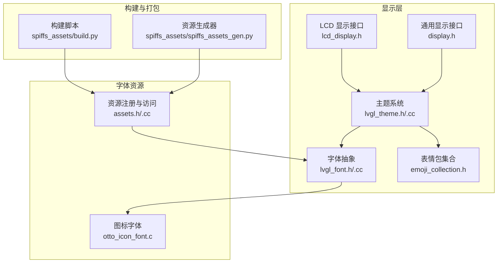
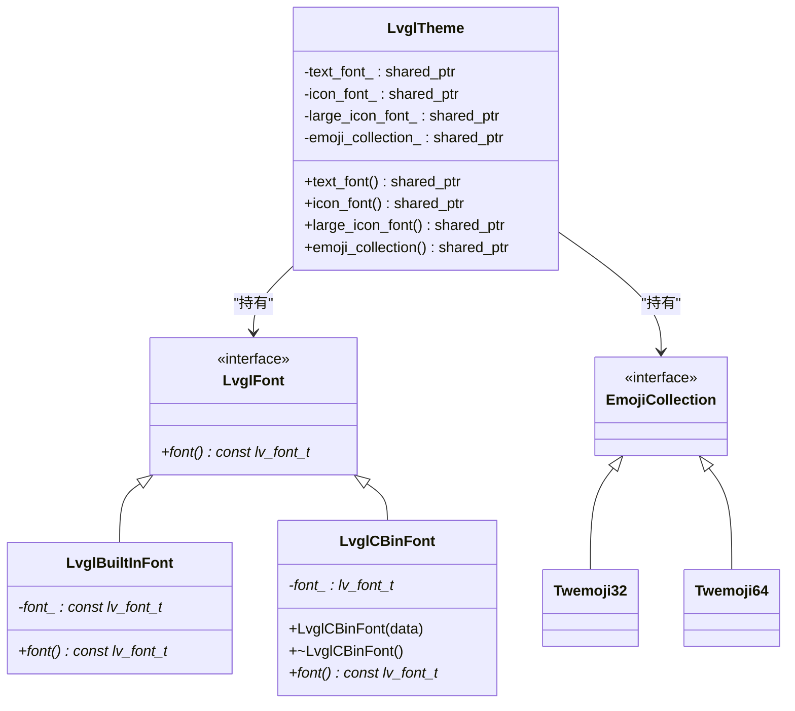
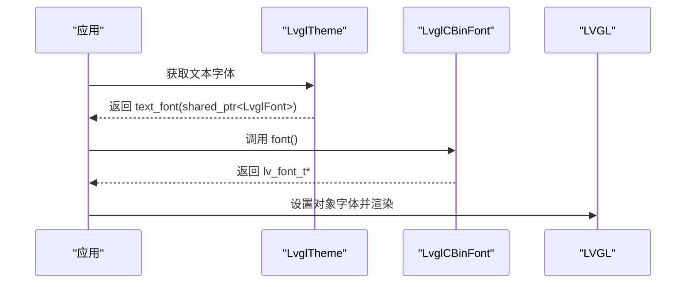
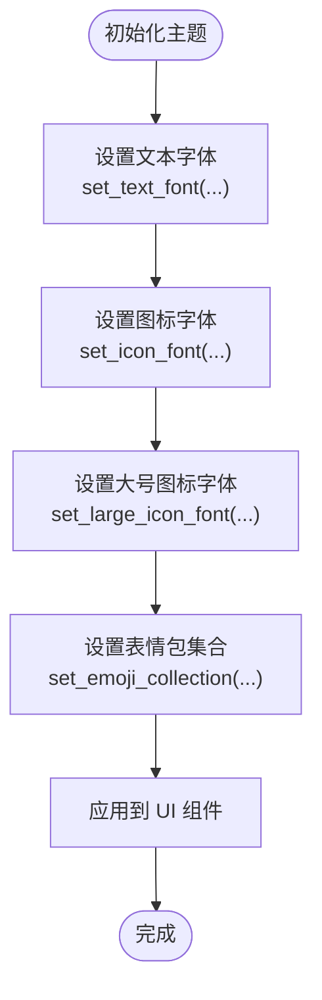
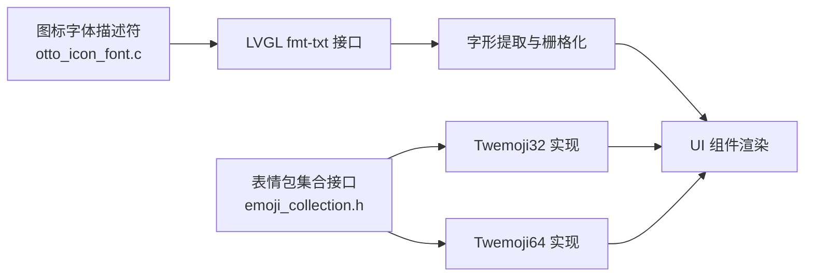
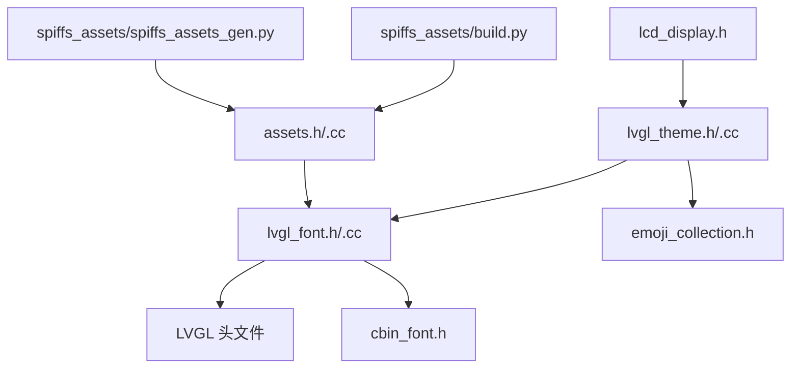

# 字体管理系统

<cite>
**本文引用的文件**
- [main/display/lvgl_display/lvgl_font.h](file://main/display/lvgl_display/lvgl_font.h)
- [main/display/lvgl_display/lvgl_font.cc](file://main/display/lvgl_display/lvgl_font.cc)
- [main/display/lvgl_display/lvgl_theme.h](file://main/display/lvgl_display/lvgl_theme.h)
- [main/display/lvgl_display/lvgl_theme.cc](file://main/display/lvgl_display/lvgl_theme.cc)
- [main/display/lvgl_display/emoji_collection.h](file://main/display/lvgl_display/emoji_collection.h)
- [main/boards/otto-robot/otto_icon_font.c](file://main/boards/otto-robot/otto_icon_font.c)
- [main/boards/electron-bot/otto_icon_font.c](file://main/boards/electron-bot/otto_icon_font.c)
- [main/display/lcd_display.h](file://main/display/lcd_display.h)
- [main/display/display.h](file://main/display/display.h)
- [main/assets.h](file://main/assets.h)
- [main/assets.cc](file://main/assets.cc)
- [scripts/spiffs_assets/build.py](file://scripts/spiffs_assets/build.py)
- [scripts/spiffs_assets/spiffs_assets_gen.py](file://scripts/spiffs_assets/spiffs_assets_gen.py)
</cite>

## 目录
1. [简介](#简介)
2. [项目结构](#项目结构)
3. [核心组件](#核心组件)
4. [架构总览](#架构总览)
5. [详细组件分析](#详细组件分析)
6. [依赖关系分析](#依赖关系分析)
7. [性能考虑](#性能考虑)
8. [故障排查指南](#故障排查指南)
9. [结论](#结论)
10. [附录](#附录)

## 简介
本文件面向 XiaoZhi ESP32 项目的字体管理系统，系统基于 LVGL 图形库与 CBIN 字体格式，提供统一的字体抽象接口、主题化的字体配置、图标字体与表情包集合，并通过 SPIFFS 资源打包工具链完成字体资源的打包与部署。文档重点涵盖以下方面：
- 字体系统架构与多语言支持机制
- 字体资源组织（中文字体、英文字体、符号字体）
- 字体加载与缓存策略（动态加载、内存管理、字体预热）
- 字体渲染引擎实现原理（字形提取、栅格化、抗锯齿）
- 字体配置参数（字号、行高、字距、字重）
- 本地化支持与回退机制
- 字体资源压缩与优化技巧、自定义字体集成方法

## 项目结构
围绕字体系统的关键目录与文件如下：
- 显示层与 LVGL 集成：lvgl_font.*、lvgl_theme.*、emoji_collection.*
- 字体资源：otto_icon_font.c（图标字体）、表情包集合
- LCD 显示与字体使用：lcd_display.h、display.h
- 资源打包与构建：spiffs_assets 相关脚本

图表来源
- [main/display/lvgl_display/lvgl_theme.h](file://main/display/lvgl_display/lvgl_theme.h#L1-L95)
- [main/display/lvgl_display/lvgl_font.h](file://main/display/lvgl_display/lvgl_font.h#L1-L32)
- [main/display/lvgl_display/emoji_collection.h](file://main/display/lvgl_display/emoji_collection.h#L1-L40)
- [main/display/lcd_display.h](file://main/display/lcd_display.h#L1-L40)
- [main/display/display.h](file://main/display/display.h#L1-L40)
- [main/boards/otto-robot/otto_icon_font.c](file://main/boards/otto-robot/otto_icon_font.c#L62-L108)
- [main/assets.h](file://main/assets.h#L1-L120)
- [main/assets.cc](file://main/assets.cc#L1-L200)
- [scripts/spiffs_assets/build.py](file://scripts/spiffs_assets/build.py#L1-L200)
- [scripts/spiffs_assets/spiffs_assets_gen.py](file://scripts/spiffs_assets/spiffs_assets_gen.py#L1-L200)

章节来源
- [main/display/lvgl_display/lvgl_font.h](file://main/display/lvgl_display/lvgl_font.h#L1-L32)
- [main/display/lvgl_display/lvgl_theme.h](file://main/display/lvgl_display/lvgl_theme.h#L1-L95)
- [main/display/lvgl_display/emoji_collection.h](file://main/display/lvgl_display/emoji_collection.h#L1-L40)
- [main/display/lcd_display.h](file://main/display/lcd_display.h#L1-L40)
- [main/display/display.h](file://main/display/display.h#L1-L40)
- [main/boards/otto-robot/otto_icon_font.c](file://main/boards/otto-robot/otto_icon_font.c#L62-L108)
- [main/assets.h](file://main/assets.h#L1-L120)
- [main/assets.cc](file://main/assets.cc#L1-L200)
- [scripts/spiffs_assets/build.py](file://scripts/spiffs_assets/build.py#L1-L200)
- [scripts/spiffs_assets/spiffs_assets_gen.py](file://scripts/spiffs_assets/spiffs_assets_gen.py#L1-L200)

## 核心组件
- 字体抽象接口：统一 LVGL 字体对象的访问方式，支持内置字体与 CBIN 字体两种来源。
- 主题系统：集中管理颜色、字体、表情包等 UI 属性，支持按主题切换。
- 表情包集合：提供表情包的尺寸化实现（如 32/64），便于在不同分辨率下适配。
- 图标字体：以 otto_icon_font.c 为例，展示 LVGL 图标字体的描述符与缓存配置。
- 资源打包：通过构建脚本将字体与资源打包到 SPIFFS，供运行时加载。

章节来源
- [main/display/lvgl_display/lvgl_font.h](file://main/display/lvgl_display/lvgl_font.h#L6-L31)
- [main/display/lvgl_display/lvgl_font.cc](file://main/display/lvgl_display/lvgl_font.cc#L1-L13)
- [main/display/lvgl_display/lvgl_theme.h](file://main/display/lvgl_display/lvgl_theme.h#L14-L76)
- [main/display/lvgl_display/emoji_collection.h](file://main/display/lvgl_display/emoji_collection.h#L12-L36)
- [main/boards/otto-robot/otto_icon_font.c](file://main/boards/otto-robot/otto_icon_font.c#L72-L108)

## 架构总览
字体系统采用“抽象接口 + 主题配置 + 资源打包”的分层架构：
- 抽象层：LvglFont 提供统一的字体访问接口，屏蔽内置与 CBIN 字体差异。
- 配置层：LvglTheme 将文本字体、图标字体、大号图标字体与表情包集合进行主题化管理。
- 渲染层：LVGL 使用字体描述符进行字形提取与栅格化；图标字体通过 LVGL 的 fmt-txt 接口渲染。
- 资源层：assets 与 spiffs_assets 负责资源注册与打包，确保运行时可按需加载。

图表来源
- [main/display/lvgl_display/lvgl_font.h](file://main/display/lvgl_display/lvgl_font.h#L6-L31)
- [main/display/lvgl_display/lvgl_theme.h](file://main/display/lvgl_display/lvgl_theme.h#L14-L76)
- [main/display/lvgl_display/emoji_collection.h](file://main/display/lvgl_display/emoji_collection.h#L12-L36)

## 详细组件分析

### 字体抽象与 CBIN 字体加载
- LvglFont 定义统一接口，派生类分别封装内置字体与 CBIN 字体。
- LvglCBinFont 通过 cbin_font_create 加载 CBIN 格式字体数据，生命周期由析构函数管理。
- 该设计允许运行时动态切换字体来源，提升灵活性与可扩展性。

图表来源
- [main/display/lvgl_display/lvgl_font.cc](file://main/display/lvgl_display/lvgl_font.cc#L5-L13)
- [main/display/lvgl_display/lvgl_font.h](file://main/display/lvgl_display/lvgl_font.h#L23-L31)
- [main/display/lvgl_display/lvgl_theme.h](file://main/display/lvgl_display/lvgl_theme.h#L32-L50)

章节来源
- [main/display/lvgl_display/lvgl_font.h](file://main/display/lvgl_display/lvgl_font.h#L6-L31)
- [main/display/lvgl_display/lvgl_font.cc](file://main/display/lvgl_display/lvgl_font.cc#L1-L13)

### 主题化字体配置与使用
- LvglTheme 持有文本字体、图标字体、大号图标字体与表情包集合，提供 getter/setter。
- 主题管理器支持注册与获取主题，便于多主题场景切换。
- 在 LCD 显示中，可通过主题字体计算控件尺寸（例如根据 line_height 设置弹窗高度）。

图表来源
- [main/display/lvgl_display/lvgl_theme.h](file://main/display/lvgl_display/lvgl_theme.h#L18-L50)
- [main/display/lvgl_display/lvgl_theme.cc](file://main/display/lvgl_display/lvgl_theme.cc#L17-L31)
- [main/display/lcd_display.h](file://main/display/lcd_display.h#L1-L40)

章节来源
- [main/display/lvgl_display/lvgl_theme.h](file://main/display/lvgl_display/lvgl_theme.h#L14-L76)
- [main/display/lvgl_display/lvgl_theme.cc](file://main/display/lvgl_display/lvgl_theme.cc#L1-L31)
- [main/display/lcd_display.h](file://main/display/lcd_display.h#L1-L40)

### 图标字体与表情包集合
- otto_icon_font.c 展示了 LVGL 图标字体的完整描述符，包含位图、字形描述、字符映射、缓存等字段。
- 表情包集合通过 EmojiCollection 接口抽象，Twemoji32/Twemoji64 提供不同尺寸的表情包实现。
- LCD 显示头文件中包含 font_emoji.h，表明可在 LCD 场景下直接使用表情字体或表情包。

图表来源
- [main/boards/otto-robot/otto_icon_font.c](file://main/boards/otto-robot/otto_icon_font.c#L72-L108)
- [main/display/lvgl_display/emoji_collection.h](file://main/display/lvgl_display/emoji_collection.h#L12-L36)
- [main/display/lcd_display.h](file://main/display/lcd_display.h#L1-L15)

章节来源
- [main/boards/otto-robot/otto_icon_font.c](file://main/boards/otto-robot/otto_icon_font.c#L62-L108)
- [main/display/lvgl_display/emoji_collection.h](file://main/display/lvgl_display/emoji_collection.h#L12-L36)
- [main/display/lcd_display.h](file://main/display/lcd_display.h#L1-L15)

### 字体资源组织与本地化支持
- 字体资源通过 assets 注册与访问，结合 spiffs_assets 脚本打包至 SPIFFS。
- 本地化资源位于 locales 目录，虽然当前未直接列出字体文件，但可据此扩展多语言字体选择与回退策略。
- 建议按语言区域维护独立字体集，若缺失字符则回退到默认字体或通用字体。

章节来源
- [main/assets.h](file://main/assets.h#L1-L120)
- [main/assets.cc](file://main/assets.cc#L1-L200)
- [scripts/spiffs_assets/build.py](file://scripts/spiffs_assets/build.py#L1-L200)
- [scripts/spiffs_assets/spiffs_assets_gen.py](file://scripts/spiffs_assets/spiffs_assets_gen.py#L1-L200)

## 依赖关系分析
- 字体抽象依赖 LVGL 头文件，CBIN 字体加载依赖 cbin_font.h。
- 主题系统依赖字体抽象与表情包集合，LCD 显示依赖主题与字体。
- 资源打包脚本依赖 assets 注册表，确保字体与图像资源被正确打包。

图表来源
- [main/display/lvgl_display/lvgl_font.h](file://main/display/lvgl_display/lvgl_font.h#L1-L10)
- [main/display/lvgl_display/lvgl_font.cc](file://main/display/lvgl_display/lvgl_font.cc#L1-L3)
- [main/display/lvgl_display/lvgl_theme.h](file://main/display/lvgl_display/lvgl_theme.h#L1-L12)
- [main/display/lvgl_display/emoji_collection.h](file://main/display/lvgl_display/emoji_collection.h#L1-L12)
- [main/display/lcd_display.h](file://main/display/lcd_display.h#L1-L10)
- [main/assets.h](file://main/assets.h#L1-L40)
- [scripts/spiffs_assets/build.py](file://scripts/spiffs_assets/build.py#L1-L40)
- [scripts/spiffs_assets/spiffs_assets_gen.py](file://scripts/spiffs_assets/spiffs_assets_gen.py#L1-L40)

章节来源
- [main/display/lvgl_display/lvgl_font.h](file://main/display/lvgl_display/lvgl_font.h#L1-L10)
- [main/display/lvgl_display/lvgl_font.cc](file://main/display/lvgl_display/lvgl_font.cc#L1-L3)
- [main/display/lvgl_display/lvgl_theme.h](file://main/display/lvgl_display/lvgl_theme.h#L1-L12)
- [main/display/lvgl_display/emoji_collection.h](file://main/display/lvgl_display/emoji_collection.h#L1-L12)
- [main/display/lcd_display.h](file://main/display/lcd_display.h#L1-L10)
- [main/assets.h](file://main/assets.h#L1-L40)
- [scripts/spiffs_assets/build.py](file://scripts/spiffs_assets/build.py#L1-L40)
- [scripts/spiffs_assets/spiffs_assets_gen.py](file://scripts/spiffs_assets/spiffs_assets_gen.py#L1-L40)

## 性能考虑
- 动态加载与缓存
  - CBIN 字体通过 cbin_font_create 创建后可复用，避免重复解码。
  - 图标字体使用 LVGL 内置缓存结构，减少频繁查询开销。
- 内存管理
  - 析构函数负责释放字体资源，防止内存泄漏。
  - 表情包集合按需加载，避免一次性占用过多 RAM。
- 字体预热
  - 在应用启动阶段预热常用字符集，降低首帧延迟。
- 渲染优化
  - 合理设置字体大小与行高，减少绘制区域与像素填充量。
  - 对于低分辨率屏幕，优先使用较小字号与紧凑行距。

## 故障排查指南
- 字体不生效
  - 检查主题是否正确设置了文本/图标字体。
  - 确认 CBIN 字体数据指针有效且未被释放。
- 显示异常或乱码
  - 核对字符编码与字体字符映射是否匹配。
  - 检查 LVGL 版本兼容性（图标字体描述符字段可能因版本而异）。
- 内存不足
  - 减少同时加载的字体数量与尺寸。
  - 使用资源打包工具控制 SPIFFS 分区大小与资源密度。
- 回退机制
  - 当目标语言缺少对应字体时，回退到通用字体或默认字体。

章节来源
- [main/display/lvgl_display/lvgl_font.cc](file://main/display/lvgl_display/lvgl_font.cc#L9-L13)
- [main/display/lvgl_display/lvgl_theme.h](file://main/display/lvgl_display/lvgl_theme.h#L32-L50)
- [main/boards/otto-robot/otto_icon_font.c](file://main/boards/otto-robot/otto_icon_font.c#L72-L108)

## 结论
XiaoZhi ESP32 的字体系统以 LVGL 为核心，通过抽象接口与主题化配置实现了灵活的字体管理与渲染能力。结合 CBIN 字体与图标字体，系统能够满足多语言、多分辨率与多场景的显示需求。配合资源打包工具链，可实现高效的字体资源部署与运行时加载。建议在实际项目中进一步完善多语言字体选择与回退策略，并持续优化内存占用与渲染性能。

## 附录

### 字体配置参数指南
- 字号与行高
  - 通过主题字体的 line_height 控制行间距，用于布局计算与控件尺寸设定。
- 字距与字重
  - 字距通常由字体自身 kerning 数据决定；字重可通过不同字体族或变体实现。
- 抗锯齿
  - LVGL 支持子像素渲染（subpx），可根据设备分辨率与显示效果调整。
- 行为建议
  - 在小屏设备上优先使用紧凑行距与适中字号，平衡可读性与空间利用率。

章节来源
- [main/display/lvgl_display/lvgl_theme.h](file://main/display/lvgl_display/lvgl_theme.h#L32-L50)
- [main/boards/otto-robot/otto_icon_font.c](file://main/boards/otto-robot/otto_icon_font.c#L102-L108)

### 字体资源压缩与优化技巧
- CBIN 格式
  - 使用 CBIN 存储字体数据，减少运行时解码开销。
- 资源打包
  - 通过 spiffs_assets 脚本将字体与图像资源打包到 SPIFFS，按需加载。
- 字体裁剪
  - 仅打包所需字符集，减小体积；对多语言场景按区域裁剪。
- 缓存策略
  - 利用 LVGL 内置缓存与图标字体缓存，避免重复查询。

章节来源
- [main/display/lvgl_display/lvgl_font.cc](file://main/display/lvgl_display/lvgl_font.cc#L5-L13)
- [main/assets.h](file://main/assets.h#L1-L120)
- [main/assets.cc](file://main/assets.cc#L1-L200)
- [scripts/spiffs_assets/build.py](file://scripts/spiffs_assets/build.py#L1-L200)
- [scripts/spiffs_assets/spiffs_assets_gen.py](file://scripts/spiffs_assets/spiffs_assets_gen.py#L1-L200)

### 自定义字体集成方法
- 导入字体
  - 将字体文件转换为 CBIN 或 LVGL 支持的格式，注册到资源系统。
- 配置主题
  - 通过主题 setter 设置自定义字体，确保 UI 组件使用新字体。
- 测试验证
  - 在目标设备上验证渲染效果与性能表现，必要时调整字号与行高。

章节来源
- [main/display/lvgl_display/lvgl_font.h](file://main/display/lvgl_display/lvgl_font.h#L23-L31)
- [main/display/lvgl_display/lvgl_theme.h](file://main/display/lvgl_display/lvgl_theme.h#L48-L50)
- [main/assets.h](file://main/assets.h#L1-L120)