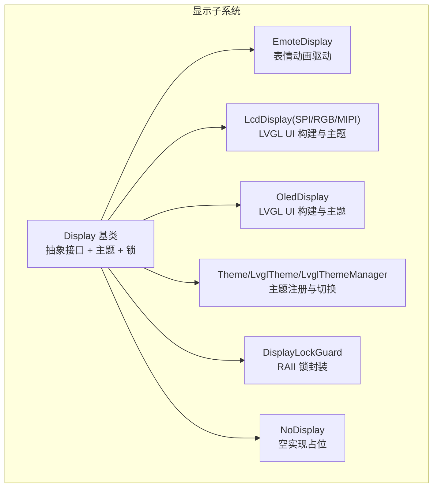
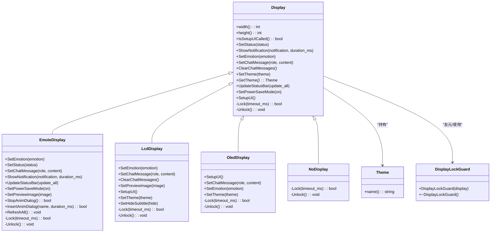
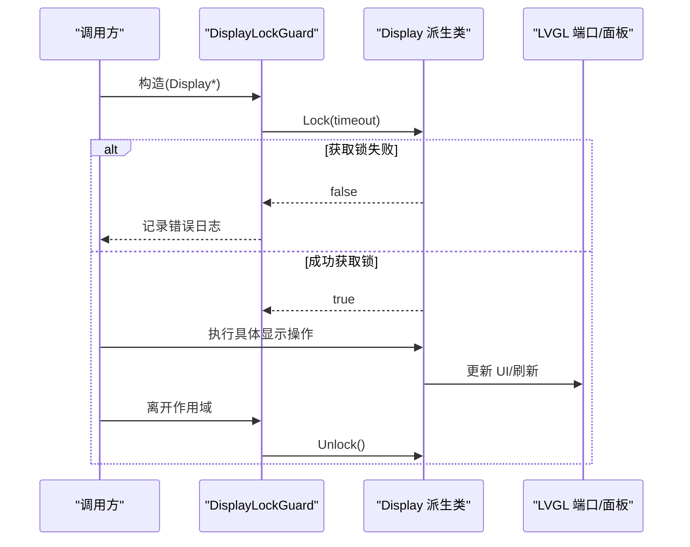
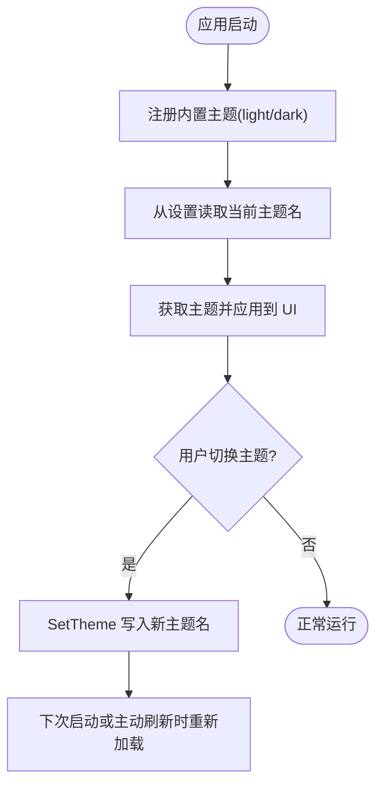
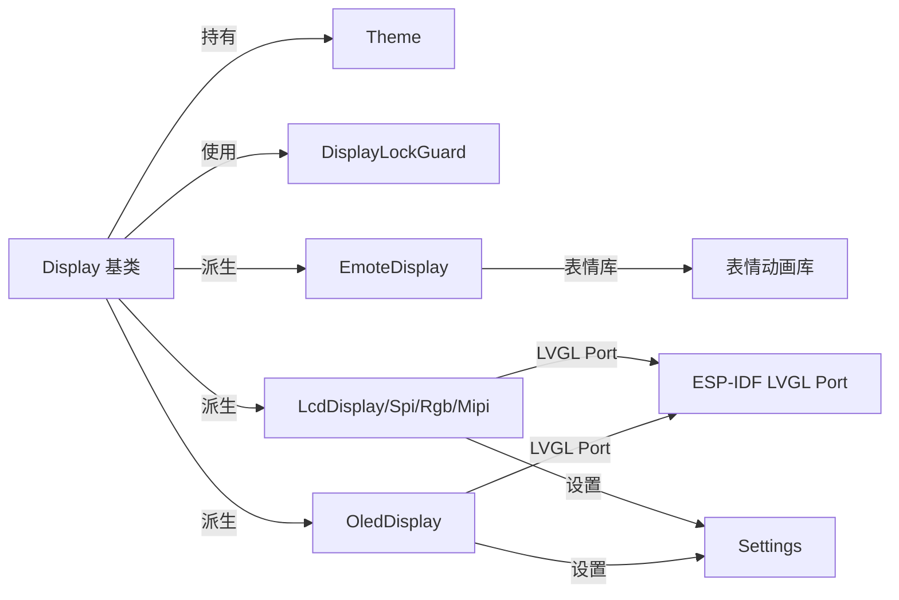

# 显示架构设计

<cite>
**本文引用的文件**
- [main/display/display.h](file://main/display/display.h)
- [main/display/display.cc](file://main/display/display.cc)
- [main/display/emote_display.h](file://main/display/emote_display.h)
- [main/display/emote_display.cc](file://main/display/emote_display.cc)
- [main/display/lcd_display.h](file://main/display/lcd_display.h)
- [main/display/lcd_display.cc](file://main/display/lcd_display.cc)
- [main/display/oled_display.h](file://main/display/oled_display.h)
- [main/display/oled_display.cc](file://main/display/oled_display.cc)
</cite>

## 目录
1. [引言](#引言)
2. [项目结构](#项目结构)
3. [核心组件](#核心组件)
4. [架构总览](#架构总览)
5. [详细组件分析](#详细组件分析)
6. [依赖关系分析](#依赖关系分析)
7. [性能考虑](#性能考虑)
8. [故障排查指南](#故障排查指南)
9. [结论](#结论)
10. [附录：Display 类完整 API 参考](#附录display-类完整-api-参考)

## 引言
本文件面向 XiaoZhi ESP32 项目，系统性梳理显示子系统的架构设计与实现要点，重点覆盖以下方面：
- Display 基类的设计理念与抽象接口
- 显示系统的整体架构模式（多态 + 主题 + 锁机制）
- DisplayLockGuard 线程安全与资源保护策略
- NoDisplay 空实现的设计目的与使用场景
- 主题系统（Theme/LvglTheme/LvglThemeManager）的架构与主题切换机制
- Display 类的完整 API 参考（状态设置、通知显示、情感表达、聊天消息等）
- 显示系统的初始化流程与生命周期管理
- 显示驱动扩展指南与自定义实现示例

## 项目结构
显示子系统位于 main/display 目录，采用“基类 + 多种具体显示实现”的分层设计，并通过 LVGL 进行图形渲染。核心文件如下：
- 基类与通用设施：display.h、display.cc
- 表情动画显示：emote_display.h、emote_display.cc
- LCD 显示（SPI/RGB/MIPI）：lcd_display.h、lcd_display.cc
- OLED 显示：oled_display.h、oled_display.cc

图表来源
- [main/display/display.h](file://main/display/display.h#L28-L87)
- [main/display/emote_display.h](file://main/display/emote_display.h#L12-L42)
- [main/display/lcd_display.h](file://main/display/lcd_display.h#L17-L85)
- [main/display/oled_display.h](file://main/display/oled_display.h#L10-L41)

章节来源
- [main/display/display.h](file://main/display/display.h#L1-L88)
- [main/display/display.cc](file://main/display/display.cc#L1-L61)

## 核心组件
- Display 基类：定义统一的显示抽象接口，包含状态设置、通知显示、情感表达、聊天消息、主题设置、电源省电模式、UI 初始化标记等；并声明受保护的锁接口 Lock/Unlock，供派生类实现线程安全。
- Theme 抽象主题：提供主题名称访问能力，作为样式管理的基础。
- DisplayLockGuard：基于 RAII 的显示锁封装，构造时尝试获取锁，析构时自动释放，避免显式加解锁带来的遗漏风险。
- NoDisplay：空实现，不进行任何实际绘制，用于无显示硬件或调试场景。

章节来源
- [main/display/display.h](file://main/display/display.h#L18-L87)
- [main/display/display.cc](file://main/display/display.cc#L17-L61)

## 架构总览
显示系统采用“基类抽象 + 多种驱动实现 + 主题管理 + 锁保护”的架构模式：
- 基类 Display 提供统一接口与资源保护（DisplayLockGuard），派生类负责具体面板与 LVGL 集成。
- 主题系统通过 LvglTheme/LvglThemeManager 注册与切换，支持浅色/深色等主题。
- EmoteDisplay 使用表情动画库进行动态展示；LCD/OLED 派生类基于 LVGL 构建 UI 并支持主题切换。
- 生命周期管理：构造函数完成基本初始化；SetupUI 在应用初始化阶段调用，完成 LVGL 对象创建与布局；析构负责资源回收。

图表来源
- [main/display/display.h](file://main/display/display.h#L28-L87)
- [main/display/emote_display.h](file://main/display/emote_display.h#L12-L42)
- [main/display/lcd_display.h](file://main/display/lcd_display.h#L17-L85)
- [main/display/oled_display.h](file://main/display/oled_display.h#L10-L41)

## 详细组件分析

### Display 基类与抽象接口
- 设计理念
  - 通过纯虚锁接口 Lock/Unlock 将线程安全责任下沉到具体驱动，确保 LVGL 或面板操作的原子性。
  - 统一的 UI 初始化标记 IsSetupUICalled，避免重复初始化。
  - 主题管理通过 SetTheme 持有 Theme 指针，并持久化主题名到设置中。
- 关键接口
  - 状态与通知：SetStatus、ShowNotification
  - 情感表达：SetEmotion
  - 聊天消息：SetChatMessage、ClearChatMessages
  - 主题：SetTheme、GetTheme
  - 电源：SetPowerSaveMode
  - UI：SetupUI、UpdateStatusBar
- 默认行为
  - 基类默认实现通常仅记录日志，具体由派生类覆盖。

章节来源
- [main/display/display.h](file://main/display/display.h#L28-L61)
- [main/display/display.cc](file://main/display/display.cc#L23-L60)

### DisplayLockGuard 锁机制
- 实现原理
  - 构造时调用 Display::Lock(timeout)，若超时则记录错误日志；析构时调用 Display::Unlock。
  - 通过 RAII 将“获取/释放”绑定到对象生命周期，避免异常路径导致的死锁。
- 线程安全与资源保护策略
  - 所有需要修改 LVGL 对象或面板缓冲区的操作均应在 DisplayLockGuard 作用域内执行。
  - 不同驱动对 Lock 的实现不同：例如 LcdDisplay/OledDisplay 委托给 LVGL 端口锁，EmoteDisplay 返回 true（无并发冲突）。
- 使用建议
  - 在派生类的每个公开方法内部，优先在方法开头构造 DisplayLockGuard，确保后续所有 UI 修改都在锁保护下进行。

图表来源
- [main/display/display.h](file://main/display/display.h#L64-L77)
- [main/display/lcd_display.cc](file://main/display/lcd_display.cc#L345-L351)
- [main/display/oled_display.cc](file://main/display/oled_display.cc#L138-L144)
- [main/display/emote_display.cc](file://main/display/emote_display.cc#L214-L222)

章节来源
- [main/display/display.h](file://main/display/display.h#L64-L77)
- [main/display/lcd_display.cc](file://main/display/lcd_display.cc#L345-L351)
- [main/display/oled_display.cc](file://main/display/oled_display.cc#L138-L144)
- [main/display/emote_display.cc](file://main/display/emote_display.cc#L214-L222)

### NoDisplay 空实现
- 设计目的
  - 在无显示硬件或测试环境中提供零成本占位，避免条件编译散落各处。
- 使用场景
  - 开发调试阶段快速运行；某些设备仅支持音频输出，不需要屏幕。
- 行为特征
  - Lock 总是返回 true，Unlock 为空实现，不会产生任何副作用。

章节来源
- [main/display/display.h](file://main/display/display.h#L79-L85)

### 主题系统（Theme/LvglTheme/LvglThemeManager）
- 架构设计
  - Theme 抽象主题：提供 name() 访问器。
  - LvglTheme：承载颜色、字体、间距等样式属性。
  - LvglThemeManager：单例主题管理器，负责注册与按名称获取主题。
- 主题切换机制
  - LcdDisplay/OledDisplay 在构造时注册内置主题（如 light/dark），从设置中加载当前主题名并应用。
  - SetTheme 将传入主题保存到 current_theme_，并将主题名写入设置，实现持久化。
- 样式管理
  - UI 构建时根据当前主题设置文本颜色、背景色、气泡色、图标字体等。
  - 支持不同分辨率/尺寸的 UI 布局（如 OLED 的 128x64/128x32 两套布局）。

图表来源
- [main/display/lcd_display.cc](file://main/display/lcd_display.cc#L25-L63)
- [main/display/lcd_display.cc](file://main/display/lcd_display.cc#L65-L90)
- [main/display/lcd_display.cc](file://main/display/lcd_display.cc#L504-L698)
- [main/display/oled_display.cc](file://main/display/oled_display.cc#L20-L38)
- [main/display/oled_display.cc](file://main/display/oled_display.cc#L83-L96)

章节来源
- [main/display/lcd_display.cc](file://main/display/lcd_display.cc#L25-L63)
- [main/display/lcd_display.cc](file://main/display/lcd_display.cc#L65-L90)
- [main/display/lcd_display.cc](file://main/display/lcd_display.cc#L504-L698)
- [main/display/oled_display.cc](file://main/display/oled_display.cc#L20-L38)
- [main/display/oled_display.cc](file://main/display/oled_display.cc#L83-L96)

### EmoteDisplay 表情动画显示
- 功能特性
  - 基于表情动画库，支持设置情感、系统通知、聊天消息、预览图、动画对话框插入与停止、全量刷新等。
  - 通过面板 IO 回调与 flush 完成像素数据传输。
- 线程安全
  - Lock/Unlock 返回 true，表示无需额外互斥（动画库内部已处理并发）。
- 使用注意
  - 预览图不支持直接设置像素图，需通过专用接口传递图像对象。

章节来源
- [main/display/emote_display.h](file://main/display/emote_display.h#L12-L42)
- [main/display/emote_display.cc](file://main/display/emote_display.cc#L118-L135)
- [main/display/emote_display.cc](file://main/display/emote_display.cc#L137-L184)
- [main/display/emote_display.cc](file://main/display/emote_display.cc#L214-L222)
- [main/display/emote_display.cc](file://main/display/emote_display.cc#L224-L248)

### LCD 显示（SPI/RGB/MIPI）
- 初始化流程
  - 构造函数：注册主题、从设置加载主题、创建预览图定时器。
  - 各子类（Spi/Rgb/Mipi）在各自构造中完成面板初始化、LVGL 端口初始化与显示添加。
  - SetupUI：在应用初始化阶段调用，构建 UI 层级（顶部状态栏、内容区、底部弹窗等），并根据主题设置样式。
- 聊天消息与预览图
  - SetChatMessage：支持用户/助手/系统三类消息，自动滚动至最新消息；限制最大消息数量并合并系统消息。
  - SetPreviewImage：在内容区插入图片气泡，按最大宽高缩放并居中。
- 主题与电源
  - SetTheme：应用主题字体与颜色；SetPowerSaveMode：预留省电模式入口。
- 生命周期
  - 析构：删除所有 LVGL 对象、注销显示、释放面板句柄。

章节来源
- [main/display/lcd_display.h](file://main/display/lcd_display.h#L17-L85)
- [main/display/lcd_display.cc](file://main/display/lcd_display.cc#L65-L90)
- [main/display/lcd_display.cc](file://main/display/lcd_display.cc#L92-L172)
- [main/display/lcd_display.cc](file://main/display/lcd_display.cc#L176-L233)
- [main/display/lcd_display.cc](file://main/display/lcd_display.cc#L235-L284)
- [main/display/lcd_display.cc](file://main/display/lcd_display.cc#L345-L351)
- [main/display/lcd_display.cc](file://main/display/lcd_display.cc#L354-L498)
- [main/display/lcd_display.cc](file://main/display/lcd_display.cc#L504-L698)
- [main/display/lcd_display.cc](file://main/display/lcd_display.cc#L700-L782)
- [main/display/lcd_display.cc](file://main/display/lcd_display.cc#L784-L800)

### OLED 显示
- 初始化流程
  - 构造函数：注册内置主题（如 dark）、初始化 LVGL 端口、添加 OLED 显示（单色）。
  - SetupUI：根据尺寸选择布局（128x64 或 128x32），构建顶部状态栏、侧边栏与聊天消息区域。
- 线程安全
  - 通过 lvgl_port_lock/unlock 实现 UI 更新的互斥。
- 主题与情感
  - SetTheme：应用主题字体；SetEmotion：将图标名称映射为 UTF-8 字符并显示。

章节来源
- [main/display/oled_display.h](file://main/display/oled_display.h#L10-L41)
- [main/display/oled_display.cc](file://main/display/oled_display.cc#L20-L81)
- [main/display/oled_display.cc](file://main/display/oled_display.cc#L83-L96)
- [main/display/oled_display.cc](file://main/display/oled_display.cc#L138-L144)
- [main/display/oled_display.cc](file://main/display/oled_display.cc#L168-L385)
- [main/display/oled_display.cc](file://main/display/oled_display.cc#L387-L409)

## 依赖关系分析
- 组件耦合
  - Display 与 Theme 弱耦合：仅持有指针并持久化名称。
  - Display 与 LVGL：通过派生类集成，基类仅暴露锁接口，降低耦合度。
  - EmoteDisplay 与表情动画库：强耦合但封装在派生类内部，不影响基类接口。
- 外部依赖
  - ESP-IDF LVGL Port：提供线程安全锁、显示添加与端口管理。
  - 设置模块：用于主题名持久化。
  - 日志模块：统一记录关键事件与错误。

图表来源
- [main/display/display.h](file://main/display/display.h#L28-L87)
- [main/display/emote_display.cc](file://main/display/emote_display.cc#L118-L135)
- [main/display/lcd_display.cc](file://main/display/lcd_display.cc#L129-L163)
- [main/display/oled_display.cc](file://main/display/oled_display.cc#L40-L71)

章节来源
- [main/display/display.h](file://main/display/display.h#L28-L87)
- [main/display/emote_display.cc](file://main/display/emote_display.cc#L118-L135)
- [main/display/lcd_display.cc](file://main/display/lcd_display.cc#L129-L163)
- [main/display/oled_display.cc](file://main/display/oled_display.cc#L40-L71)

## 性能考虑
- 图形缓存与内存
  - SPI 模式下根据 PSRAM 大小调整 LVGL 图像缓存大小，减少解码开销。
- 刷新策略
  - EmoteDisplay 通过 flush 回调与面板 IO 事件配合，减少阻塞等待。
- 消息上限与滚动
  - LCD 聊天消息设置最大条数，超出时删除最旧条目并滚动至最新，避免内存膨胀。
- 省电模式
  - 提供 SetPowerSaveMode 接口，可在派生类中结合面板能力实现背光/频率降频等策略。

章节来源
- [main/display/lcd_display.cc](file://main/display/lcd_display.cc#L116-L126)
- [main/display/lcd_display.cc](file://main/display/lcd_display.cc#L516-L533)
- [main/display/display.cc](file://main/display/display.cc#L58-L60)

## 故障排查指南
- UI 未更新或闪烁
  - 确认所有 UI 修改均在 DisplayLockGuard 作用域内执行。
  - 检查 Lock 返回值与日志，确认锁获取失败原因。
- 主题不生效
  - 确认主题已注册且名称正确；检查设置中主题名是否被覆盖。
- 聊天消息丢失
  - 确保在 SetupUI 调用后再调用 SetChatMessage；检查 MAX_MESSAGES 限制与系统消息合并逻辑。
- 预览图不显示
  - 确认传入的是有效图像对象；检查定时器是否触发隐藏逻辑。
- OLED 显示异常
  - 检查分辨率与布局选择（128x64/128x32）；确认单色模式与旋转参数。

章节来源
- [main/display/display.h](file://main/display/display.h#L64-L77)
- [main/display/lcd_display.cc](file://main/display/lcd_display.cc#L504-L533)
- [main/display/lcd_display.cc](file://main/display/lcd_display.cc#L700-L782)
- [main/display/oled_display.cc](file://main/display/oled_display.cc#L168-L385)

## 结论
XiaoZhi ESP32 的显示子系统以 Display 基类为核心，通过多态实现不同面板驱动，结合 LVGL 提供一致的 UI 渲染体验。主题系统与 DisplayLockGuard 分别解决了样式管理与线程安全问题，NoDisplay 则提供了灵活的可选实现。整体架构清晰、扩展性强，便于在新硬件平台上快速适配。

## 附录：Display 类完整 API 参考
以下为 Display 基类提供的公共接口与语义说明（非代码片段）：

- 状态与通知
  - SetStatus(status)：设置状态文本（如“监听中/待机/说话中/错误”），派生类据此更新 UI 或触发动画。
  - ShowNotification(notification, duration_ms)：显示系统通知，支持重载版本接受 std::string。
- 情感表达
  - SetEmotion(emotion)：设置情感标识（如表情名称），派生类将其转换为对应视觉元素。
- 聊天消息
  - SetChatMessage(role, content)：显示聊天消息，role 支持 user/assistant/system；content 为消息正文。
  - ClearChatMessages()：清空聊天消息区域，恢复默认占位。
- 主题与样式
  - SetTheme(theme)：设置当前主题并持久化主题名；GetTheme()：获取当前主题。
- UI 与电源
  - SetupUI()：初始化 UI（由应用在合适时机调用）；UpdateStatusBar(update_all)：更新状态栏。
  - SetPowerSaveMode(on)：开启/关闭省电模式（预留接口，派生类可实现）。
- 查询与属性
  - width()/height()：返回屏幕分辨率；IsSetupUICalled()：判断 SetupUI 是否已被调用。

章节来源
- [main/display/display.h](file://main/display/display.h#L28-L61)
- [main/display/display.cc](file://main/display/display.cc#L23-L60)