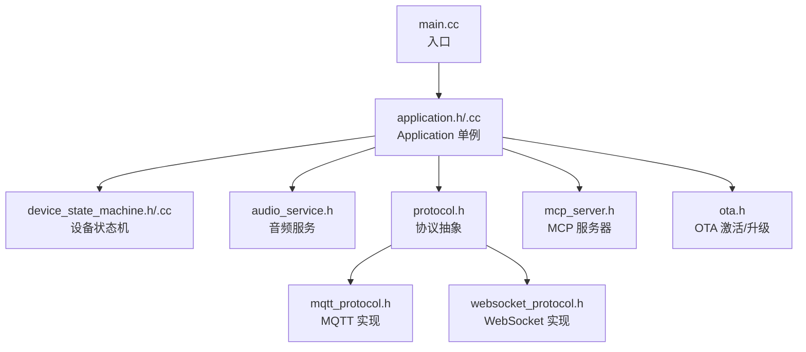
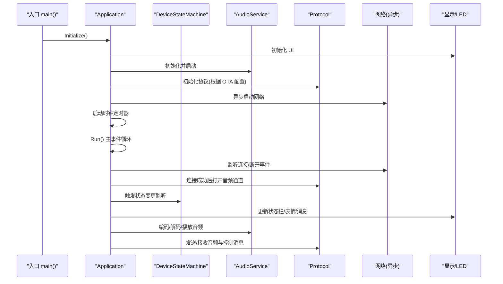
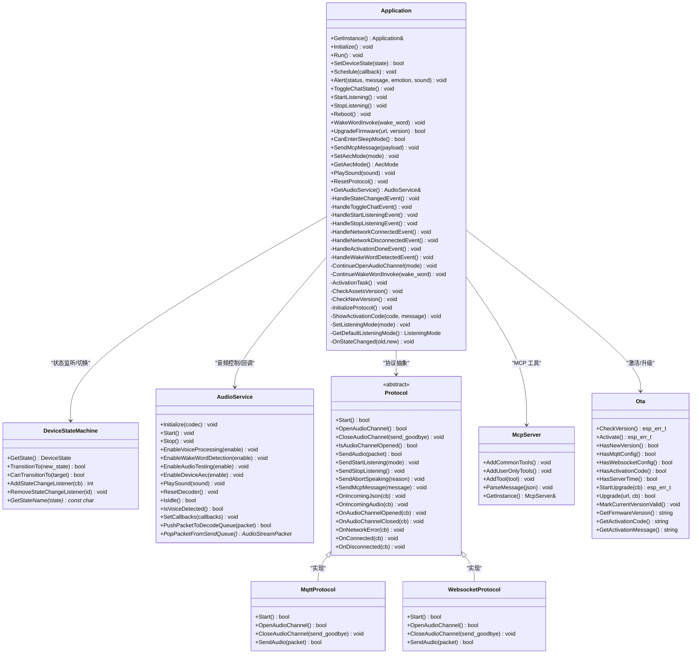
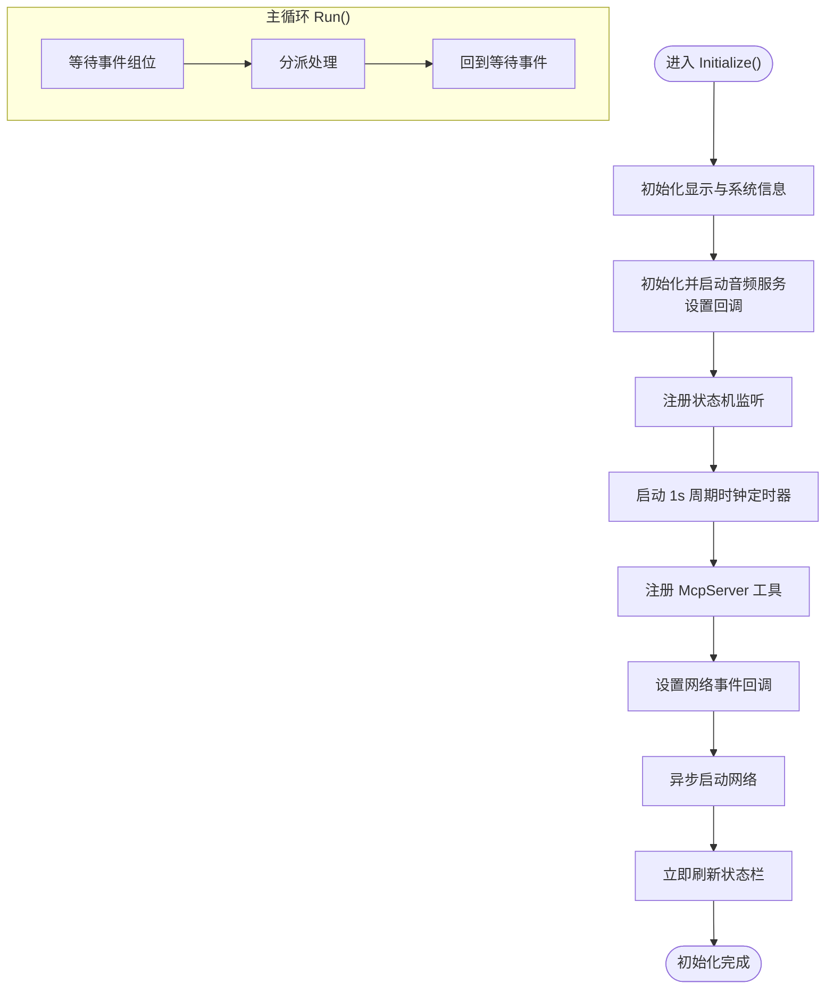
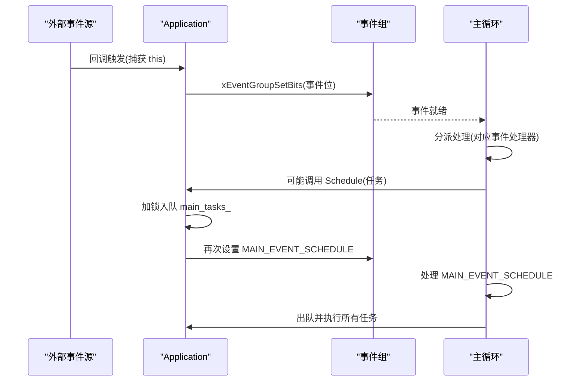
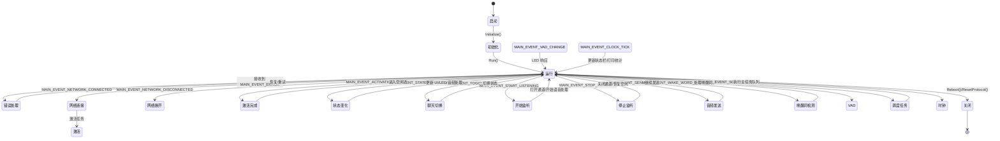
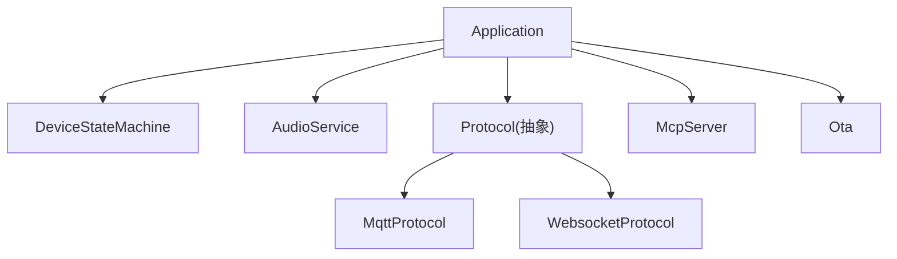

# 应用框架设计

<cite>
**本文档引用的文件**
- [main.cc](file://main/main.cc)
- [application.h](file://main/application.h)
- [application.cc](file://main/application.cc)
- [device_state.h](file://main/device_state.h)
- [device_state_machine.h](file://main/device_state_machine.h)
- [device_state_machine.cc](file://main/device_state_machine.cc)
- [audio_service.h](file://main/audio/audio_service.h)
- [protocol.h](file://main/protocols/protocol.h)
- [mqtt_protocol.h](file://main/protocols/mqtt_protocol.h)
- [websocket_protocol.h](file://main/protocols/websocket_protocol.h)
- [mcp_server.h](file://main/mcp_server.h)
- [ota.h](file://main/ota.h)
</cite>

## 目录
1. [简介](#简介)
2. [项目结构](#项目结构)
3. [核心组件](#核心组件)
4. [架构总览](#架构总览)
5. [详细组件分析](#详细组件分析)
6. [依赖关系分析](#依赖关系分析)
7. [性能考虑](#性能考虑)
8. [故障排查指南](#故障排查指南)
9. [结论](#结论)
10. [附录](#附录)

## 简介
本文件系统性阐述 XiaoZhi ESP32 项目中 Application 单例类的应用框架设计与实现要点，重点覆盖以下方面：
- Application 作为系统协调中心的职责与设计原则
- 应用初始化流程、子系统启动顺序与依赖关系
- 事件驱动架构（事件组、回调调度）的实现与使用
- 线程安全设计（互斥锁、跨任务通信）
- 生命周期管理（启动、运行、关闭）
- 与核心组件（AudioService、Protocol、DeviceStateMachine、McpServer、Ota 等）的集成方式
- 实用的集成指南与最佳实践

## 项目结构
Application 位于 main 目录，围绕其构建了完整的事件驱动与状态机协作体系，并通过 Protocol 抽象对接多种网络协议（MQTT/WebSocket），通过 AudioService 提供音频采集、编码、解码与播放，通过 DeviceStateMachine 管理设备状态流转，通过 McpServer 提供 MCP 工具能力，通过 Ota 完成激活与固件升级。

图表来源
- [main.cc](file://main/main.cc#L15-L30)
- [application.h](file://main/application.h#L42-L172)
- [device_state_machine.h](file://main/device_state_machine.h#L17-L81)
- [audio_service.h](file://main/audio/audio_service.h#L105-L193)
- [protocol.h](file://main/protocols/protocol.h#L44-L95)
- [mqtt_protocol.h](file://main/protocols/mqtt_protocol.h#L26-L62)
- [websocket_protocol.h](file://main/protocols/websocket_protocol.h#L13-L32)
- [mcp_server.h](file://main/mcp_server.h#L314-L342)
- [ota.h](file://main/ota.h#L10-L56)

章节来源
- [main.cc](file://main/main.cc#L15-L30)
- [application.h](file://main/application.h#L42-L172)

## 核心组件
- Application 单例：系统协调中心，负责初始化、事件循环、状态切换、跨组件调度与资源管理。
- DeviceStateMachine：严格的状态机，保证状态转换合法性并提供监听回调。
- AudioService：音频输入/输出、编码/解码、唤醒词检测、语音处理与队列管理。
- Protocol 抽象及其实现：统一音频通道打开/关闭、消息收发接口，支持 MQTT/WebSocket。
- McpServer：MCP 工具注册与调用，解析并执行来自远端的工具请求。
- Ota：版本检查、激活、固件升级与配置下发。

章节来源
- [application.h](file://main/application.h#L42-L172)
- [device_state_machine.h](file://main/device_state_machine.h#L17-L81)
- [audio_service.h](file://main/audio/audio_service.h#L105-L193)
- [protocol.h](file://main/protocols/protocol.h#L44-L95)
- [mcp_server.h](file://main/mcp_server.h#L314-L342)
- [ota.h](file://main/ota.h#L10-L56)

## 架构总览
Application 将各子系统以“事件驱动 + 状态机”的方式耦合在一起：外部事件（网络、音频、定时器、用户交互）通过 FreeRTOS 事件组触发；主循环按位掩码分派到对应处理器；状态机确保状态变更有序且可验证；跨任务通信通过队列与互斥锁保障线程安全。

图表来源
- [main.cc](file://main/main.cc#L26-L29)
- [application.cc](file://main/application.cc#L61-L163)
- [application.cc](file://main/application.cc#L165-L259)
- [application.cc](file://main/application.cc#L261-L338)

## 详细组件分析

### Application 单例类
- 设计理念
  - 单例模式避免全局共享带来的复杂性，同时提供统一的系统协调点。
  - 事件驱动：通过 FreeRTOS 事件组聚合多源事件，主循环集中处理，降低竞态与复杂度。
  - 线程安全：跨任务调度采用互斥锁保护任务队列，事件触发使用事件组原子位操作。
  - 生命周期：从 Initialize 到 Run 的完整闭环，支持重启、升级、重置协议等操作。
- 关键职责
  - 初始化：显示、音频、网络回调、状态机监听、MCP 工具注册、时钟定时器。
  - 运行：事件等待与分派、状态变更处理、音频通道管理、协议回调处理、UI 更新。
  - 调度：Schedule 将任意任务安全地在主任务上下文执行。
  - 资源管理：协议重置、重启、升级、睡眠判断。
- 事件组与回调
  - 事件位定义覆盖调度、音频发送、唤醒词检测、VAD 变化、错误、激活完成、时钟、网络连接/断开、聊天切换、开始/停止监听、状态变化等。
  - 多处回调通过 lambda 捕获 this 并设置事件位，形成“外部事件 → 事件位 → 主循环处理”的链路。
- 线程安全
  - 任务队列 main_tasks_ 使用 std::mutex 保护，配合事件组通知主循环批量执行。
  - 重要临界区（如协议重置、AEC 模式切换、升级）均通过 Schedule 在主任务执行，避免跨任务并发访问共享资源。
- 与核心组件集成
  - 与 DeviceStateMachine：通过 AddStateChangeListener 注册监听，在状态变化时更新 UI、音频处理开关与 LED。
  - 与 AudioService：设置回调（发送队列可用、唤醒词检测、VAD 变化）、启动/停止、播放声音、启用/禁用语音处理与唤醒词检测。
  - 与 Protocol：根据 OTA 配置选择 MQTT 或 WebSocket，注册连接/断开、音频通道开启/关闭、错误回调，处理 JSON 控制消息（TTS/STT/LLM/MCP/System）。
  - 与 McpServer：初始化阶段注册通用与用户专用工具，运行期解析并执行远端 MCP 消息。
  - 与 Ota：激活流程中检查版本、下载/应用资源、选择协议、标记当前版本有效。

图表来源
- [application.h](file://main/application.h#L42-L172)
- [device_state_machine.h](file://main/device_state_machine.h#L17-L81)
- [audio_service.h](file://main/audio/audio_service.h#L105-L193)
- [protocol.h](file://main/protocols/protocol.h#L44-L95)
- [mqtt_protocol.h](file://main/protocols/mqtt_protocol.h#L26-L62)
- [websocket_protocol.h](file://main/protocols/websocket_protocol.h#L13-L32)
- [mcp_server.h](file://main/mcp_server.h#L314-L342)
- [ota.h](file://main/ota.h#L10-L56)

章节来源
- [application.h](file://main/application.h#L42-L172)
- [application.cc](file://main/application.cc#L23-L55)
- [application.cc](file://main/application.cc#L61-L163)
- [application.cc](file://main/application.cc#L165-L259)

### 初始化流程与启动顺序
- 入口 main() 调用 Application::GetInstance()，随后依次执行 Initialize() 与 Run()。
- Initialize() 步骤概览：
  - 获取 Board 实例，初始化显示与系统信息。
  - 初始化并启动 AudioService，设置音频回调（发送队列可用、唤醒词检测、VAD 变化）。
  - 注册状态机监听，用于 UI 与 LED 响应。
  - 启动时钟定时器（周期 1 秒）。
  - 注册 McpServer 的通用与用户专用工具。
  - 设置网络事件回调，根据事件更新 UI 并设置相应事件位。
  - 异步启动网络。
  - 立即刷新状态栏。
- Run() 主事件循环：
  - 等待事件组中的任一事件位被置位。
  - 分派处理：错误、网络连接/断开、激活完成、状态变化、聊天切换、开始/停止监听、音频发送、唤醒词检测、VAD 变化、调度任务、时钟 tick。
  - 在每个事件分支内，按需更新 UI、切换状态、打开/关闭音频通道、处理协议回调与 JSON 消息。

图表来源
- [application.cc](file://main/application.cc#L61-L163)
- [application.cc](file://main/application.cc#L165-L259)

章节来源
- [main.cc](file://main/main.cc#L26-L29)
- [application.cc](file://main/application.cc#L61-L163)
- [application.cc](file://main/application.cc#L165-L259)

### 事件驱动架构与调度机制
- 事件组位
  - 定义了从调度、音频发送、唤醒词检测、VAD 变化、错误、激活完成、时钟、网络连接/断开、聊天切换、开始/停止监听到状态变化的完整事件集。
- 回调调度
  - 外部事件（音频、网络、状态机）通过 lambda 捕获 this 并设置事件位。
  - 主循环按位掩码分派到具体处理器，处理器内部可能再次通过 Schedule 将 UI 更新或资源操作放入主任务执行。
- 跨任务通信
  - 任务队列 main_tasks_ 通过互斥锁保护，使用事件组通知主循环批量取出并执行。
  - 对于需要在主任务上下文执行的操作（如 UI 更新、协议重置、AEC 模式切换），统一通过 Schedule 包装并投递。

图表来源
- [application.h](file://main/application.h#L20-L34)
- [application.cc](file://main/application.cc#L76-L86)
- [application.cc](file://main/application.cc#L239-L246)
- [application.cc](file://main/application.cc#L929-L935)

章节来源
- [application.h](file://main/application.h#L20-L34)
- [application.cc](file://main/application.cc#L76-L86)
- [application.cc](file://main/application.cc#L239-L246)
- [application.cc](file://main/application.cc#L929-L935)

### 线程安全设计
- 互斥锁
  - main_tasks_ 队列使用 std::mutex 保护，避免多个任务同时写入。
  - AudioService 内部存在多处互斥量（如 decoder_mutex_、audio_queue_mutex_、input_resampler_mutex_），用于保护音频队列与重采样器。
- 事件组
  - 事件位设置为原子操作，避免竞态条件。
- 主任务优先
  - 所有涉及共享资源修改的操作（协议重置、AEC 模式切换、升级、重启）均通过 Schedule 在主任务执行，确保串行化。
- 状态机线程安全
  - DeviceStateMachine 使用 std::mutex 保护监听器列表与状态变更通知，回调在 TransitionTo 调用方上下文中触发。

章节来源
- [application.cc](file://main/application.cc#L929-L935)
- [audio_service.h](file://main/audio/audio_service.h#L145-L148)
- [device_state_machine.cc](file://main/device_state_machine.cc#L133-L146)

### 应用生命周期管理
- 启动
  - main() 初始化 NVS，获取 Application 单例，执行 Initialize()，然后进入 Run() 主循环。
- 运行
  - 主循环持续等待事件，处理网络、音频、状态机、UI 等事件，周期性更新状态栏与打印内存统计。
- 关闭
  - Reboot() 流程：关闭音频通道、重置协议、停止音频服务、延时后重启。
  - ResetProtocol()：在主任务中关闭已打开的音频通道并释放协议对象，用于网络异常后的资源回收。

图表来源
- [main.cc](file://main/main.cc#L26-L29)
- [application.cc](file://main/application.cc#L165-L259)
- [application.cc](file://main/application.cc#L954-L965)
- [application.cc](file://main/application.cc#L1109-L1118)

章节来源
- [main.cc](file://main/main.cc#L26-L29)
- [application.cc](file://main/application.cc#L954-L965)
- [application.cc](file://main/application.cc#L1109-L1118)

### 与核心组件的集成方式
- AudioService
  - 初始化与启动：在 Initialize 中完成，设置回调以驱动事件循环。
  - 运行期：Run 循环中处理 SEND_AUDIO 事件，从发送队列弹出包并发送；处理 VAD_CHANGE 事件时更新 LED。
  - 状态联动：状态变化事件中根据新状态启用/禁用语音处理与唤醒词检测。
- Protocol
  - 初始化：根据 OTA 配置选择 MQTT 或 WebSocket，注册连接/断开、音频通道开启/关闭、错误与 JSON 回调。
  - 运行期：音频通道打开后，根据服务器采样率提示进行提示（不匹配可能导致失真）；音频通道关闭后恢复空闲态。
  - JSON 解析：处理 TTS/STT/LLM/MCP/System/custom 等消息类型，分别更新 UI、播放声音、执行 MCP 工具或系统命令。
- DeviceStateMachine
  - 严格的状态转移规则，非法转移会记录警告日志；状态变化时通知监听者，Application 通过事件位触发 UI/LED/音频处理调整。
- McpServer
  - 初始化阶段注册通用与用户专用工具；运行期解析 JSON 消息并执行对应工具，返回结果。
- Ota
  - 激活流程：检查资产版本、检查新版本、下载/应用资产、选择协议、激活、标记当前版本有效。
  - 升级：在升级前关闭音频通道、停止音频服务，升级失败则重启音频服务并继续运行。

章节来源
- [application.cc](file://main/application.cc#L76-L86)
- [application.cc](file://main/application.cc#L220-L226)
- [application.cc](file://main/application.cc#L248-L257)
- [application.cc](file://main/application.cc#L473-L610)
- [application.cc](file://main/application.cc#L855-L927)
- [application.cc](file://main/application.cc#L323-L338)
- [application.cc](file://main/application.cc#L340-L396)
- [application.cc](file://main/application.cc#L398-L471)
- [application.cc](file://main/application.cc#L967-L1017)

### 使用示例与最佳实践
- 正确使用 Application 类
  - 获取单例并初始化：参考入口 main() 的调用方式。
  - 线程安全调用：需要在主任务上下文执行的 UI 更新、协议重置、AEC 模式切换等，统一通过 Schedule 包装。
  - 事件驱动：对外部事件（音频、网络、按键）通过设置事件位触发主循环处理。
  - 状态管理：通过 SetDeviceState 触发状态机转移，避免直接修改内部状态。
- 集成指南
  - 音频：在 Initialize 中设置 AudioService 回调，Run 中处理 SEND_AUDIO/VAD_CHANGE；状态变化时根据新状态启用/禁用语音处理与唤醒词检测。
  - 协议：根据 OTA 配置选择协议实现，注册 JSON 回调以处理远端指令；音频通道开启/关闭时注意电源策略调整。
  - 状态机：为 UI/LED/音频处理添加监听器，确保状态变化时及时响应。
  - MCP：在初始化阶段注册工具，运行期解析消息并执行；注意区分通用与用户专用工具。
  - OTA：在激活任务中完成版本检查、激活与升级；升级前后注意音频通道与服务的启停。

章节来源
- [main.cc](file://main/main.cc#L26-L29)
- [application.cc](file://main/application.cc#L929-L935)
- [application.cc](file://main/application.cc#L855-L927)
- [application.cc](file://main/application.cc#L473-L610)
- [application.cc](file://main/application.cc#L323-L338)

## 依赖关系分析
- 组件耦合
  - Application 与 DeviceStateMachine：强耦合（状态监听与转移）。
  - Application 与 AudioService：强耦合（回调与队列）。
  - Application 与 Protocol：抽象耦合（通过虚接口）。
  - Application 与 McpServer：弱耦合（仅在初始化与运行期解析消息时交互）。
  - Application 与 Ota：弱耦合（激活与升级流程）。
- 外部依赖
  - FreeRTOS（事件组、定时器、任务）。
  - ESP-IDF（网络、存储、日志、JSON、加密等）。
  - 第三方库（MQTT/WebSocket、Opus、AES 等）。

图表来源
- [application.h](file://main/application.h#L14-L18)
- [protocol.h](file://main/protocols/protocol.h#L44-L95)
- [mqtt_protocol.h](file://main/protocols/mqtt_protocol.h#L26-L62)
- [websocket_protocol.h](file://main/protocols/websocket_protocol.h#L13-L32)
- [mcp_server.h](file://main/mcp_server.h#L314-L342)
- [ota.h](file://main/ota.h#L10-L56)

章节来源
- [application.h](file://main/application.h#L14-L18)
- [protocol.h](file://main/protocols/protocol.h#L44-L95)

## 性能考虑
- 事件驱动与主循环
  - 将耗时操作（如网络请求、升级）放在后台任务中执行，仅通过事件位与 Schedule 通知主循环，避免阻塞主循环。
- 音频队列与帧长
  - Opus 帧时长与队列长度配置影响延迟与稳定性，需结合硬件能力与网络状况调优。
- 功耗管理
  - 音频通道开启/关闭时切换电源保存等级，避免不必要的功耗。
- 日志与调试
  - 定时器每 10 秒打印堆内存统计，便于定位内存泄漏或碎片问题。

## 故障排查指南
- 网络连接异常
  - 观察 MAIN_EVENT_NETWORK_CONNECTED/MAIN_EVENT_NETWORK_DISCONNECTED 是否按预期触发；检查协议 OnNetworkError 回调是否设置错误事件位。
- 唤醒词检测无效
  - 确认 AudioService 的唤醒词检测已启用；在监听态可根据配置决定是否启用唤醒词检测。
- 音频通道无法打开
  - 检查协议实现的 Start/OpenAudioChannel 返回值；确认服务器采样率与设备输出采样率一致。
- 升级失败
  - 查看升级回调进度与速度；升级失败后会重启音频服务并继续运行，注意 UI 提示与日志。
- 状态机异常
  - 若出现非法状态转移日志，检查调用方是否直接调用 TransitionTo 导致越界；应通过 Application 的状态切换接口。

章节来源
- [application.cc](file://main/application.cc#L493-L496)
- [application.cc](file://main/application.cc#L504-L510)
- [application.cc](file://main/application.cc#L967-L1017)
- [device_state_machine.cc](file://main/device_state_machine.cc#L116-L121)

## 结论
Application 单例通过事件驱动与状态机实现了清晰的系统协调，结合 AudioService、Protocol、McpServer、Ota 等核心组件，构建了稳定、可扩展的 ESP32 应用框架。遵循本文的最佳实践与集成指南，可在保证线程安全的前提下高效扩展功能。

## 附录
- 关键事件位定义与用途
  - 调度、音频发送、唤醒词检测、VAD 变化、错误、激活完成、时钟、网络连接/断开、聊天切换、开始/停止监听、状态变化。
- 状态机状态枚举
  - unknown/starting/wifi_configuring/idle/connecting/listening/speaking/upgrading/activating/audio_testing/fatal_error。
- 监听模式
  - AutoStop/ManualStop/Realtime（受 AEC 模式影响）。

章节来源
- [application.h](file://main/application.h#L20-L34)
- [device_state.h](file://main/device_state.h#L4-L16)
- [application.h](file://main/application.h#L36-L40)