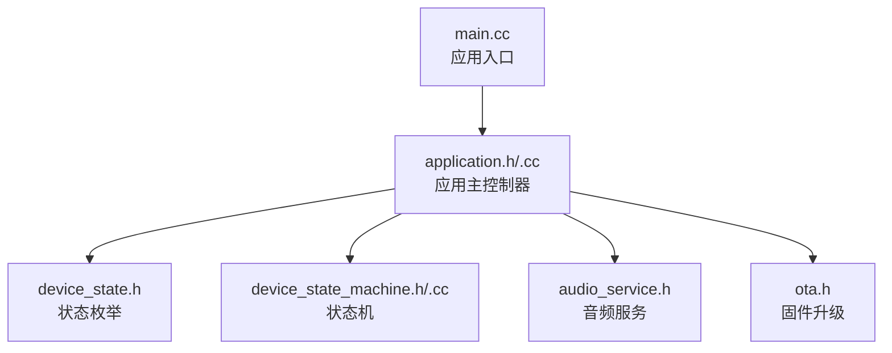
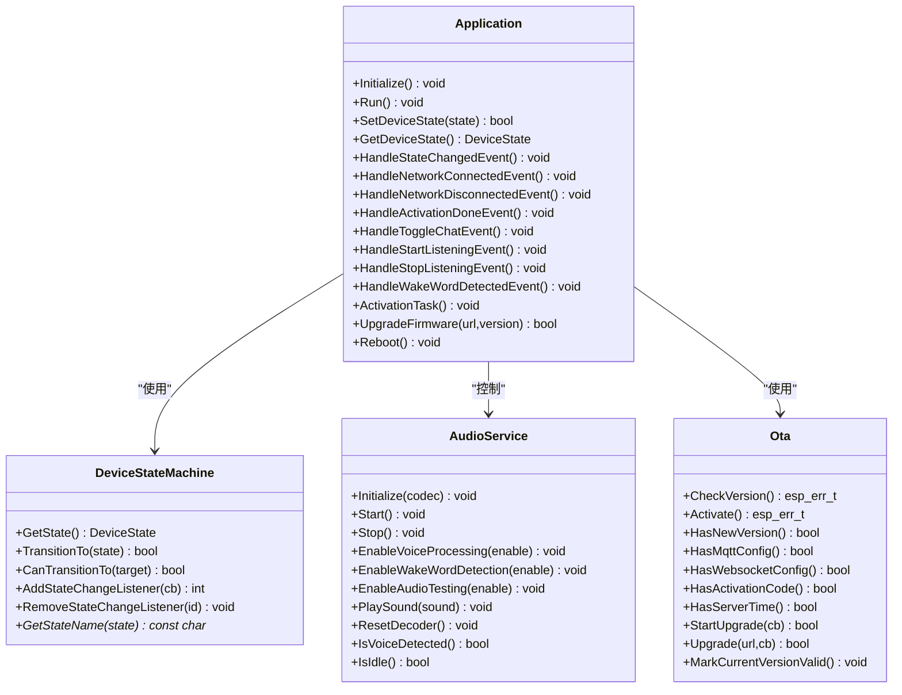
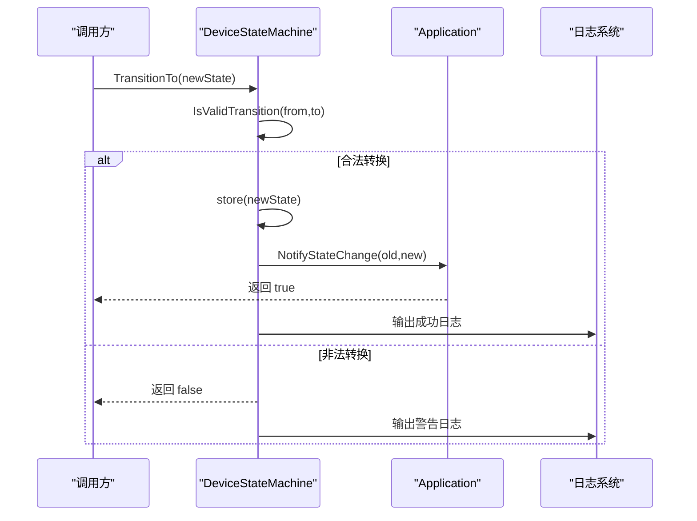
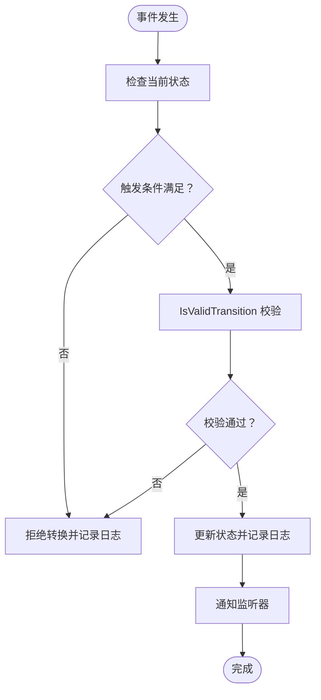
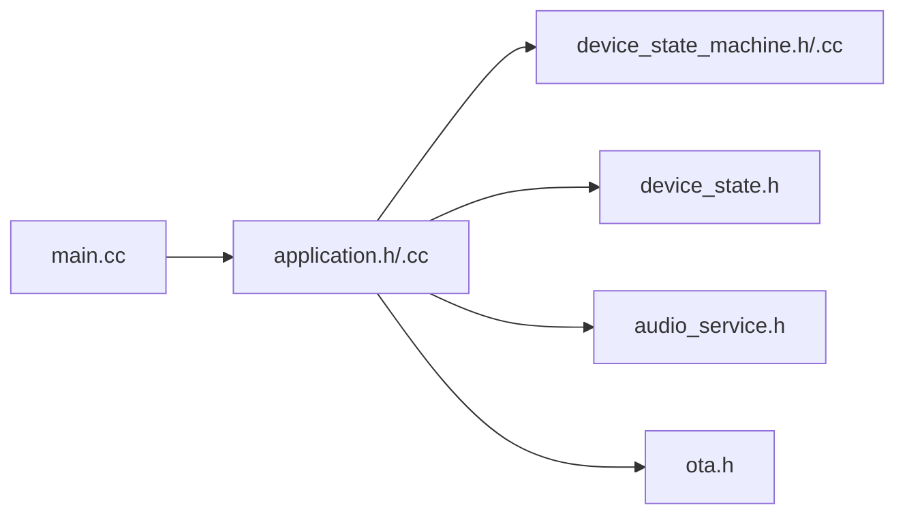

# 状态管理系统

<cite>
**本文档引用的文件**
- [device_state_machine.h](file://main/device_state_machine.h)
- [device_state_machine.cc](file://main/device_state_machine.cc)
- [device_state.h](file://main/device_state.h)
- [application.h](file://main/application.h)
- [application.cc](file://main/application.cc)
- [audio_service.h](file://main/audio/audio_service.h)
- [ota.h](file://main/ota.h)
- [main.cc](file://main/main.cc)
</cite>

## 目录
1. [简介](#简介)
2. [项目结构](#项目结构)
3. [核心组件](#核心组件)
4. [架构总览](#架构总览)
5. [详细组件分析](#详细组件分析)
6. [依赖关系分析](#依赖关系分析)
7. [性能考虑](#性能考虑)
8. [故障排查指南](#故障排查指南)
9. [结论](#结论)

## 简介
本文件为 XiaoZhi ESP32 项目的状态管理系统提供全面技术文档，重点围绕 DeviceStateMachine 的设计原理与实现机制展开，涵盖状态转换规则、生命周期、事件驱动的转换逻辑、状态持久化与重启恢复、状态监控与调试、以及与音频处理、网络通信等系统组件的交互方式。文档同时提供状态机图表与转换表，帮助读者快速理解复杂的状态关系与异常处理策略。

## 项目结构
状态管理相关代码主要集中在 main 目录下：
- 设备状态枚举与状态机：device_state.h、device_state_machine.h/.cc
- 应用主控制器：application.h/.cc
- 音频服务：audio/audio_service.h
- 固件升级：ota.h
- 入口程序：main.cc

**图表来源**
- [main.cc](file://main/main.cc#L15-L30)
- [application.h](file://main/application.h#L42-L172)
- [application.cc](file://main/application.cc#L61-L163)
- [device_state.h](file://main/device_state.h#L4-L16)
- [device_state_machine.h](file://main/device_state_machine.h#L17-L81)
- [audio_service.h](file://main/audio/audio_service.h#L105-L195)
- [ota.h](file://main/ota.h#L10-L56)

**章节来源**
- [main.cc](file://main/main.cc#L15-L30)
- [application.h](file://main/application.h#L42-L172)
- [application.cc](file://main/application.cc#L61-L163)

## 核心组件
- 设备状态枚举（DeviceState）：定义了完整的设备状态集合，包括未知、启动中、WiFi 配置、空闲、连接中、监听、说话、升级中、激活中、音频测试、致命错误等。
- 状态机（DeviceStateMachine）：提供严格的状态转换验证、回调通知、线程安全的监听器管理。
- 应用主控制器（Application）：负责状态机的使用、事件驱动的状态切换、与协议层、音频服务、OTA 的交互。
- 音频服务（AudioService）：提供音频采集、编码、解码、播放、唤醒词检测等功能，直接影响监听与说话状态的行为。
- 固件升级（Ota）：负责版本检查、激活流程、升级下载与执行，影响激活中与升级中的状态流转。

**章节来源**
- [device_state.h](file://main/device_state.h#L4-L16)
- [device_state_machine.h](file://main/device_state_machine.h#L17-L81)
- [application.h](file://main/application.h#L42-L172)
- [audio_service.h](file://main/audio/audio_service.h#L105-L195)
- [ota.h](file://main/ota.h#L10-L56)

## 架构总览
状态机位于应用主控制器之下，应用通过事件驱动的方式触发状态转换；状态变化会通知监听器（主要是应用主循环），应用据此调整显示、音频、网络等子系统行为。

**图表来源**
- [device_state_machine.h](file://main/device_state_machine.h#L17-L81)
- [application.h](file://main/application.h#L42-L172)
- [audio_service.h](file://main/audio/audio_service.h#L105-L195)
- [ota.h](file://main/ota.h#L10-L56)

## 详细组件分析

### DeviceStateMachine 设计与实现
- 原子状态存储：使用原子类型保存当前状态，保证多任务环境下的可见性与一致性。
- 转换验证：在每次转换前调用 IsValidTransition 进行合法性校验，非法转换会被记录日志并拒绝。
- 观察者模式：支持动态添加/移除状态变化监听器，回调在 TransitionTo 的调用上下文中触发，确保状态变化与后续处理的时序可控。
- 线程安全：监听器列表与通知过程均采用互斥锁保护，避免并发访问问题。
- 日志输出：转换成功与失败都会输出日志，便于调试与审计。

**图表来源**
- [device_state_machine.cc](file://main/device_state_machine.cc#L108-L131)
- [device_state_machine.cc](file://main/device_state_machine.cc#L148-L161)

**章节来源**
- [device_state_machine.h](file://main/device_state_machine.h#L17-L81)
- [device_state_machine.cc](file://main/device_state_machine.cc#L24-L161)

### 状态定义与含义
- unknown：初始状态，仅允许进入 starting。
- starting：启动阶段，可进入 wifi_configuring 或 activating。
- wifi_configuring：WiFi 配置阶段，可进入 activating 或 audio_testing。
- idle：空闲态，可进入 connecting、listening（手动）、speaking、activating、upgrading、wifi_configuring。
- connecting：建立音频通道中，成功则进入 listening，失败回到 idle。
- listening：监听态，可进入 speaking 或 idle。
- speaking：说话态，可进入 listening 或 idle。
- upgrading：升级中，失败回到 idle，成功回到 activating。
- activating：激活中，可进入 upgrading、idle 或 wifi_configuring（错误）。
- audio_testing：音频测试态，返回 wifi_configuring。
- fatal_error：致命错误态，不可再转换。

**章节来源**
- [device_state.h](file://main/device_state.h#L4-L16)
- [device_state_machine.cc](file://main/device_state_machine.cc#L40-L102)

### 状态转换规则与触发条件
- 事件驱动：
  - 网络连接事件：连接成功后进入 activating，随后根据资产与版本检查决定是否进入 upgrading 或 idle。
  - 断网事件：若处于 connecting/listening/speaking，关闭音频通道。
  - 激活完成事件：进入 idle 并播放成功提示音。
  - 切换聊天事件：在不同状态间进行切换，如从 activating 回到 idle，或从 wifi_configuring 进入/退出 audio_testing。
  - 开始/停止监听事件：根据当前状态打开/关闭音频通道或发送停止命令。
  - 唤醒词检测事件：在 idle 时触发连接与开始监听；在 listening/speaking 时中断并重新开始监听。
- 内部状态机约束：所有转换必须满足 IsValidTransition 的规则，否则被拒绝。

**图表来源**
- [application.cc](file://main/application.cc#L184-L258)
- [application.cc](file://main/application.cc#L674-L774)
- [application.cc](file://main/application.cc#L776-L820)
- [device_state_machine.cc](file://main/device_state_machine.cc#L108-L131)

**章节来源**
- [application.cc](file://main/application.cc#L184-L258)
- [application.cc](file://main/application.cc#L674-L774)
- [application.cc](file://main/application.cc#L776-L820)
- [device_state_machine.cc](file://main/device_state_machine.cc#L108-L131)

### 状态机生命周期
- 初始化：应用启动后设置状态为 starting，随后根据网络事件与激活流程推进到 activating/idle/upgrading。
- 运行期：主循环持续监听事件位，按事件处理函数更新状态机与各子系统。
- 关闭/重启：通过 Reboot 关闭音频通道并重启系统；升级流程失败时会回退到正常运行状态。

**章节来源**
- [application.cc](file://main/application.cc#L61-L163)
- [application.cc](file://main/application.cc#L954-L965)
- [application.cc](file://main/application.cc#L967-L1017)

### 状态持久化与重启恢复
- 当前实现未发现对设备状态进行非易失性存储的代码路径。状态在运行时由 DeviceStateMachine 原子变量维护，重启后默认从 unknown 状态开始，随后由应用初始化流程推进到 starting。
- 若需持久化，建议在 NVS 中保存关键状态并在启动时恢复，但当前仓库未包含该实现。

**章节来源**
- [device_state_machine.h](file://main/device_state_machine.h#L67-L67)
- [main.cc](file://main/main.cc#L17-L24)

### 状态监控与调试
- 日志记录：状态机在转换成功与失败时分别输出信息与警告日志，便于定位非法转换。
- 监听器回调：应用通过 AddStateChangeListener 注册回调，在状态变化时刷新 UI、LED、音频处理开关等。
- 主循环事件：应用主循环基于 FreeRTOS 事件组等待各类事件，确保状态变化与 UI 更新的时序一致。

**章节来源**
- [device_state_machine.cc](file://main/device_state_machine.cc#L118-L126)
- [application.cc](file://main/application.cc#L88-L91)
- [application.cc](file://main/application.cc#L165-L258)

### 与音频处理的交互
- 监听态：开启语音处理与唤醒词检测（受配置影响），必要时等待播放队列清空以避免截断。
- 说话态：关闭语音处理（实时模式除外），启用唤醒词检测（仅 AFE 唤醒词）。
- 唤醒词检测：在 idle 时触发连接与开始监听；在 listening/speaking 时中断并重新开始监听。
- 音频测试：在 wifi_configuring 与 audio_testing 之间切换，用于校验音频链路。

**章节来源**
- [application.cc](file://main/application.cc#L855-L927)
- [application.cc](file://main/application.cc#L776-L820)
- [audio_service.h](file://main/audio/audio_service.h#L105-L195)

### 与网络通信的交互
- 协议初始化：根据 OTA 配置选择 MQTT 或 WebSocket，注册连接、错误、音频通道开闭、消息解析等回调。
- 连接/断开：连接成功后进入激活流程；断开时关闭音频通道并更新 UI。
- 消息处理：接收 TTS/STT/LLM/MCP/System 等消息，驱动 UI 与音频播放。

**章节来源**
- [application.cc](file://main/application.cc#L261-L297)
- [application.cc](file://main/application.cc#L473-L610)

### 与固件升级的交互
- 版本检查：在激活完成后轮询检查新版本，失败重试并指数退避。
- 升级流程：下载进度通过回调更新 UI，升级成功立即重启，失败则回退到正常运行状态。
- 激活流程：下载资产、检查版本、激活设备，完成后进入 idle。

**章节来源**
- [application.cc](file://main/application.cc#L398-L471)
- [application.cc](file://main/application.cc#L967-L1017)
- [ota.h](file://main/ota.h#L15-L33)

## 依赖关系分析
- Application 依赖 DeviceStateMachine 提供状态转换能力。
- Application 依赖 AudioService 控制音频输入/输出与处理。
- Application 依赖 Ota 执行版本检查与升级。
- DeviceStateMachine 依赖 DeviceState 定义状态集合。
- main.cc 作为入口，初始化 NVS 并启动 Application。

**图表来源**
- [main.cc](file://main/main.cc#L15-L30)
- [application.h](file://main/application.h#L123-L172)
- [device_state_machine.h](file://main/device_state_machine.h#L17-L81)
- [device_state.h](file://main/device_state.h#L4-L16)
- [audio_service.h](file://main/audio/audio_service.h#L105-L195)
- [ota.h](file://main/ota.h#L10-L56)

**章节来源**
- [main.cc](file://main/main.cc#L15-L30)
- [application.h](file://main/application.h#L123-L172)

## 性能考虑
- 状态转换验证与日志输出均为轻量操作，不会引入显著开销。
- 监听器回调在状态机内部复制一份回调列表，避免在回调中修改列表导致的竞态。
- 主循环使用事件组等待，避免忙轮询，降低 CPU 占用。
- 音频处理在独立任务中运行，状态变化时通过事件与回调协调，减少阻塞。

[本节为通用性能讨论，不直接分析具体文件]

## 故障排查指南
- 非法状态转换：
  - 现象：转换被拒绝并记录警告日志。
  - 排查：检查触发源是否符合状态机规则；确认事件处理顺序是否正确。
- 状态未更新：
  - 现象：UI/LED/音频未响应状态变化。
  - 排查：确认监听器已注册；检查事件是否正确设置；查看状态变化回调是否被执行。
- 网络异常：
  - 现象：连接失败、断开、协议错误。
  - 排查：查看网络事件回调与协议回调；确认激活流程是否完成；检查 OTA 配置。
- 升级失败：
  - 现象：升级失败后回退到正常运行。
  - 排查：查看升级回调与错误日志；确认网络连通性与固件 URL 可达性。

**章节来源**
- [device_state_machine.cc](file://main/device_state_machine.cc#L118-L120)
- [application.cc](file://main/application.cc#L184-L258)
- [application.cc](file://main/application.cc#L473-L610)
- [application.cc](file://main/application.cc#L967-L1017)

## 结论
DeviceStateMachine 通过严格的转换规则与观察者回调，为 XiaoZhi ESP32 的设备状态管理提供了清晰、可维护的基础设施。Application 将事件驱动与状态机结合，实现了与音频、网络、升级等子系统的协同工作。当前实现未包含状态持久化，重启后从初始状态开始，若需要长期状态保持，可在 NVS 中扩展持久化方案。整体架构具备良好的扩展性与可观测性，适合进一步增强状态监控与异常恢复能力。